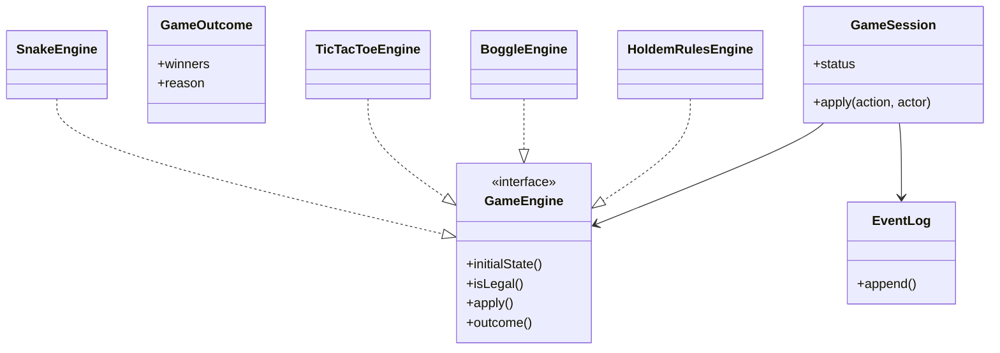
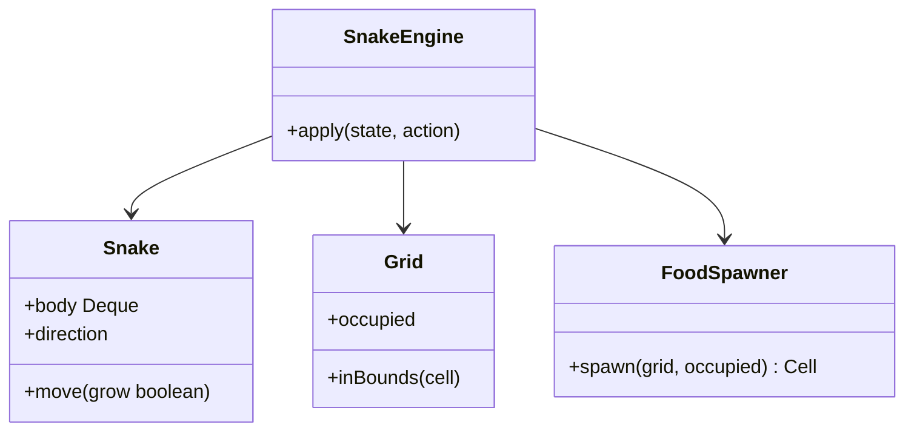
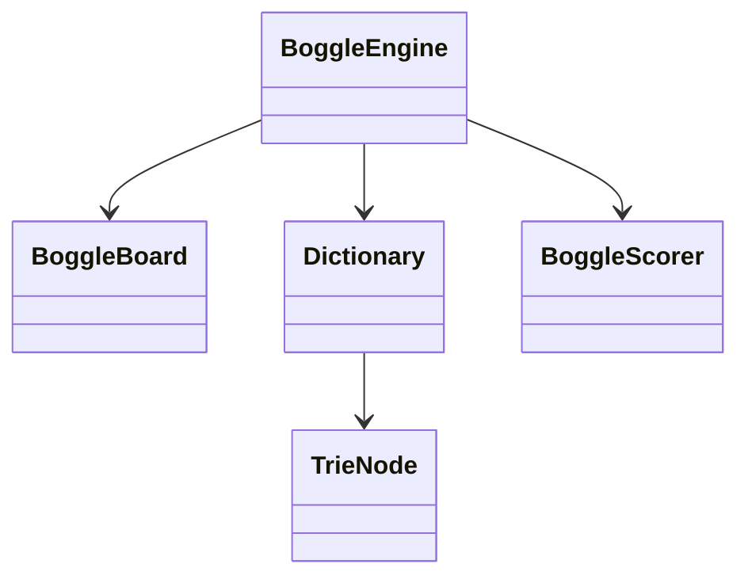
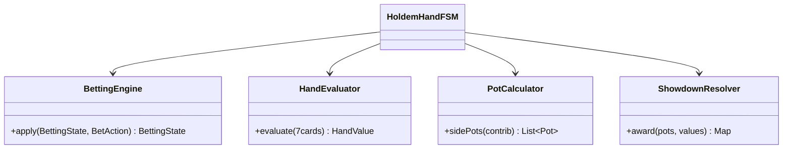

# OOD: Classic Games (Snake · Tic-Tac-Toe · Boggle · Poker Rules)

> **Focus areas:** Shared game-engine patterns · Per-game domain models · State machines · Rules isolation · Extensibility  
> **Style:** Amazon SDE III / L6+ — one doc with **shared patterns** + **sections per game**; LLD/OOD over fleet HLD  
> **Quality bar:** Clear boards/entities, legal-move APIs, testable pure rules, reuse of deck primitives for poker  
> **Related:** [deck-of-cards-lld-system-design.md](./deck-of-cards-lld-system-design.md), [online-poker-system-design.md](./online-poker-system-design.md), [multiplayer-chess-game-system-design.md](./multiplayer-chess-game-system-design.md)

---

## Table of Contents

1. [Clarify Requirements (Interview Q&A)](#1-clarify-requirements-interview-qa)
2. [Shared Patterns & Framework](#2-shared-patterns--framework)
3. [Snake](#3-snake)
4. [Tic-Tac-Toe](#4-tic-tac-toe)
5. [Boggle](#5-boggle)
6. [Poker Rules Modeling](#6-poker-rules-modeling)
7. [Cross-Game Concurrency & Testing](#7-cross-game-concurrency--testing)
8. [Extensibility](#8-extensibility)
9. [Design Deep Dive](#9-design-deep-dive)
10. [Wrap-Up](#10-wrap-up)
11. [Deeper / Related Interview Questions](#11-deeper--related-interview-questions)
12. [Appendices](#12-appendices)

---

## 1. Clarify Requirements (Interview Q&A)

Goal: **show you can model multiple classic games** with clean OO boundaries—and extract a thin shared “game engine” pattern—without building a full Unity/Roblox platform.

### 1.0 What this is / is not

| Dimension | **Classic games OOD** | Not this |
|-----------|----------------------|----------|
| Primary job | Rules + state + legal actions | Matchmaking fleet, CDN assets |
| Success | Correct win/lose/draw; extensible games | Pixel-perfect rendering |
| Poker here | Hand ranking + betting round **rules objects** | Full online multiplayer (sibling doc) |

**Scope statement:** OOD for Snake, Tic-Tac-Toe, Boggle, and poker rules (hand eval + betting rounds), plus shared `GameSession` / `GameEngine` patterns.

### 1.1 Functional matrix

| Game | Players | State | Core ops | End condition |
|------|---------|-------|----------|---------------|
| Snake | 1 (+optional) | Grid, snake body, food | tick/dir | Hit wall/self |
| Tic-Tac-Toe | 2 | 3×3 board | place mark | 3-in-row / draw |
| Boggle | 1..N | 4×4 letter grid | submit word | Timer ends; score |
| Poker rules | 2..N | Hole+board+pots | bet actions; eval | Showdown / fold |

### 1.2 Interviewer questions to ask

| # | Question | Typical answer |
|---|----------|----------------|
| Q1 | All four games or pick one deep? | Shared framework + each sketched; deepen one |
| Q2 | Real-time snake tick rate? | Fixed tick; input queue |
| Q3 | Boggle dictionary? | Trie from word list |
| Q4 | Poker variant? | Texas Hold’em rules objects |
| Q5 | Multiplayer networking? | Interfaces only; poker online is separate |

### 1.3 NFRs (shared)

| NFR | Target |
|-----|--------|
| Rules purity | Deterministic; no I/O in evaluators |
| Testability | Table-driven legal moves / scores |
| Extensibility | New game = new engine impl |
| Perf | Boggle DFS + trie prune; poker eval microseconds |
| Clarity | Board ≠ UI |

---

## 2. Shared Patterns & Framework

### 2.1 Core interfaces

```text
interface GameEngine<S, A, R> {
  S initialState(GameConfig config)
  boolean isLegal(S state, A action, PlayerId actor)
  ResultApply<S, R> apply(S state, A action, PlayerId actor)  // throws if illegal
  Optional<GameOutcome> outcome(S state)
  SView viewFor(S state, PlayerId viewer)  // hide secret info
}

interface GameSession {
  gameId
  engineId / version
  players[]
  state
  status: LOBBY | IN_PROGRESS | FINISHED
  apply(action, actor)
  events[]
}
```

### 2.2 Mermaid (shared)



### 2.3 Patterns reused

| Pattern | Use |
|---------|-----|
| Strategy | Engine per game |
| State | Session status; snake direction |
| Command | Player actions |
| Observer | UI / socket adapters |
| Memento | Undo (TTT optional) |
| Composite | Poker side pots |
| Interpreter/Trie | Boggle dictionary |

### 2.4 What stays out of engines

- Matchmaking, ratings, payments, chat.  
- Rendering.  
- Persistence adapters (port: `GameRepository`).

### 2.5 Scales (light)

| Concern | Local / interview | Productized |
|---------|-------------------|-------------|
| Sessions | 1 process | Shard by gameId |
| Snake tick | 10–15 Hz | Server authority or client predict |
| Boggle | One board | Concurrent submit under lock |
| Poker rules | Pure CPU | Called from table service |

---

## 3. Snake

### 3.1 Requirements

- Grid `W×H`.  
- Snake as ordered body cells; head moves each tick.  
- Food spawns on empty cell.  
- Eat → grow (skip tail shrink once).  
- Collision wall/self → death.  
- Input: change direction (not instant 180° unless allowed).

### 3.2 Classes

```text
SnakeGameState
 ├── Grid {w,h}
 ├── Snake {Deque<Cell> body, Direction dir, growPending}
 ├── Cell food
 ├── int score
 └── Status ALIVE|DEAD

SnakeAction = ChangeDirection(Direction) | Tick

SnakeEngine
FoodSpawner (Random empty cell)
CollisionDetector
```

### 3.3 Class diagram (Snake)



### 3.4 Tick algorithm

```text
function applyTick(state):
  next = head + state.dir
  if !grid.inBounds(next) or next in body: return DEAD
  body.addFirst(next)
  if next == food:
    score++; growPending logic: do not remove tail
    food = spawner.spawn(...)
  else:
    body.removeLast()
  return ALIVE
```

### 3.5 Direction rules

```text
Opposite map: UP↔DOWN, LEFT↔RIGHT
if newDir == opposite(current) && body.size()>1: ignore
else current = newDir
```

Buffer inputs between ticks: keep **last non-opposite** input.

### 3.6 State machine

```text
ALIVE --collision--> DEAD
ALIVE --tick/eat--> ALIVE (score++)
```

### 3.7 Edge cases

| Case | Behavior |
|------|----------|
| Food nowhere | Win optional / no spawn |
| Tick with no input | Continue |
| Two inputs one tick | Last wins |
| Wrap walls (optional) | Torus mode strategy |

### 3.8 Tests

- Grow length +1 on eat.  
- Self-hit when looping.  
- Reject 180° turn.

---

## 4. Tic-Tac-Toe

### 4.1 Requirements

- 3×3; X starts; alternate.  
- Win: 3 in row; draw: full no winner.  
- Illegal: occupied cell, wrong turn, after end.

### 4.2 Classes

```text
Mark { X, O, EMPTY }
Board { Mark[3][3] }
TicTacToeState { board, nextPlayer, outcome? }
PlaceMark { row, col }
TicTacToeEngine
WinChecker  // rows, cols, diags
```

### 4.3 Apply

```text
function apply(state, PlaceMark(r,c), actor):
  assert outcome empty
  assert actor == nextPlayer
  assert board[r][c] == EMPTY
  board[r][c] = mark(actor)
  if win: outcome = Win(actor)
  else if full: outcome = Draw
  else nextPlayer = other
```

### 4.4 Win check

```text
8 lines: 3 rows, 3 cols, 2 diags
any all equal and non-empty → winner
```

Generalize to N×N k-in-row via strategy (extension).

### 4.5 Minimax hook (optional interview spice)

```text
interface AiPolicy { PlaceMark choose(state) }
MinimaxAi implements AiPolicy  // pure function on state
```

Keep out of core engine.

### 4.6 Diagram

```text
GameSession --> TicTacToeEngine --> Board --> WinChecker
                         |
                         +--> AiPolicy (optional)
```

### 4.7 Edge / cases

| Case | Behavior |
|------|----------|
| Play after win | Reject |
| Same cell twice | Reject |
| X plays twice | Reject turn |

---

## 5. Boggle

### 5.1 Requirements

- 4×4 (or N×N) letter grid; classic dice or random letters.  
- Words ≥3 letters; adjacent incl. diagonal; no cell reuse per word.  
- Score by length; dictionary validity.  
- Multiplayer: shared board, individual scores; timer.

### 5.2 Classes

```text
BoggleBoard { char[][] grid }
Dictionary { TrieNode root; boolean contains(word); boolean hasPrefix(p) }
WordPath { List<Cell> }
BoggleState { board, foundByPlayer: Map<Player,Set<Word>>, timeRemaining }
SubmitWord { word }  // engine verifies path exists + dict
BoggleScorer { points(length) }
BoggleEngine
```

### 5.3 Trie

```text
class TrieNode {
  Map<Character, TrieNode> kids
  boolean terminal
}
```

### 5.4 Word search existence (DFS)

```text
function exists(board, word):
  for each start cell:
    if dfs(start, 0, visited): return true
  return false

function dfs(cell, i, visited):
  if i == word.length: return true
  if out/visited/char mismatch: return false
  if !dict.hasPrefix(word[0..i]): return false  // optional prune when generating
  mark visited
  for n in neighbors8(cell):
    if dfs(n, i+1, visited): return true
  unmark; return false
```

### 5.5 Scoring (classic)

| Length | Score |
|--------|-------|
| 3–4 | 1 |
| 5 | 2 |
| 6 | 3 |
| 7 | 5 |
| 8+ | 11 |

Policy: duplicate word across players → zero for all (common variant)—`ScoringPolicy`.

### 5.6 Timer

```text
Session tick or deadlineTs
on expire: status FINISHED; compute scores
```

### 5.7 Edge cases

| Case | Behavior |
|------|----------|
| Word not on board | Reject |
| Not in dictionary | Reject |
| Reuse cell | Illegal path |
| Same player resubmit | Idempotent set |
| Qu / Qu cell | Model as digraph tile `"Qu"` |

### 5.8 Diagram



---

## 6. Poker Rules Modeling

> Full multiplayer table/HLD: sibling `online-poker-system-design.md`. Here: **pure rules objects**.

### 6.1 Scope

- Texas Hold’em hand ranking.  
- Betting round structure (preflop/flop/turn/river).  
- Pot & side pot calculation.  
- Winner determination among contenders.

### 6.2 Classes

```text
HoleCards, CommunityCards (Board)
HandCategory {
  HIGH_CARD, ONE_PAIR, TWO_PAIR, THREE_KIND,
  STRAIGHT, FLUSH, FULL_HOUSE, FOUR_KIND,
  STRAIGHT_FLUSH, ROYAL_FLUSH
}
HandValue implements Comparable  // category + kickers tiebreakers
HandEvaluator {
  bestOf7(List<Card> seven) -> HandValue
  bestCombination(5+) ...
}

BettingRound { PREFLOP, FLOP, TURN, RIVER, SHOWDOWN }
StreetRules { dealN community; betting }
BetAction { FOLD, CHECK, CALL, BET, RAISE, ALL_IN }
BettingState {
  stacks[], betsStreet[], currentBet, minRaise
  toAct, playersInHand, lastAggressor
}
BettingEngine.apply(action) 
PotCalculator.sidePots(contributions[]) -> List<Pot>
ShowdownResolver.resolve(pots, handValues) -> awards
```

### 6.3 Hand evaluation approach

```text
Given 7 cards: enumerate C(7,5)=21 five-card combos
  score each → max HandValue

HandValue encoding (example):
  bit fields: category (4 bits) | ranks tuple
  OR tuple compare: (category, c1,c2,c3,c4,c5)
```

**Straight / wheel:** A-2-3-4-5; ace low only there.  
**Flush:** 5+ same suit; use top 5 ranks.

### 6.4 Betting invariants

```text
check only if currentBet == myStreetBet
call pays min(stack, currentBet - myStreetBet)
raise to amount >= currentBet + minRaise (except all-in short)
fold removes from contention
when all matched or all-in: street ends
```

### 6.5 Side pots (critical)

```text
Sort all-in contribution levels
Main pot: eligible = all who contributed to level
Side pots: higher layers; short all-in cannot win higher pot
```

Example:

```text
A 100 all-in, B 300, C 300
Pot1=300 (A+B+C 100 each) eligible A,B,C
Pot2=400 (B+C 200 each) eligible B,C
```

### 6.6 Poker rules diagram



### 6.7 Hand FSM (rules level)

```text
START → DEAL_HOLES → PREFLOP_BET → DEAL_FLOP → FLOP_BET
 → DEAL_TURN → TURN_BET → DEAL_RIVER → RIVER_BET → SHOWDOWN → PAYOUT → END
Any street: if one player left → PAYOUT immediate
```

### 6.8 Edge cases

| Case | Behavior |
|------|----------|
| All-in preflop both | Run board no betting |
| Tie same HandValue | Split pot odd chip rule |
| Min raise after all-in short | Reopen rules—**state policy explicitly** |
| Invalid raise size | Reject |

### 6.9 Use deck LLD

`Deck.shuffle` + `Dealer.deal` for holes/board; rules engine consumes `List<Card>` only.

---

## 7. Cross-Game Concurrency & Testing

### 7.1 Concurrency

| Game | Model |
|------|-------|
| Snake | Single session thread / tick lock |
| TTT | Session lock per move |
| Boggle | Lock on submit set; dict read-only shared |
| Poker rules | Pure functions; table service serializes |

### 7.2 Property tests

- TTT: never both winners.  
- Snake: length vs foods eaten.  
- Boggle: accepted word ⇒ path exists ∧ dict.  
- Poker: side pots sum = total chips in.  
- Poker: HandValue total order transitive on samples.

### 7.3 Golden vectors

Keep known poker sevens → category (e.g., royal).  
Boggle boards with listed words.

---

## 8. Extensibility

| Extension | How |
|-----------|-----|
| Connect Four | New engine; board gravity rule |
| Checkers | Engine + crown state |
| Omaha poker | Evaluator uses 4 hole + exactly 2 hole in hand |
| Snake multiplayer | Collision between snakes policy |
| Boggle 5×5 | Board size config + score table |
| Timed TTT | Clock decorator on session |

**Open/Closed:** add engines, don’t modify `GameSession`.

---

## 9. Design Deep Dive

### 9.1 Why one GameEngine interface?

Interview signal: generalize without forcing unnatural shared board. Poker secrets use `viewFor`. Snake has no hidden info.

### 9.2 Hidden information

```text
viewFor(pokerState, player):
  show own holes; hide others; show board; show public bets
```

### 9.3 Versioning rules

```text
engineId = "holdem-rules@1.3.0"
persist with hand for dispute replay
```

### 9.4 Performance poker eval

21 combinations fine. Optimize with bitboards if asked (poker eval libraries)—mention, don’t implement bit-twiddling unless pressed.

### 9.5 Boggle dictionary memory

```text
200K words trie ≈ few MB; share per process
```

### 9.6 Snake authority

Server tick for multiplayer fairness; single-player can client-authoritative for UX—say trade-off.

### 9.7 Illegal action handling

Return `Result.Rejected(reason)` rather than throw for network games; throws OK in pure unit tests.

### 9.8 UML package layout

```text
games.api      // GameEngine, Session
games.snake
games.tictactoe
games.boggle
games.poker.rules
games.poker.cards  // depends deck library
```

### 9.9 Sequence: Boggle submit

```text
Player -> Session.apply(SubmitWord("crane"))
       -> BoggleEngine.isLegal (dict + exists path)
       -> add to found set
       -> emit WordAccepted
```

### 9.10 Sequence: Poker showdown

```text
BettingEngine street complete
 -> if >1 players: deal remaining board if needed
 -> HandEvaluator each player
 -> PotCalculator
 -> ShowdownResolver awards
```

### 9.11 Anti-patterns

- UI widgets inside engine.  
- Snake drawing code in `Snake`.  
- Poker hand eval with string names only (use ranks).  
- Global mutable dictionary mutated per request.

### 9.12 Shared testing harness

```text
EngineConformanceTest<S,A>:
  apply illegal → reject
  outcome terminal ⇒ further apply reject
  serialize/deserialize state roundtrip
```

---

## 10. Wrap-Up

Four games share `GameEngine`/`GameSession` but keep domain models specialized: Snake (deque + tick), TTT (board + win lines), Boggle (trie + DFS), Poker rules (evaluator + betting + side pots). Pure, versioned rules enable tests and later online wrappers.

### Deal-breakers

1. One god `Game` class with `if (type==SNAKE)`.  
2. Poker without side pots when discussing all-ins.  
3. Boggle without cell-reuse constraint.  
4. Mutating shared RNG without seed control in tests.

---

## 11. Deeper / Related Interview Questions

| Q | Strong answer |
|---|---------------|
| Shared framework vs separate? | Thin interface; fat domain per game |
| Implement poker rank | 21 combos; comparable HandValue |
| Side pots | Layer by all-in amounts |
| Boggle optimize | Trie prefix prune; visit bitmask |
| Snake 180° | Ignore opposite when length>1 |
| TTT AI | Minimax on pure state |
| Extend to N×N TTT | WinChecker strategy |
| Hidden cards | viewFor |
| Deterministic replay | Event log + engine version |
| Where networking fits | Session adapter; poker online doc |

### Traps

| Trap | Answer |
|------|--------|
| “Inheritance: Snake extends BoardGame extends …” | Deep hierarchy brittle; prefer engine interface |
| Float scores | Integers |
| Eval poker with only category no kickers | Wrong ties |

---

## 12. Appendices

### A. Per-game class checklists

**Snake:** Grid, Cell, Snake, FoodSpawner, SnakeEngine, Direction  
**TTT:** Board, Mark, WinChecker, TicTacToeEngine, AiPolicy  
**Boggle:** BoggleBoard, Trie Dictionary, BoggleEngine, Scorer, ScoringPolicy  
**Poker:** HandEvaluator, HandValue, BettingEngine, PotCalculator, ShowdownResolver, HoldemHandFSM  

### B. TTT win lines

```text
(0,0)(0,1)(0,2)
(1,0)(1,1)(1,2)
(2,0)(2,1)(2,2)
(0,0)(1,0)(2,0)
(0,1)(1,1)(2,1)
(0,2)(1,2)(2,2)
(0,0)(1,1)(2,2)
(0,2)(1,1)(2,0)
```

### C. Poker category rank order

```text
Royal > StraightFlush > Quads > FullHouse > Flush >
Straight > Trips > TwoPair > Pair > HighCard
```

### D. Boggle neighbor offsets

```text
for dr in -1..1:
  for dc in -1..1:
    if dr||dc: neighbor
```

### E. Sample HandValue compare

```text
compare (cat, ranks...):
  if cat !=: return cat cmp
  else lexicographic ranks
```

### F. 45–60 min plan

| Min | Focus |
|-----|-------|
| 0–8 | Shared engine + pick depth |
| 8–20 | One grid game (TTT or Snake) |
| 20–35 | Boggle trie/DFS or Poker eval |
| 35–50 | Poker betting/side pots if poker track |
| 50–60 | Extensibility + tests |

### G. Invariants summary

| Game | Invariant |
|------|-----------|
| Snake | Body cells unique when ALIVE |
| TTT | \|X-O\| ≤ 1; X count ≥ O |
| Boggle | Word set per player unique |
| Poker | Chips conserved across pots+stacks |

### H. Glossary

| Term | Meaning |
|------|---------|
| Tick | Discrete snake time step |
| Trie | Prefix tree dictionary |
| Kicker | Tiebreak rank in poker |
| Side pot | Pot with eligibility subset |
| Engine version | Rules semantic id |

### I. Rubric

| Signal | Weak | Strong |
|--------|------|--------|
| Structure | One class | Engine per game |
| Poker | Category only | Kickers + side pots |
| Boggle | Nested loops no trie | Trie + DFS visit |
| Reuse | Copy-paste | GameEngine pattern |

### J. Event examples

```text
SnakeFoodEaten, SnakeDied
CellMarked, GameDrawn
WordAccepted, BoggleEnded
BetApplied, StreetAdvanced, PotsAwarded
```

### K. Config knobs

```text
snake: w,h,tickHz
ttt: n,k
boggle: n, minLen, durationSec
poker: smallBlind, bigBlind, maxPlayers  // table config in online doc
```

### L. Relationship map

```text
deck-of-cards LLD ──cards──► poker rules (this doc)
poker rules ──used by──► online-poker system design
GameEngine pattern ──akin──► chess GameEngine in multiplayer-chess doc
```

### M. Sample illegal poker raise

```text
currentBet=100, minRaise=100 → min total bet 200
player to 150 → reject (not all-in)
player all-in 150 → accept short all-in; may not reopen
```

### N. Snake growth subtlety

```text
On eat: move head onto food; do NOT remove tail that tick
Next ticks: normal remove tail unless another eat
```

---

**End of classic-games OOD.** In interview, propose the shared `GameEngine` in 2 minutes, then go deep on the game they care about—side pots and kickers for poker; trie+DFS for Boggle.
