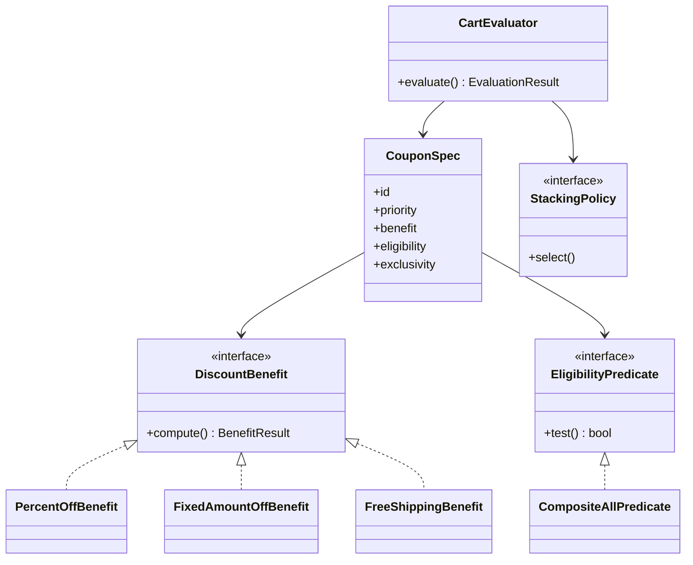

# LLD / OOD: Coupon Class Hierarchy (Stacking)

> **Focus areas:** Coupon type hierarchy · Strategy/Composite stacking · Eligibility · Evaluation order · Deterministic money math  
> **Style:** Amazon SDE III / L6+ — **object design** complement to discounts HLD  
> **Quality bar:** Clear type model, composable stack rules, integer cents, explanation trail  
> **Related HLD:** [discounts-coupons-stacking-system-design.md](./discounts-coupons-stacking-system-design.md)

---

## Table of Contents

1. [Clarify Requirements (Interview Q&A)](#1-clarify-requirements-interview-qa)
2. [Non-Functional Requirements](#2-non-functional-requirements)
3. [Cases (Flows & Edge Cases)](#3-cases-flows--edge-cases)
4. [Object Model & Class Diagrams](#4-object-model--class-diagrams)
5. [APIs / Evaluation Interface](#5-apis--evaluation-interface)
6. [State Machines & Lifecycle](#6-state-machines--lifecycle)
7. [Concurrency Notes](#7-concurrency-notes)
8. [Extensibility & Patterns](#8-extensibility--patterns)
9. [Design Deep Dive](#9-design-deep-dive)
10. [Wrap-Up](#10-wrap-up)
11. [Deeper / Related Interview Questions](#11-deeper--related-interview-questions)
12. [Appendices](#12-appendices)

---

## 1. Clarify Requirements (Interview Q&A)

Goal: **design a class hierarchy / object model for coupons** that supports percent/fixed/BOGO/free-shipping style benefits, eligibility predicates, and **stacking via Strategy + Composite**—the in-process brain behind a promotions service.

### 1.0 What this is / is not

| Dimension | **Coupon class hierarchy LLD** | Not this (HLD sibling) |
|-----------|--------------------------------|-------------------------|
| Primary job | Model + evaluate discounts on a cart | Flash inventory, fraud fleet, CDN |
| Success | Deterministic totals + explanations | Prime Day 5M QPS deep dive |
| Patterns | Strategy, Composite, Chain | Redis counters, cells |

**Scope statement:** OO design for coupon types, eligibility, exclusivity groups, stacking policies, and cart evaluation producing line/cart discounts with audit explanations.

### 1.1 Functional Requirements

| # | Q | Answer | Implication |
|---|---|--------|-------------|
| F1 | Types? | % off, fixed off, free shipping, BOGO | Benefit strategy hierarchy |
| F2 | Scope? | Line / category / cart / shipping | Target selector |
| F3 | Stacking? | Configurable exclusive vs stackable | Composite + policy |
| F4 | Eligibility? | Min spend, SKU, segment, first order | Predicate chain |
| F5 | Codes vs auto? | Both | Coupon vs AutomaticOffer |
| F6 | Order of apply? | Priority + type order | Evaluator pipeline |
| F7 | Output? | New totals + explanation | DiscountApplication list |
| F8 | Caps? | Max discount per coupon | Benefit clamp |
| F9 | Currency? | Integer minor units | Money VO |
| F10 | Combine with shipping? | Free shipping as benefit type | ShippingPrice context |

**MVP:** PercentOff, FixedOff, FreeShipping; eligibility predicates; exclusivity groups; stack evaluator; explanations.  
**Defer:** ML ranker, Turing-complete scripts, marketplace funding ledger (HLD).

### 1.2 Dialogue

**You:** Stacking rules? Exclusive groups? Evaluation at quote vs checkout?

**Interviewer:** Some stack, some exclusive by group; priority numbers; deterministic.

**You:** I’ll separate **Coupon specification** (data + benefit strategy) from **CartEvaluator** that selects a compatible set via policy and applies benefits in order.

---

## 2. Non-Functional Requirements

| NFR | Target |
|-----|--------|
| Determinism | Same cart+coupons+catalog version → same cents |
| Latency | In-process evaluate ≪ 5ms for typical cart |
| Correctness | Never negative line; floor policies explicit |
| Explainability | Each cent attributed |
| Extensibility | New benefit type without rewriting evaluator core |
| Testability | Pure functions on cart snapshot |

### Light scale

Evaluation is CPU-local; HLD handles QPS. Still mention: cap auto-considered promos (e.g. 50) to bound combinatorics.

---

## 3. Cases (Flows & Edge Cases)

### Happy

1. `SAVE10` 10% stackable + auto free shipping → both apply; explanation shows order.  
2. Exclusive brand coupon vs sitewide—higher priority wins.  
3. Fixed $20 off min spend $50—ineligible under $50.  
4. BOGO chip bags—cheapest free per policy.

### Edges

| Case | Behavior |
|------|----------|
| Two exclusives same group | Pick best by priority then savings |
| Stacking → negative | Clamp line/cart ≥ 0 |
| Coupon targets missing SKU | Skip / partial |
| Percent + percent | Policy: sequential on remaining or on original—**pin one** (recommend sequential on remaining) |
| Free shipping + shipping already 0 | $0 benefit |
| Rounding | Per-line half-up or banker’s—document; integer ops |

### Sequence

```text
CartEvaluator.evaluate(cart, candidateCoupons, customerCtx)
  -> filter eligible
  -> StackingPolicy.select(compatible set)
  -> sort by priority
  -> apply each BenefitStrategy
  -> return EvaluationResult{totals, applications[]}
```

---

## 4. Object Model & Class Diagrams

### 4.1 Hierarchy (benefits)

```text
<<interface>> DiscountBenefit
  +compute(CartContext, CouponSpec) -> BenefitResult

PercentOffBenefit
FixedAmountOffBenefit
FreeShippingBenefit
BogoBenefit
BuyXGetYBenefit
CompositeBenefit   // optional: bundle of benefits under one coupon code
```

### 4.2 Coupon specification

```text
CouponSpec
 ├── id, code?, version
 ├── Benefit benefit
 ├── Eligibility eligibility   // composite predicate
 ├── Exclusivity exclusivity   // groupId, stackable flag
 ├── Priority priority
 ├── Schedule window
 ├── Cap maxDiscountCents?
 └── Targeting TargetSelector  // SKUs, categories, shipping
```

### 4.3 Eligibility

```text
<<interface>> EligibilityPredicate
  +test(CartContext, CustomerContext) bool
  +explainFalse() String

MinSpendPredicate
SkuInSetPredicate
CategoryPredicate
CustomerSegmentPredicate
FirstOrderPredicate
CompositeAllPredicate   // AND
CompositeAnyPredicate   // OR
NotPredicate
```

### 4.4 Stacking

```text
<<interface>> StackingPolicy
  +select(List<EligibleCoupon>) -> List<EligibleCoupon>

PriorityGreedyStackingPolicy
  // sort by priority; add if compatible with chosen exclusivity groups

OptimalBoundedStackingPolicy
  // search subsets with cap N — optional interview mention
```

### 4.5 Mermaid



### 4.6 Cart model (input)

```text
Cart {
  lines: [ { lineId, sku, categoryId, qty, unitPriceCents } ]
  shippingCents
  currency
}
CustomerContext { customerId, segments[], orderCount, prime? }
Money { cents: long, currency }
```

### 4.7 Output

```text
EvaluationResult {
  subtotalCents
  discountCents
  shippingCents
  totalCents
  applications: [DiscountApplication]
}

DiscountApplication {
  couponId, code?
  amountCents
  affectedLineIds[]
  explanation: String
  benefitType
}
```

### 4.8 ASCII hierarchy

```text
DiscountBenefit
 ├── PercentOffBenefit
 ├── FixedAmountOffBenefit
 ├── FreeShippingBenefit
 ├── BogoBenefit
 └── CompositeBenefit
         ├── child benefits...

EligibilityPredicate
 ├── leaf predicates...
 └── CompositeAll / CompositeAny / Not
```

---

## 5. APIs / Evaluation Interface

```text
interface CartEvaluator {
  EvaluationResult evaluate(EvaluateRequest req)
}

EvaluateRequest {
  cart: Cart
  customer: CustomerContext
  pinnedCouponCodes: String[]      // user entered
  catalogVersion / promoVersion
  autoApply: boolean
}

interface CouponRepository {
  findActiveAuto(customer, cart) List<CouponSpec>
  findByCode(code) Optional<CouponSpec>
}

interface BenefitAllocator {
  // spreads cart-level discount onto lines for tax/refund later
  allocate(cart, amount) Map<lineId, cents>
}
```

### REST (thin)

```text
POST /v1/promos/evaluate
→ EvaluationResult
```

Authority always server-side (HLD).

---

## 6. State Machines & Lifecycle

### Coupon catalog lifecycle

```text
DRAFT --> SCHEDULED --> ACTIVE --> EXPIRED
              |            |
              +--> CANCELLED
```

Evaluator only loads ACTIVE (and version pin at checkout—HLD).

### Application lifecycle (checkout)

```text
QUOTED --> RESERVED --> REDEEMED
   |          |
   +--> INVALIDATED (cart change / TTL)
```

LLD focuses on QUOTED evaluation; reserve inventory is HLD port:

```text
interface PromoInventoryPort {
  tryReserve(couponId, userId, idemKey) Result
}
```

---

## 7. Concurrency Notes

In-process evaluator is **stateless/pure** on snapshots—thread-safe if CouponSpec immutable.

Concurrency hot spots belong to HLD:

- Global code redemption counters  
- Checkout reserve races  

Mention `CouponSpec` immutability + version pins so threads don’t see partial admin edits.

```text
record CouponSpec(...) // all final fields
```

---

## 8. Extensibility & Patterns

| Pattern | Role |
|---------|------|
| **Strategy** | `DiscountBenefit` implementations |
| **Composite** | Eligibility AND/OR; optional composite benefits |
| **Specification** | Eligibility predicates (DDD) |
| **Policy** | StackingPolicy |
| **Pipeline** | CartEvaluator stages |
| **Visitor** (alt) | Benefit visitor over coupon types |
| **Factory** | CouponSpecFactory from JSON/config |
| **Decorator** | LoggingBenefit / CappedBenefit wrapper |

### Open/Closed example

Add `TieredPercentBenefit` (5% under $50, 10% above)—new class + register in factory; stacking unchanged.

### Prefer composition over deep inheritance

Avoid `ExclusivePercentOffElectronicsCoupon extends …`.  
Use `CouponSpec` + strategies + predicates.

---

## 9. Design Deep Dive

### 9.1 Application base (sequential remaining)

```text
function applyPercent(ctx, pct, targetLines):
  for line in targetLines:
    disc = floor(line.remainingCents * pct / 100)
    disc = min(disc, line.remainingCents)
    line.remainingCents -= disc
    total += disc
  return total
```

**Base vs remaining:** Applying second % on original double-counts intent. Default **remaining**. Say it aloud.

### 9.2 Fixed amount allocation

```text
function applyFixed(cart, amount, selector):
  targets = selector.select(cart)
  base = sum(targets.remaining)
  if base == 0: return 0
  capped = min(amount, base, coupon.max?)
  allocate proportionally by remaining; fix rounding remainder to largest line
```

### 9.3 Free shipping

```text
benefit = min(cart.shippingRemaining, shippingEligible ? cart.shippingRemaining : 0)
cart.shippingRemaining -= benefit
```

### 9.4 BOGO

```text
Group eligible SKUs by offer
Sort unit prices ascending
Every 2nd item free (cheapest free policy) up to limit
```

### 9.5 Stacking greedy algorithm

```text
function select(eligible sorted by priority desc):
  chosen = []
  usedGroups = {}
  for c in eligible:
    if c.exclusivity.group in usedGroups and !c.stackable: continue
    if conflicts(c, chosen): continue
    chosen.add(c)
    if c.exclusivity.group: usedGroups.add(group)
  return chosen
```

**Conflicts:** same group exclusive; or “non-stackable with any”.

### 9.6 Combinatorial note

Optimal subset is exponential. Interview: **greedy by priority** MVP; bounded DP if N≤20 autos.

### 9.7 Explanation builder

```text
"SAVE10: 10% off items in category Electronics (−$12.40) [priority 100]"
```

Store structured `ReasonCode` too for i18n.

### 9.8 Tax interaction (call out)

Discount before/after tax is market-specific—`PricingPipeline` stage order outside pure coupon classes. Provide `TaxPort` hook.

### 9.9 Mapping to HLD

| LLD | HLD |
|-----|-----|
| CartEvaluator | Promo evaluate service |
| CouponSpec version | Versioned promo docs |
| PromoInventoryPort | Redis/DB counters |
| Exclusivity | Same |
| Explanation | Audit ledger fields |

### 9.10 Config-driven factory

```text
JSON { type: PERCENT, percent:10, minSpend:5000, group:"SITEWIDE", priority:50 }
 → CouponSpecFactory.create(...)
```

Avoid code deploy per coupon when possible.

### 9.11 Refund allocation

Persist per-line `DiscountApplication` splits so partial returns reverse fairly.

### 9.12 Anti-patterns

- `switch(couponType)` mega-method for all math.  
- Float dollars.  
- Mutating global static “current cart discount”.  
- Inheritance tree per marketing campaign name.

### 9.13 Sample PercentOffBenefit

```text
class PercentOffBenefit implements DiscountBenefit {
  int percent; TargetSelector target; Integer maxCents;
  BenefitResult compute(CartContext ctx, CouponSpec spec) {
    long raw = 0;
    List<String> lines = new ArrayList<>();
    for (Line l : target.select(ctx.cart)) {
      long d = l.remainingCents * percent / 100;
      d = Math.min(d, l.remainingCents);
      l.remainingCents -= d; raw += d; lines.add(l.id);
    }
    if (maxCents != null) { /* clawback if over — careful order */ }
    return new BenefitResult(raw, lines, explain(raw));
  }
}
```

### 9.14 Composite eligibility

```text
Eligibility = ALL(
  MinSpend(5000),
  ANY(Segment("PRIME"), FirstOrder()),
  NOT(SkuInSet(excluded))
)
```

### 9.15 Unit test table

| Cart | Coupons | Expect |
|------|---------|--------|
| $100 electronics | 10% | $10 off |
| $40 | 10% min $50 | ineligible |
| $100 | 10% + free ship $5 | $15 total benefit |
| $100 | excl A pri 1 + excl A pri 2 | only pri 1 |

---

## 10. Wrap-Up

Model coupons as **immutable CouponSpec** wiring **Benefit Strategy**, **Eligibility Composite**, and **Exclusivity metadata**. `CartEvaluator` + `StackingPolicy` select and apply deterministically on integer money with explanations. Deep inheritance of campaign types is a smell—composition wins. Inventory/fraud/scale live in HLD sibling.

### Deal-breakers

1. Float money.  
2. Unspecified % stacking base (original vs remaining).  
3. Giant switch without strategies.  
4. No explanation trail.

---

## 11. Deeper / Related Interview Questions

| Q | A |
|---|---|
| Strategy vs subclass Coupon? | Benefit strategy; CouponSpec data |
| How stacking works? | Exclusivity groups + greedy priority |
| BOGO? | Benefit strategy on sorted prices |
| Composite pattern where? | Eligibility tree; optional benefits |
| Rounding? | Integer; document remainder policy |
| New coupon type? | New Benefit + factory mapping |
| Relation to HLD? | This is evaluate core; HLD scales/reserves |
| Ensure determinism? | Immutable specs; sorted apply; version pin |
| Free shipping stack? | Shipping remaining reduction |
| Tax? | Pipeline order outside benefits |

### Traps

| Trap | Answer |
|------|--------|
| Optimal stack always | Bounded N; greedy MVP |
| Client computes discount | Never authoritative |
| One class ExclusiveCoupon | Use metadata flags |

---

## 12. Appendices

### A. Checklist

```text
CouponSpec, DiscountBenefit (+impls), EligibilityPredicate (+composite)
TargetSelector, StackingPolicy, CartEvaluator, EvaluationResult
Money, Cart, Line, CustomerContext, BenefitAllocator, CouponSpecFactory
```

### B. Exclusivity examples

| Coupon | Group | Stackable |
|--------|-------|-----------|
| SAVE10 | SITE | yes with shipping |
| BRAND20 | BRAND_X | no within BRAND_X |
| FREESHIP | SHIP | yes |

### C. Pipeline stages

```text
1 Load candidates (codes + autos)
2 Filter schedule/version
3 Eligibility filter
4 Stacking select
5 Sort priority
6 Apply benefits
7 Allocate line splits
8 Build totals + explanations
```

### D. Errors

| Code | Meaning |
|------|---------|
| UNKNOWN_CODE | — |
| INELIGIBLE | Predicate fail |
| EXCLUSIVE_CONFLICT | Dropped in select |
| ZERO_BENEFIT | Eligible but $0 |

### E. 45-min plan

| Min | Focus |
|-----|-------|
| 0–5 | Scope vs HLD |
| 5–15 | Class diagram |
| 15–25 | Benefit math |
| 25–35 | Stacking policy |
| 35–45 | Extensibility + tests |

### F. Invariants

1. totals = subtotal − discounts + shipping′ ≥ 0 parts  
2. sum application amounts = discountCents (+ ship benefit tracked)  
3. Specs immutable during evaluate  
4. No float  

### G. Glossary

| Term | Meaning |
|------|---------|
| Benefit | How $ off computed |
| Predicate | Eligibility rule |
| Exclusivity group | Mutual exclusion set |
| Remaining base | Price after prior discounts |
| Explanation | Human/audit reason |

### H. Rubric

| Signal | Weak | Strong |
|--------|------|--------|
| Types | Enum switch only | Strategy (+ factory) |
| Stack | “They stack” vague | Groups + greedy algorithm |
| Money | float | integer + clamp |
| Link HLD | Ignored | Clear boundary |

### I. Visitor alternative sketch

```text
interface BenefitVisitor<T> { visitPercent... visitFixed... }
```

Useful if many ops on benefits; Strategy usually enough.

### J. Decorator cap

```text
class MaxCappedBenefit(DiscountBenefit inner, long max):
  compute(...):
    r = inner.compute(...)
    if r.amount > max: clawback(r, max)
```

### K. Sample explanation JSON

```text
{
  "applications": [
    {"couponId":"c1","amount":1240,"type":"PERCENT","detail":"10% off electronics"},
    {"couponId":"c2","amount":500,"type":"FREE_SHIPPING"}
  ],
  "totalDiscount":1740
}
```

### L. Mapping diagram

```text
Admin config -> CouponSpecFactory -> CouponSpec store
Checkout -> CartEvaluator (this LLD) -> result
         -> PromoInventoryPort (HLD) on commit
```

### M. Amazon interview flavor

Pricing trust: **prefer denying a stack over silent over-discount**. Fail closed on ambiguous exclusivity.

### N. Pseudocode evaluator

```text
function evaluate(req):
  candidates = load(req)
  eligible = [c for c in candidates if c.eligibility.test(ctx)]
  chosen = stacking.select(eligible)
  sort chosen by priority desc
  ctx = CartContext.from(req.cart) // remaining = unit*qty
  apps = []
  for c in chosen:
    br = c.benefit.compute(ctx, c)
    if br.amount > 0: apps.add(Application(c, br))
  return totals(ctx, apps)
```

### O. Related files

`discounts-coupons-stacking-system-design.md`, `online-store-object-model-lld-system-design.md`, shopping-cart HLD.

### P. Full worked cart example

```text
Cart:
  L1 Camera $200 (Electronics)
  L2 Case $20 (Electronics)
  L3 Book $30 (Media)
  Shipping $5

Coupons:
  SAVE10: 10% Electronics, priority 100, group SITE, stackable with SHIP
  FREESHIP: free shipping, priority 10, group SHIP, stackable
  MEDIA5: $5 off Media, priority 50, group MEDIA, exclusive in MEDIA

Eligible all three; stacking selects all (different groups).
Apply SAVE10 first on L1+L2 remaining: $22 off
Apply MEDIA5 on L3: $5 off
Apply FREESHIP: $5 off shipping
Total discount $32; total due $200+$20+$30+$5-32 = $223
Explanations emitted per application.
```

### Q. Exclusivity conflict example

```text
BRAND20 (group BRAND, pri 200) and SITE15 (group BRAND, pri 100)
→ select only BRAND20
If SITE15 would save more but lower priority: still BRAND20 under greedy-priority policy
Mention alternative: "best savings within group" as policy variant—lock with interviewer
```

### R. Rounding policy (normative proposal)

```text
percent: integer multiply then divide: (cents * pct) / 100  // floor
allocate fixed: largest-remainder method so sum(parts)==total
never use IEEE float
currency: evaluate entirely in cart currency
```

### S. Interface segregation

```text
// Keep benefits dumb to cart mutation API
interface MutableCartView {
  Iterable<LineView> lines(TargetSelector t)
  long shippingRemaining()
  void reduceShipping(long cents)
}
LineView { id, sku, category, remainingCents; void reduce(long) }
```

Benefits depend on `MutableCartView`, not full Order aggregate—easier testing.

### T. Migration from legacy switch

```text
phase 1: CouponSpecFactory maps old type enum → Benefit classes
phase 2: new coupons config-only
phase 3: delete switch in PricingService
```

### U. Test matrix expansion

| Name | Setup | Expect |
|------|-------|--------|
| clamp_zero | 150% off | line remaining 0; no negative |
| exclusive_same_group | two codes | one applied |
| ineligible_min_spend | cart $10, min $50 | zero apps for that coupon |
| free_ship_already_zero | ship 0 | application omitted or $0 skipped |
| order_stable | same inputs twice | identical JSON totals |

### V. Amazon bar-raiser bullets

- Wrong discount is a **trust defect**—fail closed.  
- Explanations are for customer service and finance, not just UI.  
- Combinatorial “optimal” stacking without caps is a latent prod incident.

---

**End of coupon class hierarchy LLD.** Lead with composition (Benefit + Eligibility + StackingPolicy); use the HLD sibling only for inventory/flash scale follow-ups.
