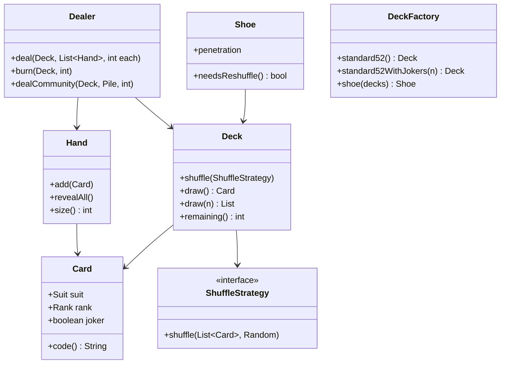

# LLD / OOD: Deck of Cards (Game Platform Primitives)

> **Focus areas:** Card · Deck · Shuffle · Deal · Hands · Extensibility for multiple games · Fair RNG · Immutability choices  
> **Style:** Amazon SDE III / L6+ — object design for reusable card primitives (feeds poker/classic games docs)  
> **Quality bar:** Clean domain model, correct shuffle, deal without duplicates, extension without rewriting core  
> **Related:** [classic-games-ood-system-design.md](./classic-games-ood-system-design.md), [online-poker-system-design.md](./online-poker-system-design.md)

---

## Table of Contents

1. [Clarify Requirements (Interview Q&A)](#1-clarify-requirements-interview-qa)
2. [Non-Functional Requirements & Estimation](#2-non-functional-requirements--estimation)
3. [Cases (Flows & Edge Cases)](#3-cases-flows--edge-cases)
4. [Object Model & Class Diagrams](#4-object-model--class-diagrams)
5. [APIs / Public Interfaces](#5-apis--public-interfaces)
6. [State Machines](#6-state-machines)
7. [Concurrency, RNG & Fairness](#7-concurrency-rng--fairness)
8. [Extensibility & Patterns](#8-extensibility--patterns)
9. [Design Deep Dive](#9-design-deep-dive)
10. [Wrap-Up](#10-wrap-up)
11. [Deeper / Related Interview Questions](#11-deeper--related-interview-questions)
12. [Appendices](#12-appendices)

---

## 1. Clarify Requirements (Interview Q&A)

Goal: **design a reusable deck-of-cards object model** that games (Poker, Blackjack, War, Solitaire) can share—create decks, shuffle, deal, track discard—without encoding one game’s rules into `Deck`.

### 1.0 What this is / is not

| Dimension | **Deck of cards LLD** | Not this |
|-----------|----------------------|----------|
| Primary job | Card identity, deck ops, dealing | Full poker table networking |
| Success | No duplicate deals; fair shuffle; clear ownership of cards | Perfect casino compliance cert (mention hooks) |
| Rules | Stay out of Deck; live in Game/HandEvaluator | Hand ranking inside Card |

**Scope statement:** Classes for standard (and extensible) playing cards: deck construction, shuffle strategies, deal to hands/piles, burn/discard, multi-deck shoes, deterministic test shuffles.

### 1.1 Functional Requirements

| # | Question | Typical answer | Implication |
|---|----------|----------------|-------------|
| F1 | Standard 52? | Yes; optional jokers | `DeckFactory.standard52()` / `withJokers` |
| F2 | Multi-deck shoe? | Blackjack yes; poker often 1 | `Shoe` as deck aggregate |
| F3 | Shuffle? | Cryptographically strong for money games | `ShuffleStrategy` |
| F4 | Deal? | N cards to M players; community cards | `Dealer` service |
| F5 | Hands? | Ordered/unordered collections | `Hand` / `Pile` |
| F6 | Visibility? | Hidden vs public cards | `CardView` / faceUp flag |
| F7 | Compare ranks? | Game-specific ace high/low | Comparator injected |
| F8 | Reshuffle discard? | Some games | `reuseDiscardPile` policy |
| F9 | Serialize? | Persist game | Card ids stable |
| F10 | Cheat detection hook? | Online poker later | Audit log of shoe sequence hash |

**MVP:**

1. `Card` with suit + rank.  
2. `Deck` build, shuffle, draw, remaining.  
3. `deal(players, cardsEach)`.  
4. `Hand` add/remove/reveal.  
5. Pluggable shuffle.  
6. Optional jokers + multi-deck shoe.

**Out of MVP:** Full game rules, networking, chip stacks, UI sprites (mention `CardRenderer` port only).

### 1.2 Dialogue

**You:** One deck or shoe? Money-game RNG requirements? Need jokers? Immutable cards?

**Interviewer:** Reusable library; support poker and blackjack. Good RNG. Immutable card identity.

**You:** Cards as values; deck holds ordered list; shuffle strategy; dealer orchestrates transfers so a card lives in exactly one place.

### 1.3 Assumptions

- Standard French suits.  
- Ace rank value is game-specific (enum order default Ace-high).  
- Card identity: `(suit, rank)` or joker id.  
- Physical “same card twice” impossible within one deck instance.

---

## 2. Non-Functional Requirements & Estimation

### 2.1 NFRs

| NFR | Target |
|-----|--------|
| Correctness | Conservation of cards (no clone/leak) |
| Shuffle quality | Unbiased permutation (Fisher–Yates) |
| Perf | Shuffle 52–416 cards negligible; deal O(k) |
| Determinism for tests | Seedable RNG |
| Auditability (money) | Shoe seed/commit reveal protocol hooks |
| Memory | Tiny; millions of tables → share Card flyweights |

### 2.2 Scale (when embedded in game servers)

| Metric | Casual | Online poker fleet |
|--------|--------|-------------------|
| Tables | 100 | 100K |
| Decks/shoes shuffled /s | 10 | 10K |
| Cards as objects | Fine | Prefer enum/flyweight |

```text
100K shuffles/s × Fisher–Yates 52 swaps = trivial CPU
Bottleneck is networking/game state, not Deck
```

---

## 3. Cases (Flows & Edge Cases)

### 3.1 Happy paths

1. Build 52 → shuffle → deal 5 to each of 4 players → 32 remain.  
2. Burn 1 → deal community flop 3.  
3. Blackjack shoe 6 decks → deal → discard → reshuffle at penetration.  
4. Test: seed=42 → same order every run.

### 3.2 Edge cases

| Case | Behavior |
|------|----------|
| Draw from empty | `EmptyDeckException` or reshuffle policy |
| Deal more than remaining | Fail whole deal (transactional) or partial? **Fail whole** |
| Double-add card to two hands | Prevent via ownership transfer API |
| Shuffle mid-hand | Game-level forbid; deck can still shuffle |
| Joker in poker holdem | Deck factory without jokers |
| Clone deck for sim | Deep copy remaining sequence |
| Concurrent deal | External sync by table lock |

### 3.3 Sequences

```text
Game -> DeckFactory.standard52()
     -> deck.shuffle(secureRng)
     -> Dealer.deal(deck, hands, 2)
         for hand in hands:
           hand.accept(deck.draw())
```

---

## 4. Object Model & Class Diagrams

### 4.1 Core types

```text
enum Suit { CLUBS, DIAMONDS, HEARTS, SPADES }
enum Rank { TWO..TEN, JACK, QUEEN, KING, ACE }  // optional ACE_LOW elsewhere

Card  // value object
 ├── suit: Suit?
 ├── rank: Rank?
 ├── isJoker: bool
 └── id: String  // "AS", "JD", "JOKER1"

Deck
 ├── cards: List<Card>  // draw from end/index
 ├── draw() Card
 ├── draw(n) List<Card>
 ├── shuffle(ShuffleStrategy)
 ├── remaining() int
 └── restore(List<Card>) // careful

Shoe extends / has Decks
 ├── penetrationThreshold
 └── needsReshuffle()

Hand
 ├── cards: List<Card>
 ├── add, remove, reveal, conceal
 └── asView(viewer) -> VisibleHand

Pile / DiscardPile
Dealer
ShuffleStrategy
RankComparator (game-specific)
```

### 4.2 Mermaid



### 4.3 Ownership invariant

```text
At any time, each Card instance in play belongs to exactly one container:
  Deck/Shoe OR Hand OR CommunityPile OR DiscardPile OR BurnPile
Transfers via API that remove+add atomically inside table lock
```

### 4.4 Flyweight variant

```text
Card = enum of 52 constants (JAVA-style)
Deck holds List<Card> references to enums
→ identity equality cheap; no accidental new Card(AS)
```

---

## 5. APIs / Public Interfaces

```text
interface Deck {
  void shuffle(RandomGenerator rng)
  Card draw()
  List<Card> draw(int n)
  int remaining()
  List<Card> snapshotRemaining() // copy for audit
}

interface ShuffleStrategy {
  void shuffle(List<Card> cards, RandomGenerator rng)
}

interface Dealer {
  void dealEach(Deck deck, List<Hand> hands, int n)
  void dealTo(Deck deck, Hand hand, int n)
  Card burn(Deck deck)
  void toCommunity(Deck deck, Pile community, int n)
}

interface Hand {
  void receive(Card c)      // face down default
  void receiveOpen(Card c)
  List<Card> viewFor(PlayerId viewer, VisibilityPolicy policy)
  List<Card> takeAll()
}

class DeckFactory {
  static Deck standard52()
  static Deck withJokers(int n)
  static Shoe multiDeck(int decks)
}
```

### 5.1 Serialization

```text
Card.code(): "AS" | "10H" | "JOKER:1"
Deck.sequenceHash(): sha256 of codes in order after shuffle (audit)
```

---

## 6. State Machines

### 6.1 Shoe / deck lifecycle (game-facing)

```text
NEW --> SHUFFLED --> DEALING --> IN_HAND_PLAY
                      |              |
                      +--> DISCARDING+
                      |
                      +--> NEEDS_RESHUFFLE --> SHUFFLED
```

Deck object itself is mostly data; **Table/Game** owns phase. Don’t over-state-machine the deck.

### 6.2 Card visibility

```text
FACE_DOWN --reveal--> FACE_UP --conceal--> FACE_DOWN (rare)
```

`CardOwnership` wrapper: `{ card, faceUp }`.

---

## 7. Concurrency, RNG & Fairness

### 7.1 Concurrency

Deck is **not** thread-safe by default. Owning `GameTable` serializes deals:

```text
synchronized(tableLock) { dealer.dealEach(...) }
```

Online multi-table: each table shard exclusive.

### 7.2 Fisher–Yates (normative)

```text
for i from n-1 downto 1:
  j = rng.nextInt(i+1)  // 0..i inclusive
  swap(a[i], a[j])
```

Call out: `Collections.shuffle` OK if RNG good; naive “sort by random float” is biased—**deal-breaker**.

### 7.3 RNG choices

| RNG | Use |
|-----|-----|
| `SecureRandom` / CSPRNG | Real-money |
| Seeded SplittableRandom | Tests, replays |
| Commit-reveal client seeds | Provably fair (poker doc) |

### 7.4 Provably fair hook

```text
serverSeed, clientSeeds → combined → shuffle
publish hash(serverSeed) before hand
reveal after hand
```

Deck LLD exposes `shuffleWithSeed(bytes)`; protocol lives in online poker.

### 7.5 Card conservation asserts (debug)

```text
assert union(all containers).size == totalCards
assert no duplicates
```

---

## 8. Extensibility & Patterns

| Pattern | Where |
|---------|-------|
| Factory | DeckFactory |
| Strategy | Shuffle, RankComparator |
| Value Object | Card |
| Flyweight | Enum cards |
| Facade | Dealer |
| Iterator | Remaining cards (read-only) |
| Prototype | Clone deck state for MC sims |

### 8.1 Game-specific without polluting Deck

```text
// GOOD
PokerHandEvaluator.evaluate(List<Card>)
BlackjackHand.value(List<Card>)  // ace 1/11

// BAD
card.isBlackjackSoftSeventeen()
deck.dealPokerHoldem()
```

### 8.2 Non-standard decks

- Pinochle, Euchre short decks → `DeckFactory.euchre()`.  
- Uno → different hierarchy (`ColoredCard`)—don’t force Suit/Rank; use `Card` interface.

```text
interface CardItem { String id(); }
class FrenchCard implements CardItem ...
class UnoCard implements CardItem ...
```

Only generalize if interviewer asks.

---

## 9. Design Deep Dive

### 9.1 Deal transactional semantics

```text
function dealEach(deck, hands, n):
  need = hands.size * n
  if deck.remaining() < need: throw InsufficientCards()
  // draw first to temp, then assign — or draw assigned; on failure rollback
  batches = [deck.draw(n) for hand in hands]
  for hand, batch in zip: hand.receiveAll(batch)
```

Prefer check-then-draw under same lock.

### 9.2 Burn cards

```text
burnPile.receive(deck.draw())  // face down, not visible
```

### 9.3 Community cards

```text
community: Pile faceUp
dealer.toCommunity(deck, community, 3) // flop
```

### 9.4 Ordering of hands

Poker: order irrelevant for evaluation (combinatorics).  
Blackjack: order irrelevant for value.  
Some solitaire: order matters—`Hand` as list preserves order.

### 9.5 Comparator

```text
interface RankOrdering {
  int value(Rank r)  // poker ace=14; wheels special-cased in evaluator
}
```

### 9.6 Immutability

| Choice | Pros | Cons |
|--------|------|------|
| Immutable Card | Safe sharing | — |
| Mutable Deck list | Natural draw | Need encapsulation |
| Immutable Deck returning new Deck | Pure | Alloc heavy for games |

**Recommend:** immutable `Card`; mutable private list inside `Deck` with controlled ops.

### 9.7 Multi-deck shoe penetration

```text
if shoe.remaining() / shoe.capacity() < 0.25: shoe.reshuffle(discard+remaining)
```

Blackjack cut card ≈ 25–50% penetration.

### 9.8 Undo / replay

Log operations: `SHUFFLE(hash)`, `DRAW→P1`, `BURN`, … Replay for disputes.

### 9.9 Performance micro

- ArrayList for deck; draw from end `remove(size-1)` O(1).  
- Avoid LinkedList.

### 9.10 Security

- Never send full shoe to clients.  
- Server-authoritative draws.  
- Don’t log full future sequence at info level in production.

### 9.11 Sample code: Fisher–Yates

```text
class FisherYatesShuffle implements ShuffleStrategy {
  void shuffle(List<Card> cards, RandomGenerator rng) {
    for (int i = cards.size() - 1; i > 0; i--) {
      int j = rng.nextInt(i + 1);
      Collections.swap(cards, i, j);
    }
  }
}
```

### 9.12 Sample: standard52

```text
Deck standard52() {
  List<Card> all = new ArrayList<>(52);
  for (Suit s : Suit.values())
    for (Rank r : Rank.values())
      all.add(Card.of(s, r));
  return new Deck(all);
}
```

---

## 10. Wrap-Up

Reusable `Card` values + `Deck`/`Shoe` + `Dealer` transfers + `ShuffleStrategy`. Keep game rules in evaluators. Enforce single ownership. Use Fisher–Yates with CSPRNG for money paths; seedable RNG for tests. Extensible factories for jokers and multi-deck.

### Deal-breakers

1. Biased shuffle.  
2. Game rules inside `Card`.  
3. Allowing same card in two hands.  
4. Client-authoritative deck for real money.

---

## 11. Deeper / Related Interview Questions

| Q | A |
|---|---|
| Implement shuffle | Fisher–Yates + why not sort-by-random |
| Ace high/low | Comparator / evaluator, not Card mutation |
| Blackjack shoe | Multi-deck + penetration reshuffle |
| Thread safety | Table serializes deck ops |
| Jokers | Factory flag; rank/suit optional |
| Equals/hashCode | By suit+rank (+joker id) |
| Provably fair | Commit-reveal seeds → shuffle |
| Uno? | Separate card model behind interface |
| Clone for MCTS | Snapshot remaining list |
| Burn purpose | Traditional anti-cheat / ritual; still model pile |

### Related docs

Classic games OOD, online poker (table + fairness), multiplayer chess (authority pattern analogy).

---

## 12. Appendices

### A. Checklist

```text
Suit, Rank, Card, Deck, Shoe, Hand, Pile
Dealer, DeckFactory, ShuffleStrategy, RankOrdering
VisibilityPolicy, RandomGenerator port
```

### B. Card codes

```text
2C 3C ... AC
2D ... AD
2H ... AH
2S ... AS
```

### C. Conservation test

```text
deal all → remaining 0
collect all hands → rebuild multiset equals original
```

### D. Errors

| Error | When |
|-------|------|
| InsufficientCards | Deal too many |
| EmptyDeck | draw on empty |
| CardNotInHand | remove missing |
| OwnershipViolation | debug assert |

### E. 45-min plan

| Min | Focus |
|-----|-------|
| 0–5 | Scope vs full game |
| 5–15 | Card/Deck/Hand diagram |
| 15–25 | Shuffle + deal APIs |
| 25–35 | Ownership + RNG |
| 35–45 | Shoe + extensibility |

### F. Invariants

1. No duplicate card ids in one shoe instance.  
2. draw reduces remaining by 1.  
3. shuffle is bijection of current remaining (usually full shoe).  
4. Hand size matches receives − takes.

### G. Blackjack vs Poker factory

```text
Poker: standard52, reshuffle each hand (or as rules say)
BJ: shoe(6), reshuffle at penetration, discard tray
```

### H. Visibility policy sketch

```text
view(hand, viewer):
  if viewer owns hand: all cards face-up for owner client
  else: FACE_UP cards only; FACE_DOWN as placeholders
```

### I. Glossary

| Term | Meaning |
|------|---------|
| Shoe | Multi-deck dealing box |
| Burn | Discard without use |
| Penetration | Fraction dealt before reshuffle |
| Flyweight | Shared immutable card identities |
| CSPRNG | Cryptographically secure RNG |

### J. Rubric

| Signal | Weak | Strong |
|--------|------|--------|
| Shuffle | random sort | Fisher–Yates |
| Rules | In Card | External evaluator |
| Ownership | Unclear | Single container |
| Money RNG | Math.random | CSPRNG + audit hook |

### K. Optional interfaces for games

```text
interface HandEvaluator<H> { Result evaluate(H hand, Board board); }
interface PayTable { Money payout(Result r, bet); }
```

### L. Mapping to online poker

| Deck LLD | Poker system |
|----------|--------------|
| Shoe sequence | Hand deal authority |
| sequenceHash | Fairness audit |
| Dealer | Table hand engine |
| Hand view | Per-seat private channel |

### M. Worked example: Hold’em deal from Deck

```text
deck = DeckFactory.standard52()
deck.shuffle(csprng)
burn(deck)                 // optional ritual burn before flop later
for seat in activeSeats:
  seat.holes.receive(deck.draw())  // face down
  seat.holes.receive(deck.draw())
// later streets:
burn(deck); community.receiveOpen(deck.draw()) × 3  // flop
burn(deck); community.receiveOpen(deck.draw())      // turn
burn(deck); community.receiveOpen(deck.draw())      // river
assert deck.remaining() == 52 - (2*n + burns + 5)
```

### N. Worked example: Blackjack shoe

```text
shoe = DeckFactory.shoe(decks=6)
shoe.shuffle(csprng)
while !shoe.needsReshuffle():
  deal player, dealer holes...
  // on hand end: discardPile.take(all used cards)
when needsReshuffle:
  shoe.restore(discard + remaining); shuffle again
```

### O. Serialization & replay log

```text
HandDealLog {
  handId
  engineVersion
  seedCommitHash
  seedReveal?          // after hand
  sequence: ["AS","7D", ...]  // optional; or regenerable from seed
  ops: [DRAW->P0, DRAW->P1, BURN, DRAW->BOARD, ...]
}
```

Replaying `ops` against a fresh deck reconstructed from seed must yield identical ownership.

### P. Common interview coding follow-ups

| Ask | Implement |
|-----|-----------|
| `shuffle` | Fisher–Yates in-place |
| `deal` | transactional multi-hand |
| `isFlush` | suit counts (belongs in evaluator, not Deck) |
| Rank compare | comparator table |
| Serialize hand | list of codes |

Keep coding follow-up **out of Deck** when it’s rules—redirect to evaluator.

### Q. Package layout

```text
cards.core     // Card, Suit, Rank
cards.deck     // Deck, Shoe, DeckFactory
cards.deal     // Dealer, Hand, Pile
cards.shuffle  // ShuffleStrategy, FisherYates
cards.view     // VisibilityPolicy
cards.audit    // sequenceHash, DealLog
```

### R. Invariant tests (copy into suite)

```text
1. standard52 size == 52 unique codes
2. shuffle preserves multiset
3. draw n times → remaining 52-n
4. dealEach fails atomically when short
5. after moving card to hand, deck.contains(card) == false
6. seeded shuffle deterministic
7. shoe(6) size == 312
```

### S. Anti-cheat note (library boundary)

Deck library **cannot** stop collusion; it only ensures server-side conservation and audit hashes. Collusion detection is a product/risk concern (online poker doc).

### T. When interviewer wants UML inheritance tree

Offer shallow:

```text
CardItem <<interface>>
  FrenchCard
  JokerCard
```

Refuse deep `RedCard extends Card extends GameObject`—signal taste.

---

**End of deck-of-cards LLD.** Keep the library boring and correct—the games docs add the interesting rules on top.
