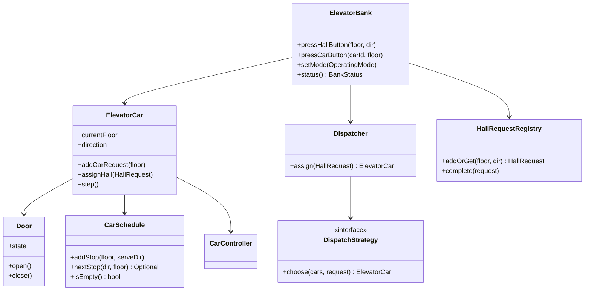

# LLD / OOD: Elevator System

> **Focus areas:** Hall calls · Car calls · Multi-car scheduling · Direction state machines · Concurrency · Extensible dispatch algorithms  
> **Style:** Amazon SDE III / L6+ — object design first; light scale for bank concurrency & fairness  
> **Quality bar:** Clear request model, deadlock-free control loop, pluggable `DispatchStrategy`, interviewer-ready diagrams  
> **Interview theme:** Classic LLD; Amazon cares about correctness under concurrent buttons, fairness, and operational modes (fire, maintenance)

---

## Table of Contents

1. [Clarify Requirements (Interview Q&A)](#1-clarify-requirements-interview-qa)
2. [Non-Functional Requirements & Light Estimation](#2-non-functional-requirements--light-estimation)
3. [Cases (Flows & Edge Cases)](#3-cases-flows--edge-cases)
4. [Object Model & Class Diagrams](#4-object-model--class-diagrams)
5. [APIs / Public Interfaces](#5-apis--public-interfaces)
6. [State Machines](#6-state-machines)
7. [Concurrency & Thread Safety](#7-concurrency--thread-safety)
8. [Extensibility & Scheduling Algorithms](#8-extensibility--scheduling-algorithms)
9. [Design Deep Dive](#9-design-deep-dive)
10. [Wrap-Up](#10-wrap-up)
11. [Deeper / Related Interview Questions](#11-deeper--related-interview-questions)
12. [Appendices](#12-appendices)

---

## 1. Clarify Requirements (Interview Q&A)

Goal: **design classes for a multi-elevator bank**—accept hall/car requests, assign cars, move safely floor-to-floor, open/close doors—without simulating physics FEA or building BMS cloud.

### 1.0 What this is / is not

| Dimension | **Elevator LLD (this doc)** | Not this |
|-----------|----------------------------|----------|
| Primary job | Request handling + dispatch + car control | Building-wide IoT platform |
| Success | Every call served eventually; no unsafe moves | Perfect human traffic ML |
| Abstractions | ElevatorBank, ElevatorCar, Request, Dispatcher, Door | Kafka cell architecture |
| Hard parts | SCAN/LOOK scheduling, concurrent buttons, modes | Motor PID loops |

**Scope statement:** Object model for N elevators across F floors: hall up/down calls, car destination buttons, pluggable dispatch, door lifecycle, emergency/maintenance modes, thread-safe control.

### 1.1 Functional Requirements

| # | Question | Typical answer | Implication |
|---|----------|----------------|-------------|
| F1 | Floors? | 1..F (e.g. 20) | Floor id int; basement optional later |
| F2 | Cars? | N elevators in one bank | `ElevatorBank` owns cars |
| F3 | Hall buttons? | Up/Down per floor (no down on 1, no up on top) | `HallRequest(floor, Direction)` |
| F4 | Car buttons? | Destination floors inside car | `CarRequest(carId, floor)` |
| F5 | Capacity? | Max passengers / weight (soft) | Optional reject; MVP ignore weight sensor |
| F6 | Scheduling? | Efficient, fair; discuss SCAN/LOOK | `DispatchStrategy` |
| F7 | Doors? | Open, dwell, close; reopen on obstruction | Door state machine |
| F8 | Display? | Direction + floor per car | Observer/events |
| F9 | Modes? | Normal, maintenance, fire recall | `OperatingMode` |
| F10 | Stop selection? | Serve requests along direction before reverse | LOOK/SCAN semantics |

**MVP scope:**

1. Multi-car bank, hall + car requests.  
2. Dispatcher assigns hall calls to a car.  
3. Each car runs control loop: move, stop, door cycle, complete requests.  
4. Pluggable scheduling strategy.  
5. Thread-safe external API (`pressHallButton`, `pressCarButton`).  
6. Basic fire recall: go to lobby, ignore new car calls.

**Out of MVP:** Destination dispatch kiosks (mention as extension), double-deck elevators, sky lobbies, full simulation UI, hardware PLC.

### 1.2 Sample dialogue

**You:** How many cars/floors? Independent shafts? Any priority (VIP/fire)? Door obstruction?

**Interviewer:** 4 cars, 20 floors, one bank. Fire mode yes. Model door open/close.

**You:** I’ll separate **request intake**, **dispatch** (hall→car), and **per-car controllers** with a direction-aware schedule (LOOK).

### 1.3 Assumptions

- Discrete floors; move takes `travelTimePerFloor` (injectable).  
- One request queue structure per car (up set / down set).  
- Hall call completed when car stops at floor **with matching direction** (or idle pick).  
- No two cars in same shaft (independent).

---

## 2. Non-Functional Requirements & Light Estimation

### 2.1 NFRs

| # | NFR | Target |
|---|-----|--------|
| N1 | Safety | Never move with door open; never skip mode constraints |
| N2 | Liveness | Every request eventually served (no starvation) |
| N3 | Latency to assign | Hall assign p99 < 10ms in-process |
| N4 | Fairness | Bounded wait; avoid forever reversing for nearest only |
| N5 | Extensibility | New algorithm without rewriting cars |
| N6 | Testability | Virtual clock / deterministic scheduler |
| N7 | Observability | Wait time histograms, stops count, mode |

### 2.2 Scale (bank concurrency)

| Metric | Office bank | Tall HQ |
|--------|-------------|---------|
| Floors | 12–20 | 60 |
| Cars | 4–8 | 12–16 |
| Peak hall presses/min | ~100 | ~500 |
| Concurrent API callers | dozens | hundreds |
| Control loop tick | 100–500ms or event-driven | same |

Still single-process LLD; at extreme building counts → one controller service per bank.

### 2.3 Rough wait math (speak to trade-offs)

```text
Avg interfloor time 3s + door 5s ≈ 8s per stop
Busy car with 6 pending stops → ~48s path time
Bad dispatch (all pile on one car) → starves others
→ Dispatcher load-balances pending cost, not just distance
```

---

## 3. Cases (Flows & Edge Cases)

### 3.1 Happy paths

1. User on 5 presses Hall UP → dispatcher assigns Car 2 moving up → stops at 5 → doors → user presses 12 → car continues up → stop 12.  
2. Idle cars: nearest idle takes hall call.  
3. Car already going up past 5 with up request → stop along the way (LOOK).  
4. Fire mode: all cars finish/stop, go to floor 1, doors open, ignore destinations.

### 3.2 Edge cases

| Case | Behavior |
|------|----------|
| Hall UP and DOWN both pressed on 5 | Two requests; car may need two visits or dual-serve policy |
| All cars busy | Queue hall request until assignable |
| Spam same button | Idempotent coalesce |
| Door obstruction | Reopen; retry close N times; alarm |
| Car full | Skip hall stop optional (sensor); reassign hall |
| Maintenance mode one car | Remove from dispatch pool |
| Request current floor | Open doors if idle/stopping |
| Starvation: keep getting nearer calls | Aging / max scan sweeps |
| Invalid floor button | Reject |

### 3.3 Sequence: hall call

```text
User -> ElevatorBank.pressHallButton(5, UP)
     -> HallRequestRegistry.add (idempotent)
     -> Dispatcher.assign(request) -> Car3
     -> Car3.schedule.add(5, UP)
     -> CarController loop eventually Stop@5
     -> complete hall request
     -> Door.open/dwell/close
```

### 3.4 Sequence: car call

```text
Passenger -> car.pressFloor(12)
          -> CarRequest added to Car3 upStops
          -> no global dispatch needed
```

---

## 4. Object Model & Class Diagrams

### 4.1 Core

```text
ElevatorBank
 ├── floors: 1..F
 ├── List<ElevatorCar> cars
 ├── Dispatcher dispatcher
 ├── HallRequestRegistry hallRequests
 └── OperatingMode mode

ElevatorCar
 ├── carId
 ├── currentFloor
 ├── Direction direction   // UP, DOWN, IDLE
 ├── Door door
 ├── CarSchedule schedule  // upStops TreeSet, downStops TreeSet
 ├── CarController controller
 ├── capacity / load?
 └── mode (NORMAL, OUT_OF_SERVICE)

Door
 ├── DoorState state
 └── open(), close(), onObstruction()

Request
 ├── HallRequest { floor, hallDirection, createdAt, assignedCar? }
 └── CarRequest  { carId, floor, createdAt }

Dispatcher / DispatchStrategy
CarController (run loop)
Clock / MotorSimulator (test)
```

### 4.2 Mermaid



### 4.3 Direction & enums

```text
enum Direction { UP, DOWN, IDLE }
enum DoorState { OPEN, CLOSING, CLOSED, OPENING, OBSTRUCTED }
enum OperatingMode { NORMAL, FIRE_RECALL, MAINTENANCE, EMERGENCY_STOP }
enum RequestState { PENDING, ASSIGNED, SERVING, COMPLETED, CANCELLED }
```

### 4.4 Schedule structure (critical)

```text
CarSchedule:
  TreeSet<Integer> upStops    // floors to visit while moving UP
  TreeSet<Integer> downStops  // floors while moving DOWN

When direction UP:
  next = upStops.ceiling(current) or upStops.higher...
  if none: reverse to DOWN if downStops non-empty else IDLE
```

Hall UP at floor f typically adds `f` to the car’s **upStops** (serve up). Policy detail: some systems store pending hall separately until car approaches.

---

## 5. APIs / Public Interfaces

```text
interface ElevatorBankApi {
  void pressHallButton(int floor, Direction hallDir)
  void pressCarButton(String carId, int floor)
  void setBankMode(OperatingMode mode)
  void setCarOutOfService(String carId, boolean oos)
  BankStatus getStatus()
  void tick()  // for simulated clocks; or internal threads
}

interface DispatchStrategy {
  ElevatorCar choose(List<ElevatorCar> candidates, HallRequest req)
}

interface CarController {
  void start()
  void stop()
  void onAssign(HallRequest req)
}
```

### 5.1 Status DTO

```text
BankStatus {
  mode
  cars: [{ carId, floor, direction, door, pendingStops[], load }]
  pendingHall: [{ floor, dir, waitMs, assignedCar }]
}
```

### 5.2 Events (observers)

```text
FloorChanged(carId, floor)
DoorStateChanged(carId, state)
RequestCompleted(requestId)
ModeChanged(mode)
```

---

## 6. State Machines

### 6.1 Car motion / service

```text
                 requests
    IDLE --------------------→ MOVING_UP / MOVING_DOWN
      ↑                              |
      |                         approach stop
      |                              ↓
      |                           STOPPING
      |                              ↓
      |                          DOOR_OPEN
      |                           dwell
      |                              ↓
      +←---- schedule empty ---- DOOR_CLOSING
      |                              |
      +←---- more stops -------------+ → MOVING_*
```

Simplified states often used in interviews:

```text
IDLE | MOVING | DOOR_OPEN
```

Prefer explicit door + direction for stronger design.

### 6.2 Door

```text
CLOSED --open--> OPENING --> OPEN --close--> CLOSING --> CLOSED
                     ↑           |               |
                     +←-obstruct-+               +→ OPENING on obstruct
```

### 6.3 Bank mode

```text
NORMAL --fire--> FIRE_RECALL --clear--> NORMAL
NORMAL --maint--> (per-car OOS)
ANY --e-stop--> EMERGENCY_STOP (all halt)
```

**Fire recall actions:** clear pending car calls; hall ignored or redirected; cars go to recall floor; doors open.

### 6.4 Request lifecycle

```text
PENDING → ASSIGNED → SERVING (car stopped, doors open) → COMPLETED
```

---

## 7. Concurrency & Thread Safety

### 7.1 Actors

- External threads: button presses from many panels.  
- Internal: one controller thread per car **or** single bank scheduler thread.  
- Recommend: **single-threaded bank event loop** + car state machines, **or** per-car thread with concurrent queues.

### 7.2 Recommended model (interview-friendly)

```text
ElevatorBank event thread:
  - drain inbound button queue
  - dispatch hall requests
  - tick each car (or cars run timers posting events)

InboundQueue: ConcurrentLinkedQueue / BlockingQueue of Commands
CarSchedule mutations: only on event thread  → no locks needed inside car
```

If per-car threads:

```text
class ElevatorCar:
  lock
  upStops, downStops
  def addStop(...):
    synchronized(lock): insert
    signal controller
```

### 7.3 Idempotent hall coalesce

```text
registry key = (floor, hallDir)
if exists PENDING/ASSIGNED: return existing
else create
```

### 7.4 Assign race

Two hall presses different floors assigning same car: OK if schedule merges under car lock.  
Same request assigned twice: registry CAS `PENDING→ASSIGNED`.

### 7.5 Safety interlocks (logical)

```text
assert door == CLOSED before changeFloor
assert mode != EMERGENCY_STOP before move
```

Even in software LLD, showing interlocks signals maturity.

---

## 8. Extensibility & Scheduling Algorithms

### 8.1 Strategy interface

```text
score(car, request) -> cost
choose = min cost among eligible cars
```

### 8.2 Algorithms

| Algorithm | Idea | Pros | Cons |
|-----------|------|------|------|
| **Nearest Idle** | Idle only by distance | Simple | Ignores moving cars |
| **SCAN** | Like disk: go to end, reverse | Simple | Extra travel to ends |
| **LOOK** | Reverse at last request | Better than SCAN | Still heuristic |
| **Cost-based** | ETA = travel + stops * door | Practical | Tunable weights |
| **Destination dispatch** | Zone / kiosk assigns before enter | High throughput | More UX/hardware |

**MVP recommend:** LOOK per car + cost-based dispatcher for hall assignment.

### 8.3 Cost function sketch

```text
cost(car, hallFloor, hallDir):
  if car.OOS or FIRE: ∞
  if car.IDLE: abs(car.floor - hallFloor) * travel
  if car same direction and call is "on the way":
     distance + stopsInBetween * stopPenalty
  else:
     distanceToFinishCurrent + reverse + distanceToHall
  + loadPenalty(car)
  + agingBoost(request.wait)   // fairness
```

### 8.4 Sectoring extension

Cars prefer floors in zones (1–10, 11–20) during peak—`SectorDispatchStrategy`.

### 8.5 Patterns

| Pattern | Use |
|---------|-----|
| Strategy | Dispatch |
| State | Door, Car |
| Command | Button events |
| Observer | Panels/displays |
| Facade | ElevatorBank |
| Producer-Consumer | Button queue → event loop |

---

## 9. Design Deep Dive

### 9.1 LOOK control loop (per car)

```text
function tick(car):
  if mode fire: handleFire(car); return
  if door not CLOSED: handleDoor(car); return
  if direction == IDLE:
    if schedule empty: return
    direction = decideInitialDirection(car)
  next = schedule.next(direction, car.floor)
  if next empty:
    direction = opposite if other set else IDLE
    return
  if car.floor == next:
    stopAndServe(car, next)
  else:
    car.floor += step(direction)
    emit FloorChanged
```

### 9.2 stopAndServe

```text
function stopAndServe(car, floor):
  remove floor from active direction set
  complete matching hall requests (direction-aware)
  complete car requests for floor
  door.open(); dwell(clock); tryCloseWithRetries()
```

### 9.3 Direction-aware hall completion

Car moving UP stops at 5: completes Hall UP@5. Hall DOWN@5 remains unless policy “serve both if idle dwell”.

**Strong interview point:** call out the ambiguity; pick a policy.

### 9.4 Starvation control

- Increase `agingBoost` with wait time.  
- Cap “diversions”: after K new nearer assignments, finish farthest committed stop.  
- Metrics: `p99_hall_wait_ms`.

### 9.5 Fire recall

```text
on FIRE_RECALL:
  for car in cars:
    clear car destination requests
    clear assigned hall (requeue or drop per code)
    schedule only recallFloor
    on arrive: door OPEN; disable close except firefighter key
  hall buttons disabled
```

### 9.6 Simulation vs realtime

Interview often accepts `tick()` with virtual time. Production: event-driven with motor feedback. Keep `Motor` interface:

```text
interface Motor {
  void moveToward(int floor)
  int readFloor()
  boolean atFloor()
}
```

### 9.7 Multi-bank buildings

`Building` has multiple `ElevatorBank`s (low/high rise). Hall panels route to bank. Out of MVP; show composition.

### 9.8 Capacity skip

If `car.load >= max` and hall assign: dispatcher avoids; if already assigned, car may skip and re-request hall—complex; mention only.

### 9.9 Testing strategy

| Test | Idea |
|------|------|
| Unit LOOK | Seed stops; assert visit order |
| Dispatch | Two cars; assert lower cost wins |
| Concurrency | Flood buttons; no lost requests |
| Fire | Eventually all at lobby |
| Idempotency | Double press = one request |

### 9.10 Complexity

```text
addStop: O(log S) TreeSet
choose car: O(N cars) score
tick: O(1) amortized next stop
```

### 9.11 Anti-patterns

- One global queue served by “any free car” without direction → ping-pong.  
- Scanning all floors every tick as boolean array without structure (OK for F=20, show better).  
- Mixing UI, motor, and dispatch in one class.

### 9.12 Destination control (extension sketch)

```text
KioskRequest(floorFrom, floorTo) 
  -> Dispatcher assigns car C and tells user "Car C"
  -> pre-adds car stop floorTo; hall becomes go-to-car-landing
```

---

## 10. Wrap-Up

### 10.1 Summary

`ElevatorBank` facade accepts hall/car inputs; `HallRequestRegistry` coalesces; `DispatchStrategy` assigns cars; each `ElevatorCar` runs LOOK-style schedule with door state machine; bank modes handle fire/maintenance. Concurrency via event-loop or per-car locks.

### 10.2 Priorities

| Priority | Choice |
|----------|--------|
| Safety | Door interlocks + modes |
| Liveness | Aging + LOOK reverse at last stop |
| Extensibility | DispatchStrategy |
| Clarity | Separate hall vs car requests |

### 10.3 Deal-breakers

1. No distinction hall vs car requests.  
2. Always pick nearest car ignoring direction (thrashing).  
3. No answer to starvation.  
4. Move while door open (missed invariant).

### 10.4 Ownership

You own: request liveness SLOs, dispatch config, mode transitions, simulation tests. Partner: hardware/PLC safety certified stack.

---

## 11. Deeper / Related Interview Questions

| Question | Strong answer |
|----------|---------------|
| SCAN vs LOOK? | LOOK reverses at last request; less waste |
| How avoid starvation? | Aging cost; fairness metrics |
| Thread model? | Bank event loop or per-car + concurrent schedule |
| Add VIP override? | Priority queue / cost bias |
| 100 floors 20 cars? | Sectoring; destination dispatch |
| Model doors? | Explicit Door state machine |
| Test without sleeping? | Virtual Clock.tick |
| Same floor up+down? | Two requests; policy for dual serve |
| Out of service car? | Exclude from candidates |
| Why TreeSet? | Ordered next stop O(log n) |

### Trap responses

| Trap | Answer |
|------|--------|
| “AI dispatcher MVP” | Heuristic cost first; ML later |
| “One thread.sleep per floor in button handler” | Never block API on travel |
| Boolean `floors[21]` only | OK small F; still need direction & hall vs car |

### Related

Parking lot LLD (resource assign races), online chess (authoritative loops), job schedulers (SCAN heritage).

---

## 12. Appendices

### A. Whiteboard class checklist

```text
ElevatorBank, ElevatorCar, Door, CarSchedule
HallRequest, CarRequest, HallRequestRegistry
Dispatcher, DispatchStrategy (LOOK cost)
CarController, OperatingMode, Direction, DoorState
Clock, BankStatus
```

### B. Visit order example

```text
Car at 3 going UP; stops up {5,10}; down {2}
Serve 5 → 10 → reverse → 2 → IDLE
```

### C. Cost example

```text
CarA @8 UP pending {12}; Hall UP@10 → on path cost ~2 floors
CarB @2 IDLE; Hall UP@10 → cost 8 floors
Choose A
```

### D. Error / result codes

| Code | Meaning |
|------|---------|
| INVALID_FLOOR | Out of range |
| INVALID_HALL_DIR | Up on top floor |
| CAR_OOS | Car button rejected |
| MODE_BLOCKED | Hall ignored in FIRE |

### E. Config knobs

```text
travelMsPerFloor, doorOpenMs, doorDwellMs, doorCloseMs
maxCloseRetries, recallFloor, stopPenaltyMs, agingFactor
```

### F. Invariants

1. Door OPEN ⇒ not MOVING.  
2. Completed hall request removed from registry.  
3. OOS car never chosen.  
4. Floor always in [min,max].  
5. IDLE ⇔ both stop sets empty (normal mode).

### G. 45-minute plan

| Min | Topic |
|-----|-------|
| 0–5 | Requirements |
| 5–15 | Classes + request types |
| 15–25 | LOOK + state machines |
| 25–35 | Dispatch cost + concurrency |
| 35–45 | Fire mode + Q&A |

### H. Pseudocode: assign

```text
function assign(req):
  best = null; bestCost = ∞
  for car in cars:
    c = strategy.score(car, req)
    if c < bestCost: best, bestCost = car, c
  if best == null: leave PENDING
  else:
    req.assignedCar = best
    best.schedule.add(req.floor, req.hallDir)
```

### I. Door reopen

```text
retries = 0
while retries < MAX:
  if close() ok: return
  open(); dwell(); retries++
alarm("door fault"); hold OPEN
```

### J. Grading rubric

| Signal | Weak | Strong |
|--------|------|--------|
| Requests | Single queue of floors | Hall vs car + direction |
| Schedule | Random next | LOOK/SCAN sets |
| Concurrency | Ignored | Event loop / locks |
| Modes | Ignored | Fire recall |

### K. Optional metrics

```text
hall_wait_ms{p50,p99}
stops_per_trip
dispatch_cost_chosen
door_retry_total
cars_in_service
```

### L. Glossary

| Term | Meaning |
|------|---------|
| Hall call | Floor panel up/down |
| Car call | Destination inside car |
| LOOK | Reverse at last request |
| Dwell | Time doors stay open |
| Recall | Fire service to lobby |

### M. Worked dispatch scenario

```text
Floors 1–10; Cars A@2 IDLE, B@9 DOWN pending {6,3}
Hall UP@5 arrives
score(A): idle distance |5-2|=3 → cost≈3
score(B): going DOWN; UP@5 not on the way → finish to 3 then up to 5 → high cost
Choose A; A.upStops={5}; A direction becomes UP
```

### N. Starvation scenario & aging

```text
Car looping floors 8–10 on continuous local traffic
Hall DOWN@2 waits → waitMs grows → agingBoost eventually outweighs local cost
→ car finishes committed stop then takes lobby call
Metric: page if p99_hall_wait > SLO
```

### O. Simulation harness sketch

```text
for t in 0..T:
  inject scripted button events at t
  bank.tick()
assert all requests completed by T_end
assert never moved_with_door_open
assert fire drill: all cars floor==recall
```

### P. Invariant tests

```text
1. Door OPEN ⇒ direction motion delta == 0
2. Idempotent hall press size stable
3. OOS car never receives new assigns
4. LOOK visit order matches fixture
5. Emergency stop freezes floors
```

### Q. Bar-raiser notes

- Name the hall UP+DOWN same-floor ambiguity.  
- Prefer event-loop single writer before clever lock graphs.  
- Fire recall is a **mode**, not a special-case `if` sprinkled in move().

---

**End of elevator LLD.** Lead with hall vs car requests and LOOK; close with cost-based dispatch, fairness aging, and fire mode—these separate SDE III answers from junior button simulators.
