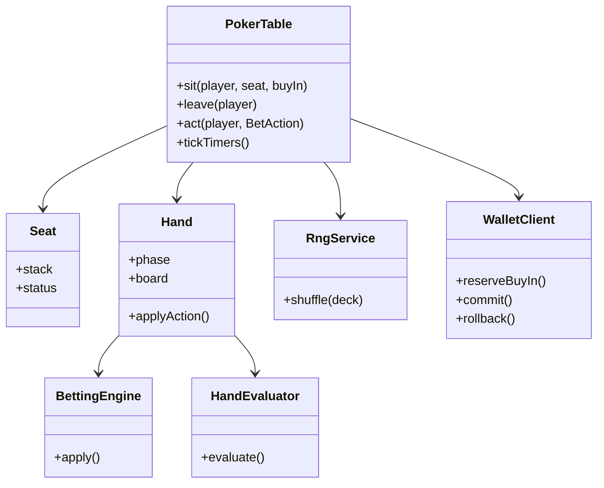

# System Design + LLD: Online Poker

> **Focus areas:** Table/hand state machines · Seats · Betting rounds · Fair RNG · Concurrency · Multiplayer HLD blend · Anti-cheat basics  
> **Style:** Amazon SDE III / L6+ — **LLD table authority** + enough **HLD** for multiplayer scale; practicality & trust  
> **Quality bar:** Correct pots/side pots, serialized table actions, provably-fair hooks, clear split of real-time vs lobby  
> **Related:** [deck-of-cards-lld-system-design.md](./deck-of-cards-lld-system-design.md), [classic-games-ood-system-design.md](./classic-games-ood-system-design.md), [multiplayer-chess-game-system-design.md](./multiplayer-chess-game-system-design.md)

---

## Table of Contents

1. [Clarify Requirements (Interview Q&A)](#1-clarify-requirements-interview-qa)
2. [Back-of-the-Envelope Estimation](#2-back-of-the-envelope-estimation)
3. [High-Level Design](#3-high-level-design)
4. [Object Model & Table LLD](#4-object-model--table-lld)
5. [APIs & Real-Time Protocol](#5-apis--real-time-protocol)
6. [State Machines](#6-state-machines)
7. [Concurrency & Authority](#7-concurrency--authority)
8. [Fairness, RNG & Security](#8-fairness-rng--security)
9. [Design Deep Dive](#9-design-deep-dive)
10. [Wrap-Up](#10-wrap-up)
11. [Deeper / Related Interview Questions](#11-deeper--related-interview-questions)
12. [Appendices](#12-appendices)

---

## 1. Clarify Requirements (Interview Q&A)

Goal: **design online Texas Hold’em**—cash or sit-and-go tables—correct hand logic, real-time multiplayer, fair dealing, and scale across many tables—not a full sportsbook or casino platform.

### 1.0 What this is / is not

| Dimension | **Online poker (this doc)** | Not this |
|-----------|----------------------------|----------|
| Primary job | Authoritative multiplayer Hold’em tables | Sports betting / slots platform |
| Success | Correct chips & cards; fair deal; low action latency | Perfect bot ban ML |
| LLD core | Seat, Table, Hand, Pot, Deck, BettingEngine | Unity client graphics |
| HLD core | Gateway, table shards, lobby, wallet | Global bank ledger product |

**Scope statement:** Online Hold’em with seats, blinds, betting streets, showdown/side pots, wallet buy-in/cash-out, fair RNG, WebSocket fanout, progressive table scale.

### 1.1 Functional Requirements

| # | Q | Typical answer | Implication |
|---|---|----------------|-------------|
| F1 | Variant? | **NL Hold’em** MVP | Rules engine Hold’em |
| F2 | Cash vs tourney? | Cash tables MVP; MTT Phase 2 | Table stacks; no huge bracket yet |
| F3 | Seats? | 2–9 max | Seat array |
| F4 | Blinds? | Configurable SB/BB; button rotates | BlindPoster |
| F5 | Disconnect? | Time bank → auto fold/check | DisconnectPolicy |
| F6 | Chat? | Optional filtered | Side channel |
| F7 | Rake? | % with cap | RakePolicy on pot |
| F8 | Wallet? | Buy-in from balance; cash out | Ledger service |
| F9 | Fairness? | Server CSPRNG + optional provably fair | Shuffle audit |
| F10 | Observing? | Sit-out / spectator limited | Privacy of holes |
| F11 | Rebuy? | Cash yes between hands | Table rules |
| F12 | Multi-table? | One player many tables | Client multiplexing; server per-table |

**MVP:**

1. Lobby list tables; sit with buy-in.  
2. Auto-start hand when ≥2 seated with stacks.  
3. Full streets + showdown + side pots.  
4. Action timeout.  
5. Wallet debit/credit.  
6. WS updates private/public views.  
7. Hand history persistence.

**Out of MVP:** Large MTT bust-out trees, PLO, poker social clubs, collusion ML deep dive (hooks only), crypto wallets.

### 1.2 NFRs

| # | NFR | Target |
|---|-----|--------|
| N1 | Action ACK latency | p99 < 100–200ms in-region |
| N2 | Correctness | Chip conservation; no card leak |
| N3 | Fairness | Unpredictable shuffle; audit |
| N4 | Availability | Table shard failover with state restore |
| N5 | Integrity | Server authoritative; client hints only |
| N6 | Scale | Many tables; hot path per table serialized |
| N7 | Compliance | Age/geo gates; KYC hooks |
| N8 | Operability | Hand replay tooling |

### 1.3 Cases

**Happy:** Sit → blinds → deal → bet streets → showdown → pot award → next hand.  
**Fold win:** All fold to aggressor → award without showdown.  
**All-in runout:** Deal remaining board.  
**Disconnect:** Timer expires → fold (or check if free).  
**Buy-in race:** Wallet reserve then seat claim.

**Edges:**

| Case | Behavior |
|------|----------|
| Two actions double-click | Idempotency / seq rejects stale |
| Seat leave mid-hand | Sit-out next; fold this hand if to act |
| Insufficient stack for BB | Sit out / all-in blind rules |
| Chat collusion | Mute + reporting; seating randomize optional |
| Shard crash mid-hand | Restore from event log / snapshot |

### 1.4 Progressive scale

| Metric | Baseline | 10× | 100× | 1,000× |
|--------|----------|-----|------|--------|
| Concurrent tables | 1K | 10K | 100K | 1M |
| Concurrent players | 5K | 50K | 500K | 5M |
| Actions/s | 2K | 20K | 200K | 2M |
| Hands/day | 2M | 20M | 200M | 2B |
| Lobby list QPS | 500 | 5K | 50K | 500K |

---

## 2. Back-of-the-Envelope Estimation

### 2.1 Split traffic

| Class | Baseline | Notes |
|-------|----------|-------|
| Table actions WS | 2K/s | Serialized per table |
| Lobby reads | 500/s | Cache |
| Wallet tx | 50/s | Strong consistency |
| Hand history writes | ~hand end rate | Append |

### 2.2 State size

```text
Table state ~5–20 KB hot
10K tables × 20 KB = 200 MB (fits shard memory easily)
1M tables → partition across many shards
```

### 2.3 Fanout

```text
9 seats + few observers ≈ 10–20 recipients / action
200K actions/s × 20 = 4M msgs/s → pubsub per table topic
```

### 2.4 Deal cost

Negligible vs network (see deck LLD).

---

## 3. High-Level Design

### 3.1 Components

```text
                    +-----------+
   Clients <--WS--> | Edge GW   |
                    +-----+-----+
                          |
            +-------------+-------------+
            v             v             v
       Lobby Service  Table Service   Wallet/Ledger
            |          (shard by      |
            |           tableId)      v
            v             |        Payments/KYC
       Table Directory    v
                      Rules Engine (lib)
                      Deck/RNG
                      Hand History Store
```

### 3.2 Ownership

| Concern | SoT |
|---------|-----|
| Seat occupancy & hand state | Table shard |
| Hole cards | Table shard (never client-trust) |
| Chip stacks at table | Table shard during sit |
| Player bankroll | Wallet ledger |
| Lobby list | Materialized view / cache |
| Hand audit | History store + RNG commits |

**Deal-breakers:** client-authoritative cards/stacks; multi-writer table state; wallet mutate without idempotency.

### 3.3 Table sharding

```text
shard = hash(tableId) % N
sticky WS to shard via GW room routing
```

Failover: replica standby or rebuild from event log.

### 3.4 UX surfaces

```text
Lobby: stakes | seats free | wait list
Table: seats, stacks, board, action buttons, timers
History: hand replayer (holes revealed after)
```

---

## 4. Object Model & Table LLD

### 4.1 Classes

```text
PokerTable
 ├── tableId, config (blinds, maxSeats, maxBuyIn...)
 ├── Seat[9] seats
 ├── buttonIndex
 ├── Hand currentHand?
 ├── TableStatus (OPEN, HAND_IN_PROGRESS, CLOSING)
 └── List<PlayerId> waitlist

Seat
 ├── index, playerId?, stack, status (EMPTY, SEATED, SITTING_OUT, IN_HAND)
 └── timeBankMs

Hand
 ├── handId, deck/shoe state, board[], pots[]
 ├── BettingState betting
 ├── phase: HandPhase
 ├── holeCards: Map<seat, Card[2]>  // server only
 └── actionHistory[]

BettingState / BettingEngine / PotCalculator / HandEvaluator
  (from classic-games poker rules)

WalletClient
RngService / Shoe
HandHistoryRecorder
DisconnectWatchdog
```

### 4.2 Mermaid



### 4.3 Config

```text
TableConfig {
  smallBlind, bigBlind, minBuyIn, maxBuyIn
  maxSeats, actionTimeoutMs, timeBankMs
  rakePercent, rakeCap
  variant: HOLDEM_NL
}
```

### 4.4 View models

```text
PublicTableView  // board, bets, stacks, buttons, timers; holes hidden
PrivateSeatView = Public + own hole cards
```

---

## 5. APIs & Real-Time Protocol

### 5.1 REST / lobby

```text
GET  /v1/lobby/tables?stakes=1-2
POST /v1/tables/{id}/sit  { seat?, buyIn } → seat assignment
POST /v1/tables/{id}/leave
GET  /v1/hands/{handId}  // history after complete
```

### 5.2 WebSocket actions

```text
Client -> Server:
  { type: ACT, tableId, handId, seq, action: RAISE, amount: 200 }
  { type: SIT_OUT, tableId }
  { type: CHAT, text }

Server -> Client:
  { type: TABLE_SNAPSHOT, view }
  { type: HAND_STARTED, button, blinds, yourCards? }
  { type: ACTION_PROMPT, seat, timeoutMs, legalActions }
  { type: ACTION_APPLIED, seat, action, statePatch }
  { type: STREET, boardCards }
  { type: PAYOUT, awards }
  { type: ERROR, code: STALE_SEQ }
```

### 5.3 Sequencing

```text
Each hand has actionSeq
Client must send expected seq; stale rejected
Table applies monotonically
```

---

## 6. State Machines

### 6.1 Table

```text
OPEN --> HAND_IN_PROGRESS --> OPEN
OPEN --> CLOSING --> CLOSED
```

### 6.2 Seat

```text
EMPTY --> SEATED --> IN_HAND --> SEATED
SEATED --> SITTING_OUT --> SEATED
SEATED --> EMPTY  (leave / kick)
```

### 6.3 Hand phase

```text
INIT → POST_BLINDS → DEAL_HOLES → PREFLOP
 → FLOP → TURN → RIVER → SHOWDOWN → RAKE_PAYOUT → COMPLETE

Any → COMPLETE early if one player remains
```

### 6.4 Betting street sub-SM

```text
AWAIT_ACTION → (apply) → next player or STREET_COMPLETE
timeout → auto fold/check policy
```

---

## 7. Concurrency & Authority

### 7.1 Single-writer table

```text
All mutations on table actor / synchronized(tableId)
WS messages enqueued to table mailbox
```

### 7.2 Sit / wallet race

```text
1. wallet.reserve(buyIn, idempotencyKey)
2. claim seat CAS empty→seated
3. if fail: wallet.rollback
4. if ok: wallet.commit → stack=buyIn
```

### 7.3 Multi-table players

Player gateway demux; each act routed by tableId; **no cross-table lock**.

### 7.4 Timer thread

```text
Wheel of next action deadlines per table
On fire: enqueue TimeoutAction to table mailbox (same single writer)
```

### 7.5 Chip conservation assert

```text
sum(stacks) + sum(pots) + rakeAccrual == sum(buyIns) - sum(cashOuts)  (table era)
```

Debug checks after each hand.

---

## 8. Fairness, RNG & Security

### 8.1 Server CSPRNG shuffle

Fisher–Yates with `SecureRandom` (deck LLD). Persist `shoeHash` after shuffle for audit.

### 8.2 Provably fair (optional)

```text
Before hand: publish hash(serverSeed)
Collect clientSeeds from seated players (or none)
combined = HMAC(serverSeed, clientSeeds||handId)
shuffle(combined)
After hand: reveal serverSeed; clients verify
```

### 8.3 Information security

- Never broadcast hole cards.  
- Spectators get public view only.  
- Hand history reveals holes **after** hand (or per privacy policy).  
- Encrypt snapshots at rest.

### 8.4 Anti-collusion / bots (hooks)

| Signal | Action |
|--------|--------|
| Shared IP / device farms | Risk score |
| Timing patterns | Soft CAPTCHA / delay |
| Chip dumping | Graph analysis offline |
| Multi-accounting | KYC |

Don’t claim perfect detection in MVP.

### 8.5 Legal / geo

Edge rejects jurisdictions; table creation constrained. Compliance service—mention ownership.

---

## 9. Design Deep Dive

### 9.1 Hand start

```text
function tryStart(table):
  seated = seats with stack>0 and not sitout
  if seated < 2: return
  rotate button
  hand = new Hand(id, shuffle(newDeck()))
  postBlinds(hand)
  deal holes 2 each
  phase = PREFLOP
  prompt first to act (UTG)
```

### 9.2 Apply action

```text
function act(player, action, seq):
  assert hand.seq == seq
  assert seat.toAct == player
  betting = bettingEngine.apply(hand.betting, action)
  record history
  if betting.streetComplete:
     advanceStreet()
  else:
     prompt next
  broadcast patches
```

### 9.3 Advance street

```text
PREFLOP complete → burn+deal 3 → FLOP betting reset
FLOP → burn+1 TURN
TURN → burn+1 RIVER
RIVER → showdown
```

If all-in early: `runout()` without betting.

### 9.4 Showdown & rake

```text
pots = potCalculator(contributions)
for pot in pots:
  winners = best hand among eligible not folded
  split pot among winners
rake = min(cap, percent * pot) from pots per policy (usually main pot)
wallet updates async from table settlement events
```

### 9.5 Disconnect policy

```text
on disconnect: keep seat; timer continues
on timeout: if can check then check else fold
time bank: optional extra once per hand/orbit
```

### 9.6 Persistence

```text
Event sourcing per table:
  SeatSat, HandStarted{seedCommit}, Action..., HandCompleted{awards,reveal}
Snapshot every N hands for fast restore
```

### 9.7 Lobby listing

```text
Table service emits occupancy changes → Lobby indexer (Redis)
Clients poll/subscribe lobby topics by stake bucket
```

### 9.8 Failure modes

| Failure | Mitigation |
|---------|------------|
| Shard death | Failover + replay events |
| Wallet down | Block new sit; continue hands with table stacks |
| GW blip | Client resubscribe + snapshot |
| Bad deploy rules | engineVersion pin; replay tool |

### 9.9 Comparison to chess design

| | Chess | Poker |
|---|-------|-------|
| Hidden info | No | Yes (holes) |
| Clock | Per player main | Action timer |
| RNG | No | Shuffle critical |
| Side effects | Rating | Wallet + rake |

### 9.10 MTT sketch (Phase 2)

```text
TournamentService assigns players to tables
Eliminations rebalance (complex!)
Payout ladder from prize pool
```

Call out rebalance as hardest part—defer.

### 9.11 Observability

```text
action_latency, timeout_rate, hand_duration
chip_conservation_fail (page)
rng_health, wallet_reserve_fail
```

### 9.12 Client prediction

Show optimistic raise UI; reconcile on ACK/reject. Stacks authoritative from server patch.

---

## 10. Wrap-Up

Online poker = **wallet + lobby HLD** around a **single-writer table LLD** that owns seats, hand FSM, betting engine, deck RNG, and private views. Fairness via CSPRNG (+ optional commit-reveal). Scale by sharding tables; never by splitting one hand across writers.

### Deal-breakers

1. Client deals cards.  
2. No side pots.  
3. Shared mutable table without serialization.  
4. Wallet sit without reserve/rollback.

### Ownership

Table correctness & hand replay; wallet money movement; compliance geo; risk offline collusion.

---

## 11. Deeper / Related Interview Questions

| Q | A |
|---|---|
| Side pots? | Layer contributions; eligibility |
| Fair shuffle? | CSPRNG Fisher–Yates; provably fair optional |
| Scale 1M tables? | Shard by tableId; lobby indexed |
| Disconnect? | Timeout auto-action |
| Rake? | Policy on pots with cap |
| Hide cards? | viewFor / private channel |
| Replay dispute? | Event log + seed reveal |
| Collusion? | Soft signals; don’t overclaim |
| PLO extension? | New evaluator; 4 hole cards |
| Compare chess? | Hidden info + wallet |

### Traps

| Trap | Response |
|------|----------|
| DB row per action without actor model | OK store, but authority still single-threaded apply |
| “Use blockchain for fair” | Optional; CSPRNG+audit usually enough MVP |
| Global lock all tables | Kill throughput |

---

## 12. Appendices

### A. Class checklist

```text
PokerTable, Seat, Hand, BettingState, BetAction
BettingEngine, PotCalculator, HandEvaluator
Deck/RngService, WalletClient, HandHistoryRecorder
LobbyIndex, TableShard, DisconnectWatchdog
```

### B. Legal actions helper

```text
canCheck, canCall, callAmount, minRaiseTo, maxRaiseTo(=stack)
```

### C. Blind posting

```text
SB = button+1 (6-max rules vary heads-up: button posts SB)
BB = next
heads-up special case: button = SB
```

### D. Error codes

| Code | Meaning |
|------|---------|
| SEAT_TAKEN | Race lost |
| INSUFFICIENT_BUYIN | Wallet/stack |
| STALE_SEQ | Old action |
| NOT_YOUR_TURN | — |
| ILLEGAL_ACTION | Rules reject |
| HAND_NOT_ACTIVE | — |

### E. Chip conservation test vectors

All-in three players unequal stacks—assert awards sum + rake = pot.

### F. 45-min plan

| Min | Focus |
|-----|-------|
| 0–7 | Requirements / cash Hold’em |
| 7–18 | HLD diagram shards |
| 18–32 | Table LLD + hand FSM |
| 32–40 | RNG/fairness + wallet sit |
| 40–45 | Scale + Q&A |

### G. Sample action patch

```text
{ stacks: {0:900,1:1100}, streetBets: {...}, pot: 200, toAct: 2 }
```

### H. Invariants

1. One active hand per table max.  
2. Hole cards only to owner until reveal.  
3. Action seq monotonic.  
4. sum awards + rake = pot.  
5. Seat stack ≥ 0.

### I. Rake example

```text
pot=100, rake 5% cap 3 → rake=3; distributable=97
```

### J. Glossary

| Term | Meaning |
|------|---------|
| Button | Dealer position marker |
| Street | Betting round |
| Time bank | Extra disconnect reserve |
| Rake | House fee |
| Runout | Deal remaining board all-in |
| Commit-reveal | Provable seed protocol |

### K. Rubric

| Signal | Weak | Strong |
|--------|------|--------|
| Authority | Client trust | Single-writer table |
| Pots | Single pot only | Side pots |
| Fairness | Math.random | CSPRNG + audit |
| Scale | One server | tableId shards |

### L. Hand history schema sketch

```text
hand_id, table_id, engine_version, seed_commit, seed_reveal,
seats[], actions[], board, holes_reveal[], pots[], awards[], ts
```

### M. Security checklist

- TLS everywhere  
- No card logs at INFO  
- AuthN on WS  
- Rate limit acts  
- Geo fence  

### N. Related Amazon themes

Trust (fair games), ownership (hand correctness pager), frugality (shard memory efficiency), customer obsession (disconnect fairness).

### O. Sequence: raise

```text
Client ACT RAISE -> GW -> Table mailbox
 -> BettingEngine
 -> broadcast ACTION_APPLIED
 -> prompt next seat
```

### P. Sit sequence

```text
Client sit -> Wallet.reserve -> Seat CAS -> Wallet.commit
 -> broadcast SeatUpdated -> maybe tryStart
```

### Q. Side-pot worked example

```text
Stacks entering street: A=50, B=200, C=200 (all all-in or matching layers)
Contributions: A50, B200, C200
Pot1 = 150 eligible A,B,C
Pot2 = 300 eligible B,C
If A wins high hand: A gets Pot1 only; Pot2 to better of B/C
If B wins: B gets Pot1+Pot2
Chip sum check: 150+300 = 450 = 50+200+200
```

### R. Action legality matrix (NLHE)

| Action | Condition |
|--------|-----------|
| FOLD | always when to act (except some all-in wait) |
| CHECK | myStreetBet == currentBet |
| CALL | currentBet > myStreetBet; pay delta or all-in |
| BET | currentBet==0; amount ≥ BB (or min-bet policy) |
| RAISE | amount ≥ currentBet + minRaise (unless short all-in) |

### S. Test plan (table authority)

```text
- double ACT same seq → one apply
- side pot vector above
- disconnect timeout fold
- sit wallet rollback on seat race
- hole cards absent from public snapshots (fuzz serializer)
- engineVersion pinned in hand history
```

### T. Bar-raiser notes

- Hidden information + wallet makes poker stricter than chess authority.  
- Side pots are non-optional once all-ins exist.  
- Fairness narrative: CSPRNG + audit > buzzword “blockchain shuffle”.

---

**End of online poker design.** Anchor on single-writer table authority, side pots, and fair shuffle; layer lobby/wallet/shards as the HLD shell.
