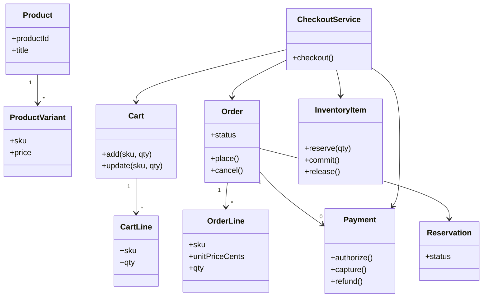

# LLD / OOD: Online Store Object Model

> **Focus areas:** Product · Cart · Order · Payment · Inventory domain classes & relationships · State machines · Consistency boundaries  
> **Style:** Amazon SDE III / L6+ — **domain object model** (not full Amazon.com HLD); commerce correctness  
> **Quality bar:** Clear aggregates, money invariants, inventory reservation, payment idempotency, extension points  
> **Related:** [online-store-system-design.md](./online-store-system-design.md), [shopping-cart-system-design.md](./shopping-cart-system-design.md), [inventory-management-system-system-design.md](./inventory-management-system-system-design.md), [coupon-class-hierarchy-lld-system-design.md](./coupon-class-hierarchy-lld-system-design.md)

---

## Table of Contents

1. [Clarify Requirements (Interview Q&A)](#1-clarify-requirements-interview-qa)
2. [Non-Functional Requirements & Light Estimation](#2-non-functional-requirements--light-estimation)
3. [Cases (Flows & Edge Cases)](#3-cases-flows--edge-cases)
4. [Object Model & Class Diagrams](#4-object-model--class-diagrams)
5. [APIs / Application Services](#5-apis--application-services)
6. [State Machines](#6-state-machines)
7. [Concurrency & Consistency](#7-concurrency--consistency)
8. [Extensibility & Patterns](#8-extensibility--patterns)
9. [Design Deep Dive](#9-design-deep-dive)
10. [Wrap-Up](#10-wrap-up)
11. [Deeper / Related Interview Questions](#11-deeper--related-interview-questions)
12. [Appendices](#12-appendices)

---

## 1. Clarify Requirements (Interview Q&A)

Goal: **design the core domain object model for an online store**—catalog product, cart, checkout order, payment, inventory—with relationships and invariants clear enough to implement or map to services.

### 1.0 What this is / is not

| Dimension | **Online store object model LLD** | Not this |
|-----------|----------------------------------|----------|
| Primary job | Domain classes, aggregates, lifecycles | Search relevance, Prime Video, full marketplace HLD |
| Success | No oversell; paid ⇒ order; refundable trail | Perfect recommendation ML |
| Depth | Product/Cart/Order/Payment/Inventory | Warehouse robotics |

**Scope statement:** OO / DDD-style model for a single-merchant (or simple multi-SKU) online store: product catalog, cart, checkout, payment ports, inventory reservation, order fulfillment states—with concurrency at checkout.

### 1.1 Functional Requirements

| # | Q | Typical answer | Implication |
|---|---|----------------|-------------|
| F1 | Product model? | SKU, price, attrs; optional variants | Product / ProductVariant |
| F2 | Cart? | Auth + anonymous; qty update | Cart aggregate |
| F3 | Checkout? | Cart → Order snapshot prices | Order lines immutable copy |
| F4 | Payment? | PSP auth/capture | Payment + PaymentAttempt |
| F5 | Inventory? | Reserve at checkout | InventoryItem + Reservation |
| F6 | Shipping? | Address + method | ShippingInfo on order |
| F7 | Tax/promo? | Hooks | TaxPort, CouponEvaluator port |
| F8 | Cancel/refund? | Before ship / partial | Order + Payment refund |
| F9 | Catalog browse? | Basic; search out of scope | ProductRepository |
| F10 | Multi-warehouse? | Optional ATP by location | InventoryLocation |

**MVP:**

1. CRUD-ish product/SKU with price.  
2. Cart add/update/remove.  
3. Checkout: price snapshot, reserve inventory, create order, pay.  
4. Order states through ship/deliver.  
5. Cancel/refund paths.  
6. Idempotent payment.

**Out of MVP:** Marketplace multi-seller payments split, subscriptions, full OMS warehouse waves (mention hooks).

### 1.2 Dialogue

**You:** Variants? Soft vs hard inventory? Auth then capture? Cart price freshness?

**Interviewer:** Size/color variants; hard reserve at checkout; auth at place, capture on ship; reprice at checkout.

**You:** I’ll use aggregates **Product**, **Cart**, **Order**, **Inventory**, **Payment** with clear transaction boundaries and a `CheckoutService` saga.

### 1.3 Assumptions

- Integer minor units.  
- Order lines snapshot name/price at purchase (catalog can change later).  
- One payment intent per checkout attempt (retries = new attempt or idempotent key).  
- Guest checkout allowed with email.

---

## 2. Non-Functional Requirements & Light Estimation

### 2.1 NFRs

| NFR | Target |
|-----|--------|
| Checkout correctness | No oversell; no silent free goods |
| Idempotency | Retries safe |
| Latency | Checkout p99 interactive (ex-PSP) |
| Auditability | Payment & inventory ledgers |
| Extensibility | New payment methods / fulfillment |
| Consistency | Strong for inventory+order; catalog eventual OK |

### 2.2 Light scale (object-model interview)

| Metric | Small shop | Growing |
|--------|------------|---------|
| SKUs | 1K | 100K |
| Cart ops/s | 50 | 5K |
| Checkout/s | 5 | 500 |
| Concurrent reserve on hot SKU | tens | thousands → HLD sharding |

Say: model stays; infrastructure changes at scale (see online-store HLD).

---

## 3. Cases (Flows & Edge Cases)

### Happy paths

1. Browse product → add variant to cart → checkout → reserve → pay auth → order PLACED → ship → capture → DELIVERED.  
2. Update cart qty; quote updates.  
3. Apply coupon code → totals change (evaluator port).  
4. Cancel before ship → release inventory → void/refund auth.  
5. Partial return after deliver → refund portion; inventory restock policy.

### Edges

| Case | Behavior |
|------|----------|
| Hot SKU double checkout | One reserve wins |
| Pay fails after reserve | Release reservation; order PAYMENT_FAILED |
| Pay succeeds, persist order fails | Reconcile via PSP idempotency + outbox |
| Price change mid-cart | Checkout uses current or fails if drift policy |
| Out of stock at checkout | Reject line |
| Duplicate submit | Idempotency key |
| Refund > captured | Reject |
| Variant deleted while in cart | Line invalid at checkout |

### Sequences

**Checkout saga**

```text
CheckoutService.checkout(cartId, payMethod, idemKey)
  -> validate cart lines vs catalog
  -> price + tax + promo
  -> inventory.reserve(lines)
  -> order = Order.createFrom(cart, quote) PENDING_PAYMENT
  -> payment.auth(order.total, idemKey)
  -> order.markPLACED; inventory.commit
  -> clear cart
  -> emit OrderPlaced
```

**Ship**

```text
Fulfillment.ship(orderId, tracking)
  -> order.SHIPPED
  -> payment.capture()
```

---

## 4. Object Model & Class Diagrams

### 4.1 Catalog

```text
Product
 ├── productId
 ├── title, description
 ├── brand?
 ├── List<ProductVariant> variants
 └── status: ACTIVE|INACTIVE

ProductVariant
 ├── sku
 ├── attributes {color, size, ...}
 ├── price: Money   // or PriceList
 ├── weight?
 └── active: bool

Category (optional) many-to-many with Product
```

### 4.2 Cart

```text
Cart
 ├── cartId
 ├── customerId? / anonymousToken
 ├── List<CartLine> lines
 ├── currency
 ├── updatedAt
 └── couponCode?

CartLine
 ├── lineId
 ├── sku
 ├── qty
 └── // optional cached unitPrice for display only — not SoT
```

**Aggregate root:** Cart. Invariants: qty > 0; unique sku per line (or merge).

### 4.3 Order

```text
Order
 ├── orderId
 ├── customerId / guestEmail
 ├── List<OrderLine> lines   // snapshots
 ├── Money subtotal, discount, tax, shipping, total
 ├── ShippingInfo
 ├── BillingInfo?
 ├── OrderStatus status
 ├── paymentId?
 ├── reservationId?
 ├── placedAt, version
 └── fulfillment updates[]

OrderLine
 ├── sku, productNameSnapshot, attrsSnapshot
 ├── unitPriceCents, qty
 ├── lineDiscountCents
 └── status (for partial cancel)
```

### 4.4 Payment

```text
Payment
 ├── paymentId
 ├── orderId
 ├── amount
 ├── currency
 ├── methodToken  // PSP token, not PAN
 ├── status: INITIATED|AUTHORIZED|CAPTURED|VOIDED|REFUNDED|FAILED
 └── List<PaymentAttempt> attempts

PaymentAttempt
 ├── attemptId, idempotencyKey
 ├── type: AUTH|CAPTURE|VOID|REFUND
 ├── pspRef
 └── result
```

### 4.5 Inventory

```text
InventoryItem
 ├── sku
 ├── locationId  // "DEFAULT" MVP
 ├── onHand
 ├── reserved
 └── version  // optimistic lock

// available = onHand - reserved

Reservation
 ├── reservationId
 ├── orderId?
 ├── List<ReservationLine {sku, qty}>
 ├── expiresAt
 └── status: ACTIVE|COMMITTED|RELEASED|EXPIRED
```

### 4.6 Mermaid ER / class



### 4.7 Aggregate boundaries (DDD)

| Aggregate | Root | Boundary rule |
|-----------|------|---------------|
| Catalog Product | Product | Variants inside |
| Cart | Cart | Lines inside |
| Order | Order | Lines + shipping inside |
| InventoryItem | InventoryItem per sku+location | Reservation may be own aggregate |
| Payment | Payment | Attempts inside |

**CheckoutService** is application service orchestrating multiple aggregates—not an aggregate itself.

### 4.8 Relationship summary

```text
Customer 1--* Cart
Customer 1--* Order
Product 1--* ProductVariant (sku)
Cart *--* ProductVariant (via sku in CartLine)
Order *--* ProductVariant (snapshot; weak ref by sku)
Order 1--1 Reservation (checkout)
Order 1--1 Payment
InventoryItem 1--* ReservationLine (indirect)
```

---

## 5. APIs / Application Services

```text
interface CatalogService {
  Product getProduct(productId)
  ProductVariant getBySku(sku)
}

interface CartService {
  Cart getOrCreate(customerRef)
  Cart addItem(cartId, sku, qty)
  Cart updateQty(cartId, sku, qty)
  Cart removeItem(cartId, sku)
  Cart applyCoupon(cartId, code)
}

interface CheckoutService {
  Order checkout(CheckoutRequest req)
}

CheckoutRequest {
  cartId, shippingAddress, shippingMethod
  paymentMethodToken, idempotencyKey
}

interface OrderService {
  Order get(orderId)
  void cancel(orderId, reason)
  void markShipped(orderId, tracking)
  void markDelivered(orderId)
}

interface PaymentPort {
  AuthResult authorize(AuthCommand) // idempotent
  CaptureResult capture(paymentId, amount?)
  RefundResult refund(paymentId, amount, idemKey)
  VoidResult voidAuth(paymentId)
}

interface InventoryPort {
  Reservation reserve(List<LineQty>, ttl, idemKey)
  void commit(reservationId)
  void release(reservationId)
}

interface PricingService {
  Quote quote(Cart cart, ShippingMethod method, CustomerCtx ctx)
}
```

### REST mapping (thin)

```text
POST /carts/{id}/items
POST /checkout
POST /orders/{id}/cancel
POST /orders/{id}/ship
POST /orders/{id}/refunds
```

---

## 6. State Machines

### 6.1 Order

```text
PENDING_PAYMENT --> PLACED --> PACKING --> SHIPPED --> DELIVERED
PENDING_PAYMENT --> PAYMENT_FAILED
PLACED / PACKING --> CANCELLED
SHIPPED --> RETURN_REQUESTED --> RETURNED
DELIVERED --> RETURN_REQUESTED --> RETURNED
```

### 6.2 Payment

```text
INITIATED --> AUTHORIZED --> CAPTURED
AUTHORIZED --> VOIDED
CAPTURED --> REFUNDED (partial via amounts)
INITIATED --> FAILED
```

### 6.3 Reservation

```text
ACTIVE --> COMMITTED
ACTIVE --> RELEASED
ACTIVE --> EXPIRED (sweeper)
```

### 6.4 Cart

No heavy SM; soft states ACTIVE / CONVERTED / ABANDONED (analytics).

### 6.5 Product

```text
DRAFT --> ACTIVE --> INACTIVE
```

### Combined checkout transitions

| Step | Order | Payment | Reservation |
|------|-------|---------|-------------|
| start | PENDING_PAYMENT | INITIATED | ACTIVE |
| auth OK | PLACED | AUTHORIZED | COMMITTED |
| auth fail | PAYMENT_FAILED | FAILED | RELEASED |
| ship | SHIPPED | CAPTURED | — |

---

## 7. Concurrency & Consistency

### 7.1 Inventory reservation (core race)

```text
UPDATE inventory_items
SET reserved = reserved + :qty, version = version + 1
WHERE sku=:sku AND location=:loc
  AND version=:ver
  AND on_hand - reserved >= :qty
```

Or single-threaded per sku shard. Retry on version conflict.

### 7.2 Idempotent checkout

```text
idempotency_keys: key -> orderId
if exists: return order
else run saga; store mapping
```

### 7.3 Payment idempotency

PSP keys = `orderId + attempt` or client key; never double auth for same key.

### 7.4 Cart concurrent edits

Last-write-wins with `cart.version` or per-customer lock. At checkout, reload cart snapshot once.

### 7.5 Outbox for events

```text
In same DB TX as Order PLACED:
  write Outbox(OrderPlaced)
Publisher relays to bus → email, analytics
```

### 7.6 Reconciliation

Job: AUTHORIZED payments without PLACED order → void; ACTIVE reservation past TTL → release; CAPTURE mismatch vs PSP → alert.

### 7.7 Consistency classes

| Data | Consistency |
|------|--------------|
| Inventory reserved | Strong |
| Order + payment link | Strong |
| Catalog price | Read at checkout; eventual between |
| Cart display price | Soft |

---

## 8. Extensibility & Patterns

| Pattern | Use |
|---------|-----|
| Aggregate / Entity / Value Object | DDD layering (Money, Address) |
| Repository | ProductRepository, OrderRepository |
| Port/Adapter | PaymentPort, TaxPort |
| Saga / Process manager | CheckoutService |
| Strategy | Shipping rate, tax jurisdiction |
| Factory | OrderFactory.fromCart |
| Snapshot | OrderLine from ProductVariant |
| Domain events | OrderPlaced, PaymentCaptured |
| Specification | Cart validation rules |

### Extensions

- Multi-warehouse ATP: pick location strategy.  
- Marketplace: `SellerId` on OrderLine; split payments later.  
- Subscriptions: `Subscription` aggregate creating Orders.  
- Digital goods: skip shipping; capture on PLACED.  
- Gift cards as tender: multi-payment allocation.

---

## 9. Design Deep Dive

### 9.1 Why snapshot OrderLine?

Catalog price/title change must not mutate historical orders or receipts. Store denormalized fields + sku reference.

### 9.2 Money value object

```text
Money { long cents; Currency currency }
add/subtract same currency only
never float
```

### 9.3 Available to promise

```text
ATP = onHand - reserved
optional: - softHoldFromCarts (usually not — carts lie)
```

Amazon interview: **don’t reserve on add-to-cart** for general goods (abandonment); reserve at checkout. Exceptions: flash deals (HLD).

### 9.4 Checkout pricing drift policy

```text
if abs(quotedTotal - freshTotal) > threshold:
  return PRICE_CHANGED with new quote
else proceed
```

### 9.5 Partial shipment (extension)

```text
Shipment { id, orderId, lines[] }
Order remains OPEN until all shipped
Capture per shipment or auth full upfront
```

MVP single shipment.

### 9.6 Refund allocation

Use stored line discounts (coupon LLD allocator) to refund proportionally; restock inventory if physical return received.

### 9.7 Guest → user merge

Merge anonymous cart on login: sku qty merge policy (sum capped by ATP display).

### 9.8 Failure matrix

| Failure point | Compensation |
|---------------|--------------|
| Reserve fails | No order |
| Order persist fails after reserve | Release (TX preferred) |
| Auth fails | Release; PAYMENT_FAILED |
| Auth OK, commit reserve fails | Void auth; alert |
| Capture fails at ship | Retry; hold shipment status |

Prefer **single DB transaction** for order+reserve commit when monolith; saga with compensations when services split.

### 9.9 Class sketch: InventoryItem

```text
class InventoryItem:
  def reserve(self, qty, version):
    if self.on_hand - self.reserved < qty: raise InsufficientStock()
    if self.version != version: raise Conflict()
    self.reserved += qty
    self.version += 1
```

### 9.10 Class sketch: OrderFactory

```text
function fromCart(cart, quote, shipping):
  lines = [OrderLine.snapshot(variant, qty, quote.line) for ...]
  return Order.newId(..., PENDING_PAYMENT, lines, quote.totals, shipping)
```

### 9.11 Mapping to microservices

| Aggregate | Likely service |
|-----------|----------------|
| Product | Catalog |
| Cart | Cart service |
| Order | Order service |
| Inventory | Inventory service |
| Payment | Payments |

Object model still valid—**bounded contexts** align to aggregates.

### 9.12 Anti-patterns

- Mutable `Product.price` on old orders.  
- Cart as only SoT after checkout (lost history).  
- Inventory `quantity--` without reserved.  
- Payment PAN stored in Order.  
- One megaclass `StoreManager`.

### 9.13 Tax/shipping hooks

```text
interface TaxPort { TaxResult compute(TaxableOrder o, Address shipTo) }
interface ShippingRatePort { Money rate(Cart c, Method m, Address a) }
```

### 9.14 Coupon integration

Checkout calls `CartEvaluator` (coupon LLD) → discounts into Quote → Order totals + per-line allocation persisted.

### 9.15 Observability domain metrics

```text
checkout_success_rate
reserve_conflict_total
payment_auth_fail_total
inventory_atp_zero_sku_total
order_cancel_pre_ship_total
```

---

## 10. Wrap-Up

Online store LLD = **Product/Variant catalog**, **Cart aggregate**, **Order snapshots**, **Payment with attempts**, **Inventory with reserve/commit/release**, orchestrated by **CheckoutService** saga. Strong invariants on ATP and money; idempotent pay; events via outbox. Scale/search/marketplace → HLD siblings.

### Deal-breakers

1. No reservation (naked decrement race).  
2. Float money.  
3. Order lines alias live Product price.  
4. Non-idempotent checkout/payment.

### Ownership

Checkout correctness pager; inventory conservation; payment reconciliation; catalog/content separate.

---

## 11. Deeper / Related Interview Questions

| Q | A |
|---|---|
| Aggregates? | Product, Cart, Order, InventoryItem, Payment |
| Prevent oversell? | Reserve with ATP check + version |
| When capture? | On ship (MVP policy) |
| Cart vs Order? | Cart mutable; Order immutable lines snapshot |
| Idempotency? | Key → orderId; PSP keys |
| Partial refund? | Payment.refund amount; line allocation |
| Variants? | ProductVariant sku attrs |
| Soft inventory? | Mention; prefer hard at checkout |
| Microservice split? | By aggregate/bounded context |
| Coupons? | Evaluator port; persist allocations |

### Traps

| Trap | Response |
|------|----------|
| Reserve on add-to-cart always | Abandonment holds stock; usually checkout |
| “Just use SELECT FOR UPDATE everywhere” | OK small; sku striping at scale |
| Store card numbers | PSP tokens only |

### Related docs

online-store HLD, shopping-cart, inventory-management, coupon LLD, discounts HLD, customer-order-product database.

---

## 12. Appendices

### A. Class checklist

```text
Product, ProductVariant, Category?
Cart, CartLine
Order, OrderLine, ShippingInfo
Payment, PaymentAttempt
InventoryItem, Reservation, ReservationLine
Money, Address
CatalogService, CartService, CheckoutService, OrderService
PaymentPort, InventoryPort, PricingService, TaxPort, ShippingRatePort
```

### B. Invariants

1. `onHand >= reserved >= 0`  
2. Order total = subtotal − discount + tax + shipping  
3. CAPTURED amount ≤ AUTHORIZED (usual card flow)  
4. COMMITTED reservation ⇔ PLACED+ order with stock  
5. Cart line qty ≥ 1  

### C. Error codes

| Code | Meaning |
|------|---------|
| SKU_NOT_FOUND | — |
| INSUFFICIENT_STOCK | Reserve fail |
| PRICE_CHANGED | Drift policy |
| PAYMENT_FAILED | Auth decline |
| IDEMPOTENT_REPLAY | Returned existing order |
| INVALID_ORDER_STATE | Illegal transition |

### D. Sample schema (SQL sketch)

```text
products(product_id, title, status)
variants(sku PK, product_id, attrs_json, price_cents, active)
carts(cart_id, customer_id, version, coupon)
cart_lines(cart_id, sku, qty)
orders(order_id, status, totals..., reservation_id, payment_id, version)
order_lines(order_id, sku, name_snap, price_cents, qty, disc_cents)
inventory(sku, location, on_hand, reserved, version)
reservations(id, status, expires_at, order_id)
payments(id, order_id, status, amount, token)
payment_attempts(id, payment_id, idem_key, type, psp_ref)
idempotency(key PK, order_id)
```

### E. 45-min plan

| Min | Focus |
|-----|-------|
| 0–5 | Scope |
| 5–18 | Class/aggregate diagram |
| 18–28 | Checkout saga + states |
| 28–38 | Inventory concurrency + payment |
| 38–45 | Extensibility + Q&A |

### F. Glossary

| Term | Meaning |
|------|---------|
| SKU | Stock keeping unit id |
| ATP | Available to promise |
| Snapshot | Copied price/title onto order |
| Auth/Capture | Two-step card payment |
| Outbox | Reliable domain event publish |
| Aggregate | Consistency boundary |

### G. Rubric

| Signal | Weak | Strong |
|--------|------|--------|
| Model | Tables only | Aggregates + invariants |
| Inventory | qty-- | reserve/commit |
| Payment | single boolean paid | attempts + states |
| Order lines | live FK price | snapshots |

### H. Event catalog

```text
CartUpdated, CheckoutStarted, InventoryReserved,
OrderPlaced, PaymentAuthorized, PaymentCaptured,
OrderShipped, OrderCancelled, OrderRefunded
```

### I. Guest checkout fields

```text
guestEmail, marketingOptIn?
createAccount? post-order
```

### J. Digital goods shortcut

```text
On PLACED: capture immediately; fulfillment = grant license; no Reservation physical
```

### K. Sequence diagram: cancel pre-ship

```text
OrderService.cancel
  assert status in {PLACED, PACKING}
  payment.void or refund
  inventory.release if not committed consume... (if COMMITTED at place: restock onHand+=qty, reserved-=qty OR onHand+= if already decremented on commit)
  status CANCELLED
```

**Commit semantics note:** Two styles—(1) commit = reserved→sold decrement onHand; (2) commit = mark reservation, decrement on ship. **Pick one and be consistent.** Recommend: at PLACED, `onHand -= qty; reserved -= qty` (stock sold), cancel restocks `onHand += qty`.

### L. Commit style A (recommended speak)

```text
reserve: reserved += qty
commit: onHand -= qty; reserved -= qty
release: reserved -= qty
cancel after commit: onHand += qty
```

### M. Quote structure

```text
Quote {
  lines: [{sku, qty, unitPrice, lineDiscount}]
  subtotal, discount, tax, shipping, total
  promoExplanations[]
  expiresAt
}
```

### N. Amazon flavor

Customer trust = correct charge and stock promise. Prefer failing checkout over overselling. Own reconciliation jobs.

### O. Relationship ASCII

```text
[Product]──<has>──[Variant sku]
                      ∧
              cart/order reference
                      │
[Cart]──<lines>──[CartLine]     [Order]──<lines>──[OrderLine snapshots]
                      │                              │
                      +──────── checkout ───────────→+
                                                     │
                                          [Payment] [Reservation]
                                                     │
                                              [InventoryItem]
```

### P. Unit test ideas

1. Reserve concurrent ATP=1 → one success.  
2. Checkout idempotent key.  
3. Price snapshot survives catalog price change.  
4. Cancel restocks.  
5. Illegal SHIPPED→CANCELLED rejected.

### Q. Progressive enhancement

| Phase | Add |
|-------|-----|
| MVP | Single location inventory, auth/capture |
| 1.5 | Coupons, tax port, guest checkout |
| 2 | Multi-warehouse, partial ship |
| 3 | Marketplace splits → HLD |

---

**End of online-store object model LLD.** Lead with aggregates and the reserve→pay→place saga; earn seniority points with snapshots, idempotency, and explicit commit/cancel inventory math.
