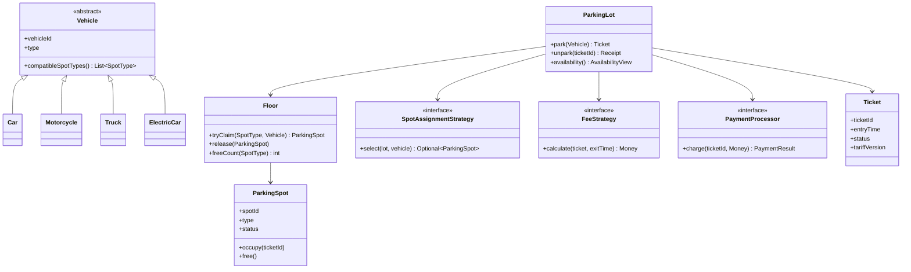

# LLD / OOD: Parking Lot System

> **Focus areas:** Spots · Vehicles · Tickets · Fee strategies · Multi-level garages · Concurrency at entry/exit · Extensibility for EV/handicap/reserved  
> **Style:** Amazon SDE III / L6+ — mostly **object design** with light scale where concurrency matters; practicality, correctness, ownership  
> **Quality bar:** Clear domain model, race-free assign/release, pluggable pricing, interviewer-ready class & sequence diagrams  
> **Related HLD:** [parking-payment-system-system-design.md](./parking-payment-system-system-design.md) (payments/gates/cloud); this doc owns in-process / service object model

---

## Table of Contents

1. [Clarify Requirements (Interview Q&A)](#1-clarify-requirements-interview-qa)
2. [Non-Functional Requirements & Light Estimation](#2-non-functional-requirements--light-estimation)
3. [Cases (Flows & Edge Cases)](#3-cases-flows--edge-cases)
4. [Object Model & Class Diagrams](#4-object-model--class-diagrams)
5. [APIs / Public Interfaces](#5-apis--public-interfaces)
6. [State Machines](#6-state-machines)
7. [Concurrency & Thread Safety](#7-concurrency--thread-safety)
8. [Extensibility & Design Patterns](#8-extensibility--design-patterns)
9. [Design Deep Dive](#9-design-deep-dive)
10. [Wrap-Up](#10-wrap-up)
11. [Deeper / Related Interview Questions](#11-deeper--related-interview-questions)
12. [Appendices](#12-appendices)

---

## 1. Clarify Requirements (Interview Q&A)

Goal: **design the object model for a multi-level parking lot**—assign compatible spots, issue tickets, compute fees on exit, release spots—without boiling the ocean into citywide ANPR payments (that’s the related HLD).

### 1.0 What this is / is not

| Dimension | **Parking lot LLD (this doc)** | Not this |
|-----------|--------------------------------|----------|
| Primary job | Spot inventory + ticket lifecycle + fee calc | Full PSP settlement / gate OS fleet |
| Success | No double-assign; correct fee; clear types | Perfect camera CV per stall |
| Abstractions | Lot, Floor, Spot, Vehicle, Ticket, ParkingService, FeeStrategy | Kafka multi-region cells |
| Concurrency | Two cars enter same last spot | Millions of garages globally |
| Amazon lens | Correctness, extensibility, ownership of money math | Clever ML plate reading |

**Scope statement:** Design classes and interactions for a multi-level parking lot: vehicle entry, spot assignment by type, tickets, time-based (pluggable) fees, exit/release, with concurrency safety and extension points for EV, handicap, and reserved spots.

### 1.1 Functional Requirements

| # | Question to ask | Expected / typical interviewer answer | Design implication |
|---|-----------------|----------------------------------------|--------------------|
| F1 | Single floor or multi-level? | **Multi-level** | `ParkingLot` → `Floor` → `Spot` |
| F2 | Spot types? | Compact, large, motorcycle, handicap, EV | Enum + compatibility matrix |
| F3 | Vehicle types? | Motorcycle, car, truck/bus, EV car | `Vehicle` hierarchy or type + size |
| F4 | Assignment policy? | Smallest fitting spot; prefer same floor | Strategy: `SpotAssignmentStrategy` |
| F5 | Ticket? | Issued at entry with entry time + spot | Immutable ticket id; mutable session |
| F6 | Fees? | Hourly with daily max; different rates by vehicle | `FeeStrategy` / pricing policy |
| F7 | Payment in LLD? | Compute amount; payment adapter stub | Interface `PaymentProcessor` |
| F8 | Exit? | Pay → release spot → close ticket | Atomic release under lock |
| F9 | Display availability? | Per floor / total free by type | Counters or scan with cache |
| F10 | Reserved / monthly? | Extension | Spot status + permit link |
| F11 | Lost ticket? | Flat max fee path | Admin override API |
| F12 | Multiple entrances? | Yes, concurrent | Thread-safe `ParkingService` |

**MVP functional scope (lock with interviewer):**

1. Configure lot: N floors, spots with types/ids.  
2. `park(vehicle)` → find spot → issue `Ticket` or reject if full.  
3. `unpark(ticketId)` → compute fee → mark paid (stub) → free spot.  
4. Query free counts by floor/type.  
5. Pluggable fee and assignment strategies.  
6. Thread-safe under concurrent entry/exit.

**Out of MVP (explicitly defer):**

- Full cloud multi-garage platform (see parking-payment HLD)  
- ANPR / RFID hardware drivers  
- Dynamic surge pricing ML  
- Valet / nested parking logistics  
- Perfect persistence/HA (mention repository port only)

### 1.2 Interviewer dialogue (sample)

**You:** Single garage or multi-tenant? Spot types? Hourly vs flat? Concurrent gates?

**Interviewer:** One multi-level garage. Compact/large/motorcycle/handicap/EV. Hourly with daily cap. Multiple entry points can call the API concurrently.

**You:** I’ll model `ParkingLot` as facade, floors owning spots, strategy for assignment and fees, and a lock hierarchy so we never double-assign the last spot.

### 1.3 Assumptions to state aloud

- One vehicle occupies exactly one spot (no tandem).  
- Ticket is the capability token for exit.  
- Clock is injectable (`Clock`) for testability.  
- Money in integer cents.  
- Spot “nearest entrance” is optional strategy, not MVP geometry.

---

## 2. Non-Functional Requirements & Light Estimation

### 2.1 NFRs

| # | NFR | Target | Design implication |
|---|-----|--------|--------------------|
| N1 | Correctness | Never two tickets for one spot | Atomic claim of spot |
| N2 | Entry latency | p99 < 50ms in-process | O(1)/O(log n) free-spot indexes |
| N3 | Fee determinism | Same times → same cents | Pure strategy + pinned tariff version |
| N4 | Concurrency | Safe under many gates | Fine-grained or striped locks |
| N5 | Extensibility | New vehicle/spot/fee without rewriting core | Strategy + open/closed |
| N6 | Observability | Metrics: occupancy, reject rate, avg dwell | Emit domain events |
| N7 | Testability | Deterministic time & RNG | Inject `Clock` |
| N8 | Durability (optional) | Survive process restart | Repository port; not core of interview |

### 2.2 Scale (concurrency-relevant, not planet-scale)

| Metric | Small garage | Large airport garage | Design note |
|--------|--------------|----------------------|-------------|
| Floors | 3 | 8–12 | Hierarchical index |
| Spots | 200 | 5,000–10,000 | Free-lists per type |
| Concurrent entry/exit ops | 2–5 | 50–200 | Contended locks on hot types |
| Peak ops/s | ~10 | ~500 | Still single-process OK; shard by floor if needed |
| Ticket retention | days | years (ops) | Archive closed tickets |

**Amazon efficiency note:** Prefer free-spot heaps/queues per `(floor, SpotType)` over scanning 10K spots on every entry.

### 2.3 Capacity math (say it)

```text
Airport garage: 8 floors × 800 spots = 6,400 spots
Avg dwell 2.5h → theoretical throughput ≈ 6,400 / 2.5 ≈ 2,560 vehicles/hour
Peak gate events ~1–2× that in short bursts → concurrency, not disk, is the LLD stress
```

---

## 3. Cases (Flows & Edge Cases)

### 3.1 Happy paths

1. Car enters → assign compact/large → ticket printed/digital → park → exit → fee → pay → spot free.  
2. Motorcycle takes motorcycle spot (not waste large if policy prefers fit).  
3. EV requests EV charger spot when available; else regular if policy allows.  
4. Handicap vehicle → only handicap (or policy: handicap first).  
5. Display board shows free per floor.  
6. Daily max caps long stay.

### 3.2 Edge / failure cases

| Case | Behavior |
|------|----------|
| Last spot, two concurrent parks | Exactly one succeeds; other `LOT_FULL` |
| Unpark unknown ticket | `NOT_FOUND` |
| Unpark already closed | Idempotent success or `ALREADY_CLOSED` |
| Vehicle type incompatible | Reject at entry with clear reason |
| Fee strategy change mid-stay | Pin `tariffVersion` on ticket at entry (or exit policy—**pick one**; recommend pin at entry) |
| Clock skew | Injected clock; tests freeze time |
| Spot marked OUT_OF_SERVICE | Excluded from assignment |
| Lost ticket | Admin `resolveLostTicket(plate)` → max daily fee |
| Double unpark race | Spot freed once; fee charged once |
| Truck needs large; only compact free | Reject or waitlist (MVP: reject) |

### 3.3 Sequence: park

```text
Client                ParkingService           AssignmentStrategy      Floor/SpotIndex
  |--park(vehicle)-------->|                         |                     |
  |                        |--select(vehicle)------->|                     |
  |                        |                         |--peek free--------->|
  |                        |<------spot candidate----|                     |
  |                        |--tryClaim(spotId)---------------------------->|
  |                        |<------claimed / fail--------------------------|
  |                        |--create Ticket (ACTIVE)                       |
  |                        |--update occupancy counters                    |
  |<-----Ticket----------------|                         |                     |
```

### 3.4 Sequence: unpark

```text
Client                ParkingService           FeeStrategy           Payment
  |--unpark(ticketId)----->|                      |                    |
  |                        |--load ticket         |                    |
  |                        |--calculate(ticket)--->|                    |
  |                        |<-----amount-----------|                    |
  |                        |--charge(amount)-------------------------->|
  |                        |--release spot (atomic)                    |
  |                        |--ticket CLOSED                            |
  |<-----Receipt---------------|                      |                    |
```

---

## 4. Object Model & Class Diagrams

### 4.1 Core entities

```text
ParkingLot
 ├── id, name
 ├── List<Floor> floors
 ├── SpotAssignmentStrategy assignmentStrategy
 ├── FeeStrategy feeStrategy
 ├── PaymentProcessor paymentProcessor
 ├── Clock clock
 └── TicketRepository tickets

Floor
 ├── floorNumber
 ├── Map<SpotType, Queue/Set<ParkingSpot>> freeByType
 └── Map<String, ParkingSpot> allSpots

ParkingSpot
 ├── spotId
 ├── SpotType type
 ├── SpotStatus status  // FREE | OCCUPIED | OUT_OF_SERVICE | RESERVED
 ├── floorNumber
 └── vehicleId? / ticketId?

Vehicle (abstract or typed)
 ├── vehicleId (plate)
 ├── VehicleType type
 └── size / needsHandicap / needsEvCharging

Ticket
 ├── ticketId
 ├── vehicleId
 ├── spotId
 ├── entryTime
 ├── exitTime?
 ├── tariffVersion
 ├── TicketStatus status
 └── feeCents?

ParkingSession / ParkingService  (application service / facade)
```

### 4.2 Mermaid class diagram



### 4.3 Enums

```text
enum SpotType { MOTORCYCLE, COMPACT, LARGE, HANDICAP, EV }
enum VehicleType { MOTORCYCLE, CAR, TRUCK, EV_CAR }
enum SpotStatus { FREE, OCCUPIED, OUT_OF_SERVICE, RESERVED }
enum TicketStatus { ACTIVE, PAID_PENDING_EXIT, CLOSED, VOID }
```

### 4.4 Compatibility matrix (normative MVP)

| Vehicle ↓ / Spot → | MOTORCYCLE | COMPACT | LARGE | HANDICAP | EV |
|--------------------|------------|---------|-------|----------|-----|
| Motorcycle | ✓ | ✓ (policy) | ✓ (waste?) | ✗ | ✗ |
| Car | ✗ | ✓ | ✓ | ✗* | ✗* |
| Truck | ✗ | ✗ | ✓ | ✗ | ✗ |
| EV car | ✗ | ✓ | ✓ | ✗ | ✓ preferred |
| Handicap permit car | ✗ | ✗ | ✗ | ✓ | ✗ |

\* Unless policy allows non-permit use of handicap/EV when empty—**ask interviewer**. Recommend: handicap reserved; EV preferred then fallback.

**Fit order (smallest first):** motorcycle → compact → large (never assign larger than needed if smaller free—configurable).

### 4.5 ASCII object snapshot

```text
ParkingLot "Garage-A"
  Floor 1
    COMPACT free: [C1-01, C1-02]   OCCUPIED: C1-03→Ticket#T9
    LARGE   free: [L1-01]
    EV      free: []
  Floor 2
    ...
  Tickets: T9 {car ABC123, spot C1-03, entry 10:00, ACTIVE}
```

### 4.6 Repository ports (optional persistence)

```text
interface TicketRepository {
  save(Ticket)
  findById(id) Optional<Ticket>
  findActiveByVehicle(vehicleId) Optional<Ticket>
}

interface SpotRepository { ... }  // or keep spots in-memory graph owned by Lot
```

For interview: in-memory graph is fine; mention ports for production.

---

## 5. APIs / Public Interfaces

### 5.1 Application service (language-agnostic)

```text
interface ParkingService {
  Ticket park(Vehicle vehicle) throws LotFullException, IncompatibleVehicleException
  Receipt unpark(String ticketId, PaymentMethod method) throws TicketNotFound, PaymentFailed
  AvailabilityView getAvailability()
  AvailabilityView getAvailability(int floor)
  void markSpotOutOfService(String spotId, String reason, Actor admin)
  void restoreSpot(String spotId, Actor admin)
  Receipt resolveLostTicket(String plate, Actor admin)  // max fee policy
}
```

### 5.2 DTOs

```text
AvailabilityView {
  totalFree
  byFloor: Map<floor, Map<SpotType, int>>
}

Receipt {
  ticketId, vehicleId, spotId
  entryTime, exitTime, duration
  feeCents, currency
  paymentRef?
}

Money { long cents; String currency }
```

### 5.3 REST shape (if they ask HTTP)

```text
POST /v1/lots/{lotId}/entries
  body: { plate, vehicleType, attributes }
  → 201 { ticketId, spotId, entryTime }

POST /v1/lots/{lotId}/exits
  body: { ticketId, paymentNonce }
  → 200 { receipt }

GET  /v1/lots/{lotId}/availability
```

Idempotency: `Idempotency-Key` on entry/exit for gate retries.

### 5.4 Internal strategy APIs

```text
interface SpotAssignmentStrategy {
  Optional<SpotRef> assign(ParkingLotView lot, Vehicle v)
}

interface FeeStrategy {
  Money calculate(FeeContext ctx)
  // FeeContext: entry, exit, vehicleType, spotType, tariffVersion
}

interface TariffCatalog {
  Tariff get(version)
  Tariff current()
}
```

---

## 6. State Machines

### 6.1 Spot

```text
                  markOOS
    FREE --------------------→ OUT_OF_SERVICE
     |  ↑ restore                  |
     |  |                          |
claim|  |release                   |
     ↓  |                          |
  OCCUPIED ←——— (cannot claim) ———→ (OOS blocks claim)

  RESERVED --claim_with_permit--> OCCUPIED
  RESERVED --expire--------------> FREE
```

**Invariants:** `OCCUPIED` ⇔ exactly one ACTIVE ticket references spot. `FREE` spots are in free-index.

### 6.2 Ticket

```text
  [create at park]
       ↓
    ACTIVE ----unpark success----→ CLOSED
       |                              ↑
       +----pay then barrier delay----→ PAID_PENDING_EXIT --confirm exit--┘
       |
       +----void/admin----------------→ VOID
```

**Normative MVP:** `ACTIVE → CLOSED` in one `unpark` if payment sync. Use `PAID_PENDING_EXIT` if gate can jam after pay (aligns with payment HLD).

### 6.3 Transition table (ticket)

| From | Event | To | Guards / actions |
|------|-------|-----|------------------|
| — | park | ACTIVE | spot claimed; persist ticket |
| ACTIVE | unpark + pay OK | CLOSED | fee calc; release spot |
| ACTIVE | unpark + pay fail | ACTIVE | no release |
| ACTIVE | admin void | VOID | release if occupied |
| CLOSED | unpark | CLOSED | idempotent |

---

## 7. Concurrency & Thread Safety

### 7.1 The race

```text
Thread A: finds last COMPACT free
Thread B: finds same last COMPACT free
Both create tickets → BUG
```

### 7.2 Solutions (compare in interview)

| Approach | How | Pros | Cons |
|----------|-----|------|------|
| **A. Synchronized Lot** | One lock on `park`/`unpark` | Simple | Gate throughput ceiling |
| **B. Per-floor lock** | Lock floor during claim | Better | Cross-floor strategy needs care |
| **C. Per-type free-queue + atomic poll** | `ConcurrentLinkedQueue` / lock-free poll | Good for hot path | Re-queue on abort; OOS handling |
| **D. DB row lock / `UPDATE … WHERE status=FREE`** | Persistence SoT | Multi-process | Latency; need index |

**Recommend for LLD interview:** **C with striped locks**—`tryClaim` removes from free structure under type-stripe lock, sets OCCUPIED with CAS; on payment failure of a hypothetical hold, return to free list.

### 7.3 Pseudocode: atomic claim

```text
function tryClaim(floor, spotType):
  lock(stripe(floor, spotType))
  try:
    spot = freeByType[spotType].poll()
    if spot == null: return empty
    if spot.status != FREE: retry/poll  // defensive
    spot.status = OCCUPIED
    remove from secondary indexes
    return spot
  finally:
    unlock(...)

function release(spot):
  lock(stripe(spot.floor, spot.type))
  try:
    assert spot.status == OCCUPIED
    spot.status = FREE
    freeByType[spot.type].offer(spot)
    clear ticket link
  finally:
    unlock(...)
```

### 7.4 Ticket map concurrency

- `ConcurrentHashMap<ticketId, Ticket>`  
- Status changes under ticket-level lock or atomic state machine updater  
- `unpark`: `ACTIVE → CLOSED` compare-and-set; loser sees already closed

### 7.5 Occupancy counters

Prefer **derived from free-list sizes** under same locks, or `LongAdder` with careful +1/−1 only after successful claim/release (never best-effort without reconciliation).

### 7.6 Deadlock avoidance

Lock order: **stripe(floor,type) → ticket**. Never acquire stripe while holding many tickets. Assignment strategy should **peek then claim**, not hold multiple stripes.

---

## 8. Extensibility & Design Patterns

| Pattern | Where | Why |
|---------|-------|-----|
| **Strategy** | Assignment, Fee | Swap hourly vs stadium event pricing |
| **Facade** | `ParkingService` / `ParkingLot` | Simple API for gates |
| **Factory** | `VehicleFactory.from(type, plate)` | Clean construction |
| **Repository** | Tickets | Persistence swap |
| **Observer / Domain events** | `SpotOccupied`, `SpotFreed` | Signage, analytics |
| **Decorator** | FeeStrategy | Validation discount wrap base fee |
| **State** | Spot/Ticket statuses | Explicit illegal transitions |
| **Template method** | Optional `AbstractFeeStrategy` | Shared daily-cap math |

### 8.1 Open for extension examples

- New `SpotType.EV_COMPACT` → update matrix + free lists.  
- `EventFeeStrategy` weekend rates.  
- `NearestEntranceAssignmentStrategy` with entrance id on request.  
- `ReservationService` holds RESERVED spots with TTL.

### 8.2 What not to do

- Giant `switch(vehicleType)` inside `ParkingLot.park` for fees **and** assignment **and** payments.  
- Subclass explosion: `HandicapElectricTruckSpot` — prefer composition (flags/types).

---

## 9. Design Deep Dive

### 9.1 Fee calculation (hourly + daily max)

```text
function HourlyFeeStrategy.calculate(ctx):
  tariff = catalog.get(ctx.tariffVersion)
  minutes = ceil((exit - entry) / 60s)
  hours = ceil(minutes / 60)          // or grace first 15 min — policy
  raw = hours * tariff.rateCents[ctx.vehicleType]
  capped = min(raw, tariff.dailyMaxCents[ctx.vehicleType])
  return Money(capped)
```

**Grace periods:** first 15 minutes free → subtract; say it.  
**Partial hours:** round up is consumer-hostile but common; lock policy.

### 9.2 Assignment strategies

**BestFitAssignmentStrategy**

```text
for type in vehicle.compatibleSpotTypesOrdered():  // smallest first
  for floor in floorOrder(policy):                 // fill lower first or balance
    spot = floor.tryClaim(type)
    if spot: return spot
return empty
```

**LoadBalancingAssignmentStrategy:** pick floor with max free matching type (reduces congestion).

### 9.3 EV charging nuance

- Spot has `hasCharger: bool` separate from size.  
- EV vehicle: prefer `hasCharger && FREE`; fallback to size-compatible without charger if `allowEvFallback`.  
- Non-EV must not take charger spots (policy).

### 9.4 Handicap enforcement

- `Vehicle.permitHardicap` or `VehicleType.HANDICAP_CAR`.  
- Only those claim `HANDICAP` spots.  
- Compliance > utilization—Amazon interview: call out legal/compliance ownership.

### 9.5 Display / availability

```text
class AvailabilityProjector:
  on SpotFreed/Occupied → update counters (same stripe)
  getView() → immutable snapshot
```

Signage can be eventually consistent by seconds; **assignment must be strongly consistent**.

### 9.6 Persistence sketch (if pressed)

```text
tickets(ticket_id PK, vehicle_id, spot_id, entry_ts, exit_ts, status, tariff_ver, fee_cents)
spots(spot_id PK, floor, type, status, version)  -- optimistic lock
```

Claim: `UPDATE spots SET status='OCCUPIED', version=version+1 WHERE id=? AND status='FREE' AND version=?`.

### 9.7 Failure injection tests

| Test | Expect |
|------|--------|
| 100 threads park into 1 spot | 1 success, 99 full |
| park then crash before ticket save | compensating free or transactional outbox |
| unpark twice | single charge |
| fee at 23:59→00:30 across midnight | daily max per calendar policy documented |

### 9.8 Mapping to Amazon parking-payment HLD

| LLD concept | HLD concept |
|-------------|-------------|
| Ticket | Parking session |
| FeeStrategy | Tariff engine |
| PaymentProcessor | PSP adapter |
| Spot free lists | Occupancy + inventory |
| Gate client | Edge gate agent |

Keep LLD answer focused on objects; mention HLD boundary once.

### 9.9 Code sketch: park

```text
class ParkingLot:
  def park(self, vehicle):
    self._reject_if_already_parked(vehicle)
    spot = self.assignmentStrategy.assign(self, vehicle)
    if not spot:
      raise LotFullException()
    ticket = Ticket.create(
      id=self.ids.next(),
      vehicle=vehicle,
      spot=spot,
      entry=self.clock.now(),
      tariffVersion=self.tariffs.current().version,
      status=ACTIVE)
    self.tickets.save(ticket)
    self.events.emit(VehicleParked(ticket))
    return ticket
```

### 9.10 Code sketch: unpark

```text
  def unpark(self, ticket_id, payment_method):
    ticket = self.tickets.find(ticket_id) or raise NotFound()
    if not ticket.cas_status(ACTIVE, CLOSING):  # intermediate
      if ticket.status == CLOSED: return ticket.receipt  # idempotent
      raise InvalidState()
    fee = self.feeStrategy.calculate(FeeContext.from(ticket, self.clock.now()))
    pay = self.payment.charge(ticket_id, fee, payment_method)
    if not pay.ok:
      ticket.cas_status(CLOSING, ACTIVE)
      raise PaymentFailed(pay.reason)
    self.floors.release(ticket.spot_id)
    ticket.close(exit=self.clock.now(), fee=fee, payment_ref=pay.ref)
    self.tickets.save(ticket)
    self.events.emit(VehicleUnparked(ticket))
    return Receipt.from(ticket)
```

### 9.11 Why hierarchy Vehicle vs type enum

| Approach | When |
|----------|------|
| Enum `VehicleType` + attributes | Prefer in interviews—less class spam |
| Subclasses `Car`, `Truck` | When behavior differs deeply |
| Hybrid | Enum for compatibility; subclass only if needed |

Recommend **enum + attributes** unless interviewer wants inheritance demo—then show shallow hierarchy.

### 9.12 Multi-entrance fairness

No fairness required for spots (first claim wins). Optional: per-entrance admission rate limiting to reduce pile-up—not core LLD.

---

## 10. Wrap-Up

### 10.1 Design summary

Multi-level `ParkingLot` owns `Floor`s and `ParkingSpot`s indexed by type; `ParkingService.park/unpark` orchestrates **atomic spot claim**, **ticket lifecycle**, **pluggable fee/assignment strategies**, and **payment port**. Concurrency is solved with striped locks / atomic free-list polls. Extensibility via Strategy + events, not god-classes.

### 10.1b What we optimized for

| Priority | Choice |
|----------|--------|
| Correctness | Atomic claim; ticket CAS |
| Extensibility | Fee + assignment strategies |
| Clarity | Facade API for gates |
| Efficiency | Free-lists per type, not full scans |

### 10.2 Progressive enhancement

| Phase | Add |
|-------|-----|
| MVP | Types, park/unpark, hourly fee, locks |
| 1.5 | EV/handicap policies, daily max, availability API |
| 2 | Reservations + TTL, persistence, domain events |
| 3 | Multi-garage tenancy → hand off to payment HLD |

### 10.3 Deal-breakers (say these)

1. Scanning all spots under a global lock every entry at airport scale.  
2. Fee logic hardcoded in `unpark` with floats.  
3. No answer for double-assign race.  
4. Handicap spots treated as normal overflow without policy callout.

### 10.4 Ownership (Amazon lens)

You own: spot inventory invariants, fee correctness, API idempotency, metrics (`park_reject_full`, `occupancy_ratio`). Partner: PSP, gate firmware.

---

## 11. Deeper / Related Interview Questions

### 11.1 Classic follow-ups

| Question | Strong answer sketch |
|----------|----------------------|
| How avoid double parking same spot? | Atomic claim from free-list / CAS status |
| Motorcycle in large spot? | Compatibility + waste policy / best fit |
| Change pricing without downtime? | Tariff versions pinned on ticket |
| Design for 3 entrances? | Same service; concurrent park; striped locks |
| Add valet? | Different `AssignmentStrategy` + holding area object |
| Unit test fees? | Freeze `Clock`; table-driven durations |
| Inherit vs compose vehicles? | Prefer type+attrs; shallow inherit if asked |
| Lost ticket? | Admin flow + max fee; audit actor |
| Spot out of service mid-occupied? | Cannot OOS until free; flag after exit |
| Integrate payments? | `PaymentProcessor` port; idempotent charge |

### 11.2 Concurrency probes

| Question | Answer |
|----------|--------|
| lock granularity? | Per (floor, type) stripe |
| Happens-before for counters? | Update under same lock as list mutates |
| DB version? | Optimistic `version` column on spot row |

### 11.3 Extensibility probes

| Question | Answer |
|----------|--------|
| Airport vs mall fees? | Swap `FeeStrategy` |
| Reserved monthly? | `RESERVED` + `Permit` entity; claim checks permit |
| Stacking validations (mall stamp)? | Decorator on fee strategy (ties to coupons LLD) |

### 11.4 Trap questions

| Trap | Response |
|------|----------|
| “Just use a SQL table” | Fine for persistence; still need claim protocol & domain API |
| “Subclass every spot type combination” | Combinatorial explosion; use types + capabilities |
| “Global synchronized is fine for airport” | Call out throughput; prefer striped |

### 11.5 Behavioral / ownership

- Walk through a production incident: overcharge after tariff bug → version pin + refund tool.  
- Metrics you’d page on: claim error rate, negative free count (invariant break).

### 11.6 Related designs in this bank

- Payments/gates cloud: `parking-payment-system-system-design.md`  
- Coupons/validations: `coupon-class-hierarchy-lld-system-design.md`  
- Inventory parallels: ticketing holds, locker allocation

---

## 12. Appendices

### A. Minimal class list (whiteboard checklist)

```text
ParkingLot, Floor, ParkingSpot
Vehicle (type), Ticket, Receipt, Money
SpotAssignmentStrategy, BestFitAssignmentStrategy
FeeStrategy, HourlyWithDailyMaxFeeStrategy
PaymentProcessor, Clock, TicketRepository
ParkingService (facade)
Enums: SpotType, SpotStatus, VehicleType, TicketStatus
```

### B. Invariant checklist

1. Spot OCCUPIED ⇔ one ACTIVE ticket.  
2. Free-list membership ⇔ FREE.  
3. Fee cents ≥ 0 integer.  
4. Closed ticket immutable money fields.  
5. No park if active ticket for same plate (policy).

### C. Sample tariff table

| Vehicle | Hourly | Daily max |
|---------|--------|-----------|
| Motorcycle | $1 | $8 |
| Car | $3 | $25 |
| Truck | $5 | $40 |
| EV (charging spot) | $3 + $1 idle | $30 |

### D. Error codes

| Code | Meaning |
|------|---------|
| LOT_FULL | No compatible spot |
| INCOMPATIBLE | No mapping |
| TICKET_NOT_FOUND | Bad id |
| TICKET_CLOSED | Already exited |
| PAYMENT_FAILED | PSP decline |
| SPOT_OOS | Admin state |

### E. Test plan (interview)

1. Compatibility matrix unit tests.  
2. Concurrent park last spot (stress).  
3. Fee boundary: 0, grace, 59m, 61m, daily max.  
4. Idempotent unpark.  
5. OOS excluded from assign.

### F. Whiteboard timeboxing (45 min)

| Minutes | Focus |
|---------|-------|
| 0–5 | Requirements Q&A |
| 5–15 | Class diagram + enums |
| 15–25 | park/unpark + state machines |
| 25–35 | Concurrency + fee strategy |
| 35–45 | Extensibility + Q&A |

### G. Glossary

| Term | Meaning |
|------|---------|
| Claim | Atomic FREE→OCCUPIED |
| Tariff version | Immutable price snapshot id |
| Stripe lock | Lock partition by key |
| Best fit | Smallest adequate spot |

### H. Optional reservation extension sketch

```text
Reservation { id, spotId|capacityPool, start, end, plate?, status }
on arrive within window: claim reserved spot with reservationId
sweeper: expire → FREE
```

### I. Mapping diagrams quick ref

```text
Vehicle 1--1 Ticket 1--1 Spot   (during ACTIVE)
Floor 1--* Spot
Lot 1--* Floor
Lot 1--* Ticket (historical)
```

### J. Sample interviewer grading rubric

| Signal | Weak | Strong |
|--------|------|--------|
| Model | One Parking class does all | Separated spot/ticket/strategy |
| Concurrency | “synchronized method” only | Race named + atomic claim |
| Fees | float hours * rate | Strategy + caps + integer money |
| Extend EV | Huge rewrite | Matrix + prefer charger |

---

**End of parking-lot LLD.** In an Amazon loop, lead with requirements and the double-assign race; earn bar-raiser points with tariff versioning, integer money, and clean strategy boundaries.
