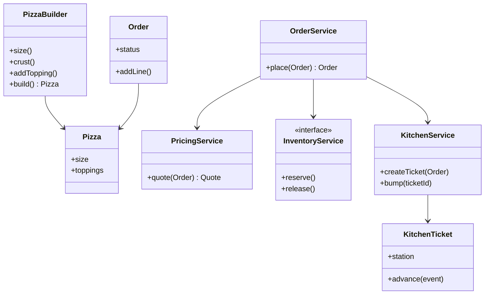

# OOD / LLD: Pizza Shop (Order Builder · Toppings · Kitchen)

> **Focus areas:** Pizza/order builder · Topping model · Pricing · Kitchen stations · Order state machine · Extensibility  
> **Style:** Amazon SDE III / L6+ — **object design** for a shop; complement to pizza-shop HLD platform doc  
> **Quality bar:** Clean builder/decorator choice, kitchen handoff interfaces, inventory hooks, concurrency at place-order  
> **Related HLD:** [pizza-shop-system-design.md](./pizza-shop-system-design.md)

---

## Table of Contents

1. [Clarify Requirements (Interview Q&A)](#1-clarify-requirements-interview-qa)
2. [Non-Functional Requirements & Light Scale](#2-non-functional-requirements--light-scale)
3. [Cases (Flows & Edge Cases)](#3-cases-flows--edge-cases)
4. [Object Model & Class Diagrams](#4-object-model--class-diagrams)
5. [APIs / Public Interfaces](#5-apis--public-interfaces)
6. [State Machines](#6-state-machines)
7. [Concurrency](#7-concurrency)
8. [Extensibility & Patterns](#8-extensibility--patterns)
9. [Design Deep Dive](#9-design-deep-dive)
10. [Wrap-Up](#10-wrap-up)
11. [Deeper / Related Interview Questions](#11-deeper--related-interview-questions)
12. [Appendices](#12-appendices)

---

## 1. Clarify Requirements (Interview Q&A)

Goal: **model a pizza shop in objects**—customize pizzas (size/crust/toppings), price orders, hand off to kitchen stations, track prep—without designing the full multi-region chain platform (sibling HLD).

### 1.0 What this is / is not

| Dimension | **Pizza shop OOD** | Not this |
|-----------|-------------------|----------|
| Primary job | Domain model + kitchen workflow objects | DoorDash marketplace HLD |
| Success | Correct custom pizza price; kitchen sees makeable tickets | IoT oven telemetry SoT |
| Patterns | Builder, Decorator (discuss), State, Facade | Kafka cell design deep dive |

**Scope statement:** OOD for menu/pizza composition, cart/order, pricing, kitchen display tickets & stations, topping inventory checks, single-shop (multi-shop ports OK).

### 1.1 Functional Requirements

| # | Q | Typical answer | Implication |
|---|---|----------------|-------------|
| F1 | Custom pizza? | Size, crust, sauce, toppings, half-and-half | Builder / PizzaSpec |
| F2 | Topping price? | Flat per topping; premium extra | PriceCalculator |
| F3 | Sides/drinks? | Yes as OrderLine types | LineItem hierarchy |
| F4 | Kitchen? | Make → oven → cut → box stations | Station pipeline |
| F5 | Inventory? | Decrement toppings | InventoryService port |
| F6 | Pickup/delivery? | FulfillmentMode on order | Fulfillment strategy |
| F7 | Coupons? | Simple % / fixed | Pricing hook |
| F8 | Multi-store? | Interface StoreId; MVP one store | Tenant field |

**MVP:** Build pizza, add to order, price, place (reserve inventory), kitchen ticket advances stations, ready for pickup/delivery assign stub.

**Out of MVP:** Driver matching ML, franchise royalties, voice ordering.

### 1.2 Dialogue

**You:** Builder vs decorator for toppings? Kitchen stations? Inventory hard-stop?

**Interviewer:** Either pattern OK if justified; stations yes; don’t oversell toppings.

**You:** I’ll use **Pizza.Builder** for clarity (half-and-half easier than decorator stacks), `OrderFacade.place`, and `KitchenTicket` with station state.

---

## 2. Non-Functional Requirements & Light Scale

| NFR | Target |
|-----|--------|
| Place-order correctness | Inventory + order atomic enough |
| Pricing determinism | Same spec → same cents |
| KDS latency | Ticket visible quickly (event) |
| Extensibility | New topping/station without rewrite |
| Testability | Pure price calc; fake inventory |

| Metric | Single busy shop |
|--------|------------------|
| Peak orders/hour | 80–150 |
| Concurrent place | tens |
| Toppings SKUs | ~40 |
| Stations | 3–5 |

HLD covers chain 1,000×; here concurrency is “Friday night counter + apps”.

---

## 3. Cases (Flows & Edge Cases)

### Happy

1. Customer builds large thin pepperoni+mushroom → add drink → price → pay → kitchen make/oven/cut → READY → pickup.  
2. Half-and-half: left veggie / right meat lovers.  
3. Manager 86s mushrooms → pizza with mushrooms rejected at place.  
4. Delivery mode sets address on order.

### Edges

| Case | Behavior |
|------|----------|
| Too many toppings | Cap per size policy |
| Duplicate topping | Qty 2 or reject—policy |
| Place without payment | Reject |
| Inventory race last pepperoni | One wins |
| Cancel while MAKE | Release unused inventory policy |
| Allergy note | On ticket prominently |
| Extra cheese twice | Premium rules |

### Sequences

**Build & place**

```text
Customer -> Pizza.Builder -> Pizza
        -> Order.add(PizzaLine)
        -> PricingService.quote
        -> OrderService.place (inventory.reserve + pay)
        -> KitchenService.createTicket
```

**Bump station**

```text
Cook -> KitchenTicket.advance(MAKE_DONE)
     -> OvenStation.enqueue
     -> ...
     -> Order.status READY
```

---

## 4. Object Model & Class Diagrams

### 4.1 Menu & pizza

```text
Menu
 ├── List<PizzaBaseOption> sizes, crusts, sauces
 └── List<ToppingDefinition> toppings

ToppingDefinition { id, name, priceCents, premium, allergens[] }

PizzaSpec / Pizza
 ├── Size size
 ├── Crust crust
 ├── Sauce sauce
 ├── List<ToppingApplication> toppings  // toppingId, side: LEFT|RIGHT|WHOLE, qty
 └── String specialInstructions?

Pizza.Builder
  size() crust() sauce() addTopping() halfAndHalf() build()
```

### 4.2 Order

```text
Order
 ├── orderId, storeId, customerId?
 ├── List<OrderLine> lines
 ├── FulfillmentMode mode  // PICKUP, DELIVERY
 ├── Address? deliveryAddress
 ├── OrderStatus status
 ├── Money totals
 └── PaymentRef?

OrderLine (abstract)
 ├── PizzaLine { Pizza pizza, qty }
 ├── SideLine { sku, qty }
 └── DrinkLine { sku, qty }
```

### 4.3 Kitchen

```text
KitchenTicket
 ├── ticketId, orderId
 ├── List<PrepItem> items  // flattened pizzas/sides
 ├── Station currentStation
 ├── TicketStatus status
 └── priority / channel (APP, POS)

Station (enum or class): MAKE, OVEN, CUT, BOX, DONE
KitchenService / KitchenDisplay
StationQueue
```

### 4.4 Pricing & inventory

```text
PricingService.quote(Order) -> Money breakdown
InventoryService.reserve(Order) / release
PaymentPort.charge
```

### 4.5 Mermaid



### 4.6 Builder vs Decorator (interview talk track)

| Approach | Pros | Cons |
|----------|------|------|
| **Builder** | Clear required fields; half-and-half natural; validate at build | Less “classic GoF decorator” demo |
| **Decorator** | Classic topping wrap pricing demo | Awkward for halves, removal, kitchen BOM |

**Recommend Builder + PriceCalculator**; mention Decorator as alternative for teaching `% surcharge wrappers` (e.g., `ExtraCheeseDecorator`) if interviewer insists.

### 4.7 ASCII snapshot

```text
Order O-91 PICKUP
  PizzaLine x1: LARGE / THIN / RED
     WHOLE pepperoni, LEFT mushroom, RIGHT olive
  DrinkLine: Coke x2
  status PREPARING
Ticket T-91 @ OVEN
```

---

## 5. APIs / Public Interfaces

```text
interface MenuService {
  Menu getMenu(storeId)
}

interface OrderService {
  Quote quote(OrderDraft draft)
  Order place(OrderDraft draft, PaymentMethod pay, IdempotencyKey key)
  void cancel(orderId, reason)
  OrderStatusView status(orderId)
}

interface KitchenService {
  KitchenTicket createTicket(Order order)
  void bump(ticketId, StationCompletedEvent ev, Actor cook)
  List<KitchenTicket> board(storeId)
}

interface InventoryService {
  Reservation reserve(List<IngredientUse> uses, IdempotencyKey key)
  void commit(ReservationId)
  void release(ReservationId)
}

interface PricingService {
  Quote price(OrderDraft draft)
}
```

### DTOs

```text
OrderDraft { lines[], mode, address?, couponCode?, notes? }
Quote { subtotal, tax, discount, total, lineBreakdown[] }
IngredientUse { ingredientId, units }
```

### REST sketch

```text
POST /orders/quote
POST /orders
POST /kitchen/tickets/{id}/bump
GET  /kitchen/board
```

---

## 6. State Machines

### 6.1 Order

```text
DRAFT -> PENDING_PAYMENT -> CONFIRMED -> PREPARING -> READY
 -> OUT_FOR_DELIVERY -> DELIVERED
CONFIRMED/PREPARING -> CANCELLED (policy)
PENDING_PAYMENT -> PAYMENT_FAILED
```

### 6.2 Kitchen ticket

```text
CREATED -> MAKE -> OVEN -> CUT -> BOX -> COMPLETE
Any -> VOID (order cancel if not baked—policy)
```

### 6.3 Inventory reservation

```text
RESERVED -> COMMITTED (on confirm)
RESERVED -> RELEASED (TTL / cancel / pay fail)
```

### Transition table (ticket)

| From | Event | To |
|------|-------|-----|
| MAKE | bump make done | OVEN |
| OVEN | bump baked | CUT |
| CUT | bump cut | BOX |
| BOX | bump boxed | COMPLETE |

---

## 7. Concurrency

### 7.1 Place-order race on toppings

```text
Thread A and B both need last mushroom unit
→ InventoryService.reserve atomic per store SKU
→ loser gets 409 / INSUFFICIENT_INVENTORY
```

### 7.2 Idempotent place

```text
Idempotency-Key -> same Order returned; no double kitchen ticket
```

### 7.3 Kitchen bumps

```text
Optimistic version on ticket:
UPDATE ticket SET station=OVEN, ver=ver+1 WHERE id=? AND ver=? AND station=MAKE
```

### 7.4 Menu updates mid-draft

Reprice at place; if delta > threshold, require confirm.

### 7.5 Single shop in-process sketch

```text
synchronized(storeLock) { reserve; create order; create ticket }
```

Fine for interview MVP; HLD splits services.

---

## 8. Extensibility & Patterns

| Pattern | Where |
|---------|-------|
| **Builder** | Pizza |
| **Factory** | OrderLine from DTO |
| **Strategy** | FulfillmentMode, PricingRule, StationRouter |
| **State** | Order/Ticket statuses |
| **Facade** | OrderService |
| **Observer** | TicketCreated → KDS push |
| **Template** | Abstract station bump validation |
| **Port/Adapter** | Inventory, Payment, Notifier |

### Extensions

- Gluten-free crust availability by store.  
- Lunch combo pricing rule strategy.  
- Parallel stations (sides skip oven)—`StationRouter`.  
- Assembly line vs pizza-first routing.

---

## 9. Design Deep Dive

### 9.1 Pizza validation

```text
function build():
  require size, crust, sauce
  if toppings.count > size.maxToppings: error
  if half toppings without half mode: error
  return immutable Pizza
```

### 9.2 Pricing

```text
base = size.price + crust.surcharge
for t in toppings:
  unit = t.premium ? premiumPrice : toppingPrice
  if side != WHOLE: unit = ceil(unit/2)   // policy
  base += unit * t.qty
line = base * qty
```

Tax/discount pipeline after food subtotal.

### 9.3 Half-and-half BOM for inventory

```text
mushroom LEFT qty1 → 0.5 portion (or whole portion policy—lock)
```

Kitchen make instructions: “LEFT: … RIGHT: …”.

### 9.4 Ticket creation from order

```text
for PizzaLine: PrepItem.PIZZA(instructions from pizza)
for SideLine: PrepItem.SIDE → maybe skip MAKE pizza path
router.initialStation(item)
```

### 9.5 Station router

```text
Pizza: MAKE→OVEN→CUT→BOX
Wings: MAKE→OVEN→BOX
Drink: BOX only (or skip kitchen)
```

### 9.6 Decorator alternative (short)

```text
Pizza p = new ExtraCheese(new Pepperoni(new BaseLarge()))
price = p.cost(); desc = p.description()
```

Call out halves pain → prefer Builder for production model.

### 9.7 Inventory mapping

```text
ToppingDefinition -> IngredientId
Pizza → List<IngredientUse> via RecipeExpander
```

### 9.8 Failure: pay OK invent fail

Compensating void pay; no ticket. Saga order: **reserve → pay → commit → ticket** or **pay auth → reserve → capture → ticket** with clear compensations (align with HLD).

Recommended interview saga:

```text
reserve inventory
auth payment
persist CONFIRMED order
commit inventory
create ticket
capture payment on READY/DELIVERED (policy)
```

### 9.9 Allergy / special instructions

Never lose notes: copy to ticket; KDS highlight allergens intersection with toppings.

### 9.10 Testing

| Test | Expect |
|------|--------|
| Builder missing size | Fail |
| Half pricing | Policy asserted |
| Concurrent reserve 1 unit | One success |
| Bump wrong station | Reject |
| Idempotent place | One ticket |

### 9.11 Mapping to HLD

| OOD | HLD |
|-----|-----|
| OrderService | Order API / store partition |
| KitchenTicket | KDS push channel |
| InventoryService | Per-store reservation |
| Pizza.Builder | Catalog customization model |

### 9.12 Code sketch: place

```text
class OrderService:
  def place(self, draft, pay, key):
    if cached := idem.get(key): return cached
    quote = pricing.price(draft)
    uses = recipes.expand(draft)
    res = inventory.reserve(uses, key)
    payRes = payment.auth(quote.total, pay, key)
    if not payRes.ok:
      inventory.release(res); raise
    order = Order.create(draft, quote, CONFIRMED)
    inventory.commit(res)
    kitchen.createTicket(order)
    idem.save(key, order)
    events.emit(OrderConfirmed(order))
    return order
```

### 9.13 Anti-patterns

- God `PizzaShop` class does UI+DB+pricing.  
- Toppings as boolean fields `hasPepperoni`.  
- Kitchen status stringly compared without enum.  
- Float prices.

---

## 10. Wrap-Up

Pizza OOD centers on **Pizza.Builder**, **Order/OrderLine**, **PricingService**, **Inventory port**, and **KitchenTicket station pipeline**. Prefer Builder over Decorator for halves/BOM. Concurrency: atomic reserve + idempotent place + versioned bumps. Scale-out story lives in pizza-shop HLD.

### Deal-breakers

1. No inventory race answer.  
2. Decorator-only model that can’t do half-and-half.  
3. Float money.  
4. Order READY without kitchen path.

---

## 11. Deeper / Related Interview Questions

| Q | A |
|---|---|
| Builder vs Decorator? | Builder for real pizza; Decorator demo only |
| Half-and-half? | Side enum on topping applications |
| Kitchen model? | Ticket + stations + router |
| 86 topping? | Inventory/menu flag; fail place |
| Extensible stations? | StationRouter strategy |
| Coupons? | Pricing pipeline hook / coupon LLD |
| Multi-store? | storeId on all aggregates |
| Cancel after oven? | Policy; maybe no inventory restock |
| Idempotency? | Key on place |
| Map to microservices? | See HLD sibling |

### Traps

| Trap | Response |
|------|----------|
| Boolean topping fields | Combinatorial / inflexible |
| Synchronized whole JVM for chain | Store-level only; HLD partitions |

---

## 12. Appendices

### A. Class checklist

```text
Menu, ToppingDefinition, Pizza, Pizza.Builder, ToppingApplication
Order, OrderLine/{Pizza,Side,Drink}, OrderService
PricingService, Quote, RecipeExpander
InventoryService, Reservation
KitchenService, KitchenTicket, PrepItem, StationRouter
PaymentPort, FulfillmentMode
```

### B. Size topping caps example

| Size | Max toppings |
|------|--------------|
| S | 3 |
| M | 5 |
| L | 7 |
| XL | 9 |

### C. Sample quote breakdown

```text
Large thin base 1200
Pepperoni 150
Mushroom half 75
Subtotal 1425
Tax 120
Total 1545
```

### D. Errors

| Code | Meaning |
|------|---------|
| VALIDATION_PIZZA | Builder fail |
| INSUFFICIENT_INVENTORY | Reserve fail |
| PAYMENT_FAILED | — |
| INVALID_BUMP | Wrong station |
| MENU_86 | Topping disabled |

### E. 45-min plan

| Min | Focus |
|-----|-------|
| 0–5 | Scope vs HLD |
| 5–15 | Pizza builder + order |
| 15–25 | Pricing + inventory |
| 25–35 | Kitchen stations |
| 35–45 | Concurrency + Q&A |

### F. Invariants

1. CONFIRMED order ⇒ reservation committed.  
2. Ticket exists ⇒ order CONFIRMED+.  
3. Money integer.  
4. Pizza immutable after build.  
5. Bump only forward.

### G. Glossary

| Term | Meaning |
|------|---------|
| 86 | Mark unavailable |
| BOM | Bill of materials / ingredients |
| KDS | Kitchen display system |
| Bump | Advance ticket station |
| Half-and-half | Split topping sides |

### H. Rubric

| Signal | Weak | Strong |
|--------|------|--------|
| Customization | Booleans | Builder + sides |
| Kitchen | status string | Station SM |
| Inventory | ignore | reserve/commit |
| Patterns | Buzzword salad | Justified builder/strategy |

### I. Station router table

| Item | Path |
|------|------|
| Pizza | MAKE OVEN CUT BOX |
| Breadsticks | MAKE OVEN BOX |
| Salad | MAKE BOX |
| Drink | — |

### J. Event list

```text
OrderConfirmed, OrderCancelled, TicketCreated,
StationBumped, OrderReady, Inventory86
```

### K. Relation to coupon LLD

`PricingService` can call `CartEvaluator` with pizza lines mapped to SKUs.

### L. Sample builder API

```text
Pizza p = Pizza.builder()
  .size(LARGE).crust(THIN).sauce(TOMATO)
  .addTopping(PEPPERONI, WHOLE)
  .addTopping(MUSHROOM, LEFT)
  .addTopping(OLIVE, RIGHT)
  .note("well done")
  .build();
```

### M. Delivery stub

```text
interface Dispatcher { assign(Order readyOrder); }
```

### N. Amazon ownership notes

Wrong allergen on ticket is a trust incident—highlight notes + allergen flags in model. Inventory oversell = customer apology cost.

### O. Worked order lifecycle

```text
1. Builder → Pizza(LARGE, THIN, RED, pepperoni WHOLE, mushroom LEFT)
2. OrderDraft + Coke x2 + PICKUP
3. Quote = $18.45
4. reserve: pepperoni 1, mushroom 0.5, dough 1, box 1, coke 2
5. auth pay
6. Order CONFIRMED; Ticket @ MAKE
7. bump MAKE→OVEN→CUT→BOX→COMPLETE
8. Order READY; customer pickup; capture pay
```

### P. Recipe expander example

```text
LARGE dough 1.0
THIN crust modifier 0
pepperoni WHOLE → pepperoni_portions 1.0
mushroom LEFT → mushroom_portions 0.5
box_large 1
```

Units are integers milli-portions in production (`1000` = 1.0) to avoid floats.

### Q. KDS board view model

```text
BoardColumn by station:
  MAKE: [T-91 pizza half-half, T-92 wings]
  OVEN: [T-88 pizza]
  CUT/BOX: [...]
Each card: order #, age timer, channel color, allergen badges, instructions
```

### R. POS vs APP priority

```text
Ticket.priority = POS > APP > PHONE  // or due-time based
StationQueue = priority queue + FIFO within priority
```

Say policy explicitly—restaurants differ.

### S. Cancel policy matrix

| State | Cancel allowed? | Inventory | Payment |
|-------|-----------------|-----------|---------|
| PENDING_PAYMENT | yes | release | — |
| CONFIRMED / MAKE | yes | release unused | void |
| OVEN+ | manager only | no restock food | partial refund |
| READY | no (or window) | — | — |

### T. Multi-pizza ticket splitting

```text
One order → one ticket with multiple PrepItems
OR one ticket per pizza (parallel cooks)
Router config per store; model supports both via KitchenService strategy
```

### U. Decorator demo (if forced)

```text
interface PizzaComponent { int cost(); String desc(); }
class BaseLarge implements PizzaComponent ...
class ToppingDecorator implements PizzaComponent {
  PizzaComponent inner; ToppingDefinition t;
  cost = inner.cost()+t.price; desc = inner.desc()+","+t.name
}
// Then still map decorator tree → PizzaSpec for kitchen BOM
```

Use as teaching tool; persist `PizzaSpec`, not decorator chain.

### V. Test plan expansion

```text
- builder half without both sides configured fails
- milli-portion inventory math
- bump stale version conflict
- POS priority ahead of older APP ticket (policy test)
- 86 mushroom blocks quote/place
- idempotent place returns same orderId + same ticketId
```

### W. Bar-raiser notes

- Allergen miss > latency miss for ownership narrative.  
- Friday peak: degrade ETA, don’t corrupt inventory.  
- Clear saga compensations beat “distributed transaction” handwaving.

---

**End of pizza-shop OOD.** Lead with Builder + kitchen station SM; mention HLD when they steer toward Friday-night chain scale.
