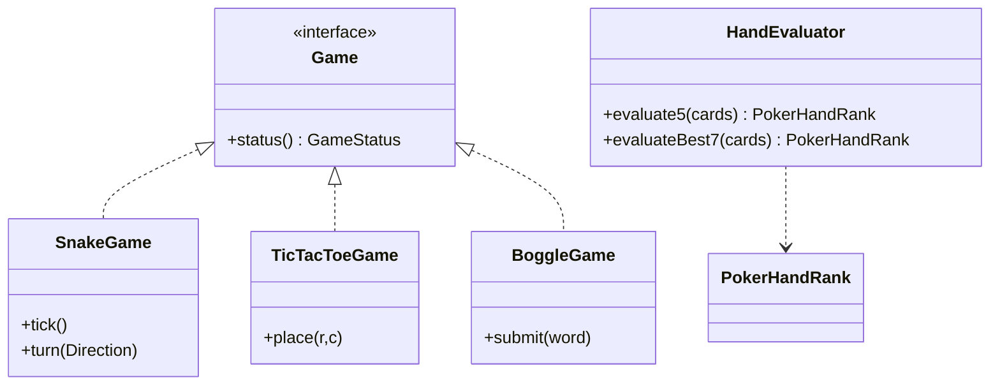

# OOD: Classic Games (Snake, Tic-Tac-Toe, Boggle, Poker Rules)

> **Focus areas:** Shared game loop patterns · Board/grid models · Rules engines · Snake movement · TTT win checks · Boggle trie search · Poker hand evaluation · Extensibility across games  
> **Style:** Object-oriented interview design (clarify → NFRs → cases → classes → APIs → state machines → concurrency → extensibility → deep dive → wrap-up → Q&A)  
> **Quality bar:** Separate engine vs rules vs rendering; correct win/legal-move logic; reusable patterns without a bloated framework  
> **Interview theme:** Amazon SDE III / L6 — **multi-game OOD**; show pattern reuse + deep dive into at least one non-trivial rules engine (Poker or Boggle)

---

## Table of Contents

1. [Clarify Requirements (Interview Q&A)](#1-clarify-requirements-interview-qa)
2. [Non-Functional Requirements](#2-non-functional-requirements)
3. [Cases](#3-cases)
4. [Object Model & Class Diagrams](#4-object-model--class-diagrams)
5. [Public APIs / Interfaces](#5-public-apis--interfaces)
6. [State Machines](#6-state-machines)
7. [Concurrency & Consistency](#7-concurrency--consistency)
8. [Extensibility](#8-extensibility)
9. [Design Deep Dive](#9-design-deep-dive)
10. [Wrap-Up](#10-wrap-up)
11. [Deeper / Related Interview Questions](#11-deeper--related-interview-questions)
12. [Appendices](#12-appendices)

---

## 1. Clarify Requirements (Interview Q&A)

Goal: design object models for **four classic games**—Snake, Tic-Tac-Toe, Boggle, and **Poker hand ranking rules**—emphasizing clean rules separation. Not a full online multiplayer platform (see online-poker / chess HLD docs).

### 1.0 What this is / is not

| Dimension | This | Not |
|-----------|------|-----|
| Job | In-process game OOD + rules | Matchmaking, wallets, anti-cheat fleet |
| Poker | 5/7-card hand evaluator + categories | Full table betting protocol (sibling) |
| Rendering | Port / observer optional | Unity/Unreal engine |
| Amazon lens | Correctness, reuse, testability | Pixel-perfect UI |

### 1.1 Clarifying questions

| # | Question | Typical answer | Implication |
|---|----------|----------------|-------------|
| F1 | Which games in scope? | Snake, TTT, Boggle, Poker ranks | Four modules + tiny shared kernel |
| F2 | Shared framework? | Light interfaces only | Avoid Enterprise GamePlatform |
| F3 | Snake: wrap walls? | Configurable | `CollisionPolicy` |
| F4 | TTT: NxN? | 3×3 MVP; mention N | WinStrategy |
| F5 | Boggle: dictionary? | Trie + word list | `Dictionary` port |
| F6 | Boggle: min length? | 3+ | Rules config |
| F7 | Poker: variants? | High hand categories; 5-card + 7-choose-5 | `HandEvaluator` |
| F8 | Input model? | Commands / ticks | Game-specific |
| F9 | Multiplayer TTT? | Two players local | `Player` ids |
| F10 | Scoring Boggle? | Standard length scores | `ScoreTable` |
| F11 | Snake speed? | Tick interval | Clock |
| F12 | UI? | Headless engine OK | Observer for view |

**MVP scope:**

1. Snake: grid, snake body, food, tick move, grow, die.  
2. Tic-Tac-Toe: place marks, detect win/draw.  
3. Boggle: 4×4 board, path search, dictionary validate, score.  
4. Poker rules: classify 5-card hands; best of 21 combos for 7 cards.  
5. Shared: `GameState`, `Player`, coordinate types where useful.

**Out of MVP:** networked sessions, AI opponents beyond interface stub, graphics, Texas Hold'em betting rounds (online-poker doc).

### 1.2 Scope repeat-back

> Four game modules with thin shared primitives: Snake tick simulation, TTT legal moves + win, Boggle trie DFS, Poker combinatorial hand ranking—each rules-testable without UI.

---

## 2. Non-Functional Requirements

| # | NFR | Target |
|---|-----|--------|
| N1 | Rules correctness | Golden tests for wins/hands/words |
| N2 | Snake tick latency | ≪ frame budget (ms) |
| N3 | Boggle solve | Full board solve < ~50ms for 4×4 + trie |
| N4 | Poker eval | 7-card best hand ≪ 1ms |
| N5 | Testability | Headless; inject clock/RNG/dictionary |
| N6 | Extensibility | New win rule / board size without rewrite |
| N7 | Clarity | Interviewer can follow state transitions |
| N8 | Isolation | Games don't import each other |

### 2.1 Progressive complexity (not traffic)

| Level | Deliver |
|-------|---------|
| Base | TTT + Snake |
| 10× | Boggle dictionary search |
| 100× | Poker 7-card evaluator + tie-breakers |

---

## 3. Cases

### 3.1 Snake

| Case | Behavior |
|------|----------|
| Move into food | Grow; spawn food; score++ |
| Move into self | Dead |
| Move into wall | Dead or wrap (policy) |
| 180° reverse input | Ignore or kill—define (usually ignore) |
| Food spawn on snake | Resample cells |
| Win fill board | Rare; detect no free cell |

### 3.2 Tic-Tac-Toe

| Case | Behavior |
|------|----------|
| Winning line | Status WIN + winner |
| Full board no line | DRAW |
| Place occupied | Reject |
| Move after terminal | Reject |
| Wrong player turn | Reject |

### 3.3 Boggle

| Case | Behavior |
|------|----------|
| Valid path word | Accept once; score |
| Reuse die in word | Illegal |
| Word not in dict | Reject |
| Duplicate submission | No re-score |
| Qu die | Handle as "QU" |

### 3.4 Poker ranks

| Case | Behavior |
|------|----------|
| Royal flush vs straight flush | Royal wins (or SF Ace-high) |
| Two pair tie | Compare pairs then kicker |
| Wheel straight A-5 | Ace low special |
| 7 cards | Best 5-card subset |
| Flush vs straight | Flush higher (standard high) |

### 3.5 Cross-cutting invariants

```text
I1: Terminal game rejects mutating moves
I2: Poker comparator transitive for categories
I3: Boggle path 4-adjacent (8-dir) without revisit
I4: Snake occupied cells == body length
```

---

## 4. Object Model & Class Diagrams

### 4.1 Thin shared kernel

| Type | Role |
|------|------|
| `PlayerId` | Opaque id |
| `GameStatus` | RUNNING / WON / LOST / DRAW / IDLE |
| `Coord` | (x,y) for grid games |
| `Game` | `status()`, optional `id` |
| `Rng` | Food spawn etc. |

Do **not** force Snake through a heavy `AbstractBoardGame` hierarchy unless it pays rent.

### 4.2 Snake classes

```text
SnakeGame
  grid: Grid
  snake: Snake          // deque of Coord
  direction: Direction
  pendingDirection
  food: Coord
  score
  collisionPolicy
tick()
turn(Direction)
```

### 4.3 Tic-Tac-Toe classes

```text
TicTacToeGame
  board: Board3x3       // Mark[][]
  current: Mark         // X/O
  status
place(row,col)
WinChecker
```

### 4.4 Boggle classes

```text
BoggleGame
  board: BoggleBoard    // char[][] / Dice
  dictionary: TrieDictionary
  found: Set<String>
submit(word)
solveAll()              // optional helper
BoggleScorer
```

### 4.5 Poker rules classes

```text
PokerHandRank           // category + tiebreak ranks
HandCategory            // HIGH_CARD ... ROYAL_FLUSH
HandEvaluator
  evaluate5(List<Card>)
  evaluateBest7(List<Card>)
HandComparator
```

Depends on deck-of-cards `Card` types.

### 4.6 Diagram (shared + modules)



### 4.7 Package layout

```text
games/
  common/     Coord, GameStatus, PlayerId
  snake/
  tictactoe/
  boggle/
  poker/      evaluator only
```

---

## 5. Public APIs / Interfaces

### 5.1 Snake

```text
newGame(width, height, policy) → SnakeGame
turn(dir)
tick() → TickResult{alive, score, events[]}
snapshot() → SnakeView
```

### 5.2 Tic-Tac-Toe

```text
place(player, row, col) → MoveResult
legalMoves() → List<Cell>
status() → {RUNNING, WIN(X|O), DRAW}
```

### 5.3 Boggle

```text
newGame(board|shuffleDice, dictionary)
submit(player, word) → SubmitResult{accepted, points}
score(player) → int
solve() → Set<String>   // coach/debug
```

### 5.4 Poker rules

```java
PokerHandRank evaluate5(List<Card> five);
PokerHandRank bestOf7(List<Card> seven);
int compare(PokerHandRank a, PokerHandRank b);
```

### 5.5 Dictionary port

```java
public interface Dictionary {
  boolean contains(String word);
  boolean isPrefix(String prefix); // trie optimization
}
```

---

## 6. State Machines

### 6.1 Generic

```text
IDLE → RUNNING → TERMINAL(WIN|LOSS|DRAW)
```

### 6.2 Snake tick

```text
RUNNING:
  apply pendingDirection if not reverse
  next = head + dir
  if collide(policy): DEAD
  if next == food: grow; placeFood; score++
  else: move (pop tail, push head)
```

### 6.3 Tic-Tac-Toe

```text
RUNNING + place:
  if illegal: reject
  write mark
  if win: WIN
  else if full: DRAW
  else: swap turn
```

### 6.4 Boggle round

```text
READY → PLAYING (timer optional) → SCORING → DONE
submit only in PLAYING
```

### 6.5 Poker eval

Stateless function: cards in → rank out. No machine (betting machine lives elsewhere).

---

## 7. Concurrency & Consistency

| Game | Guidance |
|------|----------|
| Snake | Single sim thread; input thread posts turns |
| TTT | Synchronize on game or single-thread moves |
| Boggle | `found` set concurrent if multi-submit; usually turn-based |
| Poker eval | Pure function; parallelize combo eval OK |

Invariant: never mutate board while evaluating win without lock/confinement.

---

## 8. Extensibility

| Extension | Hook |
|-----------|------|
| Snake wrap walls | `CollisionPolicy.WRAP` |
| Snake obstacles | Grid cell types |
| TTT connect-K / NxN | `WinChecker` |
| Ultimate TTT | Composite boards |
| Boggle 5×5 | Board size + score table |
| Poker lowball | Alternate category order |
| Omaha | Evaluator on 2-from-4 + 3-from-5 (new rules class) |

Shared pattern: **Strategy** for policies; **pure evaluators** for rules.

---

## 9. Design Deep Dive

### 9.1 Snake data structure

`Deque<Coord>` body; `Set<Coord>` occupied for O(1) self-collision. On move without grow: remove tail from set then add head (order matters).

### 9.2 Tic-Tac-Toe win check

After each move, check row, col, 2 diagonals—O(N) for NxN. Optional incremental counters for O(1).

### 9.3 Boggle search

```text
for each cell:
  dfs(cell, prefix, visited):
    if !dict.isPrefix(prefix): return
    if dict.contains(prefix) and len>=min: found.add
    for neigh in 8-dir:
      if not visited: dfs(...)
```

Trie prunes dead prefixes early. `Qu` handled by expanding die face to two letters with one visit.

### 9.4 Poker 5-card evaluation approach

Pipeline:

1. Count ranks (array[15]) and suits.  
2. Detect flush (any suit count ≥5—for exact 5, ==5).  
3. Detect straight (bitmask of ranks; special wheel).  
4. Pattern on counts: 4 / 3+2 / 3 / 2+2 / 2 / high.  
5. Build `PokerHandRank(category, kickers[])` for lexicographic compare.

Category order (high poker):

```text
ROYAL_FLUSH > STRAIGHT_FLUSH > FOUR > FULL_HOUSE > FLUSH >
STRAIGHT > THREE > TWO_PAIR > PAIR > HIGH_CARD
```

### 9.5 Best 7-card hand

```text
C(7,5)=21
best = max(evaluate5(combo) for combo in combinations)
```

Optimize later with bit engines; 21× cheap eval is fine for interview.

### 9.6 Tie-break examples

```text
Two pair AAxxKK vs AAxxQQ → K > Q
Pair AAxyz vs AAwuv → compare kickers sorted
Flush: compare ranks sorted desc
Straight: compare top card (wheel top=5)
```

### 9.7 Deal-breakers

- UI inside rules  
- Poker betting inside evaluator  
- Boggle allowing revisited cells  
- Snake reverse causing instant death unintentionally undocumented  
- TTT win check only on full board  

### 9.8 Testing matrix

| Area | Tests |
|------|-------|
| Snake | grow, self-hit, wall, ignore reverse |
| TTT | all 8 wins, draw, illegal |
| Boggle | path, qu, dup word, prefix prune |
| Poker | one hand per category + wheel + 7-card |

### 9.9 Scoring Boggle (common)

| Len | Score |
|-----|-------|
| 3–4 | 1 |
| 5 | 2 |
| 6 | 3 |
| 7 | 5 |
| 8+ | 11 |

### 9.10 Optional AI ports

```java
interface TttBot { Cell choose(TicTacToeGame g, Mark me); }
interface SnakeBot { Direction choose(SnakeView v); }
```

Minimax for TTT is a classic follow-up.

---

## 10. Wrap-Up

### 10.1 60-second narrative

"We keep a **thin shared kernel** and four modules. Snake is a tick sim with deque+set and collision policy. Tic-Tac-Toe is place+win checker. Boggle is trie-pruned DFS on an 8-neighbor grid. Poker rules are a pure **HandEvaluator** producing comparable ranks with kickers—7-card via 21 combinations. No networking, no betting engine—those compose later."

### 10.2 Cheat sheet

| Game | Core idea |
|------|-----------|
| Snake | Deque + tick |
| TTT | Board + win lines |
| Boggle | Trie DFS |
| Poker | Category + kickers |
| Shared | Status + Coord |
| Kill | God framework |

---

## 11. Deeper / Related Interview Questions

**Q: One AbstractGame with template method?**  
A: Only if lifecycle truly shared; prefer light interface.

**Q: How handle Poker Ace in straights?**  
A: Bitmask includes Ace high; wheel check A-2-3-4-5 separately.

**Q: Boggle vs Scrabble dictionary?**  
A: Same port; Scrabble needs rack constraints—different game.

**Q: Snake food RNG test?**  
A: Inject Rng that returns predetermined cells.

**Q: Normalize Boggle words?**  
A: Uppercase; strip non-letters; Qu canonicalization.

**Q: Compare two flushes?**  
A: Sort ranks descending; first difference wins.

**Q: TTT generalization to Gomoku?**  
A: Same board, different WinChecker (k-in-row).

**Q: Where do chips live?**  
A: Not in poker rules evaluator—table domain.

**Q: Concurrent Boggle solver + submit?**  
A: Copy board immutably; solve offline.

**Q: First thing to code in interview?**  
A: Pick one game end-to-end; sketch others.

**Q: Royal flush separate category?**  
A: Optional; can be SF with Ace high—be consistent in compare.

**Q: 4-of-a-kind kickers?**  
A: One kicker only in 5-card hand.

**Q: Snake wrap + self collision?**  
A: Still die on self even if wrap walls.

**Q: Dictionary memory?**  
A: Trie ~ word list size; fine for interview wordlists.

**Q: Amazon signal?**  
A: Correct edge cases + clear module boundaries.

---

## 12. Appendices

### A. Coord / Direction

```java
record Coord(int x, int y) {
  Coord plus(Direction d) { return new Coord(x+d.dx, y+d.dy); }
}
enum Direction { UP(0,-1), DOWN(0,1), LEFT(-1,0), RIGHT(1,0);
  final int dx,dy; boolean isOpposite(Direction o) { ... }
}
```

### B. Snake tick sketch

```java
public TickResult tick() {
  Direction dir = sanitize(pending, direction);
  Coord next = snake.head().plus(dir);
  if (policy.hitsWall(next, grid) || snake.occupies(next)) return die();
  boolean grow = next.equals(food);
  snake.move(next, grow);
  if (grow) { score++; food = spawnFood(); }
  direction = dir;
  return TickResult.ok(score);
}
```

### C. TTT win sketch

```java
boolean wins(Mark m) {
  for (int i=0;i<n;i++) if (rowAll(i,m)||colAll(i,m)) return true;
  return diagAll(m)||antiDiagAll(m);
}
```

### D. PokerHandRank

```java
record PokerHandRank(HandCategory cat, int[] keys) implements Comparable<PokerHandRank> {
  public int compareTo(PokerHandRank o) {
    int c = cat.compareTo(o.cat); // enum order
    if (c!=0) return c;
    return Arrays.compare(keys, o.keys);
  }
}
```

### E. Combinations 7C5

```java
for i in 0..6 for j>i for k>j for l>k for m>l:
  eval(cards[i,j,k,l,m])
```

### F. Flashcards

| Card | Point |
|------|-------|
| Snake | Deque+set |
| TTT | Check on move |
| Boggle | Trie DFS |
| Poker | Cat+kickers |
| 7-card | 21 combos |
| Boundary | No betting here |

### G. Sample poker fixtures

```text
AS KS QS JS TS → ROYAL_FLUSH
AH KH QH JH 9H → FLUSH (not straight)
AS 2S 3S 4S 5S → STRAIGHT_FLUSH wheel
AA KK Q → TWO_PAIR keys [14,13,12]
```

### H. Boggle adjacency

```text
(dx,dy) in {-1,0,1}x{-1,0,1} minus (0,0)
```

### I. Interview timebox (45–60m)

| Min | Focus |
|-----|-------|
| 0–5 | Scope 4 games |
| 5–15 | Shared + Snake or TTT |
| 15–30 | Boggle OR Poker deep |
| 30–40 | Second game sketch |
| 40–50 | Extensibility + tests |
| 50–60 | Q&A |

### J. Alternatives to kill

| Alt | Why kill |
|-----|----------|
| Mega AbstractGameFramework | Overdesign |
| String board only | Error-prone |
| Poker eval in Card class | Layering |
| Recursive Boggle without prefix prune | Slow / timeout |
| Snake List scan for collision each tick | OK small; set clearer |

### K. Runbooks (dev)

**R1 — Flaky snake food:** Rng inject.  
**R2 — Poker mis-rank wheel:** Dedicated fixture.  
**R3 — Boggle false negative Qu:** Die face normalization tests.

### L. Glossary

| Term | Meaning |
|------|---------|
| Kicker | Tie-break rank |
| Trie | Prefix tree dict |
| Wheel | A-5 straight |
| Penetration | N/A here (shoe doc) |
| Tick | Discrete sim step |

### M. Related files

- `deck-of-cards-lld-system-design.md`  
- `online-poker-system-design.md`  
- `multiplayer-chess-game-system-design.md` (HLD multiplayer)

### N. Minimal UI observer

```java
interface GameListener {
  void onEvent(GameEvent e);
}
// Snake: FOOD_EATEN, DIED; TTT: MOVED, GAME_OVER; Boggle: WORD_ACCEPTED
```

### O. Final checklist

- [ ] Four games scoped  
- [ ] Thin shared kernel  
- [ ] Snake collision policy  
- [ ] TTT win/draw  
- [ ] Boggle trie DFS  
- [ ] Poker categories + 7C5  
- [ ] Pure rules tests  
- [ ] Out of scope: wallets/network  

---

## Extra Depth: Worked Poker Compare

```text
Hand A: AA KK 9 → TWO_PAIR keys [14,13,9]
Hand B: AA QQ 9 → TWO_PAIR keys [14,12,9]
A > B
Hand C: AAA 92 → THREE keys [14,9,2]
THREE > TWO_PAIR ⇒ C wins even if kickers small
```

---

## Extra Depth: TTT Minimax Sketch (Follow-up)

```text
function value(board, mark):
  if terminal: return score
  best = -∞
  for move in legal:
    best = max(best, -value(apply(move), opp))
  return best
```

Memoize on board zobrist/string key for speed.

---

## Extra Depth: Boggle Scoring Session

```text
players submit words into per-player sets
at end:
  for word in union:
    if count players with word == 1: award scorer(word)
    else: shared words cancel (common house rule) OR always award—clarify!
```

State the duplicate policy explicitly.

---

## Extra Depth: Snake Input Buffering

```text
pendingDirection queue size 1 or 2
allows quick turn UP then LEFT before next tick
sanitize: if opposite of current committed dir → drop
```

---

## Extended Rapid Q&A II

**Q: Represent TTT board as bitmask?**  
A: Nice optimization; 9 bits × 2; show clarity first.

**Q: Poker bitboards?**  
A: Advanced; mention Cactus Kev / perfect hash only if time.

**Q: Shared Coord for Boggle and Snake?**  
A: Yes—small win.

**Q: Game factory?**  
A: `GameFactory.create(type, config)` optional.

**Q: Idempotent TTT place?**  
A: Second place same cell → illegal or no-op; prefer error.

**Q: Seeded Boggle board?**  
A: Dice shuffle with Rng for reproducible tests.

**Q: Evaluate Omaha?**  
A: Different evaluator class—don't bolt flags onto Hold'em eval wrongly.

**Q: Who owns dictionary lifecycle?**  
A: App loads once; inject read-only singleton.

**Q: Snake win condition?**  
A: Usually endless; optional fill-grid win.

**Q: Leadership link?**  
A: Dive deep on evaluator edge cases; frugality vs mega-framework.

---

## Closing Cheat Sheet (Extended)

| Topic | Answer |
|-------|--------|
| Reuse | Coord/Status/Rng only |
| Snake | Deque+occupied set |
| TTT | Line check / minimax later |
| Boggle | Trie + DFS + score |
| Poker | Category enum + keys |
| 7-card | Max over 21 |
| Kill | Betting in evaluator; UI in rules |

---

*End of Classic Games OOD notes (Amazon SDE III prep).*
