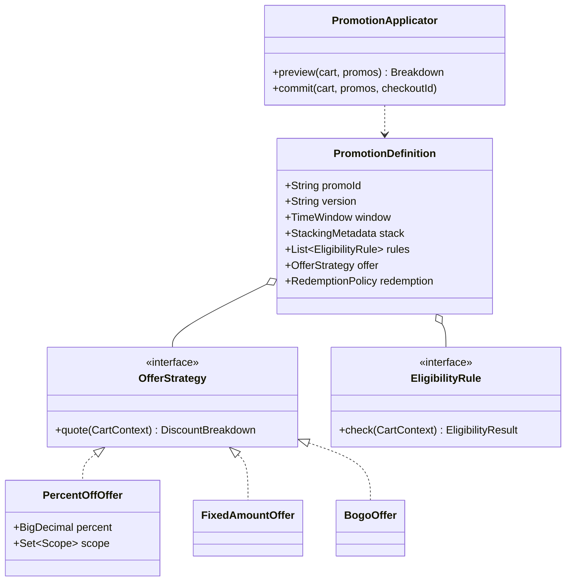

# LLD / OOD: Coupon Class Hierarchy

> **Focus areas:** Coupon/promotion types · Class hierarchy vs composition · Eligibility · Stacking hooks · Redemption · Deterministic apply · Extensibility · Money safety  
> **Style:** Object-oriented interview design (clarify → NFRs → cases → classes → APIs → state machines → concurrency → extensibility → deep dive → wrap-up → Q&A)  
> **Quality bar:** Prefer composition for behavior; hierarchy only for true subtypes; deterministic discount math; clear link to stacking HLD  
> **Interview theme:** Amazon SDE III / L6 — **promotions OOD**; often paired with `discounts-coupons-stacking-system-design.md`

---

## Table of Contents

1. [Clarify Requirements (Interview Q&A)](#1-clarify-requirements-interview-qa)
2. [Non-Functional Requirements](#2-non-functional-requirements)
3. [Cases](#3-cases)
4. [Object Model & Class Diagrams](#4-object-model--class-diagrams)
5. [Public APIs / Interfaces](#5-public-apis--interfaces)
6. [State Machines](#6-state-machines)
7. [Concurrency & Consistency](#7-concurrency--consistency)
8. [Extensibility](#8-extensibility)
9. [Design Deep Dive](#9-design-deep-dive)
10. [Wrap-Up](#10-wrap-up)
11. [Deeper / Related Interview Questions](#11-deeper--related-interview-questions)
12. [Appendices](#12-appendices)

---

## 1. Clarify Requirements (Interview Q&A)

Goal: design a **class model for coupons/promotions**—types like percent-off, fixed-off, BOGO, free shipping, gift-with-purchase—plus eligibility and application on a cart, without inventing the entire distributed stacking platform (HLD sibling).

### 1.0 What this is / is not

| Dimension | This | Not |
|-----------|------|-----|
| Job | OOD types + apply pipeline | Prime Day global budget cells HLD |
| Hierarchy | Thoughtful OOP | Deep inheritance tree of doom |
| Money | Deterministic `Money` math | Tax engine full detail |
| Amazon lens | Correctness, evolvability | Clever reflection magic |

### 1.1 Clarifying questions

| # | Question | Typical answer | Implication |
|---|----------|----------------|-------------|
| F1 | Coupon types? | % , fixed, BOGO, free ship, GWP | Behavior strategies |
| F2 | Code vs auto promo? | Both | `CouponCode` vs `Promotion` |
| F3 | Stacking? | Engine external; coupons expose metadata | `StackGroup`, priority |
| F4 | Eligibility? | ASIN/category/Prime/min spend | `EligibilityRule` compose |
| F5 | One-time use? | Yes for some codes | Redemption ledger port |
| F6 | Exclusive? | Some cannot stack | Flags / groups |
| F7 | Currency? | Multi-marketplace Money | `Money` + currency |
| F8 | Explainability? | Line discounts | `DiscountLine` |
| F9 | Validity window? | start/end | Clock |
| F10 | Seller vs Amazon funded? | Metadata | FundingSource |
| F11 | Returns restore? | Policy port | Compensating redeem |
| F12 | Inheritance required? | Interview expects hierarchy discussion | Show hybrid |

**MVP scope:**

1. Catalog of promotion definitions.  
2. Typed offer mechanics (percent/fixed/BOGO/shipping).  
3. Eligibility evaluation on `CartContext`.  
4. Apply → `DiscountBreakdown`.  
5. Redemption consume for limited codes.  
6. Stacking metadata for external orchestrator.

**Out of MVP:** full distributed reserve/commit budgets (reference HLD), ML personalization, Turing-complete promo scripts.

### 1.2 Scope repeat-back

> Composition-first promotion model: definition + eligibility rules + offer strategy + redemption policy; thin hierarchy only where subtypes share identity; deterministic apply producing explainable discount lines.

---

## 2. Non-Functional Requirements

| # | NFR | Target |
|---|-----|--------|
| N1 | Determinism | Same cart+catalog version → same total |
| N2 | Apply latency | In-proc p99 < 5–20ms typical carts |
| N3 | Extensibility | New offer type without rewriting cart |
| N4 | Audit | Inputs/outputs reconstructible |
| N5 | Safety | Never negative line total below floor policy |
| N6 | Testability | Golden carts |
| N7 | Clarity | Prefer strategy over 8-level extends |
| N8 | Concurrency | Redemption atomic via port |

---

## 3. Cases

### 3.1 Happy

1. `SAVE10` 10% off electronics over $50 → applies; breakdown shows base and discount.  
2. Fixed $5 off shipping → shipping line reduced to ≥0.  
3. BOGO on SKU: buy 2 get 1 cheapest free.  
4. Exclusive coupon blocks percentage deal via stack group.  
5. Single-use code redeems once at checkout commit.

### 3.2 Edge / failure

| Case | Behavior |
|------|----------|
| Expired code | Ineligible |
| Min spend not met | Ineligible with reason |
| Stack conflict | Orchestrator excludes; reasons listed |
| Double redeem race | One wins at ledger |
| Currency mismatch | Reject apply |
| BOGO with 1 item | No discount |
| Percent on gift card SKU excluded | Rule filters |
| Discount > item price | Clamp per policy |
| Void after return | Restore redemption if allowed |

### 3.3 Invariants

```text
I1: discountAmount >= 0
I2: per-line final >= lineFloor (often 0)
I3: redeem consume ≤ remaining uses
I4: explainability: sum(DiscountLines) == totalDiscount
I5: eligibility reasons stable for UX
```

---

## 4. Object Model & Class Diagrams

### 4.1 Hierarchy temptation vs recommended model

**Naive hierarchy (kill):**

```text
Coupon
  PercentCoupon
  FixedCoupon
  BogoCoupon
  FreeShippingCoupon
  SeasonalPercentCoupon
  PrimeExclusivePercentCoupon
  ...
```

Explodes with cross-cutting concerns (Prime, expiry, funding).

**Recommended hybrid:**

```text
PromotionDefinition          // identity + schedule + stack metadata
  eligibility: List<EligibilityRule>   // composition
  offer: OfferStrategy                 // composition (typed)
  redemption: RedemptionPolicy         // composition
CouponCode                           // optional code binding → PromotionId
```

Light hierarchy OK for `EligibilityRule` / `OfferStrategy` subtypes.

### 4.2 Core types

| Type | Role |
|------|------|
| `PromotionDefinition` | Catalog entity |
| `CouponCode` | String code → promotion |
| `OfferStrategy` | How discount computed |
| `PercentOffOffer` | % |
| `FixedAmountOffer` | fixed money |
| `BogoOffer` | buy X get Y |
| `FreeShippingOffer` | shipping component |
| `GiftWithPurchaseOffer` | entitlement line |
| `EligibilityRule` | predicate |
| `CartContext` | lines, customer, shipping |
| `DiscountLine` | explanation atom |
| `DiscountBreakdown` | total + lines |
| `PromotionApplicator` | runs offer on cart |
| `StackingMetadata` | group, priority, exclusive |
| `RedemptionLedger` | port |

### 4.3 Class diagram



### 4.4 Cart context

```java
public final class CartContext {
  List<CartLine> lines;       // asin, qty, unitPrice, categories
  CustomerFacts customer;     // prime, newCustomer, segments
  ShippingQuote shipping;
  Currency currency;
  Instant now;
  Set<String> clippedPromoIds;
}
```

### 4.5 Package layout

```text
promo/
  catalog/     PromotionDefinition, CouponCode
  offer/       OfferStrategy + impls
  eligibility/ Rules
  apply/       PromotionApplicator
  stack/       StackingMetadata, (hooks)
  redeem/      RedemptionPolicy, LedgerPort
  money/       Money, DiscountLine
```

---

## 5. Public APIs / Interfaces

### 5.1 Offer strategy

```java
public interface OfferStrategy {
  String type();
  DiscountBreakdown quote(CartContext ctx, PromoEvalContext pec);
}
```

### 5.2 Eligibility

```java
public interface EligibilityRule {
  EligibilityResult check(CartContext ctx);
}
record EligibilityResult(boolean ok, String reasonCode) {}
```

### 5.3 Applicator

```text
preview(cart, selectedCodes) → PreviewResult{breakdown, exclusions[]}
commit(checkoutAttemptId, cart, selectedCodes) → CommitResult
```

### 5.4 Ledger port

```java
interface RedemptionLedger {
  boolean tryConsume(code, userId, checkoutAttemptId, uses);
  void restore(code, userId, checkoutAttemptId);
}
```

### 5.5 Factory / registry

```java
OfferStrategy parseOffer(OfferSpec json);
EligibilityRule parseRule(RuleSpec json);
```

Config-driven creation beats hardcoding subclasses in callers.

---

## 6. State Machines

### 6.1 Promotion definition lifecycle

```text
DRAFT → SCHEDULED → ACTIVE → EXPIRED
ACTIVE → PAUSED → ACTIVE
* → ARCHIVED
```

### 6.2 Coupon code redemption

```text
ISSUED → PARTIALLY_USED → EXHAUSTED
ISSUED → EXPIRED
use attempt: consume atomic
return: RESTORED (policy)
```

### 6.3 Checkout apply

```text
PREVIEW (no consume) → RESERVE uses/budget → COMMIT → DONE
RESERVE → RELEASE on abandon TTL
```

LLD can model reserve/commit as ports even if HLD implements distributed budgets.

---

## 7. Concurrency & Consistency

| Problem | Approach |
|---------|----------|
| Two checkouts last use | `tryConsume` atomic unique (user,code,attempt) |
| Preview vs commit drift | Commit re-validates eligibility + re-quotes with version pin |
| Catalog change mid-checkout | Pin `promoVersion` at preview |
| Stacking race | Orchestrator single-threaded per cart attempt |

Deterministic sort: apply order by `(priority asc, promoId)` after eligibility filter.

---

## 8. Extensibility

### 8.1 Add new offer type

1. New `OfferStrategy` impl.  
2. Register parser.  
3. Golden tests.  
4. No change to `Cart` entity.

### 8.2 Add new eligibility

New `EligibilityRule` (`PrimeOnlyRule`, `MinSubtotalRule`, `AsinInSetRule`, `CategoryRule`, `GeoRule`).

Compose with AND by default; OR via `AnyOfRule`.

### 8.3 Stacking integration

Expose:

```text
stackGroupId, exclusive, priority, maxDiscountCap, combinableWith: Set/Types
```

External stacking engine (HLD) chooses subset; applicator applies chosen set deterministically.

### 8.4 When inheritance is OK

```text
abstract class CountBasedOffer implements OfferStrategy
  BogoOffer extends CountBasedOffer
  TieredQtyOffer extends CountBasedOffer
```

Shared qty selection helpers—not for Prime×Seasonal×Percent explosion.

---

## 9. Design Deep Dive

### 9.1 Percent off quote

```text
eligibleLines = filter(lines, scope)
base = sum(unit*qty)
discount = round(base * percent, marketplaceRounding)
clamp discount ≤ base
emit DiscountLine per line proportional or on promo target policy
```

State rounding mode (half-up banker's—marketplace table).

### 9.2 BOGO

```text
eligible units sorted by unitPrice asc
paid = ceil groups * buyQty patterns per offer config
free units = floor(totalEligible / (buy+get)) * get
discount = sum price of cheapest `free units`
```

### 9.3 Free shipping

```text
if shippingQuote.eligible:
  discount = shippingQuote.amount (or amount - remaining fee)
```

### 9.4 Hierarchy discussion talking points

Interview gold:

1. Show bad deep hierarchy.  
2. Replace with **definition + strategies + rules**.  
3. Keep small interface hierarchies for offers/rules.  
4. Mention expression problem: new offer ops vs new types—registry helps.

### 9.5 Negative total prevention

```text
running = cart
for promo in ordered(selected):
  d = promo.offer.quote(running)
  apply d with clamp
  running = reduce(running, d)
```

Or compute on original with orchestrator-chosen non-overlapping—document stacking semantics.

### 9.6 Deal-breakers

- 12-level Coupon inheritance  
- Silent float double money  
- Redeem without idempotency  
- Eligibility in UI only  
- Non-deterministic map iteration order affecting apply  

### 9.7 Testing

| Test | Assert |
|------|--------|
| Percent golden | Cents exact |
| BOGO 3 items | Cheapest free |
| Expired | Reason EXPIRED |
| Exclusive conflict | Exclusion reason |
| Parallel redeem | One success |
| Version pin | Stable quote |

### 9.8 Link to HLD

HLD owns candidate generation, budgets, fraud velocity, checkout reserve at scale. This LLD owns **types + pure apply**. Keep pure functions for quote when possible.

### 9.9 Serialization

Store offers as versioned JSON specs, not Java serialized classes—evolve safely.

### 9.10 Explainability UX

```text
SAVE10: -$12.40 on "Echo Dot" and 2 other items
Reason excluded: STACK_EXCLUSIVE_WITH_PRIME_DAY
```

---

## 10. Wrap-Up

### 10.1 60-second narrative

"We avoid a deep Coupon inheritance tree. A **PromotionDefinition** composes **eligibility rules**, an **OfferStrategy**, and a **redemption policy**, with stacking metadata for the orchestrator. Applicator previews deterministically, commits with idempotent redeem, clamps money safely, and emits explainable discount lines. New offer types register as strategies—Open/Closed without rewriting cart."

### 10.2 Cheat sheet

| Topic | Answer |
|-------|--------|
| Shape | Compose > inherit |
| Offer | Strategy impls |
| Eligibility | Rule list |
| Stack | Metadata + external engine |
| Money | Integer cents + clamp |
| Kill | Hierarchy explosion |

---

## 11. Deeper / Related Interview Questions

**Q: Abstract Coupon with apply() override?**  
A: Works for toy demos; fails when eligibility/redemption/stacking cross-cut.

**Q: Visitor for offers?**  
A: Possible; registry+interface usually simpler.

**Q: Where put stacking algorithm?**  
A: Separate module; don't bury inside PercentOffOffer.

**Q: Gift cards as coupons?**  
A: Different domain (stored value)—don't subclass Coupon.

**Q: How model coupon budgets?**  
A: Port `BudgetReserve`; HLD implements.

**Q: Float vs BigDecimal vs long cents?**  
A: Long cents (or BigDecimal with policy)—never binary float.

**Q: Personal coupon unique code?**  
A: CouponCode issued per user; ledger binds userId.

**Q: A/B different percent?**  
A: Separate promo versions; experiment assigns id.

**Q: Can rules short-circuit?**  
A: Yes AND-chain fail-fast with first reason.

**Q: First metric?**  
A: Apply error rate + redeem conflict rate + quote mismatch preview/commit.

**Q: Relation to pricing service?**  
A: Promo apply after base price resolve; before tax per policy.

**Q: BOGO vs percent stacking?**  
A: Metadata exclusive groups; golden tests.

**Q: Why pin version?**  
A: Catalog mutation mid-checkout.

**Q: Interface segregation?**  
A: Offer doesn't know RedemptionLedger.

**Q: L6 judgment?**  
A: Kill inheritance explosion early; show money clamps.

---

## 12. Appendices

### A. StackingMetadata

```java
record StackingMetadata(
  String groupId,
  int priority,
  boolean exclusive,
  Money maxDiscountCap,
  Set<String> incompatibleGroups
) {}
```

### B. Sample rules

```text
MinSubtotalRule(50 USD)
PrimeOnlyRule
AsinInSetRule(setId)
CategoryRule("electronics")
NotAsinRule(giftCards)
TimeWindowRule (also on definition)
```

### C. DiscountLine

```java
record DiscountLine(
  String promoId,
  String lineIdOrShipping,
  Money amount,
  String description
) {}
```

### D. Bad hierarchy example (to draw then kill)

```text
Coupon → ProductCoupon → PercentProductCoupon → PrimePercentProductCoupon
```

Cross-cut Prime should be rule not subclass.

### E. Flashcards

| Card | Point |
|------|-------|
| Compose | Rules+Offer+Redeem |
| Strategy | Offer types |
| Ledger | Atomic consume |
| Pin | promoVersion |
| Clamp | No negative |
| Stack | Metadata out |

### F. Preview vs commit

```text
preview: pure quote + eligibility; no consume
commit: re-check + tryConsume + persist breakdown on order
```

### G. Alternatives to kill

| Alt | Why kill |
|-----|----------|
| Deep inheritance | Combinatorial explode |
| Script eval in seller hands | Safety |
| UI-only eligibility | Fraud |
| Double for money | Rounding bugs |
| HashSet iteration apply order | Nondeterminism |

### H. Runbooks

**R1 — Preview/commit mismatch spike:** Version pin bug; freeze catalog.  
**R2 — Redeem conflicts:** Expected under scarcity; UX message.  
**R3 — Over-discount:** Clamp + page if assert fails.

### I. Interview timebox

| Min | Focus |
|-----|-------|
| 0–5 | Types + stacking scope |
| 5–15 | Kill bad hierarchy; propose compose |
| 15–25 | Offer+eligibility APIs |
| 25–35 | Apply + money + redeem |
| 35–45 | Extensibility + HLD boundary |

### J. Glossary

| Term | Meaning |
|------|---------|
| Offer | Discount mechanic |
| Eligibility | Can apply? |
| Redemption | Use of scarce code |
| Stack group | Mutual exclusion set |
| Breakdown | Explainable lines |

### K. Related files

- `discounts-coupons-stacking-system-design.md` (HLD)  
- `online-store-object-model-lld-system-design.md`  
- `credit-card-cashback-promotion-system-design.md` (related promo)

### L. JSON offer spec example

```json
{
  "type": "PERCENT_OFF",
  "percent": "10",
  "scope": {"categories": ["electronics"]},
  "rounding": "HALF_UP_CENTS"
}
```

### M. Applicator pseudocode

```text
function preview(cart, codes):
  promos = resolve(codes).filter(p => p.window.contains(now))
  elig = []
  for p in promos:
    r = allRulesPass(p.rules, cart)
    if r.ok: elig.add(p) else exclusions.add(r.reason)
  chosen = stackingOrchestrator.select(elig) // or simple priority MVP
  breakdown = empty
  ctx = cart
  for p in sort(chosen):
    d = p.offer.quote(ctx)
    breakdown.add(d)
    ctx = applySoft(ctx, d) // for sequential models
  return breakdown, exclusions
```

### N. Final checklist

- [ ] Called out hierarchy trap  
- [ ] Composition model drawn  
- [ ] Offer strategies  
- [ ] Eligibility rules  
- [ ] Redeem port  
- [ ] Deterministic order  
- [ ] Money clamp  
- [ ] HLD boundary  

---

## Extra Depth: Inheritance vs Composition Matrix

| Concern | Prefer |
|---------|--------|
| % vs fixed mechanic | Strategy subtype |
| Prime constraint | Eligibility rule |
| Expiry | Definition field / rule |
| Single-use | Redemption policy |
| Exclusive stack | Stacking metadata |
| Funding source | Field on definition |
| Marketplace rounding | Policy object |

---

## Extra Depth: BOGO Worked Example

```text
Items: $10, $8, $6 (same ASIN), buy1 get1
Sort asc: 6,8,10
Pairs: free the cheaper in each pair → free $6 and ? with 3 units:
  Common rule buy1 get1: floor(3/2)=1 free → $6 off
```

Document which BOGO algorithm—interviewers care you ask.

---

## Extra Depth: Rounding Policies

```text
line proportional allocation of $12.40 across 3 lines:
use largest-remainder method so cents sum exact
```

Never allocate with floats then hope.

---

## Extra Depth: Code vs Promotion

```text
PromotionDefinition = mechanic + rules (many)
CouponCode = optional public token bound to definition
Auto promo = no code; clipped or auto-applied
```

Don't subclass `AutoPercentCoupon` vs `CodedPercentCoupon`—binding is separate.

---

## Extended Rapid Q&A II

**Q: Should OfferStrategy mutate cart?**  
A: Prefer pure quote returning breakdown; applicator applies.

**Q: Multi-currency promo?**  
A: Separate definitions per marketplace currency.

**Q: Threshold progressive %?**  
A: `TieredPercentOffer` strategy.

**Q: Combine eligibility AND/OR?**  
A: `AllOfRule` / `AnyOfRule` composites.

**Q: Unit test BOGO without cart framework?**  
A: Build CartContext fixtures.

**Q: Why not enum switch offerType?**  
A: OK small; strategies scale better + Open/Closed.

**Q: Idempotent commit?**  
A: checkoutAttemptId primary key in ledger.

**Q: Who owns stacking?**  
A: Say "orchestrator module; this doc exposes metadata."

**Q: Gift with purchase inventory?**  
A: Entitlement + inventory port—don't ignore.

**Q: Amazon bar?**  
A: Explainability + money invariants + evolvable model.

---

## Closing Cheat Sheet (Extended)

| Topic | Answer |
|-------|--------|
| Model | Definition ∘ Rules ∘ Offer ∘ Redeem |
| Hierarchy | Shallow strategy/rule only |
| Apply | Deterministic + pin version |
| Scarcity | Atomic ledger |
| Stack | Metadata / HLD |
| Kill | Deep Coupon extends tree |

---

*End of Coupon Class Hierarchy LLD/OOD notes (Amazon SDE III prep).*
