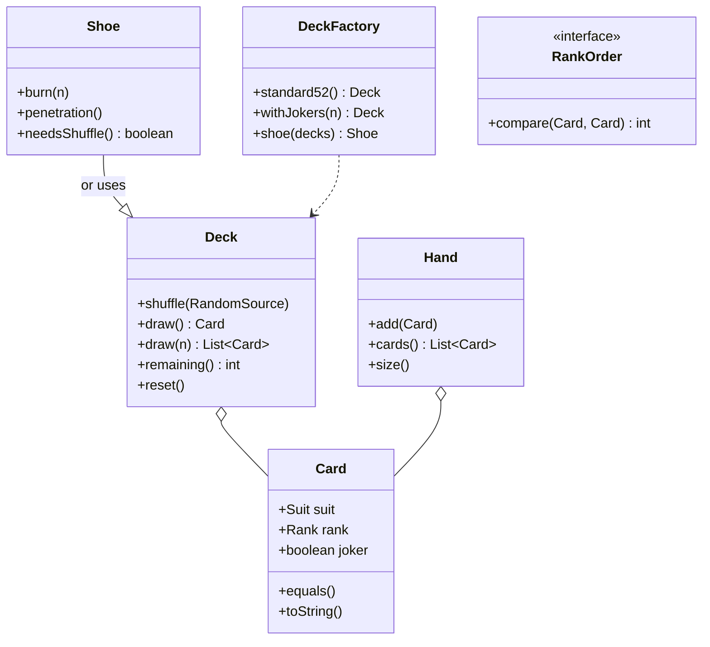

# LLD / OOD: Deck of Cards

> **Focus areas:** Card / Deck / Hand · Shuffle · Deal · Comparators · Game-agnostic core · Extensibility to Poker/Blackjack · Immutability · Fairness  
> **Style:** Object-oriented interview design (clarify → NFRs → cases → classes → APIs → state machines → concurrency → extensibility → deep dive → wrap-up → Q&A)  
> **Quality bar:** Clean domain model, correct shuffle semantics, separation of cards vs game rules, testable randomness seams  
> **Interview theme:** Amazon SDE III / L6 — **foundational OOD**; often a warm-up before poker/games; show reuse without premature game coupling

---

## Table of Contents

1. [Clarify Requirements (Interview Q&A)](#1-clarify-requirements-interview-qa)
2. [Non-Functional Requirements](#2-non-functional-requirements)
3. [Cases](#3-cases)
4. [Object Model & Class Diagrams](#4-object-model--class-diagrams)
5. [Public APIs / Interfaces](#5-public-apis--interfaces)
6. [State Machines](#6-state-machines)
7. [Concurrency & Consistency](#7-concurrency--consistency)
8. [Extensibility](#8-extensibility)
9. [Design Deep Dive](#9-design-deep-dive)
10. [Wrap-Up](#10-wrap-up)
11. [Deeper / Related Interview Questions](#11-deeper--related-interview-questions)
12. [Appendices](#12-appendices)

---

## 1. Clarify Requirements (Interview Q&A)

Goal: model a **standard deck of cards** and operations (shuffle, deal, hands) as a reusable library that games can build on—without baking Poker or Blackjack into the core.

### 1.0 What this is / is not

| Dimension | This | Not |
|-----------|------|-----|
| Job | Card domain + deck operations | Full online casino |
| Rules | Optional rank comparators | Poker hand evaluator (sibling doc) |
| RNG | Injected shuffle | Hardware HSM RNG design |
| Amazon lens | Reuse, correctness, test seams | Clever bit tricks only |

### 1.1 Clarifying questions

| # | Question | Typical answer | Implication |
|---|----------|----------------|-------------|
| F1 | Standard 52? | Yes; optional jokers | `DeckFactory` |
| F2 | Suits/ranks? | 4 suits × 13 ranks | Enums |
| F3 | Shuffle? | Fair shuffle | Fisher–Yates + `Random` port |
| F4 | Deal? | N cards to M hands | `Dealer` helper |
| F5 | Multiple decks? | Shoe for Blackjack | `Shoe` as deck sequence |
| F6 | Face up/down? | Track visibility in Hand/Game | Don't force on Card |
| F7 | Compare cards? | Game-specific | `Comparator<Card>` / `RankOrder` |
| F8 | Immutability? | Card immutable preferred | Thread-safe values |
| F9 | Serialization? | Optional ids | `cardId = suit+rank` |
| F10 | Cheating detection? | Out of MVP | Audit shoe in online poker doc |
| F11 | Custom decks? | Uno etc. later | Generic `Card` product type vs inheritance |
| F12 | Burn cards? | Shoe supports burn | API on Shoe |

**MVP scope:**

1. Suit, Rank, Card value objects.  
2. Standard 52-card Deck.  
3. Shuffle (Fisher–Yates).  
4. Draw / deal to hands.  
5. Reset / new deck.  
6. Optional jokers.  
7. Pluggable rank ordering.

**Out of MVP:** networked multiplayer, chip stacks, tournament seating, RNG certification paperwork.

### 1.2 Scope repeat-back

> Immutable cards, mutable deck/shoe containers, fair injected shuffle, deal into hands, comparators outside the card—ready for Blackjack shoe or Poker without core changes.

---

## 2. Non-Functional Requirements

| # | NFR | Target |
|---|-----|--------|
| N1 | Correctness | No duplicate cards in standard deck unless designed |
| N2 | Shuffle fairness | Uniform permutation (Fisher–Yates) |
| N3 | Testability | Seedable RNG |
| N4 | Performance | Shuffle 52–312 cards negligible |
| N5 | API clarity | Hard to misuse (draw empty throws) |
| N6 | Extensibility | Multi-deck shoe, jokers |
| N7 | Immutability | Card identity stable |
| N8 | Audit hook | Optional deal event listener |

---

## 3. Cases

### 3.1 Happy

1. New standard deck → 52 unique cards.  
2. Shuffle → deal 5 cards to 4 players → each hand size 5; deck remaining 32.  
3. Draw until empty → next draw fails clearly.  
4. Shoe of 6 decks → 312 cards; burn 1; deal.  
5. Ace-high vs Ace-low comparator differs for same cards.

### 3.2 Edge / failure

| Case | Behavior |
|------|----------|
| Draw from empty | `EmptyDeckException` |
| Deal more than remaining | Fail before partial deal (atomic) or document partial |
| Shuffle null random | Reject |
| Duplicate add to deck | Factory prevents; mutable add validates |
| Joker compare | Explicit policy |
| Parallel shuffle same deck | External sync required |
| Reset mid-hand | Game-level decision; deck can `reset()` |

### 3.3 Invariants

```text
I1: Standard deck uniqueness: 52 distinct (suit,rank)
I2: size() == remaining cards
I3: shuffle is permutation of current multiset
I4: Card equality by suit+rank (+joker id)
```

---

## 4. Object Model & Class Diagrams

### 4.1 Core types

| Type | Role |
|------|------|
| `Suit` | CLUBS, DIAMONDS, HEARTS, SPADES |
| `Rank` | ACE…KING |
| `Card` | Immutable suit+rank; optional joker |
| `Deck` | Ordered list; shuffle/draw |
| `Shoe` | Multi-deck + penetration/burn |
| `Hand` | Ordered/multiset of cards |
| `Dealer` | Deal patterns |
| `RandomSource` | RNG port |
| `RankOrder` | Comparator strategy |
| `DeckFactory` | Standard / with jokers / N decks |

### 4.2 Class diagram



### 4.3 Card sketch

```java
public final class Card {
  private final Suit suit;   // null if joker
  private final Rank rank;   // null if joker
  private final boolean joker;
  private final int jokerId; // distinguish two jokers

  public static Card of(Suit s, Rank r) { ... }
  public static Card joker(int id) { ... }
}
```

### 4.4 Deck sketch

```java
public final class Deck {
  private final List<Card> cards; // remaining, top = end or index 0—document
  private final List<Card> original;

  public void shuffle(RandomSource rng) { CollectionsFisherYates(cards, rng); }
  public Card draw() {
    if (cards.isEmpty()) throw new EmptyDeckException();
    return cards.remove(cards.size() - 1);
  }
}
```

### 4.5 Why Card ≠ “PokerCard extends Card with chips”

Inheritance explosion. Keep Card pure; game features live in game layer.

---

## 5. Public APIs / Interfaces

```java
public interface RandomSource {
  int nextInt(int bound); // [0, bound)
}

public interface RankOrder extends Comparator<Card> {}

public final class Dealer {
  public List<Hand> deal(Deck deck, int players, int cardsEach) { ... }
  public void dealOneRound(Deck deck, List<Hand> hands) { ... }
}
```

Factory:

```text
DeckFactory.standard52()
DeckFactory.standard52WithJokers(2)
ShoeFactory.frenchShoe(6)
```

Hand APIs:

```text
add(card), addAll, play(card), contains, sort(RankOrder), revealAll (game)
```

---

## 6. State Machines

Deck is a simple lifecycle:

```text
NEW (ordered) → SHUFFLED → DEALING → EXHAUSTED
EXHAUSTED → NEW/SHUFFLED via reset/reshuffle
Shoe: DEALING → CUT_REACHED → MUST_SHUFFLE
```

Games own richer state (see classic-games / online-poker). Deck should not know “flop/turn/river”.

---

## 7. Concurrency & Consistency

| Scenario | Guidance |
|----------|----------|
| Single table game thread | No sync needed on deck |
| Shared shoe across tables | **Don't**; one shoe one table |
| Parallel hands read-only cards | Cards immutable ⇒ safe |
| Concurrent shuffle | External lock or confine to actor |

Recommendation: **thread-confine** mutable Deck/Shoe; share only immutable Card instances.

---

## 8. Extensibility

| Need | Approach |
|------|----------|
| Blackjack shoe | `Shoe` + cut card |
| Pinochle / Euchre | `DeckFactory` subset |
| Uno | Different card product (`Color`,`UnoValue`)—don't force Suit |
| Rank Ace low | `AceLowOrder` |
| Trump suit | Comparator with trump context |
| Face-down deal | `Hand` slots with `Visibility` |
| Auditable shuffle | `ShufflingDeck` logs seed hash |

Pattern: Factory + Strategy (order) + Composition (Shoe has decks).

---

## 9. Design Deep Dive

### 9.1 Fisher–Yates

```text
for i from n-1 downto 1:
  j = rng.nextInt(i+1)
  swap a[i], a[j]
```

Avoid `Collections.shuffle` mystery if interviewer wants algorithm named—but using stdlib is fine if you explain uniformity.

### 9.2 Deal atomicity

```text
if deck.remaining() < players * cardsEach: throw
// then deal round-robin
for c in 1..cardsEach:
  for h in hands: h.add(deck.draw())
```

Prefer fail-fast over partial deals for library correctness.

### 9.3 Equality & hashing

Cards as values: `equals/hashCode` on suit+rank (+jokerId). Useful in sets for “already played”.

### 9.4 Ordering traps

- Rank order ≠ hand strength (Poker flush).  
- Sorting a Poker hand for display ≠ evaluating category.  
Keep `RankOrder` separate from `HandEvaluator`.

### 9.5 Shoe penetration

```text
needsShuffle = remaining <= (1 - penetration) * total
```

Burn N after shuffle; cut card marker optional.

### 9.6 Serialization

Stable `code`: `"AS"`, `"TH"`, `"JD"`, `"2C"`, `"JOKER1"`. Round-trip for network games.

### 9.7 Deal-breakers

- Mutable Card suit mid-game  
- Game rules inside Deck  
- `Math.random()` hidden (untestable)  
- Partial deal without documenting  
- Inheritance tree Card→FaceCard→Ace→SpadeAce  

### 9.8 Testing

| Test | Assert |
|------|--------|
| Standard size | 52 |
| Uniqueness | 52 distinct |
| Shuffle seed | Deterministic order |
| Empty draw | Throws |
| Deal atomic | All-or-nothing |
| Shoe size | 52 * n |

### 9.9 Performance

Negligible. If millions of shuffles/sec in sim: reuse arrays, avoid boxing—mention only if asked.

### 9.10 Relationship to other docs

- `classic-games-ood-system-design.md` consumes Hand/Deck.  
- `online-poker-system-design.md` adds server RNG audit + cheating.  
- This doc stays **library-grade**.

---

## 10. Wrap-Up

### 10.1 60-second narrative

"Immutable **Card** values, a mutable **Deck** with Fisher–Yates via injected RNG, **Hands** as collections, **Shoe** for multi-deck games, and **comparators** outside the card. Factories build standard/joker/shoe decks. Games own rules; the deck only manages card multiset order and dealing."

### 10.2 Cheat sheet

| Topic | Answer |
|-------|--------|
| Card | Immutable VO |
| Shuffle | Fisher–Yates + RandomSource |
| Rules | Not in Deck |
| Multi-deck | Shoe |
| Order | Strategy comparator |
| Concurrency | Thread-confine deck |

---

## 11. Deeper / Related Interview Questions

**Q: Enum or class for Suit?**  
A: Enum for closed French deck; fine.

**Q: Where put chip value?**  
A: Not on Card—chips are economy domain.

**Q: How support Tarot?**  
A: Separate deck model; don't warp Suit.

**Q: Is Deck a Stack?**  
A: List with draw end; Stack OK if no mid insert.

**Q: Clone hand?**  
A: Defensive copy; cards shared immutably.

**Q: Cryptographic shuffle?**  
A: Online poker needs stronger RNG story; inject CSPRNG.

**Q: toString format?**  
A: Rank+Suit short codes; stable for logs.

**Q: Can Hand implement Iterable?**  
A: Yes; nice API.

**Q: Burn vs discard pile?**  
A: Burn from shoe; discard is game zone object.

**Q: First unit test?**  
A: 52 unique + shuffle seed determinism.

---

## 12. Appendices

### A. Rank enum sketch

```text
ACE, TWO, THREE, FOUR, FIVE, SIX, SEVEN, EIGHT, NINE, TEN, JACK, QUEEN, KING
```

### B. Suit enum

```text
CLUBS, DIAMONDS, HEARTS, SPADES
```

### C. Ace-high order

```text
rankValue: ACE=14, K=13, Q=12, J=11, ... TWO=2
compare: rank then suit (optional suit order bridge)
```

### D. Alternatives to kill

| Alt | Why kill |
|-----|----------|
| Card mutable face | Heisenbugs |
| Poker eval in Card | Wrong layer |
| New Random() inside shuffle | Untestable |
| Array of Strings "Ah" only | Weak typing |

### E. Deal round-robin sketch

```java
List<Hand> hands = IntStream.range(0,p).mapToObj(i->new Hand()).toList();
for (int c=0;c<cardsEach;c++)
  for (Hand h: hands) h.add(deck.draw());
return hands;
```

### F. Flashcards

| Card | Point |
|------|-------|
| VO | Card immutable |
| FY | Fair shuffle |
| Shoe | Multi-deck |
| Comparator | External |
| Factory | Variants |
| Confine | Mutable deck |

### G. Interview timebox (20–30 min warm-up)

| Min | Focus |
|-----|-------|
| 0–3 | Clarify 52 / jokers / shoe |
| 3–12 | Classes |
| 12–20 | Shuffle + deal |
| 20–30 | Extensibility to games |

### H. Glossary

| Term | Meaning |
|------|---------|
| Shoe | Multi-deck dealing box |
| Penetration | % dealt before reshuffle |
| Burn | Discard unseen after shuffle |
| Rank order | Per-game ranking |

### I. JSON card

```json
{"suit":"SPADES","rank":"ACE"}
```

### J. Related files

- `classic-games-ood-system-design.md`  
- `online-poker-system-design.md`

### K. Misuse examples to guard

```text
deck.draw() without empty check in caller → library throws
hand.sort() without RankOrder → require arg
```

### L. Optional listener

```java
interface DeckListener {
  void onShuffle(int n);
  void onDraw(Card c);
}
```

### M. Immutability copy pattern

```text
Hand.sortedCopy(RankOrder) returns new Hand
```

### N. Closing checklist

- [ ] Enums + Card VO  
- [ ] Fisher–Yates + RNG port  
- [ ] Deal atomicity  
- [ ] Shoe/jokers story  
- [ ] No game rules in Deck  
- [ ] Tests named  

### O. 60s backup

"Cards immutable, deck shuffles with injected RNG, hands receive deals, shoe extends multi-deck, comparators pluggable—games build on top."

---

## Extra Depth: Full Type Sketches

```java
public enum Suit { CLUBS, DIAMONDS, HEARTS, SPADES;
  public char symbol() { return name().charAt(0); } // or C D H S
}

public enum Rank {
  ACE, TWO, THREE, FOUR, FIVE, SIX, SEVEN, EIGHT, NINE, TEN, JACK, QUEEN, KING;
  public int pipValue() { /* Ace=1 or 14 via RankOrder, not here */ }
}

public final class Card {
  private final Suit suit;
  private final Rank rank;
  private final boolean joker;
  private final int jokerId;
  // equals/hashCode/toString; getters; no setters
}

public final class Deck {
  private final ArrayList<Card> cards;
  private final List<Card> prototype; // for reset
  public int remaining() { return cards.size(); }
  public boolean isEmpty() { return cards.isEmpty(); }
  public List<Card> asListView() { return Collections.unmodifiableList(cards); }
}
```

---

## Extra Depth: Fisher–Yates Implementation Notes

```java
public void shuffle(RandomSource rng) {
  for (int i = cards.size() - 1; i > 0; i--) {
    int j = rng.nextInt(i + 1);
    Collections.swap(cards, i, j);
  }
}
```

Common bugs:

1. `nextInt(i)` instead of `i+1` → biased.  
2. Shuffling a copy but dealing from original.  
3. Using `random.nextInt()` % n bias.  
4. Reshuffle without combining discard (game concern).

---

## Extra Depth: Shoe Design

```java
public final class Shoe {
  private final Deck deck; // concatenated
  private final int totalSize;
  private final double penetration; // e.g. 0.75
  private boolean cutReached;

  public static Shoe ofDecks(int n, DeckFactory f) {
    Deck d = f.empty();
    for (int i = 0; i < n; i++) d.addAll(f.standard52().drawAll());
    return new Shoe(d, 0.75);
  }

  public void shuffle(RandomSource rng) {
    deck.shuffle(rng);
    cutReached = false;
    burn(1); // policy
  }

  public Card draw() {
    Card c = deck.draw();
    if (deck.remaining() <= (1 - penetration) * totalSize) cutReached = true;
    return c;
  }

  public boolean needsShuffle() { return cutReached || deck.isEmpty(); }
}
```

Blackjack table asks `needsShuffle()` between rounds, not mid-hand.

---

## Extra Depth: Hand Operations

```java
public final class Hand {
  private final ArrayList<Card> cards = new ArrayList<>();

  public void add(Card c) { cards.add(Objects.requireNonNull(c)); }
  public boolean remove(Card c) { return cards.remove(c); }
  public Optional<Card> play(Card c) {
    if (!cards.contains(c)) return Optional.empty();
    cards.remove(c);
    return Optional.of(c);
  }
  public Hand sortedCopy(RankOrder order) {
    Hand h = new Hand();
    cards.stream().sorted(order).forEach(h::add);
    return h;
  }
  public int size() { return cards.size(); }
  public Stream<Card> stream() { return cards.stream(); }
}
```

For hidden cards in multiplayer, prefer `SeatHand { privateCards, publicCards }` in game layer.

---

## Extra Depth: RankOrder Library

```java
public final class RankOrders {
  public static final RankOrder ACE_HIGH = (a,b) ->
    Integer.compare(aceHigh(a.rank()), aceHigh(b.rank()));
  public static final RankOrder ACE_LOW = (a,b) ->
    Integer.compare(aceLow(a.rank()), aceLow(b.rank()));
  public static RankOrder withTrump(Suit trump, RankOrder base) { ... }
  public static RankOrder bridgeSuitOrder(RankOrder rank) { ... }
}
```

Poker **hand** categories still go to `HandEvaluator`—not here.

---

## Extra Depth: Dealer Patterns

| Pattern | Use |
|---------|-----|
| Round-robin N each | Poker hole cards |
| One at a time community | Poker board (game) |
| Player then dealer | Blackjack |
| Burn then 3 | Flop helper in poker game |

```java
public void dealRoundRobin(Deck deck, List<Hand> hands, int n) {
  ensureEnough(deck, hands.size() * n);
  for (int i = 0; i < n; i++)
    for (Hand h : hands) h.add(deck.draw());
}
```

---

## Extra Depth: Encoding & Interop

| Code | Card |
|------|------|
| AS | Ace Spades |
| TH | Ten Hearts |
| 2C | Two Clubs |
| JOKER1 | Joker |

```java
CardCodec.parse("AS") → Card
CardCodec.format(card) → "AS"
```

Useful for tests and network payloads without leaking game protocol into Card.

---

## Extra Depth: Invariants Test Suite Outline

```text
standardDeck_has52
standardDeck_allUnique
shuffle_isPermutation
shuffle_seed_isDeterministic
draw_reducesRemaining
draw_empty_throws
deal_atomic_failsIfShort
shoe_6decks_312
jokers_distinguishable
card_equals_valueBased
rankOrder_aceHigh_kingBelowAce
```

Property test idea: for seed in 0..10k, shuffle permutation check via multiset equality.

---

## Extra Depth: Anti-Patterns

| Anti-pattern | Fix |
|--------------|-----|
| `class AceOfSpades extends Card` | Enum values |
| `card.setSuit` | Immutable |
| `Deck.evaluatePokerHand` | Wrong layer |
| Static global deck | Dependency inject |
| UI sprite fields on Card | View model |
| Integer 0–51 only | OK internally but wrap type |

Bit-level 0–51 encoding is fine **inside** an optimized engine if API still exposes Card.

---

## Extra Depth: Memory Layout (Optional)

```text
52 cards × interned enums ≈ tiny
Hand of 7 cards ≈ negligible
Shoe 312 × references ≈ 2–3KB
```

Interview: "CPU/memory not the problem; API misuse and fairness are."

---

## Extra Depth: Bridging to Games

```text
Deck/Shoe/Hand/Card     ← this library
GameRules / Evaluator   ← classic-games / poker
Table / Betting / Net   ← online-poker
```

Dependency arrow only upward. Games depend on cards; cards never depend on games.

---

## Extra Depth: Reset vs New Deck

| API | When |
|-----|------|
| `reset()` | Restore prototype order then shuffle |
| `new standard52()` | Fresh instance |
| `reuse + shuffle(discard∪remaining)` | Some home rules |

Document whether reset includes cards currently in hands (usually **no**—game must collect).

---

## Scenario Walkthrough: Blackjack Start

```text
1. shoe.shuffle(rng)
2. shoe.burn(1)
3. deal player, dealer, player, dealer (last dealer hole)
4. hands hold Cards; values computed in BlackjackRules
5. mid-shoe: if shoe.needsShuffle() after round → reshuffle
```

Deck library never computes soft 17.

---

## Scenario Walkthrough: Poker Table Collect

```text
1. deck.reset(); deck.shuffle(rng)
2. burn; deal hole round-robin
3. board cards drawn by PokerDealer onto Board object
4. at showdown evaluator uses Card list; deck spent cards stay out
5. next hand: gather all → reset/shuffle new
```

---

## Extended Rapid Q&A

**Q: Should draw return Optional?**  
A: Optional OK; exception OK—pick one, be consistent. Empty is exceptional in deal path.

**Q: Iterable Deck?**  
A: Prefer not to expose remaining order if secrecy matters; debug view only.

**Q: Why prototype list?**  
A: Exact reset composition including jokers.

**Q: Multi-thread deal?**  
A: Don't; one dealer thread per table.

**Q: Compare jokers?**  
A: Throw or always greater—policy object.

**Q: French vs German decks?**  
A: Different factory; don't overload Suit with leaves/acorns unless modeling that game.

**Q: Put deckId for audit?**  
A: Shoe/Deck instance UUID + shuffle seed hash for online.

**Q: Can Hand be a Set?**  
A: Multiset/list—games can have duplicate ranks; sets lose order.

**Q: Clone deck for sim?**  
A: Deep copy list of immutable cards—cheap.

**Q: What's the L6 signal?**  
A: Clean boundaries + testable RNG + refuse to stuff poker into Card.

---

## Alternatives to Kill (Expanded)

| Alt | Why kill |
|-----|----------|
| Stringly cards everywhere | Typos |
| One singleton Deck | Hidden state |
| Shuffle by sorting Random keys biased | Subtle unfairness |
| Inheritance per suit | Explosion |
| Deck notifies UI directly | Coupling |

---

## Interview Timebox (Expanded)

| Min | Focus |
|-----|-------|
| 0–3 | Scope 52 / jokers / shoe |
| 3–10 | Card/Deck/Hand diagram |
| 10–18 | Shuffle + deal code |
| 18–25 | Comparators + immutability |
| 25–35 | Shoe + game boundary |
| 35–40 | Tests + anti-patterns |

---

## Closing Cheat Sheet (Extended)

| Topic | Answer |
|-------|--------|
| Identity | Suit+Rank (+jokerId) |
| Mutability | Card no / Deck yes |
| Fairness | Fisher–Yates |
| Seam | RandomSource |
| Multi-deck | Shoe + penetration |
| Rules | External |
| Conc | Thread confine |
| Kill | Rules in Deck; untestable RNG |

---

## Final Checklist (Print)

- [ ] Card immutable VO  
- [ ] Enums for Suit/Rank  
- [ ] Fisher–Yates named  
- [ ] RNG injected  
- [ ] Empty draw behavior  
- [ ] Atomic deal  
- [ ] Shoe story  
- [ ] RankOrder strategy  
- [ ] Boundary vs poker  
- [ ] Tests listed  

---

*End of Deck of Cards LLD/OOD notes (Amazon SDE III prep).*
