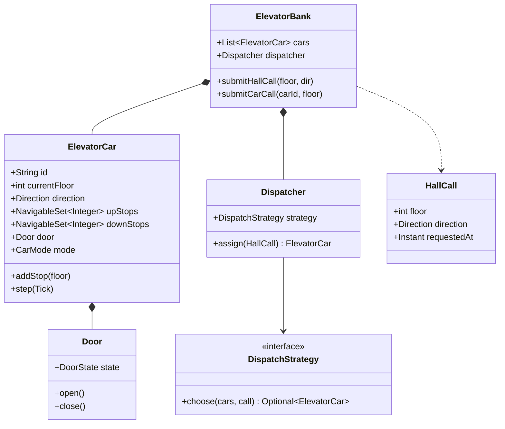

# LLD / OOD: Elevator System

> **Focus areas:** Elevator cars · Hall calls · Car calls · Dispatch / scheduling · Direction state · Safety · Concurrency · Multi-car bank · Extensibility  
> **Style:** Object-oriented interview design (clarify → NFRs → cases → classes → APIs → state machines → concurrency → extensibility → deep dive → wrap-up → Q&A)  
> **Quality bar:** Safe motion model, fair dispatch, no lost calls, clear separation of control vs simulation, explainable scheduling trade-offs  
> **Interview theme:** Amazon SDE III / L6 — **classic elevator LLD**; show state machines + scheduling strategy, not only UML boxes

---

## Table of Contents

1. [Clarify Requirements (Interview Q&A)](#1-clarify-requirements-interview-qa)
2. [Non-Functional Requirements](#2-non-functional-requirements)
3. [Cases](#3-cases)
4. [Object Model & Class Diagrams](#4-object-model--class-diagrams)
5. [Public APIs / Interfaces](#5-public-apis--interfaces)
6. [State Machines](#6-state-machines)
7. [Concurrency & Consistency](#7-concurrency--consistency)
8. [Extensibility](#8-extensibility)
9. [Design Deep Dive](#9-design-deep-dive)
10. [Wrap-Up](#10-wrap-up)
11. [Deeper / Related Interview Questions](#11-deeper--related-interview-questions)
12. [Appendices](#12-appendices)

---

## 1. Clarify Requirements (Interview Q&A)

Goal: design software that controls an **elevator bank**—accept hall/car requests, dispatch cars, move safely between floors, open/close doors, and remain fair under load.

### 1.0 What this is / is not

| Dimension | This doc | Not this |
|-----------|----------|----------|
| Job | Control logic + object model | Building structural engineering |
| Motion | Discrete floors + ticks / events | Continuous physics FEM |
| Hardware | Door/motor/sensor ports | Vendor PLC code |
| Amazon lens | Reliability, safety bias, ownership | Demo animation only |

### 1.1 Clarifying questions

| # | Question | Typical answer | Implication |
|---|----------|----------------|-------------|
| F1 | Floors? | N floors (e.g. 1–20) | Floor id space |
| F2 | Cars? | K elevators in a bank | Dispatcher across cars |
| F3 | Hall buttons? | Up/Down per floor (not top/bottom) | `HallCall(floor, direction)` |
| F4 | Car buttons? | Destination floors inside car | `CarCall(elevatorId, floor)` |
| F5 | Scheduling? | Efficient + fair; SCAN/LOOK-like | `DispatchStrategy` |
| F6 | Capacity? | Max weight/people | Reject / alarm overload |
| F7 | Door control? | Auto open/close with sensors | Door state machine |
| F8 | Emergency? | Fire mode, stop, evacuate | Safety overrides |
| F9 | Express / zones? | Optional high-rise zoning | Constraints on dispatcher |
| F10 | Simulation vs real? | Controllable clock / tick | Inject `Clock` / `MotorPort` |
| F11 | Destination dispatch? | Optional (keypad in lobby) | Different call model |
| F12 | Maintenance mode? | Take car out of service | Car mode enum |

**MVP scope:**

1. Multi-car, multi-floor bank.  
2. Hall up/down + car destination requests.  
3. Per-car direction + stop set.  
4. Dispatcher assigns hall calls to cars.  
5. Door open/close with dwell timer.  
6. Overload and out-of-service modes.  
7. Safety: never move with doors open; never serve past stop without stop.

**Out of MVP:** full destination-control optimization research, twin elevators, predictive ML traffic, smartphone summon as primary.

### 1.2 Scope repeat-back

> Elevator bank with hall/car calls, per-car state machines, pluggable dispatch strategy, door/safety interlocks, and ports for motor/sensors—fair and safe under concurrent requests.

---

## 2. Non-Functional Requirements

| # | NFR | Target |
|---|-----|--------|
| N1 | Safety integrity | Independent interlocks; software cannot bypass door/motor safety |
| N2 | Call durability | No lost hall call while system up; persist if required |
| N3 | Dispatch latency | Assign within tens of ms |
| N4 | Fairness | No indefinite starvation of a floor |
| N5 | Determinism (sim) | Same inputs + clock → same motion (testability) |
| N6 | Observability | Per-car state, wait times, door faults |
| N7 | Availability | One car fault ≠ bank dead |
| N8 | Extensibility | New strategy without rewriting cars |

### 2.1 Progressive scale

| Metric | Base | 10× | 100× |
|--------|------|-----|------|
| Floors | 20 | 60 | Campus many banks |
| Cars | 4 | 8–12 | Many banks |
| Peak calls/min | 30 | 200 | 2K+ |
| Shift | Single bank | Zoned banks | Building controller of banks |

---

## 3. Cases

### 3.1 Happy paths

1. Hall UP on 3 → nearest suitable car assigned → arrives → doors open → rider enters → presses 10 → travels UP → stops → exits.  
2. Car already going UP with stops {5,10}; hall UP on 7 added mid-way → stops at 7.  
3. Two cars idle → dispatcher picks closer / load-balanced.  
4. Overload sensor → doors stay open, alarm, refuse move.  
5. Car OOS → dispatcher ignores it.

### 3.2 Edge / failure

| Case | Behavior |
|------|----------|
| Hall call both directions same floor | Two calls; serve by approaching direction rules |
| All cars busy opposite way | Queue; assign by ETA / SCAN handoff |
| Door obstruction | Reopen; retry; fault after N |
| Motor fault mid-travel | Emergency stop; alarm; evacuate procedure |
| Duplicate car button 10 | Idempotent add stop |
| Starvation top floor | Aging / max wait in cost function |
| Power loss | Persist active calls if required; safe stop |
| Fire mode | Cars go to egress floor; ignore normal calls |
| Simultaneous opposite hall presses | Independent calls |
| Rider cancels | Optional; usually no cancel on hall |

### 3.3 Invariants

```text
I1: Door OPEN ⇒ Motor NOT MOVING
I2: Moving direction matches committed service direction (or IDLE)
I3: Every ACTIVE hall call assigned to ≤1 car (or pending queue with exactly-once assign)
I4: Capacity alarm ⇒ target speed 0 until cleared
I5: OOS car accepts no new assignments
```

---

## 4. Object Model & Class Diagrams

### 4.1 Core classes

| Class | Responsibility |
|-------|----------------|
| `Building` / `ElevatorBank` | Floors + cars + dispatcher |
| `ElevatorCar` | Position, direction, stops, mode, door |
| `Door` | Open/close/obstructed |
| `HallPanel` | Up/down buttons per floor |
| `CarPanel` | Destination buttons |
| `HallCall` / `CarCall` | Request value objects |
| `StopRequest` | Unified pending stop |
| `Dispatcher` | Assigns hall calls |
| `DispatchStrategy` | Costing / SCAN / nearest |
| `ElevatorController` | Tick / event loop per car |
| `SafetyMonitor` | Interlocks, fire mode |
| `MotorPort` / `SensorPort` | Hardware abstraction |
| `TrafficStats` | Wait time metrics |

### 4.2 Enums

```text
Direction: UP | DOWN | IDLE
DoorState: OPEN | CLOSING | CLOSED | OPENING | OBSTRUCTED | FAULT
CarMode: NORMAL | OVERLOAD | OUT_OF_SERVICE | FIRE | MAINTENANCE | EMERGENCY_STOP
CallStatus: PENDING | ASSIGNED | SERVING | DONE | CANCELLED
```

### 4.3 Class diagram



### 4.4 Stop sets

Use two sorted sets:

```text
upStops: ascending floors ≥ current when serving UP
downStops: descending floors ≤ current when serving DOWN
```

LOOK/SCAN: finish direction before reversing.

### 4.5 Package layout

```text
elevator/
  domain/     Car, Door, Calls, enums
  dispatch/   Dispatcher, NearestStrategy, LookStrategy
  control/    CarController, BankController
  safety/     SafetyMonitor, FireModePolicy
  ports/      MotorPort, WeightSensor, Clock
  app/        ElevatorService
```

---

## 5. Public APIs / Interfaces

### 5.1 Bank API

```text
pressHall(floor, Direction) → CallId
pressCar(carId, floor) → void
getStatus() → BankStatus
setCarMode(carId, CarMode) → void
enableFireMode(boolean) → void
```

### 5.2 Strategy

```java
public interface DispatchStrategy {
  Optional<String> chooseCar(List<CarView> cars, HallCall call, CostConfig cfg);
}
```

### 5.3 Motor port

```java
public interface MotorPort {
  void moveToward(int floor);
  void stop();
  int readFloorApprox(); // or floor sensor events
}
```

### 5.4 Event-driven sensors

```text
onFloorReached(carId, floor)
onDoorClosed(carId)
onDoorObstructed(carId)
onWeightChanged(carId, weight)
onEmergencyStop(carId)
```

### 5.5 REST/sim API (interview optional)

```text
POST /banks/{id}/hall-calls {floor, direction}
POST /banks/{id}/cars/{carId}/calls {floor}
GET  /banks/{id}/status
POST /banks/{id}/tick          // simulation
```

---

## 6. State Machines

### 6.1 Car motion/service

```text
IDLE → MOVING_UP / MOVING_DOWN   (has stops)
MOVING_* → DOOR_OPENING          (arrived at stop)
DOOR_OPENING → DOOR_OPEN
DOOR_OPEN → DOOR_CLOSING         (dwell elapsed & clear)
DOOR_CLOSING → MOVING_* / IDLE   (more stops? same dir then reverse then idle)
* → EMERGENCY_STOP
FIRE mode: go to egress, open, ignore new normal calls
```

### 6.2 Door

```text
CLOSED → OPENING → OPEN → CLOSING → CLOSED
CLOSING → OPENING (obstruction)
* → FAULT
```

### 6.3 Hall call lifecycle

```text
PENDING → ASSIGNED → CAR_ARRIVED / SERVING → DONE
PENDING → REASSIGNED (car fault)
```

### 6.4 Direction transition (LOOK)

```text
Serving UP:
  if upStops not empty: continue UP
  else if downStops not empty: reverse DOWN
  else IDLE

Serving DOWN: symmetric
```

---

## 7. Concurrency & Consistency

### 7.1 Threads / models

Pick one and stick to it:

1. **Single bank event loop** (easiest correctness): all presses + sensor events queued; process serially.  
2. **Per-car actor** + dispatcher thread: hall assign messages.  
3. Shared mutable cars with locks (messy—avoid in interview unless careful).

**Recommended:** event-loop or actors; emphasize no motion decision without door closed event.

### 7.2 Races

| Race | Fix |
|------|-----|
| Two hall assigns same call to two cars | Call registry single-assign |
| Press during door close | Queue stop; reopen if same floor |
| Mode change mid-move | Finish safe stop; then apply |
| Strategy reads stale ETA | Assign under bank lock / event thread |

### 7.3 Persistence

MVP in-memory OK; production: persist PENDING/ASSIGNED calls + car mode. Motion position from sensors on recovery.

---

## 8. Extensibility

| Extension | Hook |
|-----------|------|
| Nearest car | `NearestStrategy` |
| LOOK with idle preference | `LookStrategy` |
| Zone restriction | Filter cars by zone before cost |
| Destination dispatch | Lobby enters dest; dispatcher batches |
| VIP / staff override | Priority queue weight |
| Peak uppeak mode | Bias cars to lobby |
| Double-deck | Specialized car type subclass carefully—or composition |

Open/Closed: new strategy class; car remains stop-set machine.

---

## 9. Design Deep Dive

### 9.1 Cost function (simple)

```text
cost(car, hallCall) =
  if car.OOS or FIRE: ∞
  if overload: ∞
  + timeToReach(car, call.floor, call.dir)
  + stopCountPenalty
  + loadPenalty
  + agingBonus(now - call.requestedAt)  // negative cost / priority
```

`timeToReach` respects whether car will pass floor in current direction with compatible intent (UP hall only picked by cars that will serve UP there).

### 9.2 Serving compatibility

Hall UP at floor F: car should stop at F while moving UP (or idle assign then move). Do not assign a DOWN-only busy car if it won't return soon—unless best ETA still wins.

### 9.3 Simulation tick

```text
onTick:
  for car in cars:
    car.step(tick)
      if moving and reached next floor: update floor
      if floor in stops: stop, remove stop, open door
      if door open and dwell done: close
      if closed: pick next target from stop sets
  dispatcher.drainPending()
```

### 9.4 Safety deep dive

Software requests; **hardware interlocks** win. SafetyMonitor can force EMERGENCY_STOP. Fire service mode: cars to recall floor; doors open; car calls limited per code.

### 9.5 Starvation

Pure nearest can starve high floors at peak. Mitigate: wait-time aging in cost; max-wait preemption; periodic fairness sweep.

### 9.6 Failure modes

| Failure | Behavior |
|---------|----------|
| Door fault | Car OOS; reassign hall calls |
| Position unknown | Stop; maintenance |
| Dispatcher crash | Cars finish local stops; hall pending rebuild |
| Networked panels down | Degrade; local car panel still works |

### 9.7 Observability

Metrics: `hall_wait_p99`, `trip_time`, `door_reopen_count`, `assign_latency`, `starvation_events`.  
Traces: callId → carId → stops.

### 9.8 Deal-breakers

- Move with door OPEN  
- Drop hall calls on assign race  
- Unbounded starvation  
- God-class with if-else for every building quirk  
- Strategy mutating car motors directly (bypass controller)

### 9.9 Testing

| Test | Assert |
|------|--------|
| LOOK reverse | Finishes UP stops before DOWN |
| Concurrent presses | No lost calls |
| Obstruction | Reopen |
| Fire mode | Recall behavior |
| Overload | No move |

### 9.10 Destination control (optional deep)

Lobby keypad: user enters destination D; system assigns car C; shows “take car C”; car already has stop D; hall up/down eliminated. Changes call model to `DestinationCall(floor, dest)`.

---

## 10. Wrap-Up

### 10.1 60-second narrative

"We model an **ElevatorBank** of cars, each a state machine with **direction + sorted stop sets** and a **door** interlock. Hall calls go through a **Dispatcher** with a pluggable cost strategy (LOOK/nearest + aging). Car controllers only move when doors are closed and mode allows. Safety/fire modes override normal scheduling. Concurrency is an event loop so we never double-assign or move unsafely."

### 10.2 Cheat sheet

| Topic | Answer |
|-------|--------|
| Core DS | upStops / downStops |
| Algorithm | LOOK + cost dispatch |
| Safety | Door closed ∧ not overload |
| Fairness | Aging / max wait |
| Extensibility | DispatchStrategy |
| Kill | Move doors open; lose calls |

---

## 11. Deeper / Related Interview Questions

**Q: SCAN vs LOOK?**  
A: SCAN goes to end floor; LOOK reverses at last request—usually better for elevators.

**Q: Why not always nearest idle?**  
A: Ignores direction synergy and batching; can worsen peak.

**Q: How model weight?**  
A: Sensor port; mode OVERLOAD blocks close/move.

**Q: Multi-bank building?**  
A: Bank per shaft group; building router by floor zone.

**Q: How test without hardware?**  
A: Fake MotorPort + virtual clock ticks.

**Q: Request cancel?**  
A: Car optional; hall rare; design Cancelable if asked.

**Q: Priority emergency medical?**  
A: Special call class with cost=-∞ and clear protocol.

**Q: Where put dwell time?**  
A: Door/controller config; adaptive dwell optional.

**Q: Thread per elevator?**  
A: OK with actor model; document message protocols.

**Q: Persist every floor event?**  
A: Not required; persist modes + pending calls.

**Q: Amazon leadership?**  
A: Safety > latency; own door-fault runbooks.

**Q: Express elevator?**  
A: Car constraint: only serves sky lobby set.

**Q: Crowded lobby uppeak?**  
A: Bias idle cars to floor 1; temporary strategy swap.

**Q: Idempotent hall press?**  
A: Same floor+dir coalesces to one call.

**Q: First metric?**  
A: Hall wait p95/p99 + door fault rate.

---

## 12. Appendices

### A. Flashcards

| Card | Point |
|------|-------|
| Stops | Two sorted sets |
| Dispatch | Strategy cost |
| Door | Interlock |
| Fairness | Aging |
| Mode | NORMAL/OOS/FIRE |
| Concurrency | Event loop |

### B. Sample cost pseudocode

```text
function choose(cars, call):
  best = none, bestCost = ∞
  for c in cars:
    k = cost(c, call)
    if k < bestCost: best, bestCost = c, k
  return best
```

### C. Car.step sketch

```java
void step(Duration dt) {
  safety.check(this);
  switch (phase) {
    case MOVING -> advance(dt);
    case DOOR_OPEN -> dwell(dt);
    case DOOR_CLOSING -> tryClose();
    case IDLE -> pullNextDirection();
  }
}
```

### D. Alternatives to kill

| Alt | Why kill |
|-----|----------|
| Random car assign | Poor UX / unfair |
| Global lock on motor I/O | Unnecessary if evented |
| Infinite reopen without fault | Hang forever |
| Hardcode 10 floors in switch | Not extensible |

### E. Sequence: hall up mid-travel

```text
Car at 4 going UP stops{10}
Hall UP@7 assigned to car
add 7 to upStops
Arrive 7 → open → continue to 10
```

### F. Runbooks

**R1 — Door obstruct loop:** After N, FAULT + OOS + page.  
**R2 — Car stuck between floors:** Emergency; other cars take load.  
**R3 — Dispatcher bug double assign:** Call registry assert; page on dual arrival.

### G. Zoning example

```text
Bank A: floors 1–20
Bank B: floors 1, 21–40 (sky lobby)
Router: dest∈B → Bank B
```

### H. Interview timebox

| Min | Focus |
|-----|-------|
| 0–5 | Clarify floors/cars/calls |
| 5–15 | Classes + stop sets |
| 15–25 | State machines |
| 25–35 | Dispatch + fairness |
| 35–45 | Safety + concurrency + Q |

### I. Glossary

| Term | Meaning |
|------|---------|
| Hall call | Lobby/floor up/down request |
| Car call | Destination inside car |
| LOOK | Reverse at last request |
| Dwell | Door open wait time |
| Bank | Group of cars together |

### J. Status DTO

```json
{
  "cars": [
    {"id":"E1","floor":5,"dir":"UP","stops":[7,10],"door":"CLOSED","mode":"NORMAL"}
  ],
  "pendingHall": [{"floor":3,"dir":"UP"}]
}
```

### K. Related patterns

State Machine, Strategy, Observer (panels), Actor, Ports & Adapters.

### L. Safety checklist

- [ ] Door closed before move  
- [ ] Overload blocks  
- [ ] Fire recall  
- [ ] OOS excluded  
- [ ] E-stop highest priority  

### M. Fairness numeric example

```text
Call waiting 120s gets agingBonus that beats a slightly nearer busy car
```

### N. Closing narrative backup

"Stop sets + LOOK, dispatcher strategy, door interlocks, modes for overload/fire/OOS, event-loop concurrency, metrics on wait time."

### O. Final checklist

- [ ] Hall vs car calls  
- [ ] Direction + stop sets  
- [ ] Dispatcher strategy  
- [ ] Door/safety  
- [ ] Starvation answer  
- [ ] Extensibility  
- [ ] Out of scope clear  

---

## Extra Depth: Worked Dispatch Example

Floors 1–10. Cars:

```text
E1: floor 2, IDLE, empty stops
E2: floor 8, UP, upStops={10}
E3: floor 6, DOWN, downStops={3}
```

Hall call: UP @ 5.

Rough costs:

```text
E1: travel 2→5 (3 floors) + start penalty = moderate
E2: going UP to 10, then must reverse to serve UP@5 later = high ETA
E3: going DOWN past 5? DOWN service won't pick UP hall at 5 on the way;
    after finishing DOWN, climb back = medium-high
```

Choose **E1** (idle nearest sensible). Assign call; E1 adds stop 5, direction UP.

If instead E1 were at floor 9 overloaded OOS, compare E3 after reverse vs E2—aging may pick E3 if call waited long.

---

## Extra Depth: Stop-Set Mutations

```text
addStop(floor):
  if floor == current && door not CLOSED: reopen / hold open; return
  if floor == current && moving: illegal mid-shaft; queue as next
  if floor > current: upStops.add(floor)
  if floor < current: downStops.add(floor)
  if IDLE: set direction toward floor; add to appropriate set

onArrive(floor):
  remove from both sets (idempotent)
  open door
```

Car calls always added; hall calls added only after assignment.

---

## Extra Depth: Door Timing Parameters

| Param | Typical | Notes |
|-------|---------|-------|
| dwell | 2–5s | Longer at lobby |
| nudge | shorter dwell if empty | Presence sensor |
| reopen max | 3–5 | Then fault |
| close timeout | 10s | Obstruction handling |

Adaptive dwell: if many car calls still pending same direction, shorten lobby dwell carefully—document UX trade-off.

---

## Extra Depth: Pseudocode Bank Event Loop

```text
queue = eventQueue
loop:
  e = queue.take()
  match e:
    HallPressed(f,d):
      call = registry.create(f,d)
      car = strategy.choose(views(), call)
      if car: assign(call, car); car.addHallStop(f,d)
      else: pending.add(call)
    CarPressed(id,f):
      cars[id].addStop(f)
    FloorSensor(id,f):
      cars[id].onFloor(f)
    DoorClosed(id):
      cars[id].onDoorClosed()
    Tick:
      for c in cars: c.progress(dt)
      tryAssignPending()
    SetMode(id,m):
      cars[id].setMode(m); reassignIfNeeded(id)
```

Single-threaded processing ⇒ no lost updates between assign and addStop.

---

## Extra Depth: Reassign on Fault

```text
onCarFault(car):
  car.mode = OOS
  calls = registry.callsAssignedTo(car) where not yet boarded
  for call in calls:
    call.status = PENDING
    queue.publish(Reassign(call))
  car local car-calls: may be stranded—alarm + intercom SOP
```

Never leave hall calls stuck on a dead car.

---

## Extra Depth: Metrics Catalog

| Metric | Use |
|--------|-----|
| `hall_wait_seconds` histogram | SLO |
| `assignment_cost` | Tune strategy |
| `door_reopen_total` | Hardware health |
| `car_oos_ratio` | Capacity planning |
| `starvation_over_threshold` | Fairness alarm |
| `pending_hall_depth` | Peak detector |

Wide event fields: `call_id`, `car_id`, `floor`, `dir`, `wait_ms`, `strategy_version`.

---

## Extra Depth: Common Interview Traps

1. **Only modeling one elevator** — ask about bank early.  
2. **No direction** — become a random tourist elevator.  
3. **List of stops unsorted** — miss SCAN/LOOK.  
4. **Ignoring door state** — safety fail.  
5. **Optimizing average wait only** — forget p99 starvation.  
6. **Mixing destination dispatch without stating it** — inconsistent buttons.  
7. **Threads everywhere** — race on stop sets.

---

## Extra Depth: Comparison Table Strategies

| Strategy | Pros | Cons |
|----------|------|------|
| Nearest idle | Simple | Weak under load |
| LOOK/SCAN | Strong single-car | Needs good assign |
| Cost ETA | Balanced | Tunable complexity |
| Zoning | Scales tall buildings | Lobby complexity |
| Destination control | Throughput | UX + infra change |

---

## Extra Depth: Building Controller Sketch

```text
BuildingController
  banks: [BankA, BankB]
  route(DestinationCall):
    if dest in BankB.zone: BankB.submit(call)
    else BankA.submit(call)
```

Each bank still owns dispatch; building only routes.

---

## Extra Depth: Overload UX

```text
weight > max:
  mode = OVERLOAD
  inhibit door close
  sound alarm / display "OVERLOAD"
  onWeightCleared: mode = NORMAL; allow close
```

Do not shed hall assignments solely due to brief overload—only inhibit motion.

---

## Extra Depth: Deterministic Simulation Harness

```text
clock = FakeClock
motor = SimMotor(floors, speedFloorsPerSec)
script:
  at t=0: hall UP@1
  at t=3: car press 10
  at t=30: assert car.floor==10 and call.DONE
```

Golden traces catch strategy regressions.

---

## Scenario Runbooks (Expanded)

### R1 — Peak morning uppeak
Swap strategy to `UpPeakStrategy` (keep more cars near lobby). Watch `hall_wait` at floor 1.

### R2 — One car OOS mid-day
Reassign; notify facilities; reduce advertised capacity on status board.

### R3 — Nuisance button mashing
Coalesce duplicate hall presses; rate-limit doesn't drop first call.

### R4 — Smoke / fire alarm input
Enter FIRE; recall; ignore normal hall; log every override.

### R5 — Clock jump in sim
Guard negative dt; clamp.

---

## Extended Rapid Q&A

**Q: Represent floors as enum?**  
A: No—use int / FloorId; buildings differ.

**Q: Bidirectional stop list one TreeSet?**  
A: Possible with direction context; two sets clearer in interview.

**Q: Who owns dwell timer?**  
A: CarController; Door is state, controller times transitions.

**Q: Can strategy open doors?**  
A: No—only propose assignments; controller executes.

**Q: How model basement floors?**  
A: Negative or labeled FloorId; direction math still works.

**Q: Skip-stop express logic?**  
A: Allowed floor set filter on addStop / assign.

**Q: Energy-saving mode?**  
A: Idle cars sleep after T; wake on call; trade wait vs energy.

**Q: Sync vs async motor API?**  
A: Prefer async events (`onFloorReached`); sync move() blocks event loop—bad.

**Q: What's a good default strategy to code first?**  
A: Nearest + LOOK stop handling; mention ETA cost as next step.

**Q: How show L6 judgment?**  
A: Name safety deal-breakers early; pick event-loop; measure wait p99.

---

## Alternatives to Kill (Expanded)

| Alt | Why kill |
|-----|----------|
| Central brain moves every motor each ms without state | Untestable spaghetti |
| Hall call assigned to all cars | Wasted stops |
| Cancel hall on first reopen | Lost rider |
| Store only target floor (one) | Can't multi-stop |
| Float position without floor events | Sensor reality ignored |

---

## Closing Cheat Sheet (Extended)

| Topic | Answer |
|-------|--------|
| DS | upStops/downStops + direction |
| Assign | Strategy cost + single registry |
| Safety | Door ∧ weight ∧ mode |
| Fairness | Aging |
| Conc | Event loop / actors |
| Scale | Banks + zones |
| Kill | Doors-open move; lost calls; starvation shrug |

---

## Final Interview Checklist (Print)

- [ ] Clarified hall vs car vs destination dispatch  
- [ ] Drew bank + car + door + dispatcher  
- [ ] Explained LOOK reverse rules  
- [ ] Wrote cost function sketch  
- [ ] Stated safety invariants  
- [ ] Covered fault reassignment  
- [ ] Named metrics  
- [ ] Mentioned fire/OOS modes  
- [ ] Extensibility via Strategy  
- [ ] Explicit out-of-scope  

---

*End of Elevator LLD/OOD notes (Amazon SDE III prep).*
