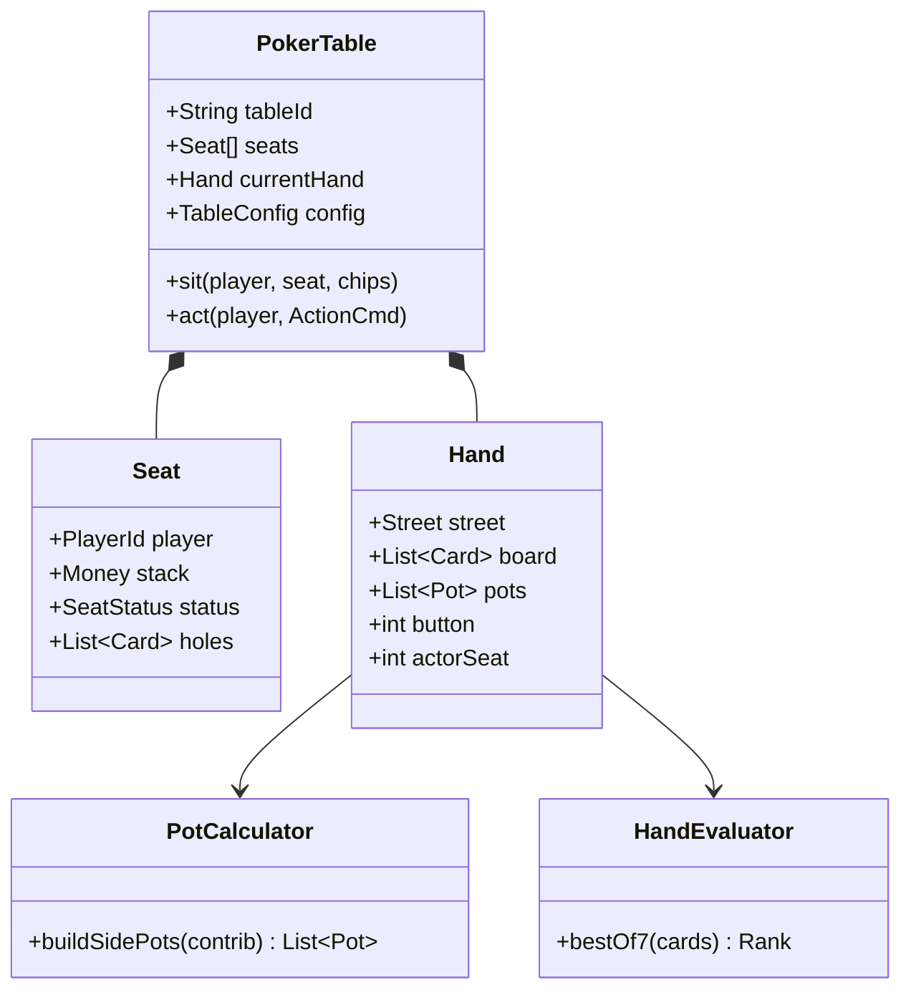

# LLD / System Design: Online Poker

> **Focus areas:** Table state machine · Betting rounds · Side pots · Hand evaluation · Fair shuffle · Seats · Disconnects · Concurrency · Anti-cheat hooks · Extensibility (Hold'em → variants)  
> **Style:** Object-oriented + service boundaries (clarify → NFRs → cases → classes → APIs → state machines → concurrency → extensibility → deep dive → wrap-up → Q&A)  
> **Quality bar:** Correct pot accounting, deterministic showdown, secure deal, reconnectable seats, clear money invariants  
> **Interview theme:** Amazon SDE III / L6 — **real-time game LLD** bridging deck/rules OOD with multiplayer session design

---

## Table of Contents

1. [Clarify Requirements (Interview Q&A)](#1-clarify-requirements-interview-qa)
2. [Non-Functional Requirements](#2-non-functional-requirements)
3. [Cases](#3-cases)
4. [Object Model & Class Diagrams](#4-object-model--class-diagrams)
5. [Public APIs / Interfaces](#5-public-apis--interfaces)
6. [State Machines](#6-state-machines)
7. [Concurrency & Consistency](#7-concurrency--consistency)
8. [Extensibility](#8-extensibility)
9. [Design Deep Dive](#9-design-deep-dive)
10. [Wrap-Up](#10-wrap-up)
11. [Deeper / Related Interview Questions](#11-deeper--related-interview-questions)
12. [Appendices](#12-appendices)

---

## 1. Clarify Requirements (Interview Q&A)

Goal: design the **table engine** for online Texas Hold'em (cash or sit-and-go lite): seats, blinds, deal, betting rounds, pots/side pots, showdown, payouts—fair and money-safe.

### 1.0 What this is / is not

| Dimension | This | Not |
|-----------|------|-----|
| Job | Table/hand engine + session API | Lobby search HLD at global scale alone |
| Money | Chip stacks + pot ledger on table | Full payment PCI wallet (port) |
| Rules | Hold'em betting + evaluator | PokerStars entire platform |
| Amazon lens | Correctness, abuse, ownership | Fancy 3D |

### 1.1 Clarifying questions

| # | Question | Typical answer | Implication |
|---|----------|----------------|-------------|
| F1 | Variant? | No-Limit Hold'em MVP | Street state machine |
| F2 | Max seats? | 6-max or 9-max | Seat array |
| F3 | Cash vs tourney? | Cash MVP | Stack continuity |
| F4 | Blinds? | SB/BB + button rotate | BlindPost structure |
| F5 | Disconnect? | Timebank + auto-fold/check | Timeout policy |
| F6 | Chat? | Out of MVP | — |
| F7 | Rake? | Optional % + cap | Pot settle step |
| F8 | Buy-in? | Table min/max | Admission check |
| F9 | Private cards secrecy | Server authoritative | Never broadcast holes |
| F10 | RNG? | Server CSPRNG shuffle | Audit seed hash |
| F11 | Multi-table? | Player many tables later | Engine per table actor |
| F12 | Side pots? | Mandatory correct | All-in math |

**MVP scope:**

1. Join/leave seats with stacks.  
2. Start hand when ≥2 seated with chips.  
3. Post blinds; deal holes; preflop→river betting.  
4. Actions: fold/check/call/bet/raise/all-in.  
5. Side pots; showdown via HandEvaluator; payout.  
6. Timeouts; reconnect resume view.  
7. Idempotent action submits.

**Out of MVP:** global matchmaking, jackpot networks, mobile push infra, ML bot detection fleet (hooks only).

### 1.2 Scope repeat-back

> Authoritative Hold'em **table actor** with correct betting/pots, secure deal, evaluator showdown, timeout policy, and chip ledger invariants—extensible to variants via rules strategy.

---

## 2. Non-Functional Requirements

| # | NFR | Target |
|---|-----|--------|
| N1 | Action latency | p99 < 100–200ms apply |
| N2 | Money safety | No chip creation/loss bugs |
| N3 | Fairness | Unpredictable shuffle; no hole leaks |
| N4 | Determinism | Same actions → same pots (for replay) |
| N5 | Availability | Table actor failover with state snapshot |
| N6 | Audit | Hand history reconstructable |
| N7 | Anti-collusion hooks | Log patterns; delay seat stats |
| N8 | Scale | Many tables; each single-threaded actor |

### 2.1 Progressive scale

| Metric | Base | 10× | 100× |
|--------|------|-----|------|
| Concurrent tables | 1K | 10K | 100K |
| Players | 5K | 50K | 500K |
| Design | Actors on hosts | Shard by tableId | Region cells + lobby |

---

## 3. Cases

### 3.1 Happy

1. 3 players; blinds posted; deal; bet round; flop/turn/river; showdown; winner stack++.  
2. All fold to BB → BB wins pot without showdown.  
3. All-in preflop → run boards; side pots paid correctly.  
4. Disconnect mid-turn → timebank → auto-fold; hand continues.  
5. Reconnect → private holes restored to that player only.

### 3.2 Edge / failure

| Case | Behavior |
|------|----------|
| Raise below min | Reject |
| Act out of turn | Reject |
| Double submit action | Idempotent |
| All-in < call | Side pot; partial call |
| Split pot | Chip remainder rules (odd chip to earliest seat) |
| Seat timeout sit-out | Miss blinds → forced leave policy |
| Deck bug | Hand void + restore stacks from hand start snapshot |
| Server crash mid-hand | Resume from snapshot or void with refund |
| Chip stack 0 | Sit out / remove |

### 3.3 Invariants

```text
I1: sum(stacks) + sum(pots) + pendingBets == tableChipConservation (cash)
I2: Only one player has action at a time (NLHE)
I3: Hole cards never in public events
I4: Showdown uses committed board + holes of non-folded
I5: Min-raise rules enforced unless all-in short
```

---

## 4. Object Model & Class Diagrams

### 4.1 Core classes

| Class | Responsibility |
|-------|----------------|
| `PokerTable` | Seats, config, hand lifecycle |
| `Seat` | Player, stack, status, hole cards |
| `Hand` | Streets, board, pots, action cursor |
| `Pot` / `SidePot` | Eligible seats + amount |
| `BettingRound` | Current bet, last aggressor, actsNeeded |
| `Action` | FOLD/CHECK/CALL/BET/RAISE/ALL_IN |
| `Dealer` | Shuffle, burn, deal |
| `HandEvaluator` | From classic-games / poker module |
| `PotCalculator` | Side pots from contributions |
| `RakePolicy` | Optional |
| `TableRules` | Blinds, min raise, timeouts |
| `HandHistory` | Audit log |
| `TableActor` | Single-thread command processor |

### 4.2 Diagram



### 4.3 Package layout

```text
poker/
  table/      PokerTable, Seat, TableActor
  hand/       Hand, Street, BettingRound
  pot/        PotCalculator
  deal/       Dealer, ShuffleAudit
  rules/      NlheRules, TimeoutPolicy
  eval/       HandEvaluator (shared)
  api/        Commands/Events
  ports/      Clock, RandomSource, WalletPort
```

---

## 5. Public APIs / Interfaces

### 5.1 Commands (client → table)

```text
SitDown(tableId, seatNo, buyIn, cmdId)
Leave(tableId, cmdId)
Act(tableId, handId, Action{type, amount?}, cmdId)
Heartbeat/Reconnect(tableId, playerId)
```

### 5.2 Events (table → clients)

```text
Public: HandStarted, BlindsPosted, BoardDealt, PlayerActed(public),
        PotUpdated, HandEnded(winners public), SeatUpdated
Private: HoleCardsDealt(to seat only)
```

### 5.3 Wallet port

```java
interface WalletPort {
  Reservation reserve(player, amount);
  void commit(reservation);
  void rollback(reservation);
}
```

Cash tables may keep chips on table until leave cash-out.

### 5.4 Query

```text
GetTableView(playerId) → public state + private holes if seated
```

---

## 6. State Machines

### 6.1 Table

```text
WAITING → HAND_IN_PROGRESS → WAITING
WAITING → CLOSING
```

### 6.2 Hand / street

```text
START → POST_BLINDS → DEAL_HOLES → PREFLOP_BETTING
 → FLOP_DEAL → FLOP_BETTING → TURN_DEAL → TURN_BETTING
 → RIVER_DEAL → RIVER_BETTING → SHOWDOWN → PAYOUT → END
Any betting → END if one player remains
All-in short circuits remaining betting → RUN_BOARD → SHOWDOWN
```

### 6.3 Seat

```text
EMPTY → OCCUPIED → SIT_OUT → EMPTY
OCCUPIED → IN_HAND → OCCUPIED
IN_HAND → FOLDED / ALL_IN
```

### 6.4 Action legality (NLHE sketch)

```text
if folded or not actor: illegal
if type==CHECK: only if toCall==0
if type==CALL: amount = min(toCall, stack)
if type==BET: toCall==0 and amount in [minBet, stack]
if type==RAISE: amount >= minRaise (unless all-in short)
if type==FOLD: always (if in hand)
```

---

## 7. Concurrency & Consistency

### 7.1 Table actor

All commands for `tableId` processed **serially** on one actor/thread. Scale by many tables, not multi-writer one table.

### 7.2 Idempotency

`cmdId` dedupe store per table. Retries safe.

### 7.3 Snapshotting

After each action / street: snapshot `{hand, seats stacks, deck commit hash, rng cursor}`. Failover loads snapshot.

### 7.4 Secrecy

Deal holes server-side; encrypt per-player channel. Public WS never includes others' holes. Hand history reveals after showdown per policy.

### 7.5 Clock

Inject `Clock` for timeouts; schedule `ActionTimeout` messages on actor queue.

---

## 8. Extensibility

| Variant | Hook |
|---------|------|
| Pot-limit | `BetSizingPolicy` |
| Limit | Fixed bet ladder |
| Omaha | Deal 4 holes; evaluator constraint |
| Short deck | DeckFactory + rank rules |
| Tourney | Blind level scheduler + elim |
| Ante tables | AntePoster before holes |

`TableRules` strategy swaps without rewriting actor loop.

---

## 9. Design Deep Dive

### 9.1 Side pot algorithm

Track `contrib[seat]` this hand (all streets).

```text
while players with contrib>0:
  level = min(contrib[s] for s where contrib[s]>0)
  pot = 0
  eligible = []
  for s in seats:
    if contrib[s] > 0:
      contrib[s] -= level
      pot += level
      if seat not folded: eligible.add(s)  // eligibility: didn't fold; all-in OK
  pots.add(Pot(pot, eligible))
```

Pay highest hand among eligible per pot; remove winners' eligibility for lower pots as needed (standard: each pot independent among its eligible).

### 9.2 Min raise

```text
lastRaiseSize = previous raise delta
minRaiseTo = currentBet + lastRaiseSize
all-in below minRaise: allowed but may not reopen action (rule nuance—state it)
```

### 9.3 Shuffle audit

```text
seed = CSPRNG
deck = shuffle(seed)
store HMAC(serverSecret, seed) in hand history
reveal seed after hand (or never to clients—compliance choice)
```

### 9.4 Timeout policy

```text
turnTime = 10s + timebank
on timeout: if toCall==0 → CHECK else FOLD (cash default)
disconnect: same timer; reconnect can still act if time left
```

### 9.5 Chip conservation check

Assert after every action and at hand end. Fail loud in QA; page in prod if broken.

### 9.6 Deal-breakers

- Client-authoritative cards  
- Soft pot math without side pots  
- Multi-threaded mutators on one hand  
- Leaking holes in public bus  
- Silent chip mint on retry without idempotency  

### 9.7 Observability

Metrics: `hand_duration`, `action_timeout_rate`, `pot_assert_fail`, `reconnect_success`.  
Hand history for disputes.

### 9.8 Bot / collusion hooks

Log seat adjacency win rates; delay stats; don't accuse in-engine—export features to risk service.

### 9.9 Relationship to other docs

- Deck library for cards/shuffle seam  
- Classic-games for evaluator  
- Multiplayer chess HLD for realtime patterns at scale  

### 9.10 Testing

| Test | Assert |
|------|--------|
| Side pot AA vs KK vs QQ stacks | Correct payouts |
| Min raise reject | Error |
| Idempotent act | One apply |
| Timeout fold | Hand continues |
| Split pot odd chip | Policy |
| Conservation | Fuzz actions |

---

## 10. Wrap-Up

### 10.1 60-second narrative

"Each table is a **single-threaded actor** with seats and a hand state machine (blinds→streets→showdown). Actions are validated against NLHE betting rules; **PotCalculator** builds side pots from contributions; **HandEvaluator** decides winners; chips conserved and asserted. Cards dealt server-side with CSPRNG; holes only on private channels. Timeouts auto-act; commands are idempotent; rules are a strategy for variants."

### 10.2 Cheat sheet

| Topic | Answer |
|-------|--------|
| Conc | Table actor |
| Money | Side pots + asserts |
| Secrecy | Server deal |
| Rules | NLHE strategy |
| Eval | Best 7 |
| Kill | Client cards; racy table |

---

## 11. Deeper / Related Interview Questions

**Q: Why not DB row per action as SoT mid-hand?**  
A: Actor memory + event log; DB for wallet/cashout and history.

**Q: How seat button moves?**  
A: Next occupied seat with chips; heads-up special blind rules.

**Q: Straddle?**  
A: Optional rules flag; extends posting phase.

**Q: Run it twice?**  
A: Agreement flag; deal two boards; split pot—extension.

**Q: Rake from side pots?**  
A: Policy; usually main pot first with cap.

**Q: Exactly-once leave cashout?**  
A: cmdId + wallet commit idempotency.

**Q: Spectator view?**  
A: Public events only.

**Q: Pause hand?**  
A: Rare; disconnect uses timer instead.

**Q: Mucking holes?**  
A: Winners may show; folders don't; privacy policy.

**Q: First metric?**  
A: Pot assert fails (should be 0) + timeout rate.

**Q: Scale 100k tables?**  
A: Shard actors; sticky routing by tableId.

**Q: Cheat: marked deck?**  
A: No client deck; audit shuffle.

**Q: Omaha-8?**  
A: Hi/Lo evaluator dual payout.

**Q: Rebuy?**  
A: Sit top-up command between hands.

**Q: Ownership?**  
A: You own chip conservation incidents.

---

## 12. Appendices

### A. Street enum

```text
PREFLOP, FLOP, TURN, RIVER, SHOWDOWN, ENDED
```

### B. Action command JSON

```json
{"handId":"H1","cmdId":"c9","type":"RAISE","amount":600}
```

### C. Side pot numeric example

```text
A contrib 100 (all-in), B 300, C 300; A folded? No
Pots:
  pot1=300 eligible A,B,C  (100*3)
  pot2=400 eligible B,C    (200*2)
```

### D. Heads-up blinds

```text
Button posts SB; other posts BB; button acts first preflop
```

### E. Flashcards

| Card | Point |
|------|-------|
| Actor | Serial table |
| Pots | By contrib levels |
| Secrecy | Private holes |
| Idempotency | cmdId |
| Timeout | check/fold |
| Assert | Chip sum |

### F. Sequence: all-in preflop

```text
Actions until remaining either all-in or folded
If ≥2 all-in/called: deal remaining board without betting
Showdown each pot
```

### G. Alternatives to kill

| Alt | Why kill |
|-----|----------|
| Peer-dealt cards | Fraud |
| Float money without cents/chips int | Rounding hell—use integer chips |
| Process actions on any thread | Races |
| Recompute pots loosely at end only | Harder to validate mid-hand UX |

### H. Runbooks

**R1 — Conservation fail:** Freeze table; restore snapshot; page.  
**R2 — RNG suspicion:** Rotate keys; audit.  
**R3 — Timeout storm:** Check clock skew / client lag; adjust.

### I. Interview timebox

| Min | Focus |
|-----|-------|
| 0–5 | Scope NLHE cash |
| 5–15 | Classes + hand SM |
| 15–25 | Betting legality |
| 25–35 | Side pots |
| 35–45 | Conc + secrecy + timeouts |
| 45–55 | Extensibility + metrics |

### J. Glossary

| Term | Meaning |
|------|---------|
| Street | Betting round / board phase |
| To-call | Current bet − my street contrib |
| Button | Dealer position marker |
| Timebank | Extra personal clock |
| Muck | Discard without show |

### K. Related files

- `deck-of-cards-lld-system-design.md`  
- `classic-games-ood-system-design.md`  
- `multiplayer-chess-game-system-design.md`

### L. Min table config

```text
maxSeats=6, sb=1, bb=2, minBuyIn=40, maxBuyIn=200,
turnMs=12000, timebankMs=30000, rakePct=5, rakeCap=3
```

### M. Event log sketch

```text
append-only HandEvent{seq, type, payload, ts}
snapshot every N events
```

### N. Final checklist

- [ ] Table actor  
- [ ] Street SM  
- [ ] Actions + min raise  
- [ ] Side pots  
- [ ] Evaluator showdown  
- [ ] Secrecy  
- [ ] Timeouts  
- [ ] Chip asserts  
- [ ] Idempotency  
- [ ] Out of scope lobby  

---

## Extra Depth: Betting Round Cursor

```text
actorsRemaining = seats in hand who can still act
lastAggressor = null
currentBet = 0
on BET/RAISE: lastAggressor = seat; reset others' acted flag (except all-in/fold)
round ends when all active players acted and matched currentBet (or all-in)
```

### Full action apply sketch

```java
void apply(ActCmd cmd) {
  dedupe(cmd.cmdId);
  Hand h = requireActiveHand(cmd.handId);
  Seat s = requireActor(cmd.player);
  Action a = validate(h, s, cmd.action);
  betting.apply(h, s, a);
  history.append(a);
  if (betting.complete()) advanceStreetOrShowdown();
  assertConservation();
  publish(events);
}
```

---

## Extra Depth: Payout

```text
for pot in pots:
  ranks = { seat: eval(seat.holes+board) for seat in pot.eligible if not folded before showdown}
  // folders already ineligible
  winners = seats with max rank
  share = pot.amount / winners.size
  remainder = pot.amount % winners.size
  distribute share; give remainder per odd-chip rule
apply rake before distribute if policy says
```

---

## Extra Depth: View Model Filtering

```text
for each subscriber:
  payload = publicState
  if subscriber.seat == s: payload.holes = s.holes
  send(payload)
```

Never "send all and hide in UI".

---

## Extra Depth: Void Hand

```text
on unrecoverable error:
  restore stacks from HandStartSnapshot
  mark hand VOID
  refund pots to contrib seats
  log severe
```

---

## Extended Rapid Q&A II

**Q: Integer chips or decimal?**  
A: Integer smallest unit.

**Q: Sit out BB?**  
A: Post or skip rules—state policy (post blind to play).

**Q: Hot seat transfer host?**  
A: Snapshot + actor rehydrate on new node; fence old generation.

**Q: Compact board deal?**  
A: Burn 1, deal 3; burn 1, deal 1; burn 1, deal 1.

**Q: Compare to chess engine?**  
A: Similar actor+clock; poker adds money pots secrecy.

**Q: Ideal first deep dive if short on time?**  
A: Side pots + conservation.

**Q: Second?**  
A: Action legality + street advance.

**Q: Wallet on every bet?**  
A: Usually chips already on table; wallet on sit/leave.

**Q: Spectator delay?**  
A: Optional delay for security on some sites.

**Q: Deal-breaker to say first?**  
A: Client-trusted cards / wrong side pots.

---

## Closing Cheat Sheet (Extended)

| Topic | Answer |
|-------|--------|
| Authority | Server table actor |
| Pot | Contribution levels |
| Raise | Min-raise deltas |
| Cards | CSPRNG + private push |
| Fail | Snapshot / void+restore |
| Scale | Shard tables |
| Kill | Racy writers; hole leaks |

---

*End of Online Poker system/LLD notes (Amazon SDE III prep).*
