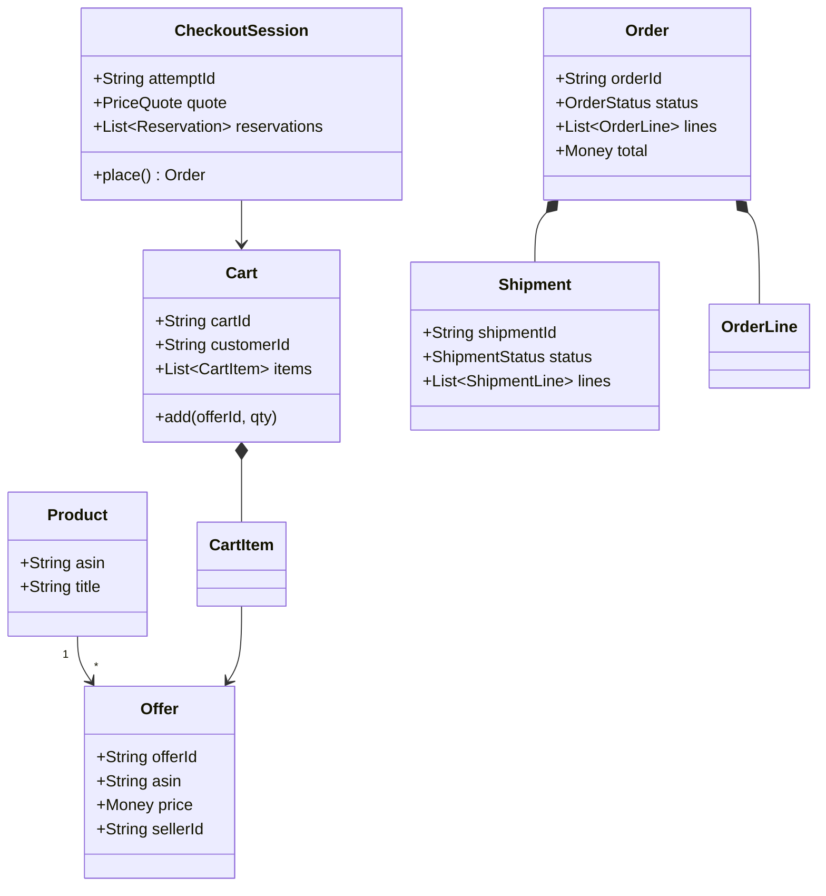

# LLD / OOD: Online Store Object Model

> **Focus areas:** Customer · Catalog · Cart · Order · Payment · Inventory reservation · Shipments · Returns · Class relationships · State machines · Concurrency · Extensibility  
> **Style:** Object-oriented interview design (clarify → NFRs → cases → classes → APIs → state machines → concurrency → extensibility → deep dive → wrap-up → Q&A)  
> **Quality bar:** Clear aggregate boundaries, money-safe checkout, inventory reservation, no God-objects; link to HLD online-store without rehashing only scale  
> **Interview theme:** Amazon SDE III / L6 — **ecommerce domain model**; classic OOD with Amazon retail flavor (ASINs, promises)

---

## Table of Contents

1. [Clarify Requirements (Interview Q&A)](#1-clarify-requirements-interview-qa)
2. [Non-Functional Requirements](#2-non-functional-requirements)
3. [Cases](#3-cases)
4. [Object Model & Class Diagrams](#4-object-model--class-diagrams)
5. [Public APIs / Interfaces](#5-public-apis--interfaces)
6. [State Machines](#6-state-machines)
7. [Concurrency & Consistency](#7-concurrency--consistency)
8. [Extensibility](#8-extensibility)
9. [Design Deep Dive](#9-design-deep-dive)
10. [Wrap-Up](#10-wrap-up)
11. [Deeper / Related Interview Questions](#11-deeper--related-interview-questions)
12. [Appendices](#12-appendices)

---

## 1. Clarify Requirements (Interview Q&A)

Goal: design the **core object model** for an online store—browse catalog, cart, checkout, pay, reserve inventory, create order, ship, return—emphasizing aggregates and invariants. Full Amazon.com traffic HLD is the sibling doc; here we own the domain skeleton.

### 1.0 What this is / is not

| Dimension | This | Not |
|-----------|------|-----|
| Job | Domain LLD / OOD | Only CDN/search scale story |
| Catalog | Product/ASIN/Offer | Full A9 search ranking |
| Inventory | Reservation API | Multi-FC WMS internals |
| Amazon lens | Promise, correctness, ownership | UML decoration only |

### 1.1 Clarifying questions

| # | Question | Typical answer | Implication |
|---|----------|----------------|-------------|
| F1 | Marketplace? | Single retailer MVP; mention 3P offers | `Offer` vs `Product` |
| F2 | Cart? | Durable per user + guest | `Cart` aggregate |
| F3 | Inventory? | Soft reserve at checkout | `InventoryPort` |
| F4 | Payments? | Auth+capture port | PCI out |
| F5 | Shipments? | Split shipments OK | `Shipment` entity |
| F6 | Returns? | RMA MVP | `ReturnRequest` |
| F7 | Pricing? | Offer price + tax + shipping + promo hook | Quote snapshot |
| F8 | Addresses? | Book of addresses | `Address` VO |
| F9 | Idempotency? | Checkout attempt id | Required |
| F10 | Currency? | Single MVP; multi later | `Money` |
| F11 | Subscriptions? | Out of MVP | — |
| F12 | Digital goods? | Optional type | `FulfillmentType` |

**MVP scope:**

1. Product catalog with offers (price, seller).  
2. Cart add/update/remove.  
3. Checkout quote → reserve inventory → pay → create Order.  
4. Order line states; shipment create; deliver.  
5. Cancel/return paths.  
6. Clear aggregate boundaries + repositories.

**Out of MVP:** recommendations ML, Prime membership platform, full multi-marketplace tax graphs.

### 1.2 Scope repeat-back

> Ecommerce domain with Product/Offer, Cart, Checkout session, Order/Shipment/Return aggregates, inventory reservation and payment ports, deterministic money snapshots, and extensibility for marketplace offers—without turning the interview into only Kafka diagrams.

---

## 2. Non-Functional Requirements

| # | NFR | Target |
|---|-----|--------|
| N1 | Checkout correctness | No oversell; no double charge |
| N2 | Quote latency | p99 < 100–200ms local services |
| N3 | Cart availability | High; eventual OK for browse merge |
| N4 | Audit | Order + payment + inventory events |
| N5 | Idempotency | Checkout/payment safe retries |
| N6 | Consistency | Strong on order create + reserve |
| N7 | Extensibility | New line types / fulfillments |
| N8 | Observability | Conversion funnel + reserve fail |

### 2.1 Progressive scale (domain impact)

| Scale | Object-model impact |
|-------|---------------------|
| Base | Modular monolith packages |
| 10× | Split catalog read vs checkout write |
| 100× | Order cell by id; inventory regional |
| 1,000× | Marketplace offer explosion; still same aggregates |

---

## 3. Cases

### 3.1 Happy

1. Add ASIN to cart → checkout quote → reserve → pay → order PLACED → ship → deliver.  
2. Split shipment: two FCs → two `Shipment`s.  
3. Promo code applies via promo port; breakdown stored.  
4. Cancel unshipped line → release reserve / refund.  
5. Return delivered item → RMA → refund.

### 3.2 Edge / failure

| Case | Behavior |
|------|----------|
| Stock gone at reserve | Fail line / whole checkout policy |
| Pay fail after reserve | Release reserve; no order (or PENDING_PAY expire) |
| Double checkout submit | Idempotent same orderId |
| Price change after quote | Reprice or pin TTL |
| Address invalid | Reject |
| Partial capture | Document; usually auth full |
| Return after window | Reject |
| Guest cart merge on login | Merge rules (max qty) |

### 3.3 Invariants

```text
I1: Order money fields immutable snapshots after place
I2: Reserved qty released XOR consumed on ship/cancel
I3: sum(shipment qtys) ≤ ordered qty per line
I4: Refunds ≤ captured − prior refunds
I5: Cart qty ≥ 0; offerId must be active at add (soft)
```

---

## 4. Object Model & Class Diagrams

### 4.1 Aggregates (DDD-lite)

| Aggregate | Root | Contains |
|-----------|------|----------|
| Catalog | `Product` | attributes; points to offers |
| Offer | `Offer` | price, seller, condition |
| Cart | `Cart` | `CartItem`s |
| Checkout | `CheckoutSession` | quote, reserves, attempt |
| Order | `Order` | `OrderLine`s, payments refs, shipments |
| Return | `ReturnRequest` | lines, refunds |

Don't make one `Store` god-object mutate everything.

### 4.2 Core classes

| Class | Responsibility |
|-------|----------------|
| `Product` | ASIN identity, title, attrs |
| `Offer` | Sellable price+seller+inventory ref |
| `Customer` | Id, profile refs |
| `Address` | VO |
| `Cart` / `CartItem` | Mutable selection |
| `Money` | Currency + amount cents |
| `PriceQuote` | Line totals, tax, ship, promos |
| `CheckoutSession` | Attempt lifecycle |
| `InventoryReservation` | Hold ids |
| `Order` / `OrderLine` | Placed purchase |
| `Payment` | Auth/capture ids |
| `Shipment` / `ShipmentLine` | Fulfillment unit |
| `ReturnRequest` | RMA |
| `OrderService` / `CartService` | App services |

### 4.3 Class diagram



### 4.4 Money VO

```java
public final class Money {
  private final String currency; // USD
  private final long cents;
  public Money plus(Money o) { ... }
  public Money minus(Money o) { ... }
  // no floats
}
```

### 4.5 Package layout

```text
store/
  catalog/    Product, Offer, CatalogService
  cart/       Cart, CartService
  checkout/   CheckoutSession, QuoteService
  order/      Order, OrderLine, OrderService
  fulfill/    Shipment, FulfillmentService
  return/     ReturnRequest
  payment/    PaymentPort
  inventory/  InventoryPort
  promo/      PromoPort
  common/     Money, Address
```

---

## 5. Public APIs / Interfaces

### 5.1 Cart

```text
addItem(cartId, offerId, qty)
updateQty(cartId, offerId, qty)
removeItem(cartId, offerId)
getCart(cartId) → CartView
merge(guestCartId, userCartId)
```

### 5.2 Checkout

```text
startCheckout(cartId, attemptId, addressId, options) → Quote
placeOrder(attemptId, paymentMethodId) → Order
abandon(attemptId)
```

### 5.3 Inventory port

```java
interface InventoryPort {
  Reservation reserve(offerId, qty, attemptId, ttl);
  void commit(reservationId, orderId);
  void release(reservationId);
}
```

### 5.4 Payment port

```java
interface PaymentPort {
  PaymentResult authorize(attemptId, Money amount, method);
  void capture(paymentId, Money amount);
  void voidAuth(paymentId);
  void refund(paymentId, Money amount, rmaId);
}
```

### 5.5 Order queries

```text
getOrder(orderId)
listOrders(customerId)
cancelLine(orderId, lineId, reason)
```

---

## 6. State Machines

### 6.1 CheckoutSession

```text
STARTED → QUOTED → RESERVED → AUTHORIZED → PLACED
RESERVED → EXPIRED → (release)
AUTHORIZED → VOIDED on failure before place
* → ABANDONED
```

### 6.2 Order

```text
PLACED → PROCESSING → PARTIALLY_SHIPPED → SHIPPED → DELIVERED
PLACED → CANCELLED
DELIVERED → RETURN_IN_PROGRESS → CLOSED
```

### 6.3 OrderLine

```text
PLACED → ALLOCATED → SHIPPED → DELIVERED
PLACED → CANCELLED
DELIVERED → RETURNED
```

### 6.4 Shipment

```text
CREATED → DISPATCHED → IN_TRANSIT → DELIVERED
CREATED → CANCELLED
```

### 6.5 Reservation

```text
HELD → COMMITTED | RELEASED | EXPIRED
```

---

## 7. Concurrency & Consistency

### 7.1 Oversell race

Two checkouts last unit → inventory service atomic reserve; one fails.

### 7.2 Double place

`attemptId` unique → same `orderId` returned.

### 7.3 Cart concurrency

Per-cart optimistic version / row lock on update.

### 7.4 Saga-style checkout (in-proc)

```text
quote → reserve → auth → create order → commit reserve → capture (or capture on ship—policy)
on fail: compensating release/void
```

Document capture-on-ship vs capture-on-place.

### 7.5 Read models

Catalog browse can be eventually consistent; checkout reads authoritative offer price + inventory.

---

## 8. Extensibility

| Extension | Hook |
|-----------|------|
| 3P marketplace | Multiple offers per ASIN; pick offerId |
| Digital good | `FulfillmentType.DIGITAL` no shipment |
| Preorder | Line flag; reserve later |
| Subscription | Separate aggregate |
| Promo stacking | PromoPort + coupon LLD |
| Multi-currency | Money currency + FX port |
| Gift wrap | Line addon component |

Aggregates stable; policies/strategies vary.

---

## 9. Design Deep Dive

### 9.1 Product vs Offer (Amazon-flavored)

```text
Product (ASIN): what it is
Offer: who sells at what price/condition/stock
Cart holds offerId (not just ASIN) for marketplace correctness
```

Single-retailer MVP: one default offer per ASIN still modeled as Offer.

### 9.2 Quote snapshot

```text
PriceQuote {
  lines: [{offerId, qty, unitPrice, discounts, tax, lineTotal}]
  shipping
  grandTotal
  catalogPriceVersion / offerVersions
  expiresAt
}
```

Order persists snapshot—not live joins to mutable offers.

### 9.3 Checkout sequence

```text
1. Validate cart items still buyable
2. Build quote (promo+tax+ship)
3. Reserve inventory (attemptId idempotent)
4. Authorize payment for grandTotal
5. Persist Order PLACED + lines
6. Commit reservations to orderId
7. Enqueue fulfillment
8. Capture policy
```

Compensations on any failure after reserve/auth.

### 9.4 Split fulfillment

Fulfillment service decides FC allocation → N shipments. Domain allows `Order` 1—* `Shipment`.

### 9.5 Returns

```text
ReturnRequest creates refundable qty checks against delivered − returned
Approve → refund payment port → restock optional
```

### 9.6 Deal-breakers

- Cart stores only ASIN without offer in marketplace  
- Mutable order totals after place  
- Inventory decrement without reservation id  
- Payment capture without idempotency  
- God-class `OnlineStore` with 200 methods  

### 9.7 Testing

| Test | Assert |
|------|--------|
| Reserve conflict | One winner |
| Idempotent place | One order |
| Compensate pay fail | Reserve released |
| Quote expiry | Place rejects |
| Return qty | Caps |

### 9.8 Observability

Metrics: `reserve_fail`, `checkout_place_success`, `auth_fail`, `cancel_rate`, `return_rate`.  
Trace `attemptId` across services.

### 9.9 Guest cart merge

```text
for item in guest:
  userCart.add with qty merge min(maxQty, sum)
expire guest
```

### 9.10 Relation to HLD

HLD (`online-store-system-design.md`) covers edge, search, scale cells. This doc is the **domain object model** you still need at L6.

---

## 10. Wrap-Up

### 10.1 60-second narrative

"We separate **Product/Offer**, **Cart**, **CheckoutSession**, and **Order/Shipment/Return** aggregates. Checkout is an idempotent saga: quote → reserve → auth → place → commit. Money is snapshot cents; inventory holds are first-class; payments are ports. Marketplace-ready by carting `offerId`. No god-object—services per aggregate with clear invariants."

### 10.2 Cheat sheet

| Topic | Answer |
|-------|--------|
| Sellable | Offer |
| Cart | Mutable aggregate |
| Checkout | attemptId saga |
| Order | Immutable money snapshot |
| Inventory | Reserve/commit/release |
| Kill | God store; no idempotency |

---

## 11. Deeper / Related Interview Questions

**Q: Cart in Redis or DB?**  
A: Either; domain same; mention durability for logged-in.

**Q: Why Offer not just Product.price?**  
A: Marketplace / conditions / sellers.

**Q: Capture on ship vs place?**  
A: Risk vs cashflow; state policy explicitly.

**Q: Soft vs hard inventory?**  
A: Reserve is hard hold with TTL; browse ATP soft.

**Q: Order id generation?**  
A: ULID/snowflake; don't use cart id.

**Q: Tax engine?**  
A: Port; snapshot tax lines.

**Q: Cancel after allocate?**  
A: Release allocation; may fee—policy.

**Q: Multi-item atomic checkout?**  
A: All-or-nothing MVP; partial success optional advanced.

**Q: Exactly-once payment?**  
A: attemptId as idempotency key to processor.

**Q: First metric?**  
A: Place success + reserve fail reasons.

**Q: Returns restock?**  
A: Optional inventory credit; grading.

**Q: How model Kindle digital?**  
A: Digital fulfillment grant; no shipment.

**Q: Congestion at checkout?**  
A: Scale inventory/payment; domain saga unchanged.

**Q: Domain event?**  
A: `OrderPlaced`, `ShipmentDispatched` for downstream.

**Q: L6 signal?**  
A: Aggregates + invariants + compensations named early.

---

## 12. Appendices

### A. CartItem

```java
record CartItem(String offerId, String asin, int qty, Instant addedAt) {}
```

### B. OrderLine snapshot

```java
class OrderLine {
  String lineId;
  String offerId;
  String asin;
  int qty;
  Money unitPrice;
  Money lineTotal;
  OrderLineStatus status;
}
```

### C. Checkout compensations

```text
fail after reserve before auth → release
fail after auth before persist → void + release
fail after persist before commit reserve → reconcile job (order exists; commit retry)
```

### D. Flashcards

| Card | Point |
|------|-------|
| ASIN vs Offer | What vs sellable |
| Snapshot | Order money |
| Saga | Quote-reserve-auth-place |
| Idempotency | attemptId |
| Shipment | Split OK |
| Kill | God object |

### E. Sequence diagram (text)

```text
Client → CartService.add
Client → Checkout.start
Checkout → Promo/Tax/Ship quote
Checkout → Inventory.reserve
Checkout → Payment.authorize
Checkout → OrderRepo.save
Checkout → Inventory.commit
Checkout → Fulfillment.enqueue
```

### F. Alternatives to kill

| Alt | Why kill |
|-----|----------|
| Single mutable Order for cart too | Confuses states |
| Decrement stock on add-to-cart | Horrible UX/oversell |
| Float dollars | Rounding |
| Client-trusted totals | Fraud |
| Anemic Order + all logic in UI | No invariants |

### G. Runbooks

**R1 — Reserve leak (TTL):** Expirer releases; metric held_too_long.  
**R2 — Auth without order:** Void sweeper.  
**R3 — Oversell page:** Inventory bug; freeze offer.

### H. Interview timebox

| Min | Focus |
|-----|-------|
| 0–5 | Scope MVP vs marketplace |
| 5–15 | Aggregates diagram |
| 15–30 | Checkout saga + SM |
| 30–40 | Inventory/payment races |
| 40–50 | Returns + extensibility |
| 50–60 | HLD boundary + metrics |

### I. Glossary

| Term | Meaning |
|------|---------|
| ASIN | Product identity |
| Offer | Sellable instance |
| ATP | Available to promise |
| RMA | Return auth |
| Attempt | Checkout idempotency id |
| Snapshot | Persisted price/tax |

### J. Related files

- `online-store-system-design.md` (HLD)  
- `shopping-cart-system-design.md`  
- `inventory-management-system-system-design.md`  
- `coupon-class-hierarchy-lld-system-design.md`  
- `customer-order-product-database-system-design.md` |

### K. Status enums (compact)

```text
Order: PLACED PROCESSING PARTIALLY_SHIPPED SHIPPED DELIVERED CANCELLED
Reservation: HELD COMMITTED RELEASED EXPIRED
Payment: AUTHORIZED CAPTURED VOIDED REFUNDED
```

### L. Merge policy example

```text
maxQtyPerOffer = 10
merge qty = min(maxQty, userQty+guestQty)
```

### M. Domain events list

```text
CartItemAdded
CheckoutStarted
InventoryReserved
PaymentAuthorized
OrderPlaced
ShipmentCreated
ShipmentDelivered
ReturnApproved
RefundIssued
```

### N. Final checklist

- [ ] Product/Offer split  
- [ ] Cart aggregate  
- [ ] Checkout attempt saga  
- [ ] Order snapshot money  
- [ ] Reservation lifecycle  
- [ ] Shipment/return  
- [ ] Idempotency  
- [ ] Ports pay/inv/promo  
- [ ] No god-object  
- [ ] HLD boundary clear  

---

## Extra Depth: Aggregate Transaction Rules

| Aggregate | Transaction boundary |
|-----------|----------------------|
| Cart | Soft; single cart row/version |
| CheckoutSession | Strong for place |
| Order | Strong create; later updates per line SM |
| Inventory | External aggregate via port |
| Payment | External |

Never update Order totals from Cart after place.

---

## Extra Depth: Worked Checkout Numbers

```text
Line: offer A qty 2 @ $10.00 → $20.00
Promo -$2.00
Ship $5.00
Tax $1.84
Grand $24.84 (= 2484 cents)
Authorize 2484
Reserve A×2
```

Store cents on every money field.

---

## Extra Depth: Partial Availability Policy

**All-or-nothing:** if any line can't reserve → fail checkout.  
**Partial:** drop failed lines with UX confirm—harder; ask interviewer.

MVP: all-or-nothing.

---

## Extra Depth: Fulfillment Allocation Hook

```java
interface AllocationPort {
  List<Allocation> allocate(Order order);
  // returns FC + qty per line
}
```

Order domain doesn't hardcode FC logic.

---

## Extra Depth: Cancel Line Compensations

```text
if line unshipped:
  status=CANCELLED
  inventory.release remaining
  payment.refund line share (tax/ship recompute policy!)
```

Shipping fee refund rules—call out complexity; simplify in MVP.

---

## Extended Rapid Q&A II

**Q: Where put wish list?**  
A: Separate aggregate; not cart.

**Q: Save for later?**  
A: CartItem flag or other list.

**Q: Order edit after place?**  
A: Generally cancel+reorder; exceptions rare.

**Q: Idempotency store TTL?**  
A: Days; retain mapping attempt→orderId.

**Q: Catalog CQRS?**  
A: Fine; Offer write model authoritative for price at checkout.

**Q: Soft delete product?**  
A: Yes; historical orders keep snapshots.

**Q: Chargeback?**  
A: Payment ops; order dispute state optional.

**Q: Bundle ASINs?**  
A: Parent offer expands to component lines at place.

**Q: Why attemptId not only payment intent id?**  
A: Covers reserve+place before pay processor id exists; can equal.

**Q: Amazon bar?**  
A: Promise-safe inventory; explainable orders; own saga failures.

---

## Extra Depth: Minimal ER Sketch

```text
customers(id)
products(asin, title)
offers(offer_id, asin, seller_id, price_cents, currency)
carts(cart_id, customer_id, version)
cart_items(cart_id, offer_id, qty)
checkout_attempts(attempt_id PK, cart_id, status, quote_json)
reservations(id, attempt_id, offer_id, qty, status)
orders(order_id, customer_id, attempt_id UNIQUE, total_cents, status)
order_lines(line_id, order_id, offer_id, qty, unit_cents, status)
shipments(shipment_id, order_id, status)
shipment_lines(...)
returns(rma_id, order_id, status)
```

---

## Extra Depth: Anti-Corruption Ports

```text
PaymentPort, InventoryPort, TaxPort, PromoPort, AllocationPort, NotificationPort
```

Domain never imports Stripe/Braintree SDK types into Order entity.

---

## Closing Cheat Sheet (Extended)

| Topic | Answer |
|-------|--------|
| Identity | ASIN product / offer sellable |
| Cart | Versioned mutable |
| Place | Idempotent saga |
| Money | Snapshotted cents |
| Stock | Reserve TTL |
| Fulfill | Shipments 1..N |
| Return | RMA + refund ≤ captured |
| Kill | Mutable totals; god store; ASIN-only cart in 3P |

---

## Final Interview Checklist (Print)

- [ ] Clarified marketplace vs single seller  
- [ ] Drew aggregates not one blob  
- [ ] Product vs Offer  
- [ ] Checkout sequence with compensations  
- [ ] Reservation states  
- [ ] Order/line/shipment SMs  
- [ ] Idempotency  
- [ ] Money VO  
- [ ] Return path  
- [ ] Metrics + deal-breakers  
- [ ] Pointed to HLD for scale-only topics  

---

*End of Online Store Object Model LLD/OOD notes (Amazon SDE III prep).*
