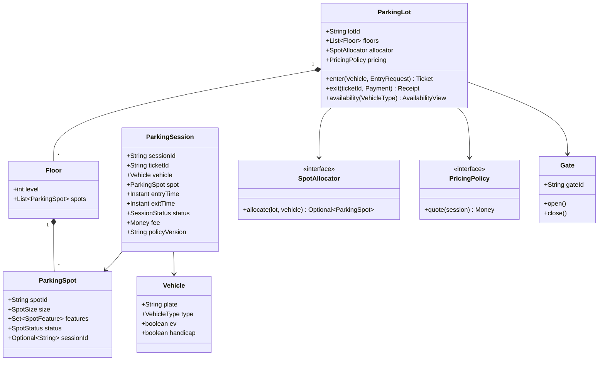

# LLD / OOD: Parking Lot System

> **Focus areas:** Spot allocation · Vehicle typing · Ticketing · Pricing · Entry/exit gates · Concurrency · Multi-floor / multi-lot · Extensibility  
> **Style:** Object-oriented interview design (clarify → NFRs → cases → classes → APIs → state machines → concurrency → extensibility → deep dive → wrap-up → Q&A)  
> **Quality bar:** Correct assignment under race, clear money rules, pluggable pricing/spot strategies, no silent oversell of spots  
> **Interview theme:** Amazon SDE III / L6 — **classic LLD** often paired with parking-payment HLD; show clean OOP + operational thinking

---

## Table of Contents

1. [Clarify Requirements (Interview Q&A)](#1-clarify-requirements-interview-qa)
2. [Non-Functional Requirements](#2-non-functional-requirements)
3. [Cases](#3-cases)
4. [Object Model & Class Diagrams](#4-object-model--class-diagrams)
5. [Public APIs / Interfaces](#5-public-apis--interfaces)
6. [State Machines](#6-state-machines)
7. [Concurrency & Consistency](#7-concurrency--consistency)
8. [Extensibility](#8-extensibility)
9. [Design Deep Dive](#9-design-deep-dive)
10. [Wrap-Up](#10-wrap-up)
11. [Deeper / Related Interview Questions](#11-deeper--related-interview-questions)
12. [Appendices](#12-appendices)

---

## 1. Clarify Requirements (Interview Q&A)

Goal: design an **object model and control software** for a parking lot—vehicles enter, get assigned a spot (or self-park with guidance), pay by policy, and exit—correct under concurrent gates and evolving pricing rules.

### 1.0 What this is / is not

| Dimension | This doc | Not this |
|-----------|----------|----------|
| Job | LLD/OOD of lot + ticketing + allocation | Full city parking marketplace HLD |
| Money | Fee calculation + session ledger hooks | PCI payment processor internals |
| Hardware | Gate/sensor abstractions | PLC wiring diagrams |
| Amazon lens | Reliability, ownership, frugality, customer trust | Academic UML-only exercise |

### 1.1 Clarifying questions (ask aloud)

| # | Question | Typical answer | Implication |
|---|----------|----------------|-------------|
| F1 | Levels / floors? | Multi-floor, multiple spots per floor | Floor → Spot hierarchy |
| F2 | Vehicle types? | Motorcycle, car, bus/truck | Spot size compatibility matrix |
| F3 | Assignment? | System assigns nearest suitable spot | Strategy: `SpotAllocator` |
| F4 | Ticket? | Paper/QR with ticketId + entry time | `ParkingSession` entity |
| F5 | Pricing? | Hourly by vehicle type; daily max | Strategy: `PricingPolicy` |
| F6 | Payment? | Pay at exit or app; unpaid blocks exit | Gate interlock with payment status |
| F7 | Reserved / EV / handicap? | Yes, constrained spots | Spot attributes + eligibility |
| F8 | Multiple lots? | Optional campus of lots | `ParkingLot` under `ParkingComplex` |
| F9 | Display boards? | Free spots count by type | Projection from spot state |
| F10 | Overstay / lost ticket? | Flat fee / max daily | Exception pricing path |
| F11 | Entry without space? | Reject at gate | Atomic capacity check |
| F12 | Concurrent gates? | Multiple entry/exit | Locking / CAS on spots |

**MVP scope:**

1. Multi-floor lot with typed spots.  
2. Enter → create session → allocate spot → issue ticket.  
3. Exit → compute fee → mark paid → free spot.  
4. Query availability by vehicle type.  
5. Pluggable pricing (hourly + daily cap).  
6. Thread-safe allocation under concurrent entries.

**Out of MVP:** dynamic surge pricing marketplace, ANPR ML pipeline, valet orchestration fleet, blockchain tickets.

### 1.2 Scope repeat-back

> Multi-floor parking lot with typed spots, concurrent-safe allocation, session/ticket lifecycle, pluggable pricing, and gate APIs—extensible to EV/handicap/reserved and multi-lot campuses without rewriting core.

---

## 2. Non-Functional Requirements

| # | NFR | Target | Why |
|---|-----|--------|-----|
| N1 | Allocation latency | p99 < 50ms in-process; < 200ms if DB | Gate UX |
| N2 | Correctness | Never double-assign same spot | Safety + trust |
| N3 | Availability | Degrade to “lot full” rather than wrong assign | Fail closed |
| N4 | Audit | Every enter/exit/pay explainable | Disputes |
| N5 | Extensibility | New vehicle/spot/pricing without core rewrite | Interview signal |
| N6 | Observability | Free counts, allocation conflicts, exit failures | Ops |
| N7 | Durability | Sessions survive process restart | Money |
| N8 | Scale (single lot) | Hundreds of spots, tens of concurrent gates | Realistic |

### 2.1 Progressive scale (object-system view)

| Metric | Base | 10× | 100× |
|--------|------|-----|------|
| Spots | 500 | 5K (campus) | 50K (city chain) |
| Concurrent gate ops | 10 | 100 | 1K |
| Sessions/day | 2K | 20K | 200K |
| Design shift | In-memory + DB | Partition by lot | Lot cells + central billing |

---

## 3. Cases

### 3.1 Happy paths

1. Car enters → spot allocated on floor 2 → ticket issued → parks → pays hourly → exits → spot FREE.  
2. Motorcycle takes motorcycle spot preferentially; car spot only if policy allows.  
3. EV reserved for EV when battery spots exist; display updates free EV count.  
4. Daily cap: 10h park charges max daily, not 10× hourly.  
5. Handicap plate → only handicap-eligible spots.

### 3.2 Edge / failure cases

| Case | Behavior |
|------|----------|
| Lot full for vehicle type | Entry rejected; no ticket |
| Two cars race last spot | One wins CAS/lock; other rejected or reallocated |
| Lost ticket | Lookup by plate / max fee path |
| Payment fail | Gate stays closed; session OPEN/UNPAID |
| Spot sensor says occupied but system FREE | Reconciliation job / attendant override |
| Exit without entry record | Reject or create dispute session |
| Power blip mid-allocate | Idempotent entry request by `entryAttemptId` |
| Oversize vehicle | No compatible spot → reject |
| Reserved pin misuse | Authz on reservation token |
| Double exit scan | Idempotent close |

### 3.3 Invariants

```text
I1: Spot.status == OCCUPIED iff exactly one active session references it
I2: Session cannot EXIT_SUCCESS without terminal payment state (or waive)
I3: freeCount(type) == count(spots compatible & FREE)  (eventual OK for display; strong for allocate)
I4: Fee(session) deterministic given policyVersion + timestamps
```

---

## 4. Object Model & Class Diagrams

### 4.1 Core entities

| Class | Responsibility |
|-------|----------------|
| `ParkingComplex` | Optional multi-lot root |
| `ParkingLot` | Floors, gates, policies, allocator |
| `Floor` | Spots on a level; floor-level free indexes |
| `ParkingSpot` | Size, features, status, optional reservation |
| `Vehicle` | Plate, type, EV/handicap flags |
| `ParkingTicket` / `ParkingSession` | Lifecycle from entry to exit |
| `Gate` / `EntryGate` / `ExitGate` | Hardware façade |
| `SpotAllocator` | Chooses spot (strategy) |
| `PricingPolicy` | Computes fee |
| `PaymentService` | Charge + receipt (port) |
| `AvailabilityBoard` | Read model for free counts |
| `ParkingLotService` | Application façade / use cases |

### 4.2 Enums

```text
VehicleType: MOTORCYCLE | CAR | BUS
SpotSize: SMALL | MEDIUM | LARGE
SpotFeature: EV_CHARGER | HANDICAP | RESERVED | STANDARD
SpotStatus: FREE | RESERVED | OCCUPIED | OUT_OF_SERVICE
SessionStatus: CREATED | ACTIVE | PAYMENT_PENDING | PAID | CLOSED | DISPUTED
GateType: ENTRY | EXIT
```

### 4.3 Compatibility rules

```text
MOTORCYCLE → SMALL, MEDIUM, LARGE (prefer SMALL)
CAR        → MEDIUM, LARGE
BUS        → LARGE only
EV flag    → prefer EV_CHARGER if available (policy)
HANDICAP   → must use HANDICAP feature spots
```

Encode as `SpotCompatibility.isCompatible(vehicle, spot)`.

### 4.4 Class diagram (Mermaid)



### 4.5 Suggested package layout

```text
parking/
  domain/          Vehicle, Spot, Session, enums
  allocation/      SpotAllocator, NearestSpotAllocator, ...
  pricing/         HourlyWithCapPolicy, FlatRatePolicy
  gates/           EntryGateController, ExitGateController
  app/             ParkingLotService
  ports/           PaymentPort, Clock, SessionRepository, SpotRepository
  infra/           InMemory*, Jdbc*
```

### 4.6 Sketch: Spot

```java
public final class ParkingSpot {
  private final String spotId;
  private final SpotSize size;
  private final Set<SpotFeature> features;
  private final AtomicReference<SpotState> state; // status + sessionId

  boolean tryOccupy(String sessionId) { /* CAS FREE→OCCUPIED */ }
  boolean tryRelease(String sessionId) { /* CAS OCCUPIED→FREE if same session */ }
}
```

### 4.7 Sketch: Session

```java
public final class ParkingSession {
  private final String sessionId;
  private final String ticketId;
  private final Vehicle vehicle;
  private final String spotId;
  private final Instant entryTime;
  private final String policyVersion;
  private SessionStatus status;
  private Instant exitTime;
  private Money fee;
}
```

---

## 5. Public APIs / Interfaces

### 5.1 Application service

```text
enter(entryAttemptId, lotId, gateId, Vehicle) → EnterResult{ticketId, spotId, floor}
exit(exitAttemptId, ticketId, PaymentMethod) → ExitResult{fee, receiptId}
quote(ticketId) → Money
availability(lotId, VehicleType?) → AvailabilityView
markSpotOos(spotId, reason) → void
overrideRelease(spotId, attendantId, reason) → void
```

### 5.2 Allocator interface

```java
public interface SpotAllocator {
  Optional<ParkingSpot> allocate(AllocationContext ctx, Vehicle vehicle);
}
```

`AllocationContext` exposes indexed free spots, floor distances from gate, policies (EV preference).

### 5.3 Pricing interface

```java
public interface PricingPolicy {
  String version();
  Money calculate(PricingInput in); // entry, exit, vehicleType, features used
}
```

### 5.4 Repository ports

```java
interface SpotRepository {
  Optional<ParkingSpot> findForUpdate(String spotId);
  List<ParkingSpot> findFreeCompatible(Vehicle v);
  void save(ParkingSpot spot);
}
interface SessionRepository {
  void save(ParkingSession s);
  Optional<ParkingSession> findByTicketId(String ticketId);
  Optional<ParkingSession> findActiveByPlate(String plate);
}
```

### 5.5 Gate port

```java
interface GateActuator {
  void open(String gateId);
  void close(String gateId);
}
```

### 5.6 REST-ish shape (if asked)

```text
POST /lots/{lotId}/entries     {entryAttemptId, gateId, vehicle}
POST /lots/{lotId}/exits       {exitAttemptId, ticketId, payment}
GET  /lots/{lotId}/availability
GET  /tickets/{ticketId}/quote
```

Idempotency keys: `entryAttemptId`, `exitAttemptId`.

---

## 6. State Machines

### 6.1 Spot status

```text
FREE → OCCUPIED          (successful allocate + occupy)
FREE → RESERVED          (hold for reservation / prepaid)
RESERVED → OCCUPIED      (arrival match)
RESERVED → FREE          (hold TTL expire)
OCCUPIED → FREE          (exit release)
* → OUT_OF_SERVICE       (maintenance)
OUT_OF_SERVICE → FREE    (clear)
```

Illegal: FREE→FREE occupy without CAS; OCCUPIED by session A released by B.

### 6.2 Session status

```text
CREATED → ACTIVE           (spot occupied, ticket issued)
ACTIVE → PAYMENT_PENDING   (exit requested)
PAYMENT_PENDING → PAID     (charge success)
PAID → CLOSED              (gate open + spot released)
ACTIVE → DISPUTED          (lost ticket / sensor mismatch)
PAYMENT_PENDING → ACTIVE   (payment fail; stay parked)
DISPUTED → CLOSED          (attendant resolve)
```

### 6.3 Entry sequence

```text
1. Validate lot accepting entries
2. Idempotency lookup entryAttemptId
3. Find candidate spots (compatible + FREE)
4. Try occupy with CAS (loop limited)
5. Persist session ACTIVE
6. Open entry gate
7. Publish availability delta
```

### 6.4 Exit sequence

```text
1. Load session by ticketId
2. Idempotency exitAttemptId
3. Quote fee with pinned policyVersion from entry (or policy at exit—clarify!)
4. PaymentPort.charge
5. Mark PAID → release spot → CLOSED
6. Open exit gate
```

**Interview tip:** Pin `policyVersion` at entry *or* document “price at exit” explicitly—Amazon cares about deterministic money.

---

## 7. Concurrency & Consistency

### 7.1 The race

Two entries, one FREE spot → both read FREE → both assign → **double park**.

### 7.2 Solutions (pick one, justify)

| Approach | Pros | Cons |
|----------|------|------|
| Per-spot CAS / version | Simple, fast | Retry loops |
| DB row lock `SELECT FOR UPDATE` | Clear | Latency |
| Lot-level lock | Easy correctness | Gate throughput dies |
| Partition free-lists per floor + CAS | Scales | Cross-floor steal complexity |

**Recommended interview answer:** maintain free-index + **atomic occupy on spot**; retry allocate on CAS fail; never hold lot-global lock across payment.

### 7.3 Idempotency

```text
enter(entryAttemptId): store mapping attempt→ticket; retries return same ticket
exit(exitAttemptId): store attempt→receipt
```

### 7.4 Display consistency

Availability board can be **eventually** consistent (+/-1 briefly). Allocation path uses strong spot state.

### 7.5 Restart

Spots + sessions in durable store; on boot rebuild free indexes from spot rows. In-memory-only is OK for pure whiteboard if you call out restart gap.

---

## 8. Extensibility

### 8.1 Strategies

| Variation | Hook |
|-----------|------|
| Nearest to gate | `NearestSpotAllocator` |
| Fill floor-by-floor | `FloorFillAllocator` |
| EV prefer charger | Decorator / filter chain |
| Hourly + daily cap | `HourlyWithDailyCapPolicy` |
| Flat event rate | `FlatRatePolicy` |
| Subscription monthly | `SubscriptionPolicy` checks membership port |

### 8.2 Open/Closed

Adding `VehicleType.VAN` should touch: enum, compatibility matrix, maybe pricing table—not `ParkingLotService` control flow.

### 8.3 Multi-lot campus

```text
ParkingComplex
  lots: Map<lotId, ParkingLot>
  router: chooses lot by availability / permit
```

Billing may centralize; allocation stays per lot (cell).

### 8.4 Reservation holds

```text
reserve(spotId|criteria, holdTtl) → reservationId
enter with reservationToken → occupy reserved spot
```

TTL job returns RESERVED→FREE.

---

## 9. Design Deep Dive

### 9.1 Allocation algorithm (nearest)

```text
candidates = index.freeCompatible(vehicle)
sort by distance(gateFloor, spot) then spotId
for c in candidates:
  if c.tryOccupy(sessionId): return c
return empty
```

Distance: Manhattan on (floor, row, aisle) if modeled; else floor delta.

### 9.2 Pricing example

```text
rate = table[vehicleType]           // e.g. CAR $4/hr
raw = ceil(minutes/60) * rate
fee = min(raw, dailyCap[vehicleType])
+ chargingFee if EV_CHARGER used (metered port)
```

Lost ticket: `max(fee, lostTicketFlat)`.

### 9.3 Indexes

```text
freeBySize: EnumMap<SpotSize, NavigableSet<spotId>>
freeEv: Set<spotId>
freeHandicap: Set<spotId>
```

Update indexes only on successful state transitions (same thread/lock as CAS owner or via spot write-through).

### 9.4 Failure modes

| Failure | Mitigation |
|---------|------------|
| Payment timeout | Leave PAYMENT_PENDING; retry; do not release spot |
| Gate open fail after pay | Receipt exists; attendant; do not double charge (idempotent) |
| DB down | Fail closed at entry |
| Clock skew | Inject `Clock`; server time SoT |
| Sensor disagree | Flag DISPUTED; human resolve |

### 9.5 Observability

Metrics: `allocate_success`, `allocate_cas_conflict`, `entry_reject_full`, `exit_payment_fail`, `spots_free{type}`.  
Audit log: session events append-only.

### 9.6 Deal-breakers

- Soft count without atomic occupy  
- Mutable fee without policy version / audit  
- Lot-global lock across network payment  
- Silent overwrite of OCCUPIED sessionId  

### 9.7 Relationship to parking-payment HLD

This LLD is the **lot kernel**. Payment processor, apps, and city-scale are the HLD doc (`parking-payment-system-system-design.md`). Keep boundaries clean: domain emits `SessionClosed(fee)`; billing listens.

### 9.8 Testing strategy

| Test | Assert |
|------|--------|
| Unit compatibility | Matrix cases |
| Concurrent allocate | N threads, 1 spot → 1 winner |
| Pricing golden | Fixed clock vectors |
| Idempotent enter | Same attemptId |
| State machine | Illegal transitions throw |

### 9.9 Memory / data sizing (single lot)

```text
500 spots × ~200B = 100KB state
2K sessions/day × 500B = ~1MB/day hot
Indexes negligible
```

Bottleneck is concurrency correctness, not RAM.

### 9.10 Attendant overrides

Privileged API with reason codes; still write audit. Never “secret backdoor” that skips ledger.

---

## 10. Wrap-Up

### 10.1 60-second narrative

"We model **Lot → Floor → Spot** with typed compatibility. Enter creates a **session**, allocator CAS-occupies a free compatible spot, issues a ticket. Pricing is a **strategy** pinned by version. Exit quotes, charges idempotently, releases the spot. Displays can lag; allocation cannot. Extensibility via allocator/pricing strategies and spot features—EV, handicap, reservations—without rewriting the façade."

### 10.2 What interviewers grade

| Signal | Show |
|--------|------|
| OOP | Clear entities + strategies |
| Concurrency | Name the race + CAS |
| Money | Deterministic fee + audit |
| Boundaries | Ports for payment/gates |
| Extensibility | Open/Closed examples |
| Ownership | Metrics + dispute path |

### 10.3 Closing cheat sheet

| Topic | Answer |
|-------|--------|
| SoT occupancy | Spot atomic state |
| SoT money | Session + policyVersion |
| Race | CAS occupy + retry |
| Full lot | Reject at entry |
| Scale out | Lot cells |
| Kill | Double-assign; fee without audit |

---

## 11. Deeper / Related Interview Questions

**Q: Assign spot vs let driver choose?**  
A: Assignment simplifies capacity & EV rules; chooser needs guided free map + still atomic claim.

**Q: How handle bus that needs two spots?**  
A: Composite spot group entity, or LARGE only—clarify; groups allocate atomically (all-or-nothing).

**Q: Why not SQL transaction only?**  
A: Fine for DB-centric; still show spot version/CAS mentally for in-proc.

**Q: Pricing at entry vs exit?**  
A: Exit-time common; pin rules; grandfather if rates change mid-park.

**Q: How model valet?**  
A: Separate `ValetTicket` + car stack location; spot may be off-site.

**Q: Multi-currency airport lot?**  
A: `Money` + FX policy port; keep domain fee in lot currency.

**Q: Integration with Amazon Go-style camera?**  
A: Plate identity port; session still same; vision is sensor input.

**Q: Surge pricing?**  
A: PricingPolicy reads occupancy fraction; document customer communication.

**Q: How prevent ticket spoofing?**  
A: Signed ticketId / server-side only; QR HMAC.

**Q: First metric on wallboard?**  
A: Free spots by type + gate reject rate + payment fail.

**Q: Difference from hotel room assignment?**  
A: Similar allocator pattern; parking has shorter TTL and gate interlocks.

**Q: Can motorcycle take car spot?**  
A: Policy flag; usually yes with preference order.

**Q: OUT_OF_SERVICE during OCCUPIED?**  
A: Forbid or force DISPUTED release workflow.

**Q: Exactly-once exit?**  
A: Idempotency key + terminal CLOSED state.

**Q: Sharding sessions?**  
A: By lotId; ticketId contains lot prefix.

---

## 12. Appendices

### A. Rapid flashcards

| Card | Point |
|------|-------|
| Hierarchy | Complex → Lot → Floor → Spot |
| Race | Last spot CAS |
| Fee | Strategy + version |
| Gate | Open only after domain success |
| Extensibility | Allocator / Pricing / Features |
| Fail | Closed on uncertainty |

### B. Sample hourly table

| Type | Hourly | Daily cap |
|------|--------|-----------|
| MOTORCYCLE | $2 | $10 |
| CAR | $4 | $25 |
| BUS | $8 | $50 |

### C. Sequence: concurrent entry

```text
T1 allocate spot S
T2 allocate spot S
T1 CAS FREE→OCCUPIED ok
T2 CAS fail → next candidate or FULL
```

### D. Alternatives to kill

| Alt | Why kill |
|-----|----------|
| Soft counter only | Oversell |
| God-class ParkingLotManager | Untestable |
| Price in UI only | Fraud |
| Global synchronized(lot) around pay | Throughput collapse |
| Stringly-typed spot status | Bugs |

### E. Optional SQL sketch

```sql
spots(spot_id PK, lot_id, floor, size, features, status, session_id, version)
sessions(session_id PK, ticket_id UNIQUE, lot_id, spot_id, plate, status,
         entry_ts, exit_ts, fee_cents, policy_version)
idempotency(attempt_id PK, kind, result_json)
```

### F. Code sketch: enter

```java
EnterResult enter(EntryRequest req) {
  return idemstore.run(req.attemptId(), () -> {
    Vehicle v = req.vehicle();
    Optional<ParkingSpot> spot = allocator.allocate(ctx(req.lotId()), v);
    if (spot.isEmpty()) throw new LotFullException();
    ParkingSession s = ParkingSession.start(v, spot.get(), clock.now(), pricing.version());
    sessions.save(s);
    gates.open(req.gateId());
    board.publishDelta(spot.get());
    return EnterResult.of(s);
  });
}
```

### G. Code sketch: pricing

```java
Money calculate(PricingInput in) {
  long minutes = Duration.between(in.entry(), in.exit()).toMinutes();
  long hours = Math.max(1, (minutes + 59) / 60);
  Money raw = rates.get(in.type()).times(hours);
  return Money.min(raw, caps.get(in.type()));
}
```

### H. Scenario runbooks

**R1 — CAS conflict spike:** Check hot spot / index corruption; widen candidate set; metric alarm.  
**R2 — Payment outage:** Queue pay-on-foot; hold exit; communicate.  
**R3 — Sensor mismatch:** Freeze spot OUT_OF_SERVICE; attendant.  
**R4 — Flooded lot + angry queue:** Display accurate FULL; do not soft-admit.

### I. Extensibility quiz answers

1. New spot feature → enum + filter, not service rewrite.  
2. New pricing → new Policy class + register version.  
3. New gate vendor → GateActuator adapter.

### J. Amazon leadership link

**Ownership:** You own double-park incidents.  
**Frugality:** Don't build city marketplace for one lot.  
**Dive deep:** Explain CAS vs lock.  
**Customer obsession:** Clear FULL vs wrong assign.

### K. Minimal UML relationships (text)

```text
ParkingLot 1—* Floor 1—* ParkingSpot
ParkingLot 1—* Gate
ParkingLot 1—1 SpotAllocator
ParkingLot 1—1 PricingPolicy
ParkingSession *—1 Vehicle
ParkingSession *—1 ParkingSpot (while active)
```

### L. Interview timebox (45 min)

| Min | Focus |
|-----|-------|
| 0–5 | Clarify types, floors, pay, concurrency |
| 5–15 | Classes + diagram |
| 15–25 | Enter/exit + state machines |
| 25–35 | Race + pricing strategy |
| 35–45 | Extensibility + metrics + Q&A |

### M. Related Amazon files

- HLD sibling: `parking-payment-system-system-design.md`  
- Locker analogies: allocation + occupancy CAS  
- Coupon analogies: policy versioning for money

### N. Glossary

| Term | Meaning |
|------|---------|
| Session | One park visit |
| Ticket | Bearer id for session |
| CAS | Compare-and-set occupy |
| Policy version | Fee rules snapshot id |
| Board | Availability read model |

### O. Final checklist before you say “done”

- [ ] Vehicle/spot compatibility stated  
- [ ] Race named with fix  
- [ ] Fee deterministic  
- [ ] States for spot + session  
- [ ] Strategies for allocate + price  
- [ ] Idempotency on enter/exit  
- [ ] Metrics + dispute path  
- [ ] Explicit out-of-scope  

---

*End of Parking Lot LLD/OOD notes (Amazon SDE III prep).*
