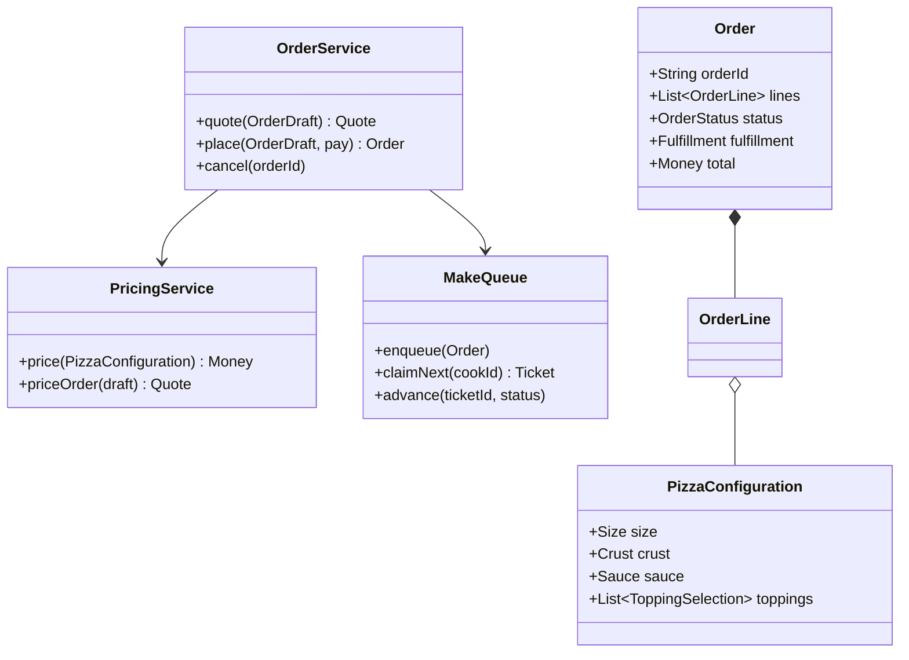

# OOD: Pizza Shop Software

> **Focus areas:** Menu / pizza composition · Orders · Kitchen workflow · Toppings & sizes · Pricing · State machines · Concurrency at counter · Extensibility (stores, channels)  
> **Style:** Object-oriented interview design (clarify → NFRs → cases → classes → APIs → state machines → concurrency → extensibility → deep dive → wrap-up → Q&A)  
> **Quality bar:** Correct configurable pizza pricing, clear order lifecycle, kitchen queue abstraction, composition over "God OrderManager"  
> **Interview theme:** Amazon SDE III / L6 — **commerce OOD** (local shop); distinguish from food-delivery HLD marketplace

---

## Table of Contents

1. [Clarify Requirements (Interview Q&A)](#1-clarify-requirements-interview-qa)
2. [Non-Functional Requirements](#2-non-functional-requirements)
3. [Cases](#3-cases)
4. [Object Model & Class Diagrams](#4-object-model--class-diagrams)
5. [Public APIs / Interfaces](#5-public-apis--interfaces)
6. [State Machines](#6-state-machines)
7. [Concurrency & Consistency](#7-concurrency--consistency)
8. [Extensibility](#8-extensibility)
9. [Design Deep Dive](#9-design-deep-dive)
10. [Wrap-Up](#10-wrap-up)
11. [Deeper / Related Interview Questions](#11-deeper--related-interview-questions)
12. [Appendices](#12-appendices)

---

## 1. Clarify Requirements (Interview Q&A)

Goal: design the **object model for a pizza shop**—menu, customizable pizzas, orders (dine-in/takeout/delivery lite), payment hook, and kitchen preparation workflow.

### 1.0 What this is / is not

| Dimension | This | Not |
|-----------|------|-----|
| Job | Single shop (or few stores) OOD | Global DoorDash-scale HLD |
| Kitchen | Station queue + order status | IoT oven firmware |
| Delivery | Optional driver assign stub | Full geo routing product |
| Amazon lens | Correct orders, ops ownership | Overbuilt microservices |

### 1.1 Clarifying questions

| # | Question | Typical answer | Implication |
|---|----------|----------------|-------------|
| F1 | Custom pizza? | Size, crust, sauce, toppings | Builder / composition |
| F2 | Menu items? | Pizzas, sides, drinks | `MenuProduct` hierarchy light |
| F3 | Pricing? | Base size + topping fees | `PricingService` |
| F4 | Channels? | Counter, phone, online | `OrderSource` |
| F5 | Kitchen? | Make line → oven → box | Order item states |
| F6 | Delivery? | Optional MVP stub | `FulfillmentType` |
| F7 | Payments? | Pay port | Don't implement PCI |
| F8 | Modifiers? | Extra cheese, well done | `Modifier` |
| F9 | Half-and-half? | Optional | Split topping map |
| F10 | Inventory flour/toppings? | Simple depletion optional | `InventoryPort` |
| F11 | Multi-store? | Later | `Store` entity |
| F12 | Loyalty? | Out of MVP | — |

**MVP scope:**

1. Menu with sizes/crusts/toppings.  
2. Build pizza + add sides.  
3. Place order; price; pay (port).  
4. Kitchen queue transitions to READY/HANDED_OFF.  
5. Cancel/refund policy hooks.  
6. Thread-safe order id / kitchen claim.

**Out of MVP:** national franchise ERP, ML prep-time ETA platform, drone delivery.

### 1.2 Scope repeat-back

> Pizza shop domain with composable pizzas, order lifecycle, pricing strategy, kitchen workflow, and ports for pay/inventory—extensible to multi-store and delivery without rewriting core.

---

## 2. Non-Functional Requirements

| # | NFR | Target |
|---|-----|--------|
| N1 | Order place latency | < 200ms in-proc/local |
| N2 | Correctness | Price matches receipt; no lost orders |
| N3 | Kitchen UX | Clear next work item |
| N4 | Audit | Order events for disputes |
| N5 | Extensibility | New crust/topping/size via data |
| N6 | Availability | Degrade online channel; counter works |
| N7 | Concurrency | Multiple cashiers + cooks |
| N8 | Observability | Prep time, void rate, topping usage |

### 2.1 Scale framing

| Metric | Base | 10× |
|--------|------|-----|
| Orders/day/store | 200 | 2K |
| Concurrent staff | 5 | 20 |
| Design | Single DB | Store-partitioned |

---

## 3. Cases

### 3.1 Happy

1. Build large pepperoni; add drink; pay; kitchen makes; customer pickup.  
2. Two pizzas different mods; item-level status.  
3. Online order → appears on make line.  
4. Out of mushrooms → topping unavailable; suggest remove.  
5. Cancel before MAKE → refund; after oven → limited void policy.

### 3.2 Edge / failure

| Case | Behavior |
|------|----------|
| Duplicate submit | Idempotency key |
| Pay fail | Order not kitchen-visible |
| Topping max exceeded | Reject build |
| Half-and-half invalid topping count | Validate |
| Cook claims same ticket | One winner |
| Store close mid-queue | Finish or cancel policy |
| Price catalog change mid-build | Pin version at quote |
| Delivery address missing | Reject DELIVERY type |

### 3.3 Invariants

```text
I1: Order total == sum(lines) + tax/fees policy − discounts
I2: Kitchen only sees PAID (or PAY_AT_PICKUP flagged) orders
I3: Terminal states immutable
I4: Inventory decrement ≤ available (if tracked)
```

---

## 4. Object Model & Class Diagrams

### 4.1 Core classes

| Class | Responsibility |
|-------|----------------|
| `Store` | Config, menu, timezone |
| `Menu` | Products, toppings, sizes |
| `PizzaRecipe` / `PizzaConfiguration` | Size, crust, sauce, toppings |
| `Topping` | Id, price delta, tags (veg/meat) |
| `MenuItem` | Side/drink fixed product |
| `Order` | Lines, customer, fulfillment, status |
| `OrderLine` | Configured item + qty + price snapshot |
| `PricingService` | Quote |
| `KitchenService` / `MakeQueue` | Work tickets |
| `PaymentPort` | Charge |
| `OrderService` | Application façade |
| `CatalogVersion` | Pin prices |

### 4.2 Pizza composition (Builder)

```java
PizzaConfiguration.builder()
  .size(LARGE)
  .crust(HAND_TOSSED)
  .sauce(TOMATO)
  .addTopping(PEPPERONI)
  .addTopping(MUSHROOM, Half.LEFT) // optional
  .build(); // validates constraints
```

### 4.3 Diagram



### 4.4 Light product hierarchy

```text
Sellable (interface)
  PizzaConfiguration  // custom
  CatalogProduct      // SKU side/drink
```

Avoid `Food extends HotFood extends Pizza extends PepperoniPizza`—use data + configuration.

### 4.5 Package layout

```text
pizzashop/
  catalog/   Menu, Topping, Size, Crust
  pizza/     PizzaConfiguration, Builder, Validators
  order/     Order, OrderLine, OrderService
  pricing/   PricingService, TaxPort
  kitchen/   MakeQueue, Ticket
  fulfill/   Pickup, DeliveryInfo
  ports/     PaymentPort, InventoryPort, Clock
```

---

## 5. Public APIs / Interfaces

### 5.1 Order API

```text
quote(draft, idempotency?) → Quote{lines, total, catalogVersion}
place(draft, payment, placeId) → Order
get(orderId) → OrderView
cancel(orderId, reason) → CancelResult
```

### 5.2 Kitchen API

```text
claimNext(station, cookId) → Optional<Ticket>
startMake(ticketId)
ovenIn(ticketId)
markReady(ticketId)
handOff(ticketId)
```

### 5.3 Catalog API

```text
listMenu(storeId)
setToppingAvailability(toppingId, bool)
```

### 5.4 Pricing

```java
Money pricePizza(PizzaConfiguration p, CatalogVersion v);
```

---

## 6. State Machines

### 6.1 Order status

```text
DRAFT → PENDING_PAYMENT → PAID → IN_KITCHEN → READY → COMPLETED
PAID → CANCELLED (policy)
IN_KITCHEN → CANCELLED (limited)
PENDING_PAYMENT → EXPIRED
```

### 6.2 Kitchen ticket / item

```text
QUEUED → MAKING → OVEN → BOXING → READY → HANDED_OFF
* → REMADE (quality fail)
```

### 6.3 Payment

```text
AUTHORIZED → CAPTURED
AUTHORIZED → VOIDED
FAILED
```

Place order transitions kitchen only after PAID (or store config COD).

---

## 7. Concurrency & Consistency

| Race | Fix |
|------|-----|
| Double place button | `placeId` idempotency |
| Two cooks claim same ticket | Atomic claim update |
| Topping sold out during build | Re-validate on place |
| Catalog price change | Pin `catalogVersion` on quote; place checks | 

Kitchen claim:

```text
UPDATE tickets SET cook_id=:c, status='MAKING'
 WHERE id=:id AND status='QUEUED'
```

---

## 8. Extensibility

| Extension | Hook |
|-----------|------|
| Gluten-free crust | Catalog row + price delta |
| Half-and-half | `ToppingSelection.side` |
| Delivery | `Fulfillment.DELIVERY` + driver port |
| Multi-store | `StoreId` on all aggregates |
| Combos | `BundleProduct` sellable |
| Coupons | Promo port (coupon LLD) |
| Make stations | Ticket routing by item type |

Open/Closed: new toppings are data; new fulfillment types may add strategy.

---

## 9. Design Deep Dive

### 9.1 Pricing model

```text
price = sizeBase[crust]
      + sauceDelta
      + sum(toppingPrice[size] for toppings)
      + modifier deltas
```

Premium toppings cost more; first N toppings included optional policy—encode in `PricingPolicy`.

### 9.2 Validation rules

```text
max toppings by size
incompatible crust/sauce optional
half-and-half requires split capability flag
unavailable topping → error
```

### 9.3 Kitchen board

Orders explode to tickets (per pizza or per order—clarify). MVP: one ticket per pizza line qty unit.

Display sorted by promise time / priority (delivery first optional).

### 9.4 Promise time

```text
eta = now + queueMinutes(load) + bakeMinutes(size)
```

Simple heuristic; expose as estimate.

### 9.5 Failure modes

| Failure | Behavior |
|---------|----------|
| Payment timeout | Leave PENDING; expire |
| Oven delay | SLA breach metric; notify |
| Wrong pizza remake | REMADE ticket; cost absorb |
| Inventory inconsistency | Stop sell topping; recount |

### 9.6 Deal-breakers

- God-class `PizzaShopManager` does all  
- Price only on client  
- Kitchen sees unpaid orders  
- Inheritance per menu pizza SKU  
- Non-idempotent place  

### 9.7 Testing

| Test | Assert |
|------|--------|
| Price golden large+2 toppings | Cents |
| Builder max toppings | Throws |
| Claim race | Single cook |
| Idempotent place | One order |
| Cancel policy | State guarded |

### 9.8 Observability

Metrics: `orders_placed`, `prep_minutes`, `voids`, `topping_86_count`, `claim_conflicts`.

### 9.9 Delivery stub

```text
DeliveryInfo{address, phone}
DriverPort.assign(orderId) // optional
status OUT_FOR_DELIVERY → DELIVERED
```

Don't build routing in OOD interview unless asked.

### 9.10 Relation to HLD food delivery

Marketplace HLD is multi-restaurant logistics. This OOD is **one shop kernel**.

---

## 10. Wrap-Up

### 10.1 60-second narrative

"We model a **Store menu** and **PizzaConfiguration** via builder (size/crust/sauce/toppings), price with a policy pinned by catalog version, and **Order** lifecycle gated on payment. Kitchen uses a **MakeQueue** with atomic claim and item state machine. Ports handle pay/inventory. Extensibility is catalog data + fulfillment strategies—not subclasses per pizza name."

### 10.2 Cheat sheet

| Topic | Answer |
|-------|--------|
| Pizza | Configuration + builder |
| Price | Policy + version pin |
| Order | SM + idempotent place |
| Kitchen | Queue + claim |
| Extensibility | Catalog data |
| Kill | God manager; client price |

---

## 11. Deeper / Related Interview Questions

**Q: Builder vs telescoping constructors?**  
A: Builder for many optional toppings.

**Q: Should Pizza extend MenuItem?**  
A: Custom pizza is configuration; named menu pizza can be preset configuration template.

**Q: How model "Meat Lovers" special?**  
A: Template `PizzaConfiguration` + optional discount component.

**Q: Tax?**  
A: `TaxPort` by jurisdiction; snapshot on order.

**Q: Tips?**  
A: Separate fee line on order.

**Q: Online + counter same kitchen?**  
A: Unified queue with source tag.

**Q: Remake free?**  
A: Policy; still ticketed for thruput metrics.

**Q: Why pin catalog version?**  
A: Quote/place consistency.

**Q: Inventory flour?**  
A: Coarse depletion; don't overfit.

**Q: First metric?**  
A: Prep time p95 + order abandon after pay fail.

**Q: Multi-tenant franchise?**  
A: Store isolation; shared catalog templates.

**Q: Half topping price?**  
A: Policy: half price vs full—ask.

**Q: Event sourcing orders?**  
A: Optional; event log good for audit.

**Q: Concurrent menu edit?**  
A: Version publish; cashiers pin.

**Q: Amazon lens?**  
A: Customer promise times; own remake costs.

---

## 12. Appendices

### A. Size / crust enums

```text
Size: S M L XL
Crust: HAND_TOSSED, THIN, PAN, CAULIFLOWER
Sauce: NONE, TOMATO, ALFREDO, BBQ
```

### B. OrderDraft

```java
record OrderDraft(
  String storeId,
  Fulfillment fulfillment,
  List<LineDraft> lines,
  String customerId,
  String catalogVersion
) {}
```

### C. Claim SQL sketch

```sql
UPDATE kitchen_tickets
SET status='MAKING', cook_id=?, claimed_at=now()
WHERE ticket_id=? AND status='QUEUED'
```

### D. Flashcards

| Card | Point |
|------|-------|
| Config | Pizza builder |
| Pin | Catalog version |
| Gate | Pay → kitchen |
| Claim | Atomic |
| Template | Named specials |
| Kill | Per-SKU class |

### E. Sequence: place order

```text
validate draft → price with pinned version → pay → persist PAID → enqueue tickets → ack
```

### F. Alternatives to kill

| Alt | Why kill |
|-----|----------|
| Class PepperoniPizza | Explosion |
| Shared mutable Menu without version | Price drift |
| Kitchen pull unpaid | Shrink/theft complexity |
| Float money | Rounding |

### G. Runbooks

**R1 — Oven down:** Stop new; finish queue; communicate ETAs.  
**R2 — 86 pepperoni:** Availability flag; suggest alternatives.  
**R3 — Double charge:** Idempotency + pay port refund tool.

### H. Interview timebox

| Min | Focus |
|-----|-------|
| 0–5 | Scope shop vs marketplace |
| 5–15 | Pizza config + pricing |
| 15–25 | Order SM |
| 25–35 | Kitchen queue |
| 35–45 | Concurrency + extensibility |

### I. Glossary

| Term | Meaning |
|------|---------|
| 86 | Mark unavailable |
| Ticket | Kitchen work unit |
| Remake | Redo quality fail |
| Promise | Estimated ready time |
| Template | Named pizza preset |

### J. Related files

- Coupon LLD for discounts  
- Global food delivery HLD for marketplace contrast  
- Online store object model for commerce parallels |

### K. Sample price table

| Size | Base | Topping |
|------|------|---------|
| M | $8 | $1.25 |
| L | $10 | $1.50 |
| XL | $12 | $1.75 |

### L. Validator sketch

```java
void validate(PizzaConfiguration p) {
  require(p.toppings.size() <= maxFor(p.size));
  require(p.toppings.stream().allMatch(t -> catalog.isAvailable(t.id)));
}
```

### M. Fulfillment types

```text
DINE_IN, TAKEOUT, DELIVERY
```

### N. Final checklist

- [ ] Builder pizza  
- [ ] Pricing policy  
- [ ] Order SM  
- [ ] Pay gate  
- [ ] Kitchen claim  
- [ ] Idempotency  
- [ ] Catalog version  
- [ ] Out of scope marketplace  

---

## Extra Depth: Named Pizza Templates

```text
MenuPizzaTemplate {
  id: "meat-lovers"
  baseConfig: PizzaConfiguration
  displayName
  optional bundlePrice override
}
```

Customer can still "customize further" → clone config + mutate toppings.

---

## Extra Depth: Item-level vs Order-level Kitchen Status

**Order-level:** simpler board; one status.  
**Item-level:** better for multi-pizza; READY when all items READY.

Recommend item-level for interview depth; aggregate order status = min/max pipeline.

---

## Extra Depth: Prep Time Heuristic

```text
prep = 3 min * activeTickets + bake(size) + buffer
bake: M=7, L=8, XL=9
```

Publish estimate; update as queue moves.

---

## Extra Depth: Worked Quote

```text
Large hand-tossed base $10
Pepperoni + mushroom = 2 * $1.50 = $3
Drink $2
Subtotal $15
Tax 10% = $1.50
Total $16.50
```

Snapshot these amounts on `OrderLine.unitPrice` / `Order.tax`.

---

## Extra Depth: Cancel Matrix

| State | Cancel | Refund |
|-------|--------|--------|
| PENDING_PAYMENT | Yes | N/A |
| PAID queued | Yes | Full |
| MAKING | Manager | Full/partial |
| OVEN | Rare | Food waste |
| COMPLETED | No | Complaint flow |

---

## Extended Rapid Q&A II

**Q: Why not microservices per station?**  
A: Overkill for one shop OOD; modular monolith packages fine.

**Q: QR table ordering?**  
A: Same OrderService; source=QR; dine-in table number.

**Q: Combo meal pricing?**  
A: Bundle pricer takes child lines; compare to sum.

**Q: Gluten allergy note?**  
A: Order note + kitchen highlight; not a topping.

**Q: Soft vs hard delete menu item?**  
A: Soft; retain on historical orders.

**Q: Exactly-once kitchen advance?**  
A: ticketId + fromStatus guard.

**Q: Customer edit after pay?**  
A: Cancel+reorder or mutable until MAKING—policy.

**Q: Peak Friday night?**  
A: Longer ETA; optional stop online intake.

**Q: Map to Amazon LP?**  
A: Customer obsession on accurate ETA; ownership of remakes.

**Q: Difference from online-store OOD?**  
A: Perishable kitchen workflow central here.

---

## Closing Cheat Sheet (Extended)

| Topic | Answer |
|-------|--------|
| Customization | PizzaConfiguration |
| SoT price | Server quote + snapshot |
| Work | MakeQueue tickets |
| Race | Idempotent place + claim CAS |
| Scale | Store partition |
| Kill | SKU class explosion; unpaid kitchen |

---

*End of Pizza Shop OOD notes (Amazon SDE III prep).*
