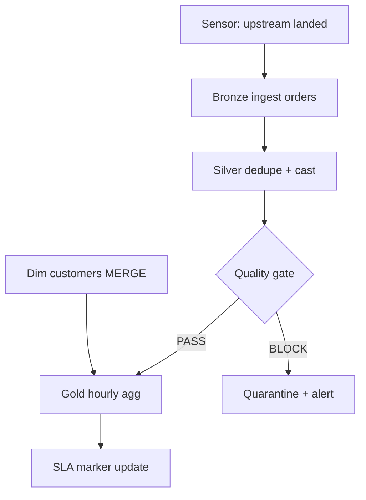

Batch and Streaming Ingestion (Bronze → Gold Lakehouse)

> **Focus areas:** CDC · Kafka · Autoloader · Schema inference · DLQ · Medallion landing · Checkpointing
> **Style:** End-to-end data platform design with progressive scale (1× → 10× → 100× → 1,000×)  
> **Quality bar:** Correct arithmetic on shuffle/storage, explicit SLA math, honest idempotency semantics, failure-first reasoning on backfills  
> **Interview theme:** Databricks — unified batch + streaming ingestion into lakehouse landing with schema evolution and recovery

---

## Table of Contents

1. [Clarify Requirements (Interview Q&A)](#1-clarify-requirements-interview-qa)
2. [Back-of-the-Envelope Estimation](#2-back-of-the-envelope-estimation)
3. [High-Level Design](#3-high-level-design)
4. [Architecture Diagram](#4-architecture-diagram)
5. [Design Deep Dive](#5-design-deep-dive)
6. [Wrap-Up](#6-wrap-up)
7. [Deeper / Related Interview Questions](#7-deeper--related-interview-questions)
8. [Appendices](#8-appendices)

---

## 1. Clarify Requirements (Interview Q&A)

Goal: **bound the ETL platform**—not "run a Spark job." It is the subsystem that orchestrates thousands of dependent transforms, writes idempotent outputs to Delta tables, enforces data quality, and meets hourly/daily SLAs even when upstream is late, skewed, or flaky.

### 1.0 What this is / is not

| Dimension | This doc | Not this |
|-----------|----------|----------|
| Job | Scheduled + triggered ETL from Bronze → Gold with SLAs | Real-time streaming analytics (sibling) |
| Storage | Delta Lake on object storage (S3/ADLS/GCS) | OLTP row store as warehouse |
| Compute | Spark SQL / notebook jobs on shared clusters | Single cron shell script on one VM |
| Quality | Great Expectations–style gates blocking bad data | "We eyeball dashboards" |
| Scope | Platform patterns: DAG, retries, skew, backfill | Building Spark engine internals (sibling doc) |

### 1.1 Functional Requirements

| # | Question to ask | Expected / typical interviewer answer | Design implication |
|---|-----------------|----------------------------------------|--------------------|
| F1 | What workloads? | SQL/Spark transforms, batch primary; micro-batch optional | Job templates + cluster policies |
| F2 | Data layers? | **Bronze** (raw), **Silver** (cleaned/conformed), **Gold** (aggregates/marts) | Medallion naming + promotion rules |
| F3 | SLA types? | **Freshness** (Gold ready by 6am), **Completeness** (≥99.9% rows), **Correctness** (quality gates) | SLA monitor with critical path |
| F4 | Orchestration? | DAG with dependencies, sensors, backfill params | Airflow/Databricks Workflows/Dagster |
| F5 | Incremental vs full? | Incremental by partition/watermark; full rebuild rare | MERGE, CDF, `WHERE dt = run_date` |
| F6 | CDC / SCD? | SCD Type 1/2 for dimensions; CDC from OLTP | MERGE with `valid_from`/`valid_to` |
| F7 | Idempotency? | Re-run same `run_id` → same Gold snapshot | Deterministic writes + partition overwrite semantics |
| F8 | Skew handling? | Hot keys (e.g., `country=US`, `user_id=0`) | Salting, AQE skew join, isolate heavy keys |
| F9 | Retries? | Transient cluster/network; not bad data | Exponential backoff; max attempts; alert on terminal fail |
| F10 | Data quality? | Schema, nulls, ranges, referential, volume anomalies | Pre/post checks; quarantine bad batches |
| F11 | Lineage? | Table/column lineage for audit | Unity Catalog / OpenLineage events |
| F12 | Backfill? | Reprocess historical partitions on schema fix | Parameterized DAG runs; throttle concurrency |
| F13 | Multi-tenant? | Many teams, shared clusters | Queues, budgets, job tags for cost attribution |
| F14 | Schema evolution? | Add columns OK; breaking changes gated | Contract tests + compat flags |
| F15 | Alerting? | Pager on SLA miss / quality fail | PagerDuty + Slack; severity by downstream tier |

**MVP functional scope (lock with interviewer):**

1. **Orchestrator** runs DAG of Spark SQL jobs with explicit dependencies (Bronze ingest → Silver clean → Gold aggregate).
2. Jobs write **Delta** tables with partition keys (`dt`, `hour`) and **idempotent** overwrite/MERGE per run.
3. **Quality gates** after Silver and before Gold publish; fail blocks downstream consumers.
4. **SLA monitor** tracks freshness vs deadline; alerts on miss with critical-path attribution.
5. **Retry policy** for transient failures; no silent skip of partitions.
6. **Backfill API** to re-run date range with concurrency caps.
7. **Lineage + metrics** emitted per job run (rows in/out, shuffle bytes, duration).

**Out of MVP (explicitly defer):**

- Real-time streaming Gold (Kafka → Flink) as default path
- Cross-cloud active-active dual writers on same Gold table
- ML feature store as first-class citizen
- Perfect exactly-once end-to-end without idempotent sinks
- Self-serve arbitrary SQL without guardrails at 100×

### 1.2 Non-Functional Requirements

| # | Question | Expected answer | Target |
|---|----------|-----------------|--------|
| N1 | Daily ingest volume? | See scale table | Baseline **5 TB/day** raw Bronze |
| N2 | Freshness SLA? | Gold `fact_orders` by **06:00 UTC** | 99% on-time over 30 days |
| N3 | Job success rate? | Transient infra excluded | ≥99.5% per job after retries |
| N4 | Idempotency? | Re-run safe | Same partition keys → identical logical result |
| N5 | Latency (hourly jobs)? | Silver within **15 min** of hour close | p99 pipeline duration < 45 min |
| N6 | Cost? | Spot/preemptible OK for batch | Budget alerts per domain |
| N7 | Observability? | Per-job metrics + data quality scores | Dashboards + OpenLineage |
| N8 | Recovery RTO? | Replay from Bronze | Hours, not days |
| N9 | Isolation? | Noisy neighbor jobs | Queues, cluster policies, autoscaling bounds |
| N10 | Compliance? | PII masking in Silver | Column-level ACLs in catalog |

### 1.3 Cases (Flows & Edge Cases)

**Happy paths**

1. Hourly Bronze landing completes → Silver dedupe/clean → quality pass → Gold aggregate → SLA green.
2. Daily dimension SCD2 MERGE: new/changed rows versioned; unchanged rows untouched.
3. Incremental Gold job reads only `dt = yesterday` partitions; completes under SLA.
4. Orchestrator retries transient executor loss; job succeeds without duplicate rows.
5. Backfill `2024-01-01..2024-01-07` runs throttled; Gold consumers see consistent partitions.

**Edge / failure cases**

| Case | Behavior |
|------|----------|
| Upstream Bronze late by 2h | Sensor waits or SLA clock starts late; alert if miss imminent |
| Skew on `customer_id` | Salting + AQE; or pre-aggregate heavy keys separately |
| Quality fail (null rate spike) | Block Gold publish; quarantine Silver partition; page owner |
| Mid-job cluster preemption | Retry from checkpoint; idempotent partition write |
| Duplicate orchestrator trigger same `run_id` | Second run no-ops or replaces same partition deterministically |
| Schema drift (new column upstream) | Bronze accepts; Silver contract test fails until updated |
| Backfill overlaps live run | Partition lock or `run_id` fencing; last-writer-wins only if idempotent |
| Small file problem in Bronze | OPTIMIZE/Z-ORDER compaction job in maintenance window |
| MERGE on huge dimension | Bucket by key; broadcast small side; sort-merge large |
| Cross-DAG dependency miss | Upstream fail blocks downstream via orchestrator skip + alert |
| Partial partition write crash | Delta transaction log ensures no published partial partition |
| Hot calendar day (Black Friday) | Pre-scale cluster; widen SLA buffer; disable non-critical jobs |

### 1.4 Scales (Progressive)

| Metric | Baseline (1×) | 10× | 100× | 1,000× |
|--------|---------------|-----|------|--------|
| Daily ingest (Bronze) | 5 TB | 50 TB | 500 TB | 5 PB |
| Active DAG jobs | 200 | 2,000 | 20,000 | 200,000 |
| Tables (managed) | 500 | 5,000 | 50,000 | 500,000 |
| Peak concurrent Spark apps | 20 | 200 | 2,000 | 20,000 |
| Shuffle bytes / day | ~15 TB | ~150 TB | ~1.5 PB | ~15 PB |
| SLA-monitored pipelines | 50 | 500 | 5,000 | 50,000 |
| Backfill concurrency | 5 partitions | 50 | 500 (throttled) | 5,000 (queued) |
| Regions | 1 | 1–2 | 3 | Multi-region read replicas |

**What each jump forces:**

- **10×:** Dedicated job queues; cluster autoscaling; partition pruning mandatory; quality as a service.
- **100×:** Domain-owned cells; incremental everything; shuffle service / AQE defaults; cost attribution tags.
- **1,000×:** Federated orchestration; table maintenance as continuous background; aggressive file compaction; tiered storage (hot/warm/cold).

### 1.5 Scope repeat-back

> Design a high-throughput **medallion ETL platform**: orchestrated DAG of Spark jobs writing **Delta** tables Bronze→Gold, with **idempotent partition semantics**, **data quality gates**, **skew-aware transforms**, and **SLA monitoring**—starting at ~5 TB/day and scaling 10× / 100× / 1,000× without losing correctness on retries and backfills.

---

## 2. Back-of-the-Envelope Estimation

### 2.1 Split load classes (do not lump)

| Class | Baseline peak | 100× | Notes |
|-------|---------------|------|-------|
| Bronze ingest (write) | 5 TB/day ≈ 58 MB/s avg | 5.8 GB/s avg | Bursty; peak 3–5× avg |
| Silver transform (read+write) | ~10 TB/day touched | ~1 PB/day touched | Often 2× Bronze due to joins |
| Gold aggregate (shuffle-heavy) | ~15 TB shuffle/day | ~1.5 PB shuffle/day | **Dominates cost** |
| Orchestrator metadata ops | ~200 DAG runs/day | 20K runs/day | Cheap vs Spark |
| Quality checks | ~500 checks/day | 50K/day | CPU-light; I/O on samples |
| Lineage events | ~2K events/day | 200K/day | Kafka/OpenLineage |

**Critical insight:** At scale, **shuffle bytes and skew tail latency** dominate—not orchestrator QPS or catalog lookups.

### 2.2 Daily volume math

```text
Baseline: 5 TB/day Bronze
Assume Silver expands 1.2× (denormalization) → 6 TB written
Gold aggregates read ~30% of Silver + dimensions → ~2 TB read, ~15 TB shuffle (joins/agg)

Peak hour (batch window 2am–6am):
  5 TB / 4h ≈ 1.25 TB/h ≈ 347 MB/s sustained ingest
  If 50 critical jobs in window, avg job ~100 GB shuffle → plan cluster for parallel shuffle
```

At **100×**:

```text
500 TB/day Bronze → ~5.8 GB/s average, ~20 GB/s peak
Shuffle ~1.5 PB/day → must rely on:
  - partition pruning (never full scan)
  - incremental MERGE / CDF
  - AQE coalesce + skew join
  - isolate monster jobs to dedicated clusters
```

### 2.3 Shuffle & network

```text
Example join: fact 500M rows × dim 10M rows
If poor join key distribution → one reducer gets 40% of rows
  Normal task: 2 min
  Skewed task: 45 min → SLA miss

Mitigation reduces effective shuffle:
  Broadcast dim if < 100 MB (10M × 10 cols × 8 B ≈ 800 MB — borderline; sample or bucket)
  Salting hot key adds 10× spread → 10 reducers share load → max task ~5 min
```

**Rule of thumb:** `shuffle_partitions = max(200, input_gb * 2)` then let AQE coalesce down.

### 2.4 Storage (Delta on object storage)

```text
Bronze: 5 TB/day × 90 day retention ≈ 450 TB
Silver: 6 TB/day × 90 ≈ 540 TB
Gold: 1 TB/day × 365 ≈ 365 TB
Total ~1.4 PB baseline (before replication)

Delta overhead: transaction log + checkpoints negligible vs data
Small files: if 128 MB target, 5 TB/day → ~40K files/day Bronze → compaction job required
```

At **100×**: ~140 PB before replication → lifecycle policies (Bronze 30d, Silver 90d, Gold tiered).

### 2.5 Compute (executor-hours)

```text
Baseline: 200 jobs/day, avg 15 executor-hours each → 3,000 executor-hours/day
At $0.10/executor-hour → $300/day compute (order of magnitude)

100×: 300K executor-hours/day → queues + spot + right-sizing mandatory
  Autoscaling: min 0, max N per queue; kill stragglers; use job clusters not always-on 24/7
```

### 2.6 SLA math

```text
SLA: Gold fact_orders ready by 06:00 UTC
Critical path: Bronze(02:00) → Silver(03:30) → Quality(03:45) → Gold(05:30) → buffer 30m

If Silver p99 = 90 min instead of 60 min → miss unless:
  - start Bronze earlier on late upstream
  - parallelize Silver sub-DAG
  - pre-materialize heavy Silver step overnight
```

**Deal-breaker:** SLA without critical-path analysis on the DAG.

### 2.7 Bottlenecks (rank ordered)

1. **Shuffle + skew** on wide joins and group-by  
2. **Full-table scans** when partition filter forgotten  
3. **Small files** slowing list/read operations  
4. **Non-idempotent writes** breaking retries  
5. **Orchestrator thundering herd** at cron boundaries  
6. **Quality gate false positives** blocking good data  
7. **Backfill stampede** starving live SLAs  

---

## 3. High-Level Design

### 3.1 Core abstractions

```text
PipelineDAG       → nodes (jobs), edges (dependencies), SLA clock anchor
JobRun            → (pipeline_id, run_id, logical_date, params, attempt)
MedallionTable    → bronze|silver|gold + schema contract + partition spec
QualityExpectation→ rule + severity (WARN|BLOCK)
SLAWatch          → deadline, upstream_sensors, critical_path_jobs
PartitionLock     → (table, partition_key) → holder run_id
LineageEvent      → inputs[], outputs[], run_id, metrics
BackfillRequest   → date_range, concurrency, priority
```

### 3.2 Medallion layer semantics

| Layer | Purpose | Write pattern | Retention |
|-------|---------|---------------|-----------|
| Bronze | Raw landing, append-only | `append` or `overwrite` partition by ingest batch | 30–90 days |
| Silver | Cleaned, typed, deduped | `MERGE` or partition `overwrite` idempotent | 90–180 days |
| Gold | Business aggregates, marts | `MERGE` / aggregate partition overwrite | 1–7 years (tiered) |

**Promotion rule:** Gold **never** reads Bronze directly in production DAG (always via Silver contract).

### 3.3 Orchestration options

| Option | Pros | Cons | Deal-breaker when |
|--------|------|------|-------------------|
| A. Airflow + Spark submit | Mature sensors, backfill UI | Cluster lifecycle glue | Already all-in Databricks |
| B. Databricks Workflows | Native jobs, Unity Catalog | Vendor coupling | Need portable OSS only |
| C. Dagster assets | Strong data-aware scheduling | Adoption curve | Team knows Airflow only |
| D. Cron per job | Simple | No DAG, retry hell | >20 dependent jobs |

**Chosen path:**

- **MVP:** Databricks Workflows (or Airflow) with explicit task sensors on partition readiness.  
- **100×+:** Domain DAGs with shared SLA service; cross-DAG sensors via Delta `__commit__` timestamps or audit table.

### 3.4 Idempotent write patterns (Delta)

| Pattern | When | Semantics |
|---------|------|-----------|
| Partition overwrite | Daily snapshot per `dt` | Re-run replaces partition atomically |
| MERGE | SCD, upserts | Match on key; idempotent if match keys + run deterministic |
| Append + dedupe view | Log-style Bronze | Silver job dedupes by `(id, event_time)` |
| CDF-driven incremental | Silver→Gold | Read changes since watermark |

```sql
-- Idempotent daily Gold overwrite (conceptual)
INSERT OVERWRITE TABLE gold.fact_orders PARTITION (dt = '${run_date}')
SELECT ... FROM silver.orders WHERE dt = '${run_date}';
-- Delta ensures atomic partition replacement
```

**Deal-breaker:** `INSERT INTO` append on retry without dedupe keys.

### 3.5 Incremental processing

```text
Watermark table: last_processed_ts per pipeline
Silver→Gold:
  read CDF or WHERE updated_at > watermark AND dt >= lookback_window
  lookback_window = 2 days (late-arriving facts)
  after success: watermark = max(updated_at) seen
```

### 3.6 Skew mitigation toolkit

| Technique | Use case |
|-----------|----------|
| Salting | Hot key in group-by/join |
| AQE skew join | Runtime split heavy partition |
| Broadcast hash join | Small dimension < threshold |
| Two-phase aggregation | Partial agg before final |
| Isolate heavy keys | Separate job for `user_id = 0` / null bucket |
| Z-order / liquid clustering | Scan pruning on common filters |

### 3.7 Data quality architecture

```text
Pre-publish checks (Silver):
  - schema match contract
  - null rate < threshold on critical cols
  - row count vs 7-day median (±30%)
  - referential: 99.9% fk exists in dim

Post-publish checks (Gold):
  - aggregate reconciliation vs Silver totals
  - uniqueness on grain keys

On BLOCK fail:
  - do not update SLA "ready" flag
  - quarantine partition to silver_quarantine.orders_dt=...
  - notify owner; downstream tasks skip via orchestrator
```

### 3.8 SLA monitoring

```text
SLAWatch(fact_orders_daily):
  deadline = 06:00 UTC
  critical_path = [bronze.orders_ingest, silver.orders_clean, quality.silver_orders, gold.fact_orders]
  status = GREEN if gold partition __commit_ts < deadline else RED

Sensor: bronze.orders partition dt exists AND byte_count > floor
Optional: external source landed (S3 event → marker table)
```

### 3.9 Retry & failure policy

| Failure class | Action |
|---------------|--------|
| Executor lost / fetch failed | Retry task (Spark) + job attempt |
| Cluster preemption | New cluster; same run_id; idempotent write |
| Quality BLOCK | No retry; human fix upstream |
| SLA miss | Alert; optional auto-scale boost for retry window |
| OOM | Increase memory or fix skew; max 2 attempts |

```text
orchestrator retry: exponential backoff 5m, 15m, 45m; max 3 attempts
Spark: spark.task.maxFailures = 4; stage retry on shuffle fetch fail
```

### 3.10 Backfill design

```text
BackfillRequest:
  pipeline=gold.fact_orders
  start_date, end_date
  concurrency=10 partitions
  priority=LOW (yield to live SLA jobs)

Implementation:
  fan-out N partition tasks in orchestrator
  each task: run_id = backfill_{uuid}_{dt}
  throttle: global semaphore in metadata DB
  never run backfill + live on same partition without lock
```

### 3.11 Trade-off tables

| Concern | Choice | Why | Deal-breaker |
|---------|--------|-----|--------------|
| Correctness vs speed | Idempotent partitions + MERGE | Retries safe | Append-only on retry |
| Freshness vs cost | Incremental Gold | Less shuffle | Full rebuild nightly |
| Strict quality vs uptime | BLOCK on critical; WARN on drift | Prevent bad dashboards | Block on any null |
| Spot instances | Yes for batch | 60–80% savings | No checkpoint + non-idempotent |
| Monolithic DAG | Domain DAGs | Blast radius | One 500-node DAG |
| Schema flexibility | Contracts in Silver | Gold stable | Silent breaking change |

### 3.12 Multi-tenant fairness

```text
Queues: critical_sla, standard, backfill
Cluster policy per queue: max workers, instance type, spot %
Admission: if cluster at cap, backfill yields first
Cost tags: team, domain, pipeline_id on every job
```

---

## 4. Architecture Diagram

### 4.1 End-to-end platform

```text
                    +-------------------+
  Sources --------> | Ingest (Bronze)   |
  (S3/Kafka/DB)     | Spark / Auto Loader|
                    +---------+---------+
                              |
                              v
                    +-------------------+
                    | Orchestrator      |
                    | (DAG + sensors)   |
                    +---------+---------+
                              |
            +-----------------+------------------+
            |                 |                  |
            v                 v                  v
    +---------------+ +---------------+ +----------------+
    | Silver Jobs   | | Quality Svc   | | SLA Monitor    |
    | (clean/merge) | | (expectations)| | (deadlines)    |
    +-------+-------+ +-------+-------+ +--------+-------+
            |                 |                  |
            v                 v                  |
    +---------------+         |                  |
    | Delta Silver  |<--------+                  |
    | tables        |                            |
    +-------+-------+                            |
            |                                    |
            v                                    v
    +---------------+                    +----------------+
    | Gold Jobs     |------------------->| Alerts /       |
    | (agg/merge)   |                    | Dashboards     |
    +-------+-------+                    +----------------+
            |
            v
    +---------------+       +------------------+
    | Delta Gold    |------>| BI / ML / Export |
    | tables        |       +------------------+
    +---------------+

    Sidecars: Unity Catalog (lineage/ACL), Metrics store, Backfill API
```

### 4.2 Mermaid: hourly pipeline DAG



### 4.3 Sequence: SLA-critical daily run

```text
Orchestrator    Bronze Job      Silver Job      Quality       Gold Job       SLA Monitor
     |--02:00 trigger->|            |              |              |              |
     |              |--write dt--->|              |              |              |
     |              |<-done--------|              |              |              |
     |--trigger------------------->|              |              |              |
     |              |              |--MERGE------>|              |              |
     |              |              |<-PASS--------|              |              |
     |--trigger----------------------------------------------->|              |
     |              |              |              |              |--overwrite->|
     |              |              |              |              |<-done--------|
     |--check SLA---------------------------------------------------------------->|
     |              |              |              |              |              | GREEN
```

### 4.4 Sequence: retry after executor failure

```text
Spark Driver                         Executor E3
     |--task T42 (shuffle read)------>|
     |                                  X (node lost)
     |--retry T42 on E7-------------->|
     |<-success------------------------|
     |--commit Delta txn (same run_id, same partition)
     |   → no duplicate rows (overwrite partition)
```

### 4.5 Skew join mitigation flow

```text
Silver job detects skew (AQE metrics / custom skew report)
  → if key 'US' > 30% of shuffle:
       Option A: salt key with rand(0..9), partial agg, un-salt
       Option B: broadcast if dim small enough
       Option C: split job: heavy keys separate branch MERGE at end
```

### 4.6 Backfill vs live isolation

```text
                +----------------+
Live SLA jobs ->| Queue: critical |---> Cluster pool A
                +----------------+
Backfill req  ->| Queue: backfill  |---> Cluster pool B (spot, capped)
                +----------------+
        Shared: Delta storage (partition locks per dt)
```

---

## 5. Design Deep Dive

### 5.1 Reliability invariants

1. **Idempotent partition publish:** Re-running `(pipeline, logical_date, partition)` yields one logical snapshot.  
2. **Atomic visibility:** Consumers never see half-written partition (Delta transaction).  
3. **Quality before Gold:** BLOCK failures prevent downstream task trigger.  
4. **Deterministic transforms:** Same inputs + params → same outputs (no `current_timestamp()` in grain keys without documentation).  
5. **Late data window:** Incremental jobs use lookback to absorb stragglers.  
6. **Backfill fencing:** Partition lock or unique `run_id` per attempt logged.  
7. **Orchestrator at-least-once:** Tasks may retry; sinks must tolerate.  
8. **Lineage on every publish:** Audit which job version wrote partition.

### 5.2 Failure modes & mitigations

| Failure | Mitigation |
|---------|------------|
| Bronze file corrupt | Row-level corrupt record handler; quarantine file; metric |
| Skew straggler | AQE + salting; increase shuffle partitions; speculator |
| Shuffle fetch failure | Stage retry; external shuffle service durability |
| Quality false positive | WARN vs BLOCK tiers; manual override with audit |
| Upstream never lands | Sensor timeout → SLA RED; optional empty partition policy |
| Schema add column | Bronze flexible; update Silver contract + deploy |
| Schema drop column | Breaking → version bump; dual-write period |
| Cluster spot kill | Checkpoint + retry; job cluster not shared driver |
| Duplicate cron fire | Orchestrator `run_id` dedupe; max_active_runs=1 |
| MERGE conflict | Deterministic order by event_time desc |
| Small files explosion | Scheduled OPTIMIZE + auto compaction settings |

### 5.3 Scalability

| Scale | Architecture moves |
|-------|--------------------|
| 1× | Single orchestrator; shared job cluster; partition by `dt`; basic quality |
| 10× | Job queues; autoscaling clusters; domain DAGs; Unity Catalog; SLA service |
| 100× | Incremental CDF everywhere; dedicated clusters for shuffle monsters; cell per domain |
| 1,000× | Federated orchestration; continuous compaction; tiered storage; global lineage graph |

### 5.4 Progressive scale playbook

**1× — correct MVP**

```text
Workflows DAG:
  bronze_ingest → silver_clean → quality_check → gold_agg
Delta: INSERT OVERWRITE partition by dt
Quality: 5 critical rules BLOCK
SLA: one monitor on gold.fact_orders
Retries: 3 orchestrator attempts
```

**10×**

- Split DAGs by domain (finance, product, marketing).  
- Cluster policies: `critical` on-demand, `standard` spot mix.  
- Z-order Gold on `(customer_id, dt)` for BI queries.  
- OpenLineage to Kafka for lineage scale.

**100×**

- CDF-driven Gold; watermarks in metadata DB.  
- Skew playbook encoded in job templates (auto salt if cardinality report bad).  
- Backfill as separate orchestrator pool.  
- File compaction as continuous background (Liquid Clustering).

**1,000×**

- Regional Bronze landing; replicate to central Silver/Gold or federated Gold.  
- Policy engine: no job may scan > X TB without approval.  
- Approximate quality on samples for non-critical paths.  
- Cost cap auto-kill runaway jobs.

### 5.5 SCD Type 2 deep dive

```sql
MERGE INTO silver.dim_customer AS t
USING staging.customers_${run_id} AS s
ON t.customer_id = s.customer_id AND t.is_current = true
WHEN MATCHED AND t.hash <> s.hash THEN
  UPDATE SET valid_to = s.effective_date, is_current = false
WHEN NOT MATCHED THEN
  INSERT (customer_id, attrs..., valid_from, valid_to, is_current)
  VALUES (s.customer_id, ..., s.effective_date, '9999-12-31', true);
-- Second pass insert new version rows for changed keys (or use MATCHED branch insert)
```

**Interview point:** SCD2 MERGE is idempotent if staging is snapshot for `run_date` and hash compares full attribute set.

### 5.6 Delta-specific operations

| Operation | ETL use |
|-----------|---------|
| `OPTIMIZE` | Compact small files post-ingest |
| `ZORDER` / liquid clustering | Co-locate filter columns |
| `VACUUM` | Retain 7 days default; don't break time travel for audits |
| CDF | Incremental downstream |
| `DESCRIBE HISTORY` | Debug who overwrote partition |
| Constraints | `CHECK (amount >= 0)` enforced on Silver |

### 5.7 Maintainability

- **Job templates:** parameterized SQL with `run_date`, `lookback`, `env`.  
- **Data contracts:** YAML schema + ownership in catalog.  
- **CI:** run transforms on sampled prod subset in staging workspace.  
- **Version pinning:** container + Spark + Delta versions in run metadata.  
- **Chaos:** kill executor during Gold; verify retry + identical row counts.  
- **Ownership:** each Gold table has on-call + runbook link in SLA monitor.

### 5.8 Cost optimization (without breaking SLAs)

```text
1. Partition pruning audit (automated EXPLAIN on scheduled jobs)
2. Right-size clusters from historical executor metrics
3. Spot for backfill + non-critical; on-demand for SLA path only
4. Broadcast join threshold tuned per table stats
5. Cache/reuse Silver wide tables only if multiple Gold jobs same window
6. Delete Bronze > 30d; rely on Silver for reprocessing recent history
```

### 5.9 Deal-breakers

| Temptation | Failure |
|------------|---------|
| Full table scan nightly | Cost + SLA death at 10× |
| Ignore skew | p99 10× p50; miss SLA |
| Append on retry | Duplicate rows in Gold |
| Skip quality to "save time" | Bad board numbers; trust loss |
| One giant shared DAG | Blast radius; ownership blur |
| Backfill unlimited concurrency | Starves live pipelines |
| `SELECT *` Bronze→Gold | Schema chaos; perf waste |

### 5.10 Observability metrics

```text
pipeline_duration_seconds{pipeline, logical_date}
sla_miss_total{pipeline}
rows_read, rows_written, shuffle_bytes
quality_fail_total{rule, severity}
backfill_partitions_inflight
job_retry_total{reason}
data_freshness_lag_seconds (now - max partition dt ready)
skew_ratio_max (max partition size / median)
```

---

## 6. Wrap-Up

### 6.1 Design summary

- **Medallion Delta lakehouse** with orchestrated DAG, sensors, and domain ownership.  
- **Idempotent partition writes** and MERGE patterns so retries and backfills are safe.  
- **Quality gates** block bad Silver from reaching Gold; quarantine path for investigation.  
- **SLA service** on critical path with explicit deadline math.  
- **Skew-aware** transforms (salting, AQE, broadcast, isolate heavy keys).  
- Scale by **incremental processing + shuffle reduction**, not bigger nightly full scans.

### 6.2 MVP vs later

| MVP | Later |
|-----|-------|
| Partition overwrite daily Gold | CDF incremental Gold |
| Airflow/Workflows DAG | Federated asset graphs |
| Rule-based quality | ML anomaly detection |
| Manual backfill API | Self-serve with policy engine |
| Single region | Multi-region replication |

### 6.3 Top risks

1. Skew causing tail latency SLA misses  
2. Non-idempotent writes under retry  
3. Backfill starving critical queues  
4. Small file death by a thousand ingests  
5. Schema drift breaking silent assumptions  

### 6.4 45-minute interview plan

| Min | Focus |
|-----|-------|
| 0–5 | Scope: ETL platform vs single job; medallion |
| 5–12 | Estimation: shuffle TB, skew, SLA path |
| 12–25 | HLD: DAG, Delta idempotency, quality |
| 25–35 | Skew, retries, backfill isolation |
| 35–45 | Scale 10×/100×, deal-breakers |

### 6.5 Closer

> **High-throughput ETL** is shuffle/skew/idempotency/SLA orchestration on Delta—not "run Spark nightly." Bronze→Gold with quality gates, partition-safe retries, and critical-path SLA monitoring scales by going incremental and isolating backfill, not by scanning the lake every hour.

---

## 7. Deeper / Related Interview Questions

### 7.1 Incremental vs full rebuild

**Q: When full rebuild Gold?**  
A: Schema logic change affecting grain, corruption discovered, or dimension replay. Use throttled backfill; prefer MERGE/incremental for routine.

**Q: How handle late-arriving facts?**  
A: Lookback window (2–7 days); re-run Gold partitions for affected `dt`; watermark does not advance past incomplete window.

### 7.2 Skew

**Q: Salting example?**  
A: `key || '_' || (hash(key) % 10)` for group-by; partial aggregate; remove salt in final step.

**Q: AQE skew join?**  
A: Runtime detects oversized partition; split into sub-partitions, replicate matching side, combine.

**Q: When broadcast join?**  
A: Small table fits in memory threshold (~10–100 MB configurable); watch driver OOM on collect.

### 7.3 Delta & MERGE

**Q: Overwrite vs MERGE idempotency?**  
A: Overwrite partition: rerun replaces. MERGE: need deterministic match + stable ordering for ties.

**Q: CDF-driven ETL?**  
A: `table_changes` between versions; consumer tracks version; reduces scan vs timestamp filter.

**Q: Concurrent writers same partition?**  
A: Delta serializes; last commit wins; orchestrator must prevent intentional concurrent runs.

### 7.4 Orchestration

**Q: Sensor vs time-based schedule?**  
A: Sensor for upstream readiness; schedule for known SLA anchor; combine for critical path.

**Q: max_active_runs=1?**  
A: Prevents overlapping daily runs stomping; backfill uses different run_id namespace.

**Q: Cross-DAG dependency?**  
A: External task sensor on metadata table `pipeline_runs(status=SUCCESS, dt=...)`.

### 7.5 Data quality

**Q: Row count anomaly check?**  
A: Compare to 7-day median ± kσ; BLOCK if >30% drop without known upstream event.

**Q: Fail open vs closed?**  
A: BLOCK on money/grain keys; WARN on non-critical null rate; document policy.

### 7.6 Cost & ops

**Q: Spot interruption handling?**  
A: Checkpoint shuffle + Delta idempotent sink; retry job; avoid non-idempotent side effects.

**Q: Cost attribution?**  
A: Tags on clusters/jobs → billing export; chargeback dashboards per team.

### 7.7 Testing

**Q: Test ETL without prod data?**  
A: Sampled anonymized subset; contract tests on schema; integration with fixture Bronze files.

**Q: Replay production bug?**  
A: Time travel `AS OF VERSION` on Bronze; re-run Silver/Gold job version pinned.

### 7.8 Comparison questions

**Q: dbt on lakehouse?**  
A: dbt models map to Silver/Gold SQL; orchestrator still needed for sensors/SLA; dbt tests = quality subset.

**Q: vs data warehouse ETL (Snowflake tasks)?**  
A: Same medallion ideas; Spark handles PB scan on object storage; warehouse for serving layer optional.

### 7.9 Interview traps

| Trap | Strong answer |
|------|---------------|
| "Just schedule cron Spark" | DAG, idempotency, quality, SLA |
| "Delete and re-insert daily" | Non-idempotent under partial failure; use overwrite partition |
| "Ignore skew; add executors" | Straggler remains; salt/AQE |
| "Quality after Gold" | Too late; block before publish |
| "Backfill all dates at once" | Throttle; isolate queue |
| "Bronze forever without compaction" | Small file query death |

### 7.10 Metrics interview drill

| Metric | Why |
|--------|-----|
| Shuffle bytes / row | Join efficiency |
| Skew ratio | Straggler predictor |
| SLA lag | Business impact |
| Quality block rate | Upstream health |
| Retry rate | Infra stability |
| Files per partition | Small file indicator |

---

## 8. Appendices

### 8.1 Pseudocode — orchestrator task with quality gate

```text
function run_pipeline(logical_date):
  run_id = uuid()
  bronze = run_job("bronze.ingest_orders", logical_date, run_id)
  if not bronze.success: fail_with_retry()

  silver = run_job("silver.clean_orders", logical_date, run_id)
  if not silver.success: fail_with_retry()

  quality = run_checks("silver.orders", logical_date)
  if quality.severity == BLOCK:
    quarantine(logical_date, quality.report)
    alert_owner(quality)
    mark_sla_blocked("gold.fact_orders", logical_date)
    return FAIL

  gold = run_job("gold.fact_orders", logical_date, run_id)
  if not gold.success: fail_with_retry()

  mark_sla_success("gold.fact_orders", logical_date, gold.commit_ts)
  emit_lineage(run_id, inputs=[bronze, silver], outputs=[gold])
```

### 8.2 Pseudocode — salted skew aggregation

```text
function agg_with_salt(df, key, salt_buckets=10):
  salted = df.withColumn("_salt", hash(col(key)) % salt_buckets)
  partial = salted.groupBy(key, "_salt").agg(sum("amount").alias("partial_sum"))
  return partial.groupBy(key).agg(sum("partial_sum").alias("total_amount"))
```

### 8.3 Pseudocode — partition lock for backfill

```text
function acquire_lock(table, partition, run_id, ttl=3600):
  return db.cas(
    key=(table, partition),
    expected=null OR expired,
    new=(run_id, now()+ttl)
  )

function run_partition_job(...):
  if not acquire_lock(...): return SKIPPED
  try:
    execute_spark(...)
    commit_delta(...)
  finally:
    release_lock if holder==run_id
```

### 8.4 Schema sketches

```sql
-- pipeline_runs (orchestrator metadata)
(run_id UUID PK,
 pipeline_id TEXT,
 logical_date DATE,
 status TEXT,
 attempt INT,
 started_at, finished_at,
 spark_app_id TEXT,
 rows_written BIGINT,
 shuffle_bytes BIGINT)

-- sla_status
(pipeline_id TEXT,
 logical_date DATE,
 deadline TIMESTAMPTZ,
 ready_at TIMESTAMPTZ NULL,
 status TEXT,  -- GREEN|RED|PENDING
 critical_path JSONB)

-- quality_results
(table_name TEXT,
 partition_dt DATE,
 rule_id TEXT,
 severity TEXT,
 passed BOOLEAN,
 measured_value DOUBLE,
 created_at TIMESTAMPTZ)

-- watermarks
(pipeline_id TEXT PK,
 last_version BIGINT,
 last_updated_at TIMESTAMPTZ)
```

### 8.5 Example quality rules (YAML)

```yaml
table: silver.orders
partition: dt
rules:
  - name: not_null_order_id
    sql: "SELECT COUNT(*) FROM t WHERE order_id IS NULL"
    expect: 0
    severity: BLOCK
  - name: row_count_band
    sql: "SELECT COUNT(*) FROM t"
    expect_range: [0.7, 1.3]  # vs 7d median
    severity: BLOCK
  - name: amount_non_negative
    sql: "SELECT COUNT(*) FROM t WHERE amount < 0"
    expect: 0
    severity: BLOCK
```

### 8.6 SLA critical path example

```text
Pipeline: gold.revenue_daily
Deadline: 2026-08-06 06:00 UTC

Tasks:
  T1 bronze.revenue_raw      avg 45m  (starts 02:00)
  T2 silver.revenue_clean    avg 60m  (after T1)
  T3 quality.silver_revenue  avg 5m   (after T2)
  T4 gold.revenue_agg        avg 90m  (after T3)
  Total avg: 200m → finish ~05:20 → 40m buffer OK

If T2 p99 = 120m → need parallel subtask or earlier T1 start
```

### 8.7 Shuffle sizing cheat sheet

```text
input_gb = 500
default_shuffle_partitions = max(200, 2 * input_gb) = 1000
if avg_row_10KB and 50M rows → ~500 GB shuffle read+write
network per executor ~ shuffle_gb / num_executors * replication_factor
```

### 8.8 Glossary

| Term | Meaning |
|------|---------|
| Medallion | Bronze/Silver/Gold layering |
| Logical date | Business date parameter for run (`dt=2026-08-05`) |
| Watermark | High-water mark for incremental processing |
| CDF | Change Data Feed on Delta tables |
| Skew | Uneven partition sizes causing stragglers |
| Idempotent overwrite | Re-run replaces partition with same logical content |
| Sensor | Orchestrator wait for external/partition condition |

### 8.9 Interview "say this" (60 seconds)

> ETL at scale is an **orchestrated medallion pipeline** on **Delta**. Bronze lands raw; Silver conforms with contracts; Gold aggregates for BI. Writes are **idempotent by partition** or **MERGE**, so Spark retries are safe. **Quality gates** block bad data before Gold. **SLA monitors** track the critical path, not just last job green. **Skew** is handled with salting, broadcast, and AQE—not blindly adding executors. **Backfills** run in a throttled lower-priority queue so they don't starve daily SLAs.

### 8.10 Reliability test plan

1. Kill executor mid-shuffle → job succeeds; row count matches.  
2. Re-run same `run_id` partition → identical Gold counts.  
3. Quality BLOCK → Gold task not triggered; alert fired.  
4. Late Bronze file → sensor triggers re-run; lookback catches partition.  
5. Backfill concurrent with live on different `dt` → both succeed.  
6. Backfill same `dt` as live → lock prevents conflict.  
7. Schema add column Bronze → Silver contract fails until updated (expected).

### 8.11 Related systems map

```text
Sources → Bronze (Delta) → Orchestrator DAG
                ↓
           Silver + Quality Gates
                ↓
           Gold (Delta) → BI / ML features
                ↓
           Lineage / SLA / Cost metrics
```

### 8.12 Capacity reminders

```text
5 TB/day ≠ 5 TB/s  →  5e12 B / 86400 ≈ 58 MB/s average
200 jobs/day ≠ 200 concurrent  →  plan peak window concurrency ~20–50
Shuffle 15 TB/day ≈ 174 GB/s peak if done in 1h unrealistic → spread jobs
```

---

*End of high-throughput ETL system design.*
