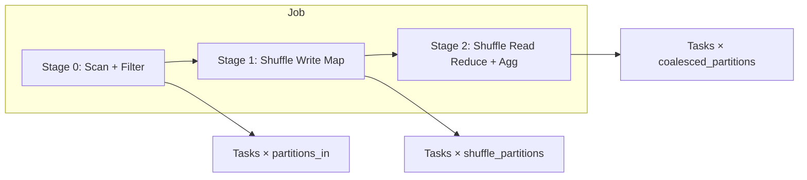

# System Design: Spark-Style Distributed Execution Engine

> **Focus areas:** Driver/executors · Stages/tasks · Shuffle read/write · DAG & task scheduling · Fault tolerance · Speculation · AQE · Memory management  
> **Style:** End-to-end execution engine design with progressive scale (1× → 10× → 100× → 1,000×)  
> **Quality bar:** Correct arithmetic on shuffle/task counts, explicit stage boundaries, honest recompute lineage model, failure-first reasoning on stragglers  
> **Interview theme:** Databricks — explain/design the runtime that turns a logical query plan into parallel tasks on a cluster, survives executor loss, and optimizes shuffle-heavy workloads at scale

---

## Table of Contents

1. [Clarify Requirements (Interview Q&A)](#1-clarify-requirements-interview-qa)
2. [Back-of-the-Envelope Estimation](#2-back-of-the-envelope-estimation)
3. [High-Level Design](#3-high-level-design)
4. [Architecture Diagram](#4-architecture-diagram)
5. [Design Deep Dive](#5-design-deep-dive)
6. [Wrap-Up](#6-wrap-up)
7. [Deeper / Related Interview Questions](#7-deeper--related-interview-questions)
8. [Appendices](#8-appendices)

---

## 1. Clarify Requirements (Interview Q&A)

Goal: **bound the execution engine**—not the full Databricks product. It is the subsystem that accepts a physical query plan (DataFrame/RDD lineage), cuts it into **stages** at **shuffle boundaries**, schedules **tasks** onto **executors**, manages **shuffle** I/O, recovers from **faults** via lineage recompute, and applies runtime optimizations (**AQE**, **speculation**).

### 1.0 What this is / is not

| Dimension | This doc | Not this |
|-----------|----------|----------|
| Job | Run analytical SQL/DataFrame job on shared cluster | ETL orchestration / SLAs (sibling) |
| API surface | Catalyst logical plan → physical plan → stages | Building SQL parser from scratch |
| Storage | HDFS/S3/ADLS block reads + shuffle files | Delta transaction protocol deep dive |
| Fault model | Lineage recompute + shuffle retry | Exactly-once distributed consensus per task |
| Scope | Spark-style DAG scheduler internals | Kubernetes control plane design |

### 1.1 Functional Requirements

| # | Question to ask | Expected / typical interviewer answer | Design implication |
|---|-----------------|----------------------------------------|--------------------|
| F1 | API? | DataFrame/Dataset (SQL); RDD legacy | Logical optimizer (Catalyst) + physical planner |
| F2 | Cluster manager? | YARN / Mesos / **K8s** / standalone | Resource offers → executor allocation |
| F3 | Partitioning? | Input splits + `repartition`/`coalesce` | Task count = partitions in stage |
| F4 | Stage boundaries? | **Wide** deps (shuffle) split stages | DAGScheduler builds stage graph |
| F5 | Shuffle? | Map writes partition files; reduce fetches | Shuffle write/read, block manager, external service |
| F6 | Scheduling? | Driver schedules tasks to executors | TaskScheduler, locality, fair/pool schedulers |
| F7 | Fault tolerance? | Recompute lost partitions from lineage | RDD lineage / Spark SQL checkpoint |
| F8 | Task retry? | Transient failure retry up to maxFailures | Stage resubmit on shuffle fetch fail |
| F9 | Speculation? | Duplicate slow straggler tasks | SpeculativeTaskScheduler hooks |
| F10 | Dynamic allocation? | Scale executors with pending tasks | Executor idle timeout + backlog signal |
| F11 | Memory? | Unified memory: storage vs execution | Spill to disk; OOM handling |
| F12 | Broadcast? | Small tables to all executors | Torrent broadcast; avoid driver OOM |
| F13 | AQE? | Runtime shuffle partition coalesce, skew join | Re-optimize between stages |
| F14 | UDF? | User code in executors | Serialization; deterministic requirement for retry |
| F15 | Cache/persist? | MEMORY/DISK levels | Block manager pin; LRU eviction |
| F16 | Barriers? | ML training sync stages | Barrier stage scheduling mode |
| F17 | Observability? | Spark UI: stages, tasks, shuffle metrics | Event log + listeners |

**MVP functional scope (lock with interviewer):**

1. **Driver** parses/plans query → builds **DAG of stages** with shuffle dependencies.
2. **DAGScheduler** submits **TaskSets** per stage; **TaskScheduler** launches tasks on **executors**.
3. **Executors** run tasks: read input/cache/shuffle → compute → write shuffle/output.
4. **Shuffle service** (internal or external) stores map output blocks; reduce tasks fetch remotely.
5. **Fault recovery:** retry failed task; if shuffle lost, rerun upstream stage; lineage recompute otherwise.
6. **Speculative execution** for tasks > median × threshold.
7. **Basic AQE:** coalesce shuffle partitions after map stage statistics.
8. **Spark UI** metrics: duration, shuffle read/write, spill, GC.

**Out of MVP (explicitly defer):**

- Photon/native vectorized engine full rewrite
- Disaggregated shuffle/storage compute separation at hyperscale
- GPU scheduling
- Perfect global optimal task placement (NP-hard)
- Cross-job distributed cache (Alluxio) as default

### 1.2 Non-Functional Requirements

| # | Question | Expected answer | Target |
|---|----------|-----------------|--------|
| N1 | Cluster size? | See scale table | Baseline **100 executors** |
| N2 | Job latency? | Interactive + batch mix | p50 stage time dominated by shuffle |
| N3 | Fault recovery? | Executor loss transparent if shuffle durable | Recompute ≤ failed stage + deps |
| N4 | Correctness? | Deterministic operators for retry | Same partition → same result |
| N5 | Multi-tenant fairness? | Pools / fair scheduler | No single job monopolizes cluster |
| N6 | Shuffle efficiency? | Minimize disk/network | Compression; push-based shuffle (advanced) |
| N7 | Driver stability? | No OOM on large plans | Avoid collect on big data |
| N8 | Utilization? | Dynamic allocation | Scale down idle executors |
| N9 | Straggler impact? | Speculation + AQE skew | p99 stage time < 3× p50 (goal) |
| N10 | Observability? | Task-level metrics export | OpenTelemetry / Prometheus optional |

### 1.3 Cases (Flows & Edge Cases)

**Happy paths**

1. Narrow transformations pipeline in single stage; tasks read HDFS splits locally; no shuffle.
2. `groupBy` → shuffle write → shuffle read → aggregate; all tasks complete; job succeeds.
3. Broadcast join: small dim collected once; fact tasks join locally; no shuffle on join.
4. Executor lost mid-stage: failed tasks retry on other executors; stage completes.
5. AQE coalesces 200 shuffle partitions to 40 after seeing map output sizes; faster reduce.

**Edge / failure cases**

| Case | Behavior |
|------|----------|
| Executor OOM | Spill first; if still OOM → task fail → retry with higher memory or repartition |
| Shuffle fetch failure | Retry fetch; if block lost → rerun map stage that produced block |
| Driver failure | **Job fails** unless checkpoint/recovery; cluster manager restarts app |
| Straggler task (skew) | Speculation launches duplicate; AQE may split skewed partition |
| Non-deterministic UDF | Retry may double side effects; document undefined behavior |
| Dynamic allocation thrash | Tune idle timeout; min executors; avoid scale to zero mid-shuffle |
| Disk full on executor | Shuffle write fails; fail task; alert; possibly exclude bad node |
| Speculation waste | Duplicate work on fast cluster; disable if CPU-bound |
| Barrier stage hang | All tasks must check in; straggler blocks barrier |
| Cache evicted mid-job | Recompute lineage for evicted partition |
| Push shuffle merge conflict | Fallback to sort-based shuffle |
| Whole-stage codegen bug | Disable codegen flag; fallback interpreted |

### 1.4 Scales (Progressive)

| Metric | Baseline (1×) | 10× | 100× | 1,000× |
|--------|---------------|-----|------|--------|
| Executors per cluster | 100 | 1,000 | 10,000 | 100,000 |
| Tasks per stage | 10K | 100K | 1M | 10M |
| Shuffle data per job | 1 TB | 10 TB | 100 TB | 1 PB |
| Concurrent jobs | 5 | 50 | 500 | 5,000 |
| Driver plan nodes | 500 | 5K | 50K | 500K (must simplify) |
| Block manager entries | 1M | 10M | 100M | 1B |
| Speculative tasks / job | ~50 | ~500 | ~5K | policy-limited |
| External shuffle service nodes | 0 (internal) | 10 | 100 | 1,000 |

**What each jump forces:**

- **10×:** External shuffle service; fair scheduler pools; AQE on by default; event log rolling.
- **100×:** Shuffle on dedicated SSD fleet; push-based shuffle; aggressive speculation tuning; driver plan pruning.
- **1,000×:** Disaggregated shuffle + compute; global quota service; preemption; columnar shuffle (advanced).

### 1.5 Scope repeat-back

> Design a **Spark-style distributed execution engine**: driver builds stage DAG at shuffle boundaries, schedules tasks to executors, manages shuffle blocks and fault recovery via **lineage recompute**, mitigates **stragglers** with **speculation** and **AQE**, and scales from ~100 executors to 100× / 1,000× with external shuffle and fair multi-tenant scheduling.

---

## 2. Back-of-the-Envelope Estimation

### 2.1 Split load classes

| Class | Baseline | 100× | Notes |
|-------|----------|------|-------|
| Task launches / job | ~10K tasks | ~1M tasks | Scheduler overhead matters |
| Shuffle write throughput | ~200 MB/s/executor | aggregate TB/s | Network + disk bound |
| HDFS/S3 read | ~500 MB/s/executor | parallelized | Locality helps |
| Driver scheduling loop | ~1K tasks/s capacity | must batch | Single driver bottleneck at extreme |
| Heartbeats | 100 executors × 1/3s | 10K × 1/3s | ~3K HB/s — manageable |
| Block manager RPCs | shuffle fetch storm | millions | External shuffle critical |

**Critical insight:** **Shuffle bytes × straggler factor** sets job time—not raw executor count alone.

### 2.2 Stage time model

```text
T_stage ≈ T_compute + T_shuffle_write + T_shuffle_read + T_spill + T_gc

Example stage (map-side):
  10K partitions, 1 TB input → ~100 MB/partition
  read 100 MB @ 200 MB/s local ≈ 0.5s
  compute 2× CPU ≈ 1s
  shuffle write 100 MB compressed @ 150 MB/s ≈ 0.7s
  → ~2.2s per task if balanced

If one partition 10 GB (skew):
  → 100× longer → 220s straggler → speculation + AQE required
```

### 2.3 Shuffle volume math

```text
Job: 500 GB fact join 10 GB dim (broadcast OK if dim fits)
  Without broadcast: shuffle both sides worst case ~510 GB written + read
  With broadcast: shuffle ~500 GB fact only (if hash repartition) or 0 (if already partitioned)

500 GB shuffle / 100 executors = 5 GB/executor average
At 150 MB/s effective → ~34s shuffle phase + skew tail
```

At **100×** (100 TB shuffle):

```text
Must have:
  - compression (snappy/lz4) ~2× reduction
  - AQE coalesce (2000 → 200 partitions)
  - external shuffle on NVMe fleet
  - avoid unnecessary shuffle via broadcast / bucket join
```

### 2.4 Task count & scheduling overhead

```text
Default spark.sql.shuffle.partitions = 200
Stage with 200 tasks, 100 executors → 2 waves
If each task 30s → stage ~60s

1M tasks/stage at 100×:
  Scheduler must batch; task binary reuse; avoid driver O(N) single-thread loop bottleneck
  Target ~10K concurrent tasks per cluster wave
```

### 2.5 Memory budget per executor

```text
Executor: 16 GB RAM, 4 cores
  spark.memory.fraction = 0.6 → 9.6 GB unified
  Execution pool vs storage pool shared dynamically
  Task working set 100 MB × 4 concurrent tasks = 400 MB compute
  Shuffle read buffer + aggregation hash table may spike 2–4 GB/task → spill if undersized

Rule: if spill bytes > 0 consistently → increase memory or repartition
```

### 2.6 Network

```text
100 executors, 1 TB shuffle, replication 1:
  Average egress per executor ~10 GB
  10 Gb NIC → 1.25 GB/s theoretical → ~8s if perfectly balanced (never is)

Skew: effective time dominated by max partition transfer
```

### 2.7 Bottlenecks (rank ordered)

1. **Shuffle I/O** (disk + network)  
2. **Skew / stragglers**  
3. **Driver** (scheduling, collect, broadcast too large)  
4. **GC pauses** on large heaps  
5. **Small tasks** overhead (task launch >> compute)  
6. **External storage read** without locality  
7. **Speculation overload** duplicating healthy work  

---

## 3. High-Level Design

### 3.1 Core abstractions

```text
LogicalPlan       → unresolved/resolved/analyzed/optimized (Catalyst)
PhysicalPlan      → SparkPlan nodes (Project, Filter, HashAggregate, ShuffleExchange)
RDD / ShuffleRDD  → lineage graph with dependencies (narrow vs wide)
Stage             → set of pipelined narrow ops ending at shuffle or result
Task              → unit of work on one partition in a stage
TaskSet           → all tasks for a stage submitted together
ShuffleHandle     → metadata for shuffle block locations
BlockManager      → memory/disk store for blocks, shuffle, broadcast
MapOutputTracker  → driver registry of map output locations
SchedulerBackend  → cluster-specific launch/kill executors
Speculation       → duplicate task if runtime > median × factor
```

### 3.2 Narrow vs wide transformations

| Type | Examples | Stage impact |
|------|----------|--------------|
| Narrow | map, filter, union (narrow), mapPartitions | Same stage (pipeline) |
| Wide | groupByKey, reduceByKey, join (non-broadcast), repartition | **New stage** (shuffle) |

**Interview line:** Stages are separated by **shuffle exchange** (or collecting output).

### 3.3 Driver components

```text
SparkContext / SparkSession
  ├── DAGScheduler        → stage graph, shuffle registration, stage retry
  ├── TaskScheduler       → taskSet submission, locality, speculation
  ├── SchedulerBackend    → YARN/K8s resource negotiation
  ├── Catalyst (SQL)      → analyzer, optimizer, physical planning
  └── MapOutputTrackerMaster → map output locations for reduce tasks
```

### 3.4 Executor components

```text
Executor
  ├── TaskRunner threads (spark.executor.cores)
  ├── BlockManager        → store, fetch remote blocks, unroll
  ├── CacheManager        → persist levels
  ├── ShuffleWriteProcessor / ShuffleReadProcessor
  └── Metrics / heartbeats to driver
```

### 3.5 Stage & task lifecycle

```text
1. Action triggers job (count, collect, write)
2. DAGScheduler creates stages in reverse topological order
3. Submit stage N (no missing shuffle deps)
4. TaskScheduler sends LaunchTask to executors
5. Tasks report Finished / Failed / FetchFailed
6. On stage success → submit stage N+1 consuming shuffle
7. Job complete when final stage done
```

### 3.6 Shuffle mechanics (sort-based)

```text
Map task:
  iterate partition → partition by key (hash/range)
  spill to disk if memory full (sorted files)
  merge spills → single map output file per reduce partition
  write index file (offsets per reducer partition)
  register MapStatus with driver (block sizes, location)

Reduce task:
  ask MapOutputTracker for locations
  fetch blocks via BlockManager (netty)
  merge sorted streams → aggregate
```

**External shuffle service:** map writes to external node; executors stateless; survives executor loss without rerun map if files durable.

### 3.7 Fault tolerance model

| Failure | Recovery |
|---------|----------|
| Task fail (non-fetch) | Retry task (new attempt) up to maxFailures |
| FetchFailed | Mark map stage invalid; rerun lost shuffle partitions |
| Executor lost | Requeue running tasks; relaunch if shuffle external |
| Driver lost | Application fails; rely on cluster restart policy |
| Stage abort | Cancel dependent tasks; resubmit stage |

**Lineage:** RDD remembers parent RDDs + compute function → recompute lost partition.

**Checkpoint:** truncate lineage to reliable storage (expensive; cuts recovery cost).

### 3.8 Speculative execution

```text
if task.runtime > median(stage) * spark.speculation.multiplier (default 1.5)
  and fewer than spark.speculation.quantile (default 0.75) tasks done
  → launch duplicate task on another executor
first successful attempt wins; kill loser
```

**Risk:** non-idempotent side effects; wasted CPU on healthy clusters.

### 3.9 Adaptive Query Execution (AQE)

| Rule | Trigger | Action |
|------|---------|--------|
| Coalesce partitions | map stats show small partitions | Reduce shuffle partition count before reduce |
| Skew join | join key stats skewed | Split heavy key; replicate other side |
| Switch join strategy | runtime stats | Broadcast if one side small enough |

AQE runs **between stages** when map statistics available.

### 3.10 Dynamic allocation

```text
if pending tasks > executors × cores and below maxExecutors:
  request new executors from cluster manager
if executor idle > spark.dynamicAllocation.executorIdleTimeout:
  remove executor (if no cached blocks or migrate)
```

**Deal-breaker:** scale to zero during shuffle-heavy job → thrash.

### 3.11 Memory management (Unified Memory)

```text
Storage memory (cache) ←→ Execution memory (shuffle, agg, sort)
  eviction: storage evicted before spilling execution if needed
Spill: sort/shuffle/agg to disk when execution pool full
Off-heap optional for cache/shuffle (advanced)
```

### 3.12 Scheduling & locality

| Level | Description |
|-------|-------------|
| PROCESS_LOCAL | Same JVM as cached/input block |
| NODE_LOCAL | Same host |
| RACK_LOCAL | Same rack |
| ANY | Remote fetch |

Delay scheduling: wait briefly for locality before launching ANY.

### 3.13 Trade-off tables

| Concern | Choice | Why | Deal-breaker |
|---------|--------|-----|--------------|
| Shuffle | Sort-based + compression | Mature | Uncompressed giant shuffle |
| Join | Broadcast small dim | Avoid shuffle | Broadcast 10 GB table |
| Faults | Lineage recompute | General | Assume no executor loss |
| Stragglers | Speculation + AQE | Tail latency | Infinite speculation |
| Partitions | AQE coalesce | Right-size | Fixed 10 partitions on 1 TB |
| Driver | Avoid collect | Stability | collect 1B rows |
| Multi-tenant | Fair pools | Isolation | FIFO one giant job |

---

## 4. Architecture Diagram

### 4.1 Cluster overview

```text
                         +---------------------+
                         | Cluster Manager     |
                         | (YARN / K8s)        |
                         +----------+----------+
                                    |
                    +---------------+---------------+
                    |                               |
                    v                               v
           +----------------+              +----------------+
           | Driver JVM     |              | Executor pods  |
           | DAGScheduler   |   RPC        | (× N)          |
           | TaskScheduler  |<------------>| Task threads   |
           | Catalyst       |              | BlockManager   |
           +--------+-------+              +--------+-------+
                    |                               |
                    |         shuffle blocks        |
                    v                               v
           +----------------+              +----------------+
           | MapOutputTracker              | Local disks    |
           | (driver master)  |            | (map output)   |
           +----------------+              +----------------+
                    |
                    v
           +----------------+     optional
           | External       |
           | Shuffle Service|
           +----------------+
                    |
                    v
           +----------------+
           | Object storage |
           | / HDFS input   |
           +----------------+
```

### 4.2 Mermaid: job → stages → tasks



### 4.3 Sequence: join with broadcast

```text
Driver                Executor E1              Executor E2
  |--plan broadcast join->|                      |
  |--broadcast dim------------------------------>|
  |--broadcast dim------>|                      |
  |--launch fact tasks-->|                      |
  |                      |--local hash join---->|
  |<-task finished-------|                      |
  |--launch more tasks------------------------->|
```

### 4.4 Sequence: fetch failure → stage rerun

```text
Reduce Task R5                     Executor E2 (map)
  |--fetch block b7---------------->|
  |<-FetchFailed (executor lost)----|
  |--report FetchFailed to driver->|
Driver DAGScheduler:
  mark Stage Map as missing shuffle outputs
  resubmit Stage Map tasks for partition 7 (or whole stage)
  on success → retry Reduce Task R5
```

### 4.5 Sequence: speculation

```text
Task T3 on E1 running 120s (median 40s)
Driver Speculator:
  launch T3' on E7
T3' finishes in 45s → mark T3 success, kill T3 on E1
```

### 4.6 AQE coalesce (between stages)

```text
Stage 1 completes → statistics: 200 partitions, avg 5 MB, max 8 MB
AQE rule: coalesce to 40 partitions (target ~256 MB)
Stage 2 scheduled with 40 reduce tasks instead of 200
```

---

## 5. Design Deep Dive

### 5.1 Reliability invariants

1. **Deterministic task output** for pure transformations (retry-safe).  
2. **Shuffle block integrity:** reduce fetches correct map output or fails fetch.  
3. **Single successful task attempt** recorded per (stage, partition, attempt).  
4. **Stage DAG acyclic** with clear shuffle dependencies.  
5. **Driver is single point of scheduling truth** (not of data).  
6. **Speculation:** first success wins; losers cancelled.  
7. **Barrier stages:** all tasks must complete before next wave.  
8. **Broadcast immutable** for job lifetime once published.

### 5.2 Failure modes & mitigations

| Failure | Mitigation |
|---------|------------|
| Executor OOM | Increase memory; repartition; AQE coalesce; Kryo serializer |
| Driver OOM (plan) | Simplify plan; split job; avoid huge collect |
| Shuffle disk full | Exclude node; external shuffle; increase disk |
| Straggler (skew) | AQE skew join; salt keys; increase partitions |
| Scheduler hotspot | Spread tasks; fair pools; open more executors |
| Network partition | Task timeout; retry; exclude flaky node |
| Corrupt shuffle block | Checksum; rerun map task |
| Non-deterministic UDF | Document; use mapPartitions with care; no retry side effects |
| Dynamic alloc thrash | Set minExecutors; longer idle timeout during shuffle |
| GC pause tail | G1GC tuning; smaller heap per executor more instances |

### 5.3 Scalability

| Scale | Architecture moves |
|-------|--------------------|
| 1× | Internal shuffle; 200 default partitions; speculation on |
| 10× | External shuffle service; fair scheduler pools; AQE defaults |
| 100× | Push-based shuffle; columnar shuffle (engine-specific); driver HA research |
| 1,000× | Disaggregated shuffle fleet; global admission control; preemption |

### 5.4 Progressive scale playbook

**1× — MVP cluster**

```text
100 executors × 4 cores × 16 GB
spark.sql.shuffle.partitions = 200
spark.speculation = true
Internal shuffle on local SSD
Dynamic allocation min 20 max 100
```

**10×**

- External shuffle service (ESS) on dedicated nodes.  
- `spark.sql.adaptive.enabled = true` (AQE).  
- Fair scheduler pools: `production`, `adhoc`.  
- Event log to object storage for Spark History Server.

**100×**

- Shuffle on NVMe; separate network fabric for shuffle.  
- Push shuffle merge to reduce mapper reducer connection count.  
- Cap tasks/stage via coalesce; avoid 1M tiny tasks.  
- Driver overhead: client mode vs cluster mode; consider SQL gateway separating planning.

**1,000×**

- Disaggregated compute/storage shuffle (remote shuffle service at scale).  
- Global quota + job admission before DAGScheduler runs.  
- Auto-tune shuffle partitions from historical stats per query signature.

### 5.5 Catalyst optimizer (SQL path)

```text
Unresolved SQL → Analyzer (resolve relations/columns)
  → Optimizer (predicate pushdown, constant fold, join reorder)
  → Physical planning (choose join algorithms, exchanges)
  → Preparation rules (AQE inserts shuffle, broadcast hints)
  → Executed as RDD ops / whole-stage codegen pipelines
```

**Whole-stage codegen:** fuse operators into single Java function per stage → less virtual call overhead.

### 5.6 Join strategies

| Strategy | Condition | Shuffle |
|----------|-----------|---------|
| Broadcast hash join | Build side < autoBroadcastThreshold | None on join |
| Shuffle hash join | Large-large equi-join | Both sides shuffled |
| Sort-merge join | Large-large | Shuffle + sort |
| Broadcast nested loop | Non-equi small | None |

**Skew join (AQE):** detect heavy keys; split into sub-partition + replicate matching build rows.

### 5.7 Block manager deep dive

```text
Storage:
  MEMORY_AND_DISK → spill to disk on eviction
  OFF_HEAP → direct memory

Shuffle blocks:
  temp files on executor disk (internal) OR ESS remote

Fetch:
  remote netty stream → decompress → aggregate iterator

Eviction:
  LRU among storage blocks; shuffle blocks freed after reduce consumed
```

### 5.8 Broadcast implementation

```text
Driver serializes small table → TorrentBroadcast (BitTorrent-like among executors)
Executors fetch pieces from each other + driver
Avoid single driver egress bottleneck for large broadcasts (still must fit memory)
```

**Deal-breaker:** `collect()` 5 GB table to driver → OOM.

### 5.9 Barrier execution mode

```text
Use for ML synchronisation (allReduce-like)
Tasks in barrier stage start together; all must finish before next barrier
Straggler blocks entire training step
Mitigation: dedicated pools; faster hardware; algorithmic tolerance
```

### 5.10 Multi-tenant fairness

```text
Fair Scheduler pools:
  pool.production.weight = 3
  pool.adhoc.weight = 1
Within pool: FIFO or fair share across jobs
Spark on K8s: namespace quotas + pod priority classes
```

### 5.11 Observability

```text
Spark UI: Stages tab → shuffle read/write, spill, task timeline
Metrics: executor CPU, GC time, shuffle bytes
Event log JSON for History Server replay
Custom listener: export to Prometheus/OpenTelemetry

Key alerts:
  stage_duration_p99 / p50 > 5
  fetch_failed_rate > 0
  speculation_success_rate high → chronic skew
  driver_heap_usage > 80%
```

### 5.12 Deal-breakers

| Temptation | Failure |
|------------|---------|
| "No recompute; cache everything" | Executor loss loses cache; lineage exists for reason |
| "Infinite executors fixes skew" | One fat partition still straggles |
| "collect for join" | Driver OOM |
| "Disable speculation always" | Tail latency under skew |
| "One partition to rule them all" | No parallelism |
| "200 partitions for 10 TB always" | Tiny tasks or huge tasks — use AQE/stats |
| "Retry non-deterministic UDF safely" | Wrong duplicates |

### 5.13 Interaction with lakehouse reads

```text
Delta/Parquet scan → splits by file blocks (input partitions)
Filter pushdown + column pruning reduces IO
Bucketed table on join key → avoid shuffle if matching bucket count
Z-order stats → skip files via data skipping
Execution engine still responsible for scheduling scan tasks + shuffle for agg
```

---

## 6. Wrap-Up

### 6.1 Design summary

- **Driver** plans query → **stages** at shuffle → **tasks** per partition.  
- **Executors** pipeline narrow ops; **shuffle** separates map/reduce stages.  
- **Faults:** retry tasks; **FetchFailed** reruns map stage; **lineage** recomputes otherwise.  
- **Stragglers:** **speculation** + **AQE** skew/coalesce rules.  
- **Scale** via external shuffle, right-sized partitions, fair pools—not infinite task count.

### 6.2 MVP vs later

| MVP | Later |
|-----|-------|
| Internal shuffle | External shuffle service |
| Fixed shuffle partitions | Full AQE + historical tuning |
| Fair scheduler pools | Global admission + preemption |
| Spark UI | Distributed tracing |
| Sort shuffle | Push + columnar shuffle |

### 6.3 Top risks

1. Skew dominating stage runtime  
2. Driver bottleneck on huge plans or collects  
3. Shuffle disk/network exhaustion  
4. Dynamic allocation thrash  
5. Non-deterministic UDFs under retry  

### 6.4 45-minute interview plan

| Min | Focus |
|-----|-------|
| 0–5 | Scope: execution engine vs ETL vs storage |
| 5–12 | Estimation: shuffle TB, tasks, straggler math |
| 12–25 | HLD: driver/executor, stages, shuffle |
| 25–35 | Faults, fetch failed, speculation, AQE |
| 35–45 | Scale 10×/100×, deal-breakers |

### 6.5 Closer

> A **Spark-style engine** cuts the physical plan at **shuffle exchanges** into **stages**, runs **tasks** in parallel on **executors**, and recovers via **lineage** and **stage rerun** when shuffle blocks vanish. **AQE** and **speculation** attack skew and tail latency; **external shuffle** and **fair scheduling** carry you to 100× without pretending one giant partition can scale forever.

---

## 7. Deeper / Related Interview Questions

### 7.1 Stages & tasks

**Q: Narrow vs wide dependency?**  
A: Narrow: each parent partition used by at most one child partition (map). Wide: multiple children depend on parent (shuffle). Wide cuts stages.

**Q: How many tasks in a stage?**  
A: Number of partitions in the RDD/DataFrame at that point (subject to AQE coalesce).

**Q: Can one stage have mixed shuffle and scan?**  
A: Pipeline narrow ops in same stage until shuffle exchange; scan+filter+map pre-shuffle is one stage.

### 7.2 Shuffle

**Q: Sort vs hash shuffle?**  
A: Modern Spark uses sort-based shuffle (map side sort/spill); hash shuffle legacy.

**Q: External shuffle service benefit?**  
A: Map outputs survive executor loss; stateless executors; disk on dedicated nodes.

**Q: Push-based shuffle?**  
A: Mappers push merge chunks to reducers (or merge servers) reducing fetch connection fan-in.

### 7.3 Fault tolerance

**Q: RDD lineage vs checkpoint?**  
A: Lineage recompute chain; checkpoint to reliable FS truncates lineage for long chains.

**Q: What if driver dies?**  
A: Job lost unless cluster mode with checkpoint recovery (limited); driver is SPOF for job state.

**Q: FetchFailed handling?**  
A: DAGScheduler marks map stage incomplete; resubmit missing partitions; then retry reduce.

### 7.4 Speculation

**Q: When disable speculation?**  
A: Non-deterministic tasks; extremely CPU-bound where waste hurts; tasks with side effects.

**Q: Speculation vs recompute?**  
A: Speculation duplicates slow **running** task; recompute happens after **failure** or lost shuffle.

### 7.5 AQE

**Q: What stats needed?**  
A: Map output size per partition; row counts; skew metrics from sample or runtime.

**Q: Coalesce vs repartition?**  
A: Coalesce reduces without full shuffle (narrow); repartition always shuffles (wide).

**Q: Broadcast join threshold?**  
A: `spark.sql.autoBroadcastJoinThreshold` default ~10 MB; AQE can convert at runtime if stats show small.

### 7.6 Memory

**Q: Memory fractions?**  
A: Unified memory manager splits storage vs execution dynamically within `spark.memory.fraction`.

**Q: Spill to disk?**  
A: When execution memory pressure during sort/agg/shuffle; hurts perf but prevents OOM.

### 7.7 Scheduling

**Q: FIFO vs fair?**  
A: FIFO one job blocks cluster; fair shares pools/ jobs.

**Q: Data locality?**  
A: Prefer PROCESS_LOCAL/NODE_LOCAL; delay scheduling before going ANY.

### 7.8 Comparison

**Q: MapReduce vs Spark?**  
A: MR materializes every shuffle to HDFS; Spark pipelines narrow ops in memory/disk shuffle; lineage reuse.

**Q: Flink vs Spark batch?**  
A: Flink streaming-first; Spark structured streaming micro-batch shares same engine; batch = many Spark stages.

**Q: Databricks Photon?**  
A: Native vectorized engine replacing JVM bytecode for scan/agg hot paths — same scheduler shell.

### 7.9 Interview traps

| Trap | Strong answer |
|------|---------------|
| "Shuffle-free join always" | Large-large requires shuffle or bucket alignment |
| "Driver distributes data" | Executors read/shuffle; driver schedules |
| "Task failure = job failure" | Retry until maxFailures |
| "More partitions always faster" | Overhead dominates; AQE coalesce |
| "Speculation fixes skew alone" | Need AQE skew join / salting |
| "Broadcast any dim under 1 GB" | Must fit executor memory safely |

### 7.10 Metrics drill

| Metric | Interpretation |
|--------|----------------|
| shuffleBytesWritten | Join/agg cost |
| shuffleFetchWaitTime | Network/straggler |
| spill (memory/disk) | Undersized exec memory |
| taskDuration skew | Hot partition |
| speculationSummary | Tail problem indicator |
| executorGcTime | Heap tuning needed |

---

## 8. Appendices

### 8.1 Pseudocode — DAGScheduler stage submission

```text
function submitJob(rdd, finalAction):
  stages = getOrCreateStageGraph(rdd, finalAction)
  activeJob = new Job(stages)
  for stage in stages.reverseTopologicalOrder():
    if stage.missingParentStages.nonEmpty:
      wait(parentComplete)
    else:
      submitStage(stage)

function submitStage(stage):
  taskSet = createTaskSet(stage, numPartitions=stage.rdd.partitions.length)
  taskScheduler.submitTasks(taskSet)
  stage.status = RUNNING

on TaskEnded(result):
  if result.success:
    markPartitionComplete(stage, partition)
    if allPartitionsComplete(stage):
      stage.status = COMPLETE
      submitDependentStages(stage)
  else if result.fetchFailed:
    markMapStageShuffleLost(result)
    resubmitMapStage()
  else:
    if attempts < maxFailures: retryTask()
    else: failJob()
```

### 8.2 Pseudocode — speculation

```text
function maybeSpeculate(taskSet):
  median = medianRuntime(completedTasksInStage)
  threshold = median * speculationMultiplier
  for t in runningTasks:
    if t.runtime > threshold and not t.speculativeCopyLaunched:
      launchCopy(t, excludeExecutor=t.executorId)
```

### 8.3 Pseudocode — map side shuffle write (simplified)

```text
function runMapTask(records, partitioner):
  writers = array[numReducePartitions]
  for record in records:
    p = partitioner.getPartition(record.key)
    writers[p].append(record)
    if memoryFull(): spillWritersToDisk()
  commitAllWriters()  // index + data file
  registerMapOutputWithDriver(status)
```

### 8.4 Pseudocode — AQE coalesce rule

```text
function onStageCompleted(mapStageStats):
  if not adaptiveEnabled: return
  avgSize = mapStageStats.avgBytesPerPartition
  targetSize = 256 MB
  newNum = max(1, totalBytes / targetSize)
  if newNum < currentShufflePartitions:
    updateShufflePartitionCount(nextStage, newNum)
```

### 8.5 Configuration cheat sheet

```text
spark.executor.cores = 4
spark.executor.memory = 16g
spark.sql.shuffle.partitions = 200   # starting point; AQE adjusts
spark.sql.adaptive.enabled = true
spark.speculation = true
spark.speculation.multiplier = 1.5
spark.task.maxFailures = 4
spark.reducer.maxSizeInFlight = 96m
spark.shuffle.service.enabled = true   # external shuffle
spark.dynamicAllocation.enabled = true
spark.dynamicAllocation.minExecutors = 10
spark.dynamicAllocation.maxExecutors = 1000
spark.sql.autoBroadcastJoinThreshold = 10m
```

### 8.6 Glossary

| Term | Meaning |
|------|---------|
| Stage | Pipeline of narrow ops ending at shuffle or result |
| Task | Work on one partition in a stage |
| Shuffle exchange | Wide dependency redistributing data by key |
| Lineage | Graph to recompute RDD partition |
| BlockManager | Executor component storing/cache/shuffle blocks |
| MapStatus | Driver record of map output size/location |
| FetchFailed | Reduce couldn't read map output → rerun map |
| AQE | Adaptive Query Execution — runtime replanning |
| ESS | External Shuffle Service |

### 8.7 Stage graph example (SQL)

```sql
-- SELECT customer_id, SUM(amount) FROM orders JOIN dim USING (customer_id) GROUP BY customer_id

Physical plan (conceptual):
  Scan orders ----\
                   ShuffleExchange (hash customer_id) --> HashAggregate --> Result
  Scan dim --------/          ^
                              BroadcastExchange if dim small (no shuffle on dim)
```

Stages if no broadcast: Stage 0 shuffle write orders + dim → Stage 2 shuffle read + aggregate.

### 8.8 Memory diagram (executor)

```text
+------------------- Executor JVM ------------------+
| Reserved (user, overhead)                          |
| +-----------------------------------------------+ |
| | Unified Memory (0.6 × heap)                   | |
| |  Storage ←——→ Execution                       | |
| |  (cache)      (shuffle, sort, agg)            | |
| +-----------------------------------------------+ |
| Spill files on local disk                         |
+---------------------------------------------------+
```

### 8.9 Interview "say this" (60 seconds)

> The **driver** turns SQL into a physical plan and cuts it into **stages** at every **shuffle exchange**. Each stage launches **tasks**—one per partition—on **executors**. Map tasks **write shuffle files**; reduce tasks **fetch** and aggregate. If a task fails, we **retry**; if shuffle data is lost, we **rerun the map stage**. **Lineage** recomputes RDD partitions otherwise. **Speculation** duplicates straggler tasks; **AQE** coalesces partitions and handles **skew joins** using runtime stats. At scale, **external shuffle** and **fair pools** matter as much as executor count.

### 8.10 Reliability test plan

1. Kill executor during map shuffle write → stage retries; job succeeds.  
2. Kill executor during reduce fetch → FetchFailed → map stage rerun.  
3. Introduce skew key → speculation + AQE reduce tail (measure p99).  
4. Driver survives no collect; job with 10 TB shuffle completes.  
5. Dynamic allocation: cluster scales up on backlog, down after idle.  
6. Broadcast join under threshold → no shuffle exchange in plan.  
7. Non-deterministic UDF: document duplicate attempt risk.

### 8.11 Unit check reminders

```text
1 TB shuffle / 200 partitions ≈ 5 GB/partition average (watch max!)
100 executors × 4 cores = 400 concurrent task slots
10K tasks / 400 slots = 25 waves; if 10s/task → 250s stage minimum
1M tasks → scheduling overhead dominates unless batches/coalesced
```

### 8.12 Related systems map

```text
SQL/DataFrame API → Catalyst optimizer → Physical plan
       ↓
DAGScheduler (stages) → TaskScheduler (tasks) → Executors
       ↓
Shuffle (internal/ESS) ← BlockManager → Storage (HDFS/S3/Delta)
       ↓
Metrics → Spark UI / History Server
```

---

*End of Spark-style distributed execution system design.*
