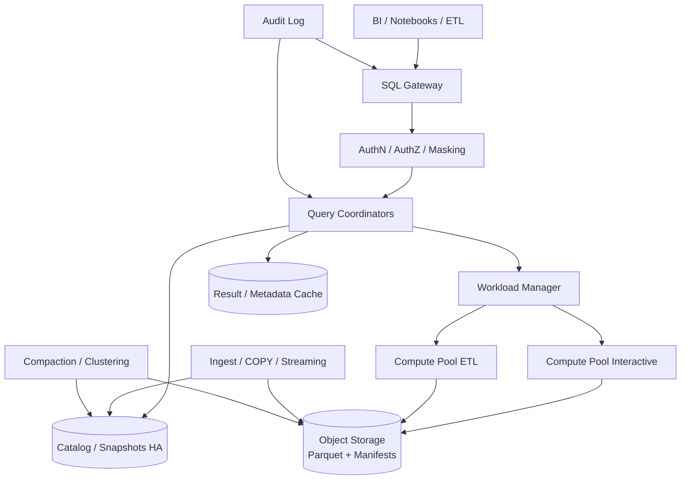
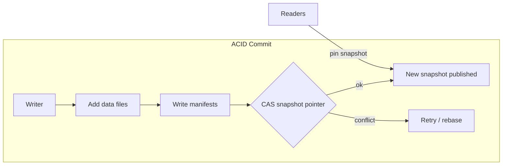

# System Design: Analytics Warehouse

> **Focus areas:** Ingestion · Storage formats · Separated storage/compute · Catalog · Query · Governance · Cost  
> **Style:** End-to-end product design with progressive scale (10× → 100× → 1,000×)  
> **Quality bar:** Correct arithmetic, explicit invariants, honest MVP vs extreme-scale paths, failure-first reasoning  
> **Interview theme:** Data platform — cloud analytics warehouse (Snowflake/BigQuery/Redshift-class)

---

## Table of Contents

1. [Clarify Requirements (Interview Q&A)](#1-clarify-requirements-interview-qa)
2. [Back-of-the-Envelope Estimation](#2-back-of-the-envelope-estimation)
3. [High-Level Design](#3-high-level-design)
4. [Architecture Diagram](#4-architecture-diagram)
5. [Design Deep Dive](#5-design-deep-dive)
6. [Wrap-Up](#6-wrap-up)
7. [Deeper / Related Interview Questions](#7-deeper--related-interview-questions)

---

## 1. Clarify Requirements (Interview Q&A)

Design an **analytics warehouse**: durable structured data lake/warehouse storage, elastic SQL query compute, metadata catalog, governed multi-tenant access, and cost-efficient scanning of large historical datasets.

### 1.0 What this is / is not

| Dimension | This is | This is not |
|-----------|---------|-------------|
| Job | Analytical SQL over large datasets (OLAP) | OLTP transactions / low-latency CRUD |
| Latency | Seconds to minutes for heavy queries | Sub-10ms point lookups as primary |
| Storage | Columnar, append-heavy, partitioned | Row-store normalized 3NF only |
| Users | Analysts, BI, data scientists, ELT jobs | End-user product checkout path |
| Model | Separated storage & compute (modern) | Only SMP appliance in one box |

### 1.1 Functional Requirements

| # | Question to ask | Expected / typical interviewer answer | Design implication |
|---|-----------------|----------------------------------------|--------------------|
| F1 | Workloads? | Ad-hoc SQL, BI dashboards, ELT transforms, scheduled reports | Workload isolation / queues |
| F2 | Ingestion? | Batch loads + streaming microbatches | Copy/LOAD + continuous ingest |
| F3 | Table formats? | Columnar files + open table format (Iceberg/Delta/Hudi) | ACID metadata layer |
| F4 | SQL dialect? | ANSI subset + warehouse extensions | Parser/planner compatibility goals |
| F5 | Concurrency? | Hundreds–thousands of queries | Elastic compute pools; admission control |
| F6 | Multi-tenant? | Yes — orgs/projects with isolation | Resource monitors; data sharing controls |
| F7 | Time travel? | Yes — query as-of version/time | Snapshot isolation in table format |
| F8 | Semi-structured? | JSON/VARIANT columns | Columnar encoding + path pruning |
| F9 | Governance? | RBAC/ABAC, column masking, audit | Policy engine in query path |
| F10 | Materialized views? | Yes Phase 1.5 | Incremental maintenance service |
| F11 | Data sharing? | Secure shares across tenants | Zero-copy pointers + authZ |
| F12 | UDFs? | Python/JS later | Sandboxed execution |
| F13 | Transactions? | Snapshot ACID for tables; multi-statement TX limited | Table-format commits |
| F14 | Ecosystem? | BI tools via JDBC/ODBC/Arrow Flight | Stable wire protocol |

**MVP scope:**

1. `CREATE TABLE` / `COPY INTO` / `INSERT` into columnar tables in object storage.
2. Catalog (DB → schema → table → snapshot).
3. SQL query: scan → filter → project → agg → join with MPP engine.
4. Partition / clustering pruning; compression.
5. RBAC + basic audit logs.
6. Elastic compute warehouses/pools sized independently of storage.
7. Time travel for N days.

**Out of MVP:**

- Full stored-procedure language
- Unbounded multi-table interactive notebooks product
- Cross-cloud active-active single metastore
- Sub-second dashboard semantic layer (can cache separately)

### 1.2 Non-Functional Requirements

| # | Question | Expected answer | Target |
|---|----------|-----------------|--------|
| N1 | Query latency | Interactive BI | p50 small queries < 3–10s; heavy OK minutes |
| N2 | Ingest throughput | ELT windows | GB–TB/hour per pipeline scalable |
| N3 | Availability | Business critical daytime | 99.9% control + query accept |
| N4 | Durability | Primary analytical store | 11.9s style object storage + metadata HA |
| N5 | Consistency | Snapshot reads | Readers never see partial commits |
| N6 | Isolation | Tenant noisy-neighbor control | Separate compute; storage ACL |
| N7 | Cost | Pay for scan/compute | Pruning + caching mandatory |
| N8 | Scalability | Storage near infinite | Object store; compute elastic |

### 1.3 Cases

**Happy paths**

1. Nightly ELT loads fact table partitions; morning dashboards hit clustered recent data.
2. Analyst ad-hoc joins facts+dims with result cache hit on repeat.
3. Streaming microbatch lands every 1–5 min; snapshot advances.
4. Time travel debug: `SELECT ... AS OF TIMESTAMP`.
5. Admin grants role; column mask hides PII from junior analysts.

**Edge / failure cases**

| Case | Behavior |
|------|----------|
| Huge fanout join without prune | Admission control; cost predictor kill; suggest rewrite |
| Small files storm | Compaction service; ingest guidelines |
| Metastore outage | Fail closed new commits; reads of cached metadata limited |
| Skewed join key | Skew-aware shuffle / broadcast hints |
| Concurrent writers | Optimistic conflict; retry / serialize on same partition |
| Ransomware / bad DROP | Undrop + time travel + MFA for destructive DDL |
| Query spills to disk | Graceful spill; slower; alert |
| Cross-tenant probe | AuthZ deny; audit |

### 1.4 Scales

| Metric | Baseline | 10× | 100× | 1,000× |
|--------|----------|-----|------|--------|
| Stored data (compressed) | 100 TB | 1 PB | 10 PB | 100 PB |
| Tables | 5K | 30K | 200K | 1M+ |
| Queries/day | 100K | 1M | 10M | 100M |
| Concurrent queries | 200 | 1K | 5K | 20K+ |
| Ingest bytes/day | 5 TB | 50 TB | 500 TB | 5 PB |
| Peak scan bytes/s | 10 GB/s | 100 GB/s | 1 TB/s | 10 TB/s |
| Tenants | 50 | 200 | 2K | 20K |
| Metadata QPS | 1K | 10K | 50K | 200K |

**What each jump forces:**

- **10×:** Mandatory pruning, result cache, separate ingest vs query pools.
- **100×:** Table format compaction at scale; metastore sharding; adaptive execution.
- **1,000×:** Cell/region data gravity; hierarchical catalogs; aggressive materialized accelerations; spot/preemptible compute.

### 1.5 Etc.

- **Cloud object store** as durable baseline (S3/GCS/Azure Blob).
- **Open table formats** preferred for interoperability.
- **Repeat-back:**  
  > Cloud analytics warehouse with separated storage/compute, ACID table snapshots, elastic MPP SQL, governance, and progressive scale from 100 TB to 100 PB.

---

## 2. Back-of-the-Envelope Estimation

### 2.1 Storage

```text
Raw events 50 TB/day → columnar + compress ≈ 5–10× → 5–10 TB/day compressed
3 years ≈ 5 TB × 365 × 3 ≈ 5.5 PB (order-of; depends on retention tiers)

100 TB baseline compressed today → plan metadata + manifests carefully early
```

### 2.2 Query scan math

```text
Fact table 20 TB compressed; bad query scans 100% → expensive
With date partition + min/max stats, dashboard scans 50 GB → 400× cheaper
At $X/TB scanned, pruning is a product feature not a nicety
```

### 2.3 Throughput

```text
Baseline peak scan 10 GB/s
If worker delivers 200 MB/s useful → need ~50 workers concurrently for that query
100× → thousands of workers across many queries → autoscaling pools
```

### 2.4 Metadata size

```text
1M files × 500B manifest entries ≈ 500 MB manifests (small)
At 100 PB with tiny files (64MB): 100e15 / 64e6 ≈ 1.56e9 files → **billions**
→ File size policy + hierarchical manifests + compaction critical
```

### 2.5 Load classes

| Class | What | Baseline | Plane |
|-------|------|----------|-------|
| A | Metadata ops | 1K QPS | Catalog DB |
| B | Ingest commits | tens–hundreds/s | Catalog + object PUT |
| C | Query coordination | hundreds | Coordinators |
| D | Scan I/O | 10 GB/s | Object store |
| E | Shuffle | bursty | Worker network |
| F | Result cache | high hit | Redis/local |

### 2.6 Cache

| Cache | Content | Effect |
|-------|---------|--------|
| Result cache | Fingerprint(SQL+schema+snapshot) | Repeat BI |
| Metadata cache | Table snapshots, stats | Planner |
| Data cache | Hot Parquet footers/row groups | Scan cut |
| Materialized views | Pre-agg | Dashboards |

---

## 3. High-Level Design

### 3.1 Core principles

1. **Durable data in object storage**; compute ephemeral.
2. **ACID via metadata commits** (snapshots), not via rewriting whole datasets blindly.
3. **Pushdown & pruning** beat brute force.
4. **Workload isolation** via compute pools / warehouses.
5. **Governance in the query path**, not only perimeter.

### 3.2 Logical architecture

```text
Clients (BI / SQL / Jobs)
    ↓
Gateway (auth, routing, session)
    ↓
Coordinator (parse, analyze, optimize, schedule)
    ↓
Workers (scan, filter, agg, join, shuffle)
    ↓
Object Storage (Parquet/ORC + table metadata)
    ↑
Catalog Service (namespaces, RBAC, commits)
    ↑
Ingest Services (COPY, streaming, pipes)
```

### 3.3 Table format & commits

```text
Object storage:
  data/....parquet
  meta/snap-000123.json
  meta/manifest-*.avro

Commit:
  write data files (immutable)
  write manifests
  CAS update branch pointer (main) to new snapshot
Readers pin snapshot id at query start
```

**Conflict:** two writers commit same partition → one wins CAS; loser retries.

### 3.4 Data model / catalog

```text
Organization
  └── Warehouse / Project
        └── Database
              └── Schema
                    └── Table
                          ├── Columns + types + masks
                          ├── Partition spec
                          ├── Sort / cluster keys
                          └── Snapshots[]
```

### 3.5 SQL execution pipeline

```text
Parse → Analyze (bind, authz) → Optimize (RBO+CBO)
  → Physical plan (scan ranges)
  → Schedule fragments to workers
  → Execute (vectorized) → Shuffle as needed
  → Finalize results → optional cache
```

**CBO inputs:** table stats, column NDV, min/max, histograms; correlate with runtime adaptive execution.

### 3.6 Ingestion paths

| Path | Mechanism | Use |
|------|-----------|-----|
| COPY/LOAD | Bulk files → plan → commit | Nightly ELT |
| Streaming | Microbatch every N seconds | Near-real-time |
| CDC merge | Dedup by PK + sequence | Mutable dims |
| External tables | Query in-place lake | Migration |

### 3.7 APIs (control + data)

| Interface | Purpose |
|-----------|---------|
| SQL session | Primary |
| JDBC/ODBC/Arrow Flight | Tools |
| REST catalog | Tables, grants, clones |
| Ingest pipes API | Continuous load configs |

### 3.8 Option analysis

#### A. Storage/compute coupling

| Option | Pros | Cons | Deal-breaker |
|--------|------|------|--------------|
| **Separated (object + MPP)** | Elastic, cheap store | Latency variability | — modern default |
| Coupled appliance | Predictable LAN | Scale/cost walls | Cloud-first 100× PB |
| Query-over-OLTP replica | Simple | Hurts prod; limited history | Serious analytics |

#### B. Metastore

| Option | Pros | Cons | Deal-breaker |
|--------|------|------|--------------|
| **HA KV + strongly consistent catalog** | Scales commits | Complex | Single fat Postgres at 1,000× unsharded |
| Hive Metastore only | Compatible | Weak for ACID | Sole system for concurrent writers |
| Per-table in object store root | Open | Listing storms | No global catalog features |

#### C. File format

| Option | Pros | Cons |
|--------|------|------|
| **Parquet** | Ubiquitous, columnar | — |
| ORC | Strong in Hive | Ecosystem |
| Proprietary | Perf tricks | Lock-in |

### 3.9 Workload management

```text
Resource monitor:
  credits / hour / tenant
  max concurrency
  max spill
Queues: interactive | etl | background
Admission: cost estimate × priority
```

### 3.10 Trade-offs

| Decision | Choose | Why |
|----------|--------|-----|
| Snapshot isolation | Yes | Readers stable |
| Small files | Fight with compaction | Metadata + open cost |
| Result cache | Yes | BI repetition |
| Multi-cluster write | Optimistic | Throughput |
| Masking | Server-side | Don’t trust clients |

---

## 4. Architecture Diagram





---

## 5. Design Deep Dive

### 5.1 Reliability

#### 5.1.1 Data loss prevention

- Object store multi-AZ; cross-region replication for DR per policy.
- Metadata HA with consensus/failover.
- Commits atomic; orphan files GC’d after safety delay.

#### 5.1.2 Exactly-once loads

- Load jobs idempotent by `job_id` / file etag.
- Streaming uses checkpointed offsets + snapshot commits (ties to exactly-once Fundamentals).

#### 5.1.3 Query failures

- Retry read-only fragments on worker death.
- Coordinator failover: client reconnect; mid-query abort + retry (document).

#### 5.1.4 Backpressure

- Ingest queues when compaction lag high.
- Reject/queue queries exceeding monitor.

### 5.2 Scalability

#### 5.2.1 Pruning stack

```text
1. Partition prune (date=)
2. Manifest prune (partition stats)
3. File prune (min/max, bloom)
4. Row-group prune
5. Column projection / pushdown filters
6. Late materialization
```

#### 5.2.2 Joins

| Strategy | When |
|----------|------|
| Broadcast | Small dim |
| Hash partitioned shuffle | Large-large |
| Sort-merge | Presorted |
| Skew handlers | Hot keys |

#### 5.2.3 Scale jumps

| Jump | Move |
|------|------|
| 10× | Stats+cache; separate pools; clustering |
| 100× | Metastore shard; auto-MV; aggressive compaction |
| 1,000× | Regional cells; data sharing pointers; hierarchical catalogs |

#### 5.2.4 Storage tiers

| Tier | Class | Use |
|------|-------|-----|
| Hot | Standard object | Last 90d |
| Warm | IA | 90d–1y |
| Cold | Archive | Compliance |
| Cache | Local NVMe on workers | Active scans |

Lifecycle policies must not break time travel guarantees unexpectedly — coordinate GC with snapshot retention.

### 5.3 Maintainability

#### 5.3.1 Observability

- Query history: elapsed, scanned bytes, shuffle bytes, cache hit, errors.
- Table health: small file count, compaction lag, snapshot count.
- Cost attribution per tenant/team/query tag.

#### 5.3.2 Migrations / schema evolution

- Add columns nullable; widen types carefully; partition evolution supported by table format.
- Dual-read during major rewrites.

#### 5.3.3 Multi-tenant

- Compute isolation (pools); storage ACLs; encrypt with tenant keys (CMEK).
- Noisy neighbor: credit limits; separate accounts for whale tenants.

#### 5.3.4 Ops

| Job | Cadence |
|-----|---------|
| Compaction | continuous |
| Clustering rewrite | policy-driven |
| Orphan GC | daily |
| Stats refresh | on commit / sampled |
| Catalog backup | continuous |

---

## 6. Wrap-Up

### 6.1 Decisions

| Area | Choice |
|------|--------|
| Architecture | Separated storage/compute |
| Tables | Columnar + open ACID format |
| Query | MPP vectorized + CBO |
| Isolation | Pools + resource monitors |
| Governance | RBAC + masking + audit |
| Cost | Prune, cache, compact, tier |

### 6.2 Phased rollout

1. Batch COPY + SQL scans + catalog + RBAC.
2. Streaming ingest; result cache; time travel.
3. MVs; data sharing; advanced masking.
4. Multi-region cells; autonomous clustering/compaction.

### 6.3 One-liner

> **Store cheap and columnar, commit with snapshots, compute elastically, prune ruthlessly, and isolate tenants in the query path.**

---

## 7. Deeper / Related Interview Questions

**Q1. Why not Postgres as the warehouse?**  
MVCC row store + limited parallelism collapses on PB scans/joins; analytics needs columnar + MPP.

**Q2. How does time travel work?**  
Keep snapshots + underlying immutable files until retention; query planner pins older snapshot.

**Q3. Small files problem?**  
Too many files → metastore/planning/open overhead; compact to target 100MB–1GB sizes.

**Q4. Exactly-once streaming into tables?**  
Microbatch: write files + commit snapshot with offsets atomically (or two-phase with idempotent sink).

**Q5. Consistent hashing / shuffle?**  
Partition by `hash(join_key) % N` for exchange; handle skew with salt keys.

**Q6. Indexing in warehouses?**  
Z-order/clustering, bloom, data skipping stats — not B-trees per row typically.

**Q7. Result cache invalidation?**  
Key includes snapshot id + SQL fingerprint + session params affecting results.

**Q8. Separating interactive vs ETL?**  
Different pools so ETL shuffle storms don’t kill BI SLOs.

**Q9. Column masking vs ETL landing?**  
Mask at query for roles; raw vault schema restricted; avoid duplicating many physical copies when possible.

**Q10. Cross-cloud?**  
Hard for single metastore latency; usually primary cloud + export; or per-cloud cells.

**Q11. Cost predictor?**  
Estimate bytes scanned from stats; hard cap; user confirmation for huge queries.

**Q12. Late-arriving data?**  
Insert into correct partition; snapshot advances; downstream incremental consumers use CDC/changelog.

**Q13. Materialized view freshness?**  
Sync vs async; stale-while-recompute; document lag SLO.

**Q14. Vectorization benefit?**  
Operate on ColumnVectors of 1K–4K values → CPU cache + SIMD friendly.

**Q15. Deal-breakers?**  
Coupled storage that can’t scale independently; millions of tiny files; no admission control; authZ only at lake bucket level without column policies for regulated data.

**Q16. Metadata hotspot?**  
Shard catalogs by account; cache snapshots; avoid listing object store as catalog.

**Q17. How BI tools should query?**  
Aggregate tables / MVs; avoid `SELECT *` wide facts; push filters.

**Q18. Disaster recovery?**  
Replicate objects + catalog; RPO minutes; restore playbooks; periodic undrop drills.

**Q19. Encryption?**  
SSE + CMEK; key hierarchy; scrub results caches on revoke.

**Q20. Comparing Snowflake vs BigQuery ideas?**  
Both separate storage/compute; differ in pricing (credits vs bytes scanned) — design for pruning either way.

**Q21. Semi-structured performance?**  
Typed subcolumns / path stats; otherwise JSON scans become compute-heavy.

**Q22. Load balancing coordinators?**  
Stateless gateway sticky sessions optional; coordinators autoscaled; workers on pool LBs/internal schedulers.

**Q23. Memory management?**  
Reservation per query; spill to disk; kill runaway.

**Q24. GDPR delete?**  
Position deletes / rewrite files; snapshot retention vs legal hold; proof of deletion pipeline.

**Q25. Why ACID for analytics?**  
Readers see consistent snapshots; writers don’t corrupt concurrent BI; enables reproducible ELT.

**Q26. Lakehouse vs warehouse?**  
Lakehouse = open formats on lake + warehouse-grade engine; emphasize interoperability vs proprietary storage.

**Q27. Hot partition (today)**  
Cluster/sort by high-cardinality secondary; dynamic file pruning; cache hot files on workers.

**Q28. Testing strategies?**  
TPC-DS-like; chaos kill workers mid-query; concurrent writer conflict tests; governance denylist tests.

**Q29. Shuffle service?**  
External shuffle for elasticity/preemption; trade-off ops complexity.

**Q30. When to denormalize?**  
Wide facts for scan efficiency vs update cost; typical warehouse star/snowflake schemas.

---

*End of doc — analytics warehouse.*
