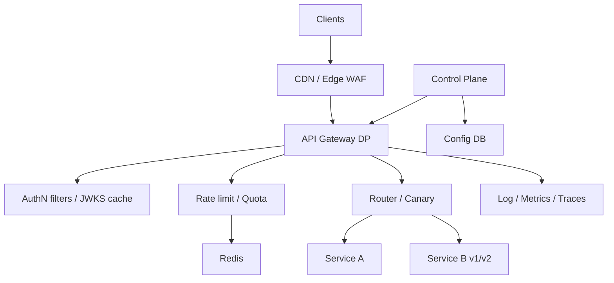

# System Design: API Gateway

> **Focus areas:** Edge entry · AuthN/Z · Rate limits · Routing · Aggregation · Protocol translation · Tenancy · Multi-region  
> **Style:** Productized API edge with progressive scale (10× → 100× → 1,000×)  
> **Domain:** Single front door for microservices / public APIs with policy enforcement

---

## Table of Contents

1. [Clarify Requirements (Interview Q&A)](#1-clarify-requirements-interview-qa)
2. [Back-of-the-Envelope Estimation](#2-back-of-the-envelope-estimation)
3. [High-Level Design](#3-high-level-design)
4. [Architecture Diagram](#4-architecture-diagram)
5. [Design Deep Dive](#5-design-deep-dive)
6. [Wrap-Up](#6-wrap-up)
7. [Deeper / Related Interview Questions](#7-deeper--related-interview-questions)

---

## 1. Clarify Requirements (Interview Q&A)

An API gateway is where **product policy meets traffic**. Bound features so it doesn’t become an unbounded second monolith.

### 1.0 What this is / is not

| This is | This is not |
|---------|-------------|
| A **policy-enforcing edge proxy**: auth, quotas, routing, observability | The entire service mesh (east-west)—complementary |
| North-south entry for external/public/partner APIs | A replacement for every microservice’s business logic |
| Control plane (routes/policies) + data plane (request path) | Pure L4 load balancer (subset of concerns) |
| Request/response path with bounded plugins | Best place for heavy ETL or long workflows |

### 1.1 Functional Requirements

| # | Question to ask | Expected / typical interviewer answer | Design implication |
|---|-----------------|----------------------------------------|--------------------|
| F1 | Who are clients? | Mobile, web, partners, internal; public REST (+ maybe gRPC-web) | External edge tier; mTLS optional for partners |
| F2 | Core policies? | AuthN, AuthZ (coarse), rate limit/quota, routing, TLS, request validation | Ordered filter chain |
| F3 | Auth mechanisms? | API keys, JWT/OAuth2, mTLS for partners | Pluggable authenticators; JWKS cache |
| F4 | Routing? | Host/path/header → upstream service; weighted canary | Route tables versioned |
| F5 | Aggregation / BFF? | Light fan-in optional; heavy GraphQL BFF separate | Avoid N+1 in gateway MVP |
| F6 | Protocol? | HTTPS REST JSON; gRPC upstream translation optional | Codec filters; timeout budgets |
| F7 | Rate limits / quotas? | Per key/tenant/IP; integrate hierarchical quotas | Local + Redis; fail mode explicit |
| F8 | Idempotency? | Optional for POST when clients send keys | Edge may forward; not always store |
| F9 | Caching? | Cache GETs for catalog-like APIs selectively | Cache key auth-aware; short TTL |
| F10 | WAF / bot? | Basic at edge; deep WAF Phase 2 | Integrate CDN/WAF |
| F11 | Developer portal? | Keys, docs, plans—control plane adjacent | Not on hot path |
| F12 | Multi-tenant? | Tenant in token/key; cell routing | `tenant_id` → upstream cell |
| F13 | Streaming / WS? | Support WebSocket/SSE pass-through | Idle timeouts; sticky if needed |
| F14 | Response transform? | Minimal header inject; avoid heavy body rewrite MVP | Size limits; streaming-friendly |

**MVP functional scope:**

1. TLS termination; HTTP/1.1 + HTTP/2.
2. Route by host/path to upstream clusters (service discovery).
3. Auth: API key + JWT validation (JWKS).
4. Per-tenant/key rate limits; optional quota reserve hook.
5. Timeouts, retries (safe), circuit breaking to upstreams.
6. Request ID / trace context injection.
7. Access logs + metrics; 4xx/5xx classification.
8. Control plane: routes, keys, plans, canary weights.
9. Multi-AZ active-active data plane.

**Out of MVP:**

- Full GraphQL federation engine
- Complex orchestration / saga engine
- Per-customer WASM plugins marketplace
- Billing invoice generation (emit usage only)
- East-west mesh replacement

### 1.2 Non-Functional Requirements

| # | Question | Expected answer | Target |
|---|----------|-----------------|--------|
| N1 | Added latency | Tight | p50 < 1–2 ms, p99 < 5–10 ms in-region (excl. upstream) |
| N2 | Availability | Critical | 99.99% edge |
| N3 | Throughput | High | Horizontal DP; millions RPS globally at 1,000× |
| N4 | Security | Assume hostile internet | TLS, WAF hooks, key isolation, size limits |
| N5 | Multi-region | Active-active edge; data home cells | Route tenant to home when needed |
| N6 | Config converge | Policy updates | < 5 s typical |
| N7 | Durability | Keys/policies durable | Postgres/CRDB control plane |
| N8 | Cost | Edge fleet dominant | Efficient filters; avoid per-request remote calls |

### 1.3 Cases

**Happy paths**

1. Client → TLS → auth OK → RL OK → route → upstream → response → log/metrics.
2. Canary: 5% traffic to v2 upstream by weight.
3. JWT rotate JWKS → gateway refreshes cache → validations continue.
4. Tenant rate limited → `429` + `Retry-After` + remaining headers.
5. Upstream 503 → bounded retry on GET → else error budget response.

**Edge / failure cases**

| Case | Behavior |
|------|----------|
| Auth service / JWKS down | Use cached JWKS within TTL; fail-closed if expired |
| Redis RL down | Fail-closed for paid hard limits; or local approx—declare |
| Upstream slow | Timeouts; shed; circuit open |
| Huge body | Reject at content-length / streaming cap |
| Path traversal / smuggling | Normalize; reject ambiguous `Transfer-Encoding` |
| Fan-out aggregation partial fail | Hedged policy; partial response only if product allows |
| WebSocket idle | Tuned timeouts; LB/gateway alignment |
| Key revoked | Hot CRL/Bloom/version check; p99 revocation SLO |
| Config bad push | NACK; keep last-good; canary CP |
| Cross-tenant IDOR via path | AuthZ checks tenant owns resource id (or leave to service—be explicit) |

### 1.4 Scales

| Metric | Baseline | 10× | 100× | 1,000× |
|--------|----------|-----|------|--------|
| RPS (global peak) | 100K | 1M | 10M | 100M |
| Concurrent conns | 500K | 5M | 50M | 500M |
| API keys / tenants | 50K | 500K | 5M | 50M |
| Routes | 500 | 5K | 50K | 500K |
| Auth validations / s | 100K | 1M | 10M | 100M |
| Rate-limit checks / s | 100K | 1M | 10M | 100M |
| DP nodes | 20 | 200 | 2K | 20K |
| Regions / PoPs | 2 | 5 | 15 | 50+ |
| Access log GB/day | 500 | 5K | 50K | 500K |

**What each jump forces:**

- **10×:** JWKS/local auth only; Redis cluster RL; xDS routes; log sampling.
- **100×:** Edge PoPs; tenant→cell directory; sidecars for quotas; sharded CP.
- **1,000×:** Hierarchical edge; regional aggregation of logs; per-tenant isolation pools; WASM tightly sandboxed if any.

### 1.5 Etc.

- **Build vs buy:** Interview as **build** Envoy/Kong-like architecture.
- **BFF vs gateway:** Mobile BFF can sit behind gateway or be the gateway for that surface—don’t mix all BFFs into one mega-gateway.
- **Mesh:** Gateway for N-S; mesh for E-W; share auth identity formats.

**Scope statement:**

> Design a multi-AZ/multi-region API gateway data plane with auth, rate limiting, routing/canaries, and resilience filters, backed by a versioned control plane—scaling from ~100K to ~100M RPS with edge PoPs and minimal per-request remote dependencies.

---

## 2. Back-of-the-Envelope Estimation

### 2.1 Latency budget

```text
TLS resumed: 0.1–0.5 ms
JWT HMAC/local validate: 0.05–0.2 ms
RL Redis RTT: 0.2–0.5 ms (or local token bucket ~0)
Routing: ~0.01 ms
Total gateway: aim < 1–2 ms when RL local/cached
```

Remote authz call per request at 100M RPS → impossible; **cache decisions**.

### 2.2 CPU

```text
~10–50 μs/request filter chain average → 20K–100K RPS/core
100K RPS → tens of cores → ~20 nodes with headroom
100M RPS → global fleet tens of thousands of cores
```

### 2.3 Logging

```text
Full access log 1 KB/req × 100K RPS = 100 MB/s ≈ 8.6 TB/day
→ Sample, structured fields, edge aggregate, drop PII
```

### 2.4 Key lookup

```text
50M API keys × 200 B = 10 GB — shard or hierarchical (key_id → tenant policy)
Hot keys in memory; cold in Redis
```

### 2.5 JWKS / certs

```text
Tiny; cache everywhere; refresh 5–60 min + SIGHUP on push
```

### 2.6 Bandwidth

```text
Avg 2 KB in + 5 KB out @ 100K RPS ≈ 700 MB/s ≈ 5.6 Gbps
@ 100M RPS ≈ 5.6 Tbps globally — PoP distribution mandatory
```

---

## 3. High-Level Design

### 3.1 Filter chain (data plane)

```text
Listener (TLS)
  → HTTP connect
  → Normalize / smuggle guards
  → WAF light (optional)
  → AuthN (API key / JWT / mTLS)
  → AuthZ coarse (scopes / plan features)
  → Rate limit / quota
  → Cache (optional GET)
  → Route match
  → Observability inject (x-request-id, baggage)
  → Upstream call (CB, timeout, retry)
  → Response headers (ratelimit remaining)
  → Access log
```

Order matters: **cheap rejects before expensive**; auth before personalized RL.

### 3.2 Routing model

```text
VirtualHost (host)
  RouteMatch (path prefix/regex, method, headers)
    → Destination: cluster + rewrite + timeout + retry policy
    → Weighted clusters for canary
```

Support **header-based** sticky canary (`X-Canary: 1`) for debugging.

### 3.3 Auth design

| Method | Validation | Notes |
|--------|------------|-------|
| API key | Lookup key_id → tenant, plan, secret hash | Hash at rest; constant-time compare |
| JWT | Signature via JWKS; `exp`,`aud`,`iss` | Cache JWKS; clock skew leeway |
| mTLS | Client cert allowlist / SPIFFE | Partners |

**Revocation:** short JWT TTL + denylist for emergencies; API keys version counter in Redis.

### 3.4 Rate limiting integration

```text
Gateway filter calls:
  local token bucket (IP / burst)
  distributed RL / hierarchical quotas (tenant, key)
Fail-closed for monetized APIs
Return 429 + standard headers
```

See sibling docs: hierarchical quotas, token-spend budget—for deep reserve/settle, gateway **hooks** rather than reimplementing finance.

### 3.5 Upstream resilience

| Mechanism | Setting ideas |
|-----------|---------------|
| Timeouts | connect 100–500ms; overall route budget |
| Retries | GET/PUT idempotent only; 1 retry; jitter |
| Circuit breaker | max 5xx %, max conns, max pending |
| Hedging | rare; read-only; budgeted |
| Bulkhead | per-tenant / per-route conn caps |

### 3.6 Control plane

```text
Developer Portal / Admin API
  → Config Store (routes, keys, plans)
  → Compiler / validator
  → xDS (LDS/RDS/CDS/EDS/SDS) to DP fleet
  → Canary DP → full fleet
```

**Separation:** control plane outage must **not** take down data plane (last-good config).

### 3.7 Multi-region & tenancy

```text
Client → nearest Edge PoP (Anycast/CDN)
  → Auth + RL
  → If request needs home data: route to home region gateway/cell
  → Else serve from local replicas (read APIs)
```

Directory: `tenant_id → home_cell` cached on edge.

### 3.8 APIs (control plane)

| Method | Path | Purpose |
|--------|------|---------|
| POST | `/cp/routes` | Upsert route |
| POST | `/cp/upstreams` | Cluster/EDS |
| POST | `/cp/keys` | Issue API key |
| DELETE | `/cp/keys/{id}` | Revoke |
| PUT | `/cp/plans/{id}` | Entitlements + RL |
| POST | `/cp/canaries` | Weight splits |
| GET | `/cp/status/sync` | DP ACK lag |

Data plane is mostly transparent HTTP reverse proxy—not CRUD.

### 3.9 Component architecture

```text
+-------------+    +------------------+    +----------------+
| CDN / WAF   |--->| API GW DP fleet  |--->| Microservices  |
+-------------+    | (Envoy-like)     |    | / cells        |
                   +--------+---------+    +----------------+
                            ^
                            | xDS
                   +--------+---------+
                   | Control Plane    |
                   | routes,keys,RL   |
                   +--------+---------+
                            |
              +-------------+-------------+
              v             v             v
           Postgres      Redis RL      JWKS/IdP
```

### 3.10 Trade-offs

| Decision | Choose | Over | Deal-breaker |
|----------|--------|------|--------------|
| Auth on gateway | Validate JWT/key at edge | Central auth RPC every request | Latency/availability |
| Business AuthZ | Coarse at GW; fine in service | All AuthZ only at GW | IDOR if GW incomplete |
| Aggregation | Minimal | GraphQL mega-BFF in GW | Gateway becomes monolith |
| RL store | Local + Redis | PG per request | Meltdown |
| Body transform | Avoid | Heavy XSLT-like | Memory/latency bombs |
| Plugins | Curated filters | Customer code in DP | Security/stability |

### 3.11 Progressive scale

- **Baseline:** Single region GW cluster; JWT+key; Redis RL; static upstreams.
- **10×:** xDS; canaries; JWKS cache; log sampling; CB.
- **100×:** Multi-PoP; tenant cell routing; hierarchical quotas hook; sharded keys.
- **1,000×:** Edge hierarchy; per-tenant isolation; regional log pipelines; specialized streaming gateways.

---

## 4. Architecture Diagram

### 4.1 End-to-end



### 4.2 Request sequence

```text
Client          GW DP              Redis/JWKS         Upstream
  |               |                    |                 |
  | HTTPS req     |                    |                 |
  |-------------->| TLS + parse        |                 |
  |               | validate JWT       |                 |
  |               |------------------->| (cache hit)     |
  |               | RL consume         |                 |
  |               |------------------->|                 |
  |               | route + forward                      |
  |               |------------------------------------->|
  |               |<-------------------------------------|
  |  response+hdr |                    |                 |
  |<--------------|                    |                 |
```

### 4.3 Cell routing

```text
Edge GW (any region)
  extract tenant
  lookup home_cell (cached)
  if local cell serves API → upstream local
  else → forward to home region GW (or pass cell header to global LB)
```

---

## 5. Design Deep Dive

### 5.1 Reliability

#### 5.1.1 Invariants

1. **Last-good config** survives CP outage.
2. **Fail-closed** on auth uncertainty for protected routes.
3. **Timeouts always set**—no unbounded upstream waits.
4. **Retries never amplify** beyond budget.
5. **Request IDs** generated if absent; propagated.
6. **Body size limits** enforced before buffering.

#### 5.1.2 Dependency failure matrix

| Dependency | Mode |
|------------|------|
| JWKS | Cache; fail-closed after TTL |
| Redis RL | Local emergency buckets / fail-closed |
| Service discovery | Keep last EDS; mark stale |
| Upstream | CB + 503 |
| Control plane | DP unaffected |

#### 5.1.3 Request smuggling & safety

- Reject conflicting `Content-Length` / `Transfer-Encoding`.
- Normalize paths (`/../`); deny raw null bytes.
- Strip hop-by-hop headers; careful `X-Forwarded-*` trust hops.
- Only trust `X-Forwarded-For` from known CDN CIDRs.

#### 5.1.4 Idempotency at edge

Optional filter: for routes flagged idempotent, store `Idempotency-Key` → response fingerprint in Redis with TTL. Wrong body hash → 409. Don’t do this for all POSTs blindly (memory).

#### 5.1.5 Backpressure & shedding

Global and per-tenant concurrency caps; return `503` with `Retry-After` when admission queue full. Prefer shedding new vs collapsing all.

### 5.2 Scalability

#### 5.2.1 Horizontal DP

Stateless pods; scale on CPU/RPS/conns. Warm pools for TLS. Connection draining on deploy.

#### 5.2.2 Avoid remote calls on hot path

| Concern | Technique |
|---------|-----------|
| Auth | Local crypto + cached keys |
| RL | Local burst + async sync / Redis pipeline |
| AuthZ | Embed scopes in JWT; service does fine-grained |
| Config | Pushed xDS |

#### 5.2.3 Hot tenants

- Dedicated GW shard / rate limit partition for whales.
- Fair queues so one tenant cannot starve others on shared DP.

#### 5.2.4 Logging/metrics cardinality

- Metrics labeled by `route`, `code`, `region`—not `user_id`.
- Top-K tenant dashboards via separate usage pipeline.
- Trace sample rates adaptive under load.

#### 5.2.5 Multi-region

Active-active edge; sticky to home only when required. DNS/Geo + anycast. Careful with global rate limits (see quotas doc slices).

### 5.3 Maintainability

#### 5.3.1 Modular filters

```text
/filters/auth
/filters/ratelimit
/filters/route
/filters/observability
```

Contract: streaming-safe; bounded memory; timeouts.

#### 5.3.2 Schema / OpenAPI

- Optional request schema validation for public APIs (size-bounded).
- Contract tests between portal specs and routes.

#### 5.3.3 Safe rollout

- Canary DP instances with new binary.
- Canary routes with weighted clusters.
- Automatic rollback on elevated 5xx/latency.

#### 5.3.4 Multi-tenant ops

- Per-plan entitlements (which routes enabled).
- Key rotation APIs; audit log of admin actions.
- Abuse blocklists propagated in < seconds.

#### 5.3.5 Observability

| Signal | Use |
|--------|-----|
| `gw_request_duration_seconds` | SLO |
| `gw_upstream_rq_error` | Dependency health |
| `gw_auth_fail` | Attack / misconfig |
| `gw_rl_throttled` | Plan sizing |
| `gw_config_age_seconds` | Sync health |

Distributed tracing: gateway as first span; propagate W3C `traceparent`.

---

## 6. Wrap-Up

### 6.1 Decision summary

| Area | Decision |
|------|----------|
| Role | N-S policy edge, not business monolith |
| Auth | Local JWT/key validation + cached JWKS |
| RL | Local + Redis; hook to hierarchical quotas |
| Routing | Host/path + weighted canaries; tenant→cell |
| Resilience | Timeouts, safe retries, circuit breakers |
| CP/DP | xDS push; last-good on CP failure |
| Scale | PoPs; avoid per-request remote policy calls |

### 6.2 Phased rollout

1. TLS + routing + JWT for one API.
2. API keys, Redis RL, retries/CB, metrics.
3. xDS control plane, canaries, developer keys portal.
4. Multi-PoP + cell directory + quota service hooks.
5. Isolation shards, advanced WAF, streaming-specialized listeners.

### 6.3 Closing line

> A good API gateway is a **thin, ruthless policy engine**: authenticate, admit, route, observe—and refuse to become the company’s second monolith.

---

## 7. Deeper / Related Interview Questions

1. **Gateway vs service mesh?**  
   Gateway: north-south, product policies. Mesh: east-west, mTLS, retries between services. Often both.

2. **Why not put all AuthZ in the gateway?**  
   Resource-level IDOR checks need data the gateway shouldn’t load; do coarse scopes at GW, fine checks in services.

3. **JWT vs opaque session tokens at edge?**  
   JWT enables local validate; opaque needs lookup store—latency/availability trade-off.

4. **How do you rotate JWKS safely?**  
   Publish new keys overlapping; validate both `kid`s; retire old after TTL.

5. **Where do rate limits live—CDN, GW, service?**  
   Defense in depth: CDN for IP/voluminous; GW for tenant/key; service for business invariants.

6. **Can gateway cache authenticated GETs?**  
   Yes if `Cache-Control` / explicit; vary on auth principal; danger of leaking cross-tenant data.

7. **How to prevent HTTP request smuggling?**  
   Strict parsing; reject ambiguous framing; H2 upstream preferred; continuous tests.

8. **Why timeouts must be less than client timeouts?**  
   Else gateway holds resources while client already gone; cascading congestion.

9. **Idempotency keys at gateway or service?**  
   Service owns truth; gateway may accelerate with shared store—document consistency.

10. **How do canary releases work at GW?**  
   Weighted clusters; sticky header for debug; metrics by cluster; auto rollback.

11. **What’s a BFF and should it be the gateway?**  
   BFF aggregates for one client type; can sit behind GW; don’t dump all BFFs into one GW codebase.

12. **gRPC-web through gateway?**  
   Need proto-aware or H2 pass-through; trailers; status mapping.

13. **How to handle 100K routes?**  
   Prefix trees / tries; shard virtual hosts; avoid giant regex sets.

14. **Fail-open rate limiting—when?**  
   Rarely for paid APIs; maybe free-tier soft with alerts; state it.

15. **PII in access logs?**  
   Redact tokens/bodies; hash IPs if required; sampling.

16. **Multi-region rate limits exactness?**  
   Same as quotas—slices or home-region; cannot be CAP-perfect active-active without cost.

17. **How does gateway do mTLS to upstream?**  
   SDS certs; SPIFFE IDs; rotate without downtime.

18. **DDoS—gateway or L3/L4?**  
   Volumetric at CDN/L3; application abuse at GW (auth, RL, WAF).

19. **Why inject `x-request-id`?**  
   Correlate logs/traces across services; clients may supply; validate format.

20. **Plugin architecture risks?**  
   Untrusted code → latency/security; prefer curated filters / sandboxed WASM with budgets.

21. **GraphQL at the gateway?**  
   Complexity attacks (deep queries); need cost analysis—often separate GraphQL tier.

22. **How to test gateway configs?**  
   Contract tests, shadow traffic, synthetic probes per route, chaos upstream.

23. **Long-lived SSE through GW?**  
   Idle timeouts, buffering off, LB alignment; scale by connections not RPS.

24. **Tenant isolation on shared GW?**  
   Conn/RPS caps; noisy-neighbor metrics; dedicated shards for enterprise.

25. **Control plane vs data plane version skew?**  
   N/N-1 compatibility; additive route fields; ACK/NACK.

26. **What’s the biggest anti-pattern?**  
   Synchronous calls from GW to five policy services per request—death at scale.

27. **How do developer plans map to config?**  
   Plan → entitlements + RL + route allowlist; keys point to plan_id; hot cache.

28. **CORS at gateway?**  
   Centralize for browsers; careful with `*` and credentialed requests.

29. **gRPC error mapping to HTTP?**  
   Standard tables (`INVALID_ARGUMENT`→400); don’t leak internals.

30. **When to skip the gateway?**  
   Ultra-low-latency internal RPC already on mesh; or binary protocols poorly proxied—exceptions, not default for public API.
