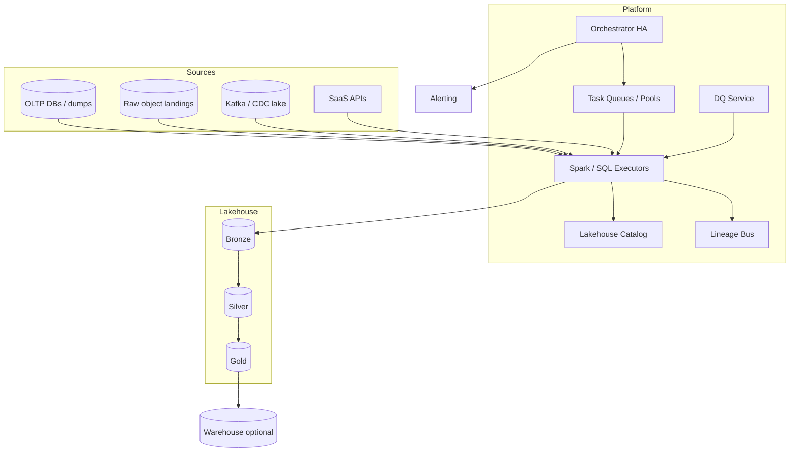
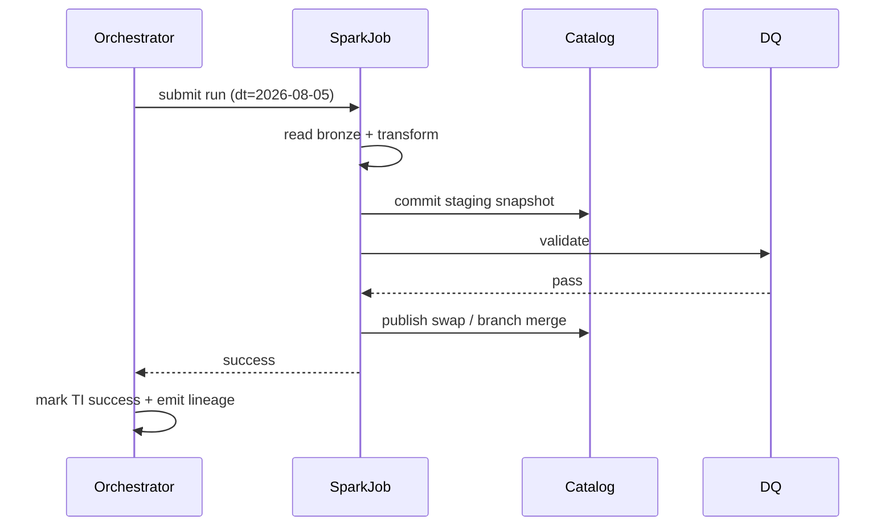

# System Design: Batch ETL / ELT Platform

> **Focus areas:** DAG orchestration · Spark/Flink batch · Lakehouse tables · Schema evolution · Data quality · Idempotent loads · Backfills · Exactly-once commits · Cost/scheduling · Progressive scale  
> **Style:** End-to-end product design with progressive scale (10× → 100× → 1,000×)  
> **Quality bar:** Senior/staff data-platform interview—Airflow/Spark/dbt/Iceberg-shaped mechanics with explicit trade-offs  
> **Interview theme:** Design the batch ETL/ELT platform that transforms raw data into reliable analytics tables daily/hourly

---

## Table of Contents

1. [Clarify Requirements (Interview Q&A)](#1-clarify-requirements-interview-qa)
2. [Back-of-the-Envelope Estimation](#2-back-of-the-envelope-estimation)
3. [High-Level Design](#3-high-level-design)
4. [Architecture Diagram](#4-architecture-diagram)
5. [Design Deep Dive](#5-design-deep-dive)
6. [Wrap-Up](#6-wrap-up)
7. [Deeper / Related Interview Questions](#7-deeper--related-interview-questions)

---

## 1. Clarify Requirements (Interview Q&A)

Goal: design a **batch ETL/ELT platform** that schedules and executes data pipelines—extract from sources, load to a lake/warehouse, transform into curated datasets—with **idempotent runs**, **schema evolution**, **quality gates**, and **backfills**, at progressive organizational scale.

### 1.0 What this is / is not

| Dimension | This doc | Not this |
|-----------|----------|----------|
| Job | Orchestrate + execute batch data transforms | Real-time stream engine (complementary) |
| Pattern | ETL and ELT both supported | Only GUI spreadsheet sync |
| Storage | Lakehouse (Iceberg/Delta/Hudi) + WH | OLTP app DB redesign |
| Users | Analytics eng / data eng | End-user BI tool itself |
| Correctness | Partition-level idempotency | Distributed ACID across arbitrary systems |

### 1.1 Functional Requirements

| # | Question | Typical answer | Implication |
|---|----------|----------------|-------------|
| F1 | ETL vs ELT? | Prefer ELT into lake then transform; some ETL for SaaS | Raw zone + curated zone |
| F2 | Orchestrator? | DAG with deps, retries, sensors | Airflow/Temporal-class scheduler |
| F3 | Compute? | Spark primary; SQL warehouse jobs; some Python | Pluggable executors |
| F4 | Tables? | Iceberg/Delta on S3; Snowflake/BQ sinks | ACID table commits |
| F5 | Schedule? | Hourly/daily; late-arriving data | Data-interval aware runs |
| F6 | Backfill? | Reprocess date ranges safely | Idempotent partition overwrite / MERGE |
| F7 | Schema evolution? | Add columns common; breaks gated | Contract tests + table evolution APIs |
| F8 | Data quality? | Null checks, volumes, freshness, uniqueness | Gates before publish |
| F9 | Lineage? | Column-level nice; table-level MVP | Emit open-lineage events |
| F10 | Multi-tenant? | Many teams; shared platform | Namespaces, queues, cost attribution |
| F11 | Secrets? | Source creds | Secret manager; not in DAG code |
| F12 | SLA? | Finance tables by 08:00 local | Priority pools; sensors; alerts |
| F13 | CDC inputs? | Some tables from CDC topics/lake | Batch unify with streaming landings |
| F14 | ML features? | Batch feature tables Phase 1.5 | Same platform, different SLAs |

**MVP scope:**

1. DAG definitions (code-first) with schedules and dependencies.  
2. Raw landing from object storage / DB dumps / Kafka mirror.  
3. Spark SQL/Python transforms writing Iceberg/Delta tables.  
4. Partitioned incremental loads by `dt`.  
5. Retries, alerting, basic DQ checks, backfill CLI.  
6. Catalog integration; schema registry/contracts for critical tables.  
7. RBAC on datasets; cost tags.

**Out of MVP:** fully managed drag-drop only UX, cross-cloud active-active single metastore, perfect column lineage everywhere, automatic query rewrite product.

### 1.2 Non-Functional Requirements

| # | NFR | Target |
|---|-----|--------|
| N1 | Scheduler scalability | 10K–100K+ runnable tasks/day baseline→scale |
| N2 | Job reliability | Idempotent; at-least-once task exec with EOS table commit |
| N3 | Freshness SLO | Critical daily tables on time ≥99% days |
| N4 | Throughput | Multi-TB/hour transforms |
| N5 | Consistency | Snapshot isolation via table commits |
| N6 | Security | Least-privilege per DAG; encrypt at rest |
| N7 | Cost | Spot/preemptible where safe; prune scans |
| N8 | Observability | Per-run bytes, rows, duration, DQ, lineage |

### 1.3 Cases

**Happy**

1. 02:00 sensor: raw `dt=yesterday` complete → Spark transform → DQ pass → publish `prod.orders_fct`.  
2. New optional column added upstream → schema evolve → job continues.  
3. Backfill 30 days → parallelized dated runs with overwrite.  
4. Upstream delay → sensor waits → SLA miss alert → catch-up.  
5. Task fails mid-write → commit aborted; retry clean.

**Edges**

| Case | Behavior |
|------|----------|
| Partial raw files late | Completeness sensor (manifest/_SUCCESS); don't publish early |
| Non-idempotent script | Reject pattern; force partition overwrite API |
| Schema break | Fail gate; quarantine; notify owner |
| Skewed join | Salting / AQE / broadcast hints |
| Small files explosion | Compaction job; target file sizes |
| Concurrent backfill + prod | Separate branches/snapshots; serial publish |
| Orchestrator down | Executors finish; no new scheduling; HA scheduler |
| Metastore race | Optimistic table commits; retry |
| Spot kill | Checkpoint stages; retry task |
| PII in raw | Restricted zone; transform masks before wide publish |

### 1.4 Scales

| Metric | Baseline | 10× | 100× | 1,000× |
|--------|----------|-----|------|--------|
| DAGs | 500 | 5K | 50K | 500K |
| Task runs / day | 20K | 200K | 2M | 20M |
| Data transformed / day | 20 TB | 200 TB | 2 PB | 20 PB |
| Concurrent executors | 200 | 2K | 20K | 200K |
| Tables in catalog | 2K | 20K | 200K | 2M |
| Critical SLA pipelines | 20 | 100 | 500 | 2K |
| Teams | 10 | 50 | 200 | 1K+ |

**Jumps:** 10× = queue pools + table formats; 100× = scheduler sharding + catalog HA + compaction platform; 1,000× = domain data meshes / cells, federated catalogs, automated cost governors.

### 1.5 Etc.

- Lakehouse-first; warehouse optional sink.  
- **Data interval** (logical date) ≠ run wall time.  
- Prefer deterministic SQL/Spark over opaque notebooks for prod.

**Scope repeat-back:**

> Design a multi-tenant batch ETL/ELT platform: DAG orchestration, Spark/SQL execution on a lakehouse, idempotent partition publishes, schema+DQ gates, backfills—from ~20 TB/day to cell-oriented 1,000×.

---

## 2. Back-of-the-Envelope Estimation

### 2.1 Scheduler load

```text
20K tasks/day ≈ 0.23 tasks/s avg; peaks 10–50/s at top-of-hour
State: task instance rows × history → millions/month → need archival
HA scheduler heartbeats; don't put heavy compute in scheduler process
```

### 2.2 Compute

```text
20 TB/day; avg job scans 2× raw (joins) → ~40 TB scanned
Spark @ 200 MB/s/core effective scan ⇒ hundreds–thousands core-hours
Spot discounts matter at 100×
```

### 2.3 Storage

```text
Raw + curated + snapshots (time travel)
Snapshot retention 7–30d; expire snapshots to control cost
Small files: 1M files × LIST ops dominate—compaction mandatory
```

### 2.4 Metastore QPS

```text
Plan: list partitions / commit metadata
At 100×: thousands commits/hour → scale catalog (Hive metastore insufficient alone; use Iceberg REST / proprietary HA)
```

### 2.5 Hot partitions

```text
Late-arriving "today" hot writes → separate landing; compact later
Don't let every microbatch create 10k tiny files
```

---

## 3. High-Level Design

### 3.1 Medallion / zones

```text
Bronze (raw, append-only, source-shaped)
  → Silver (cleaned, conformed, deduped)
    → Gold (business marts, aggregates)
```

ELT emphasis: load bronze quickly; transform in place with Spark/SQL.

### 3.2 Orchestration model

```text
DAG
  ├── Dataset sensors / time sensors
  ├── Extract/Load tasks
  ├── Transform tasks (SparkSubmit / SQL)
  ├── DQ gates
  ├── Publish (swap alias / set current)
  └── Downstream notify / lineage emit
```

**Run identity:** `dag_id + data_interval_start + try_number`  
**Idempotency key for writes:** `table + partition(dt=...) + job_run_id` with overwrite semantics.

### 3.3 Why lakehouse table format

| Concern | Hive paths alone | Iceberg/Delta |
|---------|------------------|---------------|
| Atomic publish | `_SUCCESS` fragile | Snapshot commit |
| Schema evolution | Painful | First-class |
| Time travel | Manual | Built-in |
| Concurrent writers | Dangerous | Optimistic CC |

**Deal-breaker:** "write many files then flip directory" without atomic manifest is a late-night page generator.

### 3.4 Execution engines

| Engine | Best for |
|--------|----------|
| Spark | Large joins, flexible UDF |
| Warehouse SQL | ELT pushdown (BQ/Snowflake/Redshift) |
| Flink batch | Unified stream/batch (optional) |
| Ray/Python | ML-ish transforms (bounded) |

Platform abstracts `Executor` interface: submit, logs, metrics, kill.

### 3.5 API surfaces

| API | Purpose |
|-----|---------|
| DAG deploy | CI → versioned DAG bundle |
| `POST /backfills` | Range reprocess |
| Catalog | Tables, schemas, ACLs |
| DQ config | Expectations as code |
| Run history | Logs, metrics, lineage |

### 3.6 Schema evolution policy

| Change | Action |
|--------|--------|
| Add nullable column | Auto evolve |
| Widen type carefully | Gated |
| Rename | Alias + dual-write period |
| Drop/incompatible | Fail; require migration job |

Contract tests in CI compare producer schema vs consumer expectations.

### 3.7 Exactly-once / idempotent batch

Batch "EOS" ≈ **effectively-once partition publish**:

1. Write to staging snapshot / branch.  
2. Run DQ.  
3. Atomic commit/replace partition or MERGE.  
4. Task commit marker in orchestrator **after** table commit succeeds.

Retries may recompute but must not double-append facts.

### 3.8 Incremental patterns

| Pattern | Use |
|---------|-----|
| Partition overwrite `dt` | Daily facts |
| MERGE on keys | Slowly changing / CDC apply |
| Append-only + view | Event logs |
| Snapshot whole table | Small dims |

Watermark for batch: high-water mark table of `(source, max_ts_processed)` for incremental extracts.

---

## 4. Architecture Diagram





---

## 5. Design Deep Dive

### 5.1 Reliability

**Loss / corruption prevention**

- Never publish partial partitions.  
- Atomic table snapshots.  
- Immutable raw bronze for replay.  
- Checksums on extract where possible.

**Retries**

- Transient: infra/network—retry with jitter.  
- Logical DQ fail: no blind retry forever—page owner.  
- Mid-job executor loss: stage recompute (Spark lineage).

**Idempotency**

- Partition overwrite by `dt`.  
- MERGE with deterministic keys.  
- Ban `INSERT` without dedup for facts.

**Backpressure / overload**

- Pool concurrency limits per team.  
- Sensor deferral when compute saturated.  
- Fair scheduling across queues.

**Rate limits to external SaaS**

- Extractors respect API quotas; store incremental cursors durably.

### 5.2 Scalability

**Scheduler scale**

| Scale | Technique |
|-------|-----------|
| 10× | Separate scheduler from workers; DB optimize |
| 100× | Shard DAGs across scheduler cells; event-driven deferral |
| 1,000× | Domain orchestrators; global only for cross-domain sensors |

**Compute scale**

- Elastic clusters / Kubernetes; binpack.  
- AQE, partition pruning, Z-order/clustering for hot filters.  
- Compaction service independent of transform DAGs.

**Storage tiers**

- Hot SSD cache optional; S3 primary.  
- Expire old snapshots; move cold raw to infrequent access.

**Parallel backfills**

- Split by date with max parallelism; protect prod pools with separate backfill queue.

### 5.3 Maintainability

**Observability**

- Run duration, rows in/out, bytes, shuffle spill, DQ pass rate, SLA miss.  
- Data freshness SLIs per table.  
- Cost per DAG/day.

**Migrations**

- Table evolution PRs; dual publish; cut consumers; drop legacy.  
- Orchestrator version canaries.

**Multi-tenant**

- Namespace isolation; credentials scoped.  
- Chargeback; noisy neighbor queues.  
- Data mesh option: domain-owned gold tables, platform shared bronze tools.

**Ops**

- Kill switches for runaway jobs.  
- Catalog restore from metadata backups.  
- Disaster: rebuild silver/gold from bronze + code.

### 5.4 Data quality gates

```text
checks:
  - row_count between historical band
  - unique(order_id)
  - null_rate(user_id) < 0.01
  - freshness(max(event_ts)) 
  - referential sample to dims
on_fail: block publish + alert + quarantine snapshot
```

Soft vs hard checks; critical finance = hard.

### 5.5 Late data & watermarks (batch)

```text
Source declared watermark: data for dt complete by T+6h
Sensor waits for completeness flag OR timeout
Late files → restatement job overwrites partition
Stream landings: hour partitions + daily reconcile
```

### 5.6 dbt-style ELT vs Spark ETL

| | dbt/SQL WH | Spark lakehouse |
|--|------------|-----------------|
| Transforms | SQL models | SQL + complex ETL |
| Scale | Warehouse limits | Huge joins/files |
| Dev UX | Often faster | Heavier |
| Hybrid | dbt on Iceberg/Spark | Common end state |

Platform should support both executors behind one orchestrator.

### 5.7 Cost controls

- Scan bytes budgets per DAG.  
- Require partition filters in CI static analysis.  
- Auto-compaction + file size targets (128–512 MB).  
- Spot for non-SLA; on-demand for critical path.

---

## 6. Wrap-Up

### Decisions

| Decision | Choice | Why |
|----------|--------|-----|
| Architecture | Orchestrator + elastic compute + lakehouse | Separation of concerns |
| Publish | Atomic snapshots | Correct readers |
| Idempotency | Partition overwrite / MERGE | Safe retries/backfills |
| Zones | Bronze/Silver/Gold | Clarity + replay |
| Quality | Gated publish | Trust |
| Scale | Scheduler + domain cells | Avoid mega-Airflow DB death |

### Phased rollout

1. Orchestrator + Spark + S3 Parquet.  
2. Iceberg/Delta commits + DQ gates.  
3. Backfill service + compaction + cost attribution.  
4. Sharded schedulers / mesh; warehouse sinks optional.

### Punch lines

- **Idempotent partition publish** is the batch equivalent of EOS.  
- **Sensors on data readiness** beat blind cron.  
- **Small files and schema breaks** are the silent killers.

---

## 7. Deeper / Related Interview Questions

**Q1. ETL vs ELT—when ETL wins?**  
A: Heavy SaaS API constraints, PII scrub before lake, or formats needing binary decode before storage.

**Q2. Why not only cron + Spark?**  
A: Dependencies, retries, observability, backfills, SLA management—at scale you reinvent Airflow badly.

**Q3. Airflow vs Temporal vs Step Functions?**  
A: Airflow data-aware DAGs ubiquitous; Temporal stronger for long-running workflows; Step Functions cloud-native limits—pick for ops culture.

**Q4. How does Iceberg commit provide atomicity?**  
A: New snapshot metadata points to manifest list; readers see old or new snapshot, not partial files.

**Q5. MERGE vs partition overwrite?**  
A: Overwrite for immutable daily partitions; MERGE for mutable entities / CDC apply.

**Q6. How to backfill without messing prod reads?**  
A: Write to branch/staging; validate; fast-forward publish; or overwrite partitions carefully with reader snapshot isolation.

**Q7. Exactly-once batch into Postgres?**  
A: Stage table + transactional swap, or upsert by PK; orchestrator commit after DB txn.

**Q8. Handling late partitions?**  
A: Completeness contracts; restatement; versioned gold (`as_of`).

**Q9. Schema registry vs lakehouse schema?**  
A: Registry for event streams; lake tables carry own schema—sync contracts across both for CDC→batch.

**Q10. Small files problem math?**  
A: 10k tasks × 100 files = 1M objects; LIST/COMMIT slow; compact to ~100MB files.

**Q11. Skew join mitigation?**  
A: Salting keys; isolate hot keys; AQE skew join; pre-agg.

**Q12. How to prioritize SLA DAGs?**  
A: Dedicated pools; weighted fair queuing; preemption of best-effort.

**Q13. Column lineage implementation?**  
A: Parse logical plans / open-lineage from Spark listeners; approximate for UDFs.

**Q14. Deterministic random sampling?**  
A: Hash stable keys; never `rand()` without seed for reproducible DQ.

**Q15. Multi-hop freshness SLI?**  
A: Track watermark per table; critical path graph latency; alert on edge delay.

**Q16. Orchestrator DB bottleneck?**  
A: Cap history; archive TI; use deferral; shard; don't store giant logs in DB.

**Q17. Spark checkpoint vs lake commit?**  
A: Spark stage checkpoint helps recompute; lake commit is user-visible publish—different layers.

**Q18. GDPR delete in batch platform?**  
A: Separate deletion framework; rewrite affected partitions; honor legal hold; bronze retention policy.

**Q19. When stream instead of batch?**  
A: Sub-hour operational need; otherwise hourly batch often cheaper/simpler.

**Q20. Testing pipelines?**  
A: Local Spark on fixtures; contract tests; data diff on canary partitions; unit SQL tests.

**Q21. Consistent hashing in ETL?**  
A: Rare for orchestration; used in custom distributed executors / partitioners for skew.

**Q22. Load balancer for what?**  
A: SQL gateways / APIs—not the core of batch; focus on scheduler queues.

**Q23. Memory blowups?**  
A: Broadcast too large; huge shuffle; Python UDF collecting lists—monitor spill metrics.

**Q24. How do you version DAG code vs data?**  
A: Immutable DAG release IDs; pin for backfills; data snapshots independent.

**Q25. Cross-region lakes?**  
A: Primary region write; replicate cold; compute near data to cut egress.

**Q26. What is a restatement?**  
A: Controlled overwrite of historical partitions when logic/source fixes; communicate to consumers.

**Q27. Hive metastore limits?**  
A: Partition explosion; use Iceberg hidden partitioning; modern catalogs.

**Q28. Canary for transform changes?**  
A: Run new logic to shadow table; row-diff vs prod; flip on match %.

**Q29. Cost attribution algorithm?**  
A: Tag yarn/k8s usage by `dag_id`; allocate shared compaction via table ownership.

**Q30. Staff: prove idempotency.**  
A: Run same `dt` twice; snapshot IDs differ but query hashes of business keys match; no row count growth on overwrite path.

---

### Appendix A — Example DAG sketch

```text
orders_daily:
  schedule: 0 5 * * *
  tasks:
    sense_bronze_orders >> transform_silver_orders >> dq_silver_orders
      >> build_gold_orders_fct >> dq_gold >> publish_gold
```

### Appendix B — Incremental extract watermark table

```text
source_watermarks(source_id, cursor_ts, cursor_id, updated_at)
Job: SELECT * FROM src WHERE updated_at > cursor; write; advance cursor in same txn as landing commit when possible
```

### Appendix C — Failure matrix

| Failure | Detection | Action |
|---------|-----------|--------|
| Upstream empty | row_count check | Fail/block |
| Schema drift | contract | Fail + notify |
| OOM | executor exit | Retry larger / fix skew |
| SLA miss | freshness SLI | Page; catch-up run |
| Catalog conflict | commit exception | Retry commit |

### Appendix D — Progressive architecture

```text
Baseline: 1 Airflow + 1 Spark cluster + Hive/Iceberg
10×: pools, ILM compaction, DQ service
100×: scheduler shards, catalog HA, domain queues
1,000×: multi-cell mesh, federated catalog, automated governors
```

---

*End of batch ETL/ELT platform system design.*
