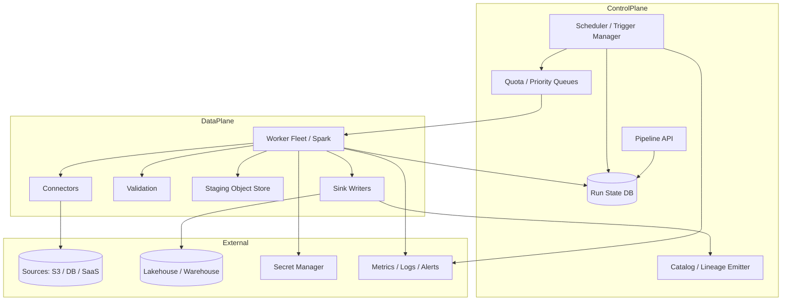
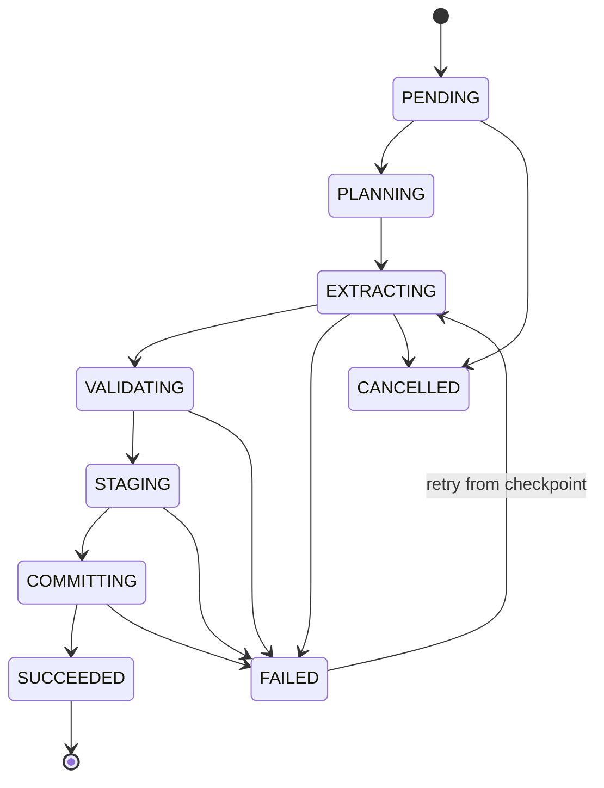

# System Design: Batch Ingestion Platform

> **Focus areas:** Connectors · Landing zones · Validation · Exactly-once-ish loads · Warehouses/lakehouse · Backfill · SLA orchestration  
> **Style:** End-to-end data-platform design with progressive scale (10× → 100× → 1,000×)  
> **API orientation:** Job/Declaration APIs for scheduled & triggered batch loads—not a general workflow engine (can use one underneath)

---

## Table of Contents

1. [Clarify Requirements (Interview Q&A)](#1-clarify-requirements-interview-qa)
2. [Back-of-the-Envelope Estimation](#2-back-of-the-envelope-estimation)
3. [High-Level Design](#3-high-level-design)
4. [Architecture Diagram](#4-architecture-diagram)
5. [Design Deep Dive](#5-design-deep-dive)
6. [Wrap-Up](#6-wrap-up)
7. [Deeper / Related Interview Questions](#7-deeper--related-interview-questions)

---

## 1. Clarify Requirements (Interview Q&A)

The goal of this phase is to **bound the problem**: what we build, what we defer, and at what scale we must succeed.

### 1.0 What this is / is not

| This is | This is not |
|---------|-------------|
| A **batch ingestion platform**: pull/push large datasets on schedules into lake/warehouse tables | A **real-time event ingestion** API (separate design; may share landing patterns) |
| Managed connectors, validation, load, retry, observability, backfill | A general Airflow clone for arbitrary DAGs (may embed DAG engine) |
| Exactly-once-*like* loads into tables with idempotent partitions | OLTP CDC log replication internals (CDC can be a source type) |
| Multi-tenant control plane for data teams | The storage engine (Iceberg/Warehouse is a sink) |

### 1.1 Functional Requirements

| # | Question to ask | Expected / typical interviewer answer | Design implication |
|---|-----------------|----------------------------------------|--------------------|
| F1 | Sources? | S3/GCS dumps, SFTP, SaaS APIs (Salesforce), DB snapshots/JDBC, partner buckets | Connector SDK + managed connectors |
| F2 | Sinks? | Iceberg/Delta lake tables, Snowflake/BigQuery, optional Kafka for hybrid | Pluggable sink writers with table commits |
| F3 | Frequency? | Hourly/daily/weekly; also on-demand & event-triggered (file arrived) | Scheduler + sensor/triggers |
| F4 | Data sizes? | MB to multi-TB per run | Chunked extract; distributed compute; not single-node |
| F5 | Schema? | Evolve with registry/catalog checks; bad rows quarantine | Schema validation stage; DLQ/quarantine paths |
| F6 | Idempotency? | Re-run same period must not duplicate | Partition overwrite / merge keys / idempotent load tokens |
| F7 | Backfill? | Historical ranges with concurrency limits | Backfill planner; avoid drowning prod |
| F8 | SLAs? | Data fresh by 08:00 local; alert on breach | SLA monitors; priority queues |
| F9 | Transforms? | Light: filter, cast, flatten; heavy ELT in warehouse | Ingest = ELT-friendly; optional dbt hooks |
| F10 | Security? | Secrets for sources; column encryption; PII tagging | Secret manager; scrubbing hooks; network egress control |
| F11 | Multi-tenant? | Teams share platform; isolate compute & credentials | Tenant quotas; dedicated exec pools |
| F12 | Exactly-once? | Effectively-once into sink tables | Staging + atomic publish; sink-native commits |
| F13 | Observability? | Per-run metrics: rows, bytes, lag, cost | Structured run logs + metrics + lineage events |
| F14 | Partial failure? | Per-file / per-partition success; resume | Checkpoints; not all-or-nothing TB jobs |

**MVP functional scope (lock this with interviewer):**

1. Declare ingestion pipelines (source → sink → schedule → schema mapping).
2. Managed connectors: object storage, JDBC snapshot, generic HTTP/SaaS page pull.
3. Distributed execute: discover → extract → validate → stage → commit.
4. Idempotent loads by batch partition key (`dt`, `hr`).
5. Quarantine invalid rows; fail run on error budget breach.
6. Backfill API with rate limits.
7. UI/API: run history, retries, logs, SLA status.
8. Emit catalog + lineage registration on success.

**Out of MVP (explicitly defer):**

- Fully managed reverse-ETL
- Complex multi-step business DAGs beyond ingest
- Sub-minute micro-batch as primary (that's streaming)
- Auto-ML anomaly detection on all datasets

### 1.2 Non-Functional Requirements

| # | Question | Expected answer | Target |
|---|----------|-----------------|--------|
| N1 | Throughput? | Sustain multi-GB/s aggregate | Baseline 1 GB/s cluster-wide; scale out |
| N2 | Latency / freshness? | Daily/hourly SLA | Complete before SLA with 20% slack |
| N3 | Availability? | Control plane HA; runs restartable | 99.9% control; runs resume after worker death |
| N4 | Durability? | No silent data loss after ACK success | Atomic sink commit; staging retained until success |
| N5 | Consistency? | Partition visible only when complete | No partial partition publish |
| N6 | Multi-region? | Region-local exec near data | Control plane global/regional; data plane local |
| N7 | Security? | Least-privilege source/sink creds | Per-pipeline IAM roles; no long-lived keys in code |
| N8 | Cost? | Spot/preemptible for extract OK | Checkpoint for restart; commit on reliable nodes |
| N9 | Isolation? | Noisy neighbor control | Per-tenant compute quotas / queues |

### 1.3 Cases (User Flows & Edge Cases)

**Happy paths**

1. Daily S3 drop `s3://landing/dt=2026-08-05/**` → validate Avro → write Iceberg partition → catalog snapshot → mark SUCCESS.
2. JDBC snapshot keyed by updated_at watermark → incremental extract → merge into sink.
3. Failed run mid-extract → retry resumes from checkpoint → no duplicate sink partition.
4. Backfill 90 days → 90 partition jobs with parallelism 10 → complete overnight.
5. Schema add field with default → compatibility OK → load proceeds.

**Edge / failure cases**

| Case | Behavior |
|------|----------|
| Late arriving files for old `dt` | Configurable: reopen partition (merge) vs reject vs quarantine late path |
| Source API rate limit | Adaptive backoff; extend SLA or partial progressive load |
| Schema break | Fail run; do not commit; alert owner |
| Sink outage | Retry with backoff; staging retained; escalate |
| Duplicate scheduler fire | Idempotency token `(pipeline_id, partition_key)` unique run |
| Skewed files (one 1TB file) | Splittable formats split; else dedicated heavy worker |
| Prememptible worker death | Resume from checkpoint offsets / file splits |
| Quarantine > threshold | Fail run; block publish |
| Clock skew watermark | Use source-side cursors / consistent snapshot where possible |
| Permission revoked mid-run | Fail clearly; no partial publish |

### 1.4 Scales (Progressive)

| Metric | Baseline | 10× | 100× | 1,000× |
|--------|----------|-----|------|--------|
| Pipelines | 500 | 5K | 50K | 500K |
| Runs / day | 5K | 50K | 500K | 5M |
| Peak concurrent tasks | 2K | 20K | 200K | 2M |
| Aggregate ingest bytes/day | 50 TB | 500 TB | 5 PB | **50 PB** |
| Largest single run | 2 TB | 10 TB | 50 TB | 200 TB |
| Rows validated / day | 50B | 500B | 5T | 50T |
| Connectors types | 10 | 20 | 40 | 60 |
| Tenants | 50 | 500 | 5K | 50K |
| Control-plane API QPS | 100 | 1K | 10K | 100K |
| Metadata rows (run/attempt) | 1M/mo | 10M | 100M | 1B |

**What each jump forces architecturally:**

- **10×:** Distributed workers (Spark/Flink batch/K8s jobs); centralized scheduler; object-store staging.
- **100×:** Queue-based task fanout; sharded scheduler; per-tenant exec pools; Iceberg commits; metadata store scaling.
- **1,000×:** Cell architecture; hierarchical schedulers; spot fleets; columnar validation; partition-level planning only (never list billions of tiny tasks without aggregation).

### 1.5 Etc. (Constraints & Assumptions)

- **Compute?** Kubernetes + Spark (or equivalent) for heavy loads; lighter Go/Python workers for SaaS API pulls.
- **Orchestration?** Platform owns ingest state machine; may call Airflow/Temporal for complex deps.
- **Warehouse vs lakehouse?** Support both; prefer sink-native atomicity (Iceberg commit / COPY INTO).
- **File formats?** Parquet/Avro/ORC/CSV; CSV discouraged at scale.

**Scope statement to repeat back:**

> Design a multi-tenant **batch ingestion platform** that reliably moves large periodic datasets from diverse sources into lakehouse/warehouse tables with schema validation, idempotent partition publish, checkpointed retries, backfills, and SLA observability—from tens of TB/day to 1000×.

---

## 2. Back-of-the-Envelope Estimation

### 2.1 Throughput

```text
Baseline 50 TB/day ≈ 50e12 / 86400 ≈ 580 MB/s average
Peak factor 5× → ~3 GB/s aggregate across fleet

1,000×: 50 PB/day ≈ 5.8 TB/s average → multi-region cells mandatory
```

### 2.2 Task cardinality trap

```text
Bad: 500K pipelines × 24 hr × 1000 files = 12B tasks/day
→ Scheduler death

Good: plan at partition granularity; files are splits inside a task
  500K pipelines × 1 daily = 500K runs; each run has internal parallelism
```

### 2.3 Metadata volume

```text
Run record ~2 KB; attempt ~1 KB; file status optional aggregate
5K runs/day × 2 KB ≈ 10 MB/day
5M runs/day × 2 KB ≈ 10 GB/day → tier/archive run metadata
```

### 2.4 Staging storage

```text
In-flight staging ≈ peak concurrent bytes × safety factor
If 200 TB concurrent in flight at high scale → staging budget + lifecycle policies
Delete staging only after successful sink commit + TTL grace
```

### 2.5 Validation cost

```text
Validate 50B rows/day × 500 ns/row ≈ 25,000 CPU-seconds ≈ 7 CPU-hours (order)
At 1000× need vectorized validation / projection pushdown / sampling modes
```

### 2.6 Scheduler capacity

```text
Dispatch 2K concurrent tasks: single scheduler OK
200K concurrent: partitioned schedulers by tenant hash; lease-based workers
```

---

## 3. High-Level Design

### 3.1 Core domain model

```text
Tenant
  └── Pipeline / Connection
        ├── SourceConfig (connector, secrets ref, discover pattern)
        ├── SinkConfig (table, load mode, partition fields)
        ├── SchemaMapping + expectations
        ├── Schedule / Trigger
        └── Policy (SLA, retries, quarantine threshold, compute class)

Run { pipeline_id, partition_key, status, metrics, schema_version }
  └── Attempt { worker, checkpoint, error }
        └── TaskSplits[] (internal)
```

**Run state machine:**

```text
PENDING → PLANNING → EXTRACTING → VALIDATING → STAGING → COMMITTING
        → SUCCEEDED
        → FAILED (retryable / terminal)
        → CANCELLED
```

Only COMMITTING→SUCCEEDED publishes data visibility.

### 3.2 Load modes

| Mode | Semantics | Use |
|------|-----------|-----|
| Partition overwrite | Replace `dt=X` entirely | Immutable daily drops |
| Append | Add files/rows | Log-like batches |
| Merge / upsert | Keyed merge | Incremental CDC snapshots |
| Copy-into replace | Warehouse atomic swap | Snowflake/BQ patterns |

**Idempotency key:** `(pipeline_id, partition_key, epoch)` — rerunning same key with overwrite is safe; append modes need dedup tokens or sink idempotency.

### 3.3 API shape

| Method | Path | Purpose |
|--------|------|---------|
| POST | `/v1/pipelines` | Create pipeline |
| POST | `/v1/pipelines/{id}/runs` | Trigger run / backfill |
| GET | `/v1/runs/{id}` | Status / metrics |
| POST | `/v1/runs/{id}/cancel` | Cancel |
| POST | `/v1/runs/{id}/retry` | Retry failed |
| GET | `/v1/pipelines/{id}/partitions` | Partition watermark state |
| POST | `/v1/connections/:test` | Validate credentials |

**Backfill request:**

```json
{
  "partition_range": {"start": "2026-01-01", "end": "2026-03-31"},
  "max_parallelism": 10,
  "priority": "LOW"
}
```

### 3.4 Why choose A over B

| Decision | Prefer | Over | Why | Deal-breaker if wrong |
|----------|--------|------|-----|------------------------|
| Publish | Stage + atomic commit | Write straight to prod table | No partial visibility | Readers see half loads |
| Planning | Partition-level runs | Per-file scheduler tasks | Scheduler scale | Millions of tasks explode |
| Compute | Elastic distributed jobs | Single VM per pipeline | TB-scale reality | Timeouts / OOM |
| State | Explicit run machine + checkpoints | Only cron scripts | Restartability | Duplicate / lost data |
| Validation | Bounded fail + quarantine | Silent cast | Data quality | Garbage in warehouse |
| Secrets | Short-lived tokens | Embedded passwords | Security | Breach blast radius |
| Orchestration | Ingest-specific control plane | Pure generic DAG only | Domain SLAs/idempotency | Weak data guarantees |

### 3.5 Control plane vs data plane

**Control plane:** pipeline defs, scheduler, run state DB, APIs, auth, quotas.  
**Data plane:** connector executors, Spark jobs, staging buckets, sink writers—near the data, ephemeral.

Never stream all dataset bytes through the control plane API.

### 3.6 Execution plan (typical file drop)

1. **Discover:** list new objects under prefix for partition (paginated).
2. **Plan splits:** group files into tasks by size (~512MB–1GB).
3. **Extract/convert:** read → possibly repartition → Parquet.
4. **Validate:** schema, nulls, ranges, PK uniqueness sampling/full.
5. **Stage:** write to staging location `_staging/run_id/`.
6. **Commit:** Iceberg add files + snapshot, or `SWAP` partition, or `COPY INTO`.
7. **Finalize:** update watermarks, catalog stats, lineage, delete staging (TTL).

### 3.7 Incremental JDBC

- Watermark column + exclusive upper bound.
- Store high-water mark only after commit success.
- Prefer source snapshot isolation when available.
- For unstable watermarks, use key ranges / chunked primary key scan.

### 3.8 Connector SDK

```text
discover() → extract(split) → heartbeat(checkpoint) → close()
```

Platform handles retries, metrics, secrets injection, sink commit.

---

## 4. Architecture Diagram





---

## 5. Design Deep Dive

### 5.1 Reliability

**Data loss prevention**

- Success ACK only after sink atomic commit returns OK.
- Staging retained until commit + grace period for forensic replay.
- Checksums of file lists in run manifest.

**Exactly-once-*like***

- Overwrite modes: natural idempotency for partition key.
- Append: include `run_id` in manifest and sink metadata; reject duplicate commit of same run_id.
- Merge: idempotent merge with deterministic op ids when possible.

**Retries & checkpoints**

- Checkpoint completed splits in state DB.
- Exponential backoff with jitter; max attempts; poison split quarantine.

**Rate limits & backpressure**

- Source-aware rate limits (SaaS APIs).
- Tenant compute tokens; delay low-priority backfills when prod SLA jobs need capacity.

**Failure modes**

| Failure | Mitigation |
|---------|------------|
| Commit fails after stage OK | Retry commit only (manifest preserved) |
| Commit succeeds, finalize fails | Reconciler marks SUCCESS; idempotent finalize |
| Double commit attempt | Sink fencing token / run_id uniqueness |
| Silent schema drift | Hard validate; kill run |
| Lost worker | Lease expiry → reassign splits |

### 5.2 Scalability

**Scheduling**

- Hierarchical: global queue → tenant queues → pipeline fairness (WRR).
- Shard schedulers by `hash(tenant_id)`.

**Execution**

- Autoscale workers on queue depth + lag to SLA.
- Bin-pack small pipelines on shared clusters; isolate heavy TB jobs.

**Storage tiers**

- Landing (raw immutable) → staging → curated sink.
- Lifecycle: raw retained per compliance; staging short TTL.

**Scale jumps**

- **10×:** Spark jobs + object staging.
- **100×:** sharded control plane; priority pools; partition overwrite defaults.
- **1,000×:** regional cells; aggregated metrics; avoid per-file metadata in OLTP.

**Hot pipelines**

- Celebrity datasets: dedicated queues, pre-warmed capacity before SLA windows (morning retail).

### 5.3 Maintainability

**Ops**

- SLOs: % runs meeting SLA, commit failure rate, quarantine rate, queue wait.
- Runbooks: stuck COMMITTING, watermark rewind, sink permission errors.

**Observability**

- OpenLineage events; per-run bytes/rows/CPU-hours/cost.
- Structured error codes (`SCHEMA_INCOMPATIBLE`, `SOURCE_RATE_LIMIT`).

**Migrations**

- Connector version pinning per pipeline; canary connector rollouts.
- Sink table format upgrades via dual-publish period.

**Multi-tenant**

- Credential isolation (per-pipeline roles).
- Network policies for egress.
- Cost chargeback by compute + bytes.

---

## 6. Wrap-Up

### Decision summary

| Area | Choice |
|------|--------|
| Architecture | Control plane + elastic data plane |
| Atomicity | Stage then sink-native commit |
| Idempotency | Partition keys + run_id fencing |
| Scale unit | Partition runs with internal splits |
| Validation | Fail/quarantine before publish |
| Fairness | Tenant queues + SLA priority |

### Phased rollout

1. **MVP:** S3+JDBC connectors, Iceberg overwrite, scheduler, checkpoints, basic UI.
2. **Phase 1.5:** SaaS connectors, backfill API, quarantine, lineage/catalog hooks.
3. **Phase 2:** Sharded scheduler, tenant pools, merge loads, cost attribution.
4. **Phase 3:** Multi-region cells, 50 PB/day capacity engineering.

---

## 7. Deeper / Related Interview Questions

**Q1. How is this different from Airflow?**  
Airflow schedules generic tasks. This platform encodes **data load semantics**: schemas, partitions, idempotent publish, connector ops, SLAs. Airflow/Temporal may be an implementation detail underneath.

**Q2. Why staging + commit instead of writing final files directly?**  
Readers must not observe partial partitions. Atomic snapshot/swap is the correctness boundary.

**Q3. Exactly-once end-to-end—possible?**  
Effectively-once with idempotent sinks. True exactly-once across SaaS APIs is usually impossible; be honest.

**Q4. Small-files problem?**  
Compact during stage; target 256–512MB Parquet; never commit millions of tiny files into Iceberg without compaction plan.

**Q5. How do you backfill without killing production?**  
Separate priority queue, parallelism caps, byte-rate caps, off-peak windows, sink write isolation (separate warehouses clusters if needed).

**Q6. Watermark vs snapshot extract?**  
Watermarks miss late updates; snapshots heavier but consistent. Choose based on source capabilities; document incompleteness.

**Q7. Schema registry vs catalog roles in batch ingest?**  
Registry validates event-shaped payloads if applicable; catalog registers resulting tables/partitions. Ingest job talks to both.

**Q8. Late data policy options?**  
Reject, late side table, or merge into old partition with compaction. Product decision with cost/correctness tradeoffs.

**Q9. Scheduler HA?**  
Leader election + DB leases for runs; workers heartbeat; no double-run without idempotency key uniqueness constraint.

**Q10. How to handle 100k tiny pipelines?**  
Co-schedule / multi-pipeline workers for small jobs; don't launch a 10-node Spark cluster per 10MB file.

**Q11. Validation full scan vs sample?**  
Full for critical; sample + stats for huge cheap data; always full schema/type check on read path if cheap.

**Q12. GDPR deletion interaction?**  
Ingest must respect suppressed sources; reprocessing raw landing may reintroduce deleted PII—coordinate with deletion pipelines.

**Q13. Cost explosion from reprocessing?**  
Idempotent publish still costs compute. Cache extracted artifacts by content hash when safe; chargeback visibility.

**Q14. Merge-on-read vs copy-on-write sinks?**  
Affects commit latency and read perf; platform should expose sink table properties, not hardcode.

**Q15. How do you detect stuck runs?**  
Lease timeout + stage progress metrics (bytes/s); auto-fail and retry; alert if SLA risk.

**Q16. Partial partition success?**  
Don't publish. Either all splits commit or none; or publish sub-partitions with explicit completeness flags (advanced).

**Q17. Connector credential rotation mid-run?**  
Refresh tokens support; long runs re-resolve secrets periodically.

**Q18. Multi-hop transforms in ingest?**  
Keep light; push heavy transforms to ELT. Ingest reliability decreases as transform complexity rises.

**Q19. Consistent hashing for workers?**  
Optional for sticky source rate limits; usually pull queue is enough. Sticky helps API quota locality.

**Q20. What metrics prove data correctness?**  
Row count vs source, byte checksums, null ratios, PK dup counts, reconciling against source totals.

**Q21. How does file-arrival triggering work?**  
Bucket notifications → ingress queue → debounce window → plan partition run. Debounce avoids one-run-per-object thrash.

**Q22. Iceberg commit conflicts?**  
Retry commit with refresh; reduce concurrent writers per table; serialize commits per table when needed.

**Q23. CSV ingestion at TB scale?**  
Discouraged: expensive parsing, weak types. Convert early to columnar in staging.

**Q24. Control plane DB bottleneck?**  
Shard by tenant; emit metrics to TSDB not OLTP; archive old runs to cold store.

**Q25. How to test connectors?**  
Contract tests with recorded fixtures; chaos kill workers; verify idempotent recommit.

**Q26. Priority inversion?**  
SLA jobs starve backfills via weighted fair queuing; critical path reserved capacity.

**Q27. Cross-region transfer costs?**  
Execute in source region; commit to regional sink; replicate curated data separately if needed.

**Q28. What belongs in DLQ/quarantine?**  
Row-level poison; keep schema + error reason + sample payload; cap retention; alert on rate.

**Q29. Load balancer analogy?**  
Think **task scheduler + fair queues**, not L7 LB—but admission control ideas (shed load, token buckets) transfer.

**Q30. Staff-level punch line?**  
Batch ingest is a **distributed reliability product**: atomic publish, idempotency, checkpoints, and tenant isolation—not “cron + COPY.”

---

*End of Batch Ingestion Platform system design.*
