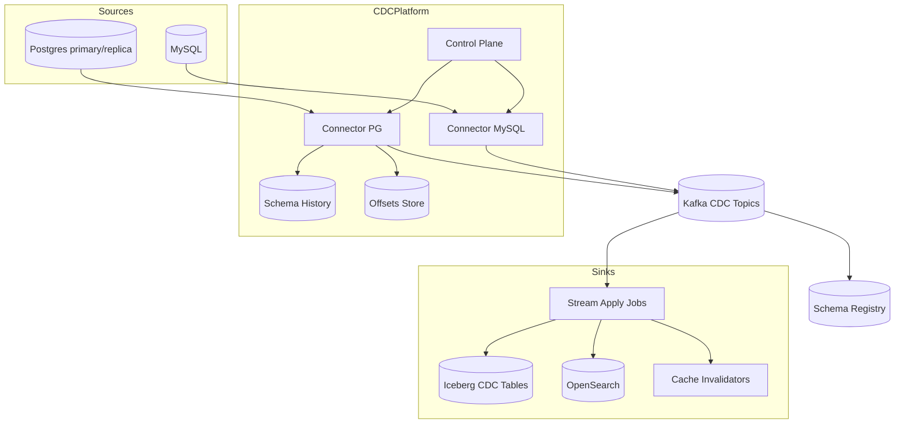
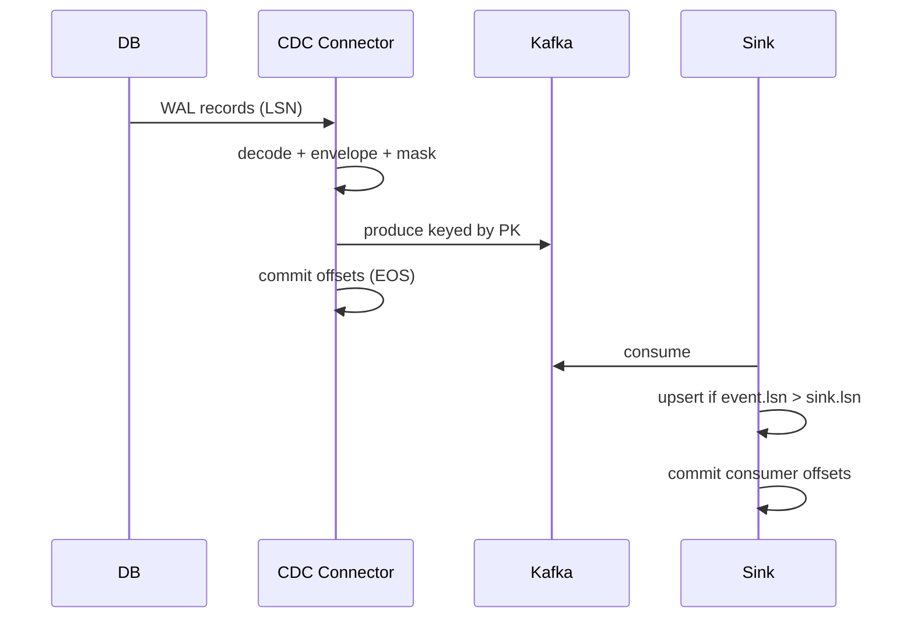
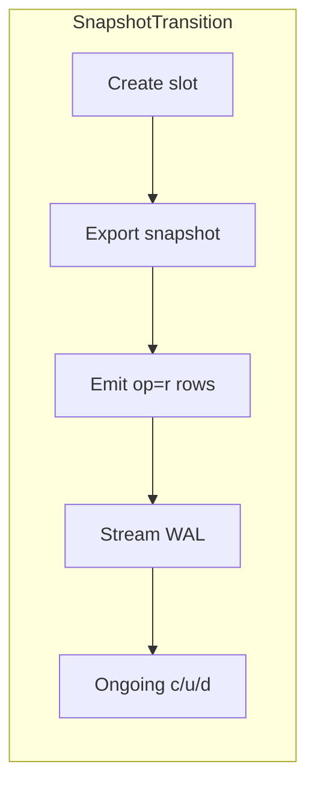

# System Design: Change-Data Capture (CDC)

> **Focus areas:** Binlog/WAL readers · Debezium-style connectors · Ordering · Schema evolution · Exactly-once sinks · Backfills/snapshots · Fan-out · Lag · Multi-tenant CDC platform  
> **Style:** End-to-end product design with progressive scale (10× → 100× → 1,000×)  
> **Quality bar:** Staff-level CDC—log mining mechanics, offsets, fencing, idempotent apply, lakehouse MERGE  
> **Interview theme:** Stream database changes into Kafka/lake/search with correctness under failover

---

## Table of Contents

1. [Clarify Requirements (Interview Q&A)](#1-clarify-requirements-interview-qa)
2. [Back-of-the-Envelope Estimation](#2-back-of-the-envelope-estimation)
3. [High-Level Design](#3-high-level-design)
4. [Architecture Diagram](#4-architecture-diagram)
5. [Design Deep Dive](#5-design-deep-dive)
6. [Wrap-Up](#6-wrap-up)
7. [Deeper / Related Interview Questions](#7-deeper--related-interview-questions)

---

## 1. Clarify Requirements (Interview Q&A)

Goal: design a **Change-Data Capture platform** that reliably captures row-level changes from operational databases (Postgres/MySQL/etc.), publishes them as ordered change events, and applies them to downstream sinks (Kafka consumers, lakehouse, search, caches) with well-defined consistency.

### 1.0 What this is / is not

| Dimension | This doc | Not this |
|-----------|----------|----------|
| Job | Capture & distribute DB changes | Replace OLTP DB itself |
| Mechanism | Log-based CDC (binlog/WAL) preferred | Only timestamp polling (legacy fallback) |
| Delivery | At-least-once + idempotent apply / EOS where possible | Cross-DB distributed transactions |
| Scope | Connector platform + apply patterns | Full ETL GUI |
| Consistency | Per-row / per-transaction ordered streams | Global order across shards always |

### 1.1 Functional Requirements

| # | Question | Typical answer | Implication |
|---|----------|----------------|-------------|
| F1 | Sources? | Postgres, MySQL; maybe Mongo/Dynamo later | Pluggable connectors |
| F2 | Capture method? | Logical decoding / binlog | Privileges + replication slots |
| F3 | Initial load? | Snapshot then stream | Consistent snapshot protocol |
| F4 | Events? | Insert/update/delete + old/new as needed | Envelope schema |
| F5 | Ordering? | Transaction order per table/key | Partition by PK |
| F6 | Schema changes? | DDL evolution | Schema history topic + registry |
| F7 | Fan-out? | Many consumers | Kafka topics per table/domain |
| F8 | Sinks? | Lake, search, cache, WH | Apply libraries with idempotency |
| F9 | Multi-tenant? | Many DBs/clusters | Connector isolation + quotas |
| F10 | Lag SLO? | Seconds typical | Monitor replication lag |
| F11 | Deletes? | Soft/hard; tombstones | Downstream compaction |
| F12 | Exactly-once? | Desired for lake/search | Offsets + transactional/idempotent sinks |
| F13 | PII? | Some columns sensitive | Column masking / topic ACLs |
| F14 | HA? | No single connector SPOF long | Single writer per slot + failover |

**MVP scope:**

1. Log-based CDC from Postgres (logical replication) and MySQL (binlog).  
2. Initial snapshot + transition to streaming without holes/dup storms (document semantics).  
3. Publish to Kafka with stable envelope (Debezium-like).  
4. Schema history + Registry integration.  
5. Reference sink: Iceberg MERGE / upsert + OpenSearch upsert.  
6. Lag metrics, DLQ, connector HA failover.  
7. Basic column exclude/mask.

**Out of MVP:** active-active multi-primary capture, automatic cross-shard global order, heterogeneous multi-cloud magic.

### 1.2 Non-Functional Requirements

| # | NFR | Target |
|---|-----|--------|
| N1 | Capture lag | p99 < 1–5s under normal; alert on growth |
| N2 | Durability | No loss of committed DB txns after publish ACK |
| N3 | Availability | Connector failover minutes; slot retained |
| N4 | Ordering | Per PK preserved in Kafka partition |
| N5 | Schema safety | Compatible evolution; DDL tracked |
| N6 | Source impact | Bounded; prefer replica; monitor slot lag disk |
| N7 | Security | Least privilege replication user; encrypt |
| N8 | Cost | Prefer log-based vs query polling storms |

### 1.3 Cases

**Happy**

1. Enable publication → snapshot → stream → Kafka → lake upsert current state.  
2. App UPDATE row → WAL → event with before/after → search index updates.  
3. DELETE → tombstone → sink deletes / marks deleted.  
4. ADD COLUMN nullable → schema history → consumers evolve.  
5. Connector crash → resume from stored LSN/GTID → catch up.

**Edges**

| Case | Behavior |
|------|----------|
| Replication slot disk growth | Alert; scale connector; degrade noncritical |
| Hot PK updates | Same partition ordered; throughput bound |
| DDL incompatible | Pause connector / DLQ; human migrate |
| Snapshot vs stream race | Use consistent snapshot (PG export snapshot / MySQL GTID) |
| Tombstone compaction | Kafka compact keys for changelog topics |
| Big transaction | Chunk carefully; memory bounds; still ordered |
| Source failover (PG promote) | Slot/LSN strategy; may need reconfiguration |
| Downstream slow | Kafka buffers; don't advance commit incorrectly |
| Duplicate events after restart | Idempotent sink by (src, lsn, txid, op) |
| Truncate table | Special event; sink may need rebuild |

### 1.4 Scales

| Metric | Baseline | 10× | 100× | 1,000× |
|--------|----------|-----|------|--------|
| Source DB clusters | 10 | 100 | 1K | 10K |
| Change events / s | 50K | 500K | 5M | 50M |
| Tables captured | 500 | 5K | 50K | 500K |
| Peak txn size | mid | large | huge | sharded sources |
| Connectors | 20 | 200 | 2K | 20K |
| Kafka partitions (CDC) | 200 | 2K | 20K | multi-cluster |
| Sink apply workers | 50 | 500 | 5K | cells |

**Jumps:** 10× = dedicated CDC Kafka + schema platform; 100× = per-domain cells, replica-only capture; 1,000× = automated connector control plane, shard-aware routing, hierarchical lag SLOs.

### 1.5 Etc.

- Prefer **replica capture** to protect primary.  
- Debezium-shaped envelopes are interview-friendly and practical.  
- Polling CDC is a fallback when logs unavailable—call out costs.

**Scope repeat-back:**

> Design a log-based CDC platform: snapshot+stream from OLTP, Kafka changelog topics with schema history, HA connectors, and idempotent/EOS sinks to lake and search—scaling from ~50K changes/s to multi-cell 1,000×.

---

## 2. Back-of-the-Envelope Estimation

### 2.1 Event rates

```text
Baseline 50K changes/s × 800 B envelope ≈ 40 MB/s
Kafka RF3 disk ≈ 120 MB/s
1,000× → tens of GB/s → many clusters
```

### 2.2 Snapshot sizing

```text
1 TB table snapshot @ 100 MB/s ≈ 3 hours
Must not block stream forever—use snapshot modes that allow concurrent WAL read
```

### 2.3 Slot lag disk (Postgres)

```text
If consumer stalls 1 hour @ 40 MB/s WAL ≈ 144 GB retained
→ Disk alarms; SLO on restart time
```

### 2.4 Hot keys

```text
Shopping cart row updates dominate → single Kafka partition heat
Monitor; consider secondary denorm topics aggregated
```

### 2.5 Sink apply

```text
OpenSearch bulk 5–10k upserts/s/node order-of
Lake MERGE micro-batches every 1–5 min for cost vs latency trade
```

---

## 3. High-Level Design

### 3.1 Change event envelope

```text
ChangeEvent
  op                 c|u|d|r (create/update/delete/read-snapshot)
  source             { db, schema, table, lsn|gtid, txId, ts_ms }
  before             row image or null
  after              row image or null
  transaction        { id, total_order, data_collection_order }
  schema_fingerprint id
```

Key for Kafka: primary key fields serialized stably → compaction & ordering.

### 3.2 Capture pipeline

```text
DB WAL/binlog
  → CDC Connector (single writer per slot)
  → Transform (mask, route, Renumber)
  → Kafka topics
  → Apply workers / stream jobs
       ├→ Lakehouse current + history
       ├→ Search upsert
       └→ Cache invalidation
```

### 3.3 Snapshot + streaming join

**Postgres sketch:**

1. Create replication slot.  
2. Export snapshot; read tables under snapshot.  
3. Publish `op=r` events.  
4. Stream WAL from slot; skip already reflected per protocol.  

**MySQL:** GTID + binlog position; snapshot with consistent locking modes depending on engine/engine settings.

**Deal-breaker:** naive "dump table then start binlog from now" without coordination → missed/dup windows.

### 3.4 Why log-based > polling

| | Log-based | Timestamp polling |
|--|-----------|-------------------|
| Deletes | Native | Hard / soft-delete only |
| Overhead | Low | Repeated queries |
| Ordering | Transactional | Approximate |
| Latency | Seconds | Interval-bound |

### 3.5 Topic strategy

| Strategy | Pros | Cons |
|----------|------|------|
| Topic per table | Clear ACLs | Explosion of topics |
| Topic per domain | Fewer | Mixed schemas |
| Single topic | Simple | Hotspot / schema hell |

**Default:** topic per table for high-value; domain buckets for long-tail.

Compaction: changelog topics compacted on PK for current-state consumers; separate infinite retention for audit if needed.

### 3.6 Schema evolution

- Schema history topic (Debezium style) records DDL.  
- Registry holds Avro/Protobuf of envelopes.  
- ADD COLUMN compatible; DROP/RENAME require coordinated consumer deploy.  
- Column exclude list for secrets.

### 3.7 Exactly-once & offsets

| Stage | Mechanism |
|-------|-----------|
| Connector → Kafka | Idempotent producer; store source offset in Kafka Connect offsets topic atomically with produce (EOS framework) |
| Kafka → Lake | Flink/Spark EOS or micro-batch MERGE keyed by PK + version(lsn) |
| Kafka → OLTP sink | Idempotent upsert with `WHERE sink_lsn < event_lsn` |

**Version compare apply rule:**

```sql
UPDATE sink SET cols..., lsn=:lsn
WHERE pk=:pk AND lsn < :lsn
```

Prevents old replays from clobbering newer state.

### 3.8 Control plane APIs

| API | Purpose |
|-----|---------|
| Register source | Conn info, tables include list |
| Start/stop/pause | Connector lifecycle |
| Trigger snapshot | Selective re-snapshot |
| Lag / health | LSN lag, slot size |
| Schema / masking policy | Governance |

---

## 4. Architecture Diagram







---

## 5. Design Deep Dive

### 5.1 Reliability

**No holes after publish**

- Only advance offsets after durable Kafka produce (Connect EOS).  
- Replication slot retained across connector restarts.  
- Monitor `restart_lsn` / lag bytes.

**HA connectors**

- Single active task per slot (leadership via Connect/K8s lease).  
- Standby cold; on failover resume offsets.  
- Fencing: ensure old writer cannot produce after new leader (epoch / transactional.id).

**Retries / DLQ**

- Serialization/schema errors → DLQ with offset pause policy.  
- Poison row shouldn't block entire table forever—quarantine PK.

**Backpressure**

- Kafka producer buffer full → pause WAL read (carefully with slot growth).  
- Scale consumers; emergency pause noncritical sources.

**Source protection**

- Capture from replica.  
- Limit tables; filter heartbeats.  
- Alert before WAL disk full.

### 5.2 Scalability

**Parallelism**

- One connector task per slot often; scale by sharding tables across publications/slots.  
- Kafka partitions = PK hash; sink parallelism follows.  
- Initial snapshot parallel by table ranges / primary key chunks.

**Multi-tenant**

- Connector-per-source isolation.  
- Quotas on produce rate.  
- Noisy DB → dedicated Kafka cluster.

**1,000× cells**

```text
Cell = region × domain
Local CDC → local Kafka → local sinks
Global: control plane directory of sources
```

**Fan-out efficiency**

- Don't N-way query DB; one capture, many consumers.  
- Derived streams via stream processing for denormalizations.

### 5.3 Maintainability

**Observability**

- Lag seconds + lag bytes; events/s; snapshot progress %; DLQ rate; sink apply errors; slot age.  
- Canary table with heartbeat row updates every second.

**Migrations / DDL**

- Expand/contract patterns for Breaking changes.  
- Dual topics during rename.  
- Coordinated consumer releases.

**Ops**

- Re-snapshot tool for corruption.  
- Offset rewind with care (dupes).  
- Runbook: slot drop disaster → full resnapshot.

### 5.4 Postgres logical decoding specifics

- `pgoutput` / `wal2json` / decoderbufs.  
- Publications + replication slots.  
- Replica identity FULL for before images on updates/deletes when needed.  
- Toast/large values considerations.  
- Vacuum / horizon: slots hold xmin—**operational footgun**.

### 5.5 MySQL binlog specifics

- Row-based binlog mandatory for rich CDC.  
- GTID preferred for failover.  
- `binlog_row_image=FULL` for before images.  
- Consistent snapshot with `SHOW MASTER STATUS` coordination.

### 5.6 Lakehouse apply patterns

| Pattern | Latency | Cost | Notes |
|---------|---------|------|-------|
| Micro-batch MERGE | minutes | medium | Common |
| Streaming upsert MoR | seconds | higher | Hudi/Iceberg evolving |
| Copy-on-write nightly | hours | low | Analytics |

Keep **change history** table append-only + **current state** table upserted.

### 5.7 Outbox pattern vs log CDC

| | Outbox | Log CDC |
|--|--------|---------|
| App changes | Required | Transparent |
| Dual-write bugs | Avoided with txn outbox | N/A |
| Legacy DBs | Hard | Works |
| Deletes/schema | App must emit | Natural |

Interview: recommend **log CDC for platform**, outbox for app-level integration events when business meaning ≠ row images.

### 5.8 Watermarking in CDC sinks

- Event time ≈ source commit ts.  
- For windowed analytics on CDC, WM from commit timestamps; beware stalls if low traffic—heartbeats.  
- Processing time OK for "apply as soon as possible" sinks.

---

## 6. Wrap-Up

### Decisions

| Decision | Choice | Why |
|----------|--------|-----|
| Capture | Log-based | Deletes, order, low load |
| Bus | Kafka compacted changelogs | Fan-out + replay |
| Envelope | Debezium-like | Ecosystem |
| EOS | Connect offsets + lsn upsert | Correct apply |
| Snapshot | Coordinated with stream | No holes |
| Scale | Cells + replica capture | Protect OLTP |

### Phased rollout

1. Single PG source → Kafka → one sink.  
2. Schema history + masking + HA.  
3. Snapshot automation + lake MERGE + search.  
4. Multi-source control plane; cells; compaction policies.

### Punch lines

- **Slot lag is a disk bomb**—treat as pager.  
- **Idempotent apply by LSN/version** beats hoping for perfect EOS.  
- **Snapshot+stream coordination** is the hard part interviewers probe.

---

## 7. Deeper / Related Interview Questions

**Q1. Why replica identity FULL?**  
A: Needed to include old values / locate rows without PK uniqueness assumptions for updates/deletes.

**Q2. What happens if you drop a replication slot accidentally?**  
A: Lose position; must re-snapshot; WAL recycling may make catch-up impossible.

**Q3. How do you guarantee per-key order in Kafka?**  
A: Same PK → same partition; producer max.in.flight with idempotence settings careful with ordering.

**Q4. EOS in Kafka Connect?**  
A: Source tasks write records + offsets in one transaction to Kafka (exactly-once source).

**Q5. How to handle PK change?**  
A: Treat as delete old + create new; consumers must understand; rare—prefer immutable surrogate keys.

**Q6. Tombstones vs soft deletes?**  
A: Tombstone null value for compacting changelog; sink may keep soft-delete column for analytics.

**Q7. CDC for sharded DB?**  
A: Connector per shard; topics include shard id; merge sinks resolve with care; no global txn order.

**Q8. Difference vs trigger-based CDC?**  
A: Triggers add OLTP overhead and complexity; logs preferred.

**Q9. How do you mask PII in CDC?**  
A: SMT/transform at connector; separate restricted topics; encrypt fields.

**Q10. Large transaction memory?**  
A: Buffer bounds; stream per-row with tx metadata; avoid assembling entire tx in RAM.

**Q11. Search sink races?**  
A: Apply with version/lsn; ignore older events; bulk refresh rebuild for divergence.

**Q12. How to test CDC pipelines?**  
A: Deterministic SQL fixtures; inject WAL; assert Kafka + sink; chaos kill connector mid-tx.

**Q13. Multi-region OLTP with CDC?**  
A: Capture locally; replicate topics; watch for write locality—active-active CRDT not free.

**Q14. Schema history vs registry?**  
A: History is chronological DDL log for connectors; registry is evolve/compat for serializers.

**Q15. When is polling acceptable?**  
A: Tiny tables, no binlog access, soft deletes only—never default at scale.

**Q16. Kafka compaction pitfalls?**  
A: Tombstone retention; dirty keys; consumers needing full history need non-compacted audit topic.

**Q17. How does Flink CDC differ?**  
A: Engine-integrated readers; similar WAL decode; unify with stream jobs—ops model differs from Connect.

**Q18. Backfill historical changes not in WAL?**  
A: Impossible from logs alone; need snapshots / backups / app logs.

**Q19. Hot partition mitigation?**  
A: Accept order limit; scale sink vertically for that partition; denormalize aggregates elsewhere.

**Q20. Consistent hashing usage?**  
A: PK → partition; connector assignment of tables to tasks via hash ranges.

**Q21. Load balancer role?**  
A: Control plane APIs; not on WAL path—connectors pull from DB.

**Q22. Memory issues in connectors?**  
A: Snapshot queues; large rows; JSON conversion—stream & bound batches.

**Q23. Exactly-once into Snowflake?**  
A: Snowpipe/staging + MERGE on lsn; or transactional connectors; still design idempotent keys.

**Q24. Heartbeat tables—why?**  
A: Advance offsets & WM during low traffic; detect stuck connectors.

**Q25. DDL during snapshot?**  
A: Risky; lock schedules; prefer expand-contract; pause snapshot on incompatible DDL.

**Q26. Fan-out to 200 consumers?**  
A: Kafka handles; watch broker fan-out; use mirror/clusters for isolation.

**Q27. Cost of before/after images?**  
A: ~2× payload; disable before when sinks don't need; trade debugability.

**Q28. How to prove no missed updates?**  
A: Checksums/row counts vs source periodic reconcile; canary counter table; LSN monotonic audit.

**Q29. Blue/green DB upgrade?**  
A: New slot on new primary; cutover runbook; short dual-publish if needed.

**Q30. Staff: zombie connector after network split?**  
A: Lease/epoch fencing; Kafka transactional fencing; only one producer for task; detect dual-active via metrics.

---

### Appendix A — Apply pseudocode

```text
for event in consumer:
  if event.op in {c,u,r}:
     upsert(event.after, version=event.lsn)
  elif event.op == d:
     delete_or_mark(event.before.pk, version=event.lsn)
  commit_offsets()  # after durable sink ack
```

### Appendix B — Privileges checklist (Postgres)

```text
REPLICATION, SELECT on tables, CREATE PUBLICATION privileges as needed
r/w on schema history storage
Never app superuser for connector
```

### Appendix C — Lag SLO burn

```text
lag_seconds = source_latest_commit_ts - last_emitted_source_ts
Alert: lag > 60s for 5m (sev2); lag_bytes > X GB (sev1 disk)
```

### Appendix D — Progressive scale architecture

```text
Baseline: Connect cluster + 1 Kafka + few sinks
10×: schema platform, DLQ, replica capture
100×: per-domain CDC cells, automated snapshots
1,000×: control plane for 10k DBs, hierarchical quotas, reconcile fleet
```

### Appendix E — Common interview trap answers

| Trap | Strong answer |
|------|---------------|
| "Just use updated_at" | Misses deletes & clock issues |
| "EOS means no dupes ever" | Replays happen; sinks must be idempotent |
| "One topic for all tables" | Operational pain at scale |
| "Capture on primary only" | Risk load; prefer replica |
| "Ignore DDL" | Consumers break silently |

---

*End of change-data capture system design.*
