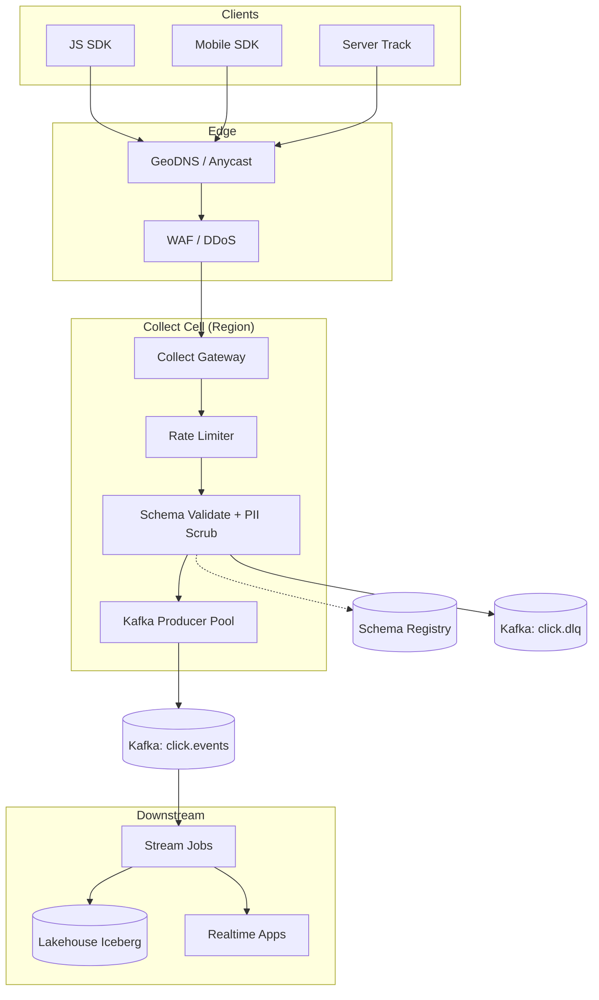
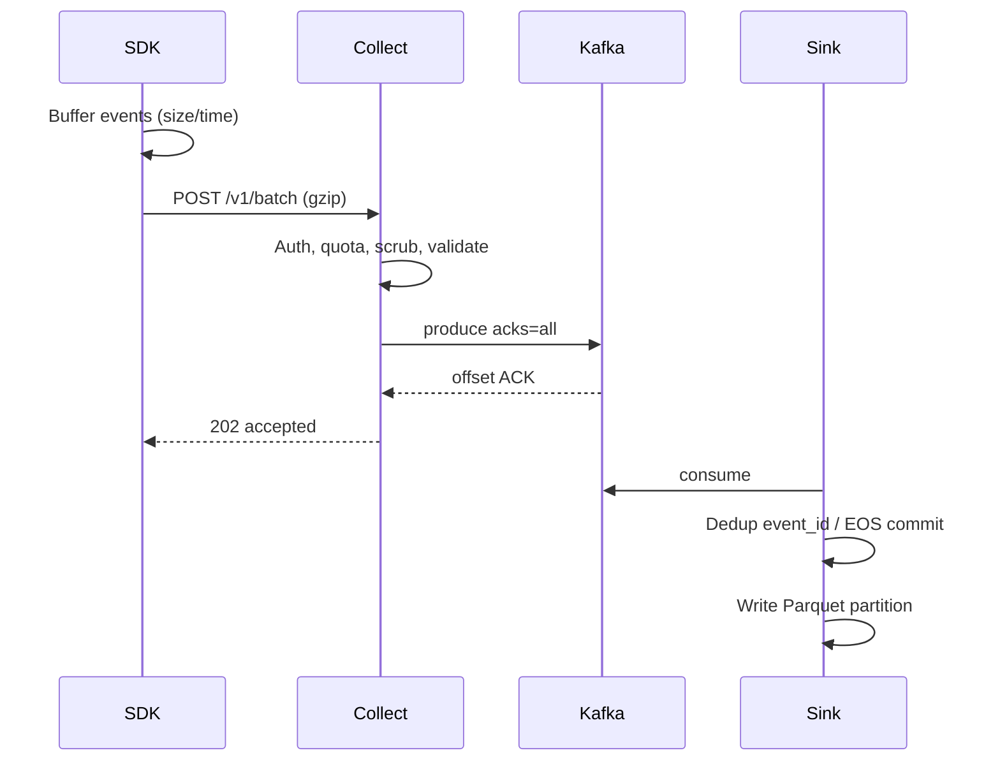

# System Design: Clickstream Collection System

> **Focus areas:** Client SDK · Beacon/collect APIs · Batching & buffering · Kafka ingestion · Schema registry · Dedup · Sessionization · Privacy/PII · Late events · Lakehouse landing  
> **Style:** End-to-end product design with progressive scale (10× → 100× → 1,000×)  
> **Quality bar:** Interview-passable for senior/staff data-platform loops; Kafka mechanics, schema evolution, at-least-once vs exactly-once sinks made explicit  
> **Interview theme:** Design the system that collects product analytics / clickstream events from web + mobile at internet scale

---

## Table of Contents

1. [Clarify Requirements (Interview Q&A)](#1-clarify-requirements-interview-qa)
2. [Back-of-the-Envelope Estimation](#2-back-of-the-envelope-estimation)
3. [High-Level Design](#3-high-level-design)
4. [Architecture Diagram](#4-architecture-diagram)
5. [Design Deep Dive](#5-design-deep-dive)
6. [Wrap-Up](#6-wrap-up)
7. [Deeper / Related Interview Questions](#7-deeper--related-interview-questions)

---

## 1. Clarify Requirements (Interview Q&A)

Goal: design a **clickstream collection platform** that captures user interaction events (page views, clicks, impressions, custom product events) from browsers and apps, lands them durably in a streaming backbone, and makes them available to analytics, personalization, and ML—without blocking the product UX.

### 1.0 What this is / is not

| Dimension | This doc | Not this |
|-----------|----------|----------|
| Job | Collect, validate, route, land clickstream | Full product analytics BI product (Mixpanel UI) |
| Plane | Ingestion + light enrichment + lake landing | Heavy stream joins / feature serving (touches them) |
| Transport | HTTPS beacon + SDK batch; Kafka backbone | Replacing app DB / OLTP |
| Consistency | At-least-once ingest; sink-dependent EOS | Strict global ordering of all users' events |
| Privacy | Consent, PII scrubbing, retention | Full CDP / identity graph product |

### 1.1 Functional Requirements

| # | Question to ask | Expected / typical interviewer answer | Design implication |
|---|-----------------|----------------------------------------|--------------------|
| F1 | Who emits events? | Web JS SDK, iOS/Android SDK, server-side track API | Multi-SDK + shared schema; server events for trusted paths |
| F2 | Event types? | `page_view`, `click`, `impression`, `identify`, custom `track` | Envelope + typed payload; schema registry per event name |
| F3 | Real-time consumers? | Yes: fraud, personalization within seconds; also batch warehouse | Kafka fan-out; dual sink (stream + lake) |
| F4 | Durability SLA? | Almost never lose acknowledged events | ACK only after Kafka produce with required acks |
| F5 | Ordering? | Per-user / per-session roughly ordered; global order not required | Partition key = `user_id` or `anonymous_id` |
| F6 | Dedup? | Client retries common; want countable metrics | Event UUID + sink-side dedup window |
| F7 | Offline / flaky mobile? | SDK must buffer and retry | Local disk/SQLite queue; exponential backoff; size caps |
| F8 | Schema evolution? | Product ships weekly; fields added often | Backward-compatible Avro/Protobuf + registry |
| F9 | PII / consent? | GDPR/CCPA; consent flags; IP hashing optional | Edge scrubbing; consent gate; retention policies |
| F10 | Bot / fraud traffic? | Filter obvious bots; keep suspicious for fraud team | Edge filters + quarantine topic |
| F11 | Sessionization? | Session id client-side; server may recompute | SDK session timeout + server repair job |
| F12 | Multi-tenant / multi-product? | Many apps/properties under one company | `app_id` / `write_key` auth; topic or partition strategy |
| F13 | Sampling? | High-volume events may sample client-side | Deterministic hash sampling; mark `sample_rate` |
| F14 | Debug / replay? | Engineers need dry-run and replay for a window | Dead-letter + raw archive with replay tooling |

**MVP functional scope (lock with interviewer):**

1. JS + mobile SDKs batch events to a regional Collect API.
2. Collect validates write key, schema (soft), size, rate limits; produces to Kafka.
3. Schema Registry holds event schemas; compatible evolution enforced.
4. Dual sink: (a) streaming consumers, (b) landing zone Parquet on object storage.
5. Client-side buffering, retry, offline queue; server ACK semantics documented.
6. Basic PII scrub (email/IP policies), consent flag enforcement.
7. Ops: lag dashboards, DLQ, per-app quotas.

**Out of MVP (explicitly defer):**

- Full identity resolution / cross-device graph
- Real-time feature store materialization (design hooks only)
- Perfect bot-free traffic (keep quarantine path)
- Active-active multi-region write for same partition (prefer regional home + async)
- Interactive product analytics UI

### 1.2 Non-Functional Requirements

| # | Question | Expected answer | Target |
|---|----------|-----------------|--------|
| N1 | Collect API latency? | Must not hurt page UX | p99 < 100–150ms for ACK (batch of events) |
| N2 | End-to-end freshness? | Near-real-time path | Kafka → consumer < 5–15s p99 under load |
| N3 | Availability? | Collection critical for business metrics | 99.95% regional Collect; degrade with client buffer |
| N4 | Durability? | No silent drop after ACK | Kafka `acks=all`, RF≥3, min ISR |
| N5 | Consistency? | At-least-once default | Exactly-once-like at sinks via idempotent keys |
| N6 | Multi-region? | Users global | Geo-DNS / Anycast to nearest Collect; regional Kafka |
| N7 | Security? | Write keys, TLS, abuse | mTLS optional for server track; WAF; key rotation |
| N8 | Cost? | Volume-dominated | Compress, sample, tier storage, compact topics carefully |

### 1.3 Cases (User Flows & Edge Cases)

**Happy paths**

1. Page load → SDK initializes → `page_view` + subsequent `track` batched every 2s or 20 events → Collect 202 → Kafka → lake + stream.
2. Mobile offline for 2h → SDK disk queue → reconnect → flush with backoff → events land with original `client_ts`.
3. Schema adds optional field → registry accepts BACKWARD → old + new producers coexist.
4. User opts out of analytics → SDK stops sending (or sends only essential); server drops if consent false when required.
5. Engineer replays yesterday's raw archive into a staging topic for a new consumer.

**Edge / failure cases**

| Case | Behavior |
|------|----------|
| Collect overloaded | Shed / 429; SDK buffers; never block UI thread |
| Kafka unavailable | Collect fails open to local spill or returns 503; SDK retries |
| Duplicate batches | Same `event_id` → sink upsert / dedup store |
| Clock skew | Prefer `server_ingest_ts`; keep `client_ts`; watermark on event time carefully |
| Huge payload / attachment | Reject > N KB; no binary blobs in clickstream |
| Schema breaking change | Registry reject; DLQ for invalid; alert owning team |
| Hot anonymous_id (bot farm) | Rate limit per IP / device; quarantine topic |
| Partial batch failure | Prefer all-or-nothing produce of batch; or per-event ACK list |
| Consent revoked mid-session | Stop further emit; deletion pipeline is separate GDPR system |
| Ad blockers / beacon blocked | `sendBeacon` + pixel fallback; accept lossy edge |

### 1.4 Scales (Progressive)

| Metric | Baseline | 10× | 100× | 1,000× |
|--------|----------|-----|------|--------|
| DAU | 5M | 50M | 500M | 5B (multi-app platform) |
| Events / user / day | 80 | 80 | 100 | 120 |
| Events / day | 400M | 4B | 50B | 600B |
| Peak events / s | ~20K | ~200K | ~2M | ~20M |
| Avg event size (compressed wire) | 400 B | 400 B | 350 B | 300 B |
| Peak ingress bandwidth | ~8 MB/s | ~80 MB/s | ~700 MB/s | ~6 GB/s |
| Kafka partitions (click topic) | 64 | 256 | 1–2K | 4–8K (multi-cluster) |
| Collect nodes (regional) | 8 | 40 | 200 | 1K+ cells |
| Raw lake / day | ~160 GB | ~1.6 TB | ~18 TB | ~180 TB |
| Distinct event schemas | 50 | 150 | 400 | 1K+ |

**What each jump forces architecturally:**

- **10×:** Dedicated Collect tier; Kafka partition growth; SDK adaptive batching; per-app quotas.
- **100×:** Multi-cluster Kafka by region/tenant tier; schema cache at edge; tiered storage; sampling policies for ultra-hot events.
- **1,000×:** Cell architecture (region × product tier); federated registry; lake compaction pipelines; hierarchical rate limits; separate hot-path fraud topics.

### 1.5 Etc. (Constraints & Assumptions)

- **Single primary cloud**, multi-AZ Kafka; multi-region active-active Collect with regional Kafka (not one global log).
- **Not** building Mixpanel UI; consumers own semantics.
- **Event time** vs processing time both retained.
- **SDK open-source-ish** client; Collect is the trust boundary.

**Scope statement to repeat back:**

> Design a multi-SDK clickstream collection system: batched Collect API, schema-evolved events into regional Kafka, dual sink to stream consumers and lakehouse Parquet, with client buffering, dedup hooks, consent/PII controls—starting at ~400M events/day and scaling cleanly to 1,000× via cells and multi-cluster Kafka.

---

## 2. Back-of-the-Envelope Estimation

### 2.1 Traffic

```text
Baseline: 5M DAU × 80 events/user/day = 400M events/day
Average QPS = 400e6 / 86400 ≈ 4,630 events/s
Peak factor 4–5× (evenings, launches) ≈ 20K events/s

SDK batches ~20 events → Collect RPS ≈ 1K avg, ~5K peak (baseline)
```

At **1,000×:** ~20M events/s peak → Collect batch RPS still lower if batch size grows (e.g. 50–100), but Kafka produce throughput dominates.

### 2.2 Bandwidth & storage

```text
Wire (gzip/zstd JSON or binary): ~400 B/event
Baseline peak: 20K × 400 B ≈ 8 MB/s ingress
1,000×: 20M × 300 B ≈ 6 GB/s ingress (multi-region)

Lake raw (uncompressed logical ~1 KB/event before columnar):
400M × 1 KB ≈ 400 GB/day logical → Parquet+zstd often ~100–200 GB/day
1,000×: hundreds of TB/day → aggressive partition pruning, lifecycle, sampling
```

### 2.3 Kafka sizing

```text
Partition throughput rule of thumb: ~10–50 MB/s sustainable / partition (varies)
Baseline 8 MB/s → 64 partitions comfortable with headroom
1,000× 6 GB/s → need many clusters × thousands of partitions; never one giant topic forever
```

Replication factor 3 ⇒ disk write amp ~3× plus indexes.

### 2.4 Collect memory / connections

```text
Keep-alive HTTP/2; batch body ~8–40 KB
Per-node: 10K–50K concurrent connections feasible
Baseline peak 5K RPS × 50ms → ~250 in-flight; tiny
1,000×: connection + TLS CPU + produce pool become the limiter → shard Collect cells
```

### 2.5 Dedup memory (optional online)

```text
Bloom / Redis TTL for event_id over 24h
400M ids/day × 16 B ≈ 6.4 GB raw hashes → sharded Redis / RocksDB
At 1,000×: only dedup hot windows or sink-side (Iceberg MERGE / Kafka EOS)
```

### 2.6 Hot keys

```text
Partition key = user_id: mostly fine
Bot / VIP anonymous_id can skew one partition → salt key for suspected bots; monitor partition lag skew
```

---

## 3. High-Level Design

### 3.1 Event envelope

```text
ClickEvent
  event_id          UUID (client-generated, stable across retry)
  event_name        string (schema key)
  event_version     int
  app_id            string
  write_key_id      string (not secret in logs)
  user_id           optional string
  anonymous_id      string
  session_id        string
  client_ts         epoch ms
  sent_at           epoch ms
  ingest_ts         set by Collect
  received_region   set by Collect
  consent           { analytics: bool, ads: bool, ... }
  context           { ua, locale, app_version, os, ip_hash, geo_country }
  sample_rate       float (1.0 = unsampled)
  properties        JSON / Avro record (schema-specific)
```

**Deal-breaker:** never ACK before durable append if the product claims "reliable analytics." Soft-ACK + best-effort is a different product—call it out.

### 3.2 API shape

| Method | Path | Purpose |
|--------|------|---------|
| POST | `/v1/batch` | Primary SDK batch ingest |
| POST | `/v1/track` | Single event (server) |
| POST | `/v1/identify` | Traits update (may be separate topic) |
| GET | `/v1/health` | LB health |
| POST | `/v1/schema/validate` | Dev dry-run (optional) |

```http
POST /v1/batch
Authorization: Bearer wk_...
Content-Encoding: gzip
Content-Type: application/json

{
  "sent_at": 1710000000000,
  "batch": [ { "event_id": "...", "event_name": "page_view", ... } ]
}
```

Response: `202 Accepted` with `{ "accepted": N, "rejected": [...] }` or fail closed for auth.

**Idempotency:** `event_id` is the idempotency key for sinks; Collect may also accept `Idempotency-Key` for whole batch.

### 3.3 Component architecture

```text
SDK (JS/iOS/Android)
  → CDN edge / Anycast
  → Collect Gateway (auth, rate limit, scrub, validate)
  → Kafka (topics: events.raw, events.dlq, events.quarantine)
  → Schema Registry
  → Sink connectors / Flink jobs
       ├→ Lakehouse (Iceberg/Delta Parquet)
       ├→ Realtime consumers (fraud, personalization)
       └→ Warehouse load (optional)
```

### 3.4 Why Kafka (not Kinesis / Pulsar / direct S3)

| Option | Pros | Cons | Verdict |
|--------|------|------|---------|
| Kafka | Fan-out, replay, eco-system, partitioning | Ops cost | **Default backbone** |
| Kinesis | Managed | Shard limits, cost at scale | OK if cloud-locked |
| Direct S3 put | Cheap | No low-latency fan-out | Use as secondary archive only |
| Pulsar | Multi-tenant niceties | Team familiarity | Optional |

**Deal-breaker against "SDK → S3 only":** real-time consumers and controlled replay become painful; Collect still needs a buffer.

### 3.5 Partitioning & keys

```text
key = hash(user_id || anonymous_id)
→ per-user ordering for sessionization-ish consumers
→ watch skew; allow key = hash(anonymous_id + salt) for bots
```

Topic strategy:

| Topic | Retention | Notes |
|-------|-----------|-------|
| `click.events` | 3–7d | Hot path |
| `click.dlq` | 14–30d | Invalid / poison |
| `click.quarantine` | 7d | Bot-ish |
| Lake | months–years | Lifecycle tiers |

### 3.6 Schema evolution

- Register `event_name` + version in Schema Registry (Avro/Protobuf/JSON Schema).
- Compatibility: **BACKWARD** (readers with new schema read old data) common for analytics; or **FULL** for stricter.
- Collect: soft-validate in MVP (warn + accept), hard-validate for tier-1 events.
- Breaking change → new `event_name` or major version topic migration.

### 3.7 Exactly-once story (honest)

| Stage | Guarantee |
|-------|-----------|
| SDK → Collect | At-least-once (retries) |
| Collect → Kafka | At-least-once; idempotent producer optional |
| Kafka → Lake (Flink/Spark) | EOS transactional sink or idempotent MERGE on `event_id` |
| Metrics dashboards | Often at-least-once + dedup window |

Never claim "exactly-once end-to-end from browser" without caveats—browsers lose power.

### 3.8 Privacy controls

1. Consent flags required for analytics properties.
2. IP → truncated / hashed at Collect; raw IP only short TTL if needed for fraud.
3. PII scrubbers for email/phone in `properties`.
4. Retention: hot Kafka short; lake TTL by jurisdiction; delete/suppress pipeline hooks.

---

## 4. Architecture Diagram





---

## 5. Design Deep Dive

### 5.1 Reliability

**Data-loss prevention**

- SDK: durable local queue (IndexedDB / SQLite); drop-oldest policy when over capacity; surface metrics.
- Collect: ACK only after Kafka produce success with `acks=all` and `min.insync.replicas=2`.
- Spill-to-disk on Collect if Kafka briefly down (bounded); else 503 and client retry.
- Dual-write anti-pattern: don't write S3 then Kafka without a coordinator—prefer Kafka first, sink to S3.

**Retries & idempotency**

- SDK retries with jittered exponential backoff; reuse `event_id`.
- Idempotent Kafka producer (`enable.idempotence=true`) reduces broker dupes on produce retry.
- Sink: primary key / MERGE on `(app_id, event_id)` or Flink Kafka EOS.

**Rate limits & backpressure**

| Layer | Mechanism |
|-------|-----------|
| SDK | Max queue bytes; adaptive batch interval |
| Collect | Token bucket per `app_id`, IP, device |
| Kafka | Quotas; producer buffer timeout → 429/503 |
| Sink | Lag-based autoscaling; pause partitions |

**Late / out-of-order events**

- Keep both `client_ts` and `ingest_ts`.
- Stream jobs: event-time watermarks with allowed lateness (e.g. 15m–2h); side output late data to correction path.
- Sessionization: inactivity timeout (30m) client-side; server re-sessionize for analytics truth.

**Poison pills**

- Max record size; schema fail → DLQ with reason code; never block partition forever.
- Quarantine for bot scores without dropping evidence for fraud.

### 5.2 Scalability

**Scale-out Collect**

- Stateless gateways behind L7 LB; sticky not required.
- Regional cells; GeoDNS.
- Connection and CPU scale horizontally; produce threads pooled per node.

**Kafka growth path**

| Scale | Action |
|-------|--------|
| 10× | Increase partitions; more brokers |
| 100× | Split topics by app tier / event class; multi-cluster |
| 1,000× | Federation; tiered storage; produce proxies |

**Storage tiers**

1. Kafka hot (days)
2. Iceberg/Delta daily/hourly partitions
3. Cold Glacier/Archive for raw compliance dumps
4. Aggregates / rollups for cheap queries

**Parallelization**

- Consumers scale with partitions.
- Lake writers: partition by `app_id`, `dt`, `hr`; avoid tiny files via micro-batch commit.

**Sampling & cost control**

- Client deterministic sampling for ultra-hot `impression` events.
- Server sampling as circuit breaker (mark `sample_rate`).
- Compress wire + columnar lake.

### 5.3 Maintainability

**Ops**

- Golden signals: Collect success %, produce fail, Kafka lag, DLQ rate, schema fail rate, partition skew.
- SLO: ACK success ≥ 99.9%; p99 ACK latency; lake freshness ≤ 15m (batch) / ≤ 1m (streaming sink).

**Observability**

- Trace `event_id` through Collect logs (sampled).
- Per-app dashboards; cardinality-safe metrics (not per-user).

**Migrations / schema**

- Registry compatibility checks in CI for schema PRs.
- Dual-publish during renames; consumers migrate; then decommission.

**Multi-tenant**

- `write_key` → `app_id` authz.
- Noisy neighbor: separate Kafka quotas; dedicated clusters for whales.
- Data isolation: lake path `s3://lake/click/{app_id}/dt=...`.

**SDK release**

- Version negotiation; Collect tolerates N versions.
- Feature flags for new context fields.

---

## 6. Wrap-Up

### Decision summary

| Decision | Choice | Why |
|----------|--------|-----|
| Backbone | Regional Kafka | Fan-out, replay, ecosystem |
| Ingest API | Batched HTTPS Collect | Mobile/web friendly; CDN edge |
| Schema | Registry + BACKWARD | Product velocity |
| Guarantee | At-least-once + sink dedup/EOS | Honest browser reality |
| Partition key | user/anonymous id | Local ordering |
| Lake | Iceberg/Delta Parquet | Analytics + evolution |
| Multi-region | Active Collect, regional logs | Avoid global single log |

### Phased rollout

1. **Phase 0:** Collect + Kafka + one lake sink; JS SDK only.
2. **Phase 1:** Mobile offline queue; schema registry hard mode for core events; DLQ.
3. **Phase 2:** Realtime consumers; quarantine; privacy scrubbers; quotas.
4. **Phase 3:** Multi-cluster cells; sampling platform; replay tooling; identity hooks.

### Staff-level punch lines

- Separate **ACK durability** from **exactly-once analytics**.
- **Schema + consent** are product features, not afterthoughts.
- Scale jumps are about **cells and file sizes**, not just "add consumers."

---

## 7. Deeper / Related Interview Questions

**Q1. Why not WebSocket for clickstream?**  
A: Mostly unary batches; HTTP/2 + `sendBeacon` fits page lifecycle; WS costs sticky conns without enough benefit.

**Q2. `sendBeacon` vs `fetch` keepalive?**  
A: Beacon reliable on unload but limited size/headers; use both—batch during session with fetch, flush on unload with beacon.

**Q3. How do you pick Kafka partition count?**  
A: Target throughput / per-partition limit + consumer parallelism; plan for 2–4× growth; remember repartition pain—over-provision early within reason.

**Q4. How does idempotent producer differ from EOS transactions?**  
A: Idempotent producer dedups produce retries to the same partition sequence; EOS transactions atomically commit offsets + sink side effects across partitions.

**Q5. Event time vs processing time for funnels?**  
A: Funnels need event time; processing time breaks on late mobile flush—use watermarks + lateness.

**Q6. How to sessionize at scale?**  
A: Client session_id for UX; server session windows keyed by user with gap timeout in Flink; store session facts in lake.

**Q7. Dedup 600B events/day?**  
A: Don't keep global 365d Redis; use sink primary key in lake MERGE for daily partitions + short bloom for stream.

**Q8. Hot partition mitigation?**  
A: Detect lag skew; salt keys; isolate bot traffic; dedicated quarantine topic.

**Q9. Schema compatibility BACKWARD vs FORWARD?**  
A: BACKWARD: new schema reads old data (add optional fields). FORWARD: old schema reads new data. FULL = both. Analytics lakes often BACKWARD.

**Q10. How do ad blockers change design?**  
A: First-party domain Collect; accept residual loss; server-side events for critical conversions.

**Q11. GDPR delete for clickstream?**  
A: Minimize PII at ingest; keyed delete jobs on lake by `user_id`; Kafka retention short so usually expires; document unrewritable cold archives.

**Q12. Should Collect write Postgres?**  
A: No for raw events—OLTP dies. Metadata/config/write keys yes.

**Q13. JSON vs Avro on the wire?**  
A: JSON easy for web; binary better at 100×. Hybrid: JSON at Collect, convert to Avro/Protobuf to Kafka.

**Q14. How to test schema changes safely?**  
A: Contract tests in CI; canary app_id; dual-consume shadow; DLQ budget alert.

**Q15. Exactly-once into Snowflake/BigQuery?**  
A: Prefer staging + MERGE on event_id, or transactional connectors; still at-least-once from client.

**Q16. Memory blowup on Collect validate?**  
A: Cap batch size/count; streaming parse; reject giant arrays.

**Q17. Consistent hashing for Collect cells?**  
A: Usually Geo + LB round-robin enough; consistent hash if sticky SDK affinity to regional spill stores.

**Q18. How do you bound lake small files?**  
A: Micro-batch 1–5 min commits; compaction service; target 100MB–1GB files.

**Q19. Clickstream vs log ingestion—difference?**  
A: Clickstream is product telemetry with product schemas/consent; logs are ops text/structured from hosts—different SLOs and PII.

**Q20. Design a count-distinct DAU pipeline on this?**  
A: Stream HLL sketches per minute keyed by app; merge in lake; reconcile with nightly exact for trust.

**Q21. What breaks at 1,000× first?**  
A: Kafka cluster ops, lake committers, schema cardinality, noisy tenants, cross-region cost—not Collect CRUD.

**Q22. Why RF=3 not 5?**  
A: Cost vs durability; AZ-aware placement with min ISR 2 usually enough; more replicas for special compliance topics.

**Q23. Can you use MQTT?**  
A: Uncommon for browser clickstream; mobile IoT maybe—stick to HTTPS for web.

**Q24. Ordering across devices for one user?**  
A: Not guaranteed without identity graph + vector clocks; usually approximate by user_id after identify.

**Q25. Load shedding strategy?**  
A: Drop low-priority event names first; preserve conversion events; mark sampling; never random-drop without metric.

**Q26. How do you prevent schema registry as SPOF?**  
A: Cache schemas in Collect; registry HA; fail-open soft validate for known IDs with alert.

**Q27. Pixel tracking for email?**  
A: Separate low-trust path; heavy caching; privacy constraints; don't mix with authenticated SDK trust.

**Q28. Multi-cloud Collect?**  
A: Rare MVP; if needed, independent cells + replicated lake; avoid multi-cloud Kafka sync as core.

**Q29. How to attribute conversions with late clicks?**  
A: Store impression/click with ids; join in stream/batch with large lateness; or lambda architecture reconcile.

**Q30. Staff follow-up: prove no silent loss.**  
A: End-to-end audit: SDK sent counters vs Collect accepted vs Kafka messages in vs lake row counts per hour; canaries with known event_ids.

---

*End of clickstream collection system design.*

## Appendix — Deep dive notes for Clickstream collection system

### Hardest invariants
- Define the correctness property that must not break under retries, partial failures, or overload.
- Define multi-tenant isolation boundaries if applicable.
- Define delete/TTL/privacy semantics across primary + cache + search + logs.

### Likely bottlenecks
1. Hot keys / hot partitions for core entity ids
2. Synchronous dependency latency tails (p99)
3. Write amplification from secondary indexes / fanout
4. Compaction / GC / backfill stealing cluster IO
5. Cross-region chatty patterns

### Suggested metrics (RED + business)
| Metric | Why |
|--------|-----|
| Request rate / error / duration | Golden signals |
| Saturation (CPU, pool, queue lag) | Leading indicator |
| Idempotency conflict rate | Client retry health |
| Cache hit ratio | Origin protection |
| Business SLI for Clickstream collection system | Product truth |

### Migration & rollout
- Expand/contract schema changes
- Dual-write or shadow reads for store migrations
- Feature-flagged cutover; canary on error budget
- Backfill with checkpoints and replayable logs

### What interviewers poke next
- Memory footprint of your cache/index choice
- Exact concurrency control (locks vs OCC vs ledger)
- Cost model at 100×
- Abuse cases unique to Clickstream collection system

## Appendix A — Interview execution checklist

1. **Repeat scope** in one sentence; list out-of-scope.
2. **Write NFRs as numbers** (QPS, p99, RPO/RTO).
3. **Draw** clients → edge → svc → store → async.
4. **Call the hardest invariant** early.
5. **Pick consistency** deliberately; do not say “strong everywhere.”
6. **Show scale jumps** at 10× / 100× / 1,000× with architecture changes.
7. **Name failure modes** and degraded behavior.
8. **Close** with metrics, rollout, and residual risks.

## Appendix B — Trade-off flashcards

| Topic | Prefer | Avoid |
|-------|--------|-------|
| Sync vs async | Sync for money/authz ack | Sync for fanout/email/indexing |
| SQL vs KV | Multi-row invariants | Ultra-high simple point ops |
| Cache | Read-heavy + tolerable stale | Incorrect money reads |
| Queue | Spike absorb + retry | Hidden request/response bus |
| Multi-region | Home cell single-writer | Multi-writer without merge rules |

## Appendix C — Reliability patterns to name drop correctly

- Idempotency keys + request hash
- Outbox / transactional messaging
- Leases + fencing tokens
- Quorum / consensus (Raft) for coordination—not for every data path
- Bulkheads + circuit breakers + deadlines
- Load shedding + admission control
- Canary + automatic rollback on SLO burn
- Backup restore drills (backup ≠ restore tested)

## Appendix D — Scalability patterns

- Consistent hashing with virtual nodes
- Hierarchical sharding (cell → shard → partition)
- CQRS / projections for read models
- Hot-key splitting and salting
- Tiered storage + compaction budgets
- Consumer parallelization by partition
- Edge caching with purge/surrogate keys

## Appendix E — Sample capacity dialogue

```text
Interviewer: Assume 10M DAU.
You: 10M DAU × 5 key actions/day ≈ 50M events/day ≈ 580 QPS avg.
Peak 15× ⇒ ~9K QPS. With 70% cache hit on reads, origin ~2.7K QPS.
At 100×, origin ~270K QPS ⇒ shard + edge mandatory.
```

Customize the action rate to this problem; do not reuse social-feed numbers for a ledger.


*Enriched for interview drill · `clickstream-collection`*
