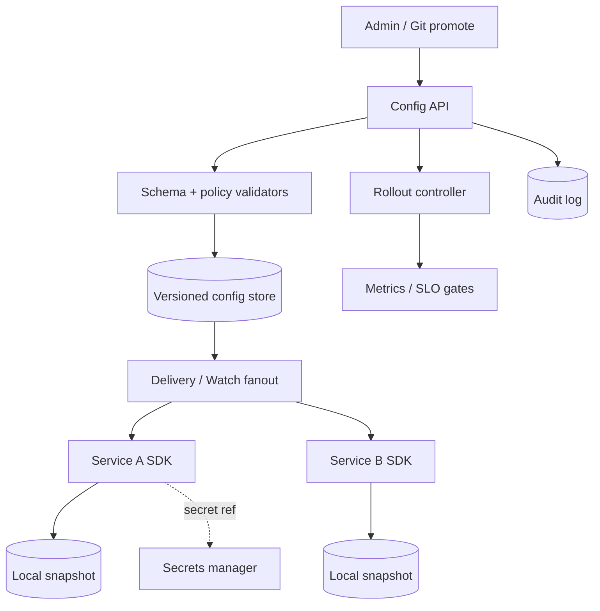
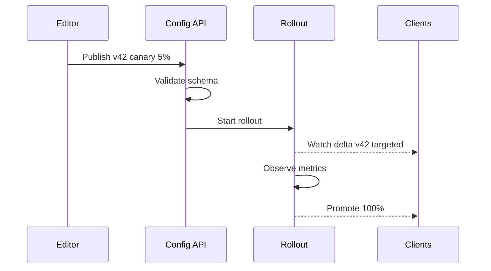

# System Design: Configuration Management

> **Focus areas:** Versioned config · Push/pull · Schema validation · Rollout / canary · Secrets separation · Multi-tenant · Consistency vs availability · Audit · Client caching  
> **Style:** End-to-end platform design with progressive scale (10× → 100× → 1,000×)  
> **Quality bar:** Bad config is a Sev-1; deal-breakers on unvalidated global push and mixing secrets into plain config  
> **Interview theme:** Senior / Staff — **configuration control plane** for microservices

---

## Table of Contents

1. [Clarify Requirements (Interview Q&A)](#1-clarify-requirements-interview-qa)
2. [Back-of-the-Envelope Estimation](#2-back-of-the-envelope-estimation)
3. [High-Level Design](#3-high-level-design)
4. [Architecture Diagram](#4-architecture-diagram)
5. [Design Deep Dive](#5-design-deep-dive)
6. [Wrap-Up](#6-wrap-up)
7. [Deeper / Related Interview Questions](#7-deeper--related-interview-questions)

---

## 1. Clarify Requirements (Interview Q&A)

Goal: design a **configuration-management service** so services receive correct, versioned, validated settings quickly and safely—with canary rollout, audit, and the ability to survive control-plane outages via local cache.

### 1.0 What this is / is not

| Dimension | This doc | Not this |
|-----------|----------|----------|
| Job | Dynamic app/runtime configuration | CI secrets store alone (Vault-class) |
| Data | Non-secret knobs, timeouts, URLs, limits | Large blobs / ML models |
| Related | Overlaps feature flags; keep flags as specialized layer | Service discovery endpoints |
| Plane | Control plane; clients cache | Data-plane business traffic |

### 1.1 Functional Requirements

| # | Question to ask | Expected / typical interviewer answer | Design implication |
|---|-----------------|----------------------------------------|--------------------|
| F1 | Config granularity? | Per service / namespace / env / optional instance overrides | Hierarchical keys with inheritance |
| F2 | Dynamic updates? | Yes without redeploy | Watch/push + version vectors |
| F3 | Validation? | JSON Schema / protobuf / OpenAPI | Reject invalid publish |
| F4 | Rollout? | % canary → stages → full | Targeting rules + progressive delivery |
| F5 | Secrets? | Separate secrets manager; refs only | `secret://` pointers, never raw in CM |
| F6 | Who can edit? | RBAC + approvals for prod | Change management workflow |
| F7 | Audit? | Who changed what when | Immutable audit log |
| F8 | Consistency? | Eventual OK; monotonic versions | Clients see non-decreasing version per key |
| F9 | Offline? | Last-known-good on disk | Mandatory local snapshot |
| F10 | Multi-region? | Regional serve; global publish | Home region write + replicate |
| F11 | Formats? | JSON/YAML/TOML + typed | Canonical typed store |
| F12 | Rollback? | One-click prior version | Version history retained |
| F13 | Kill switch? | Global emergency defaults | Break-glass channel |
| F14 | Environments? | dev/stage/prod isolation | Hard namespace walls |

**MVP functional scope:**

1. CRUD config documents keyed by `(tenant, env, service, key)`.
2. Schema validate on write; typed values.
3. Version every change; list/diff/rollback.
4. Client SDK: fetch + watch + disk cache.
5. Percentage / instance-set canary targeting.
6. RBAC + audit trail.
7. Secret references resolved by sidecar/SDK via secrets store.
8. Admin UI/CLI + APIs.

**Out of MVP:**

- Full GitOps UI (can ingest Git later)
- ML-driven auto-tuning
- Cross-cloud active-active writers
- Embedding feature-experiment stats (link to flag platform)

### 1.2 Non-Functional Requirements

| # | Question | Expected answer | Target |
|---|----------|-----------------|--------|
| N1 | Client read latency | Local cache | p99 < 1ms; network refresh p99 < 100ms |
| N2 | Propagation | Canary visible fast | p99 < 5–15s regional |
| N3 | Availability | Control plane HA | 99.99% read; write 99.9% |
| N4 | Durability | No silent loss of published config | Quorum durable log / DB |
| N5 | Consistency | Monotonic per key | No version rollback without explicit |
| N6 | Multi-region | Read local | RPO minutes for replica OK; publish home |
| N7 | Security | Prod change control | mTLS, RBAC, approval gates |
| N8 | Safety | Invalid config blocked | Schema + semantic checks + canary |

### 1.3 Cases (User Flows & Edge Cases)

**Happy paths**

1. Editor updates `payments.timeout_ms` → validated → canary 5% → metrics OK → 100%.
2. Service starts → loads disk snapshot → starts → background refresh/watch.
3. Rollback to version 41 → new version 45 pointing at prior content (append-only history).
4. Emergency kill switch flips `feature.x.enabled=false` via break-glass.

**Edge / failure cases**

| Case | Behavior |
|------|----------|
| Invalid schema publish | 400; no partial apply |
| Canary causes errors | Auto-halt / manual rollback |
| CM outage | Clients serve cache; alert staleness |
| Split brain two writers | Single home writer; fencing token |
| Huge config document | Size cap (e.g. 256KB–1MB); split keys |
| Secret material pasted | Detector reject; force ref |
| Conflicting overlapping rules | Explicit precedence document |
| Clock skew | Versions from server monotonic IDs |
| Thundering herd refresh | Jitter; ETag / If-None-Match |
| Wrong env promotion | Require explicit promote pipeline |

### 1.4 Scales (Progressive)

| Metric | Baseline | 10× | 100× | 1,000× |
|--------|----------|-----|------|--------|
| Services | 200 | 2K | 20K | 200K |
| Config keys | 20K | 200K | 2M | 20M |
| Watching clients | 5K | 50K | 500K | 5M |
| Publishes / day | 500 | 5K | 50K | 500K |
| Watch events / s peak | 20 | 200 | 2K | 20K |
| Regions | 2 | 3 | 5 | global |

**What each jump forces:**

- **10×:** Move off single DB box; CDN/edge for snapshots optional; watch tier.
- **100×:** Shard by tenant/service; push deltas; Git-backed optional SoT.
- **1,000×:** Hierarchical delivery (global → regional → cell); bloom/version vectors; strict size quotas.

### 1.5 Etc. (Constraints & Assumptions)

- **Git as SoT?** Optional dual mode; API SoT for MVP with export to Git.
- **Feature flags?** Separate product with overlap; config holds static knobs, flags hold dynamic experiments.
- **Kubernetes ConfigMaps?** Adapter/source, not global multi-cluster SoT.

**Scope statement to repeat back:**

> Design a **versioned, schema-validated configuration service** with canary rollout, RBAC/audit, secret references (not secret storage), and client-side last-known-good caching—scaled to millions of watchers—where a bad publish can be halted and rolled back in seconds.

---

## 2. Back-of-the-Envelope Estimation

### 2.1 Payload & storage

```text
Avg key body ~500 B, metadata ~200 B
20K keys × 700 B ≈ 14 MB hot
History 100 versions avg → ~1.4 GB (compress)
1,000× keys 20M × 700 B ≈ 14 GB hot; history tens of TB → cold object store
```

### 2.2 Watch traffic

```text
Naive: push full snapshot to 500K clients on any change → meltdown
Correct: per-subscription filter; delta; coalesce
Event 1KB × 2K interested × 10 events/s = 20 MB/s — manageable
```

### 2.3 Client memory

```text
Service watches 100 keys × 1KB = 100 KB
Disk snapshot same order
```

### 2.4 QPS

```text
Steady refresh with ETag: mostly 304
Publish QPS tiny vs reads
Hot path must not hit DB
```

### 2.5 Canary evaluation

```text
Need metrics pipeline latency < rollout step duration (e.g. 5–15 min steps)
Not part of CM core store but integration SLO
```

---

## 3. High-Level Design

### 3.1 Data model

```text
Tenant
  └── Environment (dev|stage|prod)
        └── Application / Service
              └── ConfigKey
                    ├── schema_id
                    ├── current_version
                    ├── value (typed JSON)
                    ├── targeting_rules[]
                    └── versions[] (immutable)
```

**Targeting:** percentage, instance_id set, cell/region, label selectors—evaluated client-side or edge.

**Precedence (document clearly):**

```text
instance override > cell override > service default > global default
```

### 3.2 APIs

| Method | Path | Purpose |
|--------|------|---------|
| PUT | `/v1/configs/{app}/{key}` | Publish new version (validated) |
| GET | `/v1/configs/{app}/{key}` | Get current (with If-None-Match) |
| GET | `/v1/configs/{app}/{key}/versions` | History |
| POST | `/v1/configs/{app}/{key}/rollback` | Rollback → new version |
| POST | `/v1/rollouts` | Create progressive rollout |
| GET | `/v1/watch` | Stream changes |
| GET | `/v1/snapshot?app=` | Bulk bootstrap |

**Publish request:**

```json
{
  "value": {"timeout_ms": 300},
  "schema_version": 3,
  "rollout": {"strategy": "percent", "steps": [5, 25, 100], "auto_promote": false},
  "change_ticket": "CHG-1234"
}
```

### 3.3 Architecture components

```text
Admin UI/CLI → API Gateway → Config Control API
                              ├── Validator (schema + policy)
                              ├── Version store (Postgres / Raft log)
                              ├── Rollout controller
                              └── Audit log
Client SDK ← Delivery tier (watch fanout / CDN snapshots)
Secret refs → Secrets Manager (separate)
```

### 3.4 Push vs pull

| Mode | Pros | Cons |
|------|------|------|
| Pull interval | Simple | Lag + herd |
| Long poll | Decent | Connection cost |
| Streaming watch | Fast | Fanout complexity |
| CDN snapshot | Scales reads | Not instant |

**MVP:** streaming watch + periodic full reconcile + disk cache. CDN for large org snapshots at 100×.

### 3.5 Validation & safety

1. **Structural:** JSON Schema / protobuf.
2. **Policy:** deny keys, max sizes, required change ticket in prod.
3. **Semantic hooks:** webhook validators (e.g. timeout_ms < 60s).
4. **Rollout gates:** error-rate / latency budgets from metrics.

### 3.6 Trade-offs & deal-breakers

| Decision | Trade-off | Deal-breaker |
|----------|-----------|--------------|
| No schema | Speed of publish | Prod meltdown from typo |
| Secrets in CM | Convenience | Leak via debug dumps / UI |
| Global instant 100% | Fast | Blast radius = company |
| No client cache | “Fresh” | Outage when CM down |
| Multi-writer active-active | Low latency writes | Conflicting versions |

### 3.7 Why not only Git + CI?

GitOps excellent for audit/review; weaker for instant kill switches and fine canary to 1% instances without deploy. Hybrid: Git for defaults, CM API for emergency/runtime.

---

## 4. Architecture Diagram





---

## 5. Design Deep Dive

### 5.1 Reliability

**Data loss prevention**

- Append-only versions; soft-delete keys.
- Multi-AZ DB; PITR backups.
- Audit log separate sink (WORM optional).

**Retries & idempotency**

- Publish with `Idempotency-Key`; same body → same version.
- Clients reconnect watch with `last_version`.

**Rate limits & backpressure**

- Per-tenant publish rate.
- Watch caps; slow consumer disconnect.
- Delivery coalescing under publish storms.

**Failure modes**

| Failure | Mitigation |
|---------|------------|
| Bad config shipped | Canary + auto rollback; kill switch |
| CM down | Disk LKG; stale metric |
| Poison enormous value | Size cap at API |
| Regional partition | Local read replicas; writes to home fail closed |
| Validator outage | Fail closed on publish (safer) |

**Last-known-good:** SDK never starts with empty if snapshot exists unless `--strict-fresh` mode.

### 5.2 Scalability

**Sharding:** hash `(tenant, app)` to config shards.

**Delivery tier:** stateless fanout workers subscribed to change log (Kafka) → filter per connection.

**Snapshots:** periodic compacted snapshot per app in object storage; clients bootstrap from snapshot + replay tail.

**Scale jumps**

| Scale | Pattern |
|-------|---------|
| Baseline | Postgres + API + SDK |
| 10× | Read replicas; Kafka change log |
| 100× | Shard + CDN snapshots |
| 1,000× | Cell-local delivery; global metadata |

### 5.3 Maintainability

**Ops:** publish rate, validation failures, watch lag, rollback count, stale clients.

**Migrations:** schema evolution with dual-read; config key renames via alias period.

**Multi-tenant:** quotas on keys, watchers, publish QPS; UI isolation.

**Testing:** contract tests SDK vs API; chaos CM kill during canary.

---

## 6. Wrap-Up

### Decision summary

1. **Versioned, append-only config** with schema validation.
2. **Secrets out-of-band**; references only.
3. **Progressive rollout** default for prod.
4. **SDK cache + disk LKG** mandatory.
5. **Single-writer home region**; regional readers.
6. **RBAC + audit + change tickets**.
7. **Delivery via watch + snapshot bootstrap**—not DB on hot path.

### Phased rollout

| Phase | Deliver |
|-------|---------|
| MVP | CRUD + versions + SDK watch + cache + RBAC |
| 1.5 | Canary % + rollback + validators |
| 2 | Kafka delivery + snapshots |
| 3 | Multi-region read + Git sync |

---

## 7. Deeper / Related Interview Questions

**Q1. Config vs feature flags?**  
A: Config = operational parameters & defaults; flags = dynamic experiments/targeting with evaluation context (user/session). Overlap exists; flags need evaluation semantics and experiment analytics.

**Q2. Why monotonic versions?**  
A: Prevents clients from oscillating; simplifies cache; rollback creates *new* higher version with old content.

**Q3. How fast must kill switches propagate?**  
A: Target seconds regionally; architecture: dedicated high-priority channel / small hot keys with aggressive push.

**Q4. Can clients evaluate targeting?**  
A: Yes for scale (user_id % 100); server may assign sticky buckets. Document deterministic hashing.

**Q5. What if schema rejects legitimate urgent change?**  
A: Break-glass role with audited schema bypass *or* emergency key space—never silent bypass.

**Q6. Etcd/Consul KV as CM?**  
A: Fine early; lacks rollout, schema, RBAC UX, audit productization—wrap or graduate.

**Q7. Consistency across 10K instances?**  
A: Expect temporary mixed versions during rollout—that’s intentional for canary. Full consistency only after 100%.

**Q8. How to prevent thundering herds?**  
A: Jittered refresh, ETags, shared snapshot CDN, watch instead of poll.

**Q9. Store history forever?**  
A: Hot last N; cold archive; legal retention policies.

**Q10. Multi-doc transactions?**  
A: Optional publish set with single version barrier; MVP single-key atomicity.

**Q11. How do you test a config change?**  
A: Dry-run validation; staging env; canary with automatic metric gates.

**Q12. Config in DB vs files?**  
A: Files/Git for review; service for runtime. Hybrid common.

**Q13. Clock skew issues?**  
A: Don’t use client time for version ordering; server assigns.

**Q14. Maximum config size?**  
A: Small. Large routing tables belong in dedicated systems.

**Q15. Security of watch streams?**  
A: AuthZ per app; no cross-tenant subscribe; TLS.

**Q16. Exactly-once delivery of updates?**  
A: At-least-once; clients idempotently apply by version.

**Q17. What metrics define rollout success?**  
A: Error rate, latency, saturation—service-defined SLOs registered with rollout controller.

**Q18. Hot reload thread safety?**  
A: SDK atomic swap of immutable config object; avoid lock in request path.

**Q19. Deal-breaker?**  
A: Pushing unvalidated config to 100% globally in one shot.

**Q20. Relation to service discovery?**  
A: Discovery = who; config = how they behave. Separate SLOs.

**Q21. Admin accidentally deletes key?**  
A: Soft delete + tombstone version; retain history; restore API.

**Q22. Cross-region write latency?**  
A: Accept; editors rare. Readers local.

**Q23. YAML footguns?**  
A: Prefer JSON canonical store; YAML UI parse carefully (Norway problem etc.).

**Q24. How does sidecar get secrets from refs?**  
A: SDK calls Vault/KMS with pod identity; cache short TTL; never write secret into CM cache file.

**Q25. Staff: design change log**  
A: Kafka topic partitioned by app; payload `{key, version, value_hash, targeting}`; consumers = delivery workers; compact by key for snapshots.

**Q26. Blue/green with config?**  
A: Pin versions per color deployment; avoid shared mutable during cutover.

**Q27. Compliance?**  
A: Audit who viewed/edited; SOC2 change management evidence.

**Q28. Client older than schema?**  
A: Backward-compatible schema evolution; unknown fields ignored; min SDK version metadata.

**Q29. Overload from popular key?**  
A: Edge cache; singleflight; separate hot-key tier.

**Q30. Why disk snapshot encrypted?**  
A: May contain internal URLs/tokens-adjacent data; protect at rest on hosts.

---

*End of configuration-management system design.*

## Appendix — Deep dive notes for Configuration-management service

### Hardest invariants
- Define the correctness property that must not break under retries, partial failures, or overload.
- Define multi-tenant isolation boundaries if applicable.
- Define delete/TTL/privacy semantics across primary + cache + search + logs.

### Likely bottlenecks
1. Hot keys / hot partitions for core entity ids
2. Synchronous dependency latency tails (p99)
3. Write amplification from secondary indexes / fanout
4. Compaction / GC / backfill stealing cluster IO
5. Cross-region chatty patterns

### Suggested metrics (RED + business)
| Metric | Why |
|--------|-----|
| Request rate / error / duration | Golden signals |
| Saturation (CPU, pool, queue lag) | Leading indicator |
| Idempotency conflict rate | Client retry health |
| Cache hit ratio | Origin protection |
| Business SLI for Configuration-management service | Product truth |

### Migration & rollout
- Expand/contract schema changes
- Dual-write or shadow reads for store migrations
- Feature-flagged cutover; canary on error budget
- Backfill with checkpoints and replayable logs

### What interviewers poke next
- Memory footprint of your cache/index choice
- Exact concurrency control (locks vs OCC vs ledger)
- Cost model at 100×
- Abuse cases unique to Configuration-management service

## Appendix A — Interview execution checklist

1. **Repeat scope** in one sentence; list out-of-scope.
2. **Write NFRs as numbers** (QPS, p99, RPO/RTO).
3. **Draw** clients → edge → svc → store → async.
4. **Call the hardest invariant** early.
5. **Pick consistency** deliberately; do not say “strong everywhere.”
6. **Show scale jumps** at 10× / 100× / 1,000× with architecture changes.
7. **Name failure modes** and degraded behavior.
8. **Close** with metrics, rollout, and residual risks.

## Appendix B — Trade-off flashcards

| Topic | Prefer | Avoid |
|-------|--------|-------|
| Sync vs async | Sync for money/authz ack | Sync for fanout/email/indexing |
| SQL vs KV | Multi-row invariants | Ultra-high simple point ops |
| Cache | Read-heavy + tolerable stale | Incorrect money reads |
| Queue | Spike absorb + retry | Hidden request/response bus |
| Multi-region | Home cell single-writer | Multi-writer without merge rules |

## Appendix C — Reliability patterns to name drop correctly

- Idempotency keys + request hash
- Outbox / transactional messaging
- Leases + fencing tokens
- Quorum / consensus (Raft) for coordination—not for every data path
- Bulkheads + circuit breakers + deadlines
- Load shedding + admission control
- Canary + automatic rollback on SLO burn
- Backup restore drills (backup ≠ restore tested)

## Appendix D — Scalability patterns

- Consistent hashing with virtual nodes
- Hierarchical sharding (cell → shard → partition)
- CQRS / projections for read models
- Hot-key splitting and salting
- Tiered storage + compaction budgets
- Consumer parallelization by partition
- Edge caching with purge/surrogate keys

## Appendix E — Sample capacity dialogue

```text
Interviewer: Assume 10M DAU.
You: 10M DAU × 5 key actions/day ≈ 50M events/day ≈ 580 QPS avg.
Peak 15× ⇒ ~9K QPS. With 70% cache hit on reads, origin ~2.7K QPS.
At 100×, origin ~270K QPS ⇒ shard + edge mandatory.
```

Customize the action rate to this problem; do not reuse social-feed numbers for a ledger.


*Enriched for interview drill · `configuration-management`*
