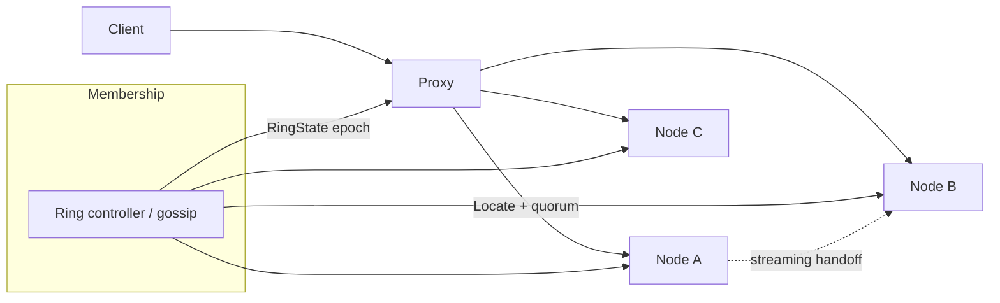
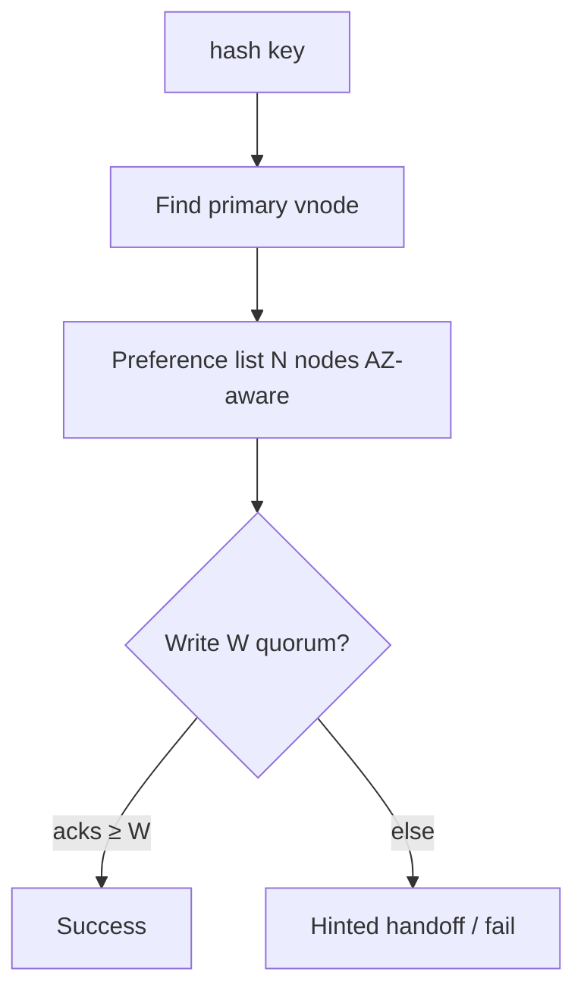
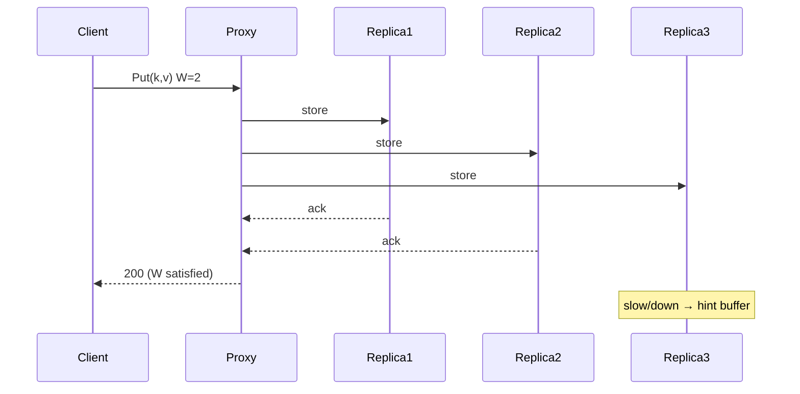

# System Design: Consistent-Hash Routing with Replication

> **Focus areas:** Consistent hashing · Virtual nodes · Replication factor · Quorum R/W · Rebalance · Hot keys · Request routing · Failure domains · Hinted handoff / read repair  
> **Style:** End-to-end platform design with progressive scale (10× → 100× → 1,000×)  
> **Quality bar:** Minimal key movement on membership change; replication topology explicit; deal-breakers on naive modulo hashing and unbounded rebalance  
> **Interview theme:** Senior / Staff — **partitioned data routing** with replication (caches, KV, sharded queues)

---

## Table of Contents

1. [Clarify Requirements (Interview Q&A)](#1-clarify-requirements-interview-qa)
2. [Back-of-the-Envelope Estimation](#2-back-of-the-envelope-estimation)
3. [High-Level Design](#3-high-level-design)
4. [Architecture Diagram](#4-architecture-diagram)
5. [Design Deep Dive](#5-design-deep-dive)
6. [Wrap-Up](#6-wrap-up)
7. [Deeper / Related Interview Questions](#7-deeper--related-interview-questions)

---

## 1. Clarify Requirements (Interview Q&A)

Goal: design a **consistent-hash routing layer with replication** so keys map stably to a ring of nodes, survive node failure via replicas, and rebalance with bounded data movement when membership changes.

### 1.0 What this is / is not

| Dimension | This doc | Not this |
|-----------|----------|----------|
| Job | Key → primary + replica set routing | Full DynamoDB product |
| Hashing | Consistent hash / rendezvous / jump hash choices | Cryptographic security hashing |
| Replication | N replicas on distinct failure domains | Cross-region async DR alone |
| Client | Router library, proxy, or coordinator | App business logic |

### 1.1 Functional Requirements

| # | Question to ask | Expected / typical interviewer answer | Design implication |
|---|-----------------|----------------------------------------|--------------------|
| F1 | What are we routing? | Cache keys / KV partitions / shard owners | Opaque key bytes → node set |
| F2 | Replication factor N? | Typically 3 | Walk ring for N unique nodes |
| F3 | Quorum? | W=2, R=2 for N=3 common | Coordinator enforces quorum |
| F4 | Virtual nodes? | Yes—smooth load | Many vnodes per physical node |
| F5 | Who owns membership? | Gossip or centralized controller | Versioned ring/token map |
| F6 | Rebalance on add/remove? | Streaming handoff; no big-bang | Bounded key move ≈ 1/N |
| F7 | Hot keys? | Detect + cache locally / split | Hot-key path separate |
| F8 | Sticky sessions? | Prefer same primary for writes | Leader-per-key or quorum any |
| F9 | Rack/AZ awareness? | Replicas in different AZs | Placement constraints on ring walk |
| F10 | Reads from replicas? | Yes with quorum or prefer primary | Consistency levels: ONE/QUORUM/ALL |
| F11 | Proxy vs client lib? | Both; proxy for polyglot | Same ring algorithm both sides |
| F12 | Token ranges vs pure hash? | Either; ranges help ops | Prefer token ranges for moves |
| F13 | Failure during write? | Hinted handoff or sloppy quorum | Durability story explicit |
| F14 | Hash function? | xxHash/Murmur; not crypto | Speed + uniformity |

**MVP functional scope:**

1. Maintain versioned cluster membership + token/vnode map.
2. Route `key` → ordered preference list of N nodes (AZ-diverse).
3. Coordinator write path with configurable W; read path with R.
4. On node add/remove: compute affected ranges; stream handoff.
5. Health-aware skip of down nodes with failover to next in preference list.
6. Metrics: load imbalance, handoff lag, quorum failures.
7. Admin: ring dump, forced leave, repair job.

**Out of MVP:**

- Multi-DC active-active conflict CRDTs (mention only)
- Automatic shard splitting for hot ranges (Phase 2)
- Full Cassandra-compatible CQL
- Perfect load with heterogeneous node sizes without vnodes/weights

### 1.2 Non-Functional Requirements

| # | Question | Expected answer | Target |
|---|----------|-----------------|--------|
| N1 | Route compute latency | In-process | p99 < 50µs for key→nodes |
| N2 | Quorum write latency | Depends on store | Extra network hop budget explicit |
| N3 | Availability | Survive 1 AZ loss if N=3 across AZs | 99.99% with degraded consistency option |
| N4 | Data movement on +1 node | ≈1/N fraction | Not full reshuffle |
| N5 | Consistency | Tunable | Document linearizability limits |
| N6 | Multi-region | Optional secondary DC | Async replicate or separate rings |
| N7 | Security | Auth between nodes | mTLS; no open seed gossip |
| N8 | Imbalance | With vnodes | <10–20% load skew typical |

### 1.3 Cases (User Flows & Edge Cases)

**Happy paths**

1. Client hashes key → preference list `[n2,n5,n8]` → write W=2 succeed.
2. Read R=2 → digest compare → read repair if diverge.
3. Add node → claims tokens → streaming bootstrap → joins ring → version++.
4. Node dies → requests skip to next; hinted handoff buffer; later replay.

**Edge / failure cases**

| Case | Behavior |
|------|----------|
| Two nodes same AZ in preference | Skip to next until AZ diversity or relax |
| Membership split brain | Epoch/fencing; reject lower epoch writes |
| Hot key hammering one vnode | Local cache / replicate hot key / salting |
| Rebalance + write race | Token range locking or versioned ownership |
| All replicas down for key | Fail request; alert; optional degrade R=1 elsewhere N/A |
| Heterogeneous node RAM | Weighted vnodes |
| Clock skew | Don’t use clocks for ownership; use ring version |
| Proxy and client disagree on ring | Gossip version checks; refuse if mismatch > threshold |
| Mass restart | Bootstrap throttle; avoid simultaneous handoffs |
| Partial handoff crash | Resume from checkpoint offsets |

### 1.4 Scales (Progressive)

| Metric | Baseline | 10× | 100× | 1,000× |
|--------|----------|-----|------|--------|
| Physical nodes | 10 | 100 | 1K | 10K |
| Vnodes (total) | 1K | 10K | 50–100K | hierarchical / fewer vnodes |
| Keys | 100M | 1B | 10B | 1T |
| QPS | 50K | 500K | 5M | 50M |
| Replication N | 3 | 3 | 3 | 3–5 |
| Rebalance data moved (+1 node) | ~10% | ~1% | ~0.1% | ~0.01% |
| Concurrent handoffs | 2 | 10 | 50 | partitioned controllers |

**What each jump forces:**

- **10×:** Gossip membership OK; need vnode count tuning; dedicated handoff workers.
- **100×:** Centralized membership/controller often healthier than pure gossip; token ranges; throttle.
- **1,000×:** Hierarchical rings / cells; avoid millions of vnodes (memory + gossip); cell-local rings.

### 1.5 Etc. (Constraints & Assumptions)

- **Storage backend?** Pluggable (cache memory, RocksDB, Kafka partition).
- **Leader per key?** Optional; MVP quorum multi-writer with timestamps/version vectors.
- **Modulo hashing allowed?** Only as foil—reject for production rebalance.

**Scope statement to repeat back:**

> Design a **consistent-hash router with RF=N replication**, AZ-aware preference lists, tunable quorum, and streaming rebalance—so adding/removing a node moves ~1/N keys, not reshuffling the world—and hot keys / split brain are handled explicitly.

---

## 2. Back-of-the-Envelope Estimation

### 2.1 Why not `hash(key) % N`

```text
N=10 → N=11: nearly all keys remap
Consistent hashing: expected move ≈ 1/11 of keys
```

### 2.2 Virtual nodes

```text
Physical nodes = 100, vnodes/node = 100 → 10K vnodes on ring
Memory: vnode → node_id map ≈ 10K × 32 B ≈ 320 KB (trivial)
At 10K physical × 100 vnodes = 1M entries ≈ 32 MB — still OK
At 100K nodes: prefer weighted tokens / jump hash / hierarchical
```

### 2.3 Replication write amplification

```text
User QPS 100K writes, N=3, W=2
Network writes ≈ 200K–300K (depending coordinator fanout)
Disk ≈ ×N if all durable
```

### 2.4 Rebalance bandwidth

```text
Node holds 1 TB, cluster 100 nodes, RF=3 ⇒ unique data ~33 TB? 
Careful: each node stores ~ RF * total / nodes
Data on node ≈ 1 TB
Add node: moves ≈ 1 TB / 100 ≈ 10 GB from each? Actually ~1/N of keys from each owner
Throttle: 100 MB/s → ~3 hours for 1 TB handoff — plan windows
```

### 2.5 Hot key

```text
One key at 50K QPS on one primary → CPU/network hotspot
Mitigations: cache at edge, request coalescing, key salting (trade list/range queries)
```

### 2.6 Preference list length

```text
N=3, allow 2 failures → walk until 3 live unique nodes
List length often  N + spare (e.g. look ahead 6–10) under sloppy quorum
```

---

## 3. High-Level Design

### 3.1 Ring model

```text
Hash space: 0 .. 2^128-1 (or 2^64)
Each vnode places token T on circle
Key K maps to first token ≥ hash(K) (clockwise)
Replicas: next unique physical nodes along ring satisfying constraints
```

**Token range ownership:** vnode owns (prev_token, token].

### 3.2 Algorithms compared

| Algorithm | Movement | Simplicity | Notes |
|-----------|----------|------------|-------|
| Consistent hash + vnodes | ~1/N | Medium | Classic interview answer |
| Rendezvous (HRW) | ~1/N | Simple code | O(nodes) per lookup unless hierarchical |
| Jump consistent hash | ~1/N | Fast | Needs contiguous bucket IDs |
| Maglev | Minimal disruption | Heavier | LBs (Google Maglev) |
| Modulo | Catastrophic | Too simple | Deal-breaker |

**MVP pick:** consistent hash + **vnodes** + **token map** gossip/controller.

### 3.3 Replication & quorum

```text
N = 3   # replicas
W = 2   # write quorum
R = 2   # read quorum
R + W > N  ⇒ overlap ⇒ stronger consistency (classic)
```

| Level | Behavior |
|-------|----------|
| ONE | Fastest; stale reads risk |
| QUORUM | Default MVP |
| ALL | Strongest; brittle under failure |
| LOCAL_QUORUM | Multi-DC aware |

**Versioning:** per-key `(timestamp, node_id)` or Lamport/vector; read repair on digest mismatch.

### 3.4 APIs (router / coordinator)

| API | Purpose |
|-----|---------|
| `Locate(key) → []Node` | Preference list |
| `Put(key, val, w)` | Quorum write |
| `Get(key, r)` | Quorum read + optional repair |
| `Join(node, tokens)` | Membership |
| `Leave(node)` | Drain + reassign |
| `HandoffStatus()` | Ops |

### 3.5 Membership & ring version

```text
RingState {
  epoch: uint64,
  nodes: [{id, addr, az, weight, tokens[]}],
  checksum: hash
}
```

Clients/proxies only route if `epoch` known; updates via gossip or push from controller. **Fencing:** reject ops with stale epoch for range ownership during moves.

### 3.6 Placement constraints

When walking for replicas:

1. Skip same physical node.
2. Prefer different AZ / rack.
3. Optionally different power/network domain.
4. If impossible, relax with metric `placement_relaxed`.

### 3.7 Trade-offs & deal-breakers

| Decision | Trade-off | Deal-breaker |
|----------|-----------|--------------|
| Too few vnodes | Simple | Severe imbalance |
| Too many vnodes | Smooth | Memory/gossip bloat at huge N |
| W+R≤N | Availability | Silent divergence forever without repair |
| Ignore AZ | Easy | One AZ outage loses quorum |
| Big-bang rebalance | Simple code | Multi-hour outage risk |
| Client hash ≠ server | — | Split traffic / wrong node |

### 3.8 Coordinator placement

| Mode | Pros | Cons |
|------|------|------|
| Client library | Low latency | Version skew risk |
| Stateless proxy | Polyglot | Extra hop |
| Any-node coordinator | Symmetry | Need forwarding |

MVP: **stateless proxy** + optional thick client for internal services.

---

## 4. Architecture Diagram







---

## 5. Design Deep Dive

### 5.1 Reliability

**Data loss prevention**

- Durable write ack only after W replicas fsync (if durability required).
- Hinted handoff: coordinator stores hint for down replica; replay with TTL.
- Anti-entropy: Merkle tree repair jobs for ranges.

**Retries & idempotency**

- Puts carry `write_id`; replicas dedupe.
- Retries must hit same preference list generation (`epoch`).

**Backpressure**

- Handoff bandwidth caps.
- Reject new joins if outstanding handoff bytes > threshold.
- Queue depth limits on coordinators.

**Failure modes**

| Failure | Mitigation |
|---------|------------|
| 1 node down | Preference list skip; W still achievable |
| 1 AZ down | If replicas AZ-diverse, survive |
| Network partition | Epoch fencing; minority may serve stale if misconfigured—document |
| Corrupted value | Checksums; read repair |
| Rebalance stalls | Alert; pause traffic to leaving node only after drain |

**Read repair:** on digest mismatch, fetch full values, merge by version, write back.

### 5.2 Scalability

**Sharding:** the ring *is* the shard map.

**Parallelization:** many keys → many primaries; avoid global locks.

**Hot keys:** 

1. Detect via QPS histograms per vnode.
2. Coalesce gets; cache in proxy.
3. Optional salt: `key#0..k` with client fanout (breaks ordering).

**Scale jumps**

| Scale | Change |
|-------|--------|
| 10× | Tune vnodes; dedicated repair workers |
| 100× | Controller-based membership; token ranges UI |
| 1,000× | Cells with separate rings; global directory for cell |

**Heterogeneous hardware:** `weight` ∝ capacity → proportional vnode count.

### 5.3 Maintainability

**Ops**

- `nodetool`-style ring view: tokens, ownership %, handoff %.
- Safe leave: mark decommissioning → stream → remove.
- Chaos: kill primary under load; verify W/R.

**Observability**

- Quorum failure rate, hint queue age, imbalance Gini/coefficient, epoch propagation lag.

**Migrations**

- Change RF: additive replica then repair.
- Hash function change: dual-write / dual-read migration window (rare, painful—avoid).

**Multi-tenant:** separate rings per tenant cell or keyed prefix with quotas—don’t interleave noisy neighbors on same vnode without isolation.

---

## 6. Wrap-Up

### Decision summary

1. **Consistent hashing + vnodes** (or HRW) — never bare modulo.
2. **RF=N with AZ-aware preference lists.**
3. **Tunable R/W quorums**; default R+W>N.
4. **Versioned ring/epoch** for fencing during moves.
5. **Streaming handoff** with throttle; ~1/N movement.
6. **Hinted handoff + anti-entropy** for durability under failure.
7. **Hot-key strategy** explicit—hashing alone won’t save you.

### Phased rollout

| Phase | Deliver |
|-------|---------|
| MVP | Ring + Locate + quorum Put/Get + vnodes + AZ walk |
| 1.5 | Hinted handoff + read repair |
| 2 | Streaming bootstrap/decommission |
| 3 | Cells / hierarchical routing; weighted capacity |

---

## 7. Deeper / Related Interview Questions

**Q1. Explain consistent hashing to a junior.**  
A: Nodes and keys live on a circle; key goes to next node clockwise. Add a node: only keys in its arc move. Vnodes = many points per node for balance.

**Q2. Why vnodes?**  
A: With one token per node, random placement imbalances and move granularity is coarse. Vnodes smooth load and split ownership.

**Q3. R+W>N means what?**  
A: Read and write quorums intersect ⇒ a quorum read sees at least one node that got a quorum write (under stable membership)—classic Dynamo/Cassandra teaching. Not full linearizability with concurrent writers without more machinery.

**Q4. Sloppy quorum?**  
A: If preference targets down, write to next healthy nodes (hints). Improves availability; must repair later. Strict quorum refuses instead.

**Q5. How many vnodes per node?**  
A: Often 16–256 historically; modern systems may use fewer tokens + better load balancers. Trade memory/gossip vs imbalance.

**Q6. Rendezvous hashing vs consistent hashing?**  
A: HRW: score(node,key)=hash(node|key); pick top-N scores. Elegant; O(n) unless hierarchical. Consistent hash O(log vnodes) with tree.

**Q7. How do you rebalance without downtime?**  
A: New node claims tokens; streams ranges from old owners while both accept writes for ranges (dual ownership window) or freeze range briefly; then cutover epoch++.

**Q8. What if two datacenters?**  
A: Separate racks in placement; or NetworkTopologyStrategy-style: replicas per DC. LOCAL_QUORUM for latency.

**Q9. Is the coordinator a SPOF?**  
A: Any node or stateless proxy can coordinate; client retries another. Ring controller HA separately.

**Q10. Hash collisions of tokens?**  
A: Extremely rare with 128-bit; regenerate on join conflict.

**Q11. How to dump a hot partition?**  
A: Metrics by vnode; split token (add vnode mid-range) or salt keys.

**Q12. Consistency of Get with R=1?**  
A: May miss latest if that replica lagged; acceptable for cache, bad for inventory.

**Q13. Compare to Kafka partitioning.**  
A: Kafka uses fixed partition count + sticky assignment; rebalance different. Consistent hash better when key cardinality ≫ nodes and membership churns.

**Q14. Why Maglev for LBs?**  
A: Lookup table gives near-uniform backend selection with minimal disruption—great for connection balancing, less for disk data ownership.

**Q15. Fencing stale primary?**  
A: Epoch in every request; storage rejects lower epoch for owned range.

**Q16. Memory for ring at 10K nodes × 100 vnodes?**  
A: ~1M entries × ~32–64B ≈ 32–64MB per process—OK; replication of gossip still costly—use pull/controller.

**Q17. Write path when W=ALL and one slow replica?**  
A: Latency = slowest; timeouts → fail. Ops prefer QUORUM.

**Q18. Can you use consistent hashing for rate limiter shards?**  
A: Yes—key by user_id; same caveats on hot users.

**Q19. Deal-breaker answer in interview?**  
A: “We’ll rehash everything when we add a node” or “RF=3 all in one AZ.”

**Q20. Vector clocks vs timestamps?**  
A: Vector clocks detect concurrent writes; timestamps need careful sync. Many systems use timestamp+node_id with LWW and accept rare loss—be honest.

**Q21. How does Cassandra token ring relate?**  
A: Same family: tokens, vnodes, replication strategies, gossip—good mental model.

**Q22. Proxy cache of Locate results?**  
A: Cache by key with epoch; invalidate on ring change. Don’t cache forever.

**Q23. Security: can a node claim all tokens?**  
A: Join must be authenticated/authorized; controller assigns tokens, nodes don’t self-elect arbitrary ranges in locked-down mode.

**Q24. Testing rebalance correctness?**  
A: Property test: for random keys, locate before/after add node; keys either stay or move to new node only if in claimed ranges; count moved ≈ 1/N.

**Q25. What breaks first at 1,000×?**  
A: Gossip + vnode map size + simultaneous handoffs—move to cells.

**Q26. Read-your-writes with R/W quorum?**  
A: Not guaranteed across clients without session stickiness or stronger protocols; mention as limitation.

**Q27. Hinted handoff disk full?**  
A: Shed hints; mark need repair; page. Don’t block all writes forever.

**Q28. Why RF=5 sometimes?**  
A: Survive two failures with quorum 3; cost = storage ×5/3 vs RF=3.

**Q29. Consistent hashing for cache aside?**  
A: Yes; on node loss, only ~1/N cache miss storm—still plan thundering herd (request coalesce).

**Q30. Staff follow-up: weighted consistent hashing**  
A: Assign vnode count ∝ weight; or use multi-probe / bounded-load variant so underloaded nodes absorb more—cite bounded-load consistent hashing papers.

---

*End of consistent-hash routing with replication system design.*

## Appendix — Deep dive notes for Consistent-hash routing with replication

### Hardest invariants
- Define the correctness property that must not break under retries, partial failures, or overload.
- Define multi-tenant isolation boundaries if applicable.
- Define delete/TTL/privacy semantics across primary + cache + search + logs.

### Likely bottlenecks
1. Hot keys / hot partitions for core entity ids
2. Synchronous dependency latency tails (p99)
3. Write amplification from secondary indexes / fanout
4. Compaction / GC / backfill stealing cluster IO
5. Cross-region chatty patterns

### Suggested metrics (RED + business)
| Metric | Why |
|--------|-----|
| Request rate / error / duration | Golden signals |
| Saturation (CPU, pool, queue lag) | Leading indicator |
| Idempotency conflict rate | Client retry health |
| Cache hit ratio | Origin protection |
| Business SLI for Consistent-hash routing with replication | Product truth |

### Migration & rollout
- Expand/contract schema changes
- Dual-write or shadow reads for store migrations
- Feature-flagged cutover; canary on error budget
- Backfill with checkpoints and replayable logs

### What interviewers poke next
- Memory footprint of your cache/index choice
- Exact concurrency control (locks vs OCC vs ledger)
- Cost model at 100×
- Abuse cases unique to Consistent-hash routing with replication

## Appendix A — Interview execution checklist

1. **Repeat scope** in one sentence; list out-of-scope.
2. **Write NFRs as numbers** (QPS, p99, RPO/RTO).
3. **Draw** clients → edge → svc → store → async.
4. **Call the hardest invariant** early.
5. **Pick consistency** deliberately; do not say “strong everywhere.”
6. **Show scale jumps** at 10× / 100× / 1,000× with architecture changes.
7. **Name failure modes** and degraded behavior.
8. **Close** with metrics, rollout, and residual risks.

## Appendix B — Trade-off flashcards

| Topic | Prefer | Avoid |
|-------|--------|-------|
| Sync vs async | Sync for money/authz ack | Sync for fanout/email/indexing |
| SQL vs KV | Multi-row invariants | Ultra-high simple point ops |
| Cache | Read-heavy + tolerable stale | Incorrect money reads |
| Queue | Spike absorb + retry | Hidden request/response bus |
| Multi-region | Home cell single-writer | Multi-writer without merge rules |

## Appendix C — Reliability patterns to name drop correctly

- Idempotency keys + request hash
- Outbox / transactional messaging
- Leases + fencing tokens
- Quorum / consensus (Raft) for coordination—not for every data path
- Bulkheads + circuit breakers + deadlines
- Load shedding + admission control
- Canary + automatic rollback on SLO burn
- Backup restore drills (backup ≠ restore tested)

## Appendix D — Scalability patterns

- Consistent hashing with virtual nodes
- Hierarchical sharding (cell → shard → partition)
- CQRS / projections for read models
- Hot-key splitting and salting
- Tiered storage + compaction budgets
- Consumer parallelization by partition
- Edge caching with purge/surrogate keys

## Appendix E — Sample capacity dialogue

```text
Interviewer: Assume 10M DAU.
You: 10M DAU × 5 key actions/day ≈ 50M events/day ≈ 580 QPS avg.
Peak 15× ⇒ ~9K QPS. With 70% cache hit on reads, origin ~2.7K QPS.
At 100×, origin ~270K QPS ⇒ shard + edge mandatory.
```

Customize the action rate to this problem; do not reuse social-feed numbers for a ledger.


*Enriched for interview drill · `consistent-hash-routing`*
