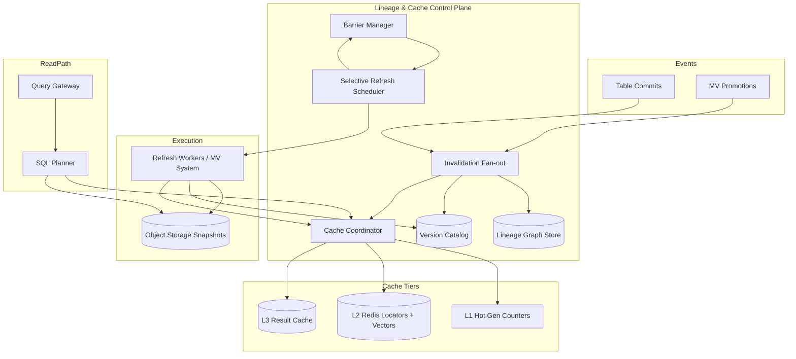

# System Design: Caching for a DAG of Dependent Materialized Views

> **Focus areas:** Dependency DAG · Invalidation · Version vectors · Selective refresh · Diamond dependencies · Cache coherence · Lineage-aware serving  
> **Style:** End-to-end platform design with progressive scale (10× → 100× → 1,000×)  
> **Interview theme:** dbt-style lineage + warehouse MV cascade + distributed cache coherence across dependent precomputations

---

## Table of Contents

1. [Clarify Requirements (Interview Q&A)](#1-clarify-requirements-interview-qa)
2. [Back-of-the-Envelope Estimation](#2-back-of-the-envelope-estimation)
3. [High-Level Design](#3-high-level-design)
4. [Architecture Diagram](#4-architecture-diagram)
5. [Design Deep Dive](#5-design-deep-dive)
6. [Wrap-Up](#6-wrap-up)
7. [Deeper / Related Interview Questions](#7-deeper--related-interview-questions)

---

## 1. Clarify Requirements (Interview Q&A)

The goal is to **bound a cache and refresh orchestration layer** sitting above (or integrated with) a materialized view system where MVs form a **directed acyclic graph (DAG)** of dependencies. When upstream data or definitions change, the system must **invalidate or selectively refresh** downstream nodes without redundant work, maintain **cache coherence** for reads, and handle **diamond dependencies** without double-counting or stale combinations.

### 1.0 What this is / is not

| This is | This is not |
|---------|-------------|
| **Lineage-aware cache** + refresh orchestrator for a DAG of MVs / precomputed datasets | A generic memcached layer keyed only by query string |
| **Invalidation** driven by version vectors / input generations | Blind TTL expiry as the primary correctness mechanism |
| **Selective refresh** — recompute minimal subgraph affected by a change | Always full-cluster nightly rebuild |
| **Coherence protocol** so reads never compose stale upstream with fresh downstream | Ad-hoc per-team cron scripts with implicit ordering |
| Diamond-dependency safe scheduling (merge barrier semantics) | Simple tree propagation that refreshes nodes twice or in wrong order |
| Multi-tenant fair scheduling over shared refresh/cache pools | Single-tenant Makefile `dbt run` only |

### 1.1 Functional Requirements

| # | Question to ask | Expected / typical interviewer answer | Design implication |
|---|-----------------|----------------------------------------|--------------------|
| F1 | What is cached? | **Materialized snapshots**, intermediate MVs, partition-level tiles, optional **query result cache** entries keyed by lineage versions | Multi-layer cache with unified **version stamp** |
| F2 | Dependency model? | MV nodes; edges = reads-from (base table or upstream MV); **DAG** enforced at create | Lineage Graph Service; cycle detection |
| F3 | Invalidation trigger? | Base table commit, upstream MV promotion, definition ALTER, manual bump | Event carries **input version vector** delta |
| F4 | Selective refresh scope? | Compute **transitive downstream closure** from changed node; skip unaffected branches | Graph reachability + dirty flags per node/partition |
| F5 | Diamond deps? | `A→B`, `A→C`, `B→D`, `C→D` — D refreshes **once** after B and C agree on compatible input gen | **Barrier sync** on join nodes with generation merge |
| F6 | Cache key semantics? | `(tenant_id, node_id, partition, input_generation_hash)` | Never serve without generation match |
| F7 | Coherence level? | **Read-your-lineage-writes** for a single query; cross-node point-in-time optional bundle | Pin full ancestor generation set at read time |
| F8 | Staleness policy? | Serve stale with label vs hard fail vs block until fresh | Per-node SLO class (strict dashboard vs exploratory) |
| F9 | Partial graph refresh? | Partition-granular dirty for large MVs | Dirty set = `{ (node, partition) }` not whole DAG |
| F10 | Version vector contents? | Per direct input: `{ table_id or mv_id → commit_seq / snapshot_id }` | Compact sparse vectors; hash to `input_gen` |
| F11 | Dedup concurrent refreshes? | Single-flight for `(node, input_gen)` | Coalescing locks in cache coordinator |
| F12 | Query path integration? | SQL planner asks cache for **eligible snapshot** or schedules refresh | Cache advisory API before scan |
| F13 | Multi-tenant isolation? | Lineage and cache namespaces per tenant; no cross-tenant graph edges | Shard graph + cache by `tenant_id` |
| F14 | Backfill / new node insertion? | Insert into DAG → initial refresh → register in graph index | Topological insert order |
| F15 | Observability? | Explain why stale: which ancestor version mismatched | Debug API: `GET /cache/explain?node=D` |

**MVP functional scope (lock this with interviewer):**

1. Register MV DAG (nodes + edges) with cycle check and topological order index.
2. On base table commit or MV promotion, mark downstream nodes dirty with **version vector** update.
3. **Selective refresh scheduler** enqueues minimal affected subgraph (partition-aware optional in MVP).
4. **Single-flight** refresh coalescing per `(node_id, target_input_gen)`.
5. **Barrier at diamond join** — node D starts only when all parents reach required generation.
6. **Cache lookup** returns snapshot handle iff cached `input_gen` matches current graph state for ancestors.
7. Serve stale (last good snapshot) with `stale=true` metadata when SLO allows; strict nodes block or async refresh.
8. Multi-tenant fair queues for refresh workers and cache memory budgets.

**Out of MVP (explicitly defer):**

- Distributed transactional refresh across regions (single cell MVP)
- Automatic graph rewrite / MV fusion optimization
- Strong exactly-once cache populate with external side effects
- ML-based refresh prioritization
- Cross-tenant shared subgraph deduplication
- Real-time (&lt;1s) cascade for entire 10K-node graphs

### 1.2 Non-Functional Requirements

| # | Question | Expected answer | Target |
|---|----------|-----------------|--------|
| N1 | Cache hit latency | Metadata lookup fast | p99 **&lt; 10ms** for generation check + locator |
| N2 | Invalidation propagation | Near real-time | **&lt; 1s** to mark downstream dirty after commit event (control plane) |
| N3 | End-to-end freshness | Depends on depth | Depth-3 DAG p95 **&lt; 20 min** incremental under baseline load |
| N4 | Availability | Prefer stale serve over error | **99.9%** read path; cache miss triggers refresh or fallback scan |
| N5 | Durability | Cached snapshots in object storage | Same as MV platform — immutable files + catalog |
| N6 | Consistency | Coherent lineage generations | No **composite** reads mixing mismatched ancestor versions unless explicit |
| N7 | Multi-region | Single primary cell MVP | Cache metadata regional; no cross-region coherence MVP |
| N8 | Security | Tenant isolation on graph + cache | Authz on lineage reads; cache keys include tenant |
| N9 | Cost | Avoid redundant refresh | **&gt; 40%** refresh CPU saved vs naive full downstream recompute (target metric) |

### 1.3 Cases (User Flows & Edge Cases)

**Happy paths**

1. Base table `orders` commits → version vector `{orders: seq100}` → marks MV `B` and `C` dirty → schedules both → on promote, marks `D` dirty → barrier satisfied → refresh `D` once → cache entries updated with new `input_gen`.
2. Query hits MV `D` → cache lookup verifies `{B: snap12, C: snap7, orders: seq100}` match → returns snapshot locator (hit).
3. Upstream `B` refresh fails → `D` remains on last good cache generation; queries get `stale=true` with reason `parent B failed`.
4. Two commits to `orders` in 1s → coalesced dirty mark → single refresh to `seq101` (latest) for incremental MVs.
5. Manual `bump` on node `A` → selective downstream closure computed → only affected branch refreshes.

**Edge / failure cases**

| Case | Behavior |
|------|----------|
| Diamond: B refreshed, C lagging | D refresh **blocked** at barrier; serve D stale or wait per SLO |
| Concurrent refresh same node | Single-flight: second caller awaits first job id |
| Partial partition dirty on B | D refresh partition-scoped tasks only for overlapping keys |
| Definition ALTER on B | New `def_version` → treat as full invalidation of B subtree |
| Cache entry exists but file deleted | Treat as miss; metrics `cache_ghost`; trigger repair refresh |
| Cycle attempted in API | Reject at graph insert with topologically sorted suggestion |
| Cross-region reader | MVP: read home cell snapshot only; no global coherence |
| Version vector hash collision (theoretical) | Use 128-bit hash; compare full vector on mismatch suspicion |
| Hot node fan-out 10K downstream | Rate-limited fan-out marking; hierarchical dirty summary bitmap |
| Query spans MV + base table not in DAG | Planner bypasses lineage cache for unregistered sources |
| TTL expires but lineage valid | TTL is hint; **generation** is correctness; extend TTL on hit |
| Two parents same snapshot gen but incompatible defs | Include `def_version` in vector components |

### 1.4 Scales (Progressive)

| Metric | Baseline | 10× | 100× | 1,000× |
|--------|----------|-----|------|--------|
| Tenants | 500 | 5K | 50K | 500K |
| DAG nodes (MVs) total | 50K | 500K | 5M | 50M |
| Edges (avg fan-out) | 2.5 | 2.5 | 3 | 3 |
| Max DAG depth | 8 | 10 | 12 | 15 |
| Diamond join nodes (% of graph) | 15% | 15% | 20% | 20% |
| Invalidation events / sec (peak) | 500 | 5K | 50K | 500K |
| Dirty marks propagated / sec | 2K | 20K | 200K | 2M |
| Cache metadata lookups / sec | 5K | 50K | 500K | 5M |
| Refresh jobs coalesced / day | 200K | 2M | 20M | 200M |
| In-memory lineage index size | 500 MB | 5 GB | 50 GB | sharded 500 GB |
| Hot cache RAM (locators + vectors) | 20 GB | 200 GB | 2 TB | Redis Cluster / dedicated |

**What each jump forces architecturally:**

- **10×:** Dedicated **Lineage Graph Service** + **Cache Coordinator**; Redis for generation index + single-flight locks; async fan-out invalidation (not synchronous DFS on commit path).
- **100×:** Shard graph by `tenant_id`; **compressed version vectors**; hierarchical dirty aggregation (mark summary per subtree root); partition-level cache keys for whale nodes.
- **1,000×:** Incremental graph index updates (not full reload); approximate reachability caches; separate **invalidation bus** from **refresh bus**; edge CDNs for small aggregate tiles; bloom-filter "maybe dirty" prechecks to cut metadata QPS.

### 1.5 Etc. (Constraints & Assumptions)

- Underlying **MV system** exists (snapshots, watermarks, refresh workers) — this design is the **orchestration + cache coherence** layer.
- Graph is **acyclic**; SCD cycles handled outside via snapshot tables, not runtime cycle breaking.
- **Commutative incremental updates** assumed per node when merging concurrent parent updates — non-commutative ops require serialization at join barriers.
- Query result cache is **optional layer** above MV snapshots; lineage keys must still align.

**Scope statement to repeat back:**

> Design **caching and refresh orchestration** for a **DAG of dependent materialized views**: on upstream change, **invalidate** and **selectively refresh** downstream nodes using **version vectors**, handle **diamond dependencies** with barrier semantics, and guarantee **cache coherence** so reads never mix incompatible ancestor generations. Scale from ~50K nodes / 500 invalidations/sec to 1,000× with sharded lineage and coalesced refresh.

---

## 2. Back-of-the-Envelope Estimation

### 2.1 Invalidation fan-out

```text
Avg downstream closure size per base commit:
  fan-out 2.5, depth 4 → roughly 2.5^4 ≈ 39 nodes (upper bound; shared subtrees less)

Baseline: 500 events/s × 39 ≈ 19.5K dirty marks/s logical
  MVP batch coalesce 100ms window → ~2K/s metadata writes peak

1,000×: 500K events/s → 19.5M marks/s → MUST use:
  - Subtree summary bits (O(1) mark per event + lazy expand)
  - Async invalidation workers
```

### 2.2 Cache lookup QPS

```text
Baseline: 5K lookups/s
Each lookup: fetch node gen + k ancestor gens (k ≈ depth 8)
  8 × 500 B Redis = 4 KB/read → 20 MB/s (fine)

1,000×: 5M lookups/s → 20 GB/s metadata — need:
  - Local in-process LRU of hot vectors (99% filter)
  - Short-circuit on `node_head_gen` monotonic counter
```

### 2.3 Memory: version index

```text
Per cached partition entry:
  key ~ 64 B + vector ~ 32 B × 5 inputs + locator 32 B ≈ 250 B

10M hot entries × 250 B ≈ 2.5 GB
100M hot entries → 25 GB → Redis Cluster sharded by hash(tenant, node, part)
```

### 2.4 Refresh coalescing savings

```text
Without coalescing: 500 events/s × 39 nodes ≈ 19.5K refresh jobs/s (impossible)

With coalescing + incremental merge windows:
  Effective jobs ≈ unique (node, gen) per minute window
  Baseline: 200K jobs/day ≈ 2.3/s average (matches MV system doc)

Savings metric: naive 19.5K/s vs 2.3/s → ~99.99% scheduling reduction (state marks still needed)
```

### 2.5 Bandwidth (cache vs recompute)

```text
Query result cache entry avg 500 KB (compressed aggregate)
Hit rate target 35% on dashboard queries

Baseline read QPS 5K × 500 KB × 65% miss × scanned fraction 10% ≈ still MV-bound
Cache hits avoid 5K × 35% × 50 MB MV scan ≈ 87 GB/s saved (major win)
```

### 2.6 Diamond barrier overhead

```text
15% of 50K nodes = 7.5K join nodes
Each refresh waits max(parent gens) — extra wait p95 ~1 refresh cycle (5 min)
Metadata: 2 parent pointers + barrier state 64 B each
```

### 2.7 Storage for lineage graph

```text
Edge record: (src, dst) 16 B + metadata 16 B
50K nodes × 2.5 edges ≈ 125K edges → 4 MB graph (tiny)

5M nodes → 12.5M edges → 400 MB + indexes → fits memory per cell shard
50M nodes → 4B edges unrealistic — graphs sparse; avg degree capped in product
```

### 2.8 Hot keys

**Risk:** Popular dashboard node `D` queried 30% of all lookups.

```text
Mitigation: replicate cache locators; read-only replicas; pre-warm after promotion
Single-flight refresh prevents thundering herd on miss
```

---

## 3. High-Level Design

### 3.1 Layered cache model

```text
L3 Query Result Cache (optional, ephemeral)
  key: hash(sql, role, bind, lineage_gen_bundle)
  value: result bytes / arrow handle
  TTL: minutes; invalidated on any lineage_gen change in bundle

L2 MV Snapshot Cache (locator + generation)
  key: (tenant, node_id, partition?, input_gen_hash)
  value: { snapshot_id, manifest_uri, watermark, stale_flag }

L1 In-process / edge (hot)
  short TTL; generation counter `head_gen(node)` quick reject
```

**Coherence rule:** A read is **valid** iff for every ancestor `a` of node `n`, cached vector component `gen(a)` equals current **published** generation of `a` in the Lineage Catalog.

### 3.2 Version vectors

For node `n`, after refresh completes:

```json
{
  "node_id": "D",
  "snapshot_id": "snap_8842",
  "def_version": 3,
  "input_vector": {
    "orders": { "type": "table", "commit_seq": 1001 },
    "B": { "type": "mv", "snapshot_id": "snap_551", "input_gen_hash": "abc..." },
    "C": { "type": "mv", "snapshot_id": "snap_772", "input_gen_hash": "def..." }
  },
  "input_gen_hash": "sha256(canonical(input_vector))"
}
```

**`input_gen_hash`** — single compare for cache hit without walking full DAG on hot path (verify spot-check sampled).

**Monotonic `head_gen` counter** per node incremented on every promotion — cheap "has anything changed?" probe.

### 3.3 Invalidation algorithm

On event `E` (table commit or MV promotion at node `X`):

1. **Update source generation** `G(X)` in catalog (CAS).
2. **Fan-out:** compute downstream nodes `Desc(X)` via precomputed adjacency (reverse edges).
3. For each `n ∈ Desc(X)`: set `dirty(n)=true`, bump `required_gen(n)` dependency on X.
4. **Do not** immediately enqueue all refreshes — coalesce in window `W`.
5. Scheduler picks ready nodes where `∀ parent p: promoted_gen(p) >= required_gen(n,p)`.

**Lazy invalidation variant (100×):** mark `subtree_root_dirty` bitmap; expand on first access or scheduler tick.

### 3.4 Selective refresh

**Minimal refresh set** for change at `X`:

```text
Affected = Desc(X)
Ready = { n ∈ Affected | all parents ready }

Schedule in topological waves until Ready empty
Skip nodes where cached input_gen already matches (noop refresh)
```

**Partition selective:**

```text
DirtySet = { (B, part=2025-08-01) }
Only enqueue D tasks touching keys overlapping that partition via partition lineage map
```

### 3.5 Diamond dependency handling

Graph:

```text
        orders (seq100)
           /   \
          v     v
          B     C
           \   /
            v v
             D
```

**Problem:** Refreshing D twice (once after B, once after C) wastes work and can publish **inconsistent** composites if B@seq100 paired with C@seq99.

**Solution: join barrier**

| Step | Action |
|------|--------|
| 1 | B completes → records `pending_D[B_gen]` |
| 2 | C completes → records `pending_D[C_gen]` |
| 3 | Barrier checks `compatible(B_gen, C_gen)` — both include `orders: seq100` |
| 4 | Enqueue **single** D refresh with vector `{B:snap_B, C:snap_C}` |
| 5 | Clear pending slots atomically |

**Compatibility:** parent snapshots must agree on **shared ancestor generations** (especially the LCA source `orders`). Mismatch → wait or serve stale.

```text
compatible(B_gen, C_gen) :=
  ∀ shared ancestor a: gen_B(a) == gen_C(a)
```

### 3.6 Cache coherence protocols

| Protocol | When | Behavior |
|----------|------|----------|
| **Strict pin** | Financial dashboard | Query pins full ancestor vector at start; miss → wait/sync refresh |
| **Stale-while-revalidate** | Exploratory BI | Return last good snapshot + async refresh |
| **Fail closed** | Compliance | Error if any ancestor dirty beyond SLA |

**Single-flight on miss:**

```text
GET cache(D)
  if hit(gen): return
  if lock(D, target_gen): enqueue refresh; await
  else: await existing job
```

### 3.7 APIs

| Method | Path | Purpose |
|--------|------|---------|
| PUT | `/v1/lineage/graph` | Register nodes/edges (batch) |
| GET | `/v1/lineage/graph/{node_id}/downstream` | Closure for debugging |
| POST | `/v1/lineage/invalidate` | Manual bump `{ node_id, reason }` |
| GET | `/v1/cache/resolve` | `{ node_id, partition?, policy }` → locator or miss |
| GET | `/v1/cache/explain` | Why stale / which ancestor drifted |
| POST | `/v1/refresh/plan` | Dry-run selective refresh set |
| GET | `/v1/nodes/{id}/barrier` | Diamond barrier state |

Internal hooks from MV system: `OnPromoted(node, snapshot, vector)` → update catalog + invalidate desc + populate L2 cache.

### 3.8 Why choose version vectors over naive TTL?

| Approach | Correctness | Cost | Interview verdict |
|----------|-------------|------|-------------------|
| TTL only | Poor — stale unknown | Low | Reject for lineage |
| Poll upstream before each read | Correct | O(depth) latency | OK at small scale |
| **Version vector hash** | Correct + fast hit | Index memory | **Preferred** |
| Global sequential log | Correct | Bottleneck | One cell only |

**Deal-breaker:** Query result cache keyed only by SQL hash without lineage — **cache poisoning** when upstream MV silently updates.

### 3.9 Trade-off tables

| Decision | A | B | Pick |
|----------|---|---|------|
| Invalidation sync vs async | Sync DFS on commit path | Async bus | **Async** at 10×+ |
| Refresh granularity | Whole node | Partition | **Partition** for whales |
| Diamond policy | Serialize entire subgraph | Barrier at join | **Barrier** |
| Stale serve | Always | Never | **Policy per node class** |
| Graph storage | In-memory per cell | DB only | **Memory + WAL** |

---

## 4. Architecture Diagram

### 4.1 System context



### 4.2 Diamond barrier sequence

```mermaid
sequenceDiagram
    participant O as orders commit
    participant B as MV B
    participant C as MV C
    participant BAR as Barrier
    participant D as MV D
    participant CC as Cache

    O->>B: invalidate → refresh
    O->>C: invalidate → refresh
    B->>BAR: B done (gen vector VB)
    C->>BAR: C done (gen vector VC)
    BAR->>BAR: compatible(VB, VC)?
    alt compatible
        BAR->>D: enqueue once(VB, VC)
        D->>CC: promote + cache put
    else C lagging
        BAR-->>D: hold; serve stale D
    end
```

### 4.3 Invalidation fan-out (async)

```text
Commit(seq100) on orders
        │
        v
  +-----+-----+
  | Invalidation |
  |   coalescer  |  (100ms window)
  +-----+-----+
        │
        ├── mark dirty: B, C, ... (39 nodes)
        └── bump head_gen on affected subgraph

Scheduler tick (1s):
  find Ready nodes → enqueue refresh jobs → workers → promote → cache update
```

### 4.4 Cache lookup decision tree

```text
resolve(node D):
  h = head_gen(D) from L1
  if cached.entry.gen_hash matches catalog.current(D): HIT
  else:
    diff = explain_vector_mismatch(D)
    if policy == STRICT: wait refresh
    elif policy == SWR: return stale + trigger async
    else: MISS → single-flight refresh
```

---

## 5. Design Deep Dive

### 5.1 Reliability

#### 5.1.1 Coherence invariants

1. **Generation monotonicity** — published `commit_seq` / `snapshot_id` per node never regresses without explicit repair.
2. **No mixed ancestry** — snapshot for D never advertises `input_gen` claiming B@snap10 if B active is snap11.
3. **Single-flight uniqueness** — at most one refresh job materializes a given `(node, target_input_gen)`.
4. **Barrier atomicity** — D refresh starts from consistent parent pair snapshot ids.
5. **Idempotent invalidation** — duplicate events only bump dirty; no duplicate promotions.

#### 5.1.2 Failure modes

| Failure | Mitigation |
|---------|------------|
| Invalidation bus lag | Consumers track offset; catch-up; `max_staleness` alert |
| Cache coordinator split-brain | Redis Redlock / fencing token on promote |
| Partial parent refresh | Barrier withholds D; stale serve |
| Ghost cache entry | Manifest existence check on promote; repair job |
| Graph edit mid-flight | Graph `epoch` in refresh job; abort if epoch changed |
| Worker success but cache put fails | Retry put; catalog still has snapshot — lookup self-heal |

#### 5.1.3 Retries & idempotency

| Operation | Key |
|-----------|-----|
| Refresh job | `(tenant, node, target_input_gen_hash, graph_epoch)` |
| Cache put | `(node, partition, input_gen_hash)` CAS |
| Invalidation | `(source_id, commit_seq)` dedupe |

#### 5.1.4 Backpressure

- Cap invalidation fan-out work per event — sample + lazy expand for &gt;10K downstream nodes.
- Scheduler queue depth shed: drop to marking only, delay refresh for low-tier tenants.
- **`429`** on manual full-subgraph refresh when overloaded.

#### 5.1.5 Rate limits

- Per-tenant max refresh jobs/minute.
- Per-node min refresh interval (debounce) unless strict SLA breach.

### 5.2 Scalability

#### 5.2.1 Graph index structures

| Scale | Structure |
|-------|-----------|
| Baseline | Adjacency lists in memory + reverse index |
| 100× | Sharded by tenant; compressed CSR format |
| 1,000× | Incremental graph updates; periodic checkpoint; hot subgraph materialized views of lineage |

**Reachability queries:**

- Precompute **transitive closure** for shallow graphs (depth ≤ 5) — space O(n×d).
- Deep graphs: BFS on demand with memoization `downstream_cache[source]`.

#### 5.2.2 Version vector compression

- Store sparse map only for **direct inputs**; derive ancestor gens recursively hashed.
- For cache compare, rely on `input_gen_hash` computed at promotion (full walk once at write).

#### 5.2.3 Partition-level selective refresh

Maintain **partition dependency graph**:

```text
B#part2025-08-01 → D#part2025-08-01
```

Reduces refresh 100× for date-partitioned pipelines.

#### 5.2.4 Coalescing windows

```text
Window W=60s for batch sources:
  merge commits seq98..103 → single target gen103 refresh

Interactive sources: W=0–5s
```

#### 5.2.5 L3 result cache sharding

- Shard by `hash(tenant, lineage_bundle_hash)`.
- Include **role/grants** in bundle to prevent auth leakage.
- Size cap with LRU; large results spill to object store with pointer in Redis.

#### 5.2.6 Multi-region (future)

| Component | Strategy |
|-----------|----------|
| Lineage catalog | Primary cell writer; read replicas |
| Cache locators | Stickiness to region; async replication optional |
| Coherence | **No** cross-region strict without sync refresh bundle |

### 5.3 Maintainability

#### 5.3.1 Observability

| Signal | Use |
|--------|-----|
| `cache_hit_ratio{tier,node_class}` | Effectiveness |
| `lineage_mismatch_total{ancestor}` | Which upstream drifts most |
| `barrier_wait_seconds{node}` | Diamond contention |
| `invalidation_fanout_size` | Hotspot detection |
| `refresh_coalesce_ratio` | Scheduler efficiency |
| `stale_serve_total{policy}` | Product impact |

**Explain API** returns human-readable drift: `D stale because C snapshot 771 ≠ required 772 (orders seq100 ok)`.

#### 5.3.2 Graph migrations

- **Add node:** topological insert; backfill; register vectors.
- **Remove node:** redirect dependents or block delete if downstream exist.
- **Rewire edge:** new `graph_epoch`; invalidate merged downstream; plan selective refresh.

#### 5.3.3 Debugging tools

- Visualize DAG with generation colors (green fresh, red dirty).
- Replay invalidation from offset `T`.
- Shadow refresh: compute new snapshot without promote, diff row counts.

#### 5.3.4 Multi-tenant ops

- Per-tenant graph size limits (max nodes, max depth).
- Kill switch: pause all refreshes for tenant; caches serve stale.
- Noisy neighbor: tenant fan-out quota.

#### 5.3.5 Testing strategy

- Property tests: random DAG commits → sequential full recompute equals incremental cascade.
- Diamond tests: permute B/C completion order → identical D vector.
- Chaos: drop invalidation messages → reconciliation scanner fixes dirty flags via catalog compare.

---

## 6. Wrap-Up

### 6.1 What we designed

A **lineage-aware caching and refresh orchestration layer** for dependent materialized views: **version vectors** stamp every snapshot, **async invalidation** marks minimal downstream dirty sets, **selective refresh** recomputes ready subgraph nodes with **single-flight** coalescing, and **diamond barriers** ensure join nodes refresh once on consistent parent generations — preserving **cache coherence** across L1/L2/L3 tiers.

### 6.2 Key decisions worth defending

1. **Version vectors + `input_gen_hash`** — fast hits with provable ancestry match.  
2. **Async invalidation** — commit path stays milliseconds.  
3. **Barrier at diamond joins** — avoids double refresh and inconsistent composites.  
4. **Selective downstream closure** — not nightly full graph.  
5. **Single-flight refresh** — thundering herd control.  
6. **Policy-based stale serve** — availability vs strictness trade-off explicit.  
7. **Partition-granular dirty** — whale MV scalability.  
8. **Graph epoch on jobs** — safe under topology edits.

### 6.3 Phased rollout

| Phase | Deliverable |
|-------|-------------|
| **P0** | Graph registry + sync invalidation + whole-node selective refresh + L2 locator cache |
| **P1** | Async fan-out + single-flight + diamond barriers + explain API |
| **P2** | Partition dirty sets + L3 result cache with lineage bundle keys |
| **P3** | Hierarchical dirty bitmaps + cross-node refresh bundles for strict dashboards |

### 6.4 Risks

| Risk | Mitigation |
|------|------------|
| Fan-out storms | Coalesce + lazy bitmaps |
| Vector compare cost at depth 15 | Hash + periodic full verify |
| Barrier deadlock (parent fail) | Timeout → stale serve + alert |
| Cache poisoning on RBAC change | Include grant gen in bundle |
| Graph too large for memory | Shard + cap product complexity |

### 6.5 45-minute presentation arc

1. DAG + diamond problem statement (5 min)  
2. Version vectors & cache keys (8 min)  
3. Invalidation + selective refresh (10 min)  
4. Barrier protocol + sequence diagram (7 min)  
5. Scale + coalescing math (5 min)  
6. Q&A traps (remainder)

---

## 7. Deeper / Related Interview Questions

### 7.1 Version vectors vs alternatives

**Q: Why not Lamport clocks?**  
A: Lamport gives ordering, not **full ancestry state**. Need to know exact `{orders:seq100, B:snap5}` composite — use version vectors / input generation hashes.

**Q: Why not one global sequence number for entire warehouse?**  
A: Doesn't scale; couples unrelated pipelines; single point of contention. Per-node `head_gen` + sparse vectors scale.

**Q: Vector size if DAG wide?**  
A: Store **direct inputs only**; hash transitive closure at promotion time into `input_gen_hash`.

### 7.2 Invalidation

**Q: Eager vs lazy invalidation?**  
A: **Eager mark dirty** (cheap metadata), **lazy refresh** (expensive). Don't conflate.

**Q: Must invalidate L3 result cache on any upstream change?**  
A: Yes if result depends on that lineage; bundle key must include all ancestor gens. Partial invalidation if query only touches subtree — optimizer responsibility.

**Q: 10K node downstream — block commit path?**  
A: Never. Async fan-out + subtree summary marks.

### 7.3 Diamond dependencies

**Q: Refresh D twice harm?**  
A: Wastes CPU; worse, may publish D@v1 from (B@new,C@old) and D@v2 from (B@new,C@new) — readers see flip-flop inconsistent business metrics.

**Q: Barrier deadlock if B fails forever?**  
A: D serves stale with reason; alert; optional bypass policy for ops after timeout.

**Q: B and C from different refresh cycles on purpose?**  
A: Only valid if product accepts skew; strict dashboards require barrier compatibility on shared ancestors.

### 7.4 Selective refresh

**Q: How minimal is minimal?**  
A: Transitive downstream of changed source **minus** nodes already at target gen (noop skip).

**Q: Skip refresh if watermark unchanged?**  
A: If incremental merge detected zero delta files — promote noop with same gen (careful with retractions).

**Q: Partition selective wrong if join keys cross partitions?**  
A: Need **dependency map** on join keys; may widen dirty to all partitions touching key range — document limitation.

### 7.5 Cache coherence

**Q: CAP trade-off here?**  
A: **AP** on stale-while-revalidate; **CP** on strict pin — product choice per node class.

**Q: Thundering herd on popular D stale?**  
A: Single-flight + request coalescing + pre-warm on promote.

**Q: Read-your-writes after creating MV?**  
A: Block until initial backfill promotes or return `202` with job id — pin policy.

### 7.6 Single-flight & locks

**Q: Redis lock lost mid-refresh?**  
A: Use fencing token on catalog promote; stale lock holder cannot publish.

**Q: Two target gens queued — which wins?**  
A: Latest `target_input_gen` supersedes; cancel obsolete in-flight if inputs merged.

### 7.7 Comparison to dbt / Airflow

**Q: vs dbt `ref()` graph?**  
A: dbt orchestrates batch runs; this adds **online invalidation**, **generation-stamped cache**, **diamond barriers**, and **sub-minute coherence** integrated with query serving.

**Q: vs Airflow DAG?**  
A: Airflow is task scheduler; lacks lineage-aware cache coherence on read path unless bolted on.

### 7.8 Algorithms

**Q: Topological sort for refresh order?**  
A: Required; detect cycles at insert. Dynamic ready-queue as parents complete (Kahn's algorithm online).

**Q: Lowest common ancestor for compatibility?**  
A: For diamond, LCA is `orders`; compare gen at LCA between parent vectors.

**Q: Consistent hashing for cache shards?**  
A: `hash(tenant, node_id, partition)` → Redis slot; virtual nodes for balance.

### 7.9 Storage & memory

**Q: Store full vector in Redis every partition?**  
A: Hot partitions only; cold use catalog lookup on miss.

**Q: Graph in DB vs memory?**  
A: Authoritative in DB/WAL; in-memory replica per cell with event sync.

### 7.10 Security

**Q: Cache leak across tenants sharing similar SQL?**  
A: Keys always include `tenant_id`; never global SQL hash.

**Q: User A queries MV built from shared marketplace table?**  
A: Marketplace grants explicit; vector includes shared table gen + consumer grant gen.

### 7.11 Failure drills

1. Drop invalidation message → reconciliation job marks D dirty when head_gen drift detected.  
2. Promote D with wrong parent vector → validation rejects before cache put.  
3. Concurrent graph rewiring → epoch mismatch aborts stale jobs.  
4. Redis flush → cold cache; correctness from catalog; perf dip only.  
5. Partial barrier state loss → rebuild from parent catalog gens.

### 7.12 Staff extensions

**Q: Shared subgraph dedup across tenants?**  
A: Content-addressed storage for identical `input_gen_hash` — optional cost win; privacy review required.

**Q: Incremental view maintenance across DAG in one transaction?**  
A: Impractical at scale; use barrier + atomic per-node promote; **bundle refresh** for CFO strict mode.

**Q: ML predict which nodes to pre-warm?**  
A: Use query log + invalidation fan-out — pre-warm high betweenness nodes in DAG.

### 7.13 Trap questions (rapid fire)

**Q: TTL=5m enough?**  
A: **No** for correctness — only latency bound; lineage gen is truth.

**Q: Invalidate entire cache on any commit?**  
A: Overkill; selective closure saves 40%+ CPU — state the metric.

**Q: DFS invalidation synchronous OK at 1M nodes?**  
A: **No** — async + lazy bitmap.

**Q: Does D need both parents refreshed every time?**  
A: Only if at least one parent gen changed affecting shared ancestor closure.

**Q: Can two refreshes of B race?**  
A: Single-flight per target gen; CAS promote highest compatible seq.

---

*End of design doc. Use section 1 as interview opening script; sections 3–5 as the whiteboard core; section 7 for grilling practice.*
