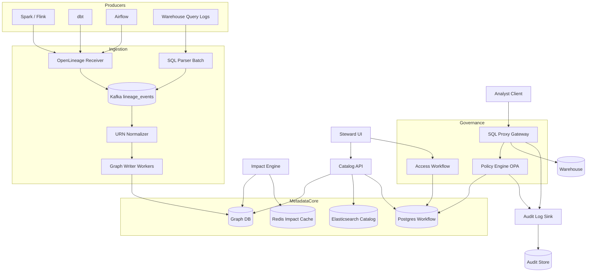
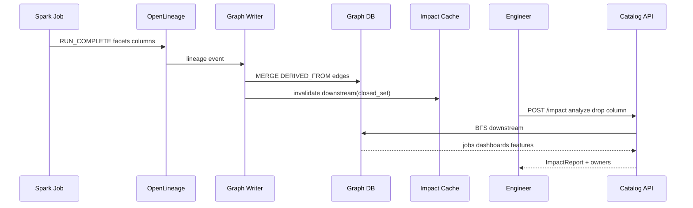

# System Design: Data Lineage and Governance

> **Focus areas:** Column-level lineage · Impact analysis · Access policies · PII tagging · Data stewardship · Policy enforcement  
> **Style:** End-to-end metadata platform with progressive scale (10× → 100× → 1,000×)  
> **Quality bar:** Graph query performance, policy decision latency, honest OpenLineage vs manual gaps  
> **Interview theme:** Staff-level data platform — how organizations **know where data came from, who can use it, and what breaks when schemas change**

---

## Table of Contents

1. [Clarify Requirements (Interview Q&A)](#1-clarify-requirements-interview-qa)
2. [Back-of-the-Envelope Estimation](#2-back-of-the-envelope-estimation)
3. [High-Level Design](#3-high-level-design)
4. [Architecture Diagram](#4-architecture-diagram)
5. [Design Deep Dive](#5-design-deep-dive)
6. [Wrap-Up](#6-wrap-up)
7. [Deeper / Related Interview Questions](#7-deeper--related-interview-questions)

---

## 1. Clarify Requirements (Interview Q&A)

The goal of this phase is to **bound the problem**: what lineage granularity is required, how governance policies bind to metadata, and at what scale graph traversal and policy evaluation remain interactive.

### 1.0 What this is / is not

| Dimension | This is | This is not |
|-----------|---------|-------------|
| Job | **Lineage + governance platform**: capture column-level data flow, classify sensitive data, enforce access policies, support impact analysis and stewardship workflows | A data quality monitoring system (see DQ doc) or warehouse compute engine |
| Primary artifact | Metadata graph (assets, columns, jobs, policies) + policy engine + catalog UI/API | ETL execution |
| Users | Data stewards, security/compliance, data engineers, analysts (read-only discovery) | End customers |
| Lineage source | SQL parsing, OpenLineage events, Spark hooks, dbt manifests, manual curation | Perfect automatic lineage for every notebook |
| Governance | RBAC/ABAC, PII tags, retention, masking, approval workflows | Legal contract management |

### 1.1 Functional Requirements

| # | Question to ask | Expected / typical interviewer answer | Design implication |
|---|-----------------|----------------------------------------|--------------------|
| F1 | Lineage granularity? | **Column-level** preferred; table-level minimum | Graph edges `column → column` via transformation job |
| F2 | Lineage direction? | Upstream (sources) and downstream (impact) | Bidirectional index or reverse edges |
| F3 | How collected? | OpenLineage from Spark/Airflow/dbt; SQL parser for warehouse queries; API for custom | Multi-source **lineage ingestion** with dedup + confidence score |
| F4 | Impact analysis? | "If I drop column X, what dashboards/ML models break?" | Traverse downstream subgraph; rank by tier/owner |
| F5 | PII / sensitivity tagging? | Manual stewardship + ML classification suggestions | Tags on columns; propagate derived sensitivity |
| F6 | Access policies? | Role-based + attribute-based (team, clearance, purpose) | Policy engine evaluates on query or export |
| F7 | Enforcement point? | Warehouse query gateway, BI tool, export APIs — not just documentation | **Policy decision point (PDP)** integration |
| F8 | Stewardship workflows? | Request access → owner approve → time-bound grant | Ticket workflow + audit log |
| F9 | Data catalog search? | Search tables/columns by name, owner, tag, description | Search index (Elasticsearch) over metadata |
| F10 | Business glossary? | Terms linked to columns (`customer_id` = ...) | Term ↔ column mapping nodes |
| F11 | Retention / lifecycle? | Legal hold, TTL per classification | Policy binds to asset; purge workflows |
| F12 | Cross-system lineage? | Snowflake → Kafka → S3 → ML feature store | Unified global IDs (URN) |
| F13 | Versioning? | Schema versions over time; lineage as-of | Temporal graph or snapshot ids |
| F14 | Audit? | Who accessed what column when | Access log ingestion from warehouse audit |
| F15 | Multi-tenant? | Business units isolated | Namespace in URN; cell boundaries |

**MVP functional scope (lock this with interviewer):**

1. Register datasets (tables, topics, files) and columns with owner.
2. Ingest OpenLineage events + dbt manifest → build table/column graph.
3. UI/API: upstream/downstream traversal to depth N with filters.
4. Impact report: downstream jobs, dashboards (registered), datasets for a column change.
5. Manual PII tag + **propagation rule**: derived column inherits max sensitivity of inputs.
6. RBAC policies: role → dataset read; enforced at SQL proxy for one warehouse.
7. Access request workflow with owner approval and 90-day grant.
8. Search catalog by name/owner/tag.
9. Audit log of policy decisions and grants.

**Out of MVP (explicitly defer):**

- 100% automatic lineage for every ad hoc notebook
- Real-time sub-ms policy on every row filter
- Cross-cloud unified encryption key management
- Full GDPR legal case management
- Automated remediation of policy violations
- Blockchain immutability theater

### 1.2 Non-Functional Requirements

| # | Question | Expected answer | Target |
|---|----------|-----------------|--------|
| N1 | Lineage query latency | Interactive exploration | p95 < 500ms for depth-5 column traversal (cached) |
| N2 | Impact analysis | Batch report OK | < 30s for 10K node subgraph |
| N3 | Policy evaluation | On query path | p99 < 50ms (cache); fail-closed for denied |
| N4 | Availability | Catalog important, not OLTP | 99.9% read path |
| N5 | Durability | Metadata never silently lost | Graph writes durable; event log retained |
| N6 | Consistency | Eventually consistent lineage | OpenLineage may arrive late; reconcile |
| N7 | Scale | See table | Graph DB + search index sharding |
| N8 | Security | Metadata may describe sensitive assets | RBAC on catalog; no sample PII in lineage |
| N9 | Cost | Graph storage moderate | Tier cold lineage archives |

### 1.3 Cases (Happy Paths & Edge / Failure)

**Happy paths**

1. dbt run completes → OpenLineage event → parser links `stg_orders.amount` → `fct_revenue.total_amount`.
2. Steward tags `users.email` as PII → propagation marks `mart_customer.email_hash` as derived-sensitive.
3. Engineer plans to drop column → impact API returns 3 dashboards + 1 ML feature group → notifies owners.
4. Analyst requests access to `finance.revenue` → owner approves → PDP allows SELECT for 90 days.
5. SQL proxy intercepts query joining PII to non-cleared role → deny with policy id in error.
6. Search "customer lifetime value" → glossary term → linked columns across marts.

**Edge / failure cases**

| Case | Behavior |
|------|----------|
| Missing lineage for notebook query | Mark confidence low; manual link UI; periodic SQL log mining |
| Conflicting lineage from two sources | Merge with precedence: OpenLineage > parser > manual |
| Circular lineage (A→B→A) | Cycle detection; collapse for impact with warning |
| Column rename in warehouse | Schema version diff; alias old→new for transition window |
| Policy cache stale after revoke | TTL 60s + pub/sub invalidation; fail-closed optional |
| Over-propagated PII tag | Steward override with justification audit |
| Impact explosion (fanout 100K nodes) | Paginate; summarize by asset type; sample leaves |
| Late OpenLineage event | Upsert graph; recompute affected impact cache |
| Cross-region duplicate URNs | Global URN namespace enforced at registration |
| User leaves company | Identity sync removes grants; audit retained |
| Dynamic SQL unparseable | Table-level lineage only; flag for manual |
| Federated query across cells | PDP evaluates each asset; deny if any fail |

### 1.4 Scales (Progressive)

| Metric | Baseline | 10× | 100× | 1,000× |
|--------|----------|-----|------|--------|
| Registered datasets | 5K | 50K | 500K | 5M |
| Columns (total) | 200K | 2M | 20M | 200M |
| Lineage edges | 2M | 20M | 200M | 2B |
| Lineage events / day | 50K | 500K | 5M | 50M |
| Jobs (ETL/ML) | 2K | 20K | 200K | 2M |
| Policy rules | 500 | 5K | 50K | 500K |
| Access grants active | 10K | 100K | 1M | 10M |
| Catalog search QPS | 50 | 500 | 5K | 50K |
| Lineage API QPS | 20 | 200 | 2K | 20K |
| Policy decisions / day | 500K | 5M | 50M | 500M |
| Stewards / human users | 200 | 2K | 20K | 200K |

**What each jump forces architecturally:**

- **10×:** Graph DB (Neo4j/JanusGraph/Neptune); ES search; async lineage ingestion queue.
- **100×:** Sharded graph by tenant; precomputed impact index; policy decision cache cluster; column ID indirection.
- **1,000×:** Hierarchical graph (table-level default, column on demand); approximate impact; regional metadata cells with global search federator.

### 1.5 Etc. (Constraints & Assumptions)

Ask and record:

- **Graph store?** Property graph with column nodes — not only Postgres adjacency list at 100×.
- **Identity?** SSO (Okta); groups map to roles.
- **Warehouse enforcement?** Proxy or native row/column policies (Snowflake masking) — hybrid common.
- **OpenLineage?** Standard facet for run/job/dataset; extend for column facets.

**Scope statement to repeat back:**

> Design a **data lineage and governance platform** with column-level graph, impact analysis, PII tagging with propagation, RBAC/ABAC policies enforced at query time, and stewardship workflows — from ~5K datasets / 2M edges baseline through 1,000× — integrated via OpenLineage ingestion, not rebuilding Spark.

---

## 2. Back-of-the-Envelope Estimation

### 2.1 Graph storage

```text
Baseline: 2M edges, 200K column nodes
Node ~500B, edge ~200B → (200K×500B + 2M×200B) ≈ 100 MB + 400 MB ≈ 500 MB logical
+ indexes ×3 → ~1.5 GB (tiny)

100×: 200M edges → ~40 GB logical + indexes → ~150 GB — fits graph DB cluster
1,000×: 2B edges → ~1.5 TB — requires sharding + tiered column materialization
```

### 2.2 Lineage ingestion throughput

```text
50K events/day ≈ 0.6 events/s avg; peak 10/s
Event size ~5 KB → 250 MB/day ingest
Parser CPU: ~100ms/event → 1 parser core at peak if serial; 10 workers plenty baseline

1,000×: 50M events/day ≈ 580/s → dedicated ingestion fleet + batch graph writes
```

### 2.3 Lineage query performance

```text
Depth-5 traversal on bounded degree:
  If avg fanout 4: 4^5 = 1024 nodes worst case — fine in memory
  High fanout hub (popular dimension): 100K downstream — need pagination + precomputed closure

Precompute **transitive downstream** for tier-0 assets nightly:
  500 critical columns × 10K downstream avg = 5M closure entries (cache)
```

### 2.4 Search index

```text
200K columns × 2 KB doc ≈ 400 MB ES baseline
5M datasets × 50 cols at 1,000× columns materialized lazily — search sharded by tenant
```

### 2.5 Policy evaluation

```text
500K decisions/day ≈ 6 QPS avg; peak 100 QPS
Cache hit 95% → 5 QPS PDP compute
PDP eval: fetch grants + tags ~2ms from Redis → p99 50ms achievable

100×: 50M/day ≈ 580/s → regional PDP clusters; OPA bundle cache
```

### 2.6 Audit log storage

```text
500K access events/day × 300B ≈ 150 MB/day ≈ 55 GB/year
Compliance retention 7y → ~400 GB — object store + query engine (Trino)
```

### 2.7 Separate load classes

| Class | Baseline | 1,000× | Backend |
|-------|----------|--------|---------|
| A | Lineage ingest | 10/s | 10K/s | Kafka → workers |
| B | Graph read | 20/s | 20K/s | Graph DB + cache |
| C | Search | 50/s | 50K/s | Elasticsearch |
| D | Policy eval | 100/s | 100K/s | OPA + Redis |
| E | Impact batch | 100/day | 10K/day | Spark on graph export |

### 2.8 Memory (impact cache)

```text
Hot impact cache: 10K popular columns × 100 KB downstream list ≈ 1 GB Redis
```

---

## 3. High-Level Design

### 3.1 Unified resource naming (URN)

```text
urn:li:dataset:(warehouse,analytics.orders,PROD)
urn:col:(warehouse,analytics.orders,order_id)
urn:li:dataJob:(airflow,dbt_run_fct_revenue)
urn:li:glossaryTerm:(customer_lifetime_value)
```

All ingestion normalizes to URNs; aliases map schema versions.

### 3.2 Graph model

```text
Nodes:
  Dataset, Column, Job, Dashboard, MLFeatureGroup, GlossaryTerm, User, Policy

Edges:
  (Column)-[:PART_OF]->(Dataset)
  (Job)-[:READS {columns[]}]->(Column)
  (Job)-[:WRITES {columns[]}]->(Column)
  (Column)-[:DERIVED_FROM {expression?}]->(Column)   # compiled lineage
  (Column)-[:TAGGED {tag, source, confidence}]->(Tag)
  (Term)-[:MAPS_TO]->(Column)
  (Dashboard)-[:DEPENDS_ON]->(Column|Dataset)
  (User)-[:OWNS]->(Dataset)
  (Grant)-[:ALLOWS {role, expires}]->(User|Group)
```

**Derived edge materialization:** on job completion, expand column mapping into `DERIVED_FROM` for fast traversal (vs only job nodes).

### 3.3 Lineage ingestion pipeline

```text
Sources:
  OpenLineage (Spark, Airflow, Flink)
  dbt artifacts (manifest.json, run_results)
  Warehouse query logs (batch SQL parser)
  Manual UI edges

Pipeline:
  Event → Normalize URN → Dedup (run_id, job facet)
         → Column resolver (schema registry snapshot at run time)
         → Graph upsert (MERGE nodes/edges)
         → Invalidate impact cache keys
         → Emit stewardship alerts on new PII paths
```

**Confidence score:** 1.0 OpenLineage column facet; 0.7 SQL parser; 0.4 table-level only.

### 3.4 Column-level SQL parsing (warehouse logs)

```text
Offline job: sample daily query log
  Parse SELECT/WITH/JOIN/CREATE TABLE AS
  Map output columns to input columns via AST
  Limitations: dynamic SQL, SELECT * — degrade to table-level
Store parser version on edge for debugging
```

### 3.5 Impact analysis engine

```text
Input: column_urn, change_type (delete|rename|type_change)
Traverse: BFS downstream on DERIVED_FROM + WRITES + DEPENDS_ON
Filter: depth, asset_type, tenant
Rank: tier, pagerduty_service, last_access_time
Output: paginated ImpactReport + owner contacts
```

**Optimization:** nightly **downstream closure** table for critical assets:

```text
closure(column_urn) → sorted set(downstream_urn) materialized
Update incrementally on graph delta for affected subgraph only
```

### 3.6 PII tagging and propagation

```text
Tag types: PII_EMAIL, PII_SSN, FINANCE, PUBLIC, ...
Manual tag on column → source= steward, confidence=1.0

Propagation rule (default):
  derived_sensitivity = MAX(input_tags.sensitivity_rank)
  If ML classifier suggests tag with p>0.9 → queue steward review

Override: steward can mark "safe hash" with documented transform
```

**Transform-aware exceptions:** `hash(email)` may downgrade with approved policy rule.

### 3.7 Policy engine (PDP)

```text
PolicyDecisionPoint:
  Input: subject (user, groups, clearance), action (read|export), resource (column/dataset), context (purpose, time)
  Policies: RBAC role grants + ABAC rules on tags
  Output: ALLOW | DENY | ALLOW_WITH_MASK

Integration:
  SQL Proxy: parse query → extract referenced columns → batch PDP evaluate
  BI tool: embed PDP SDK on dataset open
  Export API: gate Parquet export
```

**Example ABAC rule:**

```text
DENY if resource.tag IN (PII_*) AND subject.clearance < CONFIDENTIAL
UNLESS subject.group IN resource.owner_team AND purpose logged
```

Use **OPA/Rego** or Cedar; bundle policies to edge cache.

### 3.8 Stewardship workflow

```text
AccessRequest {
  requester, resource_urn, justification, purpose, duration
}
State: pending → approved | denied | expired
Approval routing: resource.owner → delegate → manager escalation
On approve: create Grant node + sync to warehouse native GRANT (optional)
Audit: immutable append log
```

### 3.9 Catalog search

Elasticsearch docs:

```json
{
  "urn": "urn:col:(...,orders,amount)",
  "name": "amount",
  "dataset": "orders",
  "owner": "team-finance",
  "tags": ["FINANCE"],
  "description": "...",
  "popularity_score": 42
}
```

Boost by access frequency from audit logs.

### 3.10 APIs

| Method | Path | Purpose |
|--------|------|---------|
| GET | `/catalog/search?q=` | Discovery |
| GET | `/lineage/column/{urn}/upstream?depth=` | Upstream graph |
| GET | `/lineage/column/{urn}/downstream?depth=` | Downstream |
| POST | `/impact/analyze` | Change impact report |
| POST | `/tags` | Apply tag |
| POST | `/policies/evaluate` | PDP batch check |
| POST | `/access-requests` | Start workflow |
| POST | `/ingest/openlineage` | Webhook |
| GET | `/assets/{urn}` | Asset detail |

### 3.11 Architecture options

#### Option A — Graph DB center (MVP)

Neo4j/Neptune for lineage; Postgres for workflow; ES search; OPA PDP.

**Pros:** Natural traversals. **Cons:** Scale limits → sharding at 100×.

#### Option B — Table + adjacency (small scale only)

Postgres tables `edges(from,to)` — **deal-breaker at 100×** for depth traversal latency.

#### Option C — Hybrid

Hot graph in Graph DB; cold lineage archive in parquet; lazy load column edges.

**Doc decision:** **Option A** → **Option C** at 100×.

### 3.12 Trade-off tables

| Decision | Choose | Over | Why |
|----------|--------|------|-----|
| Lineage source | OpenLineage + dbt + parser | Manual only | Coverage |
| Granularity | Column when possible | Table-only | Impact precision |
| PII propagation | MAX sensitivity default | Manual every derived | Compliance gap risk |
| Enforcement | Proxy + native warehouse | Catalog-only | Policy must bite |
| Policy language | OPA/Rego | Hardcoded Java | Auditability |
| Graph store | Property graph DB | RDBMS adjacency | Traversal perf |
| Impact | Precomputed closure tier-0 | Always live BFS | Latency at scale |

### 3.13 Deal-breakers

- Catalog that nobody integrates with enforcement ("checkbox compliance").
- Propagating PII tags without derived edges (miss nested marts).
- Global graph traversal without tenant filter (data leak in metadata).
- Storing actual PII values in catalog documents.

---

## 4. Architecture Diagram





---

## 5. Design Deep Dive

### 5.1 Reliability

#### 5.1.1 Lineage completeness

| Risk | Mitigation |
|------|------------|
| Missing events | Query log backfill; confidence scores; steward tasks |
| Schema drift breaks parser | Versioned schema registry snapshot per run |
| Duplicate edges | Idempotent MERGE on (from,to,job,run) |
| Graph corruption | Daily export to S3; point-in-time restore |

#### 5.1.2 Policy enforcement reliability

- PDP unavailable: **fail-closed** for PII/finance; configurable fail-open for sandbox.
- Cache stampede: single-flight refresh per policy bundle version.
- Grant expiry: sweeper job revokes + warehouse sync.

#### 5.1.3 Idempotency

OpenLineage events keyed by `(run_id, job_namespace, job_name)`; upsert graph.

#### 5.1.4 Audit durability

Append-only Kafka → S3 Parquet; WORM bucket for compliance tier.

#### 5.1.5 Reconciliation

Nightly job compares graph dataset list vs warehouse INFORMATION_SCHEMA; alert orphan/or missing.

### 5.2 Scalability

#### 5.2.1 Graph sharding

```text
Shard key: tenant_id (or business_unit)
Cross-shard edges: store stub + async federated query for impact
Mega-hub column (e.g., date_dim): store summarized edge to consumer groups
```

#### 5.2.2 Scale jumps

| Jump | Move |
|------|------|
| 10× | Graph DB cluster; ES replicas; async ingestion |
| 100× | Column lineage lazy-load; closure precompute; graph partition |
| 1,000× | Table-default graph; column fetch on drill-down; federated catalog search |

#### 5.2.3 Impact query optimization

- Limit default depth=3; expand on click.
- Precomputed closure for 500–5K critical nodes.
- Approximate: count downstream by type without listing all leaves.

#### 5.2.4 Search at scale

- Per-tenant indices; alias routing.
- Popularity ranking reduces need for deep pagination.

#### 5.2.5 Policy evaluation batching

SQL proxy extracts 50 column refs → **single PDP batch call**; result map cached 60s per (user, column_set_hash).

### 5.3 Maintainability

#### 5.3.1 Observability

- `lineage_events_ingested`, `graph_write_lag`, `parser_fail_rate`, `pdp_deny_rate`, `impact_query_latency`, `tag_propagation_queue`.
- Trace ingestion → graph write for debugging missing edges.

#### 5.3.2 Schema evolution

- Dataset schema versions as nodes linked `SCHEMA_VERSION_OF`.
- Column rename: `SAME_AS` edge between version nodes for impact continuity.

#### 5.3.3 Multi-tenant

- Hard tenant filter on every graph query API.
- Policy bundles per tenant; no shared OPA data across tenants.

#### 5.3.4 Stewardship ops

| Task | Tooling |
|------|---------|
| Orphan datasets | Reconciliation report |
| PII without owner | Weekly digest |
| Excessive grants | Access review campaign quarterly |
| Policy test | PDP unit tests in CI with fixture graph |

#### 5.3.5 Migrations

- Export graph to GraphML for major DB migration.
- Dual-write graph during cutover week.

---

## 6. Wrap-Up

### 6.1 Decision summary

| Area | Decision |
|------|----------|
| Identity | URN for all assets/columns/jobs |
| Lineage | OpenLineage + dbt + SQL parser; column edges materialized |
| Graph | Property graph DB with tenant sharding path |
| Impact | BFS + precomputed closure for critical columns |
| PII | Manual + propagation MAX rule + steward override |
| Policies | OPA PDP at SQL proxy; fail-closed sensitive |
| Workflow | Postgres state machine + audit log |
| Search | Elasticsearch with popularity |

### 6.2 Phased rollout

1. **Phase 0:** Dataset catalog + table lineage from dbt; search.
2. **Phase 1:** OpenLineage column lineage; impact API; manual tags.
3. **Phase 2:** PII propagation; PDP proxy; access requests.
4. **Phase 3:** Query log parser; closure precompute; multi-region cells.

### 6.3 Risks & follow-ups

| Risk | Mitigation |
|------|------------|
| Incomplete lineage | Confidence UI; backfill jobs |
| Policy bypass via direct warehouse URL | Network policy; disable direct creds |
| Graph scale | Sharding; lazy column edges |
| Tag false positives | Human review queue |
| Org churn | HR sync for grants |

### 6.4 How to present in 45 minutes

1. Requirements: column lineage + enforcement (8 min)  
2. URN + graph model (7 min)  
3. Ingestion pipeline (8 min)  
4. Impact + PII propagation (8 min)  
5. PDP integration (7 min)  
6. Scale + trade-offs (7 min)

### 6.5 One-liner

> **Unify metadata in a column-level graph, ingest lineage from jobs automatically, propagate sensitivity, and enforce access at query time with auditable stewardship—not a passive wiki.**

---

## 7. Deeper / Related Interview Questions

**Q1. OpenLineage vs Apache Atlas vs DataHub?**  
All capture metadata; OpenLineage is **run-time event standard**. DataHub/Atlas are catalog stores — design ingestion to any; emphasize column facets.

**Q2. Table vs column lineage?**  
Table enough for coarse impact; column required for PII and schema change precision. Interview: design column, degrade gracefully.

**Q3. How parse SQL reliably?**  
Use sqlglot/sqlfluff AST; bind schema catalog at query timestamp; fail to table-level.

**Q4. SELECT * handling?**  
Expand using schema snapshot; if unknown, link all columns with low confidence.

**Q5. Impact analysis if graph incomplete?**  
Show coverage %; mark unknown downstream; don't pretend completeness.

**Q6. PII propagation through joins?**  
Join brings all input columns' tags into wider row; MAX sensitivity applies to output columns touched.

**Q7. Hash of email still PII?**  
Policy choice: often still PII (linkable); steward can approve downgrade with salted hash rule documented.

**Q8. RBAC vs ABAC?**  
RBAC: role has table access. ABAC: clearance + purpose + tags. Combine: RBAC coarse, ABAC fine on sensitive.

**Q9. Enforce in warehouse native vs proxy?**  
Native (Snowflake row access policies) stronger perf; proxy unified cross-engine. Hybrid common.

**Q10. Fail-open if PDP down?**  
Never for PII; maybe for dev sandbox with alert.

**Q11. Lineage for streaming Kafka?**  
OpenLineage on Flink job; dataset URNs for topics; schema registry for fields as columns.

**Q12. ML feature store lineage?**  
Feature group registers upstream columns; link training export jobs as Job nodes.

**Q13. Dashboard lineage without API?**  
Manual registration + parse BI tool metadata exports (Looker, Tableau) nightly.

**Q14. Cycle in graph?**  
Possible with views; BFS with visited set; report cycle to steward.

**Q15. Delete column impact on ML?**  
Traverse to FeatureGroup → TrainingPipeline → Scheduled jobs; notify ML platform owner.

**Q16. Temporal lineage "as of 2025"?**  
Store edges with `[valid_from, valid_to)` from job run times; query graph at timestamp.

**Q17. Multi-cloud URNs?**  
Include platform in URN; federated graph query across shards.

**Q18. Stewardship bottleneck?**  
Auto-approve low-risk read on non-PII public datasets; SLAs on pending requests.

**Q19. Data mesh ownership?**  
Domain owns datasets; central platform provides graph + policy framework; federated stewardship.

**Q20. GDPR right to erasure vs lineage?**  
Erase user data in sources; lineage metadata about column **names** retained; audit who accessed PII.

**Q21. Column vs row filtering?**  
PDP returns column mask map; proxy rewrites SELECT or warehouse policy enforces.

**Q22. Graph DB choice?**  
Neo4j familiar; Neptune managed; JanusGraph for huge sharded — trade ops vs scale.

**Q23. Prevent metadata poisoning?**  
Authenticated ingestion only; signed OpenLineage from trusted runners.

**Q24. Lineage for dbt tests?**  
Tests as Job nodes — optional; impact usually cares about model dependencies not test nodes.

**Q25. Access review campaigns?**  
Quarterly export all grants >90d; owners recertify; auto-revoke no-response.

**Q26. Business glossary drift?**  
Terms versioned; link to column schema versions.

**Q27. Cross-border data transfer?**  
Tag dataset region; ABAC deny if subject.region != data.region without legal basis attribute.

**Q28. Performance: BFS 1M nodes?**  
Must paginate; precompute; don't live BFS in request path.

**Q29. Diff catalog vs governance?**  
Catalog = discover; governance = policy + process. Same platform, different services.

**Q30. Integrate with DQ platform?**  
Link DQ failure incidents to assets in graph; impact includes downstream if quality gate failed — complementary systems.
