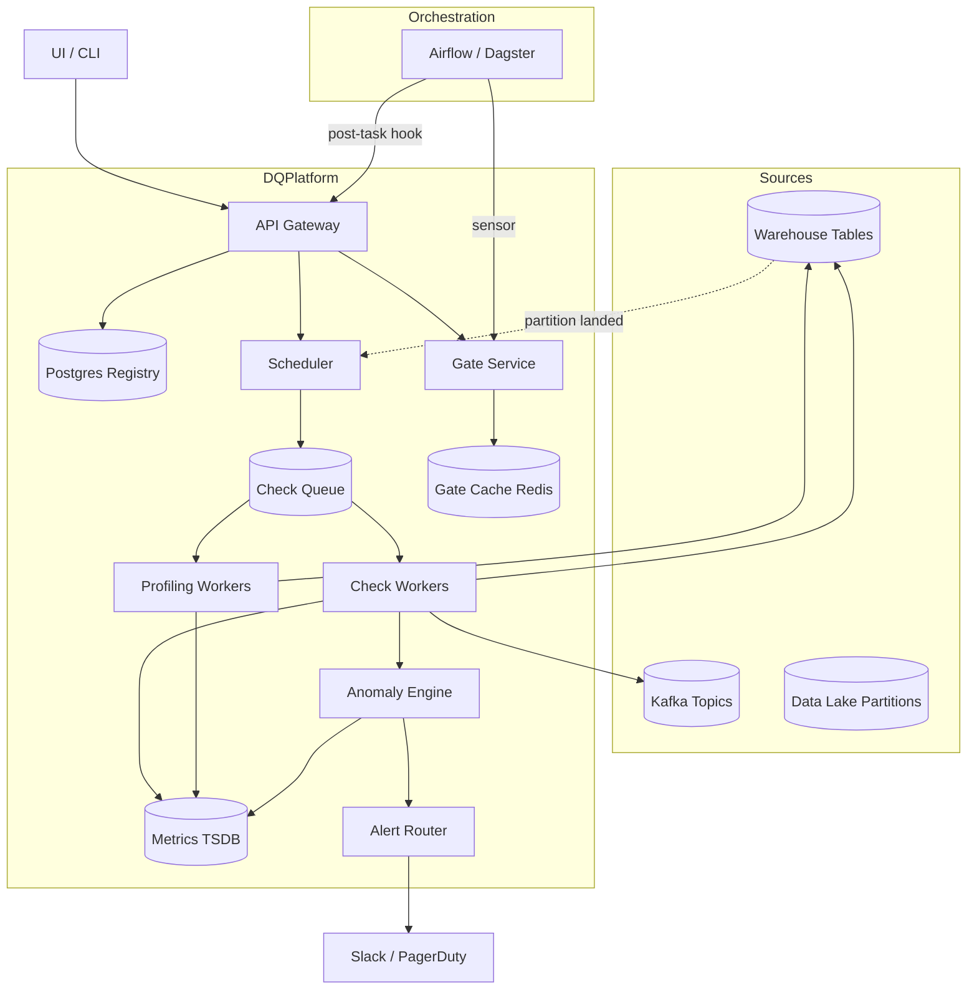
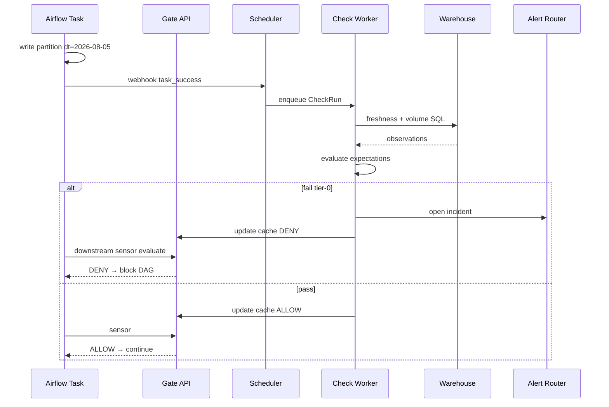

# System Design: Data Quality Monitoring Platform

> **Focus areas:** Expectations · Anomaly detection · Circuit breakers on pipelines · Profiling · Freshness / volume / schema / distribution checks  
> **Style:** End-to-end data observability platform with progressive scale (10× → 100× → 1,000×)  
> **Quality bar:** Domain-specific SLIs, explicit fail-open vs fail-closed trade-offs, integration with orchestrators (Airflow/Dagster)  
> **Interview theme:** Staff-level data platform — how teams **detect, alert, and block** bad data before it poisons dashboards, ML training, and revenue pipelines

---

## Table of Contents

1. [Clarify Requirements (Interview Q&A)](#1-clarify-requirements-interview-qa)
2. [Back-of-the-Envelope Estimation](#2-back-of-the-envelope-estimation)
3. [High-Level Design](#3-high-level-design)
4. [Architecture Diagram](#4-architecture-diagram)
5. [Design Deep Dive](#5-design-deep-dive)
6. [Wrap-Up](#6-wrap-up)
7. [Deeper / Related Interview Questions](#7-deeper--related-interview-questions)

---

## 1. Clarify Requirements (Interview Q&A)

The goal of this phase is to **bound the problem**: what "quality" means measurably, where checks run, when pipelines must stop, and at what scale profiling and anomaly detection remain affordable.

### 1.0 What this is / is not

| Dimension | This is | This is not |
|-----------|---------|-------------|
| Job | **Data quality monitoring platform** — define expectations, run checks on tables/streams, detect anomalies, optionally **circuit-break** downstream pipelines | A full data catalog / lineage product (see lineage doc) |
| Primary artifact | Expectation suites + check execution engine + time-series metrics store + alerting + pipeline gates | ETL transformation framework |
| User | Data engineers, analytics engineers, ML platform, on-call SRE | Business analysts writing SQL only |
| Integration points | Warehouse tables (Snowflake/BigQuery/Spark), Kafka topics, Airflow/Dagster task sensors | Replacing the warehouse |
| Output | Pass/fail results, profiles, incidents, SLA dashboards, webhook to PagerDuty/Slack | Auto-fixing bad upstream data |

### 1.1 Functional Requirements

| # | Question to ask | Expected / typical interviewer answer | Design implication |
|---|-----------------|----------------------------------------|--------------------|
| F1 | What assets are monitored? | Tables, views, streams, ML feature groups, export files | Asset registry with `fqn` (db.schema.table) + optional column subset |
| F2 | Check types? | Freshness, volume, schema, null rate, uniqueness, referential integrity, distribution, custom SQL | Pluggable **expectation types** with parameters |
| F3 | Who defines expectations? | Asset owners via YAML/UI; platform provides templates | Git-backed expectation repos; PR review |
| F4 | When do checks run? | On schedule, post-task (after Airflow task), on new partition landing, streaming micro-batch | Scheduler + **event hooks** from orchestrator |
| F5 | Profiling? | Auto baseline: min/max/mean/std, histograms, top-K categoricals | Sample-based profiling job; store profiles time-series |
| F6 | Anomaly detection? | Compare today vs 7d/28d baseline; seasonality for weekly patterns | TSDB + statistical + optional ML detector |
| F7 | Circuit breakers? | Block downstream tasks / mark partition bad / prevent BI publish | Integration: Airflow `ShortCircuitOperator`, Dagster asset checks, API callback |
| F8 | Severity / policy? | Warn vs fail; fail-open for non-critical; **fail-closed** for revenue/ML | Policy engine per asset tier |
| F9 | Alerting? | Slack, PagerDuty, email; dedupe; ownership routing | Alert manager with incident lifecycle |
| F10 | Historical trends? | 90d–1y of check results for debugging | Compressed metrics in TSDB + result detail in OLAP |
| F11 | Cross-table checks? | FK-like: orders.user_id exists in users | Join checks on sample or aggregate maps |
| F12 | Streaming data? | Kafka topic volume, schema registry compat, lag | Stream expectations with windowed metrics |
| F13 | Multi-tenant? | Teams isolated; shared platform | `tenant_id`, RBAC, quota on checks/day |
| F14 | Root cause hints? | "Volume dropped 40% vs same DOW" + upstream lineage pointer | Link to orchestrator run + optional lineage integration |
| F15 | Self-serve onboarding? | Register asset + apply template suite in < 1 day | Scaffolding CLI; default suites by asset class |

**MVP functional scope (lock this with interviewer):**

1. Asset registry: register warehouse tables/streams with owner and tier.
2. Expectation DSL (YAML): freshness, row count bounds, schema columns, null %, distinct count.
3. Check executor: runs SQL against warehouse or Spark; stores pass/fail + observed value.
4. Scheduler: cron + post-partition hooks.
5. Profiling job: sample 1–5% rows; store column stats time-series.
6. Alert on failure (warn/fail severities); Slack webhook.
7. **Circuit breaker API:** `POST /gates/{asset}/evaluate` returns allow/deny for orchestrator sensor.
8. Dashboard: asset health, recent failures, freshness lag.

**Out of MVP (explicitly defer):**

- Auto-remediation (rewind upstream, backfill fixes)
- Full ML-based anomaly on every column (start with z-score / IQR)
- Real-time per-row validation in OLTP path
- Data contracts with legal enforcement
- Built-in lineage graph UI (integrate external)
- Natural language expectation authoring

### 1.2 Non-Functional Requirements

| # | Question | Expected answer | Target |
|---|----------|-----------------|--------|
| N1 | Check latency | Finish before downstream SLA | Freshness check < 30s; full suite on 1B row table < 15 min (pushdown) |
| N2 | Profiling cost | Bounded warehouse spend | Sample-based; budget cap per asset/day |
| N3 | Availability | Monitoring can degrade; gates must be predictable | 99.9% control plane; cached last result if executor down (policy) |
| N4 | Durability | Never lose failure history | Results durable 13 months; incidents 2 years |
| N5 | False positive rate | Low alert fatigue | Tunable thresholds; seasonality; flapping suppression |
| N6 | False negative (miss bad data) | Unacceptable for tier-0 | Fail-closed gates; no silent skip |
| N7 | Multi-region | Global assets | Regional executors; UTC-normalized schedules |
| N8 | Security | Read-only warehouse creds; no PII in alert body | Scoped roles; redact sample values |
| N9 | Throughput | See scale table | Horizontal check workers |

### 1.3 Cases (Happy Paths & Edge / Failure)

**Happy paths**

1. Partition `orders dt=2026-08-05` lands → orchestrator triggers post-task check → freshness + volume pass → gate allows downstream dbt model.
2. Profiling detects new column `discount_code` → schema expectation fails → alert owner → owner updates expectation PR → passes.
3. Row count drops 50% vs same day-of-week → anomaly rule fires warn → on-call investigates upstream delay.
4. Tier-0 ML export check fails null threshold → circuit breaker blocks training DAG → PagerDuty page.
5. Owner views 30d trend of `null_pct(email)` → correlates with upstream API change.
6. Stream check: Kafka topic rate below floor for 10 min → alert streaming team.

**Edge / failure cases**

| Case | Behavior |
|------|----------|
| Warehouse timeout during check | Retry with backoff; mark `unknown`; tier-0 gate **deny** if no recent pass |
| Check executor outage during gate | Policy: fail-closed tier-0; fail-open tier-2 with alert |
| Flapping pass/fail | Hysteresis: require 2 consecutive fails to page; 1 pass to clear |
| Partial partition write (half files) | Volume lower bound catches; optional list prefix count check |
| Schema drift: column renamed | Schema expectation fail; block until expectation updated (intentional) |
| Seasonality (Black Friday volume spike) | Use YoY or learned seasonality; widen bounds |
| Sampling miss rare bug | Rare constraint checks use full scan or stratified sample |
| Duplicate check runs | Idempotent result write by `(asset, partition, expectation_id, run_id)` |
| Owner on vacation | Escalation policy; team routing |
| Cross-region clock skew | Use warehouse `metadata$modified` not wall clock |
| Massive table profiling | Cap sample 10M rows; approximate quantiles (t-digest) |
| Malicious SQL in custom expectation | Sandboxed role; AST allowlist; no multi-statement |

### 1.4 Scales (Progressive)

| Metric | Baseline | 10× | 100× | 1,000× |
|--------|----------|-----|------|--------|
| Monitored assets | 500 | 5K | 50K | 500K |
| Expectations / asset (avg) | 12 | 15 | 20 | 25 |
| Total expectations | 6K | 75K | 1M | 12M |
| Checks executed / day | 50K | 500K | 5M | 50M |
| Largest table (rows) | 10B | 100B | 1T | 10T |
| Warehouse scan budget / day | 5 TB | 50 TB | 500 TB | pushdown-only |
| Profiling samples / day | 500 | 5K | 50K | 500K |
| Alert events / day | 200 | 1K | 5K | 20K (deduped) |
| Gate evaluations / day | 20K | 200K | 2M | 20M |
| Tenants / teams | 30 | 150 | 1K | 10K |
| TSDB data points / day | 2M | 20M | 200M | 2B |

**What each jump forces architecturally:**

- **10×:** Worker pool; queue-based execution; TSDB (Prometheus/VictoriaMetrics); expectation compile cache.
- **100×:** Pushdown-only checks (no full scan); approximate profiling; shard scheduler by tenant; result rollups.
- **1,000×:** Tiered check frequency; ML anomaly only on tier-0; regional control planes; expectation bytecode push to warehouse native constraints where possible.

### 1.5 Etc. (Constraints & Assumptions)

Ask and record:

- **Warehouse?** Snowflake/BigQuery/Redshift — SQL pushdown assumed.
- **Orchestrator?** Airflow primary; Dagster asset checks second.
- **Existing tools?** Great Expectations / Soda / Monte Carlo — design is product-shaped, not vendor locked.
- **Stream bus?** Kafka + Schema Registry for stream assets.

**Scope statement to repeat back:**

> Design a **data quality monitoring platform** that registers datasets, runs freshness/volume/schema/distribution expectations (scheduled and post-task), profiles samples, detects anomalies, alerts owners, and **circuit-breaks** downstream pipelines for critical assets — from ~500 assets / 50K checks/day through 1,000× — without building the catalog or fixing upstream data automatically.

---

## 2. Back-of-the-Envelope Estimation

### 2.1 Check execution load

```text
Baseline: 50,000 checks / day
Avg check: 2 warehouse queries (metadata + metric)
Peak hour (post-daily-batch): 30% in 2 hours → ~7.5K checks / 2h ≈ 1 checks/s avg, 10/s peak

Each volume check on 1B row table with partition filter:
  SELECT COUNT(*) FROM t WHERE dt='...'  — seconds with partition pruning
Schema check: INFORMATION_SCHEMA — milliseconds
Distribution: APPROX_QUANTILES on sample — seconds to minutes
```

**1,000×:** 50M checks/day → **cannot** full-scan; compile to metadata-only + incremental stats where warehouse exposes them.

### 2.2 Warehouse cost

```text
Assume 50K checks × 50 GB scanned avg naive = 2.5 PB/day — unacceptable

With partition pruning + metadata:
  50K × 200 MB avg ≈ 10 TB/day scan budget (baseline target)

Profiling: 500 assets × 1M sample rows × 1 KB ≈ 500 GB/day sample IO
```

At **100×**, profiling must be **1% sample** or use table statistics API.

### 2.3 Storage (results + profiles)

```text
Per check result: ~500 bytes (ids, observed, threshold, pass, ts)
50K/day × 500B × 365 ≈ 9 GB/year results metadata
Detailed failure samples: optional 10 KB × 5% fails ≈ 125 MB/day

Profile time-series: 500 assets × 50 columns × 10 stats × 8B × daily
  ≈ 500 × 50 × 10 × 8 × 365 ≈ 730 MB/year (negligible)

At 1M assets × 100 cols: ~150 GB/year TSDB — still modest vs warehouse
```

### 2.4 Control plane DB

```text
6K expectations × 2 KB ≈ 12 MB
500 assets × 1 KB ≈ 0.5 MB
Postgres handles baseline; 12M expectations → ~24 GB + indexes → still OK with partitioning
```

### 2.5 Queue / workers

```text
Peak 10 checks/s, avg check 30s warehouse time
Concurrent slots needed: 10 × 30 ≈ 300 workers (upper bound if all slow)
Typical metadata checks 2s → 20 concurrent sufficient baseline
Worker fleet: 20–50 pods autoscaling on queue depth
```

### 2.6 Gate API QPS

```text
20K gate evals/day ≈ 0.2 QPS avg; peak 5 QPS
Latency target p99 < 200ms — cache last result in Redis
```

### 2.7 Separate load classes

| Class | Baseline peak | 1,000× | Backend |
|-------|---------------|--------|---------|
| A | Metadata checks | 5/s | 500/s | Warehouse |
| B | Heavy distribution | 0.1/s | 10/s | Spark pushdown |
| C | Profiling jobs | 50/hr | 5K/hr | Sample jobs |
| D | Gate reads | 5/s | 500/s | Redis cache |
| E | Alert dispatch | 10/hr | 200/hr | Alertmanager |

### 2.8 Memory (profiling coordinator)

```text
In-memory histogram merge for sample batches: ~64 KB × columns × workers
Negligible vs Spark executor memory
```

---

## 3. High-Level Design

### 3.1 Core concepts

```text
Asset          — monitored entity (table, stream, file prefix)
Expectation    — declarative rule on asset (or column)
ExpectationSuite — grouped expectations for asset
CheckRun       — one execution of suite against partition/window
Observation    — metric value produced (row_count, null_pct, ...)
Result         — pass | warn | fail | error | skip
Gate           — policy binding asset tier → downstream allow/deny
Incident       — alert lifecycle object
Profile        — column statistics snapshot
```

### 3.2 Expectation DSL (examples)

```yaml
asset: analytics.orders
partition_key: dt
tier: critical
owner_team: data-platform

expectations:
  - type: freshness
    max_lag: 6h
    timestamp_column: _loaded_at

  - type: row_count
    vs: same_day_of_week
    min_ratio: 0.7
    max_ratio: 1.5

  - type: schema
    columns:
      - { name: order_id, type: STRING, nullable: false }
      - { name: amount, type: DECIMAL(18,2) }

  - type: column_values
    column: status
    not_in: [null, "UNKNOWN"]

  - type: null_fraction
    column: user_id
    max: 0.001

  - type: uniqueness
    columns: [order_id]
    min_unique_ratio: 0.999

  - type: custom_sql
    name: revenue_non_negative
    sql: "SELECT COUNT(*) FROM {table} WHERE dt='{partition}' AND amount < 0"
    max_value: 0
```

### 3.3 Expectation types catalog

| Type | Observation | Pushdown |
|------|-------------|----------|
| `freshness` | `now - max(ts)` | MAX aggregate |
| `row_count` | count | COUNT(*) with partition |
| `schema` | column name/type set | INFORMATION_SCHEMA |
| `null_fraction` | nulls/total | SUM(CASE...) |
| `distinct_count` | COUNT DISTINCT | approx on sample |
| `distribution` | PSI vs baseline | histogram buckets |
| `referential` | orphan count | LEFT JOIN sample |
| `stream_rate` | events/min | Kafka metrics |
| `stream_lag` | consumer lag | broker JMX |
| `file_exists` | prefix listing | object store API |

### 3.4 Check execution engine

```text
Scheduler enqueues CheckRun { suite_id, asset, partition, trigger }
Worker:
  1. Resolve compiled SQL templates (cache by suite version)
  2. Acquire warehouse slot (token bucket per tenant)
  3. Execute queries with timeout + statement tag (cost attribution)
  4. Evaluate pass/warn/fail against thresholds
  5. Write Result + Observations to TSDB + Postgres
  6. Emit events → Alert evaluator → Gate updater
```

**Compilation:** expectations → parameterized SQL / Spark plan; validate AST; no DDL/DML.

### 3.5 Anomaly detection layer

| Method | Use | Cost |
|--------|-----|------|
| Fixed bounds | Schema, null max | Low |
| Same-DOW ratio | Volume | Low |
| Rolling z-score | Metrics with variance | Low |
| Seasonal STL | Weekly retail | Medium |
| Prophet / forecast | Tier-0 only | Medium |
| Multivariate ML | Phase 3 | High |

Store baseline in TSDB; update after pass with exponential decay.

### 3.6 Circuit breaker / gate integration

```text
GatePolicy {
  asset_tier: critical | standard | best_effort
  on_fail: block | warn
  on_error: block | allow_with_stale_pass
  stale_pass_max_age: 24h
}

Orchestrator sensor:
  response = POST /gates/evaluate { asset, partition }
  if response.decision == DENY: raise AirflowException
```

**Fail-closed vs fail-open:**

| Tier | Executor down | Last result fail | No prior result |
|------|---------------|------------------|-----------------|
| critical | DENY (or stale pass < 6h) | DENY | DENY |
| standard | ALLOW + alert | DENY | ALLOW + warn |
| best_effort | ALLOW | WARN | ALLOW |

### 3.7 Profiling service

```text
Schedule: daily per asset or on schema change
Method:
  TABLESAMPLE or BERNOULLI 1%
  Compute: row_count (exact from metadata), null_count, distinct_approx,
           min/max/mean/std numeric, top-10 categorical, histogram 50 buckets
Store: ProfileSnapshot in TSDB + object store for histograms
Use: auto-suggest expectations; anomaly baselines
```

### 3.8 APIs

| Method | Path | Purpose |
|--------|------|---------|
| POST | `/assets` | Register asset |
| GET | `/assets/{fqn}` | Metadata + health |
| PUT | `/assets/{fqn}/suite` | Upsert expectation suite |
| POST | `/checks/run` | Ad hoc run |
| GET | `/checks/runs/{id}` | Results |
| POST | `/gates/evaluate` | Circuit breaker |
| GET | `/profiles/{fqn}` | Time-series profiles |
| GET | `/incidents` | Open incidents |
| POST | `/webhooks/orchestrator` | Airflow callback on task success |

### 3.9 Component architecture

```text
UI / CLI ──► API Gateway ──► Control Plane (Postgres registry)
                  │
                  ├── Scheduler (cron + event hooks)
                  ├── Check Worker Pool ──► Warehouse / Spark
                  ├── Profiling Workers
                  ├── Anomaly Evaluator ◄── TSDB
                  ├── Alert Router ──► Slack / PagerDuty
                  └── Gate Cache (Redis)
Orchestrator (Airflow) ── sensors ──► Gate API
```

### 3.10 Trade-off tables

| Decision | Choose | Over | Why |
|----------|--------|------|-----|
| Check location | Warehouse pushdown | Download all data | Cost + speed |
| Profiling | Sample + approx | Full scan | 10B row tables |
| Gate default (tier-0) | Fail-closed | Fail-open | Prevent bad ML/revenue |
| DSL storage | Git + sync | UI only | Review + reproducibility |
| Anomaly | Simple baselines first | Deep ML everywhere | Alert fatigue |
| Result store | TSDB + Postgres detail | Logs only | Trends + audit |
| Custom SQL | Allow with sandbox | No custom | Flexibility with guardrails |

### 3.11 Deal-breakers

- Running checks that mutate data (INSERT/UPDATE/DELETE).
- Fail-open gates on revenue tables without explicit approval.
- Full table scan on every hourly partition for row count when metadata row count exists.
- Alerting raw PII values in Slack messages.
- No idempotency on check runs → duplicate pages.

---

## 4. Architecture Diagram





---

## 5. Design Deep Dive

### 5.1 Reliability

#### 5.1.1 Data loss prevention (of results)

| Risk | Mitigation |
|------|------------|
| Worker crash mid-check | CheckRun state machine; retry idempotent |
| TSDB outage | Buffer results locally; Postgres fallback for last N |
| False ALLOW on stale cache | TTL + tier policy; include `evaluated_at` in response |

#### 5.1.2 Idempotency

```text
check_run_id = hash(asset, partition, suite_version, scheduled_window)
Upsert results; duplicate webhook triggers same run_id → no-op if complete
```

#### 5.1.3 Retries

- Transient warehouse errors: 3 retries exponential backoff.
- Timeout: mark `error`; tier-0 gate treats as fail per policy.
- Poison expectation (bad SQL): fail fast; quarantine suite version.

#### 5.1.4 Rate limits & cost controls

- Per-tenant daily scan budget (TB).
- Concurrency caps per warehouse warehouse.
- Degrade: skip distribution checks first; keep freshness/volume.

#### 5.1.5 Backpressure

Queue depth threshold → delay non-critical schedules; never delay tier-0 past SLA.

#### 5.1.6 Circuit breaker semantics (detailed)

```text
States: ALLOW | DENY | DEGRADED

Transitions:
  pass → ALLOW
  fail (severity=fail) → DENY
  warn → ALLOW with annotation (tier standard) or DENY (tier critical if configured)
  error → policy matrix

Downstream must call evaluate immediately before destructive publish
Optional: publish "quality stamp" metadata on partition for consumers
```

### 5.2 Scalability

#### 5.2.1 Partitioning

```text
Queue shards by hash(tenant_id)
Workers stateless; scale horizontally
TSDB: shard by metric name + tenant
Postgres: partition check_results by month
```

#### 5.2.2 Scale jumps

| Jump | Move |
|------|------|
| 10× | Autoscale workers; compile cache; metadata-first checks |
| 100× | Warehouse-native constraints (Snowflake masking policies + SYSTEM$...) where possible; rollup dashboards |
| 1,000× | Hierarchical monitoring (table group health); sample profiling only tier-0 daily; regional deployments |

#### 5.2.3 Pushdown optimization

| Check | Naive | Optimized |
|-------|-------|-----------|
| Row count | COUNT(*) full | metadata `$row_count` or partition stats |
| Null fraction | double scan | single pass aggregate on sample |
| FK orphans | full join | sample + hyperloglog estimate |
| Freshness | table scan | MAX(ts) with partition pruning |

#### 5.2.4 Hot assets

Popular fact table checked hourly by 20 suites → **merge expectations** into one SQL with CTE; single warehouse round-trip.

#### 5.2.5 Storage tiers

| Tier | Content | Retention |
|------|---------|-----------|
| Hot | Last 7d check results | TSDB |
| Warm | 13 mo aggregates | TSDB downsampling |
| Cold | Detailed fail samples | S3 |
| Audit | Gate decisions | Postgres 2y |

### 5.3 Maintainability

#### 5.3.1 Observability (dogfood)

- `checks_executed`, `checks_failed`, `warehouse_scan_bytes`, `queue_lag`, `gate_deny_count`, `alert_noise_ratio`.
- Trace: check_run_id through worker spans.
- Cost attribution tags on warehouse queries.

#### 5.3.2 Expectation lifecycle

```text
Draft PR in Git → CI validates SQL compile → staging run shadow → merge → sync registry → bump suite_version
Breaking change requires owner approval + downstream gate ack
```

#### 5.3.3 Multi-tenant

- RBAC: owner edit suite; reader view only.
- Quotas: max expectations, scan TB/day.
- Noisy neighbor: dedicated warehouse warehouse for tier-0 tenants.

#### 5.3.4 Migrations

- Suite version pinned; old results queryable by version.
- Asset rename: alias FQN mapping period.

#### 5.3.5 Ops runbooks

| Symptom | Action |
|---------|--------|
| Alert storm after holiday | Adjust seasonality bounds; snooze with ticket |
| Gate blocking all DAGs | Check executor health; temporary read-only mode policy |
| Warehouse cost spike | Identify top scan expectations; push metadata checks |
| Profiling suggests wrong types | Human confirms before auto-applying expectations |

---

## 6. Wrap-Up

### 6.1 Decision summary

| Area | Decision |
|------|----------|
| Model | Asset registry + expectation suites + check runs |
| Execution | Pushdown SQL/Spark workers + queue |
| Profiling | Sample-based daily; TSDB baselines |
| Anomaly | DOW ratios + rolling stats; ML tier-0 only |
| Gates | HTTP evaluate + Redis cache; fail-closed critical |
| Integration | Orchestrator webhooks + sensors |
| Scale | Metadata-first; merged queries; tenant quotas |

### 6.2 Phased rollout

1. **Phase 0:** Freshness + row count + schema; Slack alerts; manual gates.
2. **Phase 1:** Full expectation DSL; Airflow integration; profiling.
3. **Phase 2:** Anomaly detection; gate API; tier policies.
4. **Phase 3:** Stream checks; cost optimizer; multi-region.

### 6.3 Risks & follow-ups

| Risk | Mitigation |
|------|------------|
| Alert fatigue | Dedupe, seasonality, severity tuning |
| Warehouse cost | Scan budgets; metadata checks |
| False DENY blocking business | Stale-pass policy; break-glass override with audit |
| Expectation drift | Profile-driven suggestions + CI |

### 6.4 How to present in 45 minutes

1. Define quality dimensions + tiers (7 min)  
2. Expectation DSL + example suite (8 min)  
3. Execution engine + cost math (7 min)  
4. Gates + fail-open/closed debate (8 min)  
5. Profiling + anomaly (7 min)  
6. Scale + integration (8 min)

### 6.5 One-liner

> **Treat data quality as SLIs:** compile expectations to cheap warehouse checks, trend the observations, alert humans, and **deny downstream pipelines** when tier-0 assets break contract.

---

## 7. Deeper / Related Interview Questions

**Q1. Great Expectations vs this platform?**  
GE is library + validation; this adds **central scheduling, gates, multi-tenant registry, anomaly TSDB, incident routing**. Could embed GE as compiler backend.

**Q2. Fail-open or fail-closed default?**  
Tier-dependent: revenue/ML **fail-closed**; internal dashboards fail-open with warn. State explicitly.

**Q3. Check before or after partition publish?**  
Both: lightweight pre-check (file count) + post-load full suite. Gate on post-load.

**Q4. How detect gradual drift vs sudden incident?**  
PSI on distributions over 7d window; sudden drop on volume z-score.

**Q5. Row count without COUNT(*)?**  
Use table metadata, `__row_count` in Delta, or sum of file records from manifest.

**Q6. Schema check on nested JSON?**  
Flatten with schema registry for JSON columns; path expectations `user.address.zip`.

**Q7. Kafka stream quality?**  
Broker bytes in rate, schema ID compatibility, consumer lag, duplicate rate sample.

**Q8. Referential integrity at scale?**  
Sample 0.1% keys LEFT JOIN; if orphan rate > ε, escalate to full check off-peak.

**Q9. Custom SQL safety?**  
Read-only role; single SELECT; timeout 60s; no UDF side effects; lint in CI.

**Q10. How avoid check thrashing?**  
Hysteresis, min interval between pages, grouped digest alerts.

**Q11. Data contract vs expectation?**  
Contract is social/API between producer-consumer; expectation is **measurable enforcement**. Contracts generate default suites.

**Q12. ML feature group monitoring?**  
Register as asset; null %, freshness, PSI vs training; gate training export DAG.

**Q13. Multi-table freshness DAG?**  
Check sink only or all critical upstream with max lag aggregation.

**Q14. Backfill re-run checks?**  
Historical partition checks queued lower priority; gate uses latest pass for that partition.

**Q15. Observability cardinality?**  
Metric labels: asset_id hash, tenant — not raw partition high-cardinality in Prometheus; use logs for detail.

**Q16. Duplicate partitions landed?**  
Uniqueness on partition path; volume double detects.

**Q17. Timezone in freshness?**  
Normalize to UTC; partition `dt` is UTC date unless declared.

**Q18. SodaCL / SQLMesh integration?**  
Orchestrator-native checks; this platform can ingest their results as observations.

**Q19. Auto-generate expectations from profile?**  
Suggest null bounds mean±6σ; human approves — don't auto-page.

**Q20. Break-glass override?**  
Temporary ALLOW with audit log + mandatory postmortem ticket id.

**Q21. Check result SLAs for gate?**  
If check not finished in 30 min, tier-0 DENY; tier-2 use last pass within 24h.

**Q22. Cross-warehouse assets?**  
Executor abstraction; compile dialect-specific SQL per warehouse.

**Q23. Incremental models (dbt)?**  
Check incremental batch row count vs merge stats; compare to staging.

**Q24. Privacy in profiling?**  
Skip PII columns or store quantiles only; hash categoricals.

**Q25. Anomaly on holiday?**  
Holiday calendar dimension; widen bounds or use YoY.

**Q26. Storage of failed row samples?**  
Store primary keys only + count; full rows in secure bucket 7d TTL.

**Q27. Exactly-once partition landing?**  
Object store etag + manifest; expectation on `_metadata_file_count`.

**Q28. Real-time DQ in Flink?**  
Sidecar metrics → stream expectations; different product surface; batch gate still rules warehouse.

**Q29. Cost allocation?**  
Tag warehouse queries `dq_check_id`; chargeback report per team.

**Q30. When not to block pipeline?**  
Exploratory sandbox datasets; explicitly tier `best_effort`; document risk acceptance.
