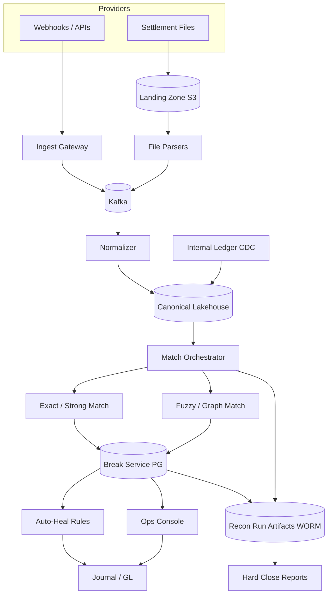
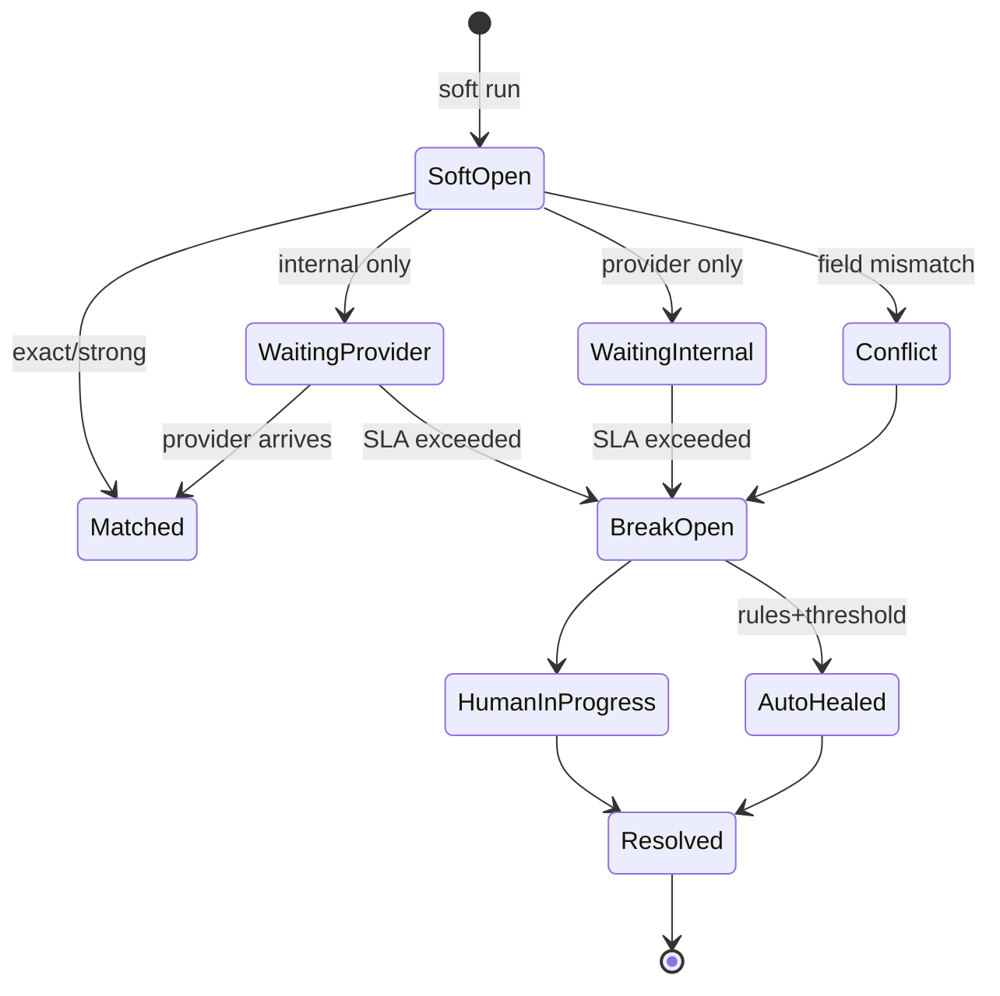

# System Design: Data Reconciliation Between Multiple Providers

> **Focus areas:** Multi-source truth · Matching · Diff · Healing · SLAs · Money accuracy · Audit  
> **Style:** End-to-end product design with progressive scale (10× → 100× → 1,000×)  
> **Quality bar:** Correct arithmetic, explicit invariants, honest MVP vs extreme-scale paths, failure-first reasoning  
> **Interview theme:** Fintech / marketplace / payments-ops — reconcile divergent provider ledgers safely

---

## Table of Contents

1. [Clarify Requirements (Interview Q&A)](#1-clarify-requirements-interview-qa)
2. [Back-of-the-Envelope Estimation](#2-back-of-the-envelope-estimation)
3. [High-Level Design](#3-high-level-design)
4. [Architecture Diagram](#4-architecture-diagram)
5. [Design Deep Dive](#5-design-deep-dive)
6. [Wrap-Up](#6-wrap-up)
7. [Deeper / Related Interview Questions](#7-deeper--related-interview-questions)

---

## 1. Clarify Requirements (Interview Q&A)

The goal is to **detect, explain, and resolve discrepancies** between our system of record and one or more external providers (PSPs, banks, carriers, marketplaces, inventory partners).

### 1.0 What this is / is not

| Dimension | This is | This is not |
|-----------|---------|-------------|
| Job | Compare datasets across sources; produce breaks + heal paths | Real-time payment authorization |
| Output | Recon reports, break tickets, optional auto-heal | Trading matching engine |
| Cadence | Near-real-time streams **and** daily hard close | Only ad-hoc spreadsheet diffs |
| Criticality | Money / inventory correctness | Best-effort analytics dashboard |
| Users | Finance ops, risk, platform eng | End-shopper checkout UI |

### 1.1 Functional Requirements

| # | Question to ask | Expected / typical interviewer answer | Design implication |
|---|-----------------|----------------------------------------|--------------------|
| F1 | What entities reconcile? | Payments, refunds, payouts, fees; optionally inventory/shipments | Entity-type plugins with shared framework |
| F2 | Who is source of truth? | **Provider** for settlement cash; **us** for customer-facing ledger; breaks when they diverge | Explicit SoT policy per field |
| F3 | Matching key? | `provider_txn_id`, `idempotency_key`, amount+time fuzzy fallback | Deterministic matchers + probabilistic second stage |
| F4 | Cadence? | Continuous ingest + T+0/T+1 batch close | Lambda architecture: stream alerts + batch truth |
| F5 | Auto-heal allowed? | Narrow rules (fee adjustments, late captures); human for large breaks | Rules engine + approval thresholds |
| F6 | Providers? | 3–10 PSPs/banks initially; more later | Provider adapters; normalized canonical model |
| F7 | Partial vs full files? | Mix of webhooks, APIs, settlement files | Ingestion connectors with watermarking |
| F8 | Historical restatement? | Yes — provider revises files | Versioned snapshots; recon runs are immutable |
| F9 | Multi-currency / FX? | Yes | Store amounts in minor units + FX rate snapshot |
| F10 | Audit / evidence? | Regulators / auditors need explainability | Immutable recon run artifacts + lineage |
| F11 | Break workflow? | Ticket → assign → resolve → post journal | Case management integration |
| F12 | SLA? | 99% of volume matched within 15m; hard close by 10:00 local | Separate latency SLOs for soft vs hard recon |
| F13 | Netting / aggregation? | Settlement often nets many txns | Match at txn grain and settlement-batch grain |
| F14 | Idempotent replays? | Files re-delivered often | Content-addressed ingest + run keys |

**MVP functional scope:**

1. Ingest provider events/files into a **normalized canonical store**.
2. Ingest internal ledger/postings for the same entities.
3. Run **matchers** (exact → strong → fuzzy) producing matched / unmatched / conflict.
4. Emit **breaks** with evidence diffs; dashboard + export.
5. Support **manual resolution** with audit trail.
6. Narrow **auto-heal** for known fee/timing classes under thresholds.
7. Daily **hard close** recon with signed report.

**Out of MVP:**

- Fully autonomous heal of all break types
- Real-time global FX trading optimization
- Replacing the general ledger
- Cross-company multilateral netting clearinghouse
- ML-only matching without deterministic layer

### 1.2 Non-Functional Requirements

| # | Question | Expected answer | Target |
|---|----------|-----------------|--------|
| N1 | Soft recon latency | Stream path | p95 break detection < 5–15 min |
| N2 | Hard close | Finance | Complete by agreed cutoff daily |
| N3 | Availability | Ops critical at close | 99.9% recon control plane |
| N4 | Durability | Evidence forever (policy) | WORM / immutable object versions |
| N5 | Consistency | Recon runs deterministic | Same inputs → same break set |
| N6 | Accuracy | False match near-zero for money | Prefer false breaks over silent wrong match |
| N7 | Multi-region | Active control in home; DR | Home-region batch drivers |
| N8 | Security | PCI / SOC2 evidence | Least privilege; tokenize PANs; encrypt |
| N9 | Cost | File parse + warehouse dominate | Columnar storage; prune; incremental |

### 1.3 Cases

**Happy paths**

1. Provider webhook + our capture match on `provider_txn_id` + amount → auto-match.
2. Settlement file nets 10K txns → batch matcher closes against internal settlement expectation.
3. Late capture arrives next day → reopen soft break; resolve on T+1.
4. Fee line missing internally → auto-heal posts fee journal under $threshold.
5. Ops resolves amount mismatch → posts adjustment; break closed with evidence.

**Edge / failure cases**

| Case | Behavior |
|------|----------|
| Same amount, different ids (duplicate pay) | Do not fuzzy-match solely on amount+time; require stronger signals |
| Provider revises settlement | New file version; new recon run; never mutate old run |
| Clock skew / timezone | Normalize to UTC; settlement date per provider rules |
| Partial file upload | Reject or quarantine; watermark incompleteness |
| Split tender / partial capture | Match graph: one payment ↔ many captures |
| Currency mismatch | Break; never silent convert without rate source |
| Missing internal row (bug) | Break type `INTERNAL_MISSING`; page owning service |
| Missing provider row (delay) | Soft wait window; escalate after SLA |
| Auto-heal storm | Circuit breaker on heal rate; freeze heals |
| Giant merchant spike | Shard by merchant/provider; prioritize close path |

### 1.4 Scales (Progressive)

| Metric | Baseline | 10× | 100× | 1,000× |
|--------|----------|-----|------|--------|
| Txns/day | 5M | 50M | 500M | 5B |
| Providers | 5 | 15 | 50 | 200 |
| Peak ingest events/s | 2K | 20K | 200K | 2M |
| Breaks/day (open) | 5K | 50K | 300K | 1M+ (automation must rise) |
| Settlement files/day | 50 | 200 | 2K | 20K |
| Hard close datasets | ~50 GB | 500 GB | 5 TB | 50 TB |
| Ops agents | 20 | 40 | 100 | 200 (automation-heavy) |
| Recon runs/day | 200 | 1K | 5K | 20K |

**What each jump forces:**

- **10×:** Move matching from app-DB joins to warehouse / Spark; indexed canonical store.
- **100×:** Incremental recon windows; sharded match workers; auto-heal coverage >80% of volume.
- **1,000×:** Domain partitioning (payments vs payouts vs inventory); feature store for match scores; human only on exception tails.

### 1.5 Etc.

- **Accounting basis?** Accrual vs cash — define per product.
- **GL posting?** Recon proposes; GL service commits.
- **Retention?** 7 years financial evidence typical.
- **Build vs buy?** Framework in-house; connectors pluggable.

**Scope repeat-back:**

> Design a **multi-provider data reconciliation platform**: normalize internal + provider data, match deterministically (then carefully fuzzy), surface breaks with evidence, support controlled auto-heal and human resolution, and produce immutable hard-close reports—from 5M txns/day to 1,000×.

---

## 2. Back-of-the-Envelope Estimation

### 2.1 Volume math

```text
Baseline: 5M txns/day ≈ 58 txns/s average, ~500–800/s peak (10–15×)
Canonical row ~500B–1KB with indexes → 5M × 1KB = 5 GB/day raw

100×: 500M/day → 500 GB/day raw; with 90d hot ≈ 45 TB (+ parquet compression 3–5× → ~10 TB)
1,000×: 5B/day → plan lakehouse from day 0 mentally even if MVP is smaller
```

### 2.2 Matching cost

```text
Exact match: O(n) hash join on provider_txn_id
Naive pairwise fuzzy: O(n²) → forbidden

Windowed fuzzy: for unmatched, probe ±Δt and ±ε amount within merchant shard
If 1% unmatched = 50K/day baseline; each probes 20 candidates → 1M comparisons (fine)
At 1,000×: 50M unmatched × 20 = 1B comparisons → need blocking keys + ML pruning
```

### 2.3 Load classes

| Class | What | Baseline | 1,000× | Plane |
|-------|------|----------|--------|-------|
| A | Webhook ingest | 2K/s | 2M/s | Stream |
| B | File ingest | bursty | multi-GB/s | Batch |
| C | Exact match workers | continuous | sharded | Compute |
| D | Fuzzy match | on residual | heavy | Compute |
| E | Break API / UI | hundreds QPS | thousands | OLTP |
| F | Evidence object store | GB/day | TB/day | Storage |

### 2.4 Bandwidth

```text
Settlement file 2 GB compressed × 50/day = 100 GB/day ingress baseline
100× → ~10 TB/day — regional landing zones + parallel parse
```

### 2.5 Ops capacity

```text
If humans resolve 5 min/break and 5K breaks/day → 25K minutes ≈ 52 FTE-days
→ Must auto-resolve / auto-heal most volume; humans on $ and risk tails
```

---

## 3. High-Level Design

### 3.1 Canonical model

```text
CanonicalTransaction {
  recon_entity_id,      # internal stable id
  entity_type,          # payment | refund | payout | fee | shipment
  provider_code,
  provider_txn_id,
  merchant_id,
  amount_minor,
  currency,
  status,
  event_time,
  settlement_date,
  fingerprint,          # hash of normalized fields
  raw_refs[],           # pointers to raw payloads
  version
}

ReconRun {
  run_id, scope, window_start/end, mode (soft|hard),
  input_snapshots[], matcher_versions, status, stats
}

Break {
  break_id, run_id, type, left_ref, right_ref,
  severity, amount_delta, state, assignee, evidence[]
}
```

### 3.2 Matching stages

| Stage | Rule | Output |
|-------|------|--------|
| 0 Blocking | `(provider, merchant, settlement_date)` | Candidate universe |
| 1 Exact | `provider_txn_id` equal | MATCH |
| 2 Strong | idempotency_key / ARN / RRN equal | MATCH |
| 3 Amount+time | same amount, Δt < T, unique in block | MATCH_REVIEW or auto if high confidence |
| 4 Graph | 1:N captures/refunds | MATCH_COMPLEX |
| 5 Residual | unmatched | BREAK |

**Deal-breaker:** fuzzy amount+time as first stage — creates silent wrong matches under duplicates.

### 3.3 SoT policy matrix

| Field | SoT | On conflict |
|-------|-----|-------------|
| Settled cash movement | Provider settlement | Adjust internal clearing |
| Customer-visible status | Internal ledger | Investigate; don’t blindly flip |
| Interchange fee | Provider | Auto-post fee if within policy |
| FX rate | Agreed rate card / provider | Break if outside tolerance |

### 3.4 APIs

| Method | Path | Purpose |
|--------|------|---------|
| POST | `/ingest/webhooks/{provider}` | Normalized ingress |
| POST | `/ingest/files` | Register landed file |
| POST | `/recon/runs` | Trigger soft/hard run |
| GET | `/recon/runs/{id}` | Status + stats |
| GET | `/breaks` | Query/filter |
| POST | `/breaks/{id}/resolve` | Human resolution |
| POST | `/breaks/{id}/heal` | Apply allowed heal |
| GET | `/reports/hard-close/{date}` | Immutable report |

### 3.5 Components

```text
Provider Adapters → Landing Zone (S3) + Stream (Kafka)
       ↓
Normalizer / Schema Registry
       ↓
Canonical Store (Lakehouse tables + OLTP for open breaks)
       ↓
Match Orchestrator → Exact / Strong / Fuzzy / Graph workers
       ↓
Break Service → Case mgmt + Auto-Heal Rules
       ↓
Journal / GL adapter (post adjustments)
       ↓
Reporting + Evidence WORM store
```

### 3.6 Option analysis

#### A. Where to match

| Option | Pros | Cons | Deal-breaker |
|--------|------|------|--------------|
| **Warehouse/Spark SQL** | Scales joins | Higher latency | Sub-minute soft recon only here |
| Stream join (Flink) | Fast alerts | State heavy; hard close still batch | Using only stream for financial close |
| OLTP nested loops | Simple | Dies at 10× | 50M/day joins in Postgres |

**Choice:** Stream for soft alerts on exact keys; batch lakehouse for hard close + fuzzy residuals.

#### B. Break store

| Option | Pros | Cons | Deal-breaker |
|--------|------|------|--------------|
| **Postgres** | Workflow, locks | Hot at huge open breaks | Billions of open rows |
| Cassandra | Scale | Poor workflow queries | Complex case joins |
| Hybrid | Lake for history; PG for open | Sync cost | — |

**Choice:** Postgres for open breaks + workflow; Parquet history of all runs.

#### C. Auto-heal

| Option | Pros | Cons | Deal-breaker |
|--------|------|------|--------------|
| Rules engine | Explainable | Coverage limits | Opaque ML heal for money without caps |
| Human only | Safe | Won’t scale | 100× volume |
| Hybrid thresholds | Balanced | Need tuning | Unlimited auto amount |

### 3.7 Trade-offs

| Decision | Choose | Why |
|----------|--------|-----|
| Prefer false breaks | Yes | Silent wrong match = money loss / audit fail |
| Immutable runs | Yes | Restatements create new runs |
| Incremental windows | Yes at 10×+ | Full re-scan cost explodes |
| Provider adapters | Pluggable | New PSP weekly at scale |

---

## 4. Architecture Diagram





---

## 5. Design Deep Dive

### 5.1 Reliability

#### 5.1.1 Ingest correctness

- Content-hash files; `INSERT` raw immutable; parse to versioned canonical.
- Webhook idempotency by provider event id.
- Watermarks: `provider_max_event_time` vs `file_sequence`.

#### 5.1.2 Deterministic recon runs

```text
run_key = hash(scope, window, input_snapshot_ids, matcher_semver, config)
```

Re-running with same inputs yields same breaks (except open workflow state transitions).

#### 5.1.3 Healing safety

| Control | Rule |
|---------|------|
| Amount cap | e.g. ≤ $25 or ≤ 1% |
| Type allowlist | fees, FX pennies, late status |
| Rate limit | max heals/min/provider |
| Kill switch | global freeze |
| Dual control | above $X needs two approvers |

#### 5.1.4 Failure modes

| Failure | Mitigation |
|---------|------------|
| Parser bug silently wrong amounts | Contract tests; checksum totals vs file trailer |
| Matcher false positive | Shadow mode; canary merchants |
| GL post succeeds, break not closed | Outbox + idempotent resolve |
| Clock across regions | Settlement date from provider field, not ingest time |

### 5.2 Scalability

#### 5.2.1 Sharding

```text
Shard key = hash(provider_code, merchant_id)  # preserves match locality
Hard close: parallel tasks per shard → rollup controller
```

#### 5.2.2 Incremental recon

- Maintain `matched_set` watermark per shard.
- New events only rematch residuals + impacted keys.
- Nightly full recompute for audit sampling (1%).

#### 5.2.3 Scale jumps

| Jump | Architecture move |
|------|-------------------|
| 10× | Lakehouse joins; break PG; stream exact |
| 100× | Sharded orchestrator; auto-heal majority; feature scoring |
| 1,000× | Domain cells; provider-specific fleets; exception-only humans |

#### 5.2.4 Storage tiers

| Tier | Data | TTL |
|------|------|-----|
| Hot PG | Open breaks | until closed + 30d |
| Warm lake | Canonical txns | 90–180d |
| Cold | Parquet + evidence | 7y |

### 5.3 Maintainability

#### 5.3.1 Observability

- Match rate %, break aging, $ exposed, heal rate, parser failures.
- Per-provider SLO dashboards.
- Lineage: break → canonical rows → raw object URIs.

#### 5.3.2 Matcher versioning

Semantic version matchers; recon run records version; A/B shadow compare on % traffic.

#### 5.3.3 Multi-tenant / multi-merchant

- Merchant-level isolation for noisy breaks.
- Priority queues for strategic merchants near close.

#### 5.3.4 Migrations

Adding a provider: adapter + mapping tests + parallel run vs finance spreadsheet before cutover.

---

## 6. Wrap-Up

### 6.1 Decisions

| Area | Choice |
|------|--------|
| Architecture | Stream soft + batch hard close |
| Matching | Exact/strong first; fuzzy last with blocking |
| Safety | Prefer false breaks; capped auto-heal |
| Evidence | Immutable runs + WORM artifacts |
| Scale | Shard by provider+merchant; lakehouse compute |

### 6.2 Phased rollout

1. One provider, exact match, manual breaks.
2. Settlement files + fees auto-heal.
3. Multi-provider + fuzzy residuals + hard close automation.
4. Cells, ML ranking of candidates (not silent auto without rules).

### 6.3 One-liner

> **Normalize → match carefully → break loudly → heal narrowly → close immutably.**

---

## 7. Deeper / Related Interview Questions

**Q1. Why not only SQL `FULL OUTER JOIN` daily?**  
Works at small scale; fails on revisions, 1:N graphs, soft realtime, and ops workflow. Still use joins inside hard close.

**Q2. How do you prevent amount+time false matches?**  
Require uniqueness in blocking key; add secondary tokens (last4, auth code); otherwise leave as break.

**Q3. Provider is eventually consistent — how long to wait?**  
Soft window per event type (captures vs refunds); escalate by severity and $.

**Q4. How do you reconcile netted settlement to gross txns?**  
Two grains: allocate settlement batch to txn set via provider references; break on residual cents with fee lines.

**Q5. Idempotent file re-delivery?**  
Raw object keyed by checksum; parse jobs keyed by `(provider, file_id, version)`.

**Q6. Consistent hashing for shards?**  
Yes for worker assignment; include merchant affinity so related txns co-locate.

**Q7. Indexing for break search?**  
`(state, provider, settlement_date)`, `(merchant_id, state)`, GIN on attributes; archive closed to lake.

**Q8. Memory blowup on fuzzy?**  
Never load all unmatched globally; process per block; cap candidate lists.

**Q9. Load balancer concerns?**  
Stateless ingest/API behind LB; match workers pull shards from queue (no sticky needed).

**Q10. Exactly-once heal posts?**  
Idempotency key = `break_id + heal_version` into journal.

**Q11. Multi-currency penny breaks?**  
Tolerance table per currency; FX using frozen rate snapshot from trade time.

**Q12. How to audit a closed break?**  
Evidence pack: raw refs, canonical fingerprints, matcher version, user actions, journal ids.

**Q13. Stream-only recon for money close?**  
Risky; batch hard close with frozen snapshots remains source for sign-off.

**Q14. When is ML appropriate?**  
Candidate ranking / prioritization; not sole authority for auto-post without deterministic gates.

**Q15. DR strategy?**  
Replicate lake + break DB async; recon compute stateless; RPO minutes for ops, zero for evidence objects (multi-AZ).

**Q16. Hot merchant skew?**  
Dedicated shards; parallelize by sub-account; priority close lane.

**Q17. Schema evolution of provider files?**  
Versioned parsers; fail closed on unknown mandatory columns; trailer totals must match.

**Q18. Conflict: internal success vs provider decline late?**  
Break type `STATUS_DIVERGENCE`; product policy may refund customer; recon doesn’t invent policy.

**Q19. Data structures for graph match?**  
Bipartite matching within block; Union-Find for linked refunds/captures; size-cap graphs.

**Q20. Cost control?**  
Incremental windows; compress Parquet; lifecycle cold storage; sample full recompute.

**Q21. Security of webhook ingest?**  
mTLS / signatures; replay protection; PII tokenization before lake if needed.

**Q22. How does this differ from ETL validation?**  
Recon is adversarial multi-SoT with money workflow; DQ checks are single-pipeline invariants.

**Q23. Deal-breaker designs?**  
Mutating historical runs; unbounded auto-heal; fuzzy-first matching; Postgres as sole 5B/day join engine.

**Q24. Prioritizing breaks for humans?**  
$ impact × risk × age × merchant tier; suppress noise clusters.

**Q25. Testing strategy?**  
Golden provider fixtures; property tests on matcher determinism; chaos delayed webhooks; reconciliation of totals.

**Q26. Linking to ledger design?**  
Double-entry remains SoT internally; recon proposes compensating entries, never silent balance rewrite.

**Q27. Multi-region providers?**  
Partition by `provider_region`; UTC normalize; settlement calendars per locale.

**Q28. What if ops closes wrong?**  
Reopen with new break linked to prior; dual control on large $; immutable audit.

---

*End of doc — data reconciliation between multiple providers.*

## Appendix — Deep dive notes for Data reconciliation between multiple providers

### Hardest invariants
- Define the correctness property that must not break under retries, partial failures, or overload.
- Define multi-tenant isolation boundaries if applicable.
- Define delete/TTL/privacy semantics across primary + cache + search + logs.

### Likely bottlenecks
1. Hot keys / hot partitions for core entity ids
2. Synchronous dependency latency tails (p99)
3. Write amplification from secondary indexes / fanout
4. Compaction / GC / backfill stealing cluster IO
5. Cross-region chatty patterns

### Suggested metrics (RED + business)
| Metric | Why |
|--------|-----|
| Request rate / error / duration | Golden signals |
| Saturation (CPU, pool, queue lag) | Leading indicator |
| Idempotency conflict rate | Client retry health |
| Cache hit ratio | Origin protection |
| Business SLI for Data reconciliation between multiple providers | Product truth |

### Migration & rollout
- Expand/contract schema changes
- Dual-write or shadow reads for store migrations
- Feature-flagged cutover; canary on error budget
- Backfill with checkpoints and replayable logs

### What interviewers poke next
- Memory footprint of your cache/index choice
- Exact concurrency control (locks vs OCC vs ledger)
- Cost model at 100×
- Abuse cases unique to Data reconciliation between multiple providers

## Appendix A — Interview execution checklist

1. **Repeat scope** in one sentence; list out-of-scope.
2. **Write NFRs as numbers** (QPS, p99, RPO/RTO).
3. **Draw** clients → edge → svc → store → async.
4. **Call the hardest invariant** early.
5. **Pick consistency** deliberately; do not say “strong everywhere.”
6. **Show scale jumps** at 10× / 100× / 1,000× with architecture changes.
7. **Name failure modes** and degraded behavior.
8. **Close** with metrics, rollout, and residual risks.

## Appendix B — Trade-off flashcards

| Topic | Prefer | Avoid |
|-------|--------|-------|
| Sync vs async | Sync for money/authz ack | Sync for fanout/email/indexing |
| SQL vs KV | Multi-row invariants | Ultra-high simple point ops |
| Cache | Read-heavy + tolerable stale | Incorrect money reads |
| Queue | Spike absorb + retry | Hidden request/response bus |
| Multi-region | Home cell single-writer | Multi-writer without merge rules |

## Appendix C — Reliability patterns to name drop correctly

- Idempotency keys + request hash
- Outbox / transactional messaging
- Leases + fencing tokens
- Quorum / consensus (Raft) for coordination—not for every data path
- Bulkheads + circuit breakers + deadlines
- Load shedding + admission control
- Canary + automatic rollback on SLO burn
- Backup restore drills (backup ≠ restore tested)

## Appendix D — Scalability patterns

- Consistent hashing with virtual nodes
- Hierarchical sharding (cell → shard → partition)
- CQRS / projections for read models
- Hot-key splitting and salting
- Tiered storage + compaction budgets
- Consumer parallelization by partition
- Edge caching with purge/surrogate keys

## Appendix E — Sample capacity dialogue

```text
Interviewer: Assume 10M DAU.
You: 10M DAU × 5 key actions/day ≈ 50M events/day ≈ 580 QPS avg.
Peak 15× ⇒ ~9K QPS. With 70% cache hit on reads, origin ~2.7K QPS.
At 100×, origin ~270K QPS ⇒ shard + edge mandatory.
```

Customize the action rate to this problem; do not reuse social-feed numbers for a ledger.


*Enriched for interview drill · `data-reconciliation`*
