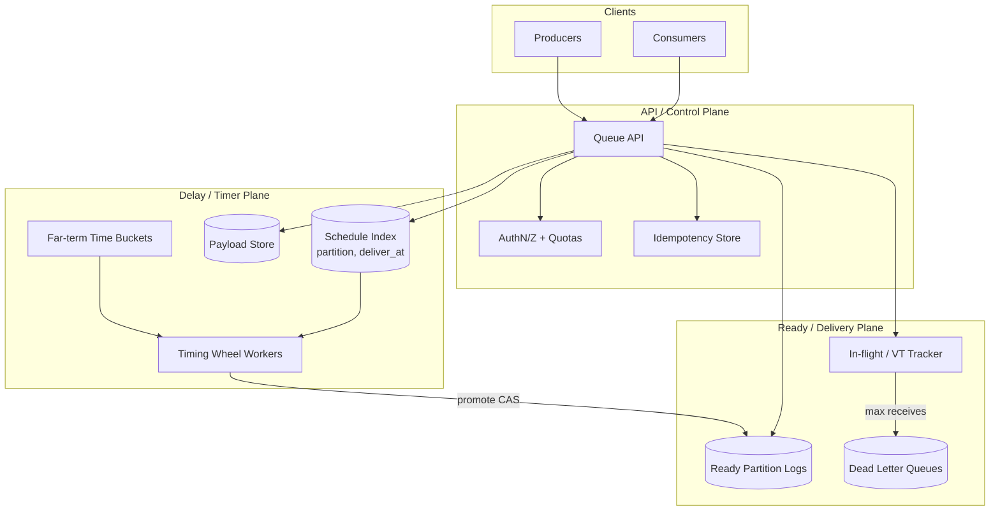
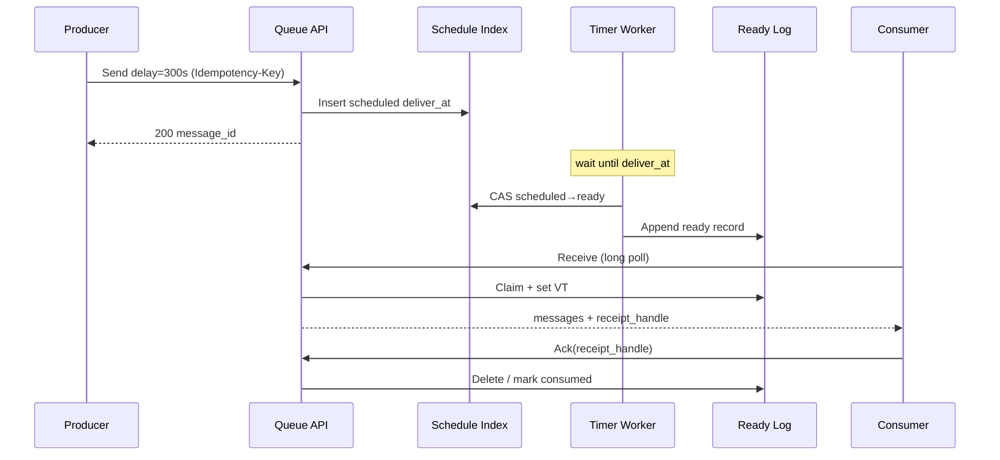
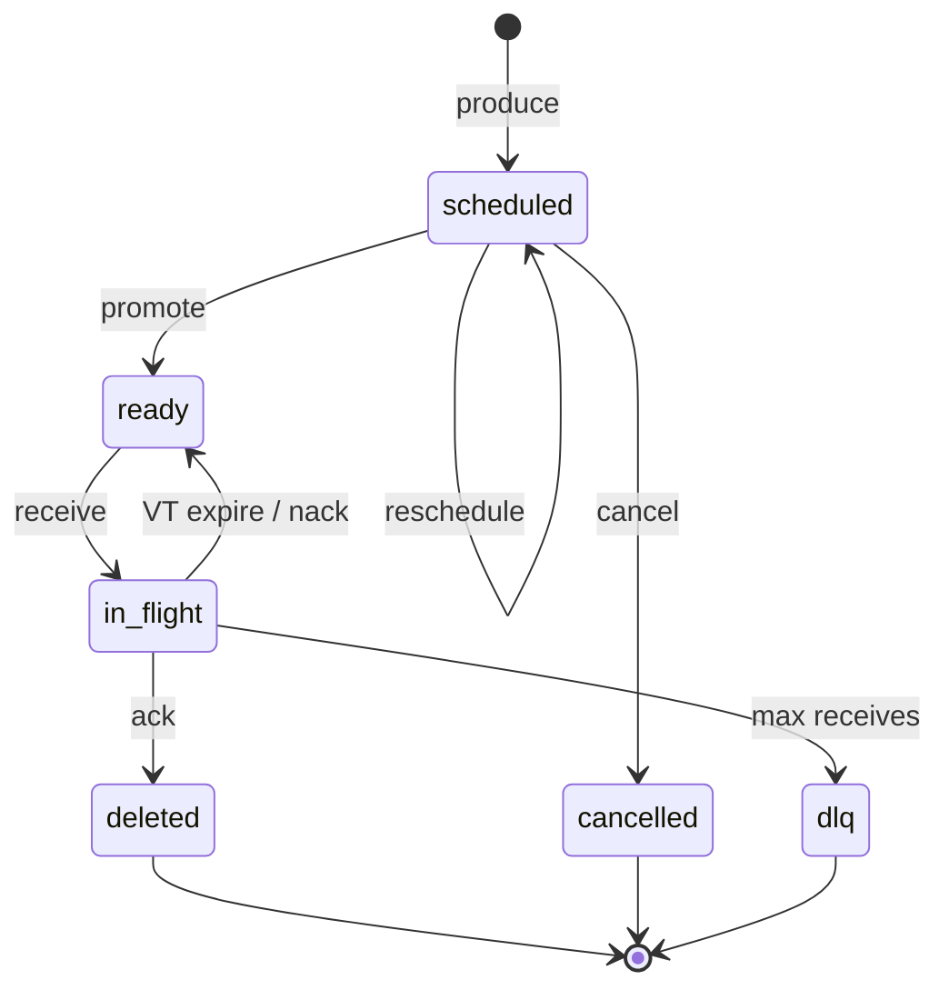

# System Design: Delayed / Scheduled Message Queue

> **Focus areas:** Delay timers · Time-bucketed indexes · Visibility timeouts · At-least-once delivery · Partitioning · Clock skew · Cancel/reschedule · Hot partitions  
> **Style:** End-to-end product design with progressive scale (10× → 100× → 1,000×)  
> **Interview theme:** Build a queue that can **hold messages until a future time**, then deliver reliably—like SQS DelayQueue / RabbitMQ delayed messages / Kafka + timer service hybrid

---

## Table of Contents

1. [Clarify Requirements (Interview Q&A)](#1-clarify-requirements-interview-qa)
2. [Back-of-the-Envelope Estimation](#2-back-of-the-envelope-estimation)
3. [High-Level Design](#3-high-level-design)
4. [Architecture Diagram](#4-architecture-diagram)
5. [Design Deep Dive](#5-design-deep-dive)
6. [Wrap-Up](#6-wrap-up)
7. [Deeper / Related Interview Questions](#7-deeper--related-interview-questions)

---

## 1. Clarify Requirements (Interview Q&A)

Goal: design a **delayed / scheduled message queue**—producers enqueue messages with `deliver_at` (or `delay_seconds`); the system stores them until due; consumers receive them with standard queue semantics (visibility timeout, ack/nack, retries, DLQ).

### 1.0 What this is / is not

| Dimension | This doc | Not this |
|-----------|----------|----------|
| Job | Time-delayed message delivery with queue semantics | Full workflow DAG engine |
| Scheduling | Absolute/relative delay per message | Complex cron calendars (see distributed-cron) |
| Consumer model | Pull (or push-to-ready-queue) with VT | Exactly-once business effects without consumer help |
| Durability | Messages survive broker restarts | In-memory-only toy timer |
| Scope | Platform primitive used by reminders, retries, schedulers | End-user notification product UI |

### 1.1 Functional Requirements

| # | Question to ask | Expected / typical interviewer answer | Design implication |
|---|-----------------|----------------------------------------|--------------------|
| F1 | Delay model? | Relative `delay_seconds` and/or absolute `deliver_at` (UTC) | Store `deliver_at` as SoT; normalize on produce |
| F2 | Max delay? | Days–weeks (e.g. 15 min default product, up to 30 days) | Time-bucket / hierarchical timer; not only heap-in-RAM |
| F3 | Delivery guarantee? | **At-least-once** after due time; consumer idempotency required | Visibility timeout + redelivery; no false "exactly-once" |
| F4 | Ordering? | Per-partition / per-key best-effort; not global | Shard by `partition_key` hash |
| F5 | Cancel / reschedule? | Yes—by `message_id` before delivery | Mutable schedule index + tombstone/cancel flag |
| F6 | Payload size? | Up to ~256 KB–1 MB; larger → object store pointer | Inline vs external body |
| F7 | Consumer API? | Pull `ReceiveMessage` with VT; ack/delete; change VT | Classic SQS-like surface |
| F8 | Ready queue? | When due, message becomes receivable like normal queue | Dual-plane: timer plane + ready queue plane |
| F9 | Multi-tenant? | Many producers/topics/queues; fair isolation | Quotas per queue/tenant; noisy-neighbor controls |
| F10 | DLQ? | After N receives / max age | Redrive policy |
| F11 | Priority? | Optional; MVP FIFO-by-due-time within partition | Separate priority lanes later |
| F12 | Clock source? | Server UTC; producer clock not trusted | Reject past-skew beyond window; clamp |
| F13 | Push vs pull? | Pull MVP; optional push webhook later | Ready-queue consumers dominate |
| F14 | Dedup on produce? | Idempotency-Key for produce | Dedup table TTL |

**MVP functional scope:**

1. Create queue with retention, max delay, VT default, max receives.
2. `SendMessage` with `delay_seconds` or `deliver_at` + payload + optional `deduplication_id`.
3. Persist message durably **before** ACK to producer.
4. When `now >= deliver_at`, message becomes visible for `ReceiveMessage`.
5. Visibility timeout: invisible until ack or VT expires → redeliver.
6. `DeleteMessage` / ack; `ChangeMessageVisibility`.
7. Cancel / update delay for not-yet-delivered messages.
8. DLQ after max receives; basic metrics (approx age of oldest delayed, ready depth).

**Out of MVP:**

- Exactly-once end-to-end effects
- Global total order across partitions
- Complex cron / calendar RRULE (separate problem)
- Cross-region active-active same queue writes
- Transactional outbox built-in (document as pattern)
- Message browsing UI beyond admin APIs

### 1.2 Non-Functional Requirements

| # | Question | Expected answer | Target |
|---|----------|-----------------|--------|
| N1 | Produce latency? | Fast ACK after durable write | p99 < 20–50ms in region |
| N2 | Delay accuracy? | Fire soon after due | p99 lateness < 1s baseline; < 5s under load; SLO-defined |
| N3 | Availability? | Core infra | 99.99% produce/receive in multi-AZ |
| N4 | Durability? | No silent loss after produce ACK | Quorum / fsync policy explicit |
| N5 | Consistency? | At-least-once after due; cancel before due is best-effort race | Document cancel races |
| N6 | Multi-region? | Home region writer; DR replica | Optional async DR |
| N7 | Security? | AuthN/Z per queue; encrypt payloads | KMS CMK; TLS |
| N8 | Cost? | Holding millions of delayed msgs cheap | Cold delay store + hot ready path |

### 1.3 Cases (User Flows & Edge Cases)

**Happy paths**

1. Produce with `delay=300s` → durable → timer → ready → receive → process → delete.
2. Produce with `deliver_at` tomorrow → cancel before due → never delivered.
3. Reschedule: update `deliver_at` while `scheduled` → new timer slot.
4. Consumer slow: VT expires → another consumer receives → idempotent handler.
5. Poison message: max receives → DLQ → alarm.

**Edge / failure cases**

| Case | Behavior |
|------|----------|
| Producer retries send | Idempotency-Key → same `message_id` |
| Clock skew (producer ahead) | Clamp `deliver_at` to `[now-ε, now+max_delay]` |
| Broker crash after write before ACK | Producer retries; dedup |
| Timer worker crash mid-promote | Promote is idempotent CAS `scheduled→ready` |
| Duplicate promote | Ready enqueue uses message_id uniqueness |
| Cancel vs promote race | CAS on status; loser no-ops; may rare deliver-after-cancel → consumer checks cancel token |
| Hot `deliver_at` (midnight stampede) | Jitter + time buckets + partition spread |
| Huge backlog past due | Catch-up workers; prioritize oldest; shed/alert |
| Payload too large | Reject or externalize body |
| Consumer never acks | VT loop until max receives → DLQ |
| Partition hot key | Hash + salt; tenant fair share |
| DST / timezone | Store UTC only; API accepts offset, converts |

### 1.4 Scales (Progressive)

| Metric | Baseline | 10× | 100× | 1,000× |
|--------|----------|-----|------|--------|
| Queues | 1K | 10K | 100K | 1M |
| Produce QPS (all) | 5K | 50K | 500K | 5M |
| Delayed msgs held | 50M | 500M | 5B | 50B |
| Due promotions / s (peak) | 2K | 20K | 200K | 2M |
| Ready receive QPS | 3K | 30K | 300K | 3M |
| Avg payload | 2 KB | 2 KB | 2–4 KB | 2–4 KB |
| Max delay | 30d | 30d | 30d | 90d |
| Partitions / queue (typ) | 16 | 64 | 256 | 1024+ |
| Timer workers | 10 | 50 | 200 | 2K |
| Storage (payloads) | ~100 TB | ~1 PB | ~10 PB | ~100 PB |

**What each jump forces:**

- **10×:** Separate delay index from payload store; dedicated timer workers; per-queue partitions.
- **100×:** Time-bucket sharding; hierarchical timing wheels / bucket scans; ready-queue log (Kafka/SQS-like); tenant isolation.
- **1,000×:** Cell architecture; delay-tier compaction; approx stats; stampede dampening; multi-region home cells.

### 1.5 Etc. (Constraints & Assumptions)

- Single primary cloud, multi-AZ.
- Consumers are external services; must be idempotent.
- Not a substitute for a job scheduler with heartbeats/leases for long-running work—this is **message delivery**.
- Wall clock UTC; NTP required on hosts.

**Scope statement to repeat back:**

> Design a multi-tenant delayed/scheduled message queue: durable produce with `deliver_at`, accurate promotion to a ready queue, SQS-like receive with visibility timeout and at-least-once delivery, cancel/reschedule, DLQ—scaling from tens of millions to tens of billions of held messages with progressive partitioning and timer architecture.

---

## 2. Back-of-the-Envelope Estimation

### 2.1 Traffic

```text
Baseline produce 5K QPS × 2 KB ≈ 10 MB/s ingress
Peak 3–5× ⇒ 30–50 MB/s

Promotions 2K/s: each = status CAS + ready enqueue
Receive 3K/s with VT updates
```

At **1,000×:** produce 5M QPS is a full messaging platform—cells + many clusters.

### 2.2 Storage

```text
50M delayed × (2 KB payload + 200 B index) ≈ 110 GB raw
With 3× replication + indexes ≈ 0.5–1 TB

1,000×: 50B × 2.2 KB ≈ 110 PB raw → compression, tiering, external bodies mandatory
```

**Split storage classes:**

| Class | Contents | Store |
|-------|----------|-------|
| Schedule index | `message_id`, `deliver_at`, `partition`, status | Sorted by `(partition, deliver_at, id)` |
| Payload | Body + attrs | Blob / row store keyed by id |
| Ready log | Deliverable messages | Partitioned queue log |
| Dedup | Idempotency keys | TTL KV (24–48h) |

### 2.3 Timer scan cost

Naive: `SELECT * WHERE deliver_at <= now` every second on one table → death.

```text
Time buckets of 1s (or 1s near-term, 1m mid, 1h far):
Workers own shard of (partition_range × bucket)
Each tick: claim due bucket → promote batch (100–1000 msgs)
```

### 2.4 Memory

```text
In-memory timing wheel for next T seconds (e.g. 60–300s) per worker:
2K due/s × 300s × 64 B handle ≈ 40 MB / worker  (handles only)
Payloads stay on disk until promote/receive
```

### 2.5 Bandwidth & amplification

Promote write amplification: index update + ready append + optional payload touch ≈ 2–4× payload size per firing.

### 2.6 Hot keys / midnights

If 10% of messages schedule `deliver_at` on hour boundaries:

```text
200K promotions/s spike for a few seconds → need jitter (±1–5s) and bucket fan-out
```

---

## 3. High-Level Design

### 3.1 Core Domain Model

```text
Tenant
 └── Queue
      ├── Config { retention, max_delay, default_vt, max_receive, delay_jitter }
      ├── Partition[0..N)
      │     ├── DelayIndex  (sorted deliver_at)
      │     └── ReadyLog    (visible messages)
      └── Message
            ├── message_id
            ├── payload_ref
            ├── deliver_at
            ├── status: scheduled | ready | in_flight | deleted | dlq | cancelled
            ├── receive_count
            ├── visible_after   # VT
            ├── produced_at
            └── dedup_id?
```

**State machine:**

```text
scheduled --(promote)--> ready --(receive)--> in_flight
                              ^                    |
                              |---(VT expire)------|
                              |
                         (nack/retry)
in_flight --(delete)--> deleted
in_flight --(max receive)--> dlq
scheduled --(cancel)--> cancelled
scheduled --(reschedule)--> scheduled (new deliver_at)
```

### 3.2 API Shape

| Method | Path | Purpose |
|--------|------|---------|
| PUT | `/v1/queues/{queue}` | Create/update config |
| POST | `/v1/queues/{queue}/messages` | Send (delay / deliver_at) |
| POST | `/v1/queues/{queue}/messages:batch` | Batch send |
| POST | `/v1/queues/{queue}/receive` | Long-poll receive |
| POST | `/v1/queues/{queue}/messages/{id}/ack` | Delete / ack |
| POST | `/v1/queues/{queue}/messages/{id}/visibility` | Change VT |
| POST | `/v1/queues/{queue}/messages/{id}/cancel` | Cancel if not consumed |
| POST | `/v1/queues/{queue}/messages/{id}/reschedule` | Update deliver_at |
| GET | `/v1/queues/{queue}/stats` | Approx depths / oldest age |

**Send:**

```http
POST /v1/queues/orders/messages
Idempotency-Key: idem_123
Content-Type: application/json

{
  "body": {"order_id":"o_1","action":"capture"},
  "delay_seconds": 900,
  "partition_key": "o_1",
  "attributes": {"trace_id":"..."}
}
```

**Receive:**

```http
POST /v1/queues/orders/receive
{ "max_messages": 10, "wait_seconds": 20, "visibility_timeout_seconds": 30 }
```

Returns messages with `receipt_handle` (includes epoch / attempt for fencing).

### 3.3 Why choose A over B

| Option | Pros | Cons | When |
|--------|------|------|------|
| **DB + poller** (`deliver_at` index) | Simple, durable | Poll contention, scale cliff | MVP / moderate QPS |
| **Timing wheel + durable log** | Efficient near-term | Complexity; far delays need hierarchy | High promote QPS |
| **Kafka + external scheduler** | Great ready path | Two systems; sync issues | Already on Kafka |
| **Redis ZSET per queue** | Fast | Memory cost; durability/replication care | Short delays, smaller sets |
| **Wheel + bucketed Cassandra/Dynamo** | Massive hold set | Harder ops | 100×–1,000× hold |

**Deal-breakers:**

- Single global timer thread
- Trusting client clocks for `deliver_at` without clamp
- Claiming "exactly-once delivery"
- Storing all delayed payloads in RAM
- One DB row scan without partition + time bucket

### 3.4 Recommended Architecture (progressive)

**MVP:** Postgres/Dynamo schedule table + payload; poller per partition; ready table/queue; VT columns.

**Strong:**

1. **Produce path:** API → validate → durable append (payload + schedule index) → ACK.
2. **Near-term wheel:** Load due-in-T into memory wheel; fire → promote.
3. **Far-term buckets:** Hour/day buckets compacted; loaded into wheel as time approaches.
4. **Ready plane:** Partitioned log (Kafka / custom) for receives.
5. **In-flight:** receipt_handle + VT in sparse store or ready-log side structure.

### 3.5 Partitioning

```text
partition = hash(partition_key or message_id) % N
Timer ownership: consistent hash(worker) → partition set
Rebalance: lease partitions with epoch
```

**Lease:** worker heartbeats partition lease; on expiry another worker takes over; promote ops include `lease_epoch` to fence zombies.

### 3.6 Visibility timeout (critical)

On receive:

1. CAS message `ready → in_flight` with `visible_after = now+VT`, increment `receive_count`, mint `receipt_handle`.
2. Consumer processes; ack with handle → delete.
3. If VT expires, reverter makes visible again (`in_flight → ready` if handle epoch still current).

**At-least-once:** crash after side effect before ack → redelivery. **Exactly-once effects** require consumer idempotency keys / outbox—not the queue alone.

### 3.7 Cancel / reschedule correctness

```text
Cancel:
  UPDATE messages SET status=cancelled
  WHERE id=? AND status=scheduled
  -- if 0 rows: either already ready/in_flight → return 409 or "cancel best-effort"

Promote:
  UPDATE ... SET status=ready WHERE id=? AND status=scheduled
```

Race window: promote wins → consumer may still see message; include `cancel_generation` or check side table. Product choice: **rare duplicate after cancel** vs **distributed lock on every promote** (prefer rare duplicate + consumer check for MVP).

---

## 4. Architecture Diagram







---

## 5. Design Deep Dive

### 5.1 Reliability

#### 5.1.1 Data loss prevention

- Produce ACK only after **quorum durable** write of payload + index (or WAL).
- Promote and ready-append: use outbox pattern in same partition store, or idempotent promote with unique ready key = `message_id`.
- Multi-AZ replication; backup indexes.

#### 5.1.2 Retries & idempotency

| Path | Mechanism |
|------|-----------|
| Produce | Idempotency-Key / dedup_id |
| Promote | CAS on status |
| Ready enqueue | dedupe by message_id |
| Consume | VT + at-least-once; consumer idempotency |

#### 5.1.3 Exactly-once vs at-least-once

**Queue fires ≥1 after due** (subject to cancel races). True exactly-once **delivery** in async distributed systems is not offered; offer **effectively-once** via:

1. At-least-once delivery
2. Idempotent consumers
3. Optional dedup window on consume side

Be explicit in interview—staff signal.

#### 5.1.4 Rate limits & backpressure

- Per-tenant produce QPS / held-bytes caps.
- Promote rate limiter when ready depth high (avoid melting consumers).
- Long-poll receive; bound empty polls.

#### 5.1.5 Clock skew & correctness

- All nodes NTP; use Hybrid Logical Clock optional for debug.
- `deliver_at` compared with **server now**.
- Lateness SLO: `fire_time - deliver_at`.
- Monotonicity: avoid jumping **backward** clocks causing mass re-fire (persist last_promote_watermark per partition).

#### 5.1.6 Visibility timeout details

```text
receipt_handle = {message_id, receive_epoch, vt_deadline, hmac}
Ack must match epoch; stale ack → 410
ChangeVT extends deadline with same epoch
```

Zombie consumer after VT expiry: new consumer may process; old ack ignored—**duplicate processing** possible → idempotency.

### 5.2 Scalability

#### 5.2.1 Scale up / down

- Stateless API replicas.
- Timer workers autoscale on `partitions_owned` and `due_lag`.
- Ready log brokers scale by partition count.

#### 5.2.2 Sharding

```text
hash(partition_key) % N_partitions
N grows by split (double partitions) with dual-write or migrate
```

#### 5.2.3 Hierarchical timing

| Horizon | Structure |
|---------|-----------|
| Next 0–60s | In-memory timing wheel |
| 1m–1h | Per-second / per-minute buckets on disk |
| 1h–30d | Coarse buckets; promote into finer as time nears |

#### 5.2.4 Storage tiers

- Hot: due soon index + ready
- Warm: mid-horizon buckets
- Cold: far delay payloads in object storage (pointer in index)

#### 5.2.5 Stampede control

- Enforce optional jitter at produce
- Bucket workers process in slices
- Admission control on promote → ready

#### 5.2.6 Multi-tenant fairness

Weighted fair promote / receive per tenant; separate noisy queues to isolation pools.

### 5.3 Maintainability

#### 5.3.1 Observability

Metrics: produce QPS, ack latency, **due lag p99**, ready depth, in-flight age, redeliver rate, DLQ rate, cancel race count, partition lease changes.

Traces: produce → promote → receive → ack with `message_id`.

#### 5.3.2 Ops

- Partition rebalance runbooks
- Poison message quarantine
- "Replay DLQ" tool
- Clock / NTP dashboards

#### 5.3.3 Migrations

- Add partitions with rerouting
- Payload externalization migration
- Schema evolution for attributes (forward compatible JSON)

#### 5.3.4 Multi-tenant

Queue ARNs; IAM; encryption keys per tenant optional; abuse detection on held volume.

---

## 6. Wrap-Up

### Decision summary

| Decision | Choice | Why |
|----------|--------|-----|
| Delivery | At-least-once + VT | Honest; scalable |
| Time index | Partitioned buckets + near wheel | Holds billions; accurate firing |
| Ready path | Separate partitioned log | Receive scales independently |
| Cancel | CAS + rare race | Simpler than global locks |
| Clocks | Server UTC + clamp | Safety |
| Scale path | Partitions → cells | 1,000× |

### Phased rollout

1. **Phase 0:** DB schedule + poller + VT ready table (one cell).
2. **Phase 1:** Partition leases; timing wheel; DLQ; idempotent produce.
3. **Phase 2:** Hierarchical buckets; payload tiering; fair multi-tenant.
4. **Phase 3:** Multi-cell; cross-region DR; push consumers optional.

### Interview closing line

> We durably accept delayed messages, track them in partitioned time indexes, promote idempotently when due, and deliver via visibility-timeout at-least-once semantics—consumers own exactly-once effects.

---

## 7. Deeper / Related Interview Questions

**Q1. Why not a single Redis ZSET for all delayed messages?**  
A: Memory and single-hot-key limits; durability/ops; works for smaller/short-delay; at 100× need disk buckets + partitions.

**Q2. How do you guarantee a message is not lost across promote?**  
A: CAS status in durable store; ready append with same id; retry promote if crash; consumers may see at-least-once.

**Q3. Can you get exactly-once delivery?**  
A: Not in general with VT redelivery. Offer at-least-once + idempotency. Exactly-once *processing* needs transactional consumer or dedup store.

**Q4. How does visibility timeout interact with long processing?**  
A: Heartbeat / ChangeVT; if work > VT without extend → duplicate. Set VT from p99 processing time + margin.

**Q5. How do you handle clock jump forward by 2 minutes?**  
A: Sudden due storm; rate-limit promote; alert; watermark.

**Q6. Clock jump backward?**  
A: Watermark prevents re-promoting already promoted; don't use wall clock alone for "already fired".

**Q7. Design the index key for DynamoDB.**  
A: PK=`queue#partition`, SK=`deliver_at#message_id`; GSI sparingly; due query = SK ≤ now.

**Q8. vs RabbitMQ delayed plugin?**  
A: Plugin often uses TTL+DLX per delay; many delays → many queues; our design is first-class schedule index.

**Q9. How to cancel safely?**  
A: CAS from scheduled; if already in_flight, return conflict; optional cancel flag checked by consumer.

**Q10. Ordering with delays?**  
A: Per-partition order by promote time ≈ deliver_at; concurrent promotes break strictness unless single-threaded partition.

**Q11. Hot partition?**  
A: Detect depth/lag; split; ask for better partition_key; isolate tenant.

**Q12. How large can `max_delay` be?**  
A: Storage × retention; hierarchical buckets; charge for held-bytes.

**Q13. Batch receive semantics?**  
A: Each message own VT/handle; partial ack allowed.

**Q14. Long poll implementation?**  
A: Park request on partition until ready signal or timeout; avoid thundering herd with connection limits.

**Q15. Compare timing wheel vs calendar queue vs hierarchical wheel.**  
A: Wheel O(1) near-term; hierarchical for wide delay range (hashed/hierarchical timing wheels).

**Q16. Poison pill strategy?**  
A: maxReceiveCount → DLQ; exponential backoff via reschedule; alert.

**Q17. Multi-region active-active for one queue?**  
A: Avoid; home region; or CRDT hell for cancel/deliver. Prefer geo-local queues.

**Q18. How to test delay accuracy?**  
A: Chaos + synthetic msgs; measure lateness histogram; inject worker kills.

**Q19. Backpressure when consumers die?**  
A: Ready depth alerts; stop/slow promote; retention limits drop oldest with metric (policy!).

**Q20. Security: can tenant B receive tenant A?**  
A: Authz on queue resource; receipt_handle HMAC with server secret.

**Q21. Dedup window vs exactly-once produce?**  
A: Dedup TTL bounded; after expiry duplicate possible—document.

**Q22. Why separate delay plane from ready plane?**  
A: Different access patterns (time scan vs consume cursor); scale independently.

**Q23. Memory estimate for wheel?**  
A: Handles only; see §2.4; spill to disk buckets.

**Q24. Consistent hashing for workers?**  
A: Yes for partition ownership; sticky with leases; minimize re-scan on rebalance.

**Q25. Interaction with transactional outbox?**  
A: Business DB outbox → produce to delay queue; dual-write avoided.

**Q26. Fairness across queues on shared workers?**  
A: Deficit round-robin per partition lease set.

**Q27. What if deliver_at is in the past on send?**  
A: Immediate ready (or reject); product choice—document.

**Q28. Schema for receipt_handle fencing?**  
A: Include `attempt` and `vt_version`; ack checks both.

**Q29. How does this differ from a reminder service?**  
A: Reminder is product (channels, user prefs); this is primitive delivery of opaque messages.

**Q30. Biggest production footgun?**  
A: Midnight stampede + non-idempotent consumers + too-short VT.

---

## Appendix A — Produce path pseudocode

```text
function SendMessage(queue, body, delay, idem_key, pkey):
  if seen(idem_key): return prior_result
  deliver_at = clamp(now + delay)
  partition = hash(pkey) % N
  id = new_id()
  txn:
    write payload(id, body)
    write index(partition, deliver_at, id, status=scheduled)
    write dedup(idem_key → id)
  if deliver_at <= now + near_horizon:
    schedule_on_wheel(partition, deliver_at, id)
  return id
```

## Appendix B — Promote path pseudocode

```text
function PromoteDue(partition, now):
  for id in index.take_due(partition, now, limit=K):
    ok = cas(id, scheduled → ready)
    if ok:
      ready.append(partition, id)  # idempotent by id
```

## Appendix C — Receive path pseudocode

```text
function Receive(queue, max, vt):
  msgs = ready.claim(partition_set, max)
  for m in msgs:
    epoch = m.receive_count + 1
    set in_flight(m.id, visible_after=now+vt, epoch)
    yield m with handle(m.id, epoch)
```

## Appendix D — Comparison table (interview whiteboard)

| System | Delay support | Durable | VT | Notes |
|--------|---------------|---------|----|-------|
| SQS | DelaySeconds / Delay Queue | Yes | Yes | Managed |
| RabbitMQ | Plugins / TTL | Yes | Ack | Ops complexity |
| Kafka | No native delay | Yes | No | Need scheduler sidecar |
| Redis | ZSET | Optional AOF | Custom | Memory |
| This design | First-class | Yes | Yes | Platform primitive |

## Appendix E — SLO sketch

| SLO | Target |
|-----|--------|
| Produce availability | 99.99% |
| Durable after ACK | 100% (design invariant) |
| Lateness p99 | < 1s (baseline cell) |
| Duplicate after cancel | < 1e-6 of cancels |

## Appendix F — Capacity planning checklist

1. Held messages × size → storage tier  
2. Peak due/s → timer workers × batch size  
3. Ready depth × consumer lag → broker disk  
4. Partition count ≥ 2× peak workers  
5. Dedup TTL storage  
6. DLQ retention cost  

## Appendix G — Failure injection list

- Kill timer holder mid-promote  
- Kill API after durable write before client ACK  
- Partition network isolate  
- NTP step  
- Consumer freeze past VT  
- Double promote storm  
- Cancel storm at deliver_at  

## Appendix H — API error codes

| Code | Meaning |
|------|---------|
| 400 | delay > max / bad deliver_at |
| 404 | queue/message missing |
| 409 | cancel too late / idempotency body mismatch |
| 410 | stale receipt_handle |
| 429 | tenant rate limit |
| 503 | cell overloaded — retry with jitter |
