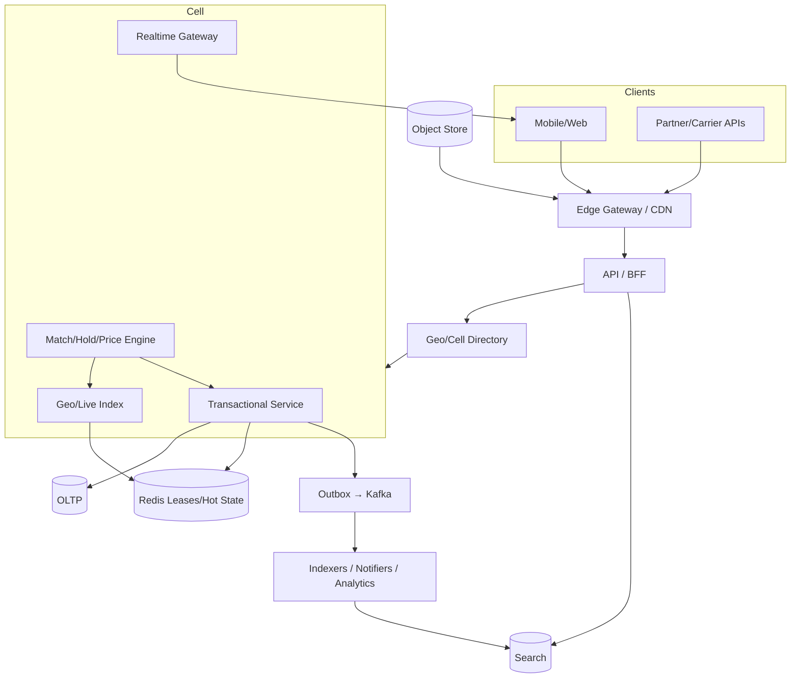

# System Design: Delivery Route Optimization

> **Focus areas:** VRP/TSP · Time windows · Capacities · Live replan · Traffic · Couriers  
> **Style:** End-to-end product design with progressive scale (10× → 100× → 1,000×)  
> **Interview theme:** Maps / marketplaces / mobility / logistics — **Delivery Route Optimization**  
> **Quality bar:** Domain-specific numbers, geo/matching/inventory contention called out, deal-breakers explicit

---

## Table of Contents

1. [Clarify Requirements (Interview Q&A)](#1-clarify-requirements-interview-qa)
2. [Back-of-the-Envelope Estimation](#2-back-of-the-envelope-estimation)
3. [High-Level Design](#3-high-level-design)
4. [Architecture Diagram](#4-architecture-diagram)
5. [Design Deep Dive](#5-design-deep-dive)
6. [Wrap-Up](#6-wrap-up)
7. [Deeper / Related Interview Questions](#7-deeper--related-interview-questions)

---

## 1. Clarify Requirements (Interview Q&A)

Goal: optimize multi-stop courier routes at marketplace/geo scale—with progressive architecture from one city/region to global cells—while protecting **correctness under contention** (inventory, seats, dispatch leases, money).

### 1.0 What this is / is not

| Dimension | This doc | Not this |
|-----------|----------|----------|
| Job | System to optimize multi-stop courier routes | Unrelated product surface |
| Core noun | `route plan` lifecycle | Every adjacent company product |
| Depth | Senior/staff HLD + deep dives | Only UI mockups or only ML papers |
| Emphasis | VRP heuristics, time windows, live replan, constraint hardness | Generic CRUD without geo/contention |
| Scale story | Baseline → 10× → 100× → 1,000× | Single-box forever |

### 1.1 Functional Requirements

| # | Question to ask | Expected / typical interviewer answer | Design implication |
|---|-----------------|----------------------------------------|--------------------|
| F1 | Problem class? | VRP with time windows | Heuristic solvers |
| F2 | Inputs? | Stops, vehicles, constraints | Validated jobs |
| F3 | Output? | Sequences + ETAs | Executable plans |
| F4 | Live replan? | Traffic, new stops, failures | Event triggers |
| F5 | Time budget? | 0.2–2s | Anytime algorithms |
| F6 | Capacity? | Weight/volume/slots | Feasibility checks |
| F7 | Road ETAs? | Routing service dependency | Cache matrix chunks |
| F8 | Infeasibility? | Drop/escalate stop | Never silent |
| F9 | Multi-depot? | Phase 2 | Hooks |
| F10 | Human override? | Dispatcher edits | Version plans |
| F11 | Scale? | Per cell / courier set | Partition |
| F12 | Cold start? | Nearest insertion | Warm improve |
| F13 | Exact MIP? | Only tiny instances | Not online path |

**MVP functional scope (lock with interviewer):**

1. Deliver a production-quality path for **VRP heuristics**.
2. Deliver a production-quality path for **time windows**.
3. Deliver a production-quality path for **live replan**.
4. Deliver a production-quality path for **constraint hardness**.
5. Durable `route plan` state machine with idempotent writes.
6. Observability: latency histograms, lag/freshness, conflict rates, business KPIs.
7. Explicit degrade modes for peaks (shed secondary work first).
8. Security/privacy basics for location/PII/payments as applicable.
9. Load/perf test plan for hot cells/events.

**Out of MVP (explicitly defer):**

- Global single-objective optimizer across all cities/events without cells
- Perfect ML personalization / research SOTA as a blocker
- Active-active multi-writer on the same contended inventory/dispatch key
- Full offline entire catalog on device (except the offline-reservation doc)
- Building a complete payments network or map from scratch when a platform dependency exists

### 1.2 Non-Functional Requirements

| # | Question | Expected answer | Target |
|---|----------|-----------------|--------|
| N1 | Latency SLO? | Interactive where user waits | solve budget 0.2–2s |
| N2 | Availability? | Regional degrade OK if blast-radius limited | 99.9% control plane; critical path higher if money |
| N3 | Durability? | No silent loss of money/inventory/dispatch commits | WAL/kafka + idempotent apply |
| N4 | Consistency? | Strong on contended keys; eventual on search/heatmaps | Document per entity |
| N5 | Freshness? | Live location/ETA/status SLOs | define explicit staleness budget |
| N6 | Multi-region? | Cell/home-region writes | Directory + failover runbooks |
| N7 | Security/privacy? | PII, precise location, payments | TLS, encryption, least privilege, audit |
| N8 | Cost? | Read-heavy caching; avoid O(n) geo scans | Caps, caches, tiered storage |
| N9 | Peak elasticity? | Events/onsale/rain/stadium | 10–100× cell peaks |

### 1.3 Cases (User Flows & Edge Cases)

**Happy paths**

1. User/system initiates flow to optimize multi-stop courier routes → validation → core `route plan` created.
2. Geo/index or inventory lookup returns consistent candidates under SLO.
3. Contended action (match/hold/bid/book) succeeds exactly once under retry.
4. Realtime observers (if any) see ordered status/location/ETA updates.
5. Terminal state: complete/cancel/expire with money and inventory reconciled.
6. Reload/new device sees source-of-truth state (not only client memory).

**Edge / failure cases**

| Case | Behavior |
|------|----------|
| Client retry / duplicate submit | Idempotency-Key returns same resource; conflicting body → 409 |
| Dependency timeout | Fail fast with degrade path; no unbounded queue for interactive UX |
| Hot key / hot cell / hot event | Shard, queue, coalesce, or waiting room—never one global lock |
| Clock skew | Server timestamps for TTL/CAS; client ts for telemetry only with sanity bounds |
| Partial regional outage | Cell isolation; directory failover; clear user messaging |
| Poison message / bad GPS | Validate, quarantine, don't brick partition |
| Privacy / IDOR | Authz on every read of precise location or PII |
| Backfill / replay | Idempotent consumers; replay from offsets for index rebuild |
| Stop becomes unreachable | Eject stop; notify; replan remainder |
| Solver exceeds budget | Return best-so-far feasible plan |

### 1.4 Scales (Progressive)

Establish a **baseline**, then stress-test at 10× / 100× / 1,000×.

| Metric | Baseline | 10× | 100× | 1,000× |
|--------|----------|-----|------|--------|
| Replans/s | 200 | 2K | 20K | 200K |
| Stops/route | 5–30 | 5–30 | capped | hierarchical |
| Solve time budget | 2s | 1–2s | 200–500ms | heuristics only |
| Regions/cells | 1–few | multi-city | multi-country | global cell mesh |
| Peak factor vs avg | 5–10× | 10× | 20× events | 50×+ onsale/stadium |
| Team operability | 1 oncall | platform | multi-team | cell SRE model |

**What each jump forces architecturally:**

- **10×:** Add caching, read replicas, async indexing, basic cell/city partitioning, and idempotency stores.
- **100×:** Shard by geography/event/listing; split hot path (holds/match/location) from cold path (analytics/search build); introduce dedicated realtime gateways.
- **1,000×:** Cell architecture with directory service, home-region single-writer for contended keys, tiered storage, edge caches, and explicit multi-tenant/marketplace fairness.

### 1.5 Etc. (Constraints & Assumptions)

- **Cloud:** one primary cloud, multi-AZ; multi-region DR / active-passive cells.
- **Mobile + web** clients with flaky networks; retries are normal.
- **Dependencies:** maps/routing/payments/carriers may be platform services—design façades.
- **Regulatory:** location retention limits, payments PCI scope isolation, local labor rules for couriers where relevant.
- **Time:** server clocks via NTP; TTLs enforced server-side.

**Scope statement to repeat back:**

> Design **Delivery Route Optimization** to optimize multi-stop courier routes, emphasizing VRP heuristics, time windows, live replan, constraint hardness. Start from baseline ~200 replans/s and evolve through 10×/100×/1,000× with geo/cell partitioning. MVP protects contention invariants with idempotent APIs; defer global omniscient optimizers.

---

## 2. Back-of-the-Envelope Estimation

### 2.1 Primary traffic

```text
Baseline primary: 200 plans/s
Entities (order-of): stops per courier
Write class focus: replan triggers
Typical payload: route plans
Hot structure: solver fleet
Peak = 5–20× average depending on events/weather/onsale
```

### 2.2 QPS → machine count (rule of thumb)

```text
Assume one stateless API node handles ~2–5K simple QPS (CPU-bound JSON)
or ~500–2K QPS when each request fans out to geo index + rank.
Baseline → start N+2 nodes; at 100× prefer cell-local fleets over one giant ASG.
```

### 2.3 Bandwidth

```text
egress ≈ QPS × payload_size
Use route plans as mean response/event size for order-of math.
Realtime fanout often dominates: subscribers × update_hz × bytes.
Compress deltas; coalesce; don't send full snapshots at 1 Hz to millions.
```

### 2.4 Storage

```text
OLTP: contended entities (trips, holds, seats, bookings) — high IOPS, not necessarily PB.
Index/search: derived docs — grows with catalog × replicas.
Telemetry/ping logs: append-only — can be PB/month; tier to cold object storage.
Object store: labels, photos, seatmap assets, tile bundles.
```

### 2.5 Memory (hot indexes)

```text
Geo postings / live driver sets / seat bitmaps should be bounded per cell.
Example: 100K live drivers × 64B ≈ 6.4 MB meta + cell sets;
stadium fanout state is the real memory risk — shard subscriptions.
```

### 2.6 Cache

| Data | TTL | Notes |
|------|-----|-------|
| Hot geo tiles / discovery pages | 10–60s | SWR; coalesce |
| Quotes / surge_version | 30–120s | Bind into checkout |
| Seatmap snapshots | seconds | Versioned diffs |
| Catalog/listing docs | minutes | Invalidate on write |
| Negative/zero-result | short | Avoid stampede |

### 2.7 Hot keys

Expect hot keys around popular cells, onsale `event_id`, viral listings, downtown lunch hexes. Mitigate with **solver fleet**, admission control, and key sharding.

### 2.8 Write amplification anti-patterns

- One OLTP row per GPS ping
- Rebuilding entire search index per field change
- OFFSET deep pagination on map pans
- Fanout full seatmap JSON every click
- Synchronous multi-region commit on every location update

---

## 3. High-Level Design

### 3.1 Planes (split early)

| Plane | Responsibility | Store/tech (typical) |
|-------|----------------|----------------------|
| Edge / API | Auth, rate limits, routing to cells | Gateway + mesh |
| Transactional | Holds, bookings, trips, bids, ledgers | Postgres/Spanner-like / Redis+durable |
| Geo / live index | Nearby, live locations, hex state | Redis/memory + Kafka |
| Search / discovery | Documents, facets, ranking | ES/OpenSearch/Lucene / custom |
| Realtime | WS/SSE fanout | Gateway + pubsub |
| Async | Indexing, notifications, analytics | Kafka + workers |
| Object | Photos, labels, tiles | S3/GCS + CDN |

### 3.2 Core algorithm / control loop

```text
VRP heuristic (ALNS/insertion) under time budget; live replan on events
```

### 3.3 APIs (representative)

```http
POST /v1/routes:optimize
POST /v1/routes/{id}:replan
```

Use `Idempotency-Key` on all creates that allocate scarce resources or money.

### 3.4 Data model (sketch)

```text
Stop{id,loc,tw_open,tw_close,service_s}
Vehicle{capacity,shift}
Plan{seq[],etas[],cost}
AuditEvent{entity_id, type, actor, ts, payload_ref}
Outbox{id, topic, payload, published}
```

### 3.5 Why choose A over B (critical trade-offs)

| Option | Pros | Cons | When |
|--------|------|------|------|
| Cell/city single-writer | Simple invariants; blast radius | Cross-cell handoff complexity | Contended dispatch/inventory |
| Global active-active | Low RPO/RTO reads | Conflict hell on seats/trips | Read-mostly catalogs only |
| Redis seat/hold state + durable order | Survives onsale QPS | Must design crash rebuild | Ticket/seat hot path |
| Pure RDBMS locks | Familiar | Melts on onsale/stadium | Low contention MVP |
| Micro-batch matching | Better efficiency | Extra wait | Dense rides/delivery |
| Pure greedy matching | Simple/fast | Suboptimal; racey without leases | Sparse MVP |
| Approximate geo + refine | Fast recall | Needs exact distance pass | All nearby systems |
| Full table geo scan | 'Correct' naively | Impossible at scale | Never beyond toy |

**Deal-breakers:**

- Double dispatch / double book / double sell seats
- Silent money divergence (earnings vs payouts)
- Unbounded interactive queues (user waits forever with no token)
- Serving precise location to unauthorized clients

### 3.6 Domain deep notes

**Delivery Route Optimization** interview signal: speak fluently about **VRP heuristics** and **time windows**, then connect to failure modes (TTL expiry, CAS conflicts, cell failover).

- Keep **command** (allocate) separate from **query** (search/heatmap).
- Bind user-visible prices/ETAs to **versioned quotes** with TTL.
- Prefer **leases with expiry** over eternal locks.
- Emit **domain events** via outbox for search, notifications, analytics.
- Put **admission control** in front of hot inventory (onsale, stadium, viral listing).

### 3.7 State machine (generic template specialized in speech)

```text
created → reserved/held/matched → in_progress → completed
                 ↘ expired/cancelled
                 ↘ failed (compensated)
```

Only one terminal transition wins (CAS on `version` / conditional update).

---

## 4. Architecture Diagram



C4-ish note: **Directory** is global and small; **Cell** owns contended writes; **Search** is derived.

---

## 5. Design Deep Dive

### 5.1 Reliability

#### 5.1.1 Data loss prevention

- Durable commit on allocation paths before user ACK (hold/trip/bid/ledger).
- Kafka (or equiv) with retained topics for index rebuilds and analytics.
- Object store for irreversible artifacts (labels, tickets PDFs) with checksums.
- Backup + PITR on OLTP; game-day restore tests.

#### 5.1.2 Retries, idempotency, exactly-once-ish

- At-least-once delivery everywhere; handlers idempotent.
- Idempotency records keyed by client key / business natural key.
- Outbox pattern avoids dual-write loss between DB and bus.
- Provider calls (carriers, payment, GDS) use provider-side idempotency + reconcile jobs.

#### 5.1.3 Rate limits & backpressure

- Edge: per-user/device/IP + per-event buckets.
- Cell: max in-flight match/hold ops; queue with deadline.
- Shed: personalization → alts → heatmap → eventually reject new non-critical reads.
- Never let interactive threads block on unbounded Kafka consumer lag.

#### 5.1.4 Consistency toolkit

| Tool | Use |
|------|-----|
| CAS / conditional update | seats, high bid, calendar nights |
| Lease + fencing token | driver dispatch, connector reservation |
| Idempotent ledger | earnings, payouts |
| Waiting room tokens | ticket onsale admit |
| Quote version binding | surge/delivery price |

#### 5.1.5 Failure drills

- Kill cell leader / Redis master; verify rebuild from snapshot+log.
- Clock jump; ensure TTL logic safe.
- Duplicate webhook storms from carriers/payments.
- Split brain directory epoch: fencing must reject stale writers.

### 5.2 Scalability

#### 5.2.1 Sharding keys

| Entity | Shard key | Why |
|--------|-----------|-----|
| Live drivers / dashers | city/H3 cell | locality for nearby |
| Trips/orders | city + id | cell ownership |
| Events/seats | event_id | onsale isolation |
| Listings/calendars | listing_id | contention locality |
| Users/ledger | user/driver_id | money locality |
| Search | geo partition + doc id | query locality |

#### 5.2.2 Scale-up vs scale-out

- Vertical for single-event onsale partition (fat Redis / memory) carefully.
- Horizontal cells for global growth.
- Solver/ETA model fleets autoscale on CPU/GPU separately from API.

#### 5.2.3 Storage tiers

1. **Hot:** leases, live geo, seat bitmaps, open orders
2. **Warm:** OLTP primary data
3. **Search:** derived documents
4. **Cold:** ping history, old tracking, audit → object/columnar

#### 5.2.4 Parallelization

- Cell-local matchers; parallel k-ring fetches with budgets
- Batch solvers with worker pools and time budgets
- Matrix routing chunked; never one giant NxN without limits

#### 5.2.5 Progressive scale checklist

| Jump | Must add |
|------|----------|
| 10× | cache, idempotency DB, replicas, async index |
| 100× | geo/event shards, realtime gateway, backpressure |
| 1,000× | cell directory, edge, tiering, multi-team platforms |

### 5.3 Maintainability

#### 5.3.1 Observability

Golden signals for **Delivery Route Optimization**: QPS/latency/errors on APIs; **freshness/lag** on geo/index; **CAS conflict rate**; **lease expiry rate**; business KPIs (match rate, book conversion, onsale checkout, on-time delivery).

Distributed traces across quote → hold → pay → finalize.

#### 5.3.2 Operability

- Feature flags for matcher/pricing/ranking
- Kill switches for surge, batching, soft-close extensions
- Runbooks: cell failover, inventory freeze, onsale pause, carrier outage
- Capacity dashboards per cell/event

#### 5.3.3 Migrations

- Dual-write new shard map; shadow read; cutover with epoch bump
- Calendar/seat schema changes expand/contract; never lock table during onsale
- Model/artifact rollout with canaries and rollback

#### 5.3.4 Multi-tenant / multi-brand

- `org_id` / `marketplace_id` on rows; quotas per tenant
- Noisy-neighbor limits on shared search/telemetry clusters

#### 5.3.5 Security & privacy

- Precise location ACL + retention TTL
- Field-level encryption for payment tokens (tokenize)
- Audit every admin inventory override
- Bot/device reputation on checkout and bid paths

---

## 6. Wrap-Up

### 6.1 Decision summary

1. Invest in **VRP heuristics** as a first-class subsystem.
2. Invest in **time windows** as a first-class subsystem.
3. Invest in **live replan** as a first-class subsystem.
4. Invest in **constraint hardness** as a first-class subsystem.
5. Split planes: transactional vs geo/live vs search vs realtime vs async.
6. Cells/geo shards for blast radius; directory for routing.
7. Idempotency + CAS/leases on contention; eventual on derived data.
8. Progressive scale: cache → shard → cell mesh.

### 6.2 Phased rollout

| Phase | Deliverable |
|-------|-------------|
| P0 | Single region MVP; strong invariants; metrics |
| P1 | Caching + async indexing + basic geo cells |
| P2 | Multi-city cells; realtime fanout hardened |
| P3 | Global directory; edge; advanced matching/pricing/ML |
| P4 | Game-days, chaos, cost optimization, multi-tenant limits |

### 6.3 What to say if time runs out

"For Delivery Route Optimization, I'd guarantee **VRP heuristics** correctness with leases/CAS, serve discovery via approximate geo + refine, isolate peaks in cells, and bind user quotes. Everything else—SOTA ranking, global OR solvers—is iterative on that skeleton."

---

## 7. Deeper / Related Interview Questions

### Q1. What is the single hardest correctness invariant in Delivery Route Optimization?

Call out the deal-breaker for this domain—typically **no double-assign / no double-sell / no double-pay / no lost scan**. Design leases, CAS, or ledgers around that invariant before drawing 20 boxes.

### Q2. Geohash vs H3 vs S2—what do you pick here?

Radius nearby / dispatch hexes → H3. Viewport coverings → S2. Simple prefix demos → geohash with neighbor awareness. Many production stacks use H3 for marketplace ops and tile/S2 ideas for maps.

### Q3. How do you prevent hot partitions?

Shard by cell/event_id/listing_id with high cardinality; avoid city-wide single Redis key; use local queues; waiting rooms for onsale; cache popular read keys at edge.

### Q4. Where is eventual consistency unacceptable?

Inventory holds, seat states, bid high-water marks, payment capture, driver leases. Search ranking, heatmaps, review aggregates can lag with SLO.

### Q5. Idempotency strategy?

Idempotency-Key + body hash store with TTL; for money/inventory use durable unique constraints on business keys (`hold_id`, `bid_id`, `payout_id`).

### Q6. How do you test geo correctness?

Golden fixtures on cell boundaries, dateline, poles; property tests that k-ring ⊇ true radius neighbors; load tests on downtown density.

### Q7. Live location bandwidth math?

drivers × ping_hz × bytes; compress (delta, polyline); adaptive rates; don't store every ping in OLTP—hot index + log/cold store.

### Q8. Matching: greedy vs batch?

Greedy low latency; batch improves efficiency/fairness at cost of wait. Hybrid: micro-batches 1–2s in dense cells.

### Q9. Surge oscillation?

EMA demand/supply, hysteresis bands, max step, separate driver incentives from rider multiplier, bind quotes to surge_version.

### Q10. ETA feedback loops?

Log prediction vs actual; train offline; watch covariate shift in weather/events; never train solely on served ETAs without actuals.

### Q11. Ticket onsale architecture?

Waiting room → admit tokens → partitioned seat inventory → short holds → payment → finalize. Seat DB never faces raw herd.

### Q12. Calendar booking without overbook?

Represent nights as rows/bitmaps; conditional update WHERE available; hold TTL; confirm converts hold→booked in one txn/CAS.

### Q13. Split-stay search under latency?

Limit segments; prefilter geo/price; beam/DP over date splits; cache availability bitmaps; async refine for UI.

### Q14. Auction soft close races?

Single-writer per auction or fencing token; end_at extensions transactional with bid; clients subscribe to end_at changes.

### Q15. Multi-region dispatch?

Cell ownership with epoch; sticky trips to cell; border handoff protocol; don't active-active the same driver lease.

### Q16. Cache invalidation for availability?

Short TTL + version tokens; pub/sub invalidation for listing/seatmap; never cache positive hold across users.

### Q17. Observability must-haves?

Lag, freshness, conflict/CAS fail rates, double-assign probes, queue wait, checkout conversion, p99 per stage.

### Q18. Load shedding order?

Shed secondary (heatmaps, personalization, alts routes) before transactional holds; for onsale shed bots first.

### Q19. Data model for seatmaps?

Immutable seat master + mutable status bitmap/row; publish diffs over WS; holds reference seat_ids + event epoch.

### Q20. How would you explain trade-offs in 60s?

For Delivery Route Optimization: emphasize VRP heuristics, time windows, live replan; progressive cell scale; strong on contention keys; eventual on derived indexes; idempotent mobile retries.

### Q21. Consistent hashing vs range geo shards?

Geo range/cell shards preserve locality for nearby queries. Consistent hash by id for user/ledger data. Don't hash drivers globally if you need nearby.

### Q22. Exactly-once processing?

Prefer at-least-once + idempotent handlers. Outbox for DB→bus. For payments/labels, reconcile with provider idempotency keys.

### Q23. Mobile offline reservation conflicts?

Client optimistic UI; server authoritative CAS; conflict payload with alternatives; never pretend offline hold is final for scarce inventory.

### Q24. Fraud vectors?

GPS spoof, bot checkout, shill bidding, review brigading, promo abuse. Layer device reputation, velocity, payment risk, graph features.

### Q25. Cost killers at 1000×?

Chatty location fanout, uncapped candidate sets, OFFSET pagination, per-ping OLTP rows, personalized CDN pollution, giant matrix route calls.

---

## Appendix A — Interview checklist

- [ ] Clarified MVP vs out-of-scope
- [ ] Wrote scale table with 10×/100×/1,000×
- [ ] Named contention invariant + mechanism
- [ ] Drew cell/directory boundary
- [ ] Separated write classes in estimation
- [ ] Covered failure: retry, TTL, failover
- [ ] Listed metrics/alerts
- [ ] Stated 2–3 explicit trade-offs

## Appendix B — Sample numbers scratchpad

```text
problem: Delivery Route Optimization
baseline: {'Primary QPS': '200 plans/s', 'Entities': 'stops per courier', 'Write QPS': 'replan triggers', 'Payload': 'route plans', 'Hot structure': 'solver fleet'}
ping_bandwidth = active_movers * hz * bytes_per_ping
fanout = subscribers * updates_per_sec * bytes
hold_capacity = seats_or_drivers_per_shard / avg_hold_seconds
search_cost ≈ candidates * score_ns + doc_fetch
```

## Appendix C — Related problems in this section

Cross-link mentally: Uber/Lyft ↔ matching ↔ location ↔ ETA ↔ surge; DoorDash ↔ batching ↔ route opt ↔ tracking; Airbnb ↔ listing search ↔ booking ↔ alerts; Ticketmaster ↔ assigned seats; hotels ↔ rental booking; package tracking ↔ shipping labels ↔ warehouse.

## Appendix D — Anti-patterns cheat sheet

| Anti-pattern | Symptom | Fix |
|--------------|---------|-----|
| Global lock | timeouts at peak | shard + leases |
| OFFSET pagination | slow deep pages | cursors |
| Per-ping SQL insert | DB melt | hot index + log |
| Cache personalized publicly | privacy bug | private keys / no CDN |
| Sync 7 carrier calls in request | p99 blowup | async + timeouts |
| Ignore hold TTL | phantom inventory | expirer + reconciler |
| Active-active seat writers | double sell | single-writer epoch |

## Appendix E — Glossary

| Term | Meaning |
|------|---------|
| Cell | Geo/ownership unit for blast-radius-limited writes |
| Lease | Time-bounded exclusive claim (driver, connector, seat hold) |
| CAS | Compare-and-set conditional write |
| k-ring | H3 neighbor disk for radius recall |
| Quote binding | User-visible price/ETA tied to version+TTL |
| Waiting room | Admission control before hot inventory |
| Outbox | DB-transactional event publish pattern |
| Soft close | Auction end extension to reduce sniping |
| VRP | Vehicle routing problem |
| ARI/ARIQ | Availability, rates, inventory (hotel) |

## Appendix F — Worked micro-examples

### F.1 Nearby candidate math

```text
H3 res 9 cells in ring k=2 ≈ up to 19 cells
avg 80 POIs/cell → ~1.5K candidates → filter to 200 → rank top 20
budget: 10ms fetch + 5ms score + 5ms pack
```

### F.2 Dispatch lease

```text
SET driver_lease:{id} = {trip,token,exp} NX EX 15
on accept: CAS trip.driver_id + commit
on timeout: delete lease if token matches; requeue demand
```

### F.3 Seat hold

```text
WATCH seats; if all AVAILABLE; MULTI mark HELD with hold_id EX 120; EXEC
-- or single Lua/txn on seat partition
```

### F.4 Surge hex

```text
mult = clamp(smooth(demand/supply), 1.0, max_mult)
if |mult-prev| < epsilon: keep prev  # hysteresis
quote stores surge_version
```

## Appendix G — Staff-level extensions

When interviewer pushes to staff:

1. **Marketplace health loops:** how pricing/matching/ETA co-adapt without oscillation.
2. **Multi-objective dispatch:** wait time, cost, fairness, utilization—constraint hierarchy.
3. **Data platform:** feature store for ETA/surge; experiment assignment; metric guardrails.
4. **Org topology:** cell platform team vs marketplace product teams; API contracts.
5. **Compliance:** retention for location; audit for inventory overrides; financial SoX-ish ledgers.
6. **Disaster:** region loss runbook; freeze holds; drain trips; customer comms.

## Appendix H — Requirement replay card

| Field | Value |
|-------|-------|
| Problem | Delivery Route Optimization |
| Noun | route plan |
| Emphasis | VRP heuristics, time windows, live replan, constraint hardness |
| Baseline | 200 Replans/s |
| Invariant | no double-allocate / no silent money loss |
| Scale endgame | cell mesh + edge + tiered stores |

---

*End of Delivery Route Optimization system design prep doc.*
