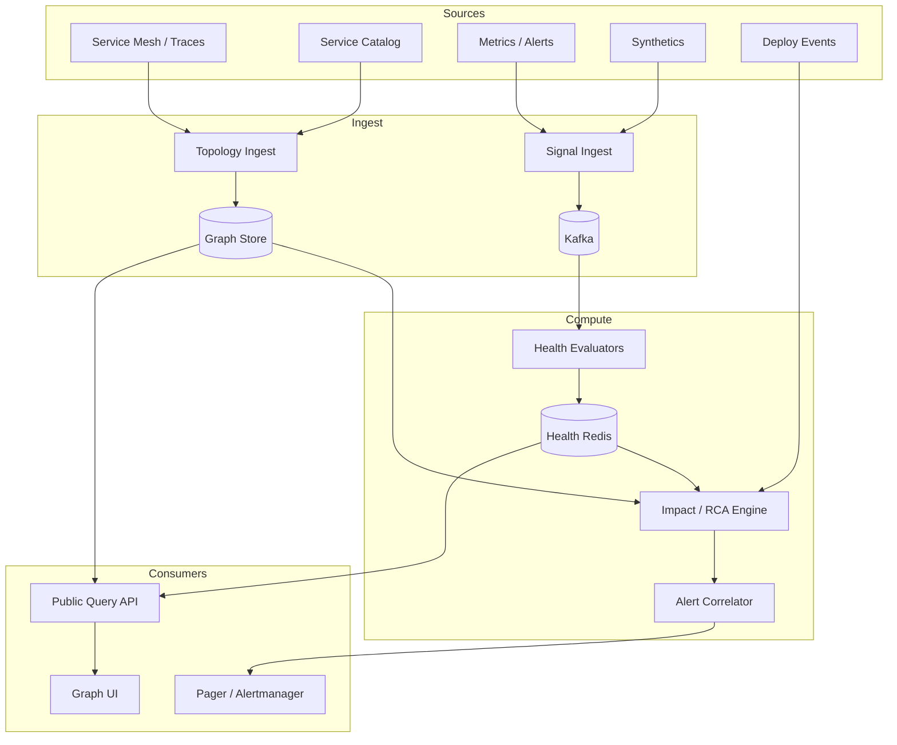
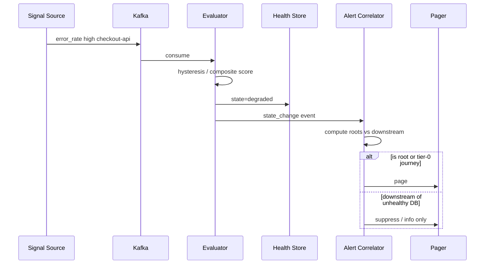

# System Design: Dependency Graph & Failure-Detection Service

> **Focus areas:** Service dependency graph · Health signals · Failure propagation · Impact analysis · Alerting integration · Topology freshness  
> **Style:** Core primitive design with progressive scale (10× → 100× → 1,000×)  
> **Product analogy:** Internal “what’s broken and what does it take down?” plane (PagerDuty + service catalog + health graph)

---

## Table of Contents

1. [Clarify Requirements (Interview Q&A)](#1-clarify-requirements-interview-qa)
2. [Back-of-the-Envelope Estimation](#2-back-of-the-envelope-estimation)
3. [High-Level Design](#3-high-level-design)
4. [Architecture Diagram](#4-architecture-diagram)
5. [Design Deep Dive](#5-design-deep-dive)
6. [Wrap-Up](#6-wrap-up)
7. [Deeper / Related Interview Questions](#7-deeper--related-interview-questions)

---

## 1. Clarify Requirements (Interview Q&A)

The goal of this phase is to **bound the problem**: what we build, what we defer, and at what scale we must succeed.

### 1.0 What this is / is not

| This is | This is not |
|---------|-------------|
| A **dependency graph** of services/components plus **failure detection** and **blast-radius / impact** views | A full APM product (distributed tracing UI) or metrics TSDB |
| Ingest health signals + edges; compute unhealthy nodes and cascading impact | Network hardware monitoring (can consume signals from it) |
| APIs for “is X healthy?”, “what depends on X?”, “likely root cause candidates” | Automatic remediation/runbook executor (may page / open tickets) |
| Near-real-time topology + health (seconds) | Exact causal inference ML platform (Phase 2 hooks) |

### 1.1 Functional Requirements

| # | Question to ask | Expected / typical interviewer answer | Design implication |
|---|-----------------|----------------------------------------|--------------------|
| F1 | What are nodes? | Services, databases, queues, third-parties, regions/cells | Typed nodes with criticality |
| F2 | What are edges? | Runtime calls, async produce/consume, deploy deps, data deps | Edge kinds; weight/criticality |
| F3 | How is topology discovered? | Mix: service mesh/traces + declarative catalog + manual | Merge with provenance & confidence |
| F4 | Health signals? | Heartbeats, synthetic checks, SLO burn, error rate, lag | Pluggable signal adapters |
| F5 | Failure definition? | Multi-signal composite state: healthy / degraded / down / unknown | State machine per node |
| F6 | Detection latency? | Page within ~1 minute of hard failure; faster for critical | Streaming evaluation |
| F7 | Impact analysis? | Given node failure, list downstream critical user journeys | Graph traversal + journey mapping |
| F8 | Root-cause assist? | Rank likely roots among currently unhealthy (not magic) | Topological sort + signal timing |
| F9 | Alerting? | Emit events to Alertmanager/Pager; suppress child noise | Dependency-aware dedup |
| F10 | Multi-tenant? | Internal single-company MVP; SaaS later | `env` / `cell` partitioning |
| F11 | Historical replay? | Keep health timeline days–weeks | Time-series of state transitions |
| F12 | Change correlation? | Deploy/config events as hypotheses | Join with CI/CD feed |
| F13 | UI? | Graph explorer + incident view | Read APIs first-class |
| F14 | AuthZ? | Engineers see all; some edges secret | RBAC on topology subsets |

**MVP functional scope:**

1. Node/edge registry (CRUD + discovery ingest).
2. Signal ingestion API + adapters (heartbeat, Prometheus alert, synthetic).
3. Per-node health state computation with hysteresis.
4. Impact query: `GET /impact?node=checkout-api`.
5. Dependency-aware alert suppression events.
6. Basic root-cause candidate ranking during an incident.
7. Dashboards/API for topology freshness and unknown rates.

**Out of MVP:**

- Fully automatic root-cause ML
- Cross-company SaaS multi-tenant marketplace
- Closing the loop with auto-rollback (integrate with deploy system later)
- Packet-level network topology

### 1.2 Non-Functional Requirements

| # | Question | Expected answer | Target |
|---|----------|-----------------|--------|
| N1 | Detection time (hard down) | Fast page | p50 < 30s, p99 < 2 min after signal |
| N2 | Impact query latency | Interactive | p99 < 200–500ms for typical graphs |
| N3 | Availability | Must work during incidents | 99.99%; degraded mode on reduced signals |
| N4 | Topology freshness | Edges not weeks stale | Runtime edges refreshed ≤ 15–60 min; heartbeats continuous |
| N5 | Consistency | Eventual OK for edges; health read-your-writes in region | Single region SoT MVP |
| N6 | Scale | Large microservice estates | 10K→10M nodes progressive |
| N7 | Safety | No alert storms | Suppression + grouping mandatory |

### 1.3 Cases

**Happy paths**

1. Payment DB degraded → node state `degraded` → impact lists checkout, subscriptions → single high-level page, children suppressed.
2. Mesh discovers new edge `frontend → recommendations` → appears in graph with confidence.
3. Synthetic check fails 3× → mark `down` after hysteresis → notify.
4. Deploy marker correlates with error spike → RCA candidates boost that change.
5. Query “path from ads to billing” returns typed edges.

**Edge / failure cases**

| Case | Behavior |
|------|----------|
| Signal loss (monitor down) | Mark `unknown` not `down`; page monitoring itself |
| Flapping health | Hysteresis + min duration; longer windows |
| Wrong edge from traces | Confidence decay; human override wins |
| Circular dependencies | Allowed; traversal with visited set; RCA careful |
| Split-brain cells | Partition graph by cell; don’t merge health naively |
| Thundering herd signal storms | Sample / rate-limit ingest; aggregate |
| Gray failures (high latency) | Degraded state from SLO burn, not binary ping |
| Third-party outage | External node; many edges inbound; suppress fan-out pages |
| Stale declarative vs runtime conflict | Prefer runtime for “calls”; keep both with provenance |

### 1.4 Scales (Progressive)

| Metric | Baseline | 10× | 100× | 1,000× |
|--------|----------|-----|------|--------|
| Nodes | 5K | 50K | 500K | 5M |
| Edges | 50K | 500K | 5M | 50M |
| Signal events/s | 5K | 50K | 500K | 5M |
| Health evals/s | 1K | 10K | 100K | 1M |
| Impact queries/min | 100 | 1K | 10K | 100K |
| Concurrent incidents | 10 | 50 | 200 | 1K |
| Adapters | 5 | 15 | 40 | 100 |

**What each jump forces:**

- **10×:** Stream processing for signals; graph DB or adjacency in KV; cache impact for critical nodes.
- **100×:** Shard graph by domain/cell; approximate traversals; signal aggregation at edge.
- **1,000×:** Hierarchical graphs (service → cell → region); push-down health; OLAP for history.

### 1.5 Etc.

- Environments: `prod`, `staging` are separate graphs.
- “User journey” criticality tags on edges/nodes for paging priority.
- Integrate with existing metrics/logs/traces—don’t rebuild them.

**Scope statement:**

> Design a **dependency-graph and failure-detection** service that merges catalog + runtime topology, computes node health from multi-signals, answers blast-radius queries, and emits dependency-aware alerts—from ~5K services to 1000×—without claiming perfect causal ML.

---

## 2. Back-of-the-Envelope Estimation

### 2.1 Graph storage

```text
Baseline: 5K nodes × 1 KB + 50K edges × 200 B ≈ 5 MB + 10 MB ≈ 15 MB raw
Trivial for memory graph

1,000×: 5M nodes × 1 KB = 5 GB; 50M edges × 200 B = 10 GB
→ still fits RAM on fat graph servers, but shard for blast radius & ops
```

### 2.2 Signal volume

```text
5K nodes × 1 heartbeat / 10s = 500 events/s
+ metrics-based evals 4.5K/s → ~5K/s baseline
1,000×: ~5M/s → need Kafka + stream workers; aggregate at source
```

### 2.3 Impact traversal cost

```text
Worst-case fanout: popular DB with 2K dependents, depth 5
BFS ~O(E_local); cache results for top dependencies
At query 100K/min with caching hit 95%, originators handle 5K/min OK
```

### 2.4 Alert reduction

```text
Naive: 500 child services page on DB blip → 500 pages
With suppression: 1–5 pages (DB + critical journeys)
Success metric: pages/incident ↓ 10–100×
```

### 2.5 Bandwidth

```text
Signal event ~200 B × 5K/s ≈ 1 MB/s
5M/s → 1 GB/s → regional aggregators mandatory
```

---

## 3. High-Level Design

### 3.1 Domain model

```text
Node {
  id, type, name, owner, criticality,
  cell, region, env,
  state, state_updated_at,
  signals_summary,
  tags (journey:checkout, tier:0)
}

Edge {
  from, to, kind: sync|async|data|deploy,
  weight, confidence, provenance,
  last_seen_at
}

Signal {
  node_id, source, type, value, ts, labels
}

IncidentView {
  roots_candidates[],
  unhealthy_subgraph,
  suppressed_alerts[],
  correlated_changes[]
}
```

**Node state machine:**

```text
unknown → healthy ⇄ degraded ⇄ down
              ↑_________↓
         (hysteresis timers; evidence windows)
```

### 3.2 Topology ingestion

| Source | Edge quality | Use |
|--------|--------------|-----|
| Service catalog YAML | Intentional, may stale | Ownership, SLOs |
| Service mesh / traces | Runtime truth | Call edges |
| Queue consumer groups | Async deps | Kafka edges |
| Declarative “depends_on” | Strong intent | Paging criticality |
| Manual overrides | Highest for conflicts | Break-glass |

**Merge algorithm:** key `(from,to,kind)`; update `last_seen`; confidence = f(sources); GC edges not seen for TTL (e.g. 7 days) unless declarative pin.

### 3.3 Health evaluation

Composite scorer (example weights):

| Signal | Example rule |
|--------|--------------|
| Heartbeat miss | miss ≥ 3 intervals → down candidate |
| Error rate | > 5× baseline or > SLO → degraded/down |
| Latency | p99 burn → degraded |
| Saturation | CPU/mem/lag thresholds |
| Synthetic | journey fail → degraded on journey nodes |

**Hysteresis:** require N consecutive windows or duration D before transition; longer to clear `down` → `healthy` (avoid flap).

### 3.4 Impact analysis

```text
impact(node N):
  BFS/DFS downstream along edges where kind in {sync, async, data}
  filter by env/cell
  score = criticality(node) × path_reliability
  return ranked affected nodes + journeys
```

**Upstream for RCA:**

```text
candidates = unhealthy nodes with no unhealthy upstream
           ∪ nodes with recent deploy correlated
sort by: centrality × signal severity × change proximity
```

### 3.5 Dependency-aware alerting

1. Evaluate unhealthy set U.
2. Compute likely roots R ⊂ U.
3. Page on R (and tier-0 journeys impacted).
4. Suppress alerts for nodes in `downstream(R) ∩ U` for window W.
5. Re-evaluate if new roots appear.

Emit structured event:

```json
{
  "type": "alert.suppression_group",
  "root": "payments-db",
  "suppressed": ["checkout-api", "billing-worker"],
  "impact_journeys": ["checkout"]
}
```

### 3.6 APIs

| Method | Path | Purpose |
|--------|------|---------|
| PUT | `/nodes/{id}` | Upsert node |
| PUT | `/edges` | Upsert edges batch |
| POST | `/signals` | Ingest signals batch |
| GET | `/nodes/{id}/health` | Current state |
| GET | `/impact` | Blast radius |
| GET | `/rca?incident_id=` | Candidate roots |
| GET | `/graph/neighborhood` | UI explore |
| POST | `/overrides` | Manual state/edge pin |

### 3.7 Storage choices

| Data | Store | Why |
|------|-------|-----|
| Graph topology | Neo4j / Janus / **Postgres adjacency + in-mem cache** | MVP: Postgres+Redis; large: graph engine |
| Current health | Redis | Hot read |
| Signal stream | Kafka | Buffer + replay |
| State history | TSDB / ClickHouse | Trends |
| Catalog | Postgres | Source of truth for ownership |

### 3.8 Trade-offs

| Option | Pros | Cons | Deal-breaker |
|--------|------|------|--------------|
| Only ICMP ping | Simple | Misses gray failures | **Yes for microservices** |
| Only metrics alerts | Rich | Alert storms without graph | Incomplete alone |
| Trace-only topology | Accurate calls | Costly; sampling miss | Need catalog too |
| Full causal ML MVP | Sexy | Wrong often; slow | Don’t block MVP |
| Monolithic graph server | Simple | Scale/HA limits | OK baseline; shard later |

**Choice:** Kafka signals + stream evaluators + Postgres catalog + Redis health + in-memory/cached adjacency for traversals; graph DB optional Phase 2.

---

## 4. Architecture Diagram





---

## 5. Design Deep Dive

### 5.1 Reliability

**Data loss prevention**

- Kafka durable signals; evaluators checkpoint offsets.
- Topology upserts idempotent by edge id.
- Health store multi-AZ Redis; rebuild from recent signals on loss (replay 15–60 min).

**Retries & idempotency**

- Signal producers retry; events carry ` Dedup-Key` / `(source,node,ts_bucket)`.
- Alert correlator: state-based, not edge-triggered only—reconcile loop every few seconds.

**Backpressure**

- Drop or sample low-priority signals first (debug metrics); never drop heartbeats for tier-0 without marking unknown.

**Avoid false downs**

- Quorum of signals; unknown on monitor failure; maintenance windows mute.

### 5.2 Scalability

**Sharding**

- Partition by `cell` or domain hash; cross-cell edges registered in global thin directory.
- Evaluators consume Kafka partitions keyed by `node_id`.

**Caching**

- Precompute impact for tier-0 dependencies every N seconds.
- Neighborhood cache for UI.

**Scale jumps**

| Scale | Change |
|-------|--------|
| 10× | Kafka + Redis health; cached BFS |
| 100× | Shard by cell; hierarchical nodes (service.cell) |
| 1,000× | Push aggregation at mesh sidecars; OLAP history; approximate RCA |

**Parallelization**

- Eval embarrassingly parallel per node.
- Impact queries on read replicas of adjacency.

### 5.3 Maintainability

**Ops:** topology freshness SLIs (`edges_stale_ratio`); synthetic for the detector itself; chaos “kill signal pipeline”.

**Observability:** pipeline lag, state transition rates, pages suppressed, RCA precision feedback (thumbs).

**Migrations:** dual-write catalog schema; version edge kinds.

**Multi-team:** owners from catalog; escalation policies per node; graph as code reviews for tier-0 edges.

---

## 6. Wrap-Up

### Decision summary

| Decision | Choice | Why |
|----------|--------|-----|
| Topology | Catalog + runtime merge | Accuracy + ownership |
| Health | Multi-signal + hysteresis | Reduce flaps / gray failures |
| Alerts | Dependency suppression | Stop page storms |
| RCA | Topological candidates + changes | Useful, honest limits |
| Storage | Kafka + Postgres + Redis | Pragmatic MVP |
| Scale | Cell sharding | Natural isolation |

### Phased rollout

1. **MVP:** Catalog edges + heartbeats/error signals; health API; basic suppression.
2. **Phase 1.5:** Trace/mesh ingest; impact UI; deploy correlation.
3. **Phase 2:** Cell sharding; journey-aware paging; history analytics.
4. **Phase 3:** Assisted RCA models; auto-open incidents; integrate canary rollback hints.

---

## 7. Deeper / Related Interview Questions

**Q1. Why not page on every Prometheus alert?**  
A: Alert storms hide roots. Graph suppression collapses children under shared dependency failures.

**Q2. Ping ≠ healthy—example?**  
A: Process up but deadlock; dependency latency SLO burning; queue lag. Need golden signals, not only liveness.

**Q3. How do you handle circular dependencies?**  
A: Traversal marks visited; RCA prefers nodes with earliest degradation timestamp and external change correlation.

**Q4. Trace sampling misses edges—problem?**  
A: Yes. Keep declarative pins for critical paths; decay confidence rather than hard-delete.

**Q5. What is a gray failure?**  
A: Partial correctness/latency issues that pass naive health checks—model `degraded` from SLOs.

**Q6. Should the system auto-rollback deploys?**  
A: It can *signal* high correlation; rollback authority belongs to deploy platform with safety gates.

**Q7. CAP for health state?**  
A: Prefer availability of last-known + `unknown` over blocking; don’t invent `healthy` when unsure.

**Q8. How to test suppression logic?**  
A: Fixtures: DB down → 200 children unhealthy → expect ≤ few pages; assert roots.

**Q9. Multi-region outage view?**  
A: Region nodes as first-class; edges cross-region marked; impact scoped.

**Q10. Fan-in third-party (Okta) fails—how page?**  
A: Single external node root; suppress apps; communicate status page link.

**Q11. Data structure for adjacency at 50M edges?**  
A: CSR in memory per shard; cold edges in KV; don’t full-scan.

**Q12. False root: client errors spike?**  
A: Separate signal classes; require server golden signals; use error budgets by cause codes.

**Q13. How does hysteresis pick D?**  
A: Tier-0 shorter detect, longer clear; noisy noncritical longer detect.

**Q14. Graph QL vs REST?**  
A: REST/gRPC for health/impact; GraphQL OK for UI exploration—not core issue.

**Q15. Deal-breaker: treating unknown as down?**  
A: Yes—pages on monitoring outages, burns trust.

**Q16. Ownership missing in catalog?**  
A: Default on-call; ticket for `owner=unassigned`; still detect failures.

**Q17. Streaming vs periodic eval?**  
A: Stream for tier-0; periodic reconcile for all to fix missed events.

**Q18. Security of topology?**  
A: Edge disclosure can reveal architecture—RBAC; redact external partner edges.

**Q19. How to represent async edges?**  
A: `producer → topic → consumer` as two edges or topic as node (prefer topic as node).

**Q20. Impact query timeout on huge fanout?**  
A: Cap depth/nodes; return partial + `truncated=true`; precompute for hubs.

**Q21. SLO for the detector itself?**  
A: Time-to-detect, false page rate, suppress accuracy, pipeline lag.

**Q22. Merge conflict: catalog says no edge but traces show calls?**  
A: Keep runtime edge; flag drift for owners; don’t drop silently.

**Q23. Use Bayesian RCA?**  
A: Later; start with topology + time ordering—explainable in war rooms.

**Q24. Hot partition on ingest?**  
A: Key by node_id; huge fan-out services aggregate locally first.

**Q25. Relationship to incident management?**  
A: Open incident with unhealthy subgraph snapshot; update as states change.

**Q26. Canary bad → detector role?**  
A: Detect degraded on canary cohort nodes; signal deploy system—complementary.

**Q27. Why Redis for health?**  
A: Low-latency fan-out reads during incidents; rebuildable from stream.

**Q28. Exact vs approx impact?**  
A: Exact BFS within cell; approx sampling acceptable for giant peripheral graphs with disclosure.

**Q29. Staff narrative?**  
A: “Failure detection without dependency context pages symptoms; with graph context pages causes and protects sleep.”

**Q30. MVP cut line?**  
A: Ship suppression + impact for tier-0 dependencies before fancy RCA ranking.

---

### Appendix A — Example composite health rule (pseudo)

```text
score = 0
if heartbeat_miss >= 3: score += 100
if error_rate > 5 * baseline: score += 40
if slo_burn_2h > 1: score += 30
if synthetic_journey_fail: score += 50

if score >= 100 for 60s: down
else if score >= 40 for 120s: degraded
else if signals_fresh: healthy
else: unknown
```

### Appendix B — Alert suppression sketch

```text
U = {n | state(n) in {degraded, down}}
R = roots(U)  # no unhealthy upstream, or explicit override
page(R ∪ tier0_journeys_impacted(R))
suppress(U - page_set) for W minutes
recompute every 5s
```

### Appendix C — Progressive scale checklist

| Scale | Must add |
|-------|----------|
| 10× | Kafka, hysteresis library, Redis health |
| 100× | Cell sharding, precomputed hub impact |
| 1,000× | Hierarchical topology, edge signal aggregation |

---

*End of dependency graph & failure-detection design.*
