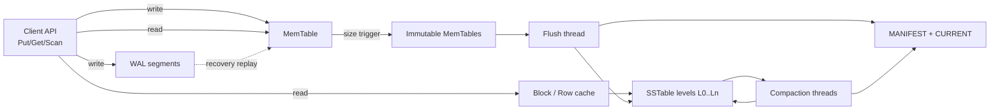
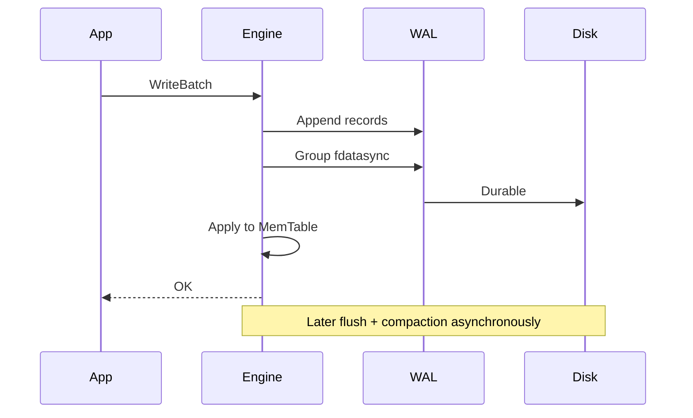

# System Design: Disk-Backed Durable Key-Value Store

> **Focus areas:** WAL · Memtable · SSTables · Compaction · Crash recovery · Checksums · fsync trade-offs  
> **Style:** Single-node (or per-shard) durable engine in the RocksDB / LevelDB / Bitcask family  
> **API orientation:** `Get` / `Put` / `Delete` / `Scan` / `Snapshot` with durability and compaction controls

---

## Table of Contents

1. [Clarify Requirements (Interview Q&A)](#1-clarify-requirements-interview-qa)
2. [Back-of-the-Envelope Estimation](#2-back-of-the-envelope-estimation)
3. [High-Level Design](#3-high-level-design)
4. [Architecture Diagram](#4-architecture-diagram)
5. [Design Deep Dive](#5-design-deep-dive)
6. [Wrap-Up](#6-wrap-up)
7. [Deeper / Related Interview Questions](#7-deeper--related-interview-questions)

---

## 1. Clarify Requirements (Interview Q&A)

The goal of this phase is to **bound the problem**: design a **local durable KV engine** that a distributed system can embed—not the full distributed control plane (see distributed KV / DistSQL siblings).

### 1.0 What this is / is not

| This is | This is not |
|---------|-------------|
| A crash-safe, disk-backed **local** key-value storage engine | A multi-node consensus cluster by itself |
| WAL + in-memory buffer + persistent sorted/hashed files | A pure in-memory cache (Redis without AOF/RDB) |
| Compaction / GC to reclaim space from updates/deletes | Automatic cross-machine replication (caller adds that) |
| Foundation under Cassandra/RocksDB/Kafka log segments | Full SQL query processor |
| Tunable durability (`fsync` policies) | Guaranteed global consistency across replicas |

### 1.1 Functional Requirements

| # | Question to ask | Expected / typical interviewer answer | Design implication |
|---|-----------------|----------------------------------------|--------------------|
| F1 | Single process or multi-process access? | Single writer process; multi-thread reads OK | Avoid distributed locking; one writer mutex / shard |
| F2 | Workload? | Write-heavy with point lookups; some range scans | Prefer **LSM-tree**; mention B+tree alternative |
| F3 | Value sizes? | 100 B – 4 KB typical; max 1–16 MB | Large values: blob files or reject |
| F4 | Durability on ACK? | Survive process kill & power loss for acknowledged Puts | WAL + `fsync` (or group commit) before ACK |
| F5 | Ordered iteration? | Yes for many DB embeddings | Sorted SSTables + skiplist memtable |
| F6 | Snapshots / backup? | Checkpoint for backup and replication ship | Hardlink SSTables + WAL truncate points |
| F7 | Transactions? | Single-key atomic; optional WriteBatch atomicity | Batch = one WAL record group |
| F8 | Compression? | Yes for cold SST blocks | LZ4/ZSTD per block; CPU vs disk trade-off |
| F9 | TTL? | Optional | Store expiry; filter on read; drop in compaction |
| F10 | Encryption? | At-rest optional | Block encryption + checksum after encrypt |
| F11 | Concurrent compaction? | Yes—must not block all writes forever | Background threads + write stall thresholds |
| F12 | Platform? | Linux, NVMe SSD | `O_DIRECT` / `fdatasync` considerations |
| F13 | Checksums? | Mandatory | Per-block CRC; detect bitrot |
| F14 | Delete semantics? | Tombstones until compacted | Sequence numbers for snapshot isolation of reads |

**MVP functional scope:**

1. `Put` / `Get` / `Delete` / `WriteBatch` / prefix `Scan`.
2. WAL for durability; memtable for recent writes; flush to immutable SSTables.
3. Leveled (or universal) compaction; tombstone GC.
4. Crash recovery: replay WAL from last manifest checkpoint.
5. Block cache + bloom filters for read path.
6. Tunable sync: `every_write` | `group_commit` | `interval`.
7. Basic admin: stats, manual flush/compact, checkpoint.

**Out of MVP:**

- Multi-process shared writers
- Distributed replication / Raft (engine is the state machine storage)
- Secondary indexes / SQL
- Automatic multi-disk RAID logic (assume volume manager)

### 1.2 Non-Functional Requirements

| # | Question | Expected answer | Target |
|---|----------|-----------------|--------|
| N1 | Get hit in block cache? | Microseconds | p50 < 50µs, p99 < 200µs |
| N2 | Get from SST (SSD)? | Sub-ms | p50 < 200µs, p99 < 1ms |
| N3 | Durable Put (group commit)? | Low ms | p50 < 1ms, p99 < 5ms NVMe |
| N4 | Crash RPO for ACK’d writes | Zero under fsync policy | RPO=0; RTO = WAL replay seconds–minutes |
| N5 | Space amplification | Bounded | Target ≤ 1.1–1.5× live data (leveled) |
| N6 | Write amplification | Understood cost | Typical 10–30×; tune levels |
| N7 | Availability | Process-local | Engine available if disk healthy; stall vs corrupt |
| N8 | Consistency (local) | Read-your-writes; snapshot reads | Sequence-number MVCC for iterators |

### 1.3 Cases

**Happy paths**

1. Put → append WAL → insert memtable → (group) fsync → ACK.
2. Get → memtable → immutable memtables → SST levels with bloom → block cache → return.
3. Memtable full → switch → flush immutable → new SST → update MANIFEST.
4. Compaction merges overlapping SSTs → drops tombstones/overwrites → deletes inputs after install.
5. Crash → read MANIFEST → open SSTs → replay WAL → rebuild memtable → serve.

**Edge / failure cases**

| Case | Behavior |
|------|----------|
| Kill -9 after WAL fsync, before memtable | Replay restores Put |
| Kill before fsync | Put not ACK’d or ACK only if caller chose unsafe mode |
| Disk full | Fail Puts; prefer reserving compaction headroom |
| Bitrot in SST block | Checksum fail → return error; higher layer fetches replica |
| Compaction output fails mid-way | Do not install; delete temps; retry |
| Huge WriteBatch | Bound size; reject or spill |
| Scan during compaction | Snapshots via sequence numbers; no torn reads |
| WAL grows without flush | Force flush; alert on WAL GB |
| Clock used for TTL skew | Prefer sequence + ingestion time carefully documented |
| mmap vs pread corruption visibility | Prefer pread + checksum for safety |

### 1.4 Scales (Progressive)

Think of one shard/engine instance, then many shards.

| Metric | Baseline | 10× | 100× | 1,000× |
|--------|----------|-----|------|--------|
| Live data / node | 200 GB | 2 TB | 20 TB* | Cell redesign |
| Keys | 200M | 2B | 20B | — |
| Put QPS / node | 20K | 50K | 80K† | Shard out |
| Get QPS / node | 100K | 300K | 500K† | Cache tier |
| WAL absorb MB/s | 50 | 200 | 500 | NVMe limit |
| SST files | ~1K | ~5K | ~20K | Manifest pressure |
| Compaction threads | 2 | 4 | 8 | IO fair share |

\*20 TB on one node is operationally painful—**split shards** earlier.  
†QPS ceilings are hardware-bound; scale by **sharding engines**, not infinite vertical.

**What each jump forces:**

- **10×:** Serious compaction tuning; multi-level cache; WAL group commit mandatory.
- **100×:** Shard into many engine instances; per-disk IO budgets; tiered storage.
- **1,000×:** This engine is a **library inside** a distributed KV/SQL system; cells + distributed metadata dominate.

### 1.5 Etc.

- Language: C++/Rust typical; interview can stay language-agnostic.
- Filesystem: XFS/ext4; avoid naive NFS for WAL.
- Assume **one writer queue** per column family / shard.

**Scope statement:**

> Design a **disk-backed durable KV engine** (RocksDB-class): WAL, memtable, SSTables, compaction, crash recovery, bloom filters, and tunable fsync—optimized for a single writer shard that will later be embedded under a distributed KV or SQL layer.

---

## 2. Back-of-the-Envelope Estimation

### 2.1 Write path throughput

```text
Put 1 KB values @ 20K QPS ≈ 20 MB/s application bytes
WAL write amp ≈ 1.0–1.1× (headers)
LSM WA ≈ 15× → ~300 MB/s disk write including compaction
NVMe can do GB/s; still schedule compaction carefully for p99
```

### 2.2 Read path

```text
Bloom false-positive rate 1% with ~10 bits/key
200M keys → ~250 MB bloom memory if all resident (often sharded per SST file)
Block cache 8–32 GB for 200 GB dataset → hit rate workload-dependent
```

### 2.3 Recovery time

```text
WAL since last flush: target ≤ 256 MB–2 GB
Replay 1 GB WAL @ 500 MB/s ≈ 2s + memtable insert CPU
RTO dominated by WAL size → flush frequently enough
```

### 2.4 Space

```text
Live 200 GB
Leveled LSM space amp ~1.1× → ~220 GB
+ WAL + compaction temps → provision ~1.5–2× disk
```

### 2.5 WriteBatch atomicity cost

```text
Batch of 100 × 200 B = 20 KB → one WAL group fsync
Amortizes fsync from 100 → 1 (huge latency win)
```

---

## 3. High-Level Design

### 3.1 API

| API | Notes |
|-----|-------|
| `Put(k,v)` / `Delete(k)` | Assigned monotonic `sequence` |
| `WriteBatch` | Atomic all-or-nothing in one WAL record |
| `Get(k)` | Latest visible sequence |
| `NewIterator(snapshot)` | Consistent scan |
| `Flush` / `CompactRange` | Admin |
| `CreateCheckpoint(path)` | Backup / replica seed |
| `GetProperty` | Stats |

### 3.2 Core components

```text
WAL (append-only) ──► MemTable (skiplist) ──flush──► SSTable L0
                                              ▼
                                         Compaction
                                              ▼
                                    SSTables L1…Ln (non-overlapping in leveled)
MANIFEST / CURRENT ──► authoritative file set + versions
Block cache + table cache + bloom filters
```

### 3.3 Why LSM vs B+tree vs Bitcask

| Engine | Best for | Weakness | Deal-breaker |
|--------|----------|----------|--------------|
| **LSM** | High write rate, cheap sequential IO | Read amp, compaction | Ultra-stable in-place update latency without WA |
| **B+tree** | Point update + read balanced; less WA sometimes | Random page writes; fragmentation | Sustained random write storms on HDD |
| **Bitcask** | Simple log + hash index in RAM | Index must fit RAM; GC rewrite | Billions of keys with tiny RAM |

**MVP pick: LSM** (LevelDB/RocksDB model). Mention Bitcask if key cardinality is small and simplicity is prized.

### 3.4 WAL design

- Append records: `{crc, length, type, payload}`; batches as multi-records + commit mark.
- Segments: `000123.log`; rotate on size.
- Durability policies:
  - `sync_every_write` — safest, slowest
  - `group_commit` — wait up to X µs or Y bytes, one `fdatasync`
  - `sync_interval` — bounded RPO (e.g. 10ms)—**call out RPO explicitly**

**Group commit is the default interview answer** for durable + fast.

### 3.5 Memtable

- Skiplist or B-tree in memory; concurrent readers + single writer (or sharded).
- Size threshold (e.g. 64 MB) → become immutable → flush thread writes SST.
- Bound number of immutables to avoid read amp / memory blowup → **write stall** if exceeded.

### 3.6 SSTable format

```text
[ data blocks ][ filter / bloom ][ index block ][ footer magic + offsets ]
```

- Keys sorted; block restart points for prefix compression.
- `Get`: binary search index → bloom → data block → cache.
- Compression per block; checksum trailer.

### 3.7 Compaction strategies

| Strategy | Space amp | Write amp | Read amp | When |
|----------|-----------|-----------|----------|------|
| Leveled | Low | Higher | Lower | General purpose (RocksDB default leveled) |
| Universal / size-tiered | Higher | Lower | Higher | Write-heavy ingest |
| FIFO | N/A TTL | Low | — | Time-series with drop-old |

**Tombstone GC:** a delete drops a key only when compaction can prove no older live value remains needed for open snapshots—track earliest snapshot sequence.

### 3.8 MANIFEST & version set

Atomic install of new file sets:

1. Write new SST + new MANIFEST record.
2. `fsync` MANIFEST.
3. Flip `CURRENT` pointer (atomic rename).
4. Unlink obsolete SST files when refcount zero.

This is the **metadata durability** heart—losing MANIFEST without backups loses which files are live.

### 3.9 Read path details

```text
Get(k):
  1) look up memtable(s) newest-first
  2) for each SST in level order (L0 newest-first overlaps):
       bloom miss → skip
       index → block → search
  3) first live value wins; tombstone → not found
```

**Merge iterators** for scans across memtables + SST levels.

### 3.10 Comparison: embed vs stand-alone process

| | Library embed | Separate daemon |
|--|---------------|-----------------|
| Latency | Lowest | IPC cost |
| Multi-lang | Harder | gRPC API |
| Ops | Coupled upgrades | Independent |

Interview default: **embeddable library** with clear thread model.

---

## 4. Architecture Diagram





---

## 5. Design Deep Dive

### 5.1 Reliability

#### 5.1.1 Crash consistency

**Invariant:** Any ACK’d batch appears completely after recovery; non-ACK’d may or may not (if fsync raced)—clients retry safely with idempotent keys or versions.

Recovery algorithm:

```text
1. Read CURRENT → MANIFEST → list of SST files + log numbers
2. Delete orphan tmp files
3. Replay WAL logs with sequence > last flushed sequence
4. Rebuild memtable; resume allocations of file numbers
```

#### 5.1.2 Corruption detection

- CRC32C/xxhash per WAL record and SST block.
- Optional paranoid checks on every read.
- On checksum failure: return `Corruption`; do **not** silently skip (caller’s replica repair).

#### 5.1.3 fsync pitfalls (staff-level)

| Pitfall | Mitigation |
|---------|------------|
| `fsync` file but not directory | fsync parent dir after create/rename |
| `fwrite` without flush | Use careful buffered writer |
| Extending file without sync | `fdatasync` after appends |
| False durability on some cloud disks | Understand volume durability; multi-replica above engine |

#### 5.1.4 Write stalls & backpressure

When L0 file count or pending compaction bytes exceed thresholds:

```text
slowdown writes → then stall → surface metrics
never unbounded memtable growth → OOM
```

This is intentional **backpressure** protecting durability and read latency.

#### 5.1.5 Snapshots & backup

- In-process snapshot: pin sequence number; iterators see stable view.
- Checkpoint: hardlink live SSTs + copy MANIFEST + truncated WAL into directory—safe to ship.
- Remote backup: treat checkpoint as immutable object set.

### 5.2 Scalability

#### 5.2.1 Vertical limits

| Resource | Symptom | Action |
|----------|---------|--------|
| CPU | Compaction lag | More threads / faster codec |
| Disk IO | p99 Get/Put spikes | IO rate limits; separate WAL device |
| RAM | Cache thrash | Grow cache or reduce working set |
| File count | Slow open / MANIFEST | Compaction to reduce files; shard |

#### 5.2.2 Horizontal = many shards

The engine does **not** shard itself. Upper layer assigns key ranges to engine instances (distributed KV). Each instance sized to **≤ few TB** for operable compaction/recovery.

#### 5.2.3 Column families

Separate WAL or shared WAL with multiple memtables:

- Isolate compaction for different workloads (writes vs locks).
- Shared WAL = single fsync for cross-CF atomic batch (RocksDB model).

#### 5.2.4 Tiered storage

- Hot levels on NVMe; cold bottom levels on denser media.
- Or flush cold SST to object storage with local cache (advanced)—call out pointer swizzling / catalog.

### 5.3 Maintainability

#### 5.3.1 Observability

| Metric | Meaning |
|--------|---------|
| `wal_sync_latency` | Durability cost |
| `stall_micros` | Backpressure |
| `compaction_pending_bytes` | Debt |
| `bloom_useful` / `filter_false_positive` | Tune bits/key |
| `block_cache_hit_rate` | Memory efficacy |
| `live_sst_files` / `obsolete_sst` | GC health |

#### 5.3.2 Tuning knobs worth memorizing

- `write_buffer_size`, `max_write_buffer_number`
- `level0_slowdown/stop_triggers`
- `target_file_size`, `max_bytes_for_level_base`
- `block_size` (4–32 KB), compression codec
- bloom `bits_per_key`

#### 5.3.3 Upgrades

- SST format version in footer; support N-1 read.
- Rolling binary with feature flags for new WAL record types.

#### 5.3.4 Testing

- Property tests: random crash between every fsync point (Pebble/FoundationDB style).
- Fault injection: ENOSPC, EIO, partial sector writes.
- Soak: write-heavy 24h with invariant checker (every key match oracle hashmap periodically).

---

## 6. Wrap-Up

### Decision summary

| Area | Decision |
|------|----------|
| Structure | LSM: WAL + memtable + SST |
| Durability | Group-commit `fdatasync` default |
| Compaction | Leveled for space; size-tiered option |
| Reads | Bloom + block cache + leveled merge |
| Atomic multi-op | WriteBatch |
| Scale-out | Multiple engine shards above |

### Phased rollout

1. **MVP:** WAL + memtable + L0 flush + simple size-tiered compact + recovery.
2. **Prod:** Leveled compaction, blooms, block cache, stalls, checksums, checkpoints.
3. **Hardening:** Chaos crash tests, separate WAL disk, compression, CF isolation.
4. **Embed:** Hook into distributed KV replication as `Apply(log_entry)`.

---

## 7. Deeper / Related Interview Questions

1. **Why append WAL before memtable?**  
   Memtable is volatile; WAL provides redo. Order: log → apply is classic ARIES-style.

2. **Why not update SST in place?**  
   Immutability simplifies crash recovery and concurrency; compaction handles GC.

3. **Explain write amplification numerically.**  
   Each byte may be rewritten at each level (~10× size ratio) → ~O(levels) copies.

4. **Explain read amplification.**  
   May check memtable + multiple L0 files + one file per level; blooms cut disk IO.

5. **How does leveled compaction keep reads fast?**  
   Non-overlapping key ranges per level ⇒ at most one file per level after L0.

6. **Universal compaction trade-off?**  
   Lower WA, higher space and read amp—good for heavy ingest then rare reads.

7. **What is a tombstone and when can it die?**  
   Delete marker; drop when compacted past all older versions and no snapshot needs them.

8. **How do snapshots interact with compaction?**  
   Compaction must retain keys visible to oldest snapshot sequence.

9. **Group commit vs every-write fsync latency?**  
   Amortize ~1ms fsync across many writers waiting in the same group.

10. **Why fsync the directory?**  
   File create/rename durability requires metadata sync on some filesystems.

11. **Bitcask index RAM math?**  
   100M keys × ~32 B index entry ≈ 3.2 GB RAM minimum—may not fit.

12. **How to implement `WriteBatch` atomicity across crash?**  
   Single WAL commit record; recovery ignores incomplete batches.

13. **O_DIRECT vs page cache for WAL?**  
   O_DIRECT avoids double cache; more complex alignment; many engines use buffered + fdatasync.

14. **How to detect silent disk corruption?**  
   Block checksums; background scrubber reading all blocks.

15. **Memtable skiplist vs hash table?**  
   Skiplist supports ordered scan + concurrent readers; hash does not scan efficiently.

16. **What causes write stall?**  
   Too many L0 files / compaction debt—engine sheds load to protect itself.

17. **Design range tombstones.**  
   Compact delete covering `[a,b)`; harder GC correctness—RocksDB range deletion.

18. **How does checkpoint hardlink work?**  
   SSTs immutable ⇒ hardlink cheap snapshot; WAL copied from sync point.

19. **Compression dictionary / prefix compression?**  
   Restart intervals store full keys periodically; delta encode in between.

20. **Compare with distributed KV durability.**  
   Local engine gives per-node durability; quorum replication gives cluster durability.

21. **Can two processes open one DB?**  
   Typically no—use single writer lock file; readers via secondary instance or replicas.

22. **MANIFEST corruption recovery?**  
   Keep MANIFEST history / backups; last known good + SST orphan scan heuristics.

23. **Why sequence numbers?**  
   Total order of writes for MVCC, recovery watermark, snapshot isolation of iterators.

24. **Picking block size?**  
   4 KB matches pages; larger = better compression, worse read amp for point Gets.

25. **When is B+tree the better interview choice?**  
   Update-in-place heavy, strict latency, smaller WA on SSD with good page cache—WiredTiger-style.

26. **How to bound recovery RTO?**  
   Cap WAL size via frequent flush; parallel WAL replay if sharded logs.

27. **Encrypting SST blocks?**  
   Encrypt after compress; store IV; checksum ciphertext; keys from KMS.

28. **Iterator invalidation rules?**  
   Document whether iterators survive writes; usually snapshot-pinned sequences.

---

*End of Disk-Backed Durable Key-Value Store system design.*

## Appendix — Deep dive notes for Disk-backed durable key-value store

### Hardest invariants
- Define the correctness property that must not break under retries, partial failures, or overload.
- Define multi-tenant isolation boundaries if applicable.
- Define delete/TTL/privacy semantics across primary + cache + search + logs.

### Likely bottlenecks
1. Hot keys / hot partitions for core entity ids
2. Synchronous dependency latency tails (p99)
3. Write amplification from secondary indexes / fanout
4. Compaction / GC / backfill stealing cluster IO
5. Cross-region chatty patterns

### Suggested metrics (RED + business)
| Metric | Why |
|--------|-----|
| Request rate / error / duration | Golden signals |
| Saturation (CPU, pool, queue lag) | Leading indicator |
| Idempotency conflict rate | Client retry health |
| Cache hit ratio | Origin protection |
| Business SLI for Disk-backed durable key-value store | Product truth |

### Migration & rollout
- Expand/contract schema changes
- Dual-write or shadow reads for store migrations
- Feature-flagged cutover; canary on error budget
- Backfill with checkpoints and replayable logs

### What interviewers poke next
- Memory footprint of your cache/index choice
- Exact concurrency control (locks vs OCC vs ledger)
- Cost model at 100×
- Abuse cases unique to Disk-backed durable key-value store

## Appendix A — Interview execution checklist

1. **Repeat scope** in one sentence; list out-of-scope.
2. **Write NFRs as numbers** (QPS, p99, RPO/RTO).
3. **Draw** clients → edge → svc → store → async.
4. **Call the hardest invariant** early.
5. **Pick consistency** deliberately; do not say “strong everywhere.”
6. **Show scale jumps** at 10× / 100× / 1,000× with architecture changes.
7. **Name failure modes** and degraded behavior.
8. **Close** with metrics, rollout, and residual risks.

## Appendix B — Trade-off flashcards

| Topic | Prefer | Avoid |
|-------|--------|-------|
| Sync vs async | Sync for money/authz ack | Sync for fanout/email/indexing |
| SQL vs KV | Multi-row invariants | Ultra-high simple point ops |
| Cache | Read-heavy + tolerable stale | Incorrect money reads |
| Queue | Spike absorb + retry | Hidden request/response bus |
| Multi-region | Home cell single-writer | Multi-writer without merge rules |

## Appendix C — Reliability patterns to name drop correctly

- Idempotency keys + request hash
- Outbox / transactional messaging
- Leases + fencing tokens
- Quorum / consensus (Raft) for coordination—not for every data path
- Bulkheads + circuit breakers + deadlines
- Load shedding + admission control
- Canary + automatic rollback on SLO burn
- Backup restore drills (backup ≠ restore tested)

## Appendix D — Scalability patterns

- Consistent hashing with virtual nodes
- Hierarchical sharding (cell → shard → partition)
- CQRS / projections for read models
- Hot-key splitting and salting
- Tiered storage + compaction budgets
- Consumer parallelization by partition
- Edge caching with purge/surrogate keys

## Appendix E — Sample capacity dialogue

```text
Interviewer: Assume 10M DAU.
You: 10M DAU × 5 key actions/day ≈ 50M events/day ≈ 580 QPS avg.
Peak 15× ⇒ ~9K QPS. With 70% cache hit on reads, origin ~2.7K QPS.
At 100×, origin ~270K QPS ⇒ shard + edge mandatory.
```

Customize the action rate to this problem; do not reuse social-feed numbers for a ledger.


*Enriched for interview drill · `disk-backed-durable-kv-store`*
