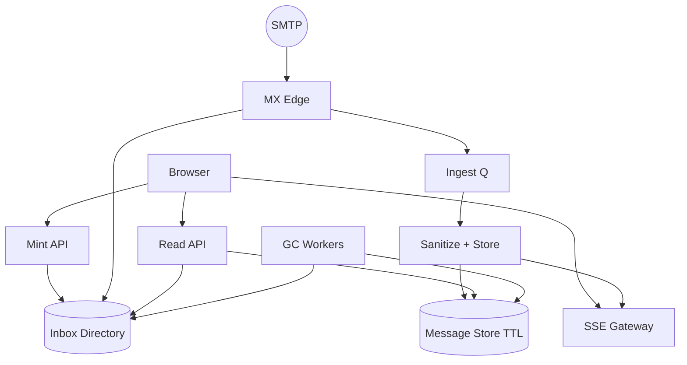
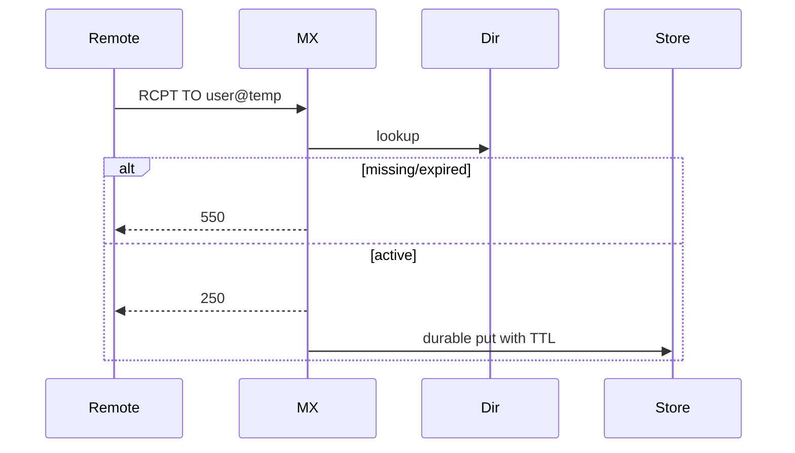

# System Design: Disposable Email with Expiring Inboxes

> **Focus areas:** Address minting · MX receive · Short TTL GC · Abuse/spam · Privacy · Read UX · Rate limits · No long-term PII  
> **Style:** End-to-end product design with progressive scale (10× → 100× → 1,000×)  
> **Quality bar:** Expiration is correct; abuse economics; minimal retention; progressive scale  
> **Interview theme:** Senior / Staff — **Guerrilla Mail / Temp-Mail class** disposable inboxes

---

## Table of Contents

1. [Clarify Requirements (Interview Q&A)](#1-clarify-requirements-interview-qa)
2. [Back-of-the-Envelope Estimation](#2-back-of-the-envelope-estimation)
3. [High-Level Design](#3-high-level-design)
4. [Architecture Diagram](#4-architecture-diagram)
5. [Design Deep Dive](#5-design-deep-dive)
6. [Wrap-Up](#6-wrap-up)
7. [Deeper / Related Interview Questions](#7-deeper--related-interview-questions)
8. [Appendices](#8-appendices)

---

## 1. Clarify Requirements (Interview Q&A)

Goal: design a **disposable email service** where users mint short-lived addresses, receive mail for a TTL (minutes–hours), read messages in a web UI, and data is **securely expired**—while surviving being a spam magnet.

### 1.0 What this is / is not

| Dimension | This doc | Not this |
|-----------|----------|----------|
| Job | Ephemeral inboxes for verification/privacy | Full Gmail with long-term storage |
| Identity | Often anonymous / cookie session | Strong KYC accounts (optional) |
| Retention | Hours max | Years of archive |
| Send | Usually **receive-only** MVP | Full outbound SMTP identity |

### 1.1 Functional Requirements

| # | Question | Expected answer | Design implication |
|---|----------|-----------------|--------------------|
| F1 | Create inbox? | Random address or user-chosen slug | Namespace + reservation |
| F2 | TTL? | 10 min – 24h configurable | Expiration + GC |
| F3 | Auth? | Secret token URL / cookie | Capability URLs |
| F4 | Receive? | MX for `*.temp.example` | SMTP ingest |
| F5 | Read UI? | List messages; view HTML sanitized | XSS safety critical |
| F6 | Attachments? | Optional small; or strip | Malware risk |
| F7 | Extend TTL? | Maybe once | Abuse controls |
| F8 | Custom domain? | Phase 2 | Multi-tenant MX |
| F9 | Push/live? | SSE/poll for new mail | Light realtime |
| F10 | Outbound send? | Out of MVP | Prevent abuse relay |
| F11 | Search? | Not needed | Skip heavy index |
| F12 | API? | Create/list/get/delete | For automation |
| F13 | Captcha? | On create under abuse | Bot defense |
| F14 | Transparency? | Public random vs private token | Privacy modes |

**MVP scope:**

1. Mint inbox with TTL + access token.  
2. MX receives mail for that address until expiry.  
3. Web UI polls/SSE shows new messages.  
4. Sanitize HTML; block scripts.  
5. Hard delete on expiry (mailbox + blobs).  
6. Rate limits on create + per-inbox receive.  
7. Receive-only (no send).  
8. Basic metrics/abuse dashboards.

**Out of MVP:** long-lived accounts; outbound mail; perfect deliverability as a “real” ISP; full-text search; enterprise compliance archives.

### 1.2 Non-Functional Requirements

| # | NFR | Target |
|---|-----|--------|
| N1 | Create inbox | p99 < 100ms |
| N2 | Mail visible | p50 < 2s after SMTP accept |
| N3 | Expiration accuracy | Delete within minutes of TTL |
| N4 | Durability within TTL | No loss before expiry |
| N5 | Availability | Best-effort free tier OK; still multi-AZ |
| N6 | Security | No XSS; capability URL entropy high |
| N7 | Privacy | Minimal logs; TTL sacred |
| N8 | Abuse | Cost of spam storage bounded |

### 1.3 Cases

| Case | Behavior |
|------|----------|
| Address taken | Reject or suggest alternate |
| TTL expires mid-read | 410 Gone |
| Spam flood to inbox | Per-inbox size/count caps; drop overflow |
| XSS HTML mail | Sanitize aggressively |
| Token leak | Short TTL limits damage; rotate on demand |
| MX retry after expiry | Reject 550 user unknown |
| User extends TTL | Cap max lifetime |
| Attachment malware | Strip or AV; prefer disable in MVP |
| Enumeration of addresses | Rate limit; unpredictable tokens |
| Legal takedown | Kill switch by address/domain |

### 1.4 Progressive scale

| Metric | Baseline | 10× | 100× | 1,000× |
|--------|----------|-----|------|--------|
| Inboxes created / day | 100K | 1M | 10M | 100M |
| Active inboxes | 20K | 200K | 2M | 20M |
| Msgs / day | 500K | 5M | 50M | 500M |
| Peak SMTP attempts / s | 200 | 2K | 20K | 200K |
| Avg TTL | 1h | 1h | 1h | 1h |
| Avg msgs / inbox | 3 | 3 | 5 | 5 |
| Peak UI polls / s | 1K | 10K | 100K | 1M |

**Jumps:** 10× = dedicated MX + GC workers; 100× = sharded mailbox by address hash; 1,000× = anycast MX, aggressive early spam drop, poll→push.

### 1.5 Scope repeat-back

> Build **expiring disposable inboxes**: mint address+token, receive via MX for TTL, sanitized read UI, hard GC on expiry, receive-only, abuse-bounded—scaled by sharding and aggressive drop policies.

---

## 2. Back-of-the-Envelope Estimation

```text
100K inboxes/day × 1h TTL → roughly concurrent ≈ 100K/24 ≈ 4K? 
Better: if uniform 1h TTL and 100K/day ⇒ create rate 1.16/s → steady active ≈ 1.16×3600 ≈ 4K
At 10M/day: active ≈ 400K inboxes

500K msgs/day × 20 KB ≈ 10 GB/day written; deleted within hours → storage steady state small
Steady storage ≈ ingest_rate × TTL
500K/86400 × 20KB × 3600 ≈ 400 MB order — tiny vs Gmail
BUT spam attempts can be 10–100× — edge must drop early
```

### Hot keys

Random inboxes usually fine; predictable slugs (`john`) get hammered — rate limit and captcha.

### Cost

Bandwidth + SMTP CPU dominate if spam not dropped early; storage should not grow unbounded (GC correctness is cost control).

---

## 3. High-Level Design

### 3.1 Planes

| Plane | Role |
|-------|------|
| Control | Mint/expire inboxes |
| MX data | Receive mail |
| Read API/UI | Capability auth |
| GC | Delete expired |

### 3.2 Components

1. **Mint API** — create address, token, TTL.  
2. **Directory** — address → inbox metadata (TTL, token hash).  
3. **MX Edge** — accept/reject.  
4. **Ingest Workers** — parse, sanitize, store.  
5. **Message Store** — short TTL tables / KV.  
6. **Read API** — list/get with token.  
7. **SSE/Poll Gateway**.  
8. **GC / TTL Sweeper** (+ native TTLs).  
9. **Abuse / Captcha / Limits**.  
10. **HTML Sanitizer**.

### 3.3 APIs

```text
POST /v1/inboxes { "slug"?: "random", "ttl_seconds": 3600 }
→ { address, token, expires_at }

GET  /v1/inboxes/{address}/messages   Authorization: Bearer <token>
GET  /v1/inboxes/{address}/messages/{id}
DELETE /v1/inboxes/{address}          // early destroy
GET  /v1/inboxes/{address}/events     // SSE
```

### 3.4 Data model

```text
inboxes(address, token_hash, created_at, expires_at, msg_count, bytes, flags)
messages(address, msg_id, received_at, from, subject, body_ref, size)
```

Prefer stores with native TTL (DynamoDB/Cassandra/Redis+disk) for messages.

### 3.5 Trade-offs

| Topic | Choice | Why |
|-------|--------|-----|
| Public inbox without token | **No** for private mode | Privacy |
| Random vs user slug | Random default | Enumeration |
| Keep spam | Cap then drop | Cost |
| Outbound | Forbidden MVP | Relay abuse |
| Rich HTML | Sanitize | XSS |

**Deal-breaker:** GC that only soft-deletes forever; or open relay send.

---

## 4. Architecture Diagram



### Sequence: receive



---

## 5. Design Deep Dive

### 5.1 Reliability

**Invariants**

1. After 250, message stored with expiry ≤ inbox expiry.  
2. Expired address rejects new RCPT.  
3. GC deletes messages + blobs; directory tombstone until MX caches clear.  
4. Tokens stored hashed (like passwords).  
5. HTML sanitized before persist or before serve (prefer before serve + store raw carefully—still sanitize serve path).  
6. No outbound SMTP from product.  
7. Caps: max msgs/bytes per inbox.

**Delivery:** at-least-once ingest; UI dedupe by msg_id.  
**Ordering:** per-inbox received_at order.  
**Offline:** N/A for servers; clients poll.  
**Expiration races:** MX checks `expires_at` at RCPT and at store; GC is idempotent.

### 5.2 Scalability

| Scale | Moves |
|-------|-------|
| 1× | Redis/Dynamo + small MX |
| 10× | Separate ingest workers; SSE |
| 100× | Shard by hash(address); anycast MX |
| 1000× | Early RBL/spam drop; regional MX; captcha farms |

**Polling storm:** exponential backoff; prefer SSE/websocket per active viewer only.

### 5.3 Maintainability

- TTL job monitoring (oldest expired-not-deleted gauge).  
- Sanitizer updates.  
- Domain reputation monitoring (your MX domain will be blocklisted often—rotate domains).  
- Chaos: GC pause → storage growth alert.

### 5.4 Abuse economics

Disposable mail is used for spam signups **and** receives spam. Bound cost with caps, captchas, proof-of-work optional, premium private inboxes.

### 5.5 Privacy

- Minimal IP logging TTL.  
- Capability URLs with high entropy.  
- Optional “private inbox” not on public random list pages (if product has those—prefer none).

### 5.6 Deal-breakers

1. Forever retention.  
2. Sending mail.  
3. Serving raw unsanitized HTML.  
4. Predictable tokens.  
5. Unbounded per-inbox storage.

---

## 6. Wrap-Up

| Decision | Choice |
|----------|--------|
| Model | Capability-address + TTL |
| Store | Native TTL KV/column |
| Send | None |
| Scale | Shard address; drop spam early |

**Phases:** mint/receive/UI → SSE → multi-domain rotation → private paid tier.

> “Disposable email is a **TTL cache for SMTP** with XSS and abuse as main enemies; GC correctness is the product.”

---

## 7. Deeper / Related Interview Questions

**Q1. Why receive-only?**  
Outbound would make you a spam relay—catastrophic reputation/legal risk.

**Q2. How to implement TTL deletion reliably?**  
Native store TTL + sweeper reconciler for blobs/directory.

**Q3. Address entropy?**  
≥64 bits random local-part; avoid dictionary words.

**Q4. Can users choose `admin@`?**  
Reserve dangerous names; rate-limit popular slugs.

**Q5. HTML sanitization library failure?**  
CSP on UI; iframe sandbox; strict allowlist tags.

**Q6. What if GC lags 1 hour?**  
Storage/cost spike; alert on `expired_but_present` metric; autoscale sweepers.

**Q7. MX clustered how?**  
Stateless edge checking shared directory; anycast.

**Q8. Should you store raw MIME?**  
Short TTL yes for debugging; still sanitize display.

**Q9. Captcha when?**  
Create inbox; sometimes on high-risk ASNs.

**Q10. Domain blocklisted?**  
Pool of domains; reissue addresses; communicate to users.

**Q11. SSE vs poll?**  
SSE for open UI; poll fallback; limit connections per inbox.

**Q12. Sharding key?**  
`hash(address)` for messages and directory.

**Q13. Legal requests?**  
Data may already be expired—design truthfulness; short retention policy published.

**Q14. Attachment policy?**  
MVP strip; or size ≤100KB images only.

**Q15. Idempotent SMTP retries?**  
Dedupe by Message-ID within inbox.

**Q16. How does this differ from Gmail?**  
No long-term account, no search at scale, no send, TTL GC primary.

**Q17. Rate limit receive?**  
Per-inbox cps and total bytes; 452 mailbox full.

**Q18. Clock skew on expiry?**  
Server time SoT; lean expire early on edges.

**Q19. Multi-region?**  
Directory global with short caching; messages in regional store tied to mint region OR replicate with TTL.

**Q20. Token in URL vs header?**  
Prefer Authorization header; fragment tokens avoid referrer leak.

**Q21. Public “recent inboxes” pages?**  
Avoid—privacy nightmare.

**Q22. Cost DoS via large mails?**  
Reject >N MB at SMTP DATA.

**Q23. Unicode addresses?**  
Normalize; maybe disable SMTPUTF8 for simplicity.

**Q24. Monitoring golden signals?**  
Creates, accepts, rejects, GC lag, sanitize errors, active SSE.

**Q25. Canary domains?**  
Yes for MX software updates.

**Q26. Proof of work?**  
Optional on free mint under attack.

**Q27. Relation to email delivery platform?**  
Opposite direction; you are destination MX.

**Q28. Backup?**  
Usually none—product is ephemeral; don’t fight the product.

**Q29. User extends TTL forever?**  
Cap max; paid tier higher.

**Q30. Staff signal?**  
Bounded retention math + abuse economics + XSS, not “mini-Gmail.”

---

## 8. Appendices

### A. Reject codes

```text
550 expired / unknown
452 mailbox full (cap)
421 temporary greylist under load (careful)
```

### B. GC algorithm

```text
periodically: list inboxes where expires_at < now
delete messages by prefix; delete blobs; delete inbox row
emit metric deleted_count
```

### C. Related

Gmail · Email delivery · Abuse prevention · Pastebin-style TTL systems

### D. Steady-state storage math (interview favorite)

```text
active_inboxes ≈ create_rate × avg_TTL
storage ≈ active_inboxes × avg_msgs × avg_msg_size
At 10M creates/day, TTL 1h:
create_rate ≈ 116/s
active ≈ 116 × 3600 ≈ 4.2e5 inboxes
If 5 msgs × 15KB: storage ≈ 4.2e5 × 5 × 15KB ≈ 31.5 GB hot
Spam attempts may be 50× — if accepted, storage explodes → caps + early reject
```

### E. Sanitizer policy

```text
Allow: b,i,p,br,ul,ol,li,a[href],img[src] (optional)
Strip: script, iframe, object, on* attributes, javascript: URLs
Rewrite links through redirect warning page (optional)
CSP: default-src 'none'; img-src https:; style-src 'unsafe-inline'
```

### F. Failure drills

1. GC stopped 2h — alert on storage growth slope.  
2. Directory cache serves stale active after expire — MX double-check DB.  
3. Sanitizer bug — kill switch to plaintext only.  
4. Spam flood — lower global caps; enable captcha.  
5. Domain RBL — failover domain pool.

### G. Progressive narrative

**1×:** single region Dynamo/Redis + postfix.  
**10×:** ingest workers + SSE.  
**100×:** sharded stores; anycast MX; domain pool.  
**1000×:** extreme early drop; PoW; regional cells.

### H. Extended Qs

**Q31. Why hash tokens?** Same as passwords — DB leak resilience.  
**Q32. Can you use Bloom filters for address existence?** Yes at MX with TTL risk of false positives→450.  
**Q33. How to page messages?** Cursor by received_at + msg_id.  
**Q34. Do you need Kafka?** Optional at 100× for ingest decoupling.  
**Q35. What’s the #1 outage cause?** Usually abuse traffic or GC bugs — design for both.

### I. Comparison table

| System | Retention | Send | Auth |
|--------|-----------|------|------|
| Gmail | Years | Yes | Account |
| Disposable | Hours | No | Capability token |
| ESP | Days metadata | Yes (tenant) | API keys |

### J. Interview closing

> “Ephemeral SMTP inbox: capability URLs, native TTLs, sanitize HTML, refuse outbound, and bound abuse with caps—the GC metric is a pager.”

### D. Latency budget

```text
Client → edge RTT: 20–80ms
Authz + idempotency lookup: 5–15ms
Append log quorum: 10–30ms
Fan-out directory lookup: 5ms
Gateway hop to peer: 5–20ms
Total p50 often 50–150ms in-region after network
Budget alarms: persist p99, fan-out p99, sync p99 separately
```

### E. Failure drills

1. Gateway SIGKILL — clients reconnect; sync fills gaps.  
2. Conversation cell pause — sender errors with retry-after; no split brain.  
3. Push provider down — messages still sync on open.  
4. Session directory stale — fan-out miss; peer syncs within seconds.  
5. Duplicate client_msg_id replay — single seq.

### F. Backpressure & load shed

```text
If fan-out queue lag high: disable typing/presence first
Then delay push for mute-able categories
Never drop persist of ACK path without explicit 503 to sender
Rate-limit sync storms: token bucket per user
```

### G. Security checklist

- Authn on every WS message  
- Membership/block checks server-side  
- Media URLs signed + short TTL  
- Rate limits anti-spam  
- Report/block pipeline  
- E2EE hooks: store ciphertext only when enabled  

### H. Progressive scale narrative

**1×:** modular monolith, Redis pubsub, PG/Cassandra log.  
**10×:** gateway fleet, Kafka, session directory.  
**100×:** home cells for inboxs, regional gateways.  
**1000×:** cold tiers, extreme conn packing, careful multi-device multipliers.

### I. Worked reconnect example

```text
Client last_seq=100; offline 2h; 40 new msgs
On resume: GET after_seq=100 → apply 101..140 in order
Push may have woken with collapse summary — still sync
If payload truncated, fetch bodies by seq range
```

### J. Extended deeper questions

**Q31. Why not use Kafka as the client-facing log?**  
Kafka great internally; clients need inbox semantics, authz, per-user cursors—wrap it.

**Q32. How do you migrate inbox to another cell?**  
Quiesce writes, replicate log, flip directory, drain.

**Q33. Message search?**  
Async indexer; authz filter; eventual.

**Q34. Sticky online notifications vs mute?**  
Per-inbox mute stored in user_conv_state; push suppressor.

**Q35. What’s the biggest disposable scaling myth?**  
That disposable needs hybrid fan-out like huge groups—it doesn’t; devices and connections dominate.

### K. Interview closing checklist

- Persist before ACK  
- Seq SoT  
- Sync heals, push wakes  
- Multi-device cursors  
- Blocks on send path  
- Home cell single-writer  
