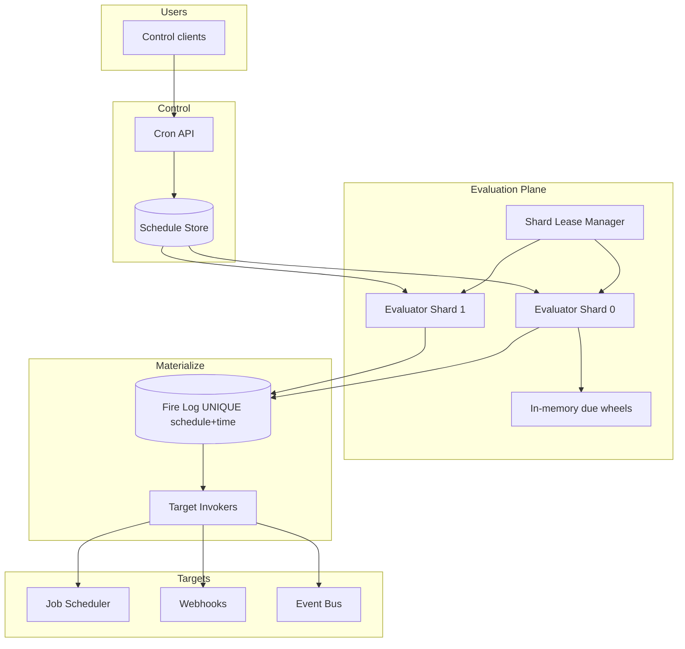
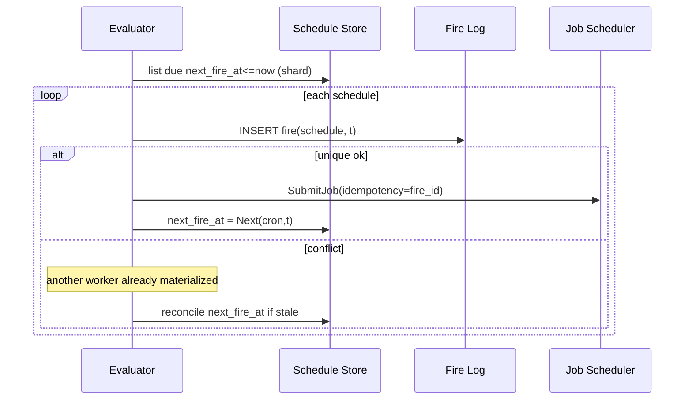
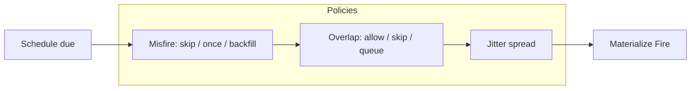

# System Design: Distributed Cron

> **Focus areas:** Cron expressions · Timezones · Catch-up policies · Exactly-once *firing* vs at-least-once · Shard ownership · Missed runs · Calendar edge cases  
> **Style:** End-to-end product design with progressive scale (10× → 100× → 1,000×)  
> **Interview theme:** Replace crontab on one box with a **correct, highly available schedule → run materializer** used by thousands of services

---

## Table of Contents

1. [Clarify Requirements (Interview Q&A)](#1-clarify-requirements-interview-qa)
2. [Back-of-the-Envelope Estimation](#2-back-of-the-envelope-estimation)
3. [High-Level Design](#3-high-level-design)
4. [Architecture Diagram](#4-architecture-diagram)
5. [Design Deep Dive](#5-design-deep-dive)
6. [Wrap-Up](#6-wrap-up)
7. [Deeper / Related Interview Questions](#7-deeper--related-interview-questions)

---

## 1. Clarify Requirements (Interview Q&A)

Goal: design **distributed cron**—persist recurring schedules (cron / interval / calendar), evaluate due ticks reliably across a fleet, and **materialize job runs** (or emit events) without double-firing under failover—and define missed-run policy.

### 1.0 What this is / is not

| Dimension | This doc | Not this |
|-----------|----------|----------|
| Job | Recurring schedule definitions + tick materialization | Worker execution runtime (uses job scheduler) |
| Calendar | Cron, TZ, DST, optional RRULE | Full workflow DAG |
| Output | Create `Run` / submit job / emit event per tick | Guarantee business side effects once |
| Ownership | Sharded schedule leases | Single crontab SSH host |
| Focus | **Scheduling correctness** | Payload compute |

### 1.1 Functional Requirements

| # | Question | Typical answer | Implication |
|---|----------|----------------|-------------|
| F1 | Expression language? | 5/6-field cron + intervals; TZ required | Canonical parser; store TZ |
| F2 | What happens on fire? | Submit to job scheduler / HTTP webhook / Kafka | Pluggable targets; at-least-once invoke |
| F3 | Missed runs while down? | Policy: `skip`, `fire_once_catchup`, `backfill_all` (capped) | Persist `last_fire_at` / `next_fire_at` |
| F4 | Overlap if prior still running? | Policies: skip, allow, queue | Overlap policy per schedule |
| F5 | Exactly-once fire? | **Aim for exactly-once materialization** of run_id per (schedule, scheduled_time) | Idempotent run keys |
| F6 | Pause/resume/edit? | Yes; version schedule | Generation numbers |
| F7 | One-shot? | Optional `until` / count | Expiry |
| F8 | Fan-out? | Many schedules; some every second | Hot schedule isolation |
| F9 | Audit? | Every tick decision logged | Fire log |
| F10 | Multi-tenant? | Yes | Quotas on schedules & fire rate |
| F11 | Holidays? | Phase 2 calendars | Optional exclusion sets |
| F12 | Manual trigger? | Yes “run now” | Separate ad-hoc run |
| F13 | Jitter? | Optional spread | Stampede control |
| F14 | Misfire grace? | Fire if detected within grace window | Config |

**MVP scope:**

1. CRUD schedules: cron + timezone + target + policies (misfire, overlap).
2. Compute `next_fire_at`; durable store.
3. Sharded evaluators own schedules via leases.
4. On due: idempotently create `Fire` record keyed by `(schedule_id, scheduled_fire_time)` then invoke target.
5. Update `last_fire_at` / `next_fire_at`.
6. Pause/resume; disable; list upcoming fires.
7. Metrics: lag, misfires, duplicate-suppressed.

**Out of MVP:** holiday calendars, dependency between crons, UI builder, sub-second precision SLOs globally, active-active multi-region writes.

### 1.2 Non-Functional Requirements

| # | NFR | Target |
|---|-----|--------|
| N1 | Fire lateness p99 | < 1–5s for ≥1m granularity |
| N2 | Availability | 99.99% evaluate loop |
| N3 | Durability | No lost schedule definitions |
| N4 | Materialization | ≤1 successful Fire row per scheduled instant (exactly-once *record*) |
| N5 | Target invoke | At-least-once (retries) |
| N6 | DST correctness | Defined behavior; tests mandatory |
| N7 | Scale | Millions of schedules |

### 1.3 Cases

**Happy:** cron `0 * * * *` America/Los_Angeles → hourly Fire → job submit.  
**Edit:** change cron → recompute next; in-flight tick uses generation.  
**Pause:** no fires; resume with misfire policy.

| Case | Behavior |
|------|----------|
| Evaluator crash after Fire insert before target | Retry invoke; target idempotent by fire_id |
| Two evaluators brief overlap | Unique key on (schedule_id, scheduled_time) wins |
| DST spring forward (skip hour) | Cron times in gap don't exist → skip |
| DST fall back (repeat hour) | Ambiguous local times → use TZ rules / scheduled_time UTC instant |
| Schedule every 1s × 100K | Separate high-freq path / aggregate |
| Backfill 3 days of 1-min cron | Cap backfill count; alert |
| Target 500s | Retry with backoff; Fire status pending→delivered |
| Clock skew | NTP; hybrid: compare `next_fire_at` watermark |
| Overlap skip | If prior Fire still running, skip new (policy) |
| Tenant deletes schedule | Cancel future; in-flight complete |

### 1.4 Scales

| Metric | Baseline | 10× | 100× | 1,000× |
|--------|----------|-----|------|--------|
| Schedules | 100K | 1M | 10M | 100M |
| Fires / day | 20M | 200M | 2B | 20B |
| Peak fires / s | 1K | 10K | 100K | 1M |
| Evaluators | 20 | 100 | 500 | 5K |
| Min granularity | 1 min | 1 min | 10s | 1s (subset) |
| Targets | Job sched / HTTP | +Kafka | multi | multi-cell |

**Jumps:** 10× shard by schedule_id; 100× fire log streaming; 1,000× cells + hierarchical evaluation (coarse then fine).

### 1.5 Etc.

- Always store **UTC instant** for `scheduled_fire_time`; TZ only for computing next from cron.
- Prefer materialize → job scheduler rather than long work in evaluator.

**Scope repeat-back:**

> Distributed cron service: TZ-aware schedules, sharded leased evaluators, exactly-once Fire materialization per scheduled instant, at-least-once target delivery, explicit misfire/overlap/catch-up policies—scaling to millions of schedules.

---

## 2. Back-of-the-Envelope Estimation

### 2.1 Evaluation cost

```text
100K schedules, avg every 15 min → ~111 fires/s average
Peak (top of hour): many align → 1K–10K/s without jitter

Evaluator loop: each shard scans due where next_fire_at <= now
Index: (shard, next_fire_at)
```

### 2.2 Storage

```text
Schedule ~500 B × 100K ≈ 50 MB
Fire log 200 B × 20M/day ≈ 4 GB/day
Retain 7–30d hot; archive
```

### 2.3 Catch-up amplification

```text
1M schedules down 1 hour, 1-min cron, backfill_all
→ 60M fires — must cap (e.g. max 10 catchup per schedule) 
```

### 2.4 Memory

Evaluators keep owned schedules' `next_fire_at` in memory heap/wheel for near horizon; reload on lease acquire.

### 2.5 Hot minute problem

```text
Top-of-hour alignment: 20% of schedules fire → need jitter, second-level spreading, or hash-based phase offset
```

---

## 3. High-Level Design

### 3.1 Domain model

```text
Schedule {
  schedule_id, tenant_id,
  cron_expr, timezone,
  payload / target { type: job|http|kafka, ... },
  misfire_policy, overlap_policy, jitter_seconds,
  state: active|paused|disabled,
  generation,
  last_fire_at, next_fire_at,
  start_at, end_at?, max_fires?
}
Fire {
  fire_id,
  schedule_id,
  scheduled_fire_time,   # canonical UTC instant of this tick
  generation,
  status: created|invoking|succeeded|failed|skipped,
  attempt_count,
  target_ref
}
```

**Idempotency key for exactly-once materialization:**

```text
UNIQUE(schedule_id, scheduled_fire_time)
```

### 3.2 APIs

| Method | Path | Purpose |
|--------|------|---------|
| POST | `/v1/schedules` | Create |
| PATCH | `/v1/schedules/{id}` | Update / pause |
| DELETE | `/v1/schedules/{id}` | Disable |
| GET | `/v1/schedules/{id}` | Get + next fires |
| POST | `/v1/schedules/{id}:run` | Ad-hoc |
| GET | `/v1/schedules/{id}/fires` | History |
| GET | `/v1/tenants/{t}/schedules` | List |

### 3.3 Cron evaluation

Use a well-tested library (don't hand-roll in prod). Algorithm sketch:

```text
function Next(cron, tz, after_utc):
  local = convert(after_utc, tz)
  candidate = cron.next(local)  # library
  return convert_to_utc(candidate, tz)  # handle gaps/overlaps per rules
```

**DST:**

| Event | Rule |
|-------|------|
| Spring gap | Skip non-existent local times |
| Fall overlap | Fire once per UTC instant; define if both local offsets match expression |

Document chosen library semantics; add golden tests for America/Los_Angeles, Europe/Paris, Asia/Kolkata.

### 3.4 Misfire / catch-up policies

| Policy | Behavior |
|--------|----------|
| `skip` | Set next to first future tick; log misfire |
| `fire_once` | One catch-up Fire for “latest missed”, then jump to future |
| `backfill` | Create Fires for each missed tick up to `max_catchup` |

**Default recommendation:** `fire_once` for most product crons; `skip` for pure metrics scrapes; `backfill` only for financial-ish with hard caps.

### 3.5 Overlap policies

| Policy | Behavior |
|--------|----------|
| `allow` | New Fire even if prior invoking |
| `skip` | Skip if open Fire exists |
| `queue` | Delay next until prior completes (may lag) |

### 3.6 Trade-offs

| Approach | Pros | Cons |
|----------|------|------|
| Leader + all schedules | Simple | Ceiling |
| **Shard leases** | Scales | Rebalance |
| Quartz clustered JDBC | Known | Ops/DB load |
| K8s CronJob | Easy | Poor at millions / weak catch-up |
| Delay-queue per next tick | Reuses MQ | Update-heavy on edit |

**Deal-breakers:** evaluate without durable Fire key; ignore TZ; unbounded backfill; dual-active regions same schedule.

### 3.7 Firing pipeline

```text
1. Evaluator selects schedules with next_fire_at <= now (owned shard)
2. scheduled_time = next_fire_at (the tick's nominal time)
3. INSERT Fire ... ON CONFLICT DO NOTHING
4. If inserted: invoke target with fire_id (at-least-once)
5. Compute new next_fire_at from scheduled_time (not from wall now only—avoid drift)
6. CAS schedule next/last with generation check
```

**Drift control:** always advance from `scheduled_fire_time`, not `now`, so consistent cadence.

### 3.8 Exactly-once firing vs at-least-once invoke

- **Exactly-once Fire row** per `(schedule, scheduled_time)` via unique constraint.
- **At-least-once target delivery** via retries until ack or terminal fail.
- Downstream job scheduler should use `fire_id` as idempotency key.

This is the staff-level distinction interviewers want.

---

## 4. Architecture Diagram







---

## 5. Design Deep Dive

### 5.1 Reliability

#### Lost fires prevention

Durable schedules; evaluators redundant via shard HA; Fire unique key; durable outbox for invoke if needed.

#### Duplicate fires prevention

Unique `(schedule_id, scheduled_fire_time)`. On lease rebalance, both nodes may try—only one insert wins.

#### Invoke retries

Fire status machine; exponential backoff; DLQ for poison targets; alerting.

#### Clock / watermark

Per-shard `highwatermark_processed_time` for observability; do not skip ahead without policy.

#### Generation fencing

```text
Update schedule SET next=?, generation=generation
WHERE id=? AND generation=?
```

Edits increment generation; stale evaluator refreshes.

### 5.2 Scalability

#### Sharding

```text
shard = hash(schedule_id) % N
N grows; consistent hash optional for less movement
Lease duration 10–30s with HB
```

#### High-frequency schedules

Separate pool; or require interval ≥10s globally, allow 1s only in dedicated tier.

#### Hierarchical timing

Far `next_fire_at` not in RAM; load into wheel when within horizon H (e.g. 5–15 min).

#### Stampede

Default jitter 0–jitter_seconds based on hash(schedule_id) for deterministic spread **or** random; document impact on “exact wall alignment”.

#### Multi-region

Active-passive or home-region per tenant. Active-active needs global unique fire coordination—usually avoid.

### 5.3 Maintainability

#### Observability

`cron_eval_lag_seconds`, `fires_created`, `fires_duplicate_conflicts`, `misfire_count`, `invoke_fail`, `dst_anomaly_total`.

#### Testing

Golden vectors for DST; chaos kill evaluators at :00; verify unique fires.

#### Migrations

Cron parser upgrades behind flag; recompute next for all in background.

#### Multi-tenant

Max schedules/tenant; max fire rate; noisy schedule quarantine.

---

## 6. Wrap-Up

| Decision | Choice |
|----------|--------|
| Materialization | Exactly-once Fire via unique key |
| Delivery | At-least-once to target with fire_id idempotency |
| Ownership | Sharded leases |
| Time | TZ stored; UTC instants |
| Missed | Explicit capped policies |
| Work | Hand off to job scheduler |

**Phases:** (0) single leader + DB → (1) shard leases + Fire unique → (2) wheels + jitter + quotas → (3) cells.

> Cron’s hard part isn’t parsing expressions—it’s **idempotent tick materialization under failover**, DST, and catch-up policy.

---

## 7. Deeper / Related Interview Questions

**Q1. How do you get exactly-once cron in distributed systems?**  
A: Exactly-once *materialized fire record* via unique key; at-least-once *effects* unless target idempotent.

**Q2. Should next be computed from now or last scheduled time?**  
A: From last `scheduled_fire_time` to avoid drift/skipping.

**Q3. K8s CronJob vs this?**  
A: K8s fine for hundreds; weak multi-tenant policies, catch-up control, millions of schedules.

**Q4. Quartz RAMJobStore?**  
A: Not HA durable; JDBC store becomes DB hotspot—same sharding problems.

**Q5. Design catch-up after 24h outage.**  
A: Apply policy with caps; alert; never silently create unbounded fires.

**Q6. Overlap with long jobs.**  
A: Overlap=skip or queue; monitor lag.

**Q7. Cron `*/1 * * * *` × 1M schedules.**  
A: Reject or dedicated tier; cost = 16K fires/s average.

**Q8. Timezone database updates.**  
A: Pin tzdb version; recompute next on upgrade.

**Q9. How to shard hot tenant?**  
A: Many schedules hash across shards; per-tenant fire rate limit.

**Q10. Manual run vs scheduled tick.**  
A: Separate fire_id; don’t reuse scheduled_time key.

**Q11. Pause semantics.**  
A: Evaluator ignores; on resume apply misfire policy.

**Q12. Sub-second cron?**  
A: Usually wrong tool; use stream/loop; if needed specialized path.

**Q13. Consistent hashing vs mod N?**  
A: Consistent hash less movement; mod N simpler with coordinated migration.

**Q14. Fire log growth.**  
A: TTL + archive; partitions by day.

**Q15. Security for HTTP targets?**  
A: Egress allow-list; signed webhooks; SSRF protections.

**Q16. Exactly-once across regions?**  
A: Need global coordination; prefer single writer home.

**Q17. Jitter vs “fire at :00 exactly”.**  
A: Product choice; financial cutoffs may forbid jitter.

**Q18. How to detect stuck evaluator?**  
A: Shard lag metric `now - min(next_fire_at)` for active schedules.

**Q19. Updating cron expression mid-tick.**  
A: Generation bump; current tick finishes with old gen or abort if not materialized.

**Q20. Relationship to delayed message queue.**  
A: Can enqueue next delay each fire; still need schedule state & catch-up—cron layer remains.

**Q21. Calendar RRULE?**  
A: Harder; store DTSTART; use library; same Fire unique key.

**Q22. Backfill storm prevention.**  
A: Global catchup budget tokens; per-schedule max.

**Q23. Monitoring missed business SLA.**  
A: Define “fire by scheduled+SLO”; page on lateness.

**Q24. Idempotency key design.**  
A: `fire_id` or `schedule_id+scheduled_fire_time` ISO8601.

**Q25. Leader election for all schedules?**  
A: Works to ~tens of thousands; then shard.

**Q26. Seconds field in cron?**  
A: Optional 6-field; increases load; default off.

**Q27. What if target job scheduler down?**  
A: Fire stays invoking; retry; schedule still advances **or** block advance—product choice (prefer advance + retry invoke to avoid stall pileup).

**Q28. Deterministic next across nodes?**  
A: Same parser+tzdb+algorithm version; store computed next durably.

**Q29. Can two fires share same wall clock second?**  
A: Yes different schedules; uniqueness is per schedule.

**Q30. Biggest production incident class?**  
A: DST bugs + unbounded catch-up after deploy outage + top-of-hour stampede.

---

## Appendix A — Evaluate loop pseudocode

```text
function EvalLoop(shard):
  while own(shard):
    due = store.list(shard, next_fire_at <= now, limit=K)
    for s in due:
      if s.paused: continue
      t = s.next_fire_at
      if overlap_skip and open_fire(s): 
        bump_next(s, t); continue
      inserted = fires.insert_unique(s.id, t, s.generation)
      if inserted:
        enqueue_invoke(fire_id)
      s.last = t
      s.next = Next(s.cron, s.tz, t)
      store.cas(s)
    sleep(small) or wait on wheel
```

## Appendix B — DST test vectors (illustrative)

| TZ | Local expression | UTC expectation notes |
|----|------------------|-----------------------|
| America/Los_Angeles | `0 2 * * *` on spring forward day | May skip |
| America/Los_Angeles | `0 1 * * *` on fall back day | Define single UTC |
| UTC | `0 * * * *` | Trivial hourly |

## Appendix C — Capacity

```text
fires/s ≈ Σ 1/interval_i
evaluator capacity ≈ (scan+insert+invoke_enqueue)/core
shards ≥ 2 × peak_fires / per_shard_capacity
```

## Appendix D — API create example

```json
{
  "name": "hourly-settle",
  "cron": "0 * * * *",
  "timezone": "America/New_York",
  "target": {"type": "job", "queue": "billing", "job_type": "settle"},
  "misfire_policy": "fire_once",
  "overlap_policy": "skip",
  "jitter_seconds": 30
}
```

## Appendix E — Fire status machine

```text
created → invoking → succeeded
                  ↘ failed → (retry) invoking
                  ↘ skipped
```

## Appendix F — Comparison

| System | HA | TZ | Catch-up | Scale |
|--------|----|----|----------|-------|
| crontab | No | Host | Manual | Tiny |
| K8s CronJob | Partial | Limited | Limited | Small |
| Cloud Scheduler | Yes | Yes | Vendor | Medium |
| This | Sharded | Yes | Explicit | Large |

## Appendix G — Failure injection

- Kill evaluator at second 0  
- Double lease  
- tzdb bump  
- Target 503 storm  
- Pause/resume around DST  
- Backfill policy misconfig  

## Appendix H — Decision tree (interview)

```text
Need recurring time triggers?
  └─ Need DAG? → workflow engine
  └─ Need one-shot delay? → delayed queue / job scheduler
  └─ Need calendar cadence + policies? → distributed cron → submit jobs
```
