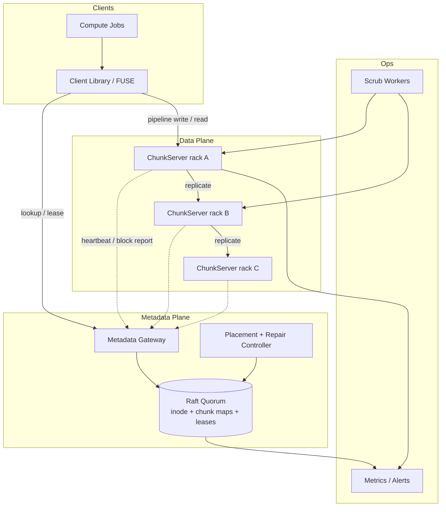
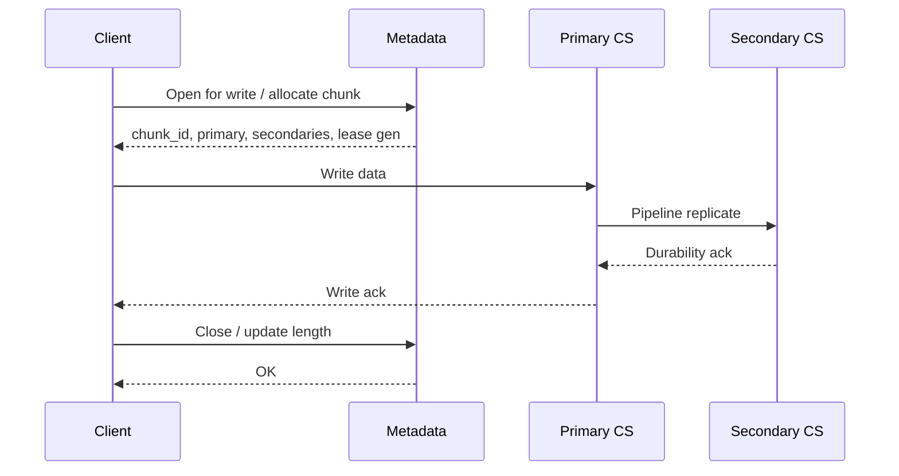

# System Design: Distributed Filesystem

> **Focus areas:** Metadata plane · Chunk/block placement · Replication & repair · Leases · Consistency · Client caching · Progressive scale  
> **Style:** End-to-end infrastructure design with progressive scale (10× → 100× → 1,000×)  
> **Interview theme:** GFS / HDFS / Colossus-class distributed filesystem — not a consumer sync product  
> **Quality bar:** Explicit metadata vs data-plane split; chunking + delta implications; deal-breakers for single-master and under-replication

---

## Table of Contents

1. [Clarify Requirements (Interview Q&A)](#1-clarify-requirements-interview-qa)
2. [Back-of-the-Envelope Estimation](#2-back-of-the-envelope-estimation)
3. [High-Level Design](#3-high-level-design)
4. [Architecture Diagram](#4-architecture-diagram)
5. [Design Deep Dive](#5-design-deep-dive)
6. [Wrap-Up](#6-wrap-up)
7. [Deeper / Related Interview Questions](#7-deeper--related-interview-questions)

---

## 1. Clarify Requirements (Interview Q&A)

Bound the problem: POSIX-ish cluster filesystem for large sequential/analytical workloads vs object store vs Dropbox sync.

### 1.0 What this is / is not

| Dimension | This doc | Not this |
|-----------|----------|----------|
| Product | Cluster DFS (GFS/HDFS/Colossus-like) | Dropbox / Drive client sync |
| Interface | Path + open/read/write/append/close; optional FUSE | Pure S3 PutObject/GetObject API (related but different) |
| Workload | Large files, sequential scans, append-heavy analytics, ML checkpoints | Tiny random IOPS database files as primary |
| Consistency | Per-file lease / append semantics; strong metadata | CRDT multi-writer docs |
| Ops unit | Namespace + chunkservers + repair | CDN edge cache alone |

### 1.1 Functional Requirements

| # | Question to ask | Expected / typical interviewer answer | Design implication |
|---|-----------------|----------------------------------------|--------------------|
| F1 | Who are the clients? | Batch jobs, Spark/Flink, training workers, internal services | Client library with striping; not only FUSE |
| F2 | File sizes? | Mix: many multi-GB; some TB; also small config/manifest files | Large chunk size (64–256 MiB) + small-file optimization |
| F3 | Primary access pattern? | Sequential read/write and append; random reads secondary | Chunked layout; pipeline writes; readahead |
| F4 | Namespace model? | Hierarchical paths; mkdir, rename, delete, list | Metadata tree / inode table separate from chunk store |
| F5 | Replication? | RF=3 default; rack-aware; configurable | Placement policy + under-replicated scanner |
| F6 | Consistency on concurrent writers? | Single-writer lease per file (or append-only multi-writer with atomic records) | Lease manager in metadata; stale writer fencing |
| F7 | Snapshots / versions? | Namespace snapshots Phase 1; full file versioning later | Copy-on-write metadata + chunk refcounts |
| F8 | Quotas? | Soft/hard per tenant / directory | Quota counters in metadata TX |
| F9 | Encryption? | At rest on chunkservers; TLS in flight | Per-chunk keys via KMS; optional client-side |
| F10 | Checksums? | End-to-end checksums required | Chunk + block checksums; client verify option |
| F11 | Multi-cluster / federation? | Single cluster MVP; federation later | Global path prefix → cluster map |
| F12 | Posix completeness? | Relaxed POSIX OK if called out (no full flock semantics) | Document append/read semantics explicitly |
| F13 | Trash / undelete? | Soft-delete with retention | Tombstones + delayed GC |
| F14 | Hot upgrade / rolling restart? | Yes — chunkservers and metadata HA | Quorum metadata; draining chunkservers |

**MVP functional scope:**

1. Hierarchical namespace: create/delete/rename files and directories.
2. Chunked file layout with configurable chunk size (default 128 MiB).
3. Write pipeline: client → primary replica → secondary replicas; commit after quorum.
4. Read: locate chunks via metadata; parallel fetch from nearest healthy replica.
5. Replication factor 3, rack-aware placement; automatic repair of under-replicated chunks.
6. Single-writer leases; append API with atomic record option.
7. Checksums; background scrubbing.
8. Soft-delete + GC of unreferenced chunks.
9. Basic quotas and authz (principal + ACL on inode).
10. Metrics: open latency, read/write BW, under-replicated count, metadata QPS.

**Out of MVP:**

- Full POSIX locks / mmap coherency across cluster
- Erasure coding (design hooks; ship RF=3 first)
- Cross-region active-active same namespace
- Consumer sync clients / conflict UI (see Dropbox doc)
- Tiering to cold object storage (Phase 1.5)

### 1.2 Non-Functional Requirements

| # | Question | Expected answer | Target |
|---|----------|-----------------|--------|
| N1 | Metadata op latency? | Interactive listing/open | p50 < 5ms, p99 < 50ms in-region |
| N2 | Data plane throughput? | Saturate NIC for sequential | ≥ 80% of link for large sequential reads |
| N3 | Availability? | Cluster usable under single rack failure | 99.9%+ data plane; metadata HA quorum |
| N4 | Durability? | Survive disk/node/rack loss | RF=3; no ack until fsync quorum (configurable) |
| N5 | Consistency? | Readers see committed length; no torn committed records | Lease + generation number fencing |
| N6 | Multi-region? | DR async replica OK for MVP | Primary region writable; secondary read-only DR |
| N7 | Security? | Mutual auth clients; encrypted disks | mTLS or token; encryption at rest |
| N8 | Cost? | Storage dominates | Later EC 6+3 ~1.5× vs RF=3 3× |

### 1.3 Cases (User Flows & Edge Cases)

**Happy paths**

1. Create file → acquire write lease → write chunks → close → release lease → readers see new length.
2. Sequential scan of TB file → client fetches chunk locations in batches → parallel reads.
3. Append from producer → primary pipelines to replicas → ack when durable.
4. Node dies → under-replication detected → re-replicate to new node → clear alarm.
5. Rename directory → metadata TX updates path; chunk locations unchanged.
6. Snapshot namespace → later restore file from snapshot via CoW metadata.

**Edge / failure cases**

| Case | Behavior |
|------|----------|
| Metadata leader dies | Quorum elects new leader; leases may expire; clients retry |
| Primary replica dies mid-write | Client gets new primary via metadata; generation bumps; old primary fenced |
| Disk bitrot | Scrub detects checksum fail → discard replica → re-replicate |
| Network partition isolates replica | Remove from live set; do not count toward quorum until catch-up |
| Hot chunk (many readers) | Cache on clients; optionally replicate extra copies / CDN for public data |
| Tiny files flood | Pack small files into shared blocks or dedicated small-file store |
| Rename races with open | Inode id stable; path lookup retries; lease on inode not path |
| Full disk on chunkserver | Mark undeployable; migrate chunks; reject new placements |
| Client holds stale lease | Generation number mismatch → write rejected |
| Catastrophic rack loss | Survive if RF=3 and rack-aware (lose ≤1 replica) |

### 1.4 Scales (Progressive)

| Metric | Baseline | 10× | 100× | 1,000× |
|--------|----------|-----|------|--------|
| Usable capacity | 10 PB | 100 PB | 1 EB | 10 EB |
| Files (namespace) | 100M | 1B | 10B | 100B |
| Chunks | ~80M | ~800M | ~8B | ~80B |
| Chunkservers | 1K | 10K | 100K | 1M (federated) |
| Metadata QPS (peak) | 10K | 100K | 1M | 10M |
| Aggregate read BW | 1 TB/s | 10 TB/s | 100 TB/s | 1 PB/s |
| Concurrent open files | 100K | 1M | 10M | 100M |
| Daily chunk repairs | 1K | 10K | 100K | 1M |
| Clusters | 1 | 1–3 | Many cells | Global federation |

**What each jump forces:**

- **10×:** Metadata HA becomes mandatory; shard secondary indexes; dedicated repair bandwidth caps.
- **100×:** Shard / partition namespace (hash or directory ranges); chunk location cache; EC for cold; cell architecture.
- **1,000×:** Federated namespaces; per-cell metadata; global directory; automated capacity forecasting; EC default for cold tiers.

### 1.5 Etc. (Constraints & Assumptions)

- **Single cloud AZ set vs on-prem?** Multi-AZ in one region for MVP.
- **Append-only vs random overwrite?** Support overwrite at chunk granularity; prefer append for logs.
- **Client trust?** Authenticated but not fully trusted — server verifies checksums/authz.
- **Hardware?** Commodity disks/SSDs; JBOD; no SAN assumption.

**Scope statement to repeat back:**

> Design a GFS/HDFS-class **distributed filesystem**: separate metadata and chunk data planes, large chunk size, RF=3 rack-aware replication, write leases with fencing, checksums and repair, starting at ~10 PB / 100M files and evolving through cells and federation to EB scale. Not a consumer sync product.

---

## 2. Back-of-the-Envelope Estimation

### 2.1 Chunk math

```text
Default chunk size C = 128 MiB
File of 1 TiB → 1 TiB / 128 MiB ≈ 8,192 chunks
100 PB usable @ RF=3 → raw ≈ 300 PB
Average file 1 GiB → files ≈ 100 PB / 1 GiB ≈ 100M files (baseline order)
Chunks ≈ 100 PB / 128 MiB ≈ 800M? Wait — usable capacity holds data once:
Chunks ≈ usable / C = 10 PB / 128 MiB ≈ 80M chunks at baseline 10 PB
```

Correct baseline: **10 PB usable → ~80M chunks**; **100M files** implies many small files (average file ≪ 100 MiB) or many empty/dir entries — both realistic. Metadata must handle **high file:chunk ratio** for small files.

### 2.2 Metadata size

```text
Inode ~256–512 B + ACLs
Chunk map entry: chunk_id → [replica locations] ~100–200 B
100M inodes × 512 B ≈ 50 GB
80M chunks × 150 B ≈ 12 GB
With indexes / versions / leases → plan **100–300 GB** metadata working set baseline
1,000× files → tens of TB metadata → must shard
```

### 2.3 Bandwidth & QPS

```text
Aggregate cluster read 1 TB/s ÷ 1K nodes ≈ 1 GB/s/node (fits 25–100 GbE)
Metadata: open = 1 lookup; large scan may batch-locate 100 chunks/RPC
Peak metadata 10K QPS → single well-tuned quorum OK; 1M QPS → sharded metadata
```

### 2.4 Repair traffic

```text
1K node cluster, 1% disks failing/year aggressively → continuous trickle
Worse: rack failure 40 nodes × 100 TB = 4 PB to re-replicate
At 10 GB/s repair budget → 4e15 / 1e10 = 400,000 s ≈ **4.6 days** — too slow
Need: parallel repair, higher fan-in, temporary RF relaxation alerts, EC later
```

### 2.5 Write amplification

```text
Client write W → RF=3 network ≈ 3W (pipeline still moves ~2W extra)
fsync-heavy small writes destroy throughput — batch / larger chunks
```

### 2.6 Client cache memory

```text
Chunk location cache: 1M entries × 200 B ≈ 200 MB/client process OK
Data cache optional; often leave to OS page cache for FUSE
```

### 2.7 Hot keys / hot chunks

Popular dataset chunk read by 10K workers → single replica NIC saturates. Mitigations: client cache, extra replicas, copy-on-read, or read from many replicas with hedged requests.

---

## 3. High-Level Design

### 3.1 Core abstractions

```text
Namespace (paths) → Inode → File metadata (length, times, ACL)
                      └── ChunkIndex[offset → chunk_id]
Chunk → immutable-ish blob of ≤ C bytes, RF replicas on ChunkServers
Lease → exclusive write token (inode, generation, expiry)
```

**Chunking:** large fixed-size chunks reduce metadata entries and improve sequential throughput. **Delta / partial rewrite:** overwrite only affected chunks; unchanged chunks keep same `chunk_id` (content-addressed optional). For append-heavy logs, prefer append to last chunk until full.

### 3.2 Why not pure object store?

| | DFS | Object store |
|--|-----|--------------|
| Rename / directories | First-class | Emulated / expensive |
| Append | Native | Usually rewrite object |
| Concurrent open | Leases | Conditional writes / versions |
| HDFS ecosystem | Drop-in | Needs connector |
| Small-file listing | Tree walks | Prefix scans |

**Choose DFS** when jobs expect paths, renames, and append. **Choose object store** for immutable blobs and simpler ops. Many orgs run both: DFS for compute scratch + lakehouse on objects.

### 3.3 Metadata service (control plane)

**Responsibilities:** inode tree, chunk maps, leases, placement decisions, delete/GC coordination, quotas.

**HA options:**

| Option | Pros | Cons | Deal-breaker when |
|--------|------|------|-------------------|
| Single primary + standby | Simple | Failover blip; scale limit | >~50–100K metadata QPS sustained |
| Raft/Paxos quorum | Strong HA | Complexity; disk for raft log | Team cannot operate quorum |
| Sharded metadata (directory ranges / hash) | Scales to billions files | Cross-dir rename hard | Need infinite single tree without planning renames |

**MVP choice:** Raft-replicated metadata quorum (3/5). **100×:** shard by top-level directory or hash(inode_id) with relocation protocol.

### 3.4 Chunkservers (data plane)

- Store chunks as files on local disk (one chunk = one or few files).
- Heartbeat to metadata with disk stats + reports of hosted chunks (or incremental).
- Serve read/write; pipeline replication.
- Scrub checksums periodically.

### 3.5 Write path (pipeline)

```text
1. Client asks metadata: allocate chunk + grant lease (or extend)
2. Metadata picks primary + secondaries (rack-aware)
3. Client sends data to primary; primary pipelines to secondaries
4. Secondaries ack primary; primary acks client after durability quorum
5. Client may notify metadata of new length on close / sync
```

**Deal-breaker:** acknowledging before replica quorum → silent data loss on primary crash.

### 3.6 Read path

```text
1. Client: lookup path → inode → chunk list for byte range
2. Pick replica (topology-aware: same rack > same AZ > remote)
3. Hedged read if slow; verify checksum
```

### 3.7 APIs (client library)

| Call | Semantics |
|------|-----------|
| `Create/Open/Close` | Inode + lease lifecycle |
| `Read(offset,len)` | Parallel chunk reads |
| `Write(offset,data)` | Requires lease; may split across chunks |
| `Append(data)` | Atomic record append optional |
| `Truncate/Delete/Rename` | Metadata TX |
| `Snapshot` | Namespace CoW |
| `GetAttr/List` | Metadata |

### 3.8 Data model (logical tables)

```text
inodes(inode_id, parent_id, name, type, mode, owner, size, mtime, lease_gen, ...)
chunks(chunk_id, inode_id, index, version, size, checksum)
replicas(chunk_id, server_id, state, disk_id)
servers(server_id, rack, az, capacity, load, last_heartbeat)
leases(inode_id, holder, gen, expiry)
```

### 3.9 Placement & topology

```text
RF=3: 1 primary local rack optional; secondaries on different racks/AZs
Avoid: all replicas on same rack
```

### 3.10 Conflict / concurrency model

DFS **does not** do Dropbox-style content merge. Concurrency = **leases + generation numbers**. Stale writer → rejected. Multi-writer collaboration belongs in app layer (or sync product).

### 3.11 Trade-off table (chunk size)

| Chunk size | Metadata | Tail latency small read | Throughput | Internal frag |
|------------|----------|-------------------------|------------|---------------|
| 4 MiB | High | Better | Worse seek amp | Low |
| 64–128 MiB | Sweet spot | OK with caching | Strong | Medium |
| 512 MiB+ | Very low | Poor for small ranges | Max sequential | High |

---

## 4. Architecture Diagram





---

## 5. Design Deep Dive

### 5.1 Reliability

**Data loss prevention**

- Quorum fsync (or equivalent) before client ack.
- Generation numbers fence old primaries.
- Checksums on write and scrub; never repair from corrupt source.
- Soft-delete + refcount GC; never delete last replica until GC proves unreferenced.

**Retries & idempotency**

- Client retries with exponential backoff; write RPCs carry `(chunk_id, version, offset, checksum)`.
- Duplicate append with client-generated record id if atomic append required.

**Rate limits & backpressure**

- Per-client write tokens; reject when cluster disk full or repair storm.
- Repair traffic capped (e.g. 10–20% of NIC) so user IO survives.

**Lease expiry**

- Short leases (30–60s) with heartbeat renew; on metadata failover, wait grace then expire.

**Failure domains**

| Failure | Detection | Action |
|---------|-----------|--------|
| Disk | SMART / IO errors / scrub | Evacuate chunks |
| Node | Missed heartbeats | Re-replicate; remove from placements |
| Rack | Correlated heartbeats | Defer non-urgent rebalance; prioritize RF restore |
| Metadata minority | Raft | Block writes if no quorum; reads may serve stale policy (prefer unavailable) |

### 5.2 Scalability

**Scale up/down**

- Add chunkservers → heartbeat advertises capacity → balancer migrates chunks slowly.
- Drain node: stop new placements → replicate away → decommission.

**Sharding metadata**

- Phase 0: single Raft group.
- Phase 1: shard by `hash(parent_dir)` or range of paths; cross-shard rename via 2PC or tombstone protocol.
- Location cache on clients with TTL + inode version invalidation.

**Storage tiers**

- Hot SSD for small/random; HDD for large sequential; later EC cold tier.
- Move cold chunks via background jobs; update replica list atomically.

**Parallelization**

- Multi-chunk reads in parallel; write striped files for throughput.
- Repair: many source→dest pairs concurrently with global bandwidth limiter.

**Progressive architecture changes**

| Scale | Change |
|-------|--------|
| 10× | Metadata standby → quorum; dedicated repair controller |
| 100× | Sharded metadata; EC for cold; cell per AZ set |
| 1,000× | Federated global namespace; autonomous cells; predictive rebalance |

### 5.3 Maintainability

**Ops**

- Rolling restart chunkservers with drain.
- Metadata upgrade via rolling Raft followers then leader step-down.
- Chaos: kill primary mid-write; verify fencing.

**Observability**

- RED for metadata RPCs; saturation for disks/NIC; under-replicated chunks gauge; slow scrub rate; lease expirations; checksum mismatches.
- Trace: client span across metadata + primary + secondaries.

**Migrations**

- Chunk format v1→v2: rewrite on read or background convert; dual-read.

**Multi-tenant**

- Directory quotas; IO tokens per tenant; noisy-neighbor disk isolation via cgroups / separate disks.

**Conflict with sync products**

- DFS conflict = lease denial / error, not user-visible branch. Document clearly in interviews.

---

## 6. Wrap-Up

### Decision summary

| Decision | Choice | Why |
|----------|--------|-----|
| Planes | Split metadata / chunk data | Independent scale; simpler failure domains |
| Chunk size | 128 MiB default | Metadata vs throughput balance |
| Replication | RF=3 rack-aware first | Simpler than EC for MVP durability |
| Concurrency | Write leases + generation | Strong single-writer without full POSIX |
| Metadata HA | Raft quorum | Avoid single-master SPOF |
| Ack policy | Quorum durable | No silent loss |
| Small files | Special path later | Don't let them kill metadata early |

### Phased rollout

1. **MVP:** single cluster, Raft metadata, RF=3, leases, scrub, basic balancer.
2. **Phase 1:** snapshots, quotas multi-tenant, hedged reads, repair bandwidth classes.
3. **Phase 2:** metadata sharding, EC cold tier, multi-cell.
4. **Phase 3:** federation + global namespace directory.

### Risks to call out

- Metadata hot directory (job output folders).
- Repair storms after rack loss.
- Small-file explosion.
- Pretending full POSIX without paying for coherency.

---

## 7. Deeper / Related Interview Questions

**Q1. Why not put file bytes in the metadata DB?**  
Metadata must stay memory/SSD-resident and highly available; bytes are huge and sequential — wrong store.

**Q2. How does a lease prevent split-brain writes?**  
Lease includes generation; metadata only honors primary with current gen; revoked gen → writes fail.

**Q3. Primary dies after one secondary ack but before client ack — data loss?**  
If ack policy required 2/3 and only 1 got data, client retries; chunk version ensures no divergence. If primary acked early — **bug / deal-breaker**.

**Q4. How do you implement atomic append with multiple writers?**  
Serialize appends at primary; return offset; or use record headers + padding (GFS-style).

**Q5. Chunk size too large — what hurts?**  
Internal fragmentation, expensive partial overwrite, long re-replication time per chunk.

**Q6. How does rack-aware placement interact with AZ failure?**  
Spread across racks and AZs; RF=3 may not survive full AZ loss — need RF across AZs or async DR.

**Q7. Client caches chunk locations — stale map?**  
Inode/chunk version; on checksum/404, invalidate and re-lookup.

**Q8. How is delete safe with concurrent readers?**  
Refcount or lazy GC; readers finish; unreferenced chunks collected after grace.

**Q9. Erasure coding vs replication trade-offs?**  
EC saves capacity, hurts partial update and repair network; use for cold immutable.

**Q10. Hotspot file read by entire cluster?**  
Extra replicas, client cache, multicast/tree distribution, or copy dataset per rack.

**Q11. Consistent hashing for chunks?**  
Possible, but explicit placement map helps re-replication control and rack rules; consistent hash alone weak for topology constraints.

**Q12. Rename atomicity across sharded metadata?**  
2PC or block writes + create new link + unlink old; hard problem — call out.

**Q13. FUSE vs native client?**  
FUSE portable but syscall overhead; native better for throughput jobs.

**Q14. How to bound repair bandwidth?**  
Token buckets per node and global; priority queues (RF<min first).

**Q15. Bitrot undetected for months?**  
Periodic scrub; store checksums separately from data; scrub lag SLO.

**Q16. Snapshot cost?**  
CoW metadata: O(namespace delta) not O(data) until chunks diverge.

**Q17. Why block reports are expensive and how to fix?**  
Full enumerations huge — incremental digests / Merkle of chunk sets.

**Q18. Multi-region active-active DFS?**  
Avoid for same inode; use region primary + async mirror or separate namespaces.

**Q19. Security: malicious chunkserver?**  
Authenticate servers; checksums; optional encryption; don't trust length claims without metadata.

**Q20. Compare to Dropbox sync.**  
DFS = cluster storage for jobs; sync = multi-device user files + conflict UX + delta sync over WAN.

**Q21. Memory for metadata at 10B files?**  
~TBs — must shard; keep hot inode cache; cold metadata on SSD.

**Q22. Load balancer for chunkservers?**  
Client picks from location list; LB less useful than topology-aware client choice.

**Q23. Algorithm for rebalance?**  
Minimize moved bytes; respect disk fill bands; avoid thrashing; use gradual schedules.

**Q24. Indexing directory listings at scale?**  
Paginated children index by `(parent_id, name)`; avoid huge dirs (shard job output).

**Q25. Exactly-once write semantics?**  
At-least-once RPC + idempotent chunk version updates; apps use digests for end-to-end.

**Q26. Backpressure when cluster 95% full?**  
Reject creates; allow deletes; throttle writers; alert capacity.

**Q27. How do checkpoints of ML jobs use DFS well?**  
Large sequential writes, few files, avoid tiny tensor files; use dedicated scratch with TTL.

**Q28. Difference vs S3 multipart?**  
Multipart is object-centric immutability; DFS supports growing files, renames, leases.

**Q29. Observability red flags?**  
Rising under-replicated, scrub errors, lease expirations spike, metadata p99, disk utilization imbalance.

**Q30. What's your first prototype cut?**  
Single metadata + 3 chunkservers, RF=3 pipeline write, checksum, kill-primary test.

---

## Appendix A — Chunking, Delta, and Partial Overwrite

### A.1 Chunk map

```text
file length L, chunk size C
n = ceil(L / C)
chunk[i] covers [i*C, min((i+1)*C, L))
```

### A.2 Delta overwrite

```text
Overwrite range [offset, offset+len)
Touch chunks from floor(offset/C) to floor((offset+len-1)/C)
Allocate new chunk_ids (or new versions) for touched chunks only
Untouched chunks retain prior ids — **delta at chunk granularity**
```

### A.3 Append packing

```text
Last chunk free space F
If append ≤ F: write into last chunk (lease required)
Else: fill last, allocate new chunks for remainder
```

### A.4 Why not byte-level CDC here?

Datacenter DFS prioritizes throughput and simple repair; CDC more valuable on WAN sync clients. Optional CDC for cold archive migration tools.

## Appendix B — Lease & Generation Fencing Detail

```text
lease = {inode, holder_id, gen, expiry}
write RPC must carry gen
metadata increments gen on revoke / primary change
stale primary with old gen → REJECT
```

## Appendix C — Repair Controller Pseudocode

```text
loop:
  under = chunks with live_replicas < rf
  prioritize under by (rf - live), age, heat
  for c in under:
    src = healthy replica
    dst = place(c) excluding src failure domains
    schedule ReplicateJob(src, dst, bandwidth_class)
  throttle global repair bytes/sec
```

## Appendix D — Small-File Strategy Options

| Approach | Idea | When |
|----------|------|------|
| Packing | Many small files in shared "slab" chunks | Huge tiny-file corpora |
| Separate store | Metadata-inline for <1KB | Config files |
| Client combine | App-level containers (avatars.tar) | Best practical advice |

## Appendix E — Talk Track

1. Metadata vs data plane (1)  
2. Chunk size + write pipeline (2)  
3. Leases/fencing (1)  
4. Repair & rack awareness (1)  
5. Scale to sharded metadata (1)  
6. vs object store / vs Dropbox (1)  
7. Failure drill (1)

---

*Expanded appendices for staff-level depth.*
