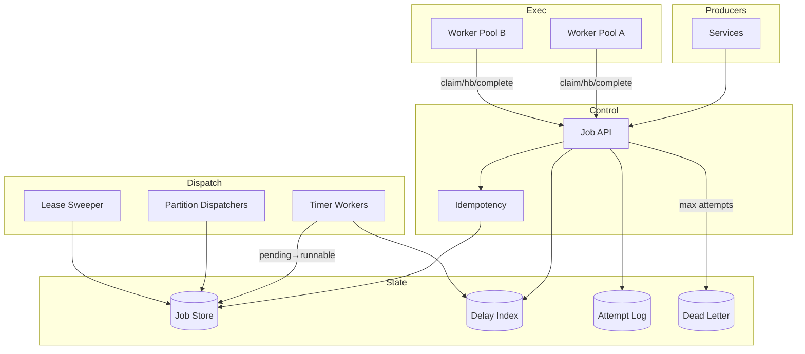
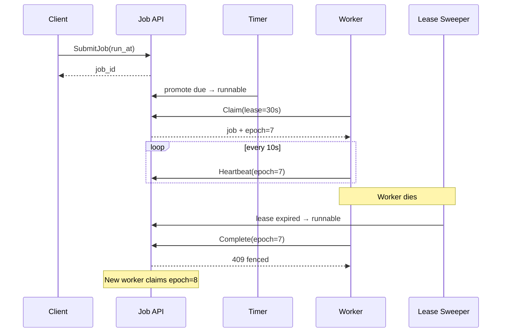
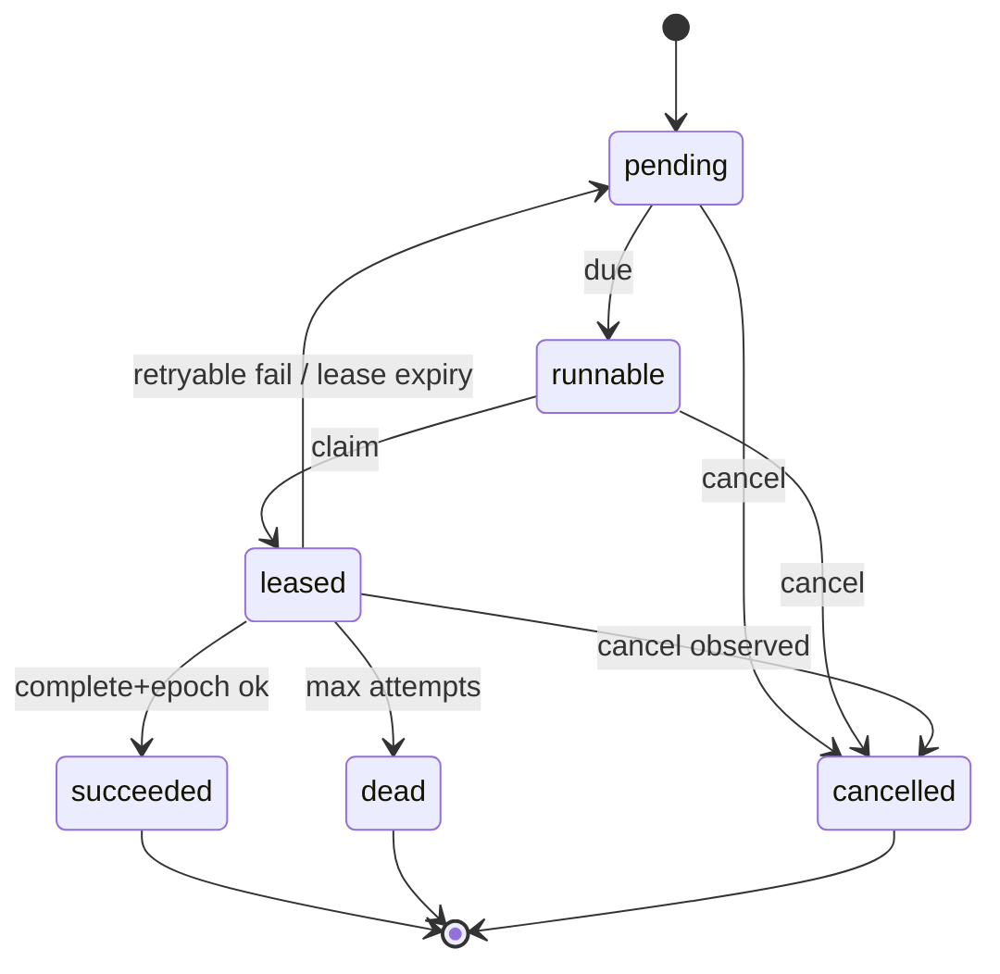

# System Design: Distributed Job Scheduler

> **Focus areas:** Job definitions · Run instances · Leases/heartbeats · At-least-once execution · Retries/backoff · Partitioned dispatch · Worker pools · Idempotency  
> **Style:** End-to-end product design with progressive scale (10× → 100× → 1,000×)  
> **Interview theme:** Schedule and execute **units of work** across a worker fleet with correctness under failure—think Sidekiq/Celery/ECS Scheduled Tasks/internal “Job Service”

---

## Table of Contents

1. [Clarify Requirements (Interview Q&A)](#1-clarify-requirements-interview-qa)
2. [Back-of-the-Envelope Estimation](#2-back-of-the-envelope-estimation)
3. [High-Level Design](#3-high-level-design)
4. [Architecture Diagram](#4-architecture-diagram)
5. [Design Deep Dive](#5-design-deep-dive)
6. [Wrap-Up](#6-wrap-up)
7. [Deeper / Related Interview Questions](#7-deeper--related-interview-questions)

---

## 1. Clarify Requirements (Interview Q&A)

Goal: design a **distributed job scheduler**—accept job submissions (immediate or delayed), persist them, dispatch to workers, track runs with leases, retry on failure, and expose status—correct under worker/coordinator crashes.

### 1.0 What this is / is not

| Dimension | This doc | Not this |
|-----------|----------|----------|
| Job | Opaque runnable tasks with handlers | Full DAG/workflow engine (related) |
| Timing | `run_at` / delay / simple recurring optional | Rich cron calendars (see distributed-cron) |
| Execution | Workers pull/push with **leases** | Serverless cold-start platform design |
| Guarantee | At-least-once run attempts | Exactly-once side effects without idempotency |
| Scope | Control plane + dispatch + run state | Business logic inside jobs |

### 1.1 Functional Requirements

| # | Question to ask | Expected / typical interviewer answer | Design implication |
|---|-----------------|----------------------------------------|--------------------|
| F1 | Job types? | Named handlers registered by workers (`email.send`, `etl.shard`) | JobType registry + versioning |
| F2 | Payload? | JSON/bytes ≤ few hundred KB; large → object pointer | Inline vs external |
| F3 | Schedule modes? | Immediate, delayed `run_at`, optional interval | Timer index + run table |
| F4 | Priorities / queues? | Multiple queues with concurrency caps | Fair scheduling per queue |
| F5 | Retries? | Max attempts, exponential backoff + jitter, retryable errors | Attempt records |
| F6 | Timeouts? | Per-job execution timeout; lease < timeout or heartbeat | Lease + kill/signal |
| F7 | Idempotency? | Client `idempotency_key` on submit; handlers should be idempotent | Dedup + run key |
| F8 | Cancellation? | Cancel pending; best-effort cancel running | Status CAS + cancel flag |
| F9 | Observability? | Status API, logs/metrics hooks, dead-letter | Run history |
| F10 | Workers? | Autoscale pool; pull model preferred | Lease-based claim |
| F11 | Fan-out? | MVP single job; batch submit OK | Not DAG |
| F12 | Rate limits? | Per tenant / job type | Token buckets |
| F13 | Results? | Small result blob or pointer | Result store TTL |
| F14 | Auth? | Service identity; tenants | RBAC on queues |

**MVP functional scope:**

1. Register job types (handler name, max concurrency, timeout, retry policy defaults).
2. `SubmitJob` immediate or `run_at`; durable before ACK.
3. Dispatcher makes jobs available when due; workers **claim with lease**.
4. Heartbeat extends lease; complete/fail with structured error.
5. Automatic retry with backoff until max attempts → dead-letter / terminal failed.
6. Cancel pending; request cancel running.
7. `GetJob` / list by status; basic metrics.

**Out of MVP:**

- Complex DAG dependencies (workflow engine)
- Calendar cron with TZ/holidays (distributed-cron)
- Exactly-once side effects
- GPU-aware binpacking (mention only)
- Multi-region active-active same job id

### 1.2 Non-Functional Requirements

| # | NFR | Target |
|---|-----|--------|
| N1 | Submit latency | p99 < 30–50ms |
| N2 | Dispatch lag (due → claimed) | p99 < 1s baseline |
| N3 | Availability | 99.9–99.99% control plane |
| N4 | Durability | No lost accepted jobs |
| N5 | Execution semantics | At-least-once attempts |
| N6 | Lease correctness | No two live leases same run without fencing |
| N7 | Multi-tenancy | Noisy neighbor isolation |
| N8 | Audit | Who submitted / cancelled |

### 1.3 Cases

**Happy:** Submit → due → claim → heartbeat → succeed → terminal.  
**Delayed:** Submit `run_at` → wait → dispatch.  
**Fail/retry:** Handler throws retryable → backoff → new attempt.  
**Cancel:** Pending cancelled; running sees cancel flag between heartbeats.

| Case | Behavior |
|------|----------|
| Worker dies mid-run | Lease expires → requeue attempt (at-least-once) |
| Worker slow, lease expires, still running | Fencing token; old complete rejected |
| Double submit same idempotency key | Return original job_id |
| Poison job | Max attempts → DLQ / failed_terminal |
| Thundering herd due time | Jitter + per-queue rate |
| Clock skew | Server `run_at`; NTP |
| Handler deploy incompatible | JobType version; reject unknown |
| Result too large | Force external store |
| Queue concurrency=10, 1M backlog | Drain with cap; lag metric |
| Split brain dispatcher | Partition leases / leader per shard |

### 1.4 Scales (Progressive)

| Metric | Baseline | 10× | 100× | 1,000× |
|--------|----------|-----|------|--------|
| Tenants | 100 | 1K | 10K | 100K |
| Job submits / day | 10M | 100M | 1B | 10B |
| Peak submit QPS | 2K | 20K | 200K | 2M |
| Concurrent running | 5K | 50K | 500K | 5M |
| Workers | 500 | 5K | 50K | 500K |
| Avg job duration | 5s | 5s | 2–10s | mixed |
| Delayed jobs held | 5M | 50M | 500M | 5B |
| Attempts / day | 12M | 120M | 1.2B | 12B |
| Queues | 200 | 2K | 20K | 200K |

**Jumps:**

- **10×:** Shard job store; separate delay index; lease service.
- **100×:** Partitioned dispatchers; per-queue worker pools; history cold tier.
- **1,000×:** Cells by tenant; hierarchical timers; streaming attempt logs.

### 1.5 Etc.

- Workers trusted within VPC / mTLS.
- Handlers are libraries side-carred or long-lived processes.
- Prefer **pull + lease** over push for backpressure.

**Scope repeat-back:**

> Build a multi-tenant distributed job scheduler: durable submit (immediate/delayed), partitioned dispatch, lease-based worker execution with heartbeats, retries/backoff, cancellation, and at-least-once attempt semantics—scaling from thousands to millions of concurrent runs.

---

## 2. Back-of-the-Envelope Estimation

### 2.1 QPS

```text
10M jobs/day ≈ 115/s avg; peak 10–20× ⇒ ~1–2K submit/s baseline
Attempts ≈ 1.2× jobs if 20% retry once → similar order
Heartbeats: 5K running × (1 hb / 10s) = 500 hb/s
1,000×: heartbeats alone ~500K/s → batching / sticky lease store required
```

### 2.2 Storage

```text
Job row ~500 B–2 KB; attempt row ~300 B
10M jobs/day × 1 KB × 30d retention ≈ 300 GB hot
1,000× → 300 TB/month hot → archive attempts to object/columnar
```

### 2.3 Dispatcher scan

Same problem as delayed queues: cannot full-table scan. Need `(queue_partition, run_at, job_id)` index + ownership.

### 2.4 Memory

```text
Dispatcher hot set: next 60s of due jobs per owned partitions
Pointers 64–128 B × 2K/s × 60 ≈ few MB–tens MB
Workers: in-memory job payload only for claimed set
```

### 2.5 Bandwidth

```text
Payload 2 KB × 2K claim/s ≈ 4 MB/s
Heartbeats small but chatty — coalesce
```

### 2.6 Hot keys

Popular `job_type` or single `partition_key` → one shard melts; hash + shuffle; concurrency caps per key optional (keyed mutex jobs).

---

## 3. High-Level Design

### 3.1 Domain model

```text
Tenant / Queue
JobType { name, version, timeout, retry_policy, concurrency }
Job {
  job_id, idempotency_key?,
  job_type, payload_ref,
  run_at, priority, queue,
  status: pending | runnable | leased | succeeded | failed | cancelled | dead,
  attempt_count, parent_schedule_id?
}
Attempt {
  attempt_id, job_id, n,
  worker_id, lease_epoch, lease_until,
  started_at, finished_at,
  error_class, error_msg,
  result_ref?
}
```

**Job state machine:**

```text
pending --(run_at)--> runnable --(claim)--> leased
   |                     ^                   |
 cancel                 |              (lease expire / fail retryable)
   v                    +------- backoff ----+
cancelled                              |
leased --(success)--> succeeded        +--(max)--> dead/failed
leased --(cancel)--> cancelled
```

### 3.2 APIs

| Method | Path | Purpose |
|--------|------|---------|
| POST | `/v1/job-types` | Register/update type |
| POST | `/v1/queues/{q}/jobs` | Submit |
| GET | `/v1/jobs/{id}` | Status + attempts |
| POST | `/v1/jobs/{id}/cancel` | Cancel |
| POST | `/v1/worker/claim` | Claim runnable batch |
| POST | `/v1/worker/jobs/{id}/heartbeat` | Extend lease |
| POST | `/v1/worker/jobs/{id}/complete` | Success |
| POST | `/v1/worker/jobs/{id}/fail` | Fail (retryable flag) |
| GET | `/v1/queues/{q}/stats` | Depth / lag / running |

**Submit:**

```http
POST /v1/queues/default/jobs
Idempotency-Key: client_abc
{
  "type": "billing.settle",
  "payload": {"invoice_id":"inv_1"},
  "run_at": "2026-08-06T12:00:00Z",
  "timeout_seconds": 60,
  "retry": {"max_attempts": 5, "base_delay_ms": 1000, "max_delay_ms": 300000}
}
```

**Claim:**

```http
POST /v1/worker/claim
{ "worker_id":"w_42", "queues":["default"], "max_jobs": 10, "lease_seconds": 30 }
```

Returns jobs + `lease_epoch` fencing tokens.

### 3.3 Trade-offs

| Design | Pros | Cons | Pick when |
|--------|------|------|-----------|
| DB as queue + `FOR UPDATE SKIP LOCKED` | Simple | DB bottleneck | MVP |
| Delay index + ready queue log | Scales | More moving parts | 10×+ |
| Push to workers | Low claim lag | Bad backpressure | Short jobs, trusted |
| Pull + lease | Natural backpressure | Claim chatter | **Default** |
| Leader dispatcher | Easy ordering | HA complexity | Small |
| Partitioned dispatchers | Scale | Rebalance | **Default at scale** |

**Deal-breakers:** no leases; infinite retries without bound; silent drop on worker crash; single global lock table.

### 3.4 Components

1. **API / Control plane** — submit, cancel, query  
2. **Job store** — durable jobs + attempts  
3. **Scheduler / timer** — pending → runnable at `run_at`  
4. **Dispatcher** — exposes runnable to claim API  
5. **Lease manager** — heartbeats, expiry sweeper  
6. **Workers** — execute handlers  
7. **DLQ / dead store** — terminal failures  
8. **Metrics / log shipper**

### 3.5 Lease & fencing (correctness core)

```text
Claim:
  pick runnable job
  set status=leased, worker_id, lease_epoch++, lease_until=now+L
Heartbeat:
  if epoch matches: lease_until=now+L
Complete/Fail:
  if epoch matches AND status=leased: terminal or retry
Expiry sweeper:
  if now > lease_until AND status=leased:
     → runnable (or new pending with backoff) + attempt failed(timeout)
```

Zombie worker with old epoch: complete → `409 Conflict` / ignored.

### 3.6 Retries

```text
delay = min(max_delay, base * 2^attempt) * Uniform(0.5, 1.5)
next_run_at = now + delay
status = pending (or runnable if delay=0)
```

Classify: `retryable` vs `permanent` (4xx business) → no retry.

### 3.7 Relationship to delayed message queue

Job scheduler **uses** delay/ready primitives internally but adds: attempts, leases, heartbeats, handler routing, concurrency caps, results. Do not conflate in interview—show the extra state machine.

### 3.8 Concurrency control

Per queue: `max_in_flight`.  
Per tenant: fair share.  
Optional per `dedupe_key` / entity key: only one running (serialize billing per account).

---

## 4. Architecture Diagram







---

## 5. Design Deep Dive

### 5.1 Reliability

#### Data loss

Submit ACK ⇒ job durable in quorum store. Attempts append-only for audit.

#### At-least-once vs exactly-once

- **Scheduler guarantee:** each job reaches a terminal state after ≥0 successful handler completions, but **attempts ≥1** possible for success path if crash after side effect before complete RPC.
- **Exactly-once effects:** idempotent handlers keyed by `job_id`/`idempotency_key`; transactional outbox inside handler.

#### Retries & poison

Bound attempts; DLQ; page on DLQ rate. Distinguish timeout vs panic vs business fail.

#### Backpressure

Claim pulls only what workers can do; queue concurrency; reject submits at max depth (429) or spill to delay.

#### Rate limits

Token bucket per tenant/job_type on submit and on dispatch.

#### Lease length selection

```text
lease ≈ heartbeat_interval × miss_tolerance
heartbeat_interval ≈ 1/3 of lease
timeout_seconds ≥ expected runtime; cancel if exceeded
```

If work can exceed lease, **require heartbeats**. If short jobs, lease > p99 runtime and skip HB to reduce chatter.

### 5.2 Scalability

#### Sharding

```text
shard = hash(tenant_id, queue, partition_key) % N
Each dispatcher owns shard set via lease
```

#### Scale paths

| Scale | Technique |
|-------|-----------|
| 10× | SKIP LOCKED → partitioned ready queues |
| 100× | Separate attempt cold storage; worker autoscaling |
| 1,000× | Cells; job store Cockroach/Dynamo; HB aggregation |

#### Parallelization

Workers horizontal; claim batching; pipeline deserialize/execute.

#### Storage tiers

Hot: pending/runnable/leased.  
Warm: succeeded last 7d.  
Cold: Parquet attempts for analytics.

#### Hot keys

Entity-serialized jobs: secondary lock table `key → job_id` with TTL.

### 5.3 Maintainability

#### Observability

- `schedule_lag`, `claim_lag`, `lease_expiry_total`, `attempt_success_ratio`
- Per job_type latency histograms
- Worker saturation (running / capacity)

#### Ops

- Pause queue
- Replay DLQ
- Drain for deploy
- Fence epoch admin tool

#### Migrations

JobType v2: workers advertise supported versions; dual-run.

#### Multi-tenant

Quotas; isolated worker pools for enterprise; noisy queue quarantine.

---

## 6. Wrap-Up

| Decision | Choice |
|----------|--------|
| Semantics | At-least-once attempts + fencing epochs |
| Dispatch | Partitioned pull + leases |
| Delay | Time index → runnable |
| Retries | Exp backoff + jitter + max |
| Scale | Shards → cells |

**Phases:** (0) Postgres SKIP LOCKED MVP → (1) leases+HB+DLQ → (2) delay index+partitions → (3) cells+cold history.

> Jobs are durable state machines with leased attempts; correctness comes from epochs and idempotent handlers, not from hoping workers never die.

---

## 7. Deeper / Related Interview Questions

**Q1. SKIP LOCKED vs external queue?**  
A: SKIP LOCKED great MVP; under high claim QPS move runnable set to log/queue.

**Q2. How do you prevent double execution?**  
A: You don't fully; you fence completes with epoch and make handlers idempotent. Lease expiry implies possible overlap window with zombies—keep window short + fencing.

**Q3. What if complete arrives after requeue?**  
A: Epoch mismatch → reject; new attempt owns effects if handler uses job_id+attempt or only job_id idempotently.

**Q4. Lease vs lock?**  
A: Lease is time-bounded lock with heartbeat; auto-release on crash.

**Q5. How is this different from cron?**  
A: Cron materializes many runs from schedule rules; job scheduler executes one-shot/delayed units. Cron often *submits* jobs here.

**Q6. How is this different from workflow DAG engine?**  
A: No dependency graph, join, or compensation; single node tasks.

**Q7. Visibility timeout vs lease?**  
A: Same family; jobs add heartbeats, attempts, typed failures, concurrency.

**Q8. Design heartbeat storm at 5M concurrent.**  
A: HB every 30s not 5s; shard lease store; batch HB; sticky worker→lease partition; optional lease = timeout for short jobs.

**Q9. Fair scheduling across tenants?**  
A: Weighted fair queueing on claim; deficit counters per tenant.

**Q10. Priority inversion?**  
A: Separate lanes; aging to prevent starvation.

**Q11. Sticky partition_key ordering?**  
A: Single concurrency per key; queue per key hash.

**Q12. Cancel running job ASAP?**  
A: Flag in store; worker checks on HB/loop; best-effort SIGTERM; cannot preempt CPU without cooperation.

**Q13. Exactly-once submit?**  
A: Idempotency-Key table with body hash; 409 on mismatch.

**Q14. Storing payloads in DB vs S3?**  
A: Small inline; large S3; claim fetches pointer.

**Q15. Dispatcher HA?**  
A: No single leader; partition leases with fencing.

**Q16. Clock skew on run_at?**  
A: Server time; reject far-past; NTP.

**Q17. Recurring every 5 minutes?**  
A: Either cron service creates jobs, or scheduler supports `interval` with **catch-up policy** (skip vs backlog)—define explicitly.

**Q18. Poison message infinite crash loop?**  
A: max_attempts; error budget; circuit-break job_type.

**Q19. Multi-region?**  
A: Home cell per tenant; do not dual-dispatch.

**Q20. How to test fencing?**  
A: Inject delayed complete; assert 409 and single logical effect with idempotent stub.

**Q21. Result storage?**  
A: TTL'd blob; don't bloat job row forever.

**Q22. Worker autoscaling signal?**  
A: Runnable depth, claim latency, CPU; cooldown to avoid flap.

**Q23. Security of claim API?**  
A: mTLS worker identity; queue allow-list; payload encryption.

**Q24. Batch jobs of 1M tasks?**  
A: Parent batch + child jobs; or workflow engine; avoid one row per tiny task without aggregation.

**Q25. Consistent hashing for workers?**  
A: Optional affinity; usually any worker of pool can claim (stateless handlers).

**Q26. Dead letter replay storms?**  
A: Rate-limited replay; quarantine.

**Q27. What belongs in attempt vs job?**  
A: Job = desired work identity; attempt = concrete execution try.

**Q28. How to measure correctness SLO?**  
A: Lost job = 0; duplicate side effect rate via canaries; lag SLO.

**Q29. DB transaction for claim?**  
A: Single-row CAS / conditional update; avoid multi-row locks.

**Q30. Biggest footgun?**  
A: Non-idempotent handlers + short leases without fencing checks on complete.

---

## Appendix A — Claim pseudocode

```text
function Claim(worker, queues, max, lease):
  jobs = []
  for q in queues.fair_order():
    while len(jobs) < max:
      j = store.take_runnable(q)  # conditional update
      if not j: break
      epoch = j.lease_epoch + 1
      store.set(j.id, status=leased, worker, epoch, lease_until=now+lease)
      attempts.append(j.id, epoch, worker)
      jobs.append(j, epoch)
  return jobs
```

## Appendix B — Expiry sweeper

```text
function SweepExpired():
  for j in store.scan_leased(lease_until < now):
    cas(j, leased → pending/runnable with next_run_at=now or backoff)
    close_attempt(timeout)
```

## Appendix C — Retry policy JSON

```json
{
  "max_attempts": 8,
  "base_delay_ms": 500,
  "max_delay_ms": 600000,
  "retry_on": ["Timeout", "Unavailable", "WorkerLost"],
  "no_retry_on": ["InvalidPayload", "PermissionDenied"]
}
```

## Appendix D — Capacity worksheet

| Input | Value | Output |
|-------|-------|--------|
| Concurrent | C | HB/s ≈ C/interval |
| Avg duration D | | Workers ≈ C / (util) |
| Submit peak | S | API nodes |
| Runnable depth | R | Alert if R grows |

## Appendix E — Comparison

| System | Leases | Delayed | Retries | Notes |
|--------|--------|---------|---------|-------|
| Celery | Ack/visibility | ETA | Yes | Broker-coupled |
| Sidekiq | Redis | Yes | Yes | Redis ops |
| SQS+Lambda | VT | Delay | Requeue | Limited exec model |
| This | Explicit epoch lease | Yes | Yes | Control plane SoT |

## Appendix F — Failure drills

1. Kill worker mid-job  
2. Network partition worker↔API  
3. Duplicate claim race  
4. Sweeper delay  
5. Clock jump  
6. DLQ flood  
7. Deploy handlers incompatible  

## Appendix G — Status API example

```json
{
  "job_id": "job_123",
  "status": "leased",
  "attempt": 2,
  "lease_epoch": 4,
  "worker_id": "w_9",
  "lease_until": "2026-08-06T12:00:30Z",
  "last_error": null
}
```

## Appendix H — When to recommend workflow engine instead

- Multi-step with dependencies  
- Human approval gaps  
- Compensating transactions  
- Long-running orchestration days+  
If single handler: stay with job scheduler.
