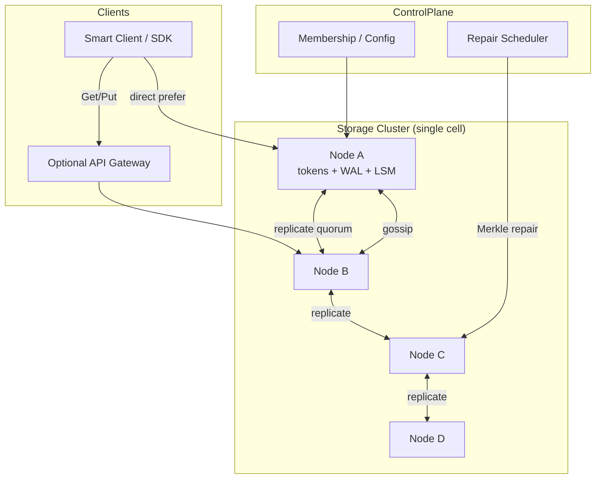
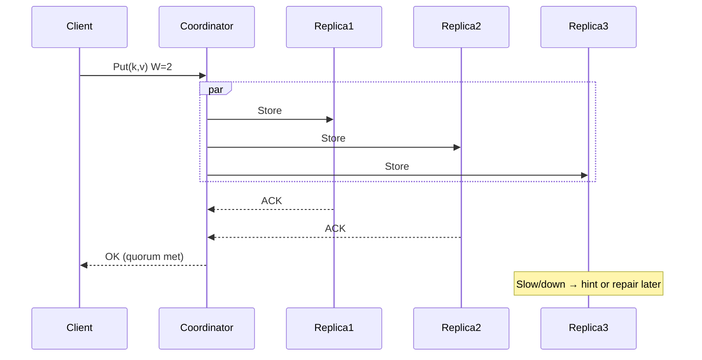

# System Design: Distributed Key-Value Store

> **Focus areas:** Consistent hashing · Quorum replication · Tunable consistency · Anti-entropy · Hot keys · CAP trade-offs  
> **Style:** Dynamo/Cassandra-class distributed KV with progressive scale (10× → 100× → 1,000×)  
> **API orientation:** Simple `Get` / `Put` / `Delete` / `Scan` (optional) with consistency parameters

---

## Table of Contents

1. [Clarify Requirements (Interview Q&A)](#1-clarify-requirements-interview-qa)
2. [Back-of-the-Envelope Estimation](#2-back-of-the-envelope-estimation)
3. [High-Level Design](#3-high-level-design)
4. [Architecture Diagram](#4-architecture-diagram)
5. [Design Deep Dive](#5-design-deep-dive)
6. [Wrap-Up](#6-wrap-up)
7. [Deeper / Related Interview Questions](#7-deeper--related-interview-questions)

---

## 1. Clarify Requirements (Interview Q&A)

The goal of this phase is to **bound the problem**: what we build, what we defer, and at what scale we must succeed.

### 1.0 What this is / is not

| This is | This is not |
|---------|-------------|
| A horizontally sharded, replicated **distributed key-value store** (Dynamo / Cassandra / Riak class) | A single-node embedded store (RocksDB alone) |
| Primary API: `Get(key)`, `Put(key, value)`, `Delete(key)` with optional TTL | A full SQL database with joins, secondary indexes by default |
| Tunable consistency via quorum (`N`, `R`, `W`) | Strict serializable multi-key transactions (defer to DistSQL) |
| Availability-first by default (AP with tunable CP knobs) | Strong global linearizability for all keys across regions by default |
| Ownership via consistent hashing + virtual nodes | Centralized master owning every key (Bigtable-style is a sibling design) |

### 1.1 Functional Requirements

| # | Question to ask | Expected / typical interviewer answer | Design implication |
|---|-----------------|----------------------------------------|--------------------|
| F1 | What is the value size? | Mostly small (≤ 1–16 KB); occasional up to a few MB | Inline values in SSTables/memtables; large values → reject or blob offload |
| F2 | Key model? | Opaque bytes / UTF-8 strings; no relational schema | Hash partition by key; optional ordered partition later |
| F3 | Consistency needs? | Tunable: many apps want AP + eventual; some keys need quorum strong read | Expose `R`/`W` or named levels: `ONE`, `QUORUM`, `ALL` |
| F4 | Multi-key transactions? | **Out of MVP** | Per-key linearizability under quorum is enough for MVP |
| F5 | TTL / expiration? | Yes for sessions/caches; optional for durable data | Tombstones + compaction; clock skew handling |
| F6 | Range scans? | Nice-to-have; not MVP core | Hash rings kill efficient range; ordered rings / tablets for Phase 2 |
| F7 | Conflict resolution? | Last-write-wins with wall clock + logical tiebreak; vector clocks optional | Document LWW vs vector-clock merge semantics |
| F8 | Durability on Put ACK? | Quorum durable to disk (WAL fsync policy configurable) | `W` quorum + local WAL; document durability vs latency |
| F9 | Multi-datacenter? | Phase 1: multi-AZ; Phase 2: multi-region | Rack/AZ awareness in replica placement; eventual cross-region |
| F10 | Admin APIs? | Cluster membership, rebalance status, repair | Control plane separate from data plane |
| F11 | AuthZ? | Per-tenant namespaces / key prefixes | Namespace → ACL; encrypt at rest |
| F12 | Secondary indexes? | Out of MVP | Materialized views / separate index store later |
| F13 | Client libraries? | Smart clients preferred (know ring) + dumb proxy gateway | Gossip membership; client-side routing cache |
| F14 | Delete semantics? | Soft delete via tombstone until GC | Tombstone retention ≥ max client clock skew / repair window |

**MVP functional scope (lock this with interviewer):**

1. Cluster of storage nodes; keys partitioned by consistent hash ring with virtual nodes.
2. Replication factor `N` (default 3) with rack/AZ-aware placement.
3. `Put` / `Get` / `Delete` with configurable `R`/`W` (default quorum).
4. Local durability via WAL + memtable → flush to immutable SSTables; compaction.
5. Failure detection (gossip + φ accrual or heartbeat), hinted handoff, anti-entropy repair.
6. Membership changes with gradual rebalance (streaming).
7. Basic TTL and tombstone GC.
8. Metrics: latency, under-replicated keys, repair lag, disk usage.

**Out of MVP (explicitly defer):**

- Multi-key ACID transactions / SQL
- Global secondary indexes
- Full multi-region active-active with CRDTs for all types
- Change-data-capture streams (design hooks only)
- Cross-key consistent snapshots for analytics

### 1.2 Non-Functional Requirements

| # | Question | Expected answer | Target |
|---|----------|-----------------|--------|
| N1 | Get latency (local AZ, quorum)? | Interactive | p50 < 5ms, p99 < 20ms (SSD, in-region) |
| N2 | Put latency (quorum ack)? | Interactive | p50 < 8ms, p99 < 30ms with fsync policy |
| N3 | Availability? | Prefer AP for Get/Put when minority partitions | 99.99% for quorum ops in healthy majority of AZs |
| N4 | Durability? | Survive disk + node + AZ loss | `N=3`, `W=2`, fsync WAL; RPO≈0 for acknowledged quorum writes |
| N5 | Consistency default? | Eventual with quorum convergence | Quorum intersection ⇒ no stale read if `R+W>N` and no concurrent writers unresolved |
| N6 | Multi-region? | Async replica / Phase 2 | Cross-region RPO seconds–minutes unless sync quorum |
| N7 | Security? | TLS, authn, encryption at rest | mTLS node-to-node; KMS envelope encryption |
| N8 | Cost? | Commodity SSD nodes | Prefer more smaller nodes; EC/replication cost explicit |

### 1.3 Cases (Happy Paths & Edge / Failure)

**Happy paths**

1. Client hashes key → preference list → `Put` to coordinator → replicate to `W` nodes → ACK.
2. `Get` coordinator gathers `R` responses → selects newest version (LWW / vector clock) → returns value.
3. Node joins → takes token ranges → streams SSTables → becomes serving → old nodes drop ranges.
4. TTL expiry → tombstone written → compaction eventually drops data.
5. Read repair: `Get` sees divergent versions → async write-back newest to lagging replicas.

**Edge / failure cases**

| Case | Behavior |
|------|----------|
| Node down during Put | Skip; hint to live peer; hinted replay on recovery; repair if hint lost |
| Network partition (minority) | Minority may accept `W=1` if client chooses; default quorum fails closed on writes |
| Concurrent Puts same key | LWW by `(timestamp, node_id)` or vector-clock siblings returned to client |
| Hot key | Local cache + request coalescing; optional key splitting / salting (app-level) |
| Slow disk / fsync stall | Backpressure; isolate node from preference lists via health score |
| Corrupted SSTable | Checksums; quarantine file; stream from replica |
| Clock skew | Hybrid logical clocks or bounded skew + logical counters for LWW |
| Rebalance storm | Rate-limit streaming; prioritize under-replicated ranges |
| Tombstone resurrection | Enforce tombstone GC grace ≥ max offline repair window |
| Client with stale ring | Redirect / `Moved` error; refresh membership |

### 1.4 Scales (Progressive)

| Metric | Baseline | 10× | 100× | 1,000× |
|--------|----------|-----|------|--------|
| Nodes | 6 | 60 | 600 | 6,000 |
| Keys | 100M | 1B | 10B | 100B |
| Avg value | 1 KB | 1 KB | 1 KB | 1 KB |
| Working set | 200 GB | 2 TB | 20 TB | 200 TB |
| Stored (N=3, raw×3) | ~300 GB | ~3 TB | ~30 TB | ~300 TB |
| Get QPS (peak) | 50K | 500K | 5M | 50M |
| Put QPS (peak) | 10K | 100K | 1M | 10M |
| p99 Get (in-region) | 20ms | 20ms | 25ms | 30ms* |
| AZs / regions | 3 AZ / 1 region | 3 AZ | 3 AZ + DR | Multi-region active |

\*At 1,000×, p99 holds only with careful hotspot control, local caches, and cell isolation.

**What each jump forces architecturally:**

- **10×:** Automated rebalance; gossip at scale; dedicated repair workers; client-side routing mandatory.
- **100×:** Shard into **cells/clusters** (~100–200 nodes each); hierarchical membership; per-cell coordinators; SLO dashboards per cell.
- **1,000×:** Multi-region replication plane; global directory for cell lookup; erasure coding for cold tiers; tenant isolation / noisy-neighbor controls.

### 1.5 Etc. (Constraints & Assumptions)

- **Single cloud, 3 AZs** for MVP; multi-region as Phase 2.
- **SSD** local disks (or cloud block volumes with care about noisy neighbors).
- **Values** mostly ≤ 16 KB; reject larger or offload to blob store.
- **Clocks:** NTP + hybrid logical timestamps for LWW.
- **No** distributed transactions across keys in MVP.

**Scope statement to repeat back:**

> Design a Dynamo-style **distributed key-value store**: consistent-hash partitioning, `N`-way replication, tunable quorum consistency, WAL+LSM local storage, failure detection, hinted handoff, and anti-entropy—starting at ~50K Get QPS and evolving cleanly to 1,000× via cells. Multi-key ACID and SQL are out of scope.

---

## 2. Back-of-the-Envelope Estimation

### 2.1 Traffic

```text
Baseline peak: 50K Get/s + 10K Put/s
Avg Get fanout at R=2: ~100K replica reads/s
Avg Put fanout at W=2: ~20K replica writes/s
With N=3 coordination overhead ≈ 1.1–1.3× (retries, read repair)
```

At **1,000×:** 50M Get/s → must be **sharded across many cells**; no single ring.

### 2.2 Storage

```text
100M keys × 1 KB ≈ 100 GB values
+ metadata (~64–128 B/key) ≈ 10 GB
× replication N=3 ≈ 330 GB raw
+ LSM amplification / compaction overhead ≈ 1.2–2× disk
→ Plan ~500 GB–1 TB usable cluster disk at baseline
```

At **100B keys:** ~100 TB values × 3 ≈ 300 TB + overhead → **petabyte-class** with EC cold tier.

### 2.3 Bandwidth (intra-cluster)

```text
Put path: 10K × 1 KB × (W-1 ≈ 1) ≈ 10 MB/s baseline replication
Get path: mostly local; cross-node ~30–50% if coordinator not owner
Repair / rebalance: budget 50–200 MB/s/node without starving foreground
```

### 2.4 Memory

```text
Block cache + memtables per node:
  Baseline 6 nodes, 200 GB working set → ~30–40 GB/node cache if hot
Memtable: 64–256 MB × few CFs
Bloom filters: ~10 bits/key → 100M keys ≈ 125 MB cluster-wide (tiny)
```

Hot-key working sets dominate RAM more than bloom filters.

### 2.5 Hot keys

```text
If 1 key = 1% of Gets at 50K QPS → 500 QPS on N replicas → fine
At 50M QPS, 1% → 500K QPS → need cache tier, request coalescing, or key salting
```

### 2.6 Compaction / write amp

```text
LSM write amplification typical 10–30× to disk
Put QPS 10K × 1 KB × 15 WA ≈ 150 MB/s cluster write IO
Size compaction windows so foreground p99 survives
```

---

## 3. High-Level Design

### 3.1 API

| API | Semantics |
|-----|-----------|
| `Put(key, value, opts)` | Upsert; opts: TTL, consistency `W`, timestamp (optional) |
| `Get(key, opts)` | Return value + version; opts: `R`, prefer local |
| `Delete(key, opts)` | Tombstone; same durability as Put |
| `BatchGet` / `BatchPut` | Pipeline independent keys (no atomicity) |
| Admin: `DescribeRing`, `Repair`, `Decommission` | Control plane |

**Idempotency:** Puts are naturally idempotent under LWW if client retries same `(key, value, timestamp)`; otherwise retries may bump timestamp—document client clock rules.

### 3.2 Data model

```text
Key: bytes
Value: bytes
Version: (hlc_timestamp, writer_node_id)  # LWW
Optional: vector_clock for sibling detection
TTL: expiry_unix_ms
Tombstone: {key, version, deleted=true}
```

Namespaces / tenants: prefix `tenant_id:` or separate keyspaces with isolated rings/cells.

### 3.3 Partitioning: consistent hashing + vnodes

**Why consistent hashing over modulo `N`?** Node add/remove moves only `K/n` keys, not almost all.

**Virtual nodes:** each physical node owns many tokens → better load balance, faster rebalance granularity.

| Choice | Pros | Cons | Deal-breaker when |
|--------|------|------|-------------------|
| Consistent hash ring | Simple, proven | Range scans hard | Need efficient `Scan(a,b)` |
| Range / tablet map | Ordered keys, scans | Split/merge complexity | Pure random access KV |
| Directory-based | Flexible placement | Metadata hotspot | Ultra-low latency Get |

**MVP pick:** consistent hash + vnodes. Phase 2 for ordered partitions if scans required.

**Replica placement:** walk clockwise for preference list of length `N`, skipping same rack/AZ when possible (Amazon Dynamo “rack awareness”).

### 3.4 Replication & quorum

```text
N = 3  # replicas
R = 2  # read quorum
W = 2  # write quorum
R + W > N  # strong consistency for single-key under no partitions / LWW converge
```

| Mode | R,W | Latency | Consistency | Availability |
|------|-----|---------|-------------|--------------|
| Fast | 1,1 | Best | Stale reads possible | Highest |
| Quorum | 2,2 | Medium | Converges; intersecting quorums | High if 2/3 up |
| Strong | 3,3 / R=N | Worst | Linearizable-ish with careful proto | Lowest |

**CAP:** default AP—during partition, accept writes on majority side with quorum; minority side fails quorum writes (or allows `W=1` if client opts in, accepting divergence).

### 3.5 Coordination path

1. Client or load balancer picks a **coordinator** (any node, or preferred first in preference list).
2. Coordinator forwards to preference list replicas.
3. Waits for `W` or `R` successes (with deadline).
4. For Get: reconcile versions; optionally **read repair**.
5. Return to client; failures → partial error codes (`Unavailable`, `Timeout`).

**Sloppy quorum + hinted handoff:** if a target is down, write hint to another node; deliver when target returns. Improves write availability; repair still required for durability guarantees beyond hints.

### 3.6 Local storage engine

Per node: **WAL + memtable + SSTables (LSM)** — same building blocks as disk-backed durable KV (see sibling doc). Requirements here:

- Crash-safe Put before ACK when durability required
- Bloom filters to avoid disk seeks on misses
- Compaction to bound space amplification and tombstone GC

### 3.7 Membership & failure detection

- **Gossip** spreads membership, token ownership, health.
- **φ accrual** failure detector reduces false positives vs fixed timeouts.
- **Seed nodes** for bootstrap.

### 3.8 Anti-entropy

| Mechanism | When |
|-----------|------|
| Read repair | On divergent Get |
| Hinted handoff | Transient node outage |
| Merkle-tree repair | Periodic / operator-triggered full sync |
| Incremental streaming | Bootstrap / decommission |

### 3.9 Why A over B (summary)

| Decision | Chosen | Alternative | Why |
|----------|--------|-------------|-----|
| Partitioning | Hash ring + vnodes | Central master tablets | Simpler HA; no single metadata master in MVP |
| Conflict | LWW + HLC | Always vector clocks | Operational simplicity; VC when siblings matter |
| Consistency | Tunable quorum | Always Raft per key | Raft per range is DistSQL territory; quorum fits AP KV |
| Storage | LSM | B+tree | Write-heavy Put workloads; sequential WAL |

---

## 4. Architecture Diagram





---

## 5. Design Deep Dive

### 5.1 Reliability

#### 5.1.1 Data-loss prevention

```text
ACK Put only after W replicas fsync WAL (or group commit) per durability policy
Replicas on distinct AZs
Checksums on every SSTable block
Quorum + repair ⇒ regenerate lost replica from survivors
```

**Durability ladder (interview signal):**

| Level | Meaning | Latency |
|-------|---------|---------|
| Memory | ACK after memtable | Unsafe |
| WAL no-fsync | OS buffer | RPO on power loss |
| WAL fsync | Disk | Default durable |
| Quorum fsync | W disks | Production default |

#### 5.1.2 Retries & idempotency

- Client retries with **same client request id** / timestamp when possible.
- Coordinator dedupe window for in-flight Puts (short TTL map).
- Gets are side-effect free except read repair (make repair async and rate-limited).

#### 5.1.3 Rate limits & backpressure

| Layer | Mechanism |
|-------|-----------|
| Per-tenant QPS / bandwidth | Token buckets at gateway |
| Per-node write queue | Shed with `503` + `Retry-After` |
| Compaction vs flush | Stall memtable writes if L0 too deep (RocksDB-style) |
| Repair | Separate IO class / cgroup / rate limit |

#### 5.1.4 Consistency edge cases

- **`R+W>N`** prevents reading a value never seen by a write quorum **if** versions are totally ordered and no clock regression.
- Concurrent writers ⇒ LWW picks one; losing write is acknowledged then overwritten—**not** lost if clients read after both complete with quorum, but lost-update at app level still possible without CAS.
- Optional **conditional Put** (`If-Version-Match`) for lightweight optimistic concurrency.

#### 5.1.5 CAP in practice

| Partition scenario | Quorum default | Opt-in W=1 |
|--------------------|----------------|------------|
| 1 node down | OK | OK |
| AZ loss (1 of 3) | OK if replicas spread | OK |
| Majority loss | Writes fail | Minority may diverge |

Document that **tunable consistency moves the CAP needle per request**, not magically both C and A globally.

### 5.2 Scalability

#### 5.2.1 Scale-out path

1. Add nodes → assign vnodes → stream data → update ring → drop from donors.
2. Split into **cells** when gossip/rebalance/operational blast radius grows (~100–300 nodes/cell rule of thumb).
3. Global router: `hash(key) → cell` or tenant → cell directory.

#### 5.2.2 Hot keys & skew

| Technique | Use when |
|-----------|----------|
| Client-side cache | Read-heavy hot keys |
| Request coalescing | Same key stampede |
| Key salting (`key#shard`) | Write-heavy single key (app redesign) |
| Separate cache tier (Redis) | Extreme read amplification |

#### 5.2.3 Storage tiers

- Hot: local NVMe LSM
- Warm: denser nodes / HDDs with larger caches
- Cold: erasure-coded object snapshots of SSTables (export), not on Get path

#### 5.2.4 Parallelization

- Batch APIs pipeline independent keys.
- Repair workers shard by token range.
- Compaction parallel per column family / level.

### 5.3 Maintainability

#### 5.3.1 Observability

| Signal | Why |
|--------|-----|
| p49/p99 Get/Put by op | SLO |
| Under-replicated % | Durability risk |
| Hint queue depth | Failure backlog |
| Repair bytes/sec + lag | Entropy |
| L0 files / write stall | LSM health |
| Ring version mismatches | Client staleness |

Avoid unbounded label cardinality (`key` on metrics is a deal-breaker).

#### 5.3.2 Operability

- Rolling decommission with stream completion gates
- Backup: per-node hardlink snapshots of SSTables + WAL ship, or incremental
- Restore: rebuild replica via streaming preferred over cold backup for single-node loss
- Chaos: kill node, partition AZ, pause disk, clock jump tests

#### 5.3.3 Multi-tenant

- Keyspace per tenant or shared with strict quotas
- Noisy neighbor: per-tenant IO tokens; separate cells for large tenants
- Encryption: per-tenant DEKs wrapped by KMS

#### 5.3.4 Migrations

- Ring versioning; dual-read during format upgrades
- SSTable format version in footer; background rewrite
- Compatibility matrix for rolling binary upgrades

---

## 6. Wrap-Up

### Decision summary

| Area | Decision |
|------|----------|
| Partition | Consistent hashing + vnodes |
| Replication | N=3, AZ-aware |
| Consistency | Tunable quorum; default R=W=2 |
| Conflicts | LWW + HLC; optional CAS |
| Local store | WAL + LSM |
| Failures | Gossip FD + hints + Merkle repair |
| Scale | Cells beyond ~hundreds of nodes |

### Phased rollout

1. **Phase 0:** Single-AZ lab; N=3 on 3 nodes; quorum APIs; LSM basics.
2. **Phase 1:** Multi-AZ; production durability; repair; client smart routing.
3. **Phase 2:** Cells; multi-region async; hot-key cache; conditional Put.
4. **Phase 3:** Ordered/scan partitions if needed; CDC; EC cold tier.

---

## 7. Deeper / Related Interview Questions

1. **Why does `R+W>N` not give you linearizability?**  
   Quorum intersection gives *recency under a single total order*; concurrent writes, clocks, and sloppy quorums break linearizability. Need consensus (Raft/Paxos) or careful primary-per-key.

2. **LWW vs vector clocks—when do siblings matter?**  
   Collaborative concurrent updates where “last” is wrong (shopping cart). Most session stores prefer LWW.

3. **How do virtual nodes improve rebalance?**  
   Smaller ownership chunks; finer load balance; cost is larger membership metadata.

4. **Hinted handoff vs repair—durability?**  
   Hints are best-effort and can be lost with the hint node; Merkle repair is the durability backstop.

5. **Why LSM over B+tree for this KV?**  
   High random Put rate loves sequential WAL; B+tree write amp on random updates hurts SSDs less today but LSM still common for write-heavy KV.

6. **How do you prevent tombstone resurrection?**  
   GC grace ≥ max downtime for repair; quarantine nodes offline longer than grace.

7. **Design CAS / compare-and-set on quorum KV.**  
   Read version with R; Put conditioned on version match on W replicas; retries on conflict. Still not multi-key atomic.

8. **Hot partition on the ring?**  
   More vnodes, detect load, split hot vnode, cache, or salt keys.

9. **Cross-region sync vs async?**  
   Sync quorum across regions kills latency; async accepts stale reads and conflict windows.

10. **How does gossip scale to 6,000 nodes?**  
   It doesn’t well—**cell** architecture + hierarchical gossip / dedicated membership service.

11. **Read repair storms after outage?**  
   Rate-limit; probabilistic repair; prefer targeted Merkle for large divergence.

12. **Secondary index on distributed KV?**  
   Local index incorrect under hash partition; need global index store with dual writes / CDC—consistency hard.

13. **Erasure coding instead of N=3?**  
   Saves space; hurts small-value latency; better for large objects / cold SSTables.

14. **Client-side vs server-side coordination?**  
   Client avoids extra hop; server gateway simpler ops / auth. Hybrid common.

15. **How to offer `Scan`?**  
   Switch to range partitioning / tablets; accept rebalancing complexity.

16. **What breaks if NTP jumps +1 minute?**  
   LWW may resurrect old values; use HLC / bounded uncertainty.

17. **BatchGet atomicity?**  
   None—document per-key best effort; app-level if needed.

18. **How to test anti-entropy?**  
   Inject silent data loss on one replica; verify Merkle repair restores checksum equality.

19. **Quota for multi-tenant Puts?**  
   Per-tenant token bucket on coordinator; isolate disk with cgroups; cell per whale tenant.

20. **Why not Raft per key?**  
   Millions of Raft groups = metadata explosion; use Raft per **range** (Cockroach/Spanner style) in DistSQL doc.

21. **p99 spikes during compaction?**  
   IO isolation, rate limits, leveled vs universal compaction tuning, separate compaction threads.

22. **Delete performance?**  
   Tombstones accumulate; queries pay until compaction—monitor tombstone drop rate.

23. **Security: dishonest coordinator?**  
   mTLS + authenticated replication; clients verify checksums/signatures optionally.

24. **Backup consistency?**  
   Per-key versions; cluster-wide consistent snapshot needs epoch/fence or accept fuzzy backup.

25. **When is Dynamo-style the wrong answer?**  
   Need SQL, multi-row ACID, strict serializability, or efficient range analytics—pick DistSQL / warehouse.

---

*End of Distributed Key-Value Store system design.*

## Appendix A — Distributed KV specifics

### Quorum
N replicas, R read, W write; R+W>N for overlap. Tunable CAP.

### Anti-entropy
Read repair, Merkle tree sync, hinted handoff.

### Membership
Gossip + consistent hash ring with virtual nodes; careful rebalance bandwidth.

## Appendix — Deep dive notes for Distributed key-value store

### Hardest invariants
- Define the correctness property that must not break under retries, partial failures, or overload.
- Define multi-tenant isolation boundaries if applicable.
- Define delete/TTL/privacy semantics across primary + cache + search + logs.

### Likely bottlenecks
1. Hot keys / hot partitions for core entity ids
2. Synchronous dependency latency tails (p99)
3. Write amplification from secondary indexes / fanout
4. Compaction / GC / backfill stealing cluster IO
5. Cross-region chatty patterns

### Suggested metrics (RED + business)
| Metric | Why |
|--------|-----|
| Request rate / error / duration | Golden signals |
| Saturation (CPU, pool, queue lag) | Leading indicator |
| Idempotency conflict rate | Client retry health |
| Cache hit ratio | Origin protection |
| Business SLI for Distributed key-value store | Product truth |

### Migration & rollout
- Expand/contract schema changes
- Dual-write or shadow reads for store migrations
- Feature-flagged cutover; canary on error budget
- Backfill with checkpoints and replayable logs

### What interviewers poke next
- Memory footprint of your cache/index choice
- Exact concurrency control (locks vs OCC vs ledger)
- Cost model at 100×
- Abuse cases unique to Distributed key-value store

## Appendix A — Interview execution checklist

1. **Repeat scope** in one sentence; list out-of-scope.
2. **Write NFRs as numbers** (QPS, p99, RPO/RTO).
3. **Draw** clients → edge → svc → store → async.
4. **Call the hardest invariant** early.
5. **Pick consistency** deliberately; do not say “strong everywhere.”
6. **Show scale jumps** at 10× / 100× / 1,000× with architecture changes.
7. **Name failure modes** and degraded behavior.
8. **Close** with metrics, rollout, and residual risks.

## Appendix B — Trade-off flashcards

| Topic | Prefer | Avoid |
|-------|--------|-------|
| Sync vs async | Sync for money/authz ack | Sync for fanout/email/indexing |
| SQL vs KV | Multi-row invariants | Ultra-high simple point ops |
| Cache | Read-heavy + tolerable stale | Incorrect money reads |
| Queue | Spike absorb + retry | Hidden request/response bus |
| Multi-region | Home cell single-writer | Multi-writer without merge rules |

## Appendix C — Reliability patterns to name drop correctly

- Idempotency keys + request hash
- Outbox / transactional messaging
- Leases + fencing tokens
- Quorum / consensus (Raft) for coordination—not for every data path
- Bulkheads + circuit breakers + deadlines
- Load shedding + admission control
- Canary + automatic rollback on SLO burn
- Backup restore drills (backup ≠ restore tested)

## Appendix D — Scalability patterns

- Consistent hashing with virtual nodes
- Hierarchical sharding (cell → shard → partition)
- CQRS / projections for read models
- Hot-key splitting and salting
- Tiered storage + compaction budgets
- Consumer parallelization by partition
- Edge caching with purge/surrogate keys

## Appendix E — Sample capacity dialogue

```text
Interviewer: Assume 10M DAU.
You: 10M DAU × 5 key actions/day ≈ 50M events/day ≈ 580 QPS avg.
Peak 15× ⇒ ~9K QPS. With 70% cache hit on reads, origin ~2.7K QPS.
At 100×, origin ~270K QPS ⇒ shard + edge mandatory.
```

Customize the action rate to this problem; do not reuse social-feed numbers for a ledger.


*Enriched for interview drill · `distributed-key-value-store`*
