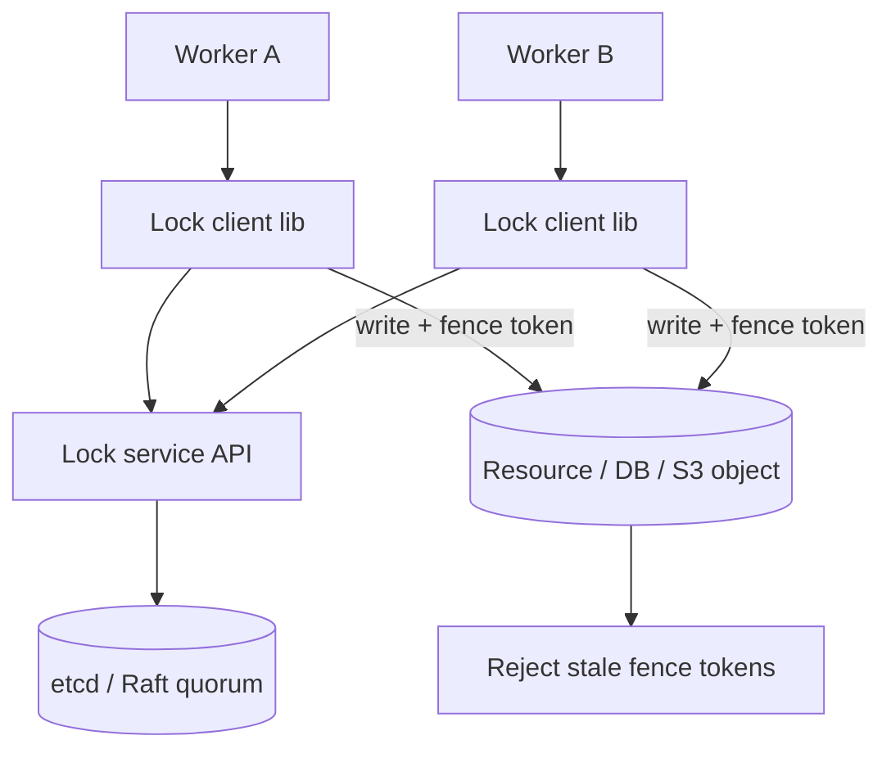
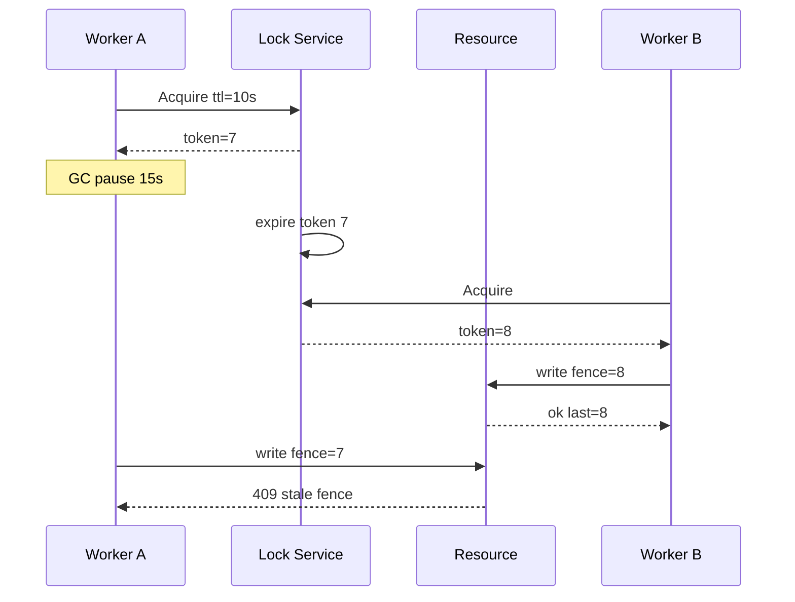

# System Design: Distributed Locks and Leases

> **Focus areas:** Mutual exclusion · Lease TTL · Fencing tokens · Deadlock · Clock issues · Redis vs ZooKeeper/etcd · Correctness limits · High contention · Multi-region  
> **Style:** End-to-end platform design with progressive scale (10× → 100× → 1,000×)  
> **Quality bar:** Correctness > speed; deal-breakers on lock-without-fencing and unbounded critical sections  
> **Interview theme:** Senior / Staff — **distributed mutual exclusion & lease-based ownership**

---

## Table of Contents

1. [Clarify Requirements (Interview Q&A)](#1-clarify-requirements-interview-qa)
2. [Back-of-the-Envelope Estimation](#2-back-of-the-envelope-estimation)
3. [High-Level Design](#3-high-level-design)
4. [Architecture Diagram](#4-architecture-diagram)
5. [Design Deep Dive](#5-design-deep-dive)
6. [Wrap-Up](#6-wrap-up)
7. [Deeper / Related Interview Questions](#7-deeper--related-interview-questions)

---

## 1. Clarify Requirements (Interview Q&A)

Goal: design a **distributed lock & lease service** so clients can obtain time-bounded exclusive (or shared) ownership of a resource, renew safely, release cleanly, and **fence** stale holders so a delayed process cannot corrupt state after losing the lock.

### 1.0 What this is / is not

| Dimension | This doc | Not this |
|-----------|----------|----------|
| Job | Distributed mutex / lease / optional RW lock | DB transactions replacing all locks |
| Correctness | Fencing + TTL; define failure model | “Perfect” lock over async network (FLP) |
| Related | Leader election is a specialized lock | Service discovery membership alone |
| Client | Library with safe patterns | Naive `SETNX` without token checks |

### 1.1 Functional Requirements

| # | Question to ask | Expected / typical interviewer answer | Design implication |
|---|-----------------|----------------------------------------|--------------------|
| F1 | Lock modes? | Exclusive primary; shared/read optional | Mutex first; RW Phase 1.5 |
| F2 | Leases? | TTL mandatory | Soft state; auto-expire |
| F3 | Renew? | Heartbeat renew before expiry | Client renew loop |
| F4 | Fencing? | Monotonic token per acquire | Storage must check token |
| F5 | Blocking acquire? | Wait with timeout + queue optional | Watch/notify or poll |
| F6 | Reentrant? | Optional per owner_id | Track recursion count |
| F7 | Deadlock detection? | Best-effort / avoid via ordering | Document lock hierarchy |
| F8 | Fairness? | FIFO approximate OK | Queue of waiters |
| F9 | Backend? | etcd/ZK for strong; Redis careful | Choose by correctness needs |
| F10 | Multi-region? | Prefer regional locks | Cross-region locks discouraged |
| F11 | Observability? | Who holds what | Lock dump API |
| F12 | Bulk / namespaces? | Prefix delete / list | Hierarchical keys |
| F13 | TryLock? | Non-blocking | Immediate fail |
| F14 | Critical section length? | Short; seconds not hours | TTL policy enforce |

**MVP functional scope:**

1. `TryAcquire(key, owner, ttl) → {ok, fence_token}` / `Acquire` with timeout.
2. `Renew(key, owner, fence_token, ttl)`.
3. `Release(key, owner, fence_token)`.
4. Automatic expiry; list holders for debug.
5. Client library: renew loop, cancellation, fencing helpers.
6. Metrics: wait time, hold time, expire-without-release.
7. AuthZ: who may lock which namespace.

**Out of MVP:**

- Distributed deadlock detector graph (mention)
- Globally fair locks across regions
- Transactional multi-key lock atomic acquire (2PL service)—document ordering instead
- Redlock as default without caveats

### 1.2 Non-Functional Requirements

| # | Question | Expected answer | Target |
|---|----------|-----------------|--------|
| N1 | Acquire latency | Uncontended | p99 < 5–20ms regional |
| N2 | Renew reliability | Don’t lose lock spuriously | Renew at ttl/3; jitter |
| N3 | Availability | Regional HA | 99.99% for lock service |
| N4 | Durability | Lock state in quorum store | Survive 1 AZ |
| N5 | Safety | No two holders with same epoch | Fencing enforced at resource |
| N6 | Multi-region | Avoid WAN locks | Cell-local |
| N7 | Security | AuthN owners | Prevent release of others’ locks |
| N8 | Clock | Don’t trust client clocks | Server TTL; monotonic tokens |

### 1.3 Cases (User Flows & Edge Cases)

**Happy paths**

1. Worker TryAcquire → gets token 42 → does work checking token → Release.
2. Long job renews every ttl/3 until done.
3. Holder crashes → TTL expires → waiter acquires token 43.
4. Contended: waiters queue; notified on release/expire.

**Edge / failure cases**

| Case | Behavior |
|------|----------|
| GC pause > TTL | Lock expires; on wake **must not** write without new fence; old token rejected |
| Network partition holder | May think it holds; resource rejects stale fence |
| Double release | Idempotent if token matches |
| Renew after loss | Renew fails; client aborts critical section |
| Clock jump on Redis node | Prefer Raft store; if Redis, careful NTP / bounded |
| Deadlock A↔B | Timeout + lock order convention |
| Thundering herd on expire | Randomize wait; lease queue |
| Owner spoofing | Auth + secret owner credential |
| TTL too long | Slow failover |
| TTL too short | Spurious loss under load |

### 1.4 Scales (Progressive)

| Metric | Baseline | 10× | 100× | 1,000× |
|--------|----------|-----|------|--------|
| Lock keys active | 10K | 100K | 1M | 10M |
| Acquire QPS | 1K | 10K | 100K | 1M |
| Renew QPS | 3K | 30K | 300K | 3M |
| Contended hot locks | 10 | 100 | 1K | hierarchical / shard work |
| Clients | 5K | 50K | 500K | 5M |
| Regions | 1–2 | 3 | 5 | cell-local only |

**What each jump forces:**

- **10×:** etcd/ZK cluster sizing; avoid single hot key.
- **100×:** Namespace sharding of lock service; renew batching.
- **1,000×:** Don’t centralize; **shard the work** so locks aren’t global hotspots; per-cell lock services.

### 1.5 Etc. (Constraints & Assumptions)

- **Is lock enough for correctness?** No—resource must enforce fencing tokens.
- **Redis Redlock?** Discuss as controversial; not default for financial correctness.
- **DB `SELECT FOR UPDATE`?** Valid alternative for data already in DB.

**Scope statement to repeat back:**

> Design a **lease-based distributed lock service** with monotonic **fencing tokens**, mandatory TTLs, renew/release APIs, and a client library that treats expiry as loss of ownership—scaled with sharding—while being honest that locks over async networks require resource-side fencing to be safe.

---

## 2. Back-of-the-Envelope Estimation

### 2.1 Renew load

```text
10K locks, TTL 10s, renew every 3s → ~3.3K renew/s
1M locks → 330K renew/s → shard + batch renews by client
```

### 2.2 Storage

```text
Lock record ~100–200 B
1M locks ≈ 200 MB (+ Raft log)
Trivial vs correctness requirements
```

### 2.3 Contended hot key

```text
1 lock at 50K acquire attempts/s → herding
Fix: collapse work (single flight), finer-grained keys, queue
```

### 2.4 Failover time

```text
TTL=10s ⇒ worst-case dead holder blocks ~10s
TTL=30s safer renew, slower recovery
Choose per use case
```

### 2.5 Compare backends cost

```text
etcd: strong, ~10K–50K writes/s/cluster class order (rough)
Need many clusters at 1M renew/s
```

### 2.6 Latency budget (uncontended acquire)

```text
Client → API LB → Raft propose/commit → response
Budget: 2 + 5 + 10 + 3 ≈ 20ms p99 same region
Cross-region: 100–300ms+ — another reason to keep locks local
```

### 2.7 Cost of wrong TTL

```text
TTL 60s, holder OOM at t=1s → 59s blocked work
× hot shard lock → visible user outage
Mitigation: health-driven release hooks + shorter TTL + fencing so standby can take over safely
```

### 2.8 Herd math on unlock

```text
1K waiters polling every 100ms = 10K QPS waste
Watch/notify: 1 event + randomized 0–50ms stagger TryAcquire
```

---

## 3. High-Level Design

### 3.1 Core semantics

```text
LockRecord {
  key,
  owner_id,
  fence_token,  # monotonic per key
  expire_at,    # server time / lease deadline
  mode,         # EXCLUSIVE | SHARED
  waiters[]
}
```

**Safety property (goal):** For a given key, at most one *validated* exclusive critical section writes the resource at a time—achieved by **fence token checks on the resource**, not by hoping the old holder stops.

### 3.2 APIs

| API | Semantics |
|-----|-----------|
| `Acquire(key, ttl, wait_timeout)` | Block until held or timeout |
| `TryAcquire(key, ttl)` | Immediate |
| `Renew(key, token, ttl)` | Extend if still owner |
| `Release(key, token)` | Drop if token matches |
| `Get(key)` | Debug metadata |
| `Watch(key)` | Optional notify |

**Acquire response:**

```json
{"acquired": true, "fence_token": 1042, "expire_at": "..." }
```

### 3.3 Fencing protocol (critical)

```text
1. Client acquires lock → token T
2. Client writes to resource with header X-Fence: T
3. Resource accepts write iff T >= last_seen_token (or == expected)
4. If client paused and lock expired, another acquires T+1
5. Late write with T rejected
```

Without step 3–5, distributed locks are **unsafe** under pause/partition (classic Martin Kleppmann critique of naive Redis locks).

### 3.4 Backend comparison

| Backend | Safety | Perf | Notes |
|---------|--------|------|-------|
| **etcd / ZooKeeper** | Strong (Raft/ZAB) | Good | Prefer for correctness-critical |
| **SQL row lock / lease table** | Strong with TX | Medium | Good if data already in DB |
| **Redis SET NX PX** | Delicate | Fast | Single instance SPOF; cluster tricky |
| **Redlock** | Contested | Fast | Independent clocks; avoid as default |
| **Chubby-style** | Strong | Classic | Mentally similar to ZK |

**MVP recommendation:** etcd lease + key per lock, or ZK ephemeral+sequential; expose fencing token = key mod revision / ZXID-like.

### 3.5 Client library responsibilities

1. Renew loop with jitter; stop on failure.
2. Context cancel → best-effort release.
3. **On any renew fail / expiry: abort work** (don’t “continue briefly”).
4. Helpers to pass fence token to storage APIs.
5. Metrics: hold duration histogram.

### 3.6 Shared / RW locks (Phase 1.5)

- Multiple readers with shared tokens / generation.
- Writer needs exclusive; drain readers or use version epoch.
- Harder; often prefer optimistic concurrency instead.

### 3.7 Trade-offs & deal-breakers

| Decision | Trade-off | Deal-breaker |
|----------|-----------|--------------|
| No fencing | Simpler API | Split brain writes |
| TTL infinite | No renew complexity | Dead owner forever |
| Cross-region lock | “Global mutex” | Huge latency & partitions |
| Trust client expire_at | — | Cheating / clock skew |
| Long critical sections | Easy coding | Availability collapse |

### 3.8 When *not* to use distributed locks

- Prefer **DB transactions**, **idempotent compare-and-swap**, **single-leader per shard**, or **queue consumers** (Kafka partition) when they fit.
- Locks are for cross-system mutual exclusion when you cannot put the invariant in one store.

### 3.9 etcd-based implementation sketch

```text
Acquire:
  txn:
    if key CreateRevision == 0 (or lease expired):
      put key = {owner, meta} with lease_id
      fence_token = key.ModRevision   # monotonic
    else:
      fail or wait

Renew:
  KeepAlive(lease_id)   # or Lease.Grant refresh pattern

Release:
  txn if value.owner == me AND ModRevision == token:
      delete key
```

Waiters: `Watch(key)` until delete/expire, then TryAcquire. Optional fair queue: secondary prefix `/locks/{key}/waiters/{seq}` with sequential creates.

### 3.10 SQL lease table alternative

```sql
CREATE TABLE leases (
  lock_key TEXT PRIMARY KEY,
  owner_id TEXT NOT NULL,
  fence_token BIGSERIAL, -- or use UPDATE ... RETURNING
  expire_at TIMESTAMPTZ NOT NULL
);

-- Try acquire
UPDATE leases SET owner_id=$1, fence_token=fence_token+1, expire_at=now()+$ttl
WHERE lock_key=$k AND expire_at < now()
RETURNING fence_token;
-- if no row: INSERT ... ON CONFLICT DO NOTHING
```

Excellent when the protected resource is already Postgres—**same database** can enforce fence in the business UPDATE:

```sql
UPDATE accounts SET balance=$b, fence_token=$t
WHERE id=$id AND fence_token < $t
```

### 3.11 Contended lock patterns

| Pattern | When | How |
|---------|------|-----|
| Single-flight | Many ask same work | One holder; others await result |
| Partition lease | Sharded workers | Lock `shard-17` not each item |
| Queue consumer | Ordered jobs | Kafka partition = implicit lock |
| Optimistic CAS | Low conflict | No lock service |
| Fine-grained keys | High conflict coarse lock | Lock `order:{id}` |

---

## 4. Architecture Diagram





---

## 5. Design Deep Dive

### 5.1 Reliability

**Data loss / safety**

- Quorum write for acquire/release/renew.
- Fencing token strictly increasing per key (Raft index / revision).
- Resource enforces tokens—lock service alone is insufficient.

**Retries & idempotency**

- Acquire with `client_request_id` to avoid double-acquire on retry ambiguity.
- Release idempotent for same token.

**Rate limits & backpressure**

- Per-namespace acquire rate.
- Contended lock: exponential backoff + optional queue fair wake.

**Failure modes**

| Failure | Mitigation |
|---------|------------|
| Lock service majority loss | Acquires fail; holders may expire—design degrade |
| Process pause | TTL + fencing |
| Clock skew | Server-side lease; monotonic tokens |
| Network blip renew | Overlap renew early (ttl/3); tolerate 1 fail |
| Expired during IO | IO layer checks token before/after |

**Deadlocks:** enforce sorted multi-lock acquire; timeouts; avoid holding during RPC to third party when possible.

### 5.2 Scalability

**Sharding:** partition lock keys by hash across etcd clusters / lock cells.

**Hot keys:** 

- Don’t lock “global”; lock `account_id`.
- Single-flight per key in process.
- Lease ownership of partition instead of per-item locks when possible.

**Renew batching:** one client holding 1K locks sends multi-renew RPC.

**Scale jumps**

| Scale | Pattern |
|-------|---------|
| Baseline | One etcd cluster |
| 10× | Tune lease; metrics |
| 100× | Shard clusters by keyspace |
| 1,000× | Cell-local locks; eliminate global locks |

### 5.3 Maintainability

**Ops:** pages on lock service quorum unhealthy; dashboards for oldest hold, expire rate, wait p99.

**Break-glass:** force-delete lock with audit (dangerous).

**Migrations:** token format versioned.

**Multi-tenant:** namespaces + quotas; noisy neighbor isolation via shards.

**Testing:** Jepsen-style pause/partition tests; prove stale write rejected.

### 5.4 Client state machine

```text
Idle → Acquiring → Holding ⇄ Renewing
                 ↘ Failed
Holding → Releasing → Idle
Holding → Expired (renew fail / TTL) → AbortWork → Idle
```

Illegal: `Expired → continue critical section`. Library should throw / cancel context.

### 5.5 Worked example: primary election for a shard

1. Candidates `Acquire("shard:42:leader", ttl=15s)`.
2. Winner gets `fence_token=90`; announces leadership with epoch 90.
3. Followers reject commands with epoch < 90.
4. Leader renews; if renew fails, steps down **before** serving writes.
5. New leader gets token 91; resource generation bumps.

This is the same fencing story as locks—election is a named lock with long hold + stewardship duties.

### 5.6 Anti-patterns checklist

| Anti-pattern | Why it hurts |
|--------------|--------------|
| Lock around remote HTTP call | Hold time = tail latency; deadlock risk |
| One global lock for all users | Hot key meltdown |
| Infinite TTL “for safety” | Dead owner forever |
| Catch renew error and ignore | Zombie writer |
| Use locks instead of idempotency keys | Retries still duplicate side effects |
| Cross-region mutex for UX | Outages become global |

---

## 6. Wrap-Up

### Decision summary

1. **Leases with TTL**, never infinite locks by default.
2. **Monotonic fencing tokens** enforced at the **resource**.
3. Prefer **etcd/ZK/SQL** over naive Redis for correctness-critical paths.
4. Client aborts on renew failure—no “optimistic continue.”
5. **Short critical sections**; prefer CAS/queues when possible.
6. **Regional/cell-local**—avoid WAN mutexes.
7. Hierarchy / timeouts to mitigate deadlocks.

### Phased rollout

| Phase | Deliver |
|-------|---------|
| MVP | Exclusive acquire/renew/release + fence + etcd + client lib |
| 1.5 | Wait queue + fair wake; lock metrics UI |
| 2 | Shared locks; multi-renew |
| 3 | Sharded lock cells; chaos test suite |

---

## 7. Deeper / Related Interview Questions

**Q1. Why isn’t `SET key NX PX` enough?**  
A: No fencing; after pause you may still write. Also Redis replication/failover can violate safety without care.

**Q2. Explain fencing tokens.**  
A: Each acquire returns increasing T. Resource stores max T; rejects writes with smaller T—so zombie holders can’t corrupt.

**Q3. What is a lease vs a lock?**  
A: Lease emphasizes time-bounded ownership (TTL). Lock API often implemented *as* a lease.

**Q4. How do you pick TTL?**  
A: > worst GC/GC+IO hiccup you tolerate; < max failover SLO. Renew at ttl/3. Different keys different TTLs.

**Q5. Redlock thoughts?**  
A: Controversial under partitions/clocks. For interview: know Kleppmann vs antirez debate; choose Raft store for money.

**Q6. Leader election vs lock?**  
A: Election ≈ long-held lock on `leader` key with fencing (epoch). Same primitive family.

**Q7. Can NTP break locks?**  
A: If expiry uses wall clock across nodes inconsistently—yes. Raft lease uses leader timeline; prefer.

**Q8. Reentrant locks?**  
A: Count per owner; release at 0. Still one fence generation.

**Q9. Fairness?**  
A: Sequential ephemeral nodes (ZK) give FIFO; etcd needs queue design.

**Q10. Multi-key atomic lock?**  
A: Hard. Acquire in global key order; or use transaction in one DB.

**Q11. What if release never called?**  
A: TTL saves you—hence mandatory.

**Q12. Performance of lock per request?**  
A: Usually too slow/contention; batch or partition ownership.

**Q13. How does Chubby work at high level?**  
A: Paxos cell, file-like locks/leases, caching—with careful API; inspiration not copy.

**Q14. Optimistic locking vs distributed lock?**  
A: Version column CAS often simpler and scales better for single-row invariants.

**Q15. Deal-breaker?**  
A: Designing locks without fencing and claiming “mutual exclusion is guaranteed.”

**Q16. Split brain two lock services?**  
A: Clients must pin to one cluster; resources must not accept tokens from multiple issuers without cluster id in token.

**Q17. Include cluster_id in fence?**  
A: Yes: `(cluster_epoch, token)` to prevent cross-cluster reuse.

**Q18. Testing GC pause?**  
A: Inject sleep > TTL while holding; assert resource rejects late write.

**Q19. Lock wait thundering herd?**  
A: Etcd watch single notify; randomized backoff; leader lease for work shard.

**Q20. Should locks be recursive across threads?**  
A: Process-level owner id usually; document thread policy.

**Q21. TTL refresh under overload?**  
A: Prioritize renewals over new acquires in lock service admission control.

**Q22. Using ZooKeeper ephemeral nodes?**  
A: Session expiry drops node; sequential waiters; still need app-level fencing for work product.

**Q23. Exactly-once job with lock?**  
A: Lock + idempotent job token in DB beats lock alone.

**Q24. Multi-region primary?**  
A: Prefer home-region for resource; lock in same region.

**Q25. Staff: design lock queue**  
A: Waiters register sequence; holder release notifies next; timeout removes waiter; avoid O(n) wake all.

**Q26. Memory leak of waiters?**  
A: TTL on waiter registrations.

**Q27. Observability of “who blocks whom”?**  
A: Expose holder metadata + waiter list; deadlock graphs sampled.

**Q28. Can Fencing be at lock service only?**  
A: No—service can’t stop a client from writing to S3/DB without the store checking.

**Q29. Shared lock implementation sketch?**  
A: Reader count + writer flag with generation; or multiple keys—prefer optimistic read.

**Q30. Biggest production incident pattern?**  
A: TTL too aggressive under GC → duplicate leaders → corruption without fencing. Fix: fencing + sane TTL + load testing pauses.

---

*End of distributed locks and leases system design.*
