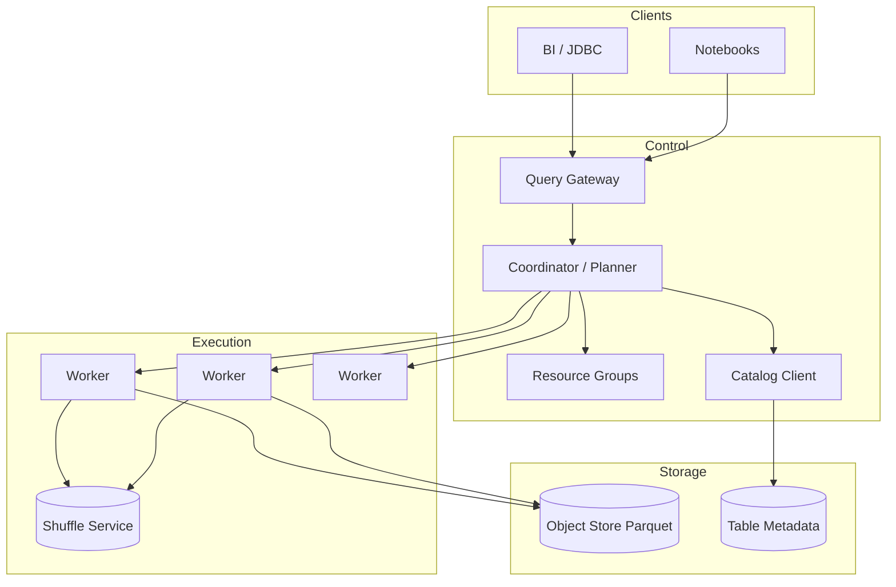
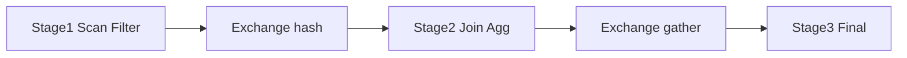

# System Design: Distributed Query Engine

> **Focus areas:** SQL parse/plan/optimize · MPP execution · Shuffle & joins · Predicate pushdown · Catalog integration · Caching · Spill · Multi-tenant fairness · Progressive scale  
> **Style:** End-to-end infrastructure design with progressive scale (10× → 100× → 1,000×)  
> **Interview theme:** Presto/Trino / Spark SQL / BigQuery-class analytical query engine over object storage or DFS  
> **Quality bar:** Correct cardinality/shuffle math, explicit coordinator bottlenecks, honest memory/spill trade-offs

---

## Table of Contents

1. [Clarify Requirements (Interview Q&A)](#1-clarify-requirements-interview-qa)
2. [Back-of-the-Envelope Estimation](#2-back-of-the-envelope-estimation)
3. [High-Level Design](#3-high-level-design)
4. [Architecture Diagram](#4-architecture-diagram)
5. [Design Deep Dive](#5-design-deep-dive)
6. [Wrap-Up](#6-wrap-up)
7. [Deeper / Related Interview Questions](#7-deeper--related-interview-questions)

---

## 1. Clarify Requirements (Interview Q&A)

Design a **distributed SQL query engine**: parse and optimize SQL, schedule fragment pipelines across workers, read columnar files from a lake/warehouse storage, and return results with predictable multi-tenant behavior.

### 1.0 What this is / is not

| Dimension | This doc | Not this |
|-----------|----------|----------|
| Product | Analytical MPP SQL engine | OLTP row-store query path |
| Storage | Reads lakehouse/DFS/object (Parquet/ORC) | Owns durable table storage (optional cache only) |
| Latency | Seconds to minutes typical | Sub-ms point lookups as primary |
| Interface | SQL + JDBC/HTTP | Only Spark RDD API |
| Consistency | Snapshot isolation via table format versions | Serializable multi-writer OLTP |

### 1.1 Functional Requirements

| # | Question to ask | Expected / typical interviewer answer | Design implication |
|---|-----------------|----------------------------------------|--------------------|
| F1 | SQL dialect? | ANSI subset + window/CTE/approx aggs | Parser + analyzer against catalog types |
| F2 | Data sources? | Iceberg/Delta/Hudi + Hive + optional JDBC | Connector SPI; split enumeration |
| F3 | Clients? | BI tools, notebooks, apps via JDBC/HTTP | Stateless gateways; query IDs |
| F4 | Ad-hoc + reporting? | Both; some SLA queries | Workload classes / queues |
| F5 | Intermediate materialization? | Spill to disk/object when needed | Memory manager + spill |
| F6 | Caching? | Result + data/footer caches optional | Coordinator + worker caches |
| F7 | UDFs? | Limited sandboxed UDFs Phase 1.5 | Isolation; CPU quotas |
| F8 | Federation? | Query across catalogs | Pushdown where possible |
| F9 | Transactions? | Read snapshots; writes via lake commits separate | Engine is mostly read MPP |
| F10 | Explain / profile? | Required for ops | Stage stats, skew metrics |
| F11 | Multi-tenant? | Yes — queues, limits | Admission control |
| F12 | Geos / privacy? | Column masking via catalog | Enforce in planner |
| F13 | Approx queries? | HyperLogLog, percentile stubs OK | Function library |
| F14 | Streaming SQL? | Out of MVP (batch/interactive) | Mention Flink separately |

**MVP functional scope:**

1. SQL parse → analyze (resolve names/types) → logical plan → cost-based optimize → distributed physical plan.
2. Split source files/rows into tasks; schedule on workers.
3. Vectorized columnar read of Parquet with predicate/projection pushdown.
4. Hash/sort-merge joins; aggregations; window operators.
5. Shuffle with partitioning; handle skew (salting / broadcast).
6. Query queues with concurrency and memory limits per tenant.
7. Spill to local SSD when memory pressure.
8. EXPLAIN / runtime stats; cancel query; fetch paginated results.

**Out of MVP:**

- Full DML/UPDATE as primary (lake MERGE via separate jobs OK)
- ML training inside engine
- Global low-latency materialized cube service (companion problem)
- Cross-region distributed shuffle as default

### 1.2 Non-Functional Requirements

| # | Question | Expected answer | Target |
|---|----------|-----------------|--------|
| N1 | Interactive latency? | Small queries | p50 < 1–3s for selective scans |
| N2 | Large scan throughput? | Saturate object store/NIC | GB/s–TB/s aggregate |
| N3 | Availability? | Stateless workers; HA coordinator | 99.9% accept |
| N4 | Correctness? | Snapshot consistent reads | Plan against table version |
| N5 | Isolation? | Noisy neighbor control | Queues + memory pools |
| N6 | Scalability? | Add workers | Near-linear for embarassingly parallel scans |
| N7 | Cost? | Pay for CPU/IO | Result reuse cache optional |
| N8 | Security? | Authn to engine; storage creds vended | No shared god keys on workers long-lived |

### 1.3 Cases (User Flows & Edge Cases)

**Happy paths**

1. `SELECT ... WHERE dt= today` → prune partitions/files → scan → agg → result.
2. Star-schema join: broadcast small dim; hash-join fact.
3. Large-large join: repartition shuffle → join → spill if needed.
4. User cancels → tasks aborted; shuffle files cleaned.
5. EXPLAIN ANALYZE shows skew on one task → hint / rewrite.
6. Second identical dashboard query hits result cache (if enabled).

**Edge / failure cases**

| Case | Behavior |
|------|----------|
| Worker death mid-query | Retry stage/tasks; or fail query if attempts exceeded |
| Coordinator death | HA standby takes over **or** fail in-flight (document) |
| Object store 503 | Retry with backoff; hedged reads |
| Data skew (one key 40%) | Detect; automatic salt / skewed join handling |
| Metadata storm (list million files) | Use lake metadata, not bucket list; cache manifests |
| OOM | Spill; if spill fails → fail task with clear error |
| Huge result set | Page to client; spill result; discourage SELECT * |
| Schema evolution mid-query | Pin snapshot at planning; ignore later commits |
| UDF crash | Isolate; fail task not whole worker process if sandboxed |
| Queue full | Admission reject / wait with timeout |

### 1.4 Scales (Progressive)

| Metric | Baseline | 10× | 100× | 1,000× |
|--------|----------|-----|------|--------|
| Concurrent queries | 50 | 500 | 5K | 50K (federated) |
| Workers | 50 | 500 | 5K | Multi-cluster |
| Peak scan GB/s | 10 | 100 | 1 TB/s | 10 TB/s |
| Catalog tables visible | 10K | 100K | 1M | 10M |
| Avg files touched / query | 200 | 500 | 2K | 10K+ |
| Shuffle GB / busy query | 50 | 200 | 1 TB | Multi-TB |
| Peak coordinator QPS plans | 20 | 200 | 2K | Split coordinators |
| Result cache hit % | 10% | 20% | 30% | Workload-dependent |

**What each jump forces:**

- **10×:** Resource groups; worker autoscaling; split planning vs execution gateway.
- **100×:** Disaggregated shuffle on object store; multiple coordinators; per-tenant clusters for whales.
- **1,000×:** Query gateway cells; federated execution; materialized views / cube tier for hot dashboards.

### 1.5 Etc. (Constraints & Assumptions)

- Engine **does not** replace the metastore/catalog — it calls it.
- Columnar formats assumed; row CSV supported but slow.
- Network is often the shuffle bottleneck; object store GET rate limits matter.

**Scope statement to repeat back:**

> Design an **MPP distributed SQL engine** over lakehouse tables: planner/optimizer, workers with vectorized scans, shuffle joins/aggs, spill, and multi-tenant admission — starting at tens of concurrent queries and evolving to multi-cluster cells at 1000×. Storage is external; consistency via table snapshots.

---

## 2. Back-of-the-Envelope Estimation

### 2.1 Scan throughput

```text
Query reads 10 TB Parquet, 5:1 compression effective selectiveness after prune → 2 TB uncompressed cols
50 workers × 2 GB/s read each = 100 GB/s aggregate
Time ≈ 2 TB / 100 GB/s ≈ 20s scan floor (plus CPU decode/filter)
```

### 2.2 Object store request rates

```text
10,000 files × 1 GET footer + N part GETs
If 8 parts/file → ~90K GETs; at 3k GET/s/prefix soft limits → need parallelism + retries
Footer/data cache reduces repeat dashboard storms
```

### 2.3 Shuffle size

```text
Join of 500 GB × 500 GB inputs with 0.5 selectivity intermediate → hundreds of GB shuffle
Network: 200 GB shuffle / 60s → ~3.3 GB/s cluster fabric minimum
At 100× queries concurrent → shuffle service must be disaggregated / queued
```

### 2.4 Memory per worker

```text
Per task heap/offheap: build side hash table can be tens of GB
Hard caps per query / per tenant; spill to SSD when exceeding reservation
50 workers × 64 GB = 3.2 TB cluster memory — not infinite
```

### 2.5 Coordinator CPU

```text
Planning 50 QPS with heavy CTE/views can dominate single coordinator
Optimize: plan cache, parallel analyze, split coordinators by queue
```

### 2.6 Cardinality estimation errors

```text
Wrong NDV → bad join order → 10–100× slowdown
Need: table stats, column NDVs, histograms for hot columns; ANALYZE jobs
```

### 2.7 Result size

```text
Returning 50M rows to BI over JDBC is a bad plan — push aggs; page; cap rows with error
```

### 2.8 Hot metadata

```text
Popular table planned 100/s → catalog cache must hit; pin Iceberg snapshot metadata in coordinator memory
```

---

## 3. High-Level Design

### 3.1 Components

| Component | Role |
|-----------|------|
| Gateway | Auth, route to queue, query submission |
| Coordinator / Planner | Parse, analyze, optimize, schedule stages |
| Catalog client | Tables, schemas, stats, snapshots, masks |
| Workers / Executors | Run tasks; read storage; shuffle |
| Shuffle service | Exchange data between stages (local or remote) |
| Discovery | Worker membership |
| Resource manager | Slots, memory pools, queues |

### 3.2 Query lifecycle

```text
1. Submit SQL + session (catalog, user, queue)
2. Parse → Ast → Analyze (resolve, type check, ACL)
3. Logical optimize (predicate push, constant fold, column prune)
4. Cost-based: join order, broadcast vs partitioned
5. Physical plan: stages / fragments with exchanges
6. Enumerate splits from table metadata
7. Schedule stage-by-stage or pipelined
8. Gather results to coordinator or directly to client
9. Publish profile; cleanup shuffle
```

### 3.3 Plan operators (core)

- TableScan (with residual predicates)
- Filter / Project
- HashAggregate / SortAggregate
- HashJoin / MergeJoin / BroadcastJoin
- Exchange (repartition, replicate, gather)
- Window / Sort / Limit / TopN
- Union / CTE materialize (optional)

### 3.4 Why vectorized columnar execution?

| Approach | Pros | Cons |
|----------|------|------|
| Row-at-a-time | Simple | Poor CPU cache; slow |
| Vectorized batches (1K–16K rows) | SIMD-friendly; matches Parquet | Complexity |
| Codegen (Spark whole-stage) | Faster | Harder debug |

**MVP:** vectorized interpreters; codegen as Phase 2.

### 3.5 Join strategy selection

| Situation | Strategy |
|-----------|----------|
| Small side fits memory budget | Broadcast hash join |
| Both large, equi-join | Partitioned hash join via shuffle |
| Both sorted / bucketed aligned | Merge join / bucket join skip shuffle |
| Skewed keys | Skew join with salt / split hot keys |

**Deal-breaker:** broadcasting a "small" side that is actually 50GB because stats missing.

### 3.6 Connector / split API

```text
planTableScan(snapshot, predicates, projection)
  → List<Split> { file path, start, length, delete-file refs, metrics }
workers read splits independently (embarassingly parallel)
```

Prefer **Iceberg/Delta metadata** over `LIST bucket/` — listing is a scale killer.

### 3.7 APIs

```text
POST /v1/statement     { sql, session }
GET  /v1/statement/{id}  # status + next rows
DELETE /v1/statement/{id} # cancel
GET  /v1/statement/{id}/profile
```

### 3.8 Trade-offs

| Choice | Prefer | Avoid |
|--------|--------|-------|
| Pushdown predicates | Always to storage/layout | Engine-only filter after full read |
| Disaggregated shuffle | 100× multi-tenant | MVP local disk shuffle OK |
| Result cache | Dashboards | Privacy-sensitive ad-hoc with RLS unless keyed by user |
| Many tiny workers | Elasticity | Excessive task scheduling overhead |

### 3.9 Why not "just Spark"?

Spark is a valid design. Interview should still whiteboard: driver vs executors, stages, shuffle, dynamic allocation — same concepts. Trino-style is better for concurrent short interactive queries; Spark for heavy ETL. **Say both** and pick based on workload mix.

---

## 4. Architecture Diagram



### 4.1 Stage pipeline



---

## 5. Design Deep Dive

### 5.1 Reliability

**Query correctness**

- Pin table snapshot/version at analyze time.
- Apply delete vectors / MoR deletes during scan.
- Deterministic floating ops? Document non-associativity of distributed FP sums; optional accurate modes.

**Retries**

- Task-level retry on transient IO; stage retry on worker loss.
- Non-retryable: syntax, permission, OOM after spill failure.

**Idempotency**

- Read queries are naturally safe to retry.
- If engine writes temp tables, use query_id-prefixed paths + cleanup.

**Backpressure / admission**

- Resource groups: max concurrent, max memory, CPU weight.
- Reject or queue with timeout when saturated — do not OOM the cluster.

**Failure modes**

| Failure | Mitigation |
|---------|------------|
| Straggler task | Speculative execution / hedged read |
| Shuffle node loss | Recompute stage (Spark-like) or replicate shuffle files |
| Catalog timeout | Cache; fail plan clearly |
| Disk full on spill | Fail query; alert capacity |
| Bad UDF | Sandbox kill; blacklist |

### 5.2 Scalability

**Scale workers** for scan/agg CPU; **scale coordinators** for planning QPS; **scale shuffle** for heavy joins.

**Sharding / cells**

- Route tenants to engine clusters.
- Cross-cluster federated query rare — prefer move compute to data region.

**Storage tiers / caching**

| Cache | Where | What |
|-------|-------|------|
| Footer / footer stats | Worker | Parquet metadata |
| Hot data | Worker SSD | Repeated partitions |
| Plan | Coordinator | Identical SQL+session |
| Result | Coordinator | Dashboard SQL |

**Parallelization**

- Splits ≫ workers for smoothing; too many tiny splits → scheduler overhead (aim splits of tens–hundreds of MB).

**Progressive**

| Scale | Architecture |
|-------|--------------|
| 1× | Single coordinator, local shuffle |
| 10× | Resource groups, autoscale workers |
| 100× | Remote shuffle, multi-coordinator, whale clusters |
| 1,000× | Cells + materialized acceleration layer |

### 5.3 Maintainability

**Observability**

- Per-query: wall time, CPU, rows scanned, bytes read, shuffle bytes, spill bytes, skew ratio.
- Cluster: queue wait, worker CPU, object 429s, failed tasks.

**Migrations**

- Rolling worker upgrades; plan version compatibility; canary pool.

**Multi-tenant**

- Cost attribution per query; chargeback on scanned bytes + CPU seconds.
- ACL via catalog; enforce masking in plan.

**Ops runbooks**

1. Shuffle disk full → shed queries; scale shuffle; kill elephants.
2. Planning latency ↑ → plan cache; stats refresh; reduce view depth.
3. Object 429 → reduce concurrency; increase footer cache; coalesce reads.

---

## 6. Wrap-Up

### 6.1 Decisions

| Decision | Choice |
|----------|--------|
| Role | MPP reader over lake snapshots |
| Execution | Vectorized workers + staged shuffle |
| Joins | Broadcast / hash / skew-aware |
| Isolation | Resource groups + spill |
| Metadata | Catalog + table format, not LIST |
| Scale | Multi-cluster cells + remote shuffle |

### 6.2 Phased rollout

1. MVP SQL + scans + joins/aggs + queues  
2. Skew handling, result/footer caches, EXPLAIN ANALYZE polish  
3. Remote shuffle, multi-coordinator  
4. Acceleration (MV) integration; federation  

### 6.3 Closing line

> **Plan against a snapshot, push predicates to files, shuffle only what you must, and admit queries before they OOM the fleet.** Stats and splits quality dominate clever operators.

---

## 7. Deeper / Related Interview Questions

**Q1. Broadcast vs shuffle join?**  
Broadcast when build side fits reservation and won't hammer every worker; else partitioned shuffle join.

**Q2. What is a split?**  
Unit of parallel scan work (file range + deletes + metrics). Split count drives parallelism.

**Q3. Why is `LIST /bucket` bad?**  
High latency, rate limits, incomplete pagination; lake table metadata already tracks files.

**Q4. How do you handle skew?**  
Detect heavy keys via partial aggs; salt keys; split hot partitions; skewed join algorithms.

**Q5. Predicate pushdown vs residual predicate?**  
Push what Parquet/Iceberg can evaluate (min/max, partition); residual filter in engine for complex exprs.

**Q6. Column pruning importance?**  
Wide tables: reading 3/200 columns can be 10–50× IO win with Parquet.

**Q7. Coordinators HA?**  
Active-standby with external store for query state, or accept in-flight loss and client retry for idempotent reads.

**Q8. Spill vs fail?**  
Spill extends working set onto SSD at latency cost; still fail if disk/quota exhausted — better than silent node death.

**Q9. How does cost-based optimizer get stats?**  
ANALYZE/compaction writes NDV, histograms, partition stats into catalog/table metadata.

**Q10. Dynamic filtering / runtime filters?**  
Build filter from dim side at runtime to prune fact scans — big for star schemas.

**Q11. Bucketed tables benefit?**  
Aligned bucketing can skip shuffle for joins on bucket keys — layout contract with writers.

**Q12. Memory grant protocol?**  
Queries reserve memory; operators request; global killer preempts largest consumers under pressure.

**Q13. Result pagination?**  
Buffer pages; cursor; avoid holding full result in coordinator RAM for huge outputs.

**Q14. Security token vending?**  
Coordinator vends short-lived storage credentials per query/split; workers don't hold long-term cloud keys.

**Q15. Approx count distinct?**  
HLL sketches merge cleanly in distributed agg — explain mergeability.

**Q16. Why stages/barriers?**  
Some engines pipeline; others stage. Barriers simplify recovery; pipelining lowers latency — trade-off.

**Q17. Federated JDBC pushdown?**  
Push filters/aggs to RDBMS when selective; avoid pulling full remote tables.

**Q18. Consistent hashing for workers?**  
Not usually for task assignment — scheduler assigns based on load/locality; consistent hash more for caches.

**Q19. Locality to object store?**  
Weaker than HDFS; still schedule by prefix/region; avoid cross-region reads.

**Q20. Testing correctness?**  
Fuzz SQL vs Postgres on small data; TPC-DS; chaos kill workers mid-query.

**Q21. Plan cache key?**  
SQL text + session params + catalog versions/ACL version — do not serve across users with RLS.

**Q22. Window functions distributed?**  
Partition by keys via exchange; sort within partition; streaming window ops.

**Q23. Small files problem impact on engine?**  
Too many splits/tasks; planning and scheduling overhead; fix via lake compaction, not only engine.

**Q24. When materialize CTE?**  
When referenced multiple times and expensive; else inline. Wrong choice doubles compute.

**Q25. Deal-breakers?**  
Single-node engine for EB lakes; no admission control; broadcast without size checks; relying on bucket LIST; ignoring delete files in MoR tables.

**Q26. Shuffle service design?**  
Workers write partition files to remote store; consumers pull; TTL cleanup by query_id; replicate or recompute on loss.

**Q27. CPU vs IO bound detection?**  
Profile bytes/sec vs CPU%; if decode-bound, increase workers/CPU; if 429 store, reduce concurrency.

**Q28. Multi-cluster routing?**  
Gateway maps tenant → cluster; sticky for cache warmth; overflow cluster for burst.

**Q29. Floating point reproducibility?**  
Distributed sums order-dependent; offer `sum` vs `sum_precise`; document for finance.

**Q30. Staff closer?**  
Snapshot pin, split planning, join strategy with stats, admission+spill, scale via remote shuffle and cells — not "more threads on one JVM."

---

## Appendix — Operational and Interview Depth

### A.1 Optimizer rule pipeline (verbal)

Parse → binding → predicate push → column prune → constant fold → join reorder (DP/greedy) → physical property enforce (distribution/order) → split gen. Show you know **logical vs physical** separation.

### A.2 Skew example math

```text
Key A = 30% of 1B rows → one reducer gets 300M rows
If 200 partitions assumed uniform (5M each), straggler is 60× average
Salt into 32 buckets: hot key tasks → ~10M each; merge results
```

### A.3 EXPLAIN ANALYZE fields to cite

Output rows, wall time, blocked time, input bytes, peak memory, spill, skew vs median task time ratio.

### A.4 Workload management classes

Interactive (low latency, low mem), reporting (medium), ETL (high mem, low priority), ad-hoc sandbox (strict caps). Different queues prevent dashboards from starving behind ETL.

### A.5 Integration with lakehouse commits

Reader sees snapshot S. Writer creates S+1 concurrently. Query started on S never tears mid-file if format guarantees. Engine should refresh snapshots only between queries, not mid-stage.

### A.6 Vector batch size trade-off

Too small → interpret overhead; too large → memory/cache miss. Typical 1024–4096 rows for many engines; tune with AVX and column widths.

### A.7 Gateway vs coordinator split

Gateway terminates thousands of JDBC clients; coordinators plan. Allows rolling plan engines without dropping TCP sessions abruptly (drain).

### A.8 Cost controls

Per-query scanned byte caps; kill switches; approximate modes; force users through governed gold tables for BI.

### A.9 Common anti-patterns

SELECT *; cross join accident; OR predicates killing partition prune; casting partition columns; exploding joins without filters.

### A.10 Staff talking points

Pin snapshot; prune with metadata; choose join by stats; admit before execute; spill > OOM; remote shuffle at 100x; cells for 1000x; small files are a lake problem the engine cannot fully hide.

---

*End of distributed query engine system design.*
