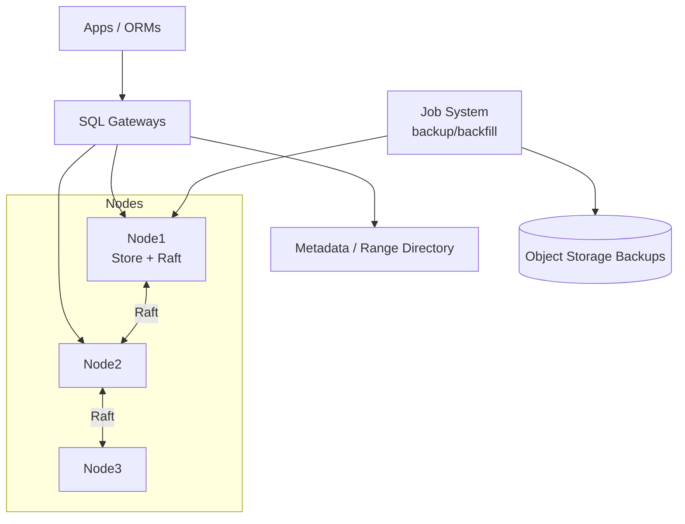

# System Design: Distributed SQL Database

> **Focus areas:** Range sharding · Raft/Paxos per range · Distributed transactions · Timestamps · Secondary indexes · CAP/consistency spectrum  
> **Style:** CockroachDB / Spanner / TiDB-class distributed SQL  
> **API orientation:** PostgreSQL-compatible SQL with serializable or snapshot isolation

---

## Table of Contents

1. [Clarify Requirements (Interview Q&A)](#1-clarify-requirements-interview-qa)
2. [Back-of-the-Envelope Estimation](#2-back-of-the-envelope-estimation)
3. [High-Level Design](#3-high-level-design)
4. [Architecture Diagram](#4-architecture-diagram)
5. [Design Deep Dive](#5-design-deep-dive)
6. [Wrap-Up](#6-wrap-up)
7. [Deeper / Related Interview Questions](#7-deeper--related-interview-questions)

---

## 1. Clarify Requirements (Interview Q&A)

Design a **horizontally scalable SQL database** that preserves familiar relational semantics—not a best-effort KV.

### 1.0 What this is / is not

| This is | This is not |
|---------|-------------|
| Distributed **SQL** with tables, indexes, transactions | Pure Dynamo-style AP KV |
| Automatic **range sharding** + rebalancing | Manual shard routing in app forever |
| Consensus-replicated ranges (Raft/Paxos) | Async-only replication as the sole durability |
| Snapshot / serializable isolation goals | Cross-region sync on every read without discussing cost |
| Online schema changes (phased) | Arbitrary stored procedures everywhere in MVP |

### 1.1 Functional Requirements

| # | Question to ask | Expected / typical interviewer answer | Design implication |
|---|-----------------|----------------------------------------|--------------------|
| F1 | SQL dialect? | Postgres-compatible subset | Parser/planner; wire protocol optional |
| F2 | Isolation level? | Serializable or SI (snapshot) | Timestamp ordering / MVCC + contention handling |
| F3 | Multi-row / multi-shard txns? | **Yes—required** | 2PC or atomic commit protocol over Raft |
| F4 | Secondary indexes? | Global secondary indexes | Indexes as separate ranges / co-located options |
| F5 | Joins? | Yes; distributed execution | Query processor with exchangers |
| F6 | Geo-partitioning? | Phase 2 | Table locality / PARTITION BY |
| F7 | Consistency? | Linearizable reads/writes for committed data | Leader reads or quorum reads + timestamps |
| F8 | Schema changes? | Online ADD COLUMN etc. | Multi-version schema states |
| F9 | Stored procedures? | Out of MVP | App-side txns |
| F10 | Vectorized engine? | Nice-to-have | Row engine MVP OK |
| F11 | Change feeds? | Phase 2 CDC | Rangefeeds / Kafka bridge |
| F12 | Admin? | BACKUP / RESTORE / EXPLAIN | Job system |
| F13 | Compatibility | App lift-and-shift from single Postgres | Strict SQL semantics over clever shortcuts |
| F14 | Multi-region writes? | Survives AZ; region optional | Raft across AZs first |

**MVP functional scope:**

1. Tables with primary keys; data split into **ranges** (tablets) of sorted keyspace.
2. Each range: Raft group, replication factor 3 across AZs.
3. SQL: SELECT/INSERT/UPDATE/DELETE, joins, secondary indexes, transactions.
4. MVCC + transaction coordinator (2PC over Raft logs).
5. Automatic split/merge ranges; leaseholder/leader for reads.
6. Basic statistics + cost-based planner (simplified OK).
7. Backup to object storage.

**Out of MVP:**

- Full PL/pgSQL
- Cross-region sync consensus for all data (offer later)
- Columnar analytics warehouse (HTAP Phase 2)
- Arbitrary UDFs / extensions ecosystem

### 1.2 Non-Functional Requirements

| # | Question | Expected answer | Target |
|---|----------|-----------------|--------|
| N1 | Point read p99 (local region) | OLTP | < 10ms |
| N2 | Single-shard txn p99 | OLTP | < 20ms |
| N3 | Multi-shard txn p99 | Accept higher | < 50–100ms |
| N4 | Availability | Raft majority | 99.99% with AZ failure |
| N5 | Durability | Raft majority fsync | RPO=0 for committed txns |
| N6 | Consistency | Serializable or SI | No dirty reads; document anomalies prevented |
| N7 | Elasticity | Add nodes online | Rebalance without downtime |
| N8 | Multi-region | Async or dual mode Phase 2 | Explicit latency tax if sync |

### 1.3 Cases

**Happy paths**

1. `INSERT` PK → route to range leader → Raft commit → ACK.
2. Multi-row txn touching 2 ranges → txn record + intents → prepare → commit.
3. Secondary index write maintained in same txn as base row.
4. Range hits size threshold → split → new Raft group.
5. Node death → Raft elects new leader → leases move → queries continue.

**Edge / failure cases**

| Case | Behavior |
|------|----------|
| Coordinator dies mid-2PC | Recover from txn record; commit/abort atomically |
| Clock skew | HLC / TrueTime uncertainty windows; commit-wait if needed |
| Hot range | Split; or application hotspot (monotonic PK)—detect & advise |
| Long txn holds intents | Heartbeat txn; abort abandoned; monitor contention |
| Schema change vs traffic | Gate states; backfill job; dual-read compatibility |
| Distributed deadlock | Deadline abort / wound-wait |
| Stale follower read | Only if explicitly allowed with bounded staleness |
| Giant scan | DistSQL flow with memory limits; spill; admission control |
| Orphan intents | Intent resolution on push / background |
| Backup during heavy write | MVCC snapshot backup; GC threshold protection |

### 1.4 Scales (Progressive)

| Metric | Baseline | 10× | 100× | 1,000× |
|--------|----------|-----|------|--------|
| Nodes | 9 | 90 | 900 | Multi-cell |
| Data | 2 TB | 20 TB | 200 TB | 2 PB |
| Ranges | ~2K | ~20K | ~200K | ~2M |
| QPS (simple PK) | 20K | 200K | 2M | 20M |
| Multi-shard txn/s | 2K | 20K | 200K | Cell-locality critical |
| Secondary indexes / table | 3 | 3 | 5 | Careful write amp |
| Regions | 1 (3 AZ) | 1 | 2–3 | Row-level locality |

**What each jump forces:**

- **10×:** Automated split/merge; distributed SQL execution; job framework.
- **100×:** Admission control; follower reads; careful index design; stats pipelines.
- **1,000×:** Multi-cell / regional tables; avoid cross-cell chatty txns; warehouse offload.

### 1.5 Etc.

- Prefer **range partitions** over hash for SQL (`ORDER BY`, scans).
- Consensus per range—not one global Raft.
- Interviewee should contrast with **NewSQL vs sharded Postgres (Citus) vs Spanner**.

**Scope statement:**

> Design a **distributed SQL database**: MVCC, range sharding, Raft-replicated ranges, distributed transactions with atomic commit, secondary indexes, and online rebalancing—Postgres-like for apps, starting at multi-TB / 20K QPS and scaling via splits and cells. Analytics warehouse is out of MVP.

---

## 2. Back-of-the-Envelope Estimation

### 2.1 Range sizing

```text
Target range size: 64–512 MB (pick 128 MB)
2 TB data / 128 MB ≈ 16K ranges (order-of; indexes add keys)
Raft groups ≈ number of ranges
Limit ranges/node: ~1K–10K practical → size cluster accordingly
```

### 2.2 Raft write amp

```text
Each write: leader → append local + 2 followers
App 20K writes/s × 3 ≈ 60K log appends/s cluster
fsync group commit critical
```

### 2.3 Secondary index write amp

```text
Row + 2 global indexes ≈ 3 Raft ranges possibly
Multi-shard txn overhead on inserts
```

### 2.4 Transaction coordinator load

```text
2K multi-shard txn/s × (prepare+commit RPCs) ≈ tens of K RPCs/s
Colocate txn record with one participant when possible
```

### 2.5 Memory

```text
Block cache / Pebble/Rocks cache: 32–64 GB/node
SQL working memory per query bounded; gateway concurrency caps
```

### 2.6 Clock uncertainty (Spanner-style intuition)

```text
If ε = 7ms TrueTime uncertainty → commit-wait ~ε for external consistency
HLC without commit-wait: cheaper, weaker external consistency story—be honest
```

---

## 3. High-Level Design

### 3.1 Layer cake

```text
SQL Client (Postgres wire)
   ↓
Gateway / SQL Proxy (auth, routing)
   ↓
SQL Parser → Planner/Optimizer → DistSQL Execution
   ↓
KV / MVCC API (Get, Put, Scan, Delete, txn ops)
   ↓
Range Managers (split/merge, leases)
   ↓
Raft + LSM storage engine per node
```

### 3.2 Key encoding

```text
/table_id/index_id/pk_columns.../ → column family values
Secondary index: /table_id/index_id/index_cols.../pk → null or stored columns
```

Sorted encoding enables range scans for `WHERE pk >` and index lookups.

### 3.3 Range & Raft

| Concept | Role |
|---------|------|
| Range / tablet | Contiguous key interval `[start, end)` |
| Raft group | Replicates range log |
| Leader / leaseholder | Serves writes; often serves reads |
| Split | Bisect hot/large range |
| Merge | Join small neighbors |

**Placement:** voters across AZs; optional non-voting replicas for follower reads in remote regions.

### 3.4 MVCC & timestamps

- Each version tagged with commit timestamp.
- Reads at `@ts` see versions `< ts` not intent-locked.
- GC waterline: drop old versions beyond TTL / protected timestamps (backups).

**Isolation options:**

| Level | Mechanism | Anomalies blocked |
|-------|-----------|-------------------|
| Snapshot (SI) | Read at ts; write conflicts abort | Dirty, non-repeatable; write skew possible |
| Serializable | SSI / conflict detection / locks | Write skew too |
| Linearizable | Strict ts + commit-wait / leader | Real-time ordering |

Pick **SI or serializable** explicitly with interviewer.

### 3.5 Distributed transactions

Simplified **write intent** protocol (Cockroach-like):

```text
BEGIN
  reads at read_ts
  writes leave intents + provisional values
COMMIT:
  1) choose commit_ts
  2) parallel prepare on participant ranges (Raft)
  3) write txn record COMMITTED
  4) resolve intents → committed values
```

**Atomicity:** txn record is source of truth; crash recovery consults it.

**vs classic 2PC:** same shape; durability via Raft instead of independent resource managers alone.

### 3.6 Secondary indexes

| Type | Placement | Consistency |
|------|-----------|-------------|
| Global secondary | Separate keyspace ranges | Same txn updates base + index |
| Local / interleaved | Colocated prefix | Cheaper; limited query shapes |
| Inverted / JSON | Separate | Write amp |

**Deal-breaker:** updating index asynchronously → SQL incorrectness. Always **synchronous in txn** for OLTP correctness.

### 3.7 Query execution

- Gateway plans; decides parallel TableReaders per range.
- Joins: hash / merge / lookup join; stream between nodes.
- Admission control: reject or queue oversized scans.

### 3.8 Why Raft-per-range vs Dynamo quorum KV

| | DistSQL (Raft ranges) | Dynamo KV |
|--|----------------------|-----------|
| Multi-row ACID | Yes | No |
| SQL scans | Natural | Hard on hash |
| Latency | Leader RTT | Often lower flexible |
| Availability | Majority required | Sloppy quorum possible |

### 3.9 Schema change (online)

States for `ADD COLUMN DEFAULT`:

1. Delete-only / write new column on updates
2. Backfill job
3. Public read

Ensure old/new gateways interoperable during rolling upgrade.

---

## 4. Architecture Diagram



```mermaid
sequenceDiagram
  participant C as Client
  participant G as Gateway
  participant T as TxnCoord
  participant R1 as Range1 Leader
  participant R2 as Range2 Leader

  C->>G: BEGIN; UPDATE...; COMMIT
  G->>T: Start txn
  T->>R1: Write intent (Raft)
  T->>R2: Write intent (Raft)
  T->>T: Decide commit_ts
  par
    T->>R1: Prepare/commit
    T->>R2: Prepare/commit
  end
  T->>T: Txn record COMMITTED
  T-->>C: OK
```

---

## 5. Design Deep Dive

### 5.1 Reliability

#### 5.1.1 Commit durability

- Commit returns only after Raft majority for all write participants + txn record.
- Idempotent client retries with txn IDs.

#### 5.1.2 Intent resolution & failure

| Failure | Recovery |
|---------|----------|
| Coord crash pre-commit | Timeouts push txn → abort |
| Coord crash post-commit record | Any node resolves intents to committed |
| Participant lagging | Catch up via Raft; block resolve until applied |

#### 5.1.3 Clock & uncertainty

**Options to discuss:**

1. **TrueTime / commit-wait** (Spanner): external consistency; waits out uncertainty.
2. **HLC + causality tracking** (Cockroach): cheaper; tight on NTP health.
3. **Central timestamp oracle**: simple bottleneck—scale with etcd-like service carefully.

#### 5.1.4 Retries

SQL clients see `40001 serialization_failure` → retry txn. Gateways may transparent-retry **read-only** or early writes carefully.

#### 5.1.5 Rate limits & admission

- Per-tenant RU / CPU tokens.
- Scan limits; `statement_timeout`.
- Protect Raft under compaction/IO debt (store liveness).

#### 5.1.6 CAP

DistSQL typically chooses **CP**: without Raft majority, range goes unavailable for writes (and strong reads). Async multi-region replicas may serve **bounded stale reads** as AP-colored feature—not default write path.

### 5.2 Scalability

#### 5.2.1 Split / merge

```text
Split triggers: size > threshold OR QPS hotspot heuristic
Merge: adjacent small cold ranges
Rebalance: move Raft leaders / replicas by load score
```

#### 5.2.2 Hotspots

Monotonic `SERIAL` PK → insert hotspot at range end right edge.

Mitigations: hash-sharded indexes, UUID keys, explicit `HASH` partitioning, load-based splits (still one key hotspot needs app change).

#### 5.2.3 Follower / stale reads

- Closed timestamp / safe timestamp → followers serve reads at past ts.
- Great for read-heavy regional replicas (ties to global read-heavy store patterns).

#### 5.2.4 Multi-region

| Mode | Write | Read |
|------|-------|------|
| Region-survivable sync | Voters in 3 regions | High latency |
| Locality-restricted table | Voters in home region | Low latency local |
| Non-voting replicas | Fast regional reads | Stale OK |

#### 5.2.5 Scale path

Cells / clusters federated by app or gateway routing for 1,000×; avoid world-spanning single txn.

#### 5.2.6 Storage engine under Raft (compaction link)

Each node embeds an LSM (see disk-backed durable KV doc). Raft log and applied state interact:

```text
Raft append → durable log
Apply → MVCC Put into LSM
Log truncation after applied + snapshot
LSM compaction must not drop versions > GC waterline / protected ts
```

**Write amplification stack (interview gold):**

| Layer | Amp source |
|-------|------------|
| SQL secondary indexes | Extra keyed writes |
| Raft | × number of voters |
| LSM compaction | × leveled WA |

Design indexes and RF knowing this product of amps drives disk and p99.

#### 5.2.7 Parallel query execution sketch

```text
SELECT ... FROM t JOIN u ON ... WHERE t.region = 'us'
  → filter pushdown to TableReaders on t ranges
  → lookup or hash join against u ranges
  → gateway merges; memory quota per stage
  → disk spill if over limit (prevent OOM)
```

**Deal-breaker:** unbounded hash join memory without admission → node death → Raft chaos.

#### 5.2.8 Colocation & interleaved locality

| Pattern | Benefit | Cost |
|---------|---------|------|
| Interleaved / parent-child key prefix | 1:N reads one range; fewer 2PC | Rebalance coupling; wide rows |
| Explicit `PARTITION BY` region | Low-latency local txns | Cross-partition queries slower |
| Secondary index covering | Index-only scans | More write amp |

### 5.3 Maintainability

#### 5.3.1 Observability

| Signal | Use |
|--------|-----|
| `raft_log_lag` | Replica health |
| `txn_restarts` / contention | App query design |
| `range_qps` / size | Split decisions |
| `sql_exec_latency` by fingerprint | Plan regressions |
| `gc_score` | MVCC garbage |

Fingerprints not raw SQL text unbounded cardinality.

#### 5.3.2 Backup / restore

- Periodic full + incremental MVCC backups to S3.
- PITR via protected timestamps.
- Restore creates new table spans; build indexes as jobs.

#### 5.3.3 Online ops

- Rolling node drains: relocate replicas first.
- Version upgrades with mixed-cluster gates.
- Chaos: kill leader, partition AZ, inject clock jump (within bounds).

#### 5.3.4 Compatibility testing

- SQL logic tests; txn anomaly batteries (Jepsen-inspired).
- ORMs against wire protocol.

#### 5.3.5 Explicit trade-offs to verbalize

| Decision | Win | Pay |
|----------|-----|-----|
| Serializable default | App correctness | More retries under contention |
| Global secondary indexes | Flexible queries | Multi-range writes on INSERT |
| Sync Raft multi-AZ | RPO=0, AZ HA | Commit latency ≥ local RTT quorum |
| Follower reads | Scale reads geo | Staleness; not default for RYW |
| Wide ranges (512 MB) | Fewer Raft groups | Slower rebalance; bigger hotspots |
| Narrow ranges (64 MB) | Elastic splits | Metadata / Raft overhead |

#### 5.3.6 Migration from single-node Postgres (phased)

1. Schema compatibility audit (types, constraints, `SELECT FOR UPDATE` patterns).
2. Dual-write or CDC backfill into DistSQL; shadow reads compare.
3. Cut read traffic → cut write traffic; keep rollback window.
4. Train apps on **txn retry** (`40001`)—the #1 production footgun.

---

## 6. Wrap-Up

### Decision summary

| Area | Decision |
|------|----------|
| Sharding | Ordered ranges / tablets |
| Replication | Raft RF=3 multi-AZ |
| Txns | MVCC + atomic commit / intents |
| Indexes | Synchronous global secondary |
| Reads | Leaseholder; optional follower |
| Scale | Split/merge + cells |

### Phased rollout

1. **MVP:** Single region, SQL subset, txns, indexes, splits.
2. **Prod:** Admission, backups, stats/optimizer, rolling upgrades.
3. **Geo:** Table localities, follower reads, controlled multi-region.
4. **HTAP optional:** Columnar replicas / warehouse CDC—not OLTP core.

---

## 7. Deeper / Related Interview Questions

1. **Why ranges not hash shards for SQL?**  
   Scans, `ORDER BY`, and merges need order; hash destroys locality.

2. **How many Raft groups is too many?**  
   Millions create scheduling/metadata load—merge ranges; cell architecture.

3. **Explain write skew and how SSI prevents it.**  
   Two txns read overlapping / write disjoint; SSI detects rw-conflicts and aborts.

4. **Spanner TrueTime vs HLC?**  
   TrueTime gives bounded uncertainty for external consistency; HLC cheaper, depends on NTP.

5. **Why intents instead of locking only?**  
   Intents encode provisional writes recoverable after crash; interact with MVCC.

6. **Global vs local secondary index trade-off?**  
   Global: any query, multi-shard writes; local: cheap, limited predicates.

7. **How does split preserve Raft log correctness?**  
   Coordinated split transaction; both sides leave consistent addressable keyspaces.

8. **Can you do RYW with follower reads?**  
   Only if follower caught past your write ts; else go to leader.

9. **Distributed deadlock detection?**  
   Prefer timeouts / wound-wait over perfect cycle detection at scale.

10. **Schema change dual writes?**  
   During backfill, writes update new index/column so backfill + live converge.

11. **Compared to Vitess/Citus?**  
   Those shard Postgres with app-aware or coordinator constraints; NewSQL hides shards behind KV.

12. **Compared to Dynamo KV?**  
   Different consistency/availability product; SQL needs CP-ish ranges.

13. **Hot key within a range?**  
   Splitting doesn’t help one key—app must bucketize.

14. **Backup vs Raft snapshot?**  
   Snapshots help catch-up replicas; backups are durable off-cluster copies for DR.

15. **Serializable vs linearizable?**  
   SI/SSI are txn isolation; linearizability is real-time single-key/register ordering—related but distinct.

16. **How do closed timestamps enable follower reads?**  
   Leader promises no more writes ≤ ts → followers can serve `@ts`.

17. **Query optimizer essentials?**  
   Stats histograms; index selection; join order heuristic; avoid cartesian disasters.

18. **What is a leaseholder vs Raft leader?**  
   Often colocated; lease allows epoch-based read authority without Raft round per read.

19. **CDC consistency?**  
   Emit in commit order per range; reassemble with checkpoints for exactly-once sinks.

20. **Multi-region 2PC cost?**  
   Multiple cross-region RTTs → design data locality so txns stay regional.

21. **GC and long-lived txns?**  
   Old read ts blocks GC; abort or protect carefully; monitor.

22. **Vectorized execution when?**  
   Analytical scans; OLTP point queries gain less.

23. **How to migrate from monolithic Postgres?**  
   Dump/restore or dual-write; verify SQL compatibility; train on retry patterns.

24. **Jepsen finding class?**  
   Stale reads on followers, clock issues, txn recovery bugs—test those.

25. **Erasure coding instead of RF=3?**  
   Rare for OLTP latency path; sometimes for bulk cold storage.

26. **Interleaved tables?**  
   Parent-child colocated keys reduce multi-shard txns for 1:N.

27. **Admission control vs just more nodes?**  
   Prevents single bad query from collapsing shared Raft IO.

28. **When is DistSQL the wrong tool?**  
   Pure blob storage, pure AP edge cache, or massive OLAP—use specialized systems.

29. **Cost of `SELECT COUNT(*)`?**  
   Full fanout scan unless maintained materialized counters.

30. **Explain pessimistic vs optimistic txn engines.**  
   Locks vs detect-at-commit; OLTP contention patterns pick winners.

---

*End of Distributed SQL Database system design.*
