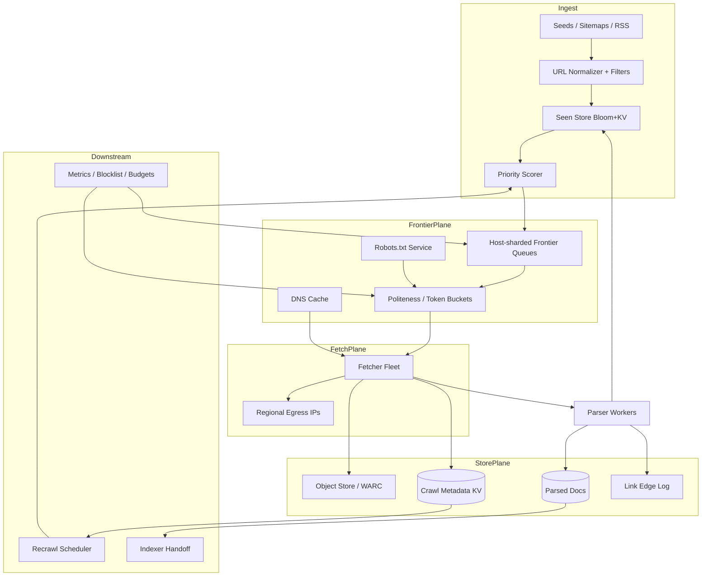

# System Design: Distributed Web Crawler

> **Focus areas:** URL frontier · politeness · dedup · robots.txt · fetch/parse · content store · freshness · anti-bot · distributed coordination  
> **Style:** End-to-end product design with progressive scale (10× → 100× → 1,000×)  
> **Quality bar:** Interview-passable for senior/staff; domain-specific numbers; explicit deal-breakers; scale jumps that force architecture changes

---

## Table of Contents

1. [Clarify Requirements (Interview Q&A)](#1-clarify-requirements-interview-qa)
2. [Back-of-the-Envelope Estimation](#2-back-of-the-envelope-estimation)
3. [High-Level Design](#3-high-level-design)
4. [Architecture Diagram](#4-architecture-diagram)
5. [Design Deep Dive](#5-design-deep-dive)
6. [Wrap-Up](#6-wrap-up)
7. [Deeper / Related Interview Questions](#7-deeper--related-interview-questions)

---

## 1. Clarify Requirements (Interview Q&A)

Goal: design a **distributed web crawler** that discovers URLs, fetches pages politely, extracts links/content, stores crawl artifacts, and continuously refreshes a large web corpus for downstream search/indexing.

### 1.0 What this is / is not

| Dimension | This doc | Not this |
|-----------|----------|----------|
| Job | Distributed crawl pipeline (frontier → fetch → parse → store) | Full search ranking / query serving (see web-search-engine) |
| Input | Seeds + discovered URLs + sitemap/RSS | User search queries |
| Output | Raw HTML/WARCs, parsed docs, link graph edges, crawl metadata | SERP results |
| Success | Coverage, freshness, politeness, cost | Relevance ranking quality alone |
| Lens | Systems + networking + storage at web scale | Academic IR paper |

### 1.1 Functional Requirements

| # | Question to ask | Expected / typical interviewer answer | Design implication |
|---|-----------------|----------------------------------------|--------------------|
| F1 | What is the crawler for? | Feed a search index / archive / change monitor | Optimize coverage + freshness + parse quality, not interactive UX |
| F2 | Public web or allowlisted domains? | **MVP:** public web with seeds; later vertical allowlists | Need DNS, robots, IP politeness, geo egress |
| F3 | Scope of content? | HTML pages MVP; PDFs/images Phase 2 | MIME allowlist; size caps; parser plugins |
| F4 | How deep / wide? | BFS from seeds with priority score; depth caps per host | Priority frontier, not pure FIFO |
| F5 | Must respect robots.txt / crawl-delay? | **Yes** — hard requirement | Per-host robots cache + enforce before fetch |
| F6 | Freshness / recrawl? | Important pages daily–hourly; long-tail weeks–months | Priority = change rate × importance × staleness |
| F7 | Dedup? | Exact + near-dup content; URL canonicalization | URL normalize + content fingerprint store |
| F8 | JavaScript rendering? | **MVP:** static HTML; headless render for selected hosts later | Fetch tier vs render tier split |
| F9 | Link graph needed? | Yes for ranking/PageRank offline | Emit `(from, to, anchor)` edges durably |
| F10 | Geo / language focus? | Global English-first MVP; multi-region fetch later | Region-aware DNS + egress IPs |
| F11 | Change detection? | Conditional GET (ETag/Last-Modified) when possible | Store validators; skip unchanged bodies |
| F12 | Auth / login walls? | Out of scope MVP | No cookie farms; mark as `blocked_auth` |
| F13 | Sitemap / RSS / news feeds? | Yes as discovery channels | Dedicated discovery workers |
| F14 | Max page size / redirect policy? | Cap e.g. 10 MB; follow ≤5 redirects same-host preferred | Abort oversized; redirect loop detection |
| F15 | Legal / ToS / opt-out? | robots + abuse mailbox + blocklist | Ops blocklist + kill switch per host/TLD |

**MVP functional scope (lock with interviewer):**

1. Ingest seed URLs + continuous link discovery.
2. Canonicalize + dedup URLs; score and enqueue into a distributed frontier.
3. Enforce robots.txt, crawl-delay, per-host/IP rate limits (politeness).
4. Fetch via distributed fetchers with timeouts, redirects, size limits.
5. Parse HTML → extract text, links, metadata; emit link edges.
6. Store raw content (object store / WARC) + parsed document records.
7. Content fingerprinting for exact/near-dup skip.
8. Recrawl scheduler based on importance × change rate.
9. Ops: host blocklist, metrics, crawl budget dashboards.

**Out of MVP (explicitly defer):**

- Full JS rendering farm for all pages
- Logged-in / paywalled content
- Perfect global active-active frontier
- Real-time push crawl (WebSub) as primary
- Legal evidence-grade archive compliance (WARC ok hooks only)
- Multimedia deep indexing (video transcripts)

### 1.2 Non-Functional Requirements

| # | Question | Expected answer | Target |
|---|----------|-----------------|--------|
| N1 | Fetch latency SLO? | Throughput-oriented, not user-facing | p50 fetch < 2s; timeouts 10–30s |
| N2 | Availability of crawl? | Best-effort continuous; no hard downtime SLO like payments | ≥99% fetcher fleet uptime; degrade by slowing |
| N3 | Durability | Don't lose discovered URLs or committed crawl results | Frontier + content store durable; RPO minutes for frontier |
| N4 | Consistency | Eventual OK for frontier; unique URL ownership preferred | Host-sharded frontier ownership |
| N5 | Politeness | Never hammer a host | Per-host QPS caps + crawl-delay; global IP fairness |
| N6 | Multi-region | Fetch close to content later | Stateless fetchers; regional egress; central metadata OK early |
| N7 | Security | SSRF, malware pages, poison URLs | Private-IP block, scheme allowlist, sandbox parsers |
| N8 | Cost | Bandwidth + storage dominate | Conditional GET, compression, tiered retention |
| N9 | Throughput | Baseline tens of K pages/s peak capacity design path | Progressive scale table |

### 1.3 Cases (Happy Paths & Edge / Failure)

**Happy paths**

1. Seed URL → normalize → robots allow → fetch 200 → parse → store → enqueue outlinks.
2. Recrawl: ETag match → 304 → update last-checked, keep body, lower priority.
3. Sitemap discover → burst of new URLs with sitemap priority hints.
4. Host hits crawl-delay → URL waits in per-host queue until token available.
5. Near-dup of known boilerplate → skip index emit, keep URL seen.

**Edge / failure cases**

| Case | Behavior |
|------|----------|
| robots.txt denies | Mark `disallowed`; don't fetch; revisit robots on TTL |
| DNS fail / NXDOMAIN | Backoff; mark host unhealthy after N fails |
| Soft 404 / park page | Heuristic detect; demote host/URL |
| Redirect loops / cross-host trampolines | Cap redirects; optionally re-enqueue final URL |
| Infinite calendar / facet URLs | URL filters, crawl budget per host, parameter canonicalization |
| Giant page / zip bomb | Size + compression ratio limits; abort |
| SSRF to metadata IP | Block RFC1918/link-local/metadata endpoints at fetcher |
| Parser crash on malformed HTML | Isolate; quarantine URL; don't kill worker process |
| Host ban / CAPTCHA / 429 | Exponential backoff; rotate egress carefully; mark `blocked` |
| Duplicate enqueue storm | Bloom/seen store + frontier dedup before queue |
| Clock skew on Last-Modified | Prefer ETag; treat validators as opaque |
| Legal takedown | Blocklist host/URL; purge content async by policy |

### 1.4 Scales (Progressive)

| Metric | Baseline | 10× | 100× | 1,000× |
|--------|----------|-----|------|--------|
| Unique URLs known | 1B | 10B | 100B | 1T |
| Pages fetched / day | 100M | 1B | 10B | 100B |
| Peak fetch QPS | 5K | 50K | 500K | 5M |
| Avg downloaded body | 50 KB | 50 KB | 40–60 KB | 40–60 KB |
| Raw egress / day | ~5 TB | ~50 TB | ~500 TB | ~5 PB |
| Hosts actively crawled | 10M | 50M | 200M | 500M+ |
| Frontier queue depth | 100M | 1B | 10B | 100B |
| Parsed docs retained hot | 500M | 5B | 50B | 200B+ (tiered) |
| Link edges / day | ~1B | ~10B | ~100B | ~1T |
| Fetcher workers | 500 | 5K | 50K | 500K (multi-region) |
| robots.txt cache entries | 10M | 50M | 200M | 500M |

**What each jump forces architecturally:**

- **10×:** Frontier cannot be one Redis; host-sharded queues + durable seen-URL store; object store for bodies; separate parse workers.
- **100×:** Multi-region fetch egress; priority scoring service; content-addressed storage; host health service; Bloom filters / Cuckoo for seen URLs; WARC rolling upload.
- **1,000×:** Cell/region crawl planes; hierarchical frontier (global priority → regional host queues); learned change-rate models; render farm for JS subset; strict cost budgets per TLD; automated ban detection.

### 1.5 Etc. (Constraints & Assumptions)

- **Single cloud primary** with multi-AZ; multi-region fetch later.
- **HTTP/HTTPS only** MVP; ignore FTP/gopher.
- **UTF-8 / charset detection** in parser.
- **No PII intentional collection**; still treat pages as untrusted.
- **Crawl budget** is a first-class product knob (pages/day, $/day).

**Scope statement to repeat back:**

> Design a politeness-aware distributed web crawler: seed + discover URLs, host-sharded frontier, robots-enforced fetch, parse/link extract, durable content + metadata store, dedup and recrawl scheduling—from ~100M pages/day toward 1000×—feeding search/archive, not serving queries.

---

## 2. Back-of-the-Envelope Estimation

### 2.1 Fetch throughput

```text
Baseline: 100M pages/day
≈ 100e6 / 86400 ≈ 1,157 pages/s average
Peak factor 3–5× (diurnal + backlog catch-up) ⇒ ~4–6K fetch QPS peak
```

At **1,000×:** ~100B/day ⇒ ~1.2M/s average, **~5M/s peak** — only feasible with massive multi-region fleets and aggressive conditional GETs / skip rates.

### 2.2 Bandwidth

```text
Avg body 50 KB compressed on wire ~20–30 KB (assume 25 KB)
Baseline: 100M × 25 KB ≈ 2.5 PB/day? WAIT — recalculate:
100M × 25 KB = 100e6 × 25e3 = 2.5e12 bytes ≈ 2.5 TB/day  (not PB)

1,000×: 100B × 25 KB ≈ 2.5e15 ≈ 2.5 PB/day egress
```

Interview trap: mixing compressed vs uncompressed and day vs second. Say numbers out loud with units.

### 2.3 Storage

```text
Retain raw for 30 days hot:
Baseline: 100M/day × 50 KB × 30 ≈ 150 TB raw
+ replication/erasure → ~200–300 TB object store

Parsed docs (text + meta ~10 KB):
500M hot docs × 10 KB ≈ 5 TB (+ indexes)

Link edges ~40 B:
1B edges/day × 30d ≈ 1.2 TB/month append
```

At 100×–1,000×: **tier aggressively** — hot metadata DB, warm object store, cold glacier-class; sample long-tail bodies.

### 2.4 Frontier memory / state

```text
URL string avg 80 B + metadata 40 B ≈ 120 B / URL in frontier index
1B URLs × 120 B ≈ 120 GB (compressed posting / columnar much less on disk)
Seen-URL Bloom: 1B URLs, 1% FP, ~1.2 GB per filter; use cascading / partitioned Blooms
```

**Do not** keep full HTML in the frontier.

### 2.5 robots.txt load

```text
10M active hosts, robots TTL 24h
Refresh ~10M/86400 ≈ 116 QPS average robots fetches
Cache hit goal >99% on fetch path — robots fetch must not be sync critical path miss storm
```

### 2.6 DNS

```text
5K peak fetches; cache hit 95% ⇒ 250 DNS QPS
At 500K fetch QPS with 95% cache ⇒ 25K DNS QPS → need distributed DNS cache + resolver fleet
```

### 2.7 Parse CPU

```text
Parse ~2–10 ms CPU / HTML page (wide variance)
6K pages/s × 5 ms ≈ 30 CPU-seconds/s ⇒ ~30–60 cores peak baseline
100× → thousands of parse cores; keep parse async from fetch
```

### 2.8 Hot keys / skewed hosts

Wikipedia, news, CDNs, mega-sites dominate outlinks. **Host-level token buckets** and **per-host crawl budgets** prevent one host from monopolizing the fleet. Global QPS is not the bottleneck—**fairness under Zipf** is.

---

## 3. High-Level Design

### 3.1 Core pipeline

```text
Seeds / Sitemaps / Feeds
        ↓
URL Normalizer + Filters
        ↓
Seen Store (Bloom + durable) ──→ drop duplicates
        ↓
Priority Scorer → Frontier (host-sharded)
        ↓
Politeness Gate (robots, delay, IP budget)
        ↓
Fetcher Fleet ──→ DNS Cache, TLS, egress IPs
        ↓
Content Store (raw) + Validator Store
        ↓
Parser / Extractor → Parsed Doc Store + Link Edge Log
        ↓
(optional) Indexer handoff / change events
        ↑
Recrawl Scheduler ← importance, changefreq, signals
```

### 3.2 URL identity & canonicalization

Before any enqueue:

1. Lowercase scheme/host; remove default ports; decode/encode consistently (WHATWG-ish policy documented).
2. Strip fragments `#...`.
3. Sort query params; drop tracking params (`utm_*`, `fbclid`) via allow/deny lists.
4. Trailing slash policy per host (learn from redirects).
5. Percent-encoding normalization; Unicode IDNA for hosts.
6. Canonical URL from `<link rel="canonical">` **as hint**, not blind trust (spoof risk).

**URL ID:** `url_hash = blake3(canonical_url)` (128–256 bit). Use as primary key everywhere.

### 3.3 Frontier design

**Choice: host-sharded priority queues**

| Option | Pros | Cons | Deal-breaker |
|--------|------|------|--------------|
| Single global Kafka topic | Simple | No politeness; hot partitions | Cannot enforce per-host delay well |
| **Host-sharded queues + priority** | Natural politeness ownership | Rebalance on host explosion | — best default |
| Per-URL Redis ZSET global | Easy priority | Memory; poor host fairness | Dies at 100× |
| Consistency hashing of URL | Even load | Splits same host across workers | Breaks crawl-delay ownership |

**Ownership rule:** all URLs for `host_key` owned by one frontier partition. Fetchers pull leases from that partition.

**Priority score (illustrative):**

```text
priority = importance × staleness_factor × change_rate × discovery_bonus / politeness_penalty
```

- `importance`: PageRank-ish / seed distance / click signals (from search)
- `staleness_factor`: time since last fetch vs expected change interval
- `change_rate`: EWMA of content-hash changes
- `discovery_bonus`: new URL boost decaying with age
- `politeness_penalty`: recent 429/ban signals

### 3.4 Politeness & robots

**robots.txt service:**

- Fetch/cache robots per host; TTL hours; parse `User-agent`, `Allow`/`Disallow`, `Crawl-delay`, sitemaps.
- On fetch path: **local cache → robots service**; fail closed or open? Prefer **fail closed for unknown** after soft-allow seeds with timeout—discuss with interviewer. Common: fail open briefly with strict host QPS while robots pending, then enforce.

**Token bucket per host** (and optionally per IP /24 of destination):

```text
rate = min(configured_host_qps, 1/crawl_delay, global_fair_share)
```

**Global IP politeness:** many hosts share CDN IP — also rate-limit by resolved IP.

### 3.5 Fetcher

Responsibilities:

- Connect timeouts, TTFB timeouts, total timeouts
- Max response size; abort
- Redirect handling with loop detection
- TLS verification; optional certificate pinning for sensitive allowlists
- Conditional headers: `If-None-Match` / `If-Modified-Since`
- Emit structured fetch result: status, headers, body ref, timings, egress IP, redirect chain

**Security (SSRF):**

- Allow `http`/`https` only
- Resolve DNS → check IPs not in private/link-local/metadata ranges **after** resolve (TOCTOU: connect to resolved IP, not re-resolve open)
- Block credentials in URLs

### 3.6 Content storage

| Data | Store | Why |
|------|-------|-----|
| Raw body | Object store (S3) / WARC segments | Cheap, immutable, huge |
| Content hash → body | Content-addressed | Dedup identical bodies |
| Crawl metadata | Wide-column / KV (Cassandra/Dynamo/Bigtable) | High write QPS |
| Parsed text + links summary | Doc store / columnar | Downstream index |
| Link edges | Append log (Kafka → Parquet) | Offline graph |
| URL seen | Bloom + RocksDB/KV | Membership |

**Metadata record (conceptual):**

```text
CrawlRecord {
  url_hash, url, host,
  fetch_time, status, redirect_to,
  etag, last_modified,
  content_hash, content_len, content_type, lang,
  storage_uri, parser_version,
  http_rtt_ms, error_class
}
```

### 3.7 Dedup

1. **URL-level:** seen store before enqueue.
2. **Exact content:** `content_hash`; skip re-index if unchanged.
3. **Near-dup:** SimHash / MinHash on shingles; cluster; keep canonical URL.

Near-dup is CPU-heavy — run async; don't block fetch.

### 3.8 Recrawl scheduler

Offline/nearline job:

- Update change-rate EWMA from content_hash history
- Pull importance from search side (queries, clicks, PageRank)
- Emit recrawl candidates into frontier with new priority
- Respect host budgets so head doesn't starve long-tail entirely (explore/exploit)

### 3.9 APIs (internal)

| API | Purpose |
|-----|---------|
| `POST /v1/seeds` | Add seed URLs / sitemaps |
| `POST /v1/blocklist` | Host/URL/TLD blocks |
| `GET /v1/hosts/{host}/status` | robots, health, budget |
| `GET /v1/urls/{url_hash}` | Last crawl metadata |
| `POST /v1/budget` | Set pages/day, $/day |
| Admin: pause host / drain partition | Incident response |

### 3.10 Trade-offs summary

| Decision | Choose | Over | Why |
|----------|--------|------|-----|
| Frontier | Host-sharded priority | Global FIFO | Politeness + fairness |
| Bodies | Object store | HDFS on fetchers | Operability |
| Parse | Async workers | Inline in fetcher | Isolate CPU/crashes |
| JS render | Opt-in tier | Always-on | Cost |
| Seen URLs | Bloom + durable KV | DB only | Cost at 100B+ |
| Consistency | Eventual + leases | Global TX | Scale |

**Deal-breakers:**

- No robots/politeness → legal + ban risk (interview fail)
- Frontier without host affinity → cannot enforce crawl-delay
- Storing all bodies in SQL → cost/ops death
- Sync parse in fetcher at 100× → throughput collapse

---

## 4. Architecture Diagram



---

## 5. Design Deep Dive

### 5.1 Reliability

**Data loss prevention**

| Asset | Risk | Mitigation |
|-------|------|------------|
| Discovered URLs | Worker crash before durable enqueue | Write-ahead to frontier log; ack after fsync/quorum |
| Fetched bodies | Upload fail | Temp local spill → retry upload; don't mark success early |
| Metadata | Partial write | Atomic metadata write after body durable; status `fetched_pending_meta` |
| Link edges | At-least-once | Idempotent edge keys `(from,to,crawl_id)` |

**Retries & idempotency**

- Fetch retries: transient 5xx/timeouts with jittered exponential backoff; **not** for 404/410.
- Idempotency key: `(url_hash, schedule_generation)` so recrawl ≠ duplicate of prior generation.
- Parser: pure function of `(body, parser_version)`; safe re-run.

**Leases**

Frontier lease: fetcher claims URL with TTL; heartbeat; on expiry another fetcher may claim. Prevents stuck URLs when workers die.

**Rate limits & backpressure**

- Host token bucket empty → park host queue, don't busy-spin.
- Object store / metadata slow → fetcher admission control; global crawl QPS shed.
- Parser lag → bound fetch ahead (max unparsed bodies) to avoid unbounded object pileup.

**Poison pages**

Sandbox HTML parser (memory limits, CPU time budget). Malformed → `parse_failed`; continue.

**Ban / block handling**

Detect CAPTCHA/challenge patterns; trip circuit breaker per host; alert; optional slow crawl with different policy (product/legal).

### 5.2 Scalability

**Scale-out dimensions**

| Dimension | How |
|-----------|-----|
| Fetch QPS | Add fetcher pods + egress IPs |
| Frontier | Add host shards; consistent hash hosts → shards |
| Metadata writes | Wide-column / Dynamo partitions by `url_hash` |
| Parse | Kafka topic `fetch_completed` → parse consumer group |
| DNS/robots | Sharded caches |

**Storage tiers**

```text
Hot: last crawl metadata + bloom
Warm: bodies 7–30 days
Cold: sample / important bodies months–years
Graph: Parquet partitions by date
```

**Parallelization**

- Fetch embarrassingly parallel across hosts
- **Serialize per host** enough to honor delay (token bucket)
- Parse fully parallel
- Scoring/recrawl batch parallel by host ranges

**10× / 100× / 1,000× changes**

| Jump | Change |
|------|--------|
| 10× | Split frontier from Redis-monolith to sharded durable queues; object store mandatory |
| 100× | Multi-region fetch; content-addressed dedup; learned changefreq; host health service |
| 1,000× | Regional crawl cells; hierarchical priority; JS render subset; TLD cost governors; automated anti-ban |

**Skew**

Mega-hosts: dedicated queues + dedicated fetcher pools with strict QPS. Long-tail: shared pools.

### 5.3 Maintainability

**Ops**

- Dashboards: pages/s, bytes/s, 429 rate, ban rate, robots deny %, parse fail %, frontier depth, per-TLD cost
- Kill switches: pause host, pause TLD, global QPS cap
- Canary parser_version; dual-parse sample diff

**Observability**

- Trace id per URL claim through fetch/parse/store
- Exemplars for slow hosts / error classes
- SLO: polite compliance (violations = pages fetched too soon after prior host fetch)

**Migrations**

- Canonicalization policy versioned; rebuild seen store carefully (dual-write hashes)
- Parser version → reparse from raw without refetch when possible

**Multi-tenant / multi-crawl**

If product supports multiple crawl projects (customers):

- Separate budgets, frontiers, user-agents
- Shared robots cache OK; shared egress needs fair scheduling
- Hard isolation for blocklists and retention

**Config as code**

URL filters, param strip lists, MIME allowlists — versioned, reviewed (false strip = coverage loss).

---

## 6. Wrap-Up

### Decision summary

| Area | Decision |
|------|----------|
| Frontier | Host-sharded priority queues with leases |
| Politeness | robots + per-host/IP token buckets |
| Fetch | Stateless fleets, SSRF-safe, conditional GET |
| Storage | Object store bodies + KV metadata + edge logs |
| Dedup | URL seen + content hash + async near-dup |
| Recrawl | Importance × change-rate scheduler |
| Scale path | Shards → multi-region cells → hierarchical frontier |

### Phased rollout

1. **Phase 0:** Single-region crawler, seeds + BFS, robots, S3, Postgres metadata (prototype).
2. **Phase 1 (MVP):** Sharded frontier, KV metadata, parse workers, bloom seen, budgets, blocklist.
3. **Phase 2:** Recrawl intelligence, near-dup, sitemaps/RSS, host health, multi-AZ.
4. **Phase 3:** Multi-region egress, content-addressed store, render tier opt-in.
5. **Phase 4 (1000×):** Crawl cells, learned freshness, cost governors, advanced anti-ban.

### Interview closing line

> We host-shard the frontier so politeness is enforceable, fetch and parse are decoupled for scale and blast-radius control, bodies live in object storage with content hashes for dedup, and recrawl priority blends importance with observed change—then we evolve from one region to crawl cells as QPS and URL counts grow 10×→1000×.

---

## 7. Deeper / Related Interview Questions

**Q1. Why shard frontier by host instead of URL?**  
**A:** Crawl-delay and per-host rate limits require a single scheduler view per host. URL sharding splits one host across workers → thundering herd and robots violations.

**Q2. How do you implement a distributed per-host rate limit?**  
**A:** Host owner partition holds token bucket state; fetchers request leases/tokens from owner. Alternatives: Redis token bucket keyed by host with careful Lua—but ownership still needed for queue ordering.

**Q3. Bloom filter false positives — what's the impact?**  
**A:** FP ⇒ skip crawling a new URL (coverage loss). Mitigate with larger filters, partitioned filters, or durable exact store for high-importance URLs; accept tiny FP on long-tail.

**Q4. How do you stop infinite crawl traps (calendars, session IDs)?**  
**A:** Param canonicalization, max URL length, max depth/budget per host, regex denylist, duplicate-content detection, link-graph anomaly (extreme branching).

**Q5. Conditional GET vs always refetch?**  
**A:** Conditional saves bandwidth when validators exist; many sites omit them. Hybrid: always refetch important/volatile; conditional for long-tail.

**Q6. Where does PageRank run?**  
**A:** Offline/batch on link edge logs (Spark/Flink), not on the fetch path. Feed importance scores back into frontier scorer asynchronously.

**Q7. How large is the seen-URL store at 100B URLs?**  
**A:** Exact 16B hash × 100B = 1.6 TB minimum just for hashes; with encoding/overhead multiple TB. Blooms for first stage (~120 GB class for 1% FP at 100B needs careful multi-level design—usually hierarchical: shard by URL hash prefix + per-shard structures).

**Q8. SSRF via DNS rebinding — how to prevent?**  
**A:** Resolve → validate IP → connect to that IP with Host header; disable follow redirects to new unresolved hosts without re-check; pin connection to approved IP.

**Q9. Should fetchers be sticky to hosts?**  
**A:** Helpful for connection reuse/TLS session, but correctness comes from frontier ownership. Sticky is optimization, not politeness source of truth.

**Q10. WARC vs individual objects per URL?**  
**A:** WARC/segments: fewer PUTs, archival standard, sequential write friendly. Per-object: simpler random read. Hybrid: aggregate WARC for cold; hot recent as objects.

**Q11. How do you crawl behind CDNs without getting banned?**  
**A:** Low polite rates, diverse but **not** evasive fraud; identify as bot via clear UA + reverse DNS; honor robots; backoff on 403/429. Discuss ethics—don't design scraper evasion as the answer.

**Q12. Consistent hashing for frontier rebalance?**  
**A:** Hash(`host`) → ring of frontier nodes; virtual nodes; on join/leave migrate host queues. Minimize reshuffle; drain leases before move.

**Q13. Exactly-once parse?**  
**A:** At-least-once with idempotent upsert on `(url_hash, content_hash, parser_version)`. Downstream index uses generations.

**Q14. How to prioritize news vs long-tail blogs?**  
**A:** Discovery channel boost (RSS), short expected change interval, high importance from traffic; dedicated high-frequency queues with reserved budget.

**Q15. Memory vs disk frontier?**  
**A:** Hot ready-hosts in memory; bulk pending URLs on disk/log. Memory-only dies at billions of URLs.

**Q16. What breaks at 5M fetch QPS?**  
**A:** DNS, sockets, ephemeral ports, NAT, cloud egress $, metadata write QPS, ban rate. Need multi-region cells, connection pooling, metadata batching, aggressive 304s.

**Q17. How do you test a crawler?**  
**A:** Fixture sites; chaos (slow drip, reset, huge bodies); politeness conformance tests; determinism on normalize; SSRF suites; parser golden files.

**Q18. robots.txt crawl-delay vs your global QPS goal?**  
**A:** Politeness wins; coverage comes from more hosts in parallel, not violating delay. Budget reserved for high-value hosts within their delay.

**Q19. Near-duplicate at web scale algorithm?**  
**A:** SimHash 64-bit; Hamming distance ≤3; store in reverse-index of bits / LSH bands. Async cluster; choose canonical by importance/PageRank.

**Q20. How does this feed a search engine?**  
**A:** Emit `ParseCompleted` events with storage URIs; indexer pulls text+links; document version = content_hash; deletes via 404/410/noindex.

**Q21. Load shedding strategy when parsers fall behind?**  
**A:** Cap in-flight fetched-unparsed; drop lowest-priority fetches first; never drop metadata durability for already-fetched committed items without tracking.

**Q22. Multi-region active-active frontier?**  
**A:** Hard—duplicate fetches waste $. Prefer regional ownership of host subsets; global secondary for failover with fencing tokens.

**Q23. How to handle `noindex` / `nofollow`?**  
**A:** Parser honors meta/X-Robots-Tag for index emit; `nofollow` affects edge weight/enqueue policy (product choice—many still discover but mark).

**Q24. What's your UA and identification story?**  
**A:** Clear bot UA + contact URL; optional verified bot program. Transparency reduces ban false positives.

**Q25. Capstone trade-off: coverage vs freshness vs cost?**  
**A:** Fixed budget: allocate % explore new URLs vs exploit recrawl; measure marginal index quality per dollar; staff answer quantifies budget split and feedback from search metrics.

---

*End of distributed web crawler system design.*
