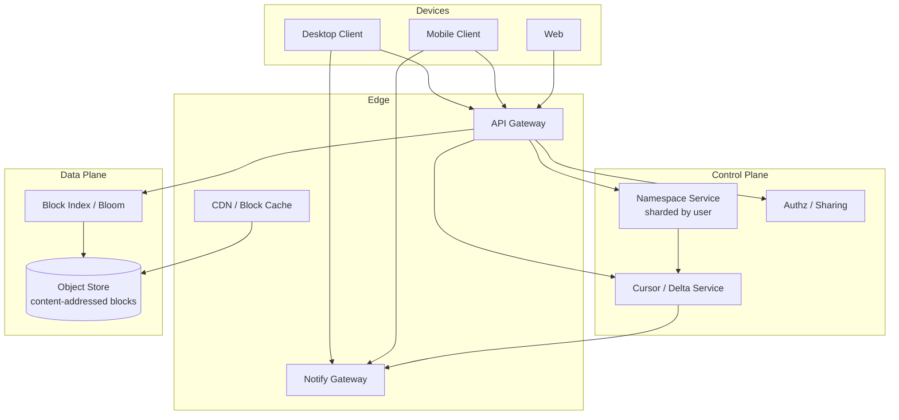
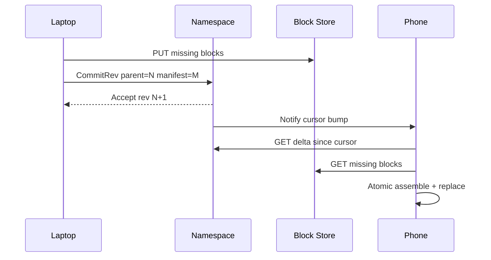

# System Design: Dropbox / Google Drive File Synchronization

> **Focus areas:** Client sync engine · Chunking · Delta sync · Dedup · Conflict resolution · Metadata vs block store · Notifications · Progressive scale  
> **Style:** End-to-end product + infrastructure design with progressive scale (10× → 100× → 1,000×)  
> **Interview theme:** Multi-device personal/cloud file sync — not a GFS cluster filesystem  
> **Quality bar:** Block-level sync math; explicit conflict UX; WAN-efficient deltas; deal-breakers for naive whole-file upload

---

## Table of Contents

1. [Clarify Requirements (Interview Q&A)](#1-clarify-requirements-interview-qa)
2. [Back-of-the-Envelope Estimation](#2-back-of-the-envelope-estimation)
3. [High-Level Design](#3-high-level-design)
4. [Architecture Diagram](#4-architecture-diagram)
5. [Design Deep Dive](#5-design-deep-dive)
6. [Wrap-Up](#6-wrap-up)
7. [Deeper / Related Interview Questions](#7-deeper--related-interview-questions)

---

## 1. Clarify Requirements (Interview Q&A)

Design a **Dropbox / Google Drive–style sync**: users edit files on multiple devices; cloud is source of truth for committed versions; conflicts are visible and recoverable.

### 1.0 What this is / is not

| Dimension | This doc | Not this |
|-----------|----------|----------|
| Product | Consumer/prosumer cloud sync + sharing | Cluster DFS (GFS/HDFS) |
| Clients | Desktop agents, mobile, web | Datacenter job clients only |
| Conflict | User-visible conflict copies / version history | Silent last-writer-wins only (too weak) |
| Network | WAN, flaky, metered mobile | Fat datacenter bisection |
| Consistency | Per-file causal sync with revision vectors | Strict POSIX cluster leases |

### 1.1 Functional Requirements

| # | Question to ask | Expected / typical interviewer answer | Design implication |
|---|-----------------|----------------------------------------|--------------------|
| F1 | Platforms? | Windows/macOS/Linux agents, iOS/Android, web | Shared sync protocol; platform FS watchers |
| F2 | Offline edits? | Yes — queue and sync when online | Local journal + retry |
| F3 | Conflict policy? | Keep both versions; mark conflict; never silent drop | Conflict copies + version history |
| F4 | Chunking? | Block-level for large files | Content-defined or fixed blocks + manifest |
| F5 | Dedup? | Cross-user optional later; within-user/device yes | Content-addressed blocks |
| F6 | Sharing? | Links + folder ACLs; collab edit Phase 1 | Authz on namespace metadata |
| F7 | Version history? | N days / N versions; restore | Immutable block refs + revision chain |
| F8 | Selective sync / virtual files? | Yes — placeholders on desktop | On-demand hydration |
| F9 | Bandwidth controls? | User caps; LAN sync optional | Scheduler + backpressure |
| F10 | Encryption? | TLS + at-rest; enterprise client-side optional | KMS; optional zero-knowledge mode hooks |
| F11 | Notifications of remote changes? | Near-real-time | Long-poll / websocket / push invalidate |
| F12 | Large files? | Multi-GB videos/ISOs | Resumable block upload; parallel |
| F13 | Moved/renamed files? | Preserve identity; cheap rename | Stable file_id separate from path |
| F14 | Dedup across renames? | Same content → same blocks | Content hashes |

**MVP functional scope:**

1. Account namespace: folders/files with stable IDs.
2. Desktop client watches FS; computes block diffs; uploads new blocks; commits revision.
3. Other devices notified; download missing blocks; assemble file atomically.
4. Conflict: if two devices commit divergent revisions from same base → conflict copy.
5. Resumable uploads; checksum verification.
6. Version history restore (last K versions).
7. Sharing read/write links (basic ACL).
8. Selective sync.
9. Web download/upload of whole files (may use same block API).

**Out of MVP:**

- Google-Docs-style fine-grained OT/CRDT co-editing inside Office binaries
- Full LAN peer sync mesh
- End-to-end zero-knowledge as default
- Server-side antivirus deep dive (hooks only)
- Cluster DFS semantics for Spark jobs

### 1.2 Non-Functional Requirements

| # | Question | Expected answer | Target |
|---|----------|-----------------|--------|
| N1 | Change visible on other device? | Feels "live" on good networks | p50 < 3s notify; transfer dominates large files |
| N2 | Small edit on 2 GB file? | Upload delta only | ≪ full file; ideally few blocks |
| N3 | Availability? | Sync control plane HA | 99.9% metadata; object store durability 11 nines class |
| N4 | Durability? | No lost committed revisions | Commit only after blocks durable + metadata TX |
| N5 | Consistency? | Monotonic per-file revisions; read-your-writes on device | Revision vector / parent_rev checks |
| N6 | Multi-region? | Users pinned to home region | Metadata home cell; blocks in regional stores + CDN |
| N7 | Security? | Private by default; sharing explicit | Authn, ACL, link tokens, audit |
| N8 | Battery / CPU? | Mobile must not burn | Batch hashing; adaptive scheduling |

### 1.3 Cases (User Flows & Edge Cases)

**Happy paths**

1. Edit doc on laptop → blocks upload → commit rev N+1 → phone notified → downloads blocks → file updated.
2. Rename folder → metadata-only op; blocks unchanged.
3. Offline edits on plane → reconnect → sync journal in order.
4. Share folder with collaborator → ACL update → their client mounts shared view.
5. Restore previous version → new revision pointing at old block manifest.
6. Edit 1 byte in large video with CDC → ~1–2 blocks uploaded.

**Edge / failure cases**

| Case | Behavior |
|------|----------|
| Two devices edit offline | On sync: detect divergent parents → `file (conflict device time).ext` + keep both |
| Upload crash mid-file | Resume by block hash inventory; no partial visible |
| Hash collision (theoretical) | Secondary checksum / length; treat as storage integrity event |
| Clock skew | Server assign commit timestamps; logic uses rev ids not wall clock |
| Shared folder permission revoked | Client tears down local copy per policy (keep offline copy vs delete) |
| Disk full on client | Pause hydration; surface error; don't corrupt journal |
| Thundering herd after outage | Quotas + jittered backoff; notify storm coalescing |
| Identical files across users | Optional dedup; privacy review required |
| Extremely chatty app (log file) | Debounce; conflict risk; suggest exclude patterns |
| Move + edit race | file_id stable; apply ops with ordering tokens |

### 1.4 Scales (Progressive)

| Metric | Baseline | 10× | 100× | 1,000× |
|--------|----------|-----|------|--------|
| MAU | 10M | 100M | 1B | — (global hyper-scale) |
| DAU | 2M | 20M | 200M | 2B-class |
| Devices / user | 2.5 | 2.5 | 3 | 3+ |
| Avg stored / user | 50 GB | 50 GB | 80 GB | 100 GB |
| Namespace metadata QPS peak | 50K | 500K | 5M | 50M |
| Block put QPS peak | 100K | 1M | 10M | 100M |
| Notify connections | 2M | 20M | 200M | 2B |
| Deduped block store | 50 PB | 400 PB | 3 EB | 20+ EB |
| Shared folders | 50M | 500M | 5B | 50B |

**What each jump forces:**

- **10×:** Shard metadata by `user_id` / namespace; dedicated notify tier; object store multipart everywhere.
- **100×:** Cell architecture; regional block stores; bloom filters for block existence; CDC chunking default for large files.
- **1,000×:** Cross-region placement; smarter WAN; heavier client intelligence; legal/compliance isolation.

### 1.5 Etc. (Constraints & Assumptions)

- **Home region pinning** for metadata writes.
- **Block store** = blob/object store with immutability.
- **Desktop FS events** unreliable → periodic reconciler.
- **Office lock files / temp files** need ignore rules.

**Scope statement to repeat back:**

> Design Dropbox/Drive-style **multi-device file sync** with block-level chunking, delta upload/download, revision-based commits, explicit conflict copies, version history, sharing ACLs, and near-real-time invalidation—from tens of millions of users upward via sharded metadata cells. Not a datacenter DFS.

---

## 2. Back-of-the-Envelope Estimation

### 2.1 Storage

```text
Baseline: 10M MAU × 50 GB = 500 EB? NO — 10M × 50 GB = 500M GB = 500 PB logical
With cross-user dedup 2–5× optimistic → still hundreds of PB
Without cross-user dedup: ~500 PB logical + RF/erasure overhead on object store
```

### 2.2 Change traffic

```text
Assume 20% DAU sync something meaningful/day; avg upload 20 MB delta
2M DAU × 0.2 × 20 MB ≈ 8 TB/day upload baseline
10× → 80 TB/day; 100× → 0.8 PB/day ingress
```

### 2.3 Metadata

```text
Files/user ~100K max long-tail; avg 20K objects?
10M × 20K = 200B objects — too high for avg users
Realistic avg ~5K files/user → 10M × 5K = 50B inodes at hyper-scale planning
Baseline 10M × 2K = 20B? Still huge — many users sparse
Use: 10M × 500 files = 5B files baseline order for big sync products mid-life
Each inode ~200 B metadata → 1 TB raw; with indexes/revisions → multi-TB → sharded DB
```

### 2.4 Block size & delta efficiency

```text
Fixed 4 MiB blocks: edit middle of file → rewrite that block (good)
Worse for insertions shifting all blocks → prefer content-defined chunking (CDC)
CDC avg 1 MiB: better delta for text/binary inserts; more blocks/metadata
```

### 2.5 Notify connections

```text
2M online devices × 5–10 KB state ≈ 10–20 GB across notify fleet — OK
100×: 200M conns → specialized connection tier, regional
```

### 2.6 Hashing CPU

```text
Hash 100 MB/s/core rolling CDC → large file sync needs streaming hash, not full rewrite buffer
```

### 2.7 Hot keys

- Viral shared folder (course materials) → read amplify; use CDN for blocks + cache manifests.
- Celebrity shared link → rate-limit + CDN.

---

## 3. High-Level Design

### 3.1 Domain model

```text
User / Namespace
  └── Folder (node_id, parent_id, name, acl_ptr)
  └── File (file_id, parent_id, name)
        └── Revision (rev_id, parent_rev, device_id, ts, manifest_hash)
              └── Manifest: ordered list of block_hashes + lengths
BlockStore: content-addressed bytes (hash → blob)
Device: cursor / journal position for namespace
```

**Stable `file_id`:** renames/moves are metadata ops; blocks unchanged.

### 3.2 Chunking strategies

| Strategy | How | Pros | Cons |
|----------|-----|------|------|
| Whole file | hash entire file | Simple | Terrible WAN |
| Fixed blocks | 4 MiB align | Simple deltas | Insert shifts everything |
| CDC (rabin/buzhash) | variable chunks | Excellent deltas | CPU; more fragments |
| rsync rolling | strong+weak sigs | Great for servers | Chatty protocol |

**MVP:** fixed blocks for binary + CDC for documents > N MB. **Deal-breaker:** always upload whole file.

### 3.3 Sync protocol (commit)

```text
1. Client detects change → freeze consistent snapshot (copy-on-write / temp)
2. Chunk + hash → list missing blocks via API (batch existence check)
3. Upload missing blocks (parallel, resumable)
4. CommitRevision(file_id, parent_rev, manifest, checksum)
5. Server: if parent_rev == latest → accept; else conflict
6. Notify other devices with namespace change token
```

### 3.4 Conflict resolution

| Scenario | Resolution |
|----------|------------|
| Divergent edits | Conflict copy: `name (Conflicted copy from Device A 2026-08-06).ext` |
| Delete vs edit | Prefer keep edited as conflict or tombstone policy; surface in UI |
| Concurrent rename | Last commit wins on name; other becomes conflict rename |
| Shared collab | Same as multi-device; optional lock/lease for Office |

**Never** silently discard a committed divergent branch without user visibility.

### 3.5 Delta sync download

```text
Device has rev A manifest; server latest rev B
Diff block sets → download only missing hashes → assemble to temp → atomic replace
```

### 3.6 APIs

| Method | Path | Purpose |
|--------|------|---------|
| POST | `/v1/blocks/exist` | Batch hash existence |
| PUT | `/v1/blocks/{hash}` | Upload block (idempotent) |
| POST | `/v1/files/{id}/revisions` | Commit manifest |
| GET | `/v1/namespaces/{id}/delta?cursor=` | List changes |
| GET | `/v1/blocks/{hash}` | Download |
| POST | `/v1/share` | ACL / links |
| GET | `/v1/notify` | WS / long-poll |

### 3.7 Why metadata DB vs block store

| Plane | Store | Why |
|-------|-------|-----|
| Namespace + revs | Sharded SQL/KV | Transactions, cursors, ACLs |
| Blocks | Object store | Cheap immutable blobs, durability |

**Deal-breaker:** storing file bytes in OLTP rows.

### 3.8 Client architecture

```text
FS Watcher → Event Debouncer → Hasher/Chunker → Journal
    → Block Uploader → Committer → Apply Remote Deltas → Hydrator
Local SQLite: file_id maps, rev cursors, pending ops, ignore rules
```

### 3.9 Trade-offs

| Choice | A | B | Pick |
|--------|---|---|------|
| Existence check | Query each hash | Bloom + batch | Bloom at 100× |
| Notify | Poll 30s | Push WS | Push for UX |
| Dedup cross-user | On | Off | Off MVP (privacy/legal) |
| Virtual files | Full hydrate | Placeholders | Placeholders Phase 1 |

---

## 4. Architecture Diagram





---

## 5. Design Deep Dive

### 5.1 Reliability

**Data loss prevention**

- Blocks immutable and checksummed; commit TX references only existing blocks (server verifies).
- Journal on client durable before acknowledging local "queued".
- Object store durability + metadata multi-AZ.

**Retries & idempotency**

- `PUT /blocks/{hash}` idempotent.
- Commit with `client_op_id` for retries; same op → same rev.

**Rate limits & backpressure**

- Per-user upload bytes/s and commit QPS.
- Global admission when object store or metadata hot.
- Client exponential backoff with jitter after outages.

**Partial failures**

- Never expose half-assembled files; write to `.partial` then atomic rename/replace.
- If commit fails after uploads, orphan blocks GC'd by refcount sweeper.

### 5.2 Scalability

**Sharding**

- Namespace by `user_id` / `namespace_id`.
- Shared folders: either replicate metadata into member shards or store share in dedicated graph with mounts.

**Block index**

- Key-value `hash → refcount, size, locations`.
- At 100× use tiered bloom filters per cell to cut existence RPC fanout.

**Notify tier**

- Sticky user→gateway; Kafka/internal bus for change fanout; coalesce events per device.

**Progressive jumps**

| Scale | Change |
|-------|--------|
| 10× | Shard NS; object store lifecycle; dedicated notify |
| 100× | Cells; CDC default; bloom existence; CDN blocks |
| 1,000× | Regional affinity; ML ignore rules; stricter tenant isolation |

### 5.3 Maintainability

**Ops:** quarantine bad clients; feature-flag chunker versions; repair tools for broken journals.

**Observability:** commit success rate, conflict rate, bytes vs logical bytes (delta efficiency), hash CPU time, notify lag, orphan GC lag.

**Migrations:** chunker v2 dual-write manifests supporting both algorithms during transition.

**Multi-tenant / enterprise:** org policies, retention legal hold, admin audit, device approvals.

**Conflict UX metrics:** % sessions with conflicts; time-to-resolve — product health, not only infra.

---

## 6. Wrap-Up

### Decision summary

| Decision | Choice | Why |
|----------|--------|-----|
| Bytes | Content-addressed blocks in object store | Durability + dedup + immutability |
| Metadata | Sharded namespace + revisions | Transactions & sharing |
| Delta | Fixed + CDC chunking | WAN efficiency |
| Conflicts | Visible conflict copies | User trust |
| Notify | Push invalidation + cursor delta | Latency UX |
| Commit | parent_rev compare-and-set | Detect divergence |

### Phased rollout

1. MVP whole-account sync, fixed blocks, conflicts, history.
2. CDC, selective/virtual files, sharing polish.
3. Cells, bloom index, LAN sync optional.
4. Enterprise zero-knowledge / compliance packs.

---

## 7. Deeper / Related Interview Questions

**Q1. Why content-addressed blocks?**  
Idempotent uploads, natural dedup, integrity, easy resume.

**Q2. How do you detect conflicts?**  
Commit carries `parent_rev`; server CAS against tip; mismatch → conflict.

**Q3. Is LWW ever OK?**  
Only for disposable caches — not user documents.

**Q4. Fixed vs CDC chunking?**  
Fixed simpler; CDC better when bytes insert/shift; hybrid by file type/size.

**Q5. How big should blocks be?**  
256 KiB–4 MiB trade metadata vs overhead; tune with real edit traces.

**Q6. Atomic local replace on Windows?**  
Platform-specific (replace APIs); handle open handles / Excel locks.

**Q7. Shared folder metadata ownership?**  
Avoid dual-writer shards; one canonical share record + mount pointers.

**Q8. How to GC blocks?**  
Refcounts from manifests; delayed GC; repair from version history retention.

**Q9. Delta sync vs rsync algorithm?**  
rsync great 1:1; cloud multi-device prefers stored block inventories.

**Q10. Security of block existence Oracle?**  
Existence by hash can leak; require auth and salt/namespace or encrypt client-side.

**Q11. Thundering herd after outage?**  
Jittered reconnect; server-side drip notify; prioritize recent namespaces.

**Q12. How do placeholders work?**  
Sparse local entries; hydrate on open; dehydrate least-used.

**Q13. Mobile battery?**  
Hash on charger/wifi; batch; lower CDC CPU profile.

**Q14. Dedup legal issues?**  
Cross-user dedup can complicate deletion/GDPR; prefer per-tenant isolation.

**Q15. Order of applying remote ops?**  
Per-file linear revisions; namespace ops with causal tokens / lamport.

**Q16. What if block upload succeeds but commit lost?**  
Retry commit; orphan GC if never referenced.

**Q17. Viral shared folder bandwidth?**  
CDN for blocks; rate-limit listing; snapshot popular manifests.

**Q18. Compare to distributed filesystem.**  
Sync optimizes WAN + conflicts + devices; DFS optimizes datacenter throughput + leases.

**Q19. Index for path lookup?**  
`(parent_id, name) → node_id` unique index; path walks cached.

**Q20. Backpressure on commit storms?**  
Queue; 429 with Retry-After; client coalesces FS events.

**Q21. Exactly-once sync?**  
At-least-once delivery + idempotent block put + CAS commit.

**Q22. Encryption at rest vs E2E?**  
At-rest simpler sharing/search; E2E breaks server dedup/preview.

**Q23. How to test sync correctness?**  
Jepsen-like offline forks; property tests on journals; chaos disconnects.

**Q24. Memory on client for large trees?**  
Lazy directory load; SQLite; don't hold entire namespace in RAM.

**Q25. Load balancer affinity?**  
Notify sticky; data plane hash by block; metadata by user shard.

**Q26. Algorithm for manifest diff?**  
Ordered hash lists; set difference; optional rolling signatures.

**Q27. Handling photos burst from phone?**  
HEIC/JPEG already separate files; parallel uploads; prioritize newest.

**Q28. Version history storage cost?**  
Old manifests share blocks; cost ≈ unique blocks retained by policy.

**Q29. Observability for "files not syncing"?**  
Per-device journal lag, last success, error taxonomy, conflict counts.

**Q30. First prototype?**  
Single user, fixed 1 MiB blocks, local folder + S3 + Postgres revisions + poll delta.

---

## Appendix A — Chunking & Delta Sync Worked Examples

### A.1 Fixed-block edit

```text
File size 100 MiB, block 4 MiB → 25 blocks
User overwrites bytes in block 7 only
Upload: 1 block (4 MiB) + new manifest commit
vs whole file: 100 MiB — **25× worse**
```

### A.2 Insert-shift problem (why CDC)

```text
Insert 100 bytes at offset 0 with fixed 4 MiB blocks
→ All subsequent block boundaries shift → ~25 blocks change
With CDC (Rabin): typically 1–3 chunks change near insert point
```

### A.3 Manifest structure

```json
{
  "file_id": "f_123",
  "rev": 42,
  "parent_rev": 41,
  "blocks": [
    {"hash": "sha256:...", "len": 1048576},
    {"hash": "sha256:...", "len": 980123}
  ],
  "content_md5": "...",
  "mtime_client": 1690000000
}
```

### A.4 Existence batching

```text
Client has 800 new hashes after CDC
POST /blocks/exist with 800 hashes → {missing: [...]}
Upload only missing; commit
At 100×: probe local bloom / cell bloom first to cut RPCs
```

### A.5 Conflict timeline

```text
Device A tip=10 edits offline → wants commit parent=10
Device B tip=10 edits offline → commits 11 first
Device A commit parent=10 fails CAS
Server returns tip=11
Client uploads A's bytes as new file_id OR conflict copy under same folder
User sees both; merge manually if needed
```

## Appendix B — Client Journal State Machine

```text
IDLE → HASHING → UPLOADING_BLOCKS → COMMITTING → IDLE
                 ↘ FAILED_RETRY (backoff)
REMOTE_DELTA → DOWNLOADING → ASSEMBLING → SWAPPING → IDLE
CONFLICT → SURFACED (user visible) → IDLE
```

**Journal durability:** SQLite WAL; op ids monotonic; crash recovery replays incomplete uploads idempotently.

## Appendix C — Sharing & Authz Notes

- ACL evaluated on metadata ops and block download via capability tokens short-lived.
- Link sharing: random token, optional password, expiry; audit access.
- Revocation: bump epoch on ACL; tokens bound to epoch.

## Appendix D — Progressive Scale Checklist

| Jump | Metadata | Blocks | Notify | Client |
|------|----------|--------|--------|--------|
| 10× | Shard by user | Multipart always | Dedicated WS tier | Journal v2 |
| 100× | Cells + share graph | Bloom + CDN | Coalesce storms | CDC default |
| 1,000× | Regional homes | Multi-region place | Edge notify | Adaptive hash |

## Appendix E — Interview Talk Track (8 minutes)

1. Clarify sync vs DFS (1 min)  
2. Block store + revision CAS (2 min)  
3. Chunking/CDC math (1 min)  
4. Conflict copies (1 min)  
5. Notify + cursor delta (1 min)  
6. Scale jumps / cells (1 min)  
7. Risks: shared folders, GDPR dedup, thundering herd (1 min)

---

*Expanded appendices for staff-level depth.*
