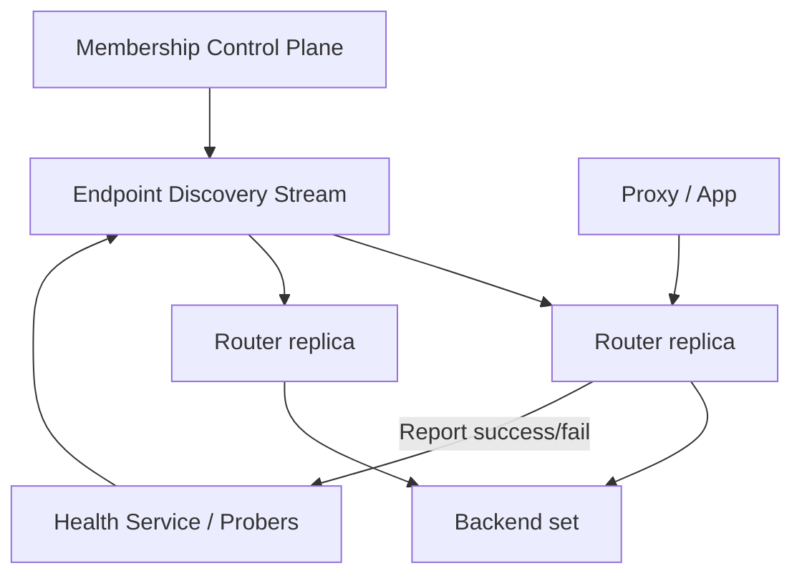
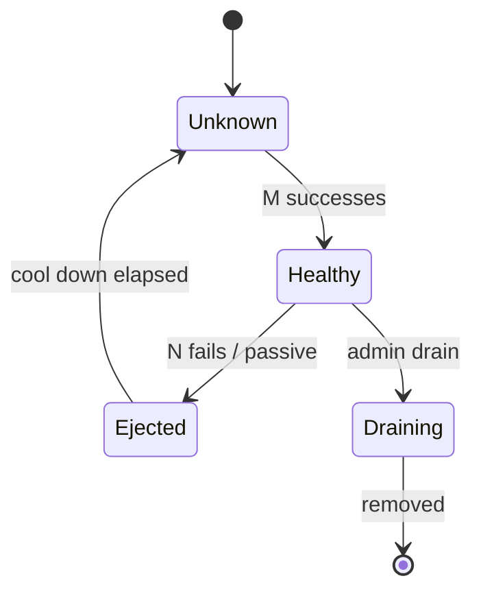

# System Design: Dynamic Round-Robin Router with Health Checks

> **Focus areas:** Weighted/dynamic RR · Active & passive health · Membership churn · Slow-start · Flap damping · Control loops  
> **Style:** Focused router/data-plane design (narrower than full LB product) with progressive scale (10× → 100× → 1,000×)  
> **Domain:** Continuously updated backend set with fair rotation and rapid unhealthy ejection

---

## Table of Contents

1. [Clarify Requirements (Interview Q&A)](#1-clarify-requirements-interview-qa)
2. [Back-of-the-Envelope Estimation](#2-back-of-the-envelope-estimation)
3. [High-Level Design](#3-high-level-design)
4. [Architecture Diagram](#4-architecture-diagram)
5. [Design Deep Dive](#5-design-deep-dive)
6. [Wrap-Up](#6-wrap-up)
7. [Deeper / Related Interview Questions](#7-deeper--related-interview-questions)

---

## 1. Clarify Requirements (Interview Q&A)

This problem zooms in on **membership + health + selection**, often as the core of an L7 proxy pool or service-mesh outlier detection.

### 1.0 What this is / is not

| This is | This is not |
|---------|-------------|
| A **dynamic router**: select next backend via round-robin variants under churn | Full API gateway (auth, WAF, transform) |
| Health-checked membership with weighted/dynamic adjustments | DNS-only client-side RR |
| In-process library **or** small router service | Global anycast edge platform (can sit behind one) |
| Deterministic fairness under concurrency | Perfect global synchronization of RR cursors across nodes |

### 1.1 Functional Requirements

| # | Question to ask | Expected / typical interviewer answer | Design implication |
|---|-----------------|----------------------------------------|--------------------|
| F1 | Dynamic what? | Backends register/deregister continuously; weights change with load/capacity | Membership view + versioned snapshots |
| F2 | Classic RR or weighted? | **Weighted** RR; weights from instance size or controller | Smooth WRR (e.g. nginx-like) or ECD |
| F3 | Health checks? | Active probes + passive failure detection | Separate health state machine |
| F4 | Slow start? | New members ramp weight 0→W over T seconds | Avoid thundering herd on deploy |
| F5 | Client type? | Proxy routing HTTP/gRPC requests (not packet L4 focus) | Per-request selection |
| F6 | Consistency of RR across proxy replicas? | Best-effort local RR; global fairness approximate | Local cursors OK |
| F7 | Quarantine / flap? | Yes—eject, cool down, probe before full weight | Hysteresis + exponential hold-down |
| F8 | Priority tiers? | Optional: primary then spillover pool | Two-level selection |
| F9 | Admin override? | Force-up / force-down for ops | Overrides in membership |
| F10 | Discovery source? | Service registry / control plane push / K8s EDS | Pluggable membership source |
| F11 | Metrics feedback? | Optionally shrink weight if p99 high (dynamic) | Closed-loop controller with bounds |
| F12 | Session affinity? | Out of core RR; optional hash overlay | Don’t break RR fairness silently |
| F13 | Partial success? | Return errors if zero healthy | Panic threshold optional |
| F14 | Multi-AZ awareness? | Prefer local AZ RR, failover to remote | Locality-aware groups |

**MVP functional scope:**

1. Membership add/remove/update weight via control API or registry watch.
2. Weighted round-robin selection among HEALTHY members.
3. Active health checks (HTTP/TCP) with configurable interval/threshold.
4. Passive ejection on consecutive failures / error rate.
5. Slow-start for new or reinstated members.
6. Flap damping (hold-down).
7. Multi-replica router: each has local WRR state; shared membership via push.
8. Observability: selections, ejections, healthy count.

**Out of MVP:**

- ML-based predictive weighting
- Global perfectly fair RR across all proxies
- Full TLS/cert product surface (assume upstream handles)
- Maglev L4 (different algorithm family)

### 1.2 Non-Functional Requirements

| # | Question | Expected answer | Target |
|---|----------|-----------------|--------|
| N1 | Selection latency | Inline on request path | p99 < 10–50 μs in-process; < 1 ms if RPC |
| N2 | Failover | Unhealthy out quickly | Detect in 1–5 probe intervals; passive faster |
| N3 | Availability | Router HA | N+2 router replicas; membership CP 99.9% |
| N4 | Churn tolerance | Rolling deploys | No lost membership updates; slow-start |
| N5 | Correctness | No traffic to DOWN | Except explicit panic/force-up |
| N6 | Fairness | Weights respected within ε over windows | Document statistical fairness |
| N7 | Safety of dynamic weights | Controller cannot oscillate wildly | Dampen; min/max weight; rate-limit changes |

### 1.3 Cases

**Happy paths**

1. 3 healthy backends weight 1 → selections cycle A,B,C,A…
2. Weight 2,1,1 → A gets ~50% over window.
3. New backend registers → slow-start → full weight.
4. Backend fails probes → EJECTED → removed from RR ring → recovered after successes → slow-start.
5. Rolling deploy: drain (weight 0) → remove → add new.

**Edge / failure cases**

| Case | Behavior |
|------|----------|
| All unhealthy | Fail open to panic set **or** fail closed 503—pick explicitly |
| Membership empty | Immediate error |
| Split views across routers | Temporary imbalance; converge via versioned EDS |
| Probe network partition | Multi-AZ probes; don’t trust single prober |
| Weight=0 | Eligible for drain; not selected |
| Hot request spikes on one node | Optional dynamic down-weight with cooldown |
| Clock skew on slow-start | Use monotonic router time |
| Registry flap | Debounce add/remove; require stable generation |
| Concurrent Select() | Lock-free WRR or sharded cursors |
| Passive false positive (client cancel) | Don’t count client resets as backend failure |

### 1.4 Scales

| Metric | Baseline | 10× | 100× | 1,000× |
|--------|----------|-----|------|--------|
| Backends / pool | 50 | 500 | 5K | 50K |
| Pools | 100 | 1K | 10K | 100K |
| Selections / sec / router | 100K | 1M | 10M | 100M |
| Membership updates / sec | 10 | 100 | 1K | 10K |
| Health checks / sec (global) | 1K | 10K | 100K | 1M |
| Router replicas | 10 | 100 | 1K | 10K |
| Ejections / hour | 50 | 500 | 5K | 50K |

**What each jump forces:**

- **10×:** Lock-free selection; dedicated prober workers; EDS incremental.
- **100×:** Shard pools across routers; hierarchical locality; batched health gossip.
- **1,000×:** Cannot probe all from all; sampled probes + passive-first; pool subsetting (bounded healthy set).

### 1.5 Etc.

- **In-process vs service:** Prefer library in proxy for latency; control plane still external.
- **Sibling design:** Full load balancer doc covers VIP/TLS/anycast; this doc owns **pool picker + health**.
- **Dynamic weights source:** Manual, instance CPU, RPS capacity, or AIC (adaptive)—start manual+slow-start.

**Scope statement:**

> Design a dynamic weighted round-robin router with active/passive health checks, slow-start, and flap damping that stays correct under membership churn from 50 to 50K backends per pool via subsetting and sharded probing.

---

## 2. Back-of-the-Envelope Estimation

### 2.1 Selection cost

```text
Smooth WRR step: O(n) naive scan vs O(1)–O(log n) structures
At 100K selections/s, O(n) with n=500 is heavy → keep eligible list compact
Subsetting: route over max 20–100 healthy endpoints even if service has 5K
```

### 2.2 Health check fanout

```text
5K backends × 1 check / 2s = 2.5K checks/s / pool
1000 pools → millions/s if naive → shard + raise intervals + subset
```

### 2.3 Membership bandwidth

```text
Update msg ~200 B
1K updates/s = 200 KB/s (fine)
Full snapshot 50K backends × 100 B = 5 MB — incremental only at scale
```

### 2.4 Memory per router

```text
Endpoint object ~256 B
5K × 256 B = 1.25 MB / pool
1000 pools → 1.25 GB → shard pools or subset
```

### 2.5 Fairness window

```text
With weights, expect empirical ratio within ~1% over ≥10K selections
Test in interview with small simulation mental math
```

---

## 3. High-Level Design

### 3.1 State model

```text
Pool:
  pool_id
  algorithm: WRR | WRR_LOCALITY
  panic_threshold
  subset_size
  version

Endpoint:
  id, address
  configured_weight
  effective_weight      # slow-start / dynamic
  health: UNKNOWN|HEALTHY|UNHEALTHY|DRAINING|EJECTED
  consecutive_fails, consecutive_successes
  eject_until
  locality (az, region)
  stats: in_flight, error_rate EWMA

RouterView:
  snapshot of endpoints for pool @ version
  eligible[]             # HEALTHY && effective_weight>0
  wrr_state              # cursors / current weights
```

### 3.2 Weighted round-robin algorithms

#### A. Smooth WRR (nginx-style)

```text
For each selection among eligible:
  for e in eligible: e.current += e.effective_weight
  pick = argmax(current)
  pick.current -= sum(effective_weights)
  return pick
```

- Fair for weights; O(n) per selection—OK for small eligible sets.

#### B. Expanding consecutive dispatcher / gcd WRR

Classic WRR sequence generation—more awkward under dynamic weight changes.

#### C. Lottery / alias method

O(1) pick after O(n) rebuild; rebuild on membership/weight change.

**Choice:** Smooth WRR for n≤100 eligible; alias method when subsets larger; **always subset** at extreme scale.

### 3.3 Dynamic weight controller (optional closed loop)

```text
effective = configured * slow_start_factor * health_factor * load_factor
load_factor from EWMA(latency or CPU) mapped to [0.1, 1.0]
Rate-limit d(effective)/dt; hysteresis bands
```

**Guardrails:** never silence a healthy backend forever; explore with min weight floor; disable if oscillation detected.

### 3.4 Health state machine

```text
UNKNOWN --successes≥M--> HEALTHY
HEALTHY --active fails≥N or passive--> EJECTED
EJECTED --until eject_until--> UNKNOWN (probing)
UNHEALTHY similar
DRAINING: effective_weight=0; no new picks; remove when idle
FORCE_DOWN / FORCE_UP overrides
```

**Passive signals:** connect fail, timeout, 5xx (configurable). Ignore 4xx mostly. Overflow/cancel not counted.

### 3.5 Active probing

```text
Prober loop per endpoint (or sharded):
  every interval_jittered:
    send TCP connect or HTTP GET /ready
    timeout small (e.g. 1s)
    update consecutive_*; transition SM
```

**Multi-router:** prefer **centralized health service** gossiping results, or quorum (2 of 3 probers) to reduce false eject.

### 3.6 Slow-start

```text
on enter HEALTHY from new/EJECTED:
  effective = max(1, configured * t/T) for t in [0,T]
  T = 30–60s typical
```

Prevents new replica from taking 1/N traffic instantly while caches cold.

### 3.7 Locality-aware RR

```text
Build eligible_local = healthy in same AZ
If |eligible_local| >= min_local: WRR on local
Else WRR on regional / all
```

### 3.8 Membership integration

| Source | Mechanism |
|--------|-----------|
| Control plane API | Push Add/Remove/Drain |
| K8s / EDS | Watch endpoints; generation numbers |
| Heartbeat registry | TTL membership; danger of false death—use with care |

Version every snapshot; routers ACK.

### 3.9 APIs

| Method | Path | Purpose |
|--------|------|---------|
| POST | `/v1/pools/{id}/endpoints` | Register |
| PATCH | `/v1/endpoints/{id}` | Weight / force state |
| POST | `/v1/endpoints/{id}/drain` | Drain |
| GET | `/v1/pools/{id}/view` | Debug snapshot |
| POST | `/v1/pools/{id}/select` | Optional RPC select (library preferred) |
| GET | `/v1/pools/{id}/health` | Health summary |

**Library API (preferred):**

```text
endpoint = pool.Select()
err = pool.Report(endpoint, success|fail|statusCode)
```

### 3.10 Trade-offs

| Decision | Choose | Over | Deal-breaker |
|----------|--------|------|--------------|
| Cursor scope | Per-router local | Globally synced RR | Sync latency / SPOF |
| Eligible size | Subset 20–100 | Full 50K ring | CPU + unfair churn |
| Health | Active+passive | Active only | Slow death detection |
| Dynamic load weights | Optional dampened | Aggressive every request | Oscillation outage |
| Panic mode | Configurable | Always fail closed | Correlated probe failure blackhole |

### 3.11 Progressive scale

- **Baseline:** In-process WRR, active HC, slow-start.
- **10×:** Passive eject; locality; EDS; lock-free/sharded state.
- **100×:** Central health; subsetting; alias method.
- **1,000×:** Pool sharding; sampled probes; hierarchical locality; controller rate limits.

---

## 4. Architecture Diagram

### 4.1 Components



### 4.2 Select + report loop

```text
Request -> Select(eligible WRR) -> call backend
         -> Report(outcome) -> update passive health / in_flight
Prober thread independently transitions health → rebuilds eligible snapshot
```

### 4.3 Health state diagram



---

## 5. Design Deep Dive

### 5.1 Reliability

#### 5.1.1 Invariants

1. **Select never returns EJECTED/DRAINING/weight0** (unless panic override).
2. **Membership version monotonic** per pool.
3. **Slow-start always applied** after ejection recovery.
4. **Report metrics don’t mark client cancels as backend fails.**
5. **Panic threshold:** if healthy_ratio < P, keep marginal endpoints in rotation.

#### 5.1.2 Flap damping

```text
eject_duration = min(max_eject, base * 2^eject_count)
reset eject_count after stable_healthy_period
```

Prevents oscillate healthy↔ejected under threshold load.

#### 5.1.3 False unhealthy

| Cause | Mitigation |
|-------|------------|
| Single prober path down | Quorum probers different AZs |
| HC path differs from data path | Probe same VIP/path shape as traffic |
| Shared dependency fail | Panic threshold |
| Slow GC pause | Passive rate over consecutive absolute fails |

#### 5.1.4 Membership races

```text
Drain: set DRAINING in CP → routers → wait → Delete
Add: Add with weight + slow-start flag
Never delete before drain timeout without force
```

#### 5.1.5 Concurrency

- Immutable snapshot of `eligible[]` swapped via atomic pointer.
- WRR cursor in thread-local or mutex per pool; shard pools across threads.
- Reports update endpoint stats with atomics/EWMA.

### 5.2 Scalability

#### 5.2.1 Subsetting

```text
From N healthy, choose deterministic subset of K for this router:
  hash(router_id, endpoint_id) → rank → top K
Rebuild on membership version change
```

Preserves diversity; limits Select cost; each backend still gets traffic from some routers.

#### 5.2.2 Probe scheduling

- Priority queue next-check-at.
- Jitter intervals.
- Healthy endpoints: longer interval; unhealthy: faster.
- Cap outstanding probes.

#### 5.2.3 Dynamic weight stability

Treat as control system:

```text
error = target_latency - measured
weight *= clamp(1 + k*error, 0.9, 1.1)  # small gains
```

Large gains → positive feedback → meltdown.

#### 5.2.4 Multi-pool routers

100K pools can’t all be hot—lazy load pool state; evict idle pools; CP pushes only assigned shards.

### 5.3 Maintainability

#### 5.3.1 Debuggability

- `WhyNotSelected(endpoint)` explain: health, weight, subset miss, locality.
- Ring dump endpoint for support.

#### 5.3.2 Observability

| Metric | Notes |
|--------|-------|
| `router_select_total{pool,endpoint}` | Bound cardinality—top-N or aggregate |
| `router_ejections` | |
| `eligible_count` | |
| `wrr_skew` | measured vs expected weight |
| `subset_rebuilds` | |

#### 5.3.3 Testing

- Deterministic simulation: fixed RNG, assert distribution.
- Chaos: kill 50% backends; assert recovery + no panic blackhole if configured.
- Load: Select QPS microbenchmark.

#### 5.3.4 Config migrations

- Algorithm flag per pool.
- Health thresholds as versioned policy.

---

## 6. Wrap-Up

### 6.1 Decision summary

| Area | Decision |
|------|----------|
| Algorithm | Smooth WRR on eligible subset |
| Health | Active + passive + flap damping |
| New members | Slow-start |
| Locality | Prefer AZ-local eligible |
| Scale | Subsetting + sharded probes |
| Dynamic load weights | Optional, heavily dampened |
| HA | Stateless routers + versioned membership |

### 6.2 Phased rollout

1. Static WRR + active HC.
2. Weighted + slow-start + drain.
3. Passive ejection + panic threshold.
4. Locality + EDS integration.
5. Subsetting + central health + optional adaptive weights.

### 6.3 Closing line

> Dynamic RR is a **control loop over membership**: fair selection is easy—**stable health under churn** is the real design.

---

## 7. Deeper / Related Interview Questions

1. **Why not globally synchronize the RR pointer?**  
   Coordination cost dwarfs benefit; local fairness + weights suffice.

2. **Smooth WRR vs random weighted?**  
   Smooth is more deterministic/fair short-term; random is O(1) simpler under changing sets.

3. **How does slow-start interact with autoscaling?**  
   Prevents new replicas from drowning; scale-out should account for ramp time in capacity plans.

4. **What’s the difference between drain and eject?**  
   Drain=intentional ops; eject=health failure. Both weight 0; different re-entry policies.

5. **How do you compute expected selection ratios?**  
   `w_i / sum(w)`; measure over large N selections.

6. **When is least-conn better than WRR?**  
   Highly variable request cost / long streams; WRR assumes similar work per request.

7. **Can passive health alone replace active?**  
   Misses idle backends that are dead; combine both.

8. **What is outlier detection in Envoy terms?**  
   Passive ejection based on consecutive 5xx relative to host—same family as this design.

9. **How to avoid thundering herd when a backend recovers?**  
   Slow-start + staggered eject_until across replicas (jitter).

10. **Subset selection bias?**  
   Deterministic hashing per router ensures coverage; monitor backends with zero traffic.

11. **Why jitter health intervals?**  
   Aligns probes → synchronized load spikes on backends.

12. **How do in-flight counts affect RR?**  
   Pure RR ignores them; hybrid: WRR among those under in-flight cap.

13. **Is consistent hashing “dynamic RR”?**  
   No—different goal (stickiness/cache). Don’t conflate in interview.

14. **Panic threshold story from prod?**  
   Cascading eject during DB blip → LB ejects all app hosts → worse outage; panic saves.

15. **How to handle gRPC streaming with RR?**  
   Selection is per-stream/channel policy; long streams imbalance—use least-stream-count hybrid.

16. **Weight=0 vs remove from list?**  
   Keep in membership for HC/metrics; exclude from eligible.

17. **Control-plane push vs pull?**  
   Push/EDS for low latency; pull poll simpler but slower converge.

18. **How large should N fail threshold be?**  
   Balance speed vs flap; often 3–5 consecutive; rate-based for noisy neighbors.

19. **Client-side RR libraries (e.g. RPC)**  
   Same algorithms; health via client metrics; still need service discovery.

20. **CPU cost of O(n) smooth WRR at n=1000?**  
   Too high at 1M QPS—subset or tree/alias.

21. **How to test flap damping?**  
   Oscillate probe success in test clock; assert backoff durations.

22. **Multi-cluster failover?**  
   Priority groups: WRR inside P0; if empty, P1—still health-checked.

23. **What metrics indicate bad dynamic weighting?**  
   High weight oscillation power spectrum; increase damping.

24. **Relation to circuit breakers?**  
   Circuit breaker stops sending to a host/pool on error budget; health eject is related host-level breaker.

25. **AZ outage behavior?**  
   Local eligible empty → failover remote; may need capacity headroom.

26. **Why report API matters as much as select?**  
   Without accurate failure reporting, passive health is blind.

27. **Can you RR over unhealthy for canary traffic?**  
   Separate canary pool; don’t poke holes in production eligible invariants.
