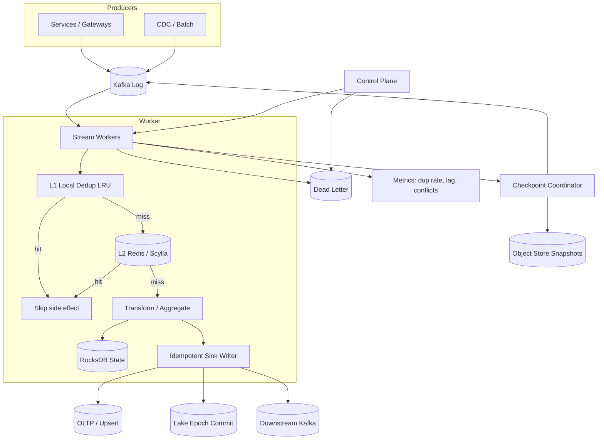
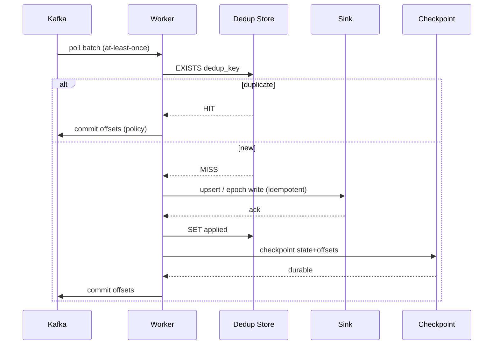

# System Design: Event Deduplication and Exactly-Once-Like Processing

> **Focus areas:** Dedup keys · Idempotent sinks · Checkpoints · Epochs · EOS vs EOO · Outbox · Replay  
> **Style:** End-to-end product design with progressive scale (10× → 100× → 1,000×)  
> **Quality bar:** Correct arithmetic, explicit invariants, honest MVP vs extreme-scale paths, failure-first reasoning  
> **Interview theme:** Data-platform / streaming correctness — “exactly-once” without hand-waving

---

## Table of Contents

1. [Clarify Requirements (Interview Q&A)](#1-clarify-requirements-interview-qa)
2. [Back-of-the-Envelope Estimation](#2-back-of-the-envelope-estimation)
3. [High-Level Design](#3-high-level-design)
4. [Architecture Diagram](#4-architecture-diagram)
5. [Design Deep Dive](#5-design-deep-dive)
6. [Wrap-Up](#6-wrap-up)
7. [Deeper / Related Interview Questions](#7-deeper--related-interview-questions)

---

## 1. Clarify Requirements (Interview Q&A)

The goal of this phase is to **bound the problem**: what “exactly-once” means in *this* system, where duplicates come from, and at what scale the dedup plane must succeed.

### 1.0 What this is / is not

| Dimension | This is | This is not |
|-----------|---------|-------------|
| Job | Guarantee **at-most-once side effects** (and usually at-least-once delivery) for stream/batch consumers | A general message broker redesign |
| Correctness model | **Effectively-once / exactly-once-like** via idempotency + atomic commit | True distributed 2PC across arbitrary external APIs |
| Primary artifact | Dedup store + processing epochs + idempotent sinks | UI product / OLTP CRUD app |
| Failure focus | Crash mid-write, redelivery, clock skew, late duplicates | Matching / ranking / geo search |
| User | Platform / data eng teams embedding this into pipelines | End consumers clicking a button |

### 1.1 Functional Requirements

| # | Question to ask | Expected / typical interviewer answer | Design implication |
|---|-----------------|----------------------------------------|--------------------|
| F1 | What produces duplicates? | Producer retries, broker redelivery, consumer restart, fan-out dual-write, multi-DC replay | Dedup must cover **ingress + processing + sink** layers, not just “Kafka enable.idempotence” |
| F2 | What is the unit of uniqueness? | Business `event_id` (UUIDv7 / ULID) and/or `(source, natural_key)` | Store a **stable dedup key**; never rely on Kafka offset alone for business uniqueness |
| F3 | What is the sink? | Kafka topic, warehouse table, OLTP row, webhook, ledger entry | Sink type dictates idempotency strategy (upsert vs transactional write vs outbox) |
| F4 | Is “exactly-once” end-to-end or processing-only? | End-to-end **effects** into the sink; intermediate retries OK | Design for **EOO (exactly-once output)** / effectively-once, not zero redelivery |
| F5 | Window for dedup? | Hot: 24h–7d; cold: tombstone/hash for 30–90d; forever for money | Tiered dedup: Bloom/Redis → KV/DB → archive |
| F6 | Stateful processing? | Aggregations / joins need state; some jobs are map-only | Checkpoints for state; dedup keys for sink writes |
| F7 | Ordering requirements? | Per-key order; global order not required | Partition by entity key; dedup within partition + global key uniqueness |
| F8 | Late / out-of-order events? | Yes, up to watermark + allowed lateness | Watermarked windows; late events either update or go to late path |
| F9 | Multi-sink / fan-out? | Often two sinks (serving + analytics) | Outbox or per-sink idempotency; avoid dual-write without coordination |
| F10 | Poison / bad payloads? | DLQ after N fails; do not block partition forever | Quarantine; alert; do not mark deduped until success |
| F11 | Replay / backfill? | Operators replay topics; must not double-apply | Epoch / generation id in dedup key or sink version |
| F12 | Multi-tenant isolation? | Shared platform; noisy neighbors | Shard dedup by `tenant_id`; per-tenant quotas |
| F13 | Observability? | Dup rate, false-miss rate, checkpoint lag, sink lag | First-class metrics + sample of suppressed events |
| F14 | Schema evolution? | Keys must remain stable across schema versions | Dedup key extracted before transform; versioned serializers |

**MVP functional scope (lock this with interviewer):**

1. Ingest events from Kafka (or equivalent log) with at-least-once delivery.
2. Extract canonical **dedup key** per event; reject/drop duplicates within retention window.
3. Process map/aggregate with **checkpointed state**.
4. Write to **one primary sink** with idempotent upsert or transactional epoch commit.
5. On crash: restore checkpoint; replay; sink ignores already-applied keys/epochs.
6. DLQ for poison; metrics for dup rate and lag.
7. Operator replay with `generation` / `run_id` so backfills do not collide with live keys incorrectly.

**Out of MVP (explicitly defer):**

- Cross-region active-active dedup with linearizable global uniqueness
- Exactly-once into non-idempotent third-party webhooks without outbox
- Full Flink-compatible SQL surface
- Forever retention of every event_id at raw resolution (use hashes/tombstones)
- Homomorphic encryption / confidential compute for keys

### 1.2 Non-Functional Requirements

| # | Question | Expected answer | Target |
|---|----------|-----------------|--------|
| N1 | Processing latency? | Near-real-time for serving path | p99 end-to-end < 1–5s for streaming path |
| N2 | Dedup lookup latency? | Hot path in memory/Redis | p99 < 1–2ms local / < 5ms remote |
| N3 | Availability? | Pipeline important; money sinks stricter | 99.9% processing; fail-closed for ledger sinks |
| N4 | Durability? | No lost committed effects | Checkpoint + sink commit before ack; RPO ≈ epoch length |
| N5 | Consistency? | At-most-once **side effects** | Effectively-once into sink; reads may lag |
| N6 | False-negative duplicates? | Must be near-zero for money | Hash collisions / Bloom only for non-critical |
| N7 | Multi-region? | Active-passive DR for control; regional data planes | Home-region writer for dedup SoT |
| N8 | Cost? | Dedup store can dominate | Tiered retention; bloom + TTL; sample cold |
| N9 | Throughput? | See scale table | Linear scale via key partitioning |

### 1.3 Cases (Happy Paths & Edge / Failure)

**Happy paths**

1. New event → dedup miss → process → sink upsert with key → checkpoint → commit offsets.
2. Duplicate redelivery → dedup hit → skip side effect → still advance consumer (or ack without write).
3. Crash after sink write, before checkpoint → recovery replays → sink idempotent → no double effect.
4. Crash after checkpoint, before offset commit → replay from earlier offsets → dedup/epoch ignores → safe.
5. Operator backfill with `generation=backfill_2026_08` → separate key namespace or versioned sink rows.
6. Late event within lateness → updates window; outside → side output / DLQ policy.

**Edge / failure cases**

| Case | Behavior |
|------|----------|
| Producer sends two different payloads with same `event_id` | Treat as conflict: first-wins or version compare; alert; never silently overwrite money fields without rules |
| Clock skew makes UUIDv7 order wrong | Dedup by equality not time-order; ordering uses partition key + sequence |
| Bloom filter false positive | Fall back to exact store; never drop solely on Bloom for critical sinks |
| Dedup store outage | Fail closed for critical; or degrade to at-least-once with alarm for non-critical |
| Hot key (one entity floods) | Per-key rate limit; isolate partition; do not OOM local set |
| Checkpoint corruption | Reject restore; fall back to prior epoch; rebuild from source if needed |
| Sink timeout after success | Treat as unknown; retry with same idempotency key |
| Dual-write to two sinks | Outbox pattern; or two-phase epoch with both sinks participating |
| Rebalance mid-epoch | Epoch barriers / transaction abort; no partial commit |
| Extremely delayed duplicate (beyond retention) | Accept residual risk or extend retention for money keys; document RPO/RTO |

### 1.4 Scales (Progressive)

| Metric | Baseline | 10× | 100× | 1,000× |
|--------|----------|-----|------|--------|
| Events/sec (peak) | 50K | 500K | 5M | 50M |
| Unique keys/day | 200M | 2B | 20B | 200B |
| Dup rate (ingress) | 2–5% | 2–5% | 5–10% (retries under load) | 5–15% |
| Dedup window (hot) | 48h | 48h | 24–72h tiered | 24h hot + cold hash |
| State size (aggregations) | 20 GB | 200 GB | 2 TB | 20 TB |
| Checkpoint interval | 10–30s | 10–30s | 5–15s | 1–5s microbatch / continuous |
| Sink write QPS | 40K | 400K | 4M | 40M |
| Dedup store ops/s | 50K | 500K | 5M | 50M |
| Partitions / shards | 128 | 512 | 4K | 32K+ |
| Tenants | 50 | 200 | 2K | 20K |

**What each jump forces architecturally:**

- **10×:** Local LRU + Redis Cluster for dedup; RocksDB-like state; stop putting all keys in one Postgres table.
- **100×:** Partitioned dedup by `hash(key)`; epoch commit to object-store/Delta/Kafka transactional; Bloom tiers; cell per region.
- **1,000×:** Hierarchical dedup (L1 process → L2 shard → L3 cold), approximate structures for analytics-only, exact only for money; autoscaled Flink/Spark-like fleet; home-region SoT.

### 1.5 Etc. (Constraints & Assumptions)

Ask and record:

- **Broker?** Kafka / Pulsar / Kinesis — assume Kafka-compatible log.
- **Criticality class?** Ledger vs analytics (different false-negative budgets).
- **Who owns `event_id`?** Producers must mint; gateway can mint only if it is the SoT.
- **Cloud?** One primary cloud, multi-AZ; multi-region DR.
- **Language/runtime?** JVM stream engine or custom Go/Rust consumers — protocol matters more than language.

**Scope statement to repeat back:**

> Design an **event deduplication + effectively-once processing** platform: ingest at-least-once events, suppress duplicates by stable business keys, checkpoint stateful processing, and write idempotent sinks so side effects are applied at most once—from ~50K events/s baseline through 1,000×—with honest limits on non-idempotent external APIs.

---

## 2. Back-of-the-Envelope Estimation

### 2.1 Traffic

```text
Baseline peak: 50,000 events/s
Avg event payload: 1 KB → 50 MB/s ingress (~400 Mbps)
With framing/replication ×3 in log: ~150 MB/s cluster write

1,000×: 50M events/s → 50 GB/s raw  ← must be sharded regionally; not one cluster
```

**Consumer lag budget:** if checkpoint every 15s and process 50K/s, in-flight unreclaimed ≈ 750K events ≈ 750 MB buffering per pipeline (plus state).

### 2.2 Dedup store sizing

```text
Key representation: 16B UUID + 8B meta (ts, generation) ≈ 32B
+ hash overhead / Redis ≈ 64–100B per key effective

Baseline unique/day: 200M × 80B ≈ 16 GB/day raw index
48h hot window ≈ 32 GB (+ replicas ×2–3 → ~100 GB Redis cluster)

10×: ~1 TB hot  → must shard + Bloom + shorter hot TTL
100×: ~10 TB hot if naive → **tiered**:
  - Bloom 1% FPR: ~2–3 bits/key → 20B keys × 3 bits ≈ 7.5 GB (approx)
  - Exact store only for recent / money / collisions
```

**Interview point:** naive “store every UUID forever in Redis” dies by 100×. Tier aggressively.

### 2.3 False-positive math (Bloom)

```text
n = 2e9 keys, p = 0.001 → m ≈ n × 14.4 bits ≈ 3.6 GB bits ≈ 0.45 GB? 
Wait: 2e9 × 14.4 / 8 ≈ 3.6e9 bytes ≈ 3.6 GB for the bit array (single filter).

At 20B keys, 1% FPR ≈ 20e9 × 9.6 / 8 ≈ 24 GB — still cheaper than exact.
Always pair Bloom with exact fallback for critical paths.
```

### 2.4 Checkpoint / state I/O

```text
State 200 GB, checkpoint every 30s, delta ~1% dirty → 2 GB / 30s ≈ 67 MB/s
Full snapshot weekly — schedule off-peak

At 20 TB state / 1,000×: incremental checkpointing + local RocksDB + remote DFS required
```

### 2.5 Sink write amplification

| Pattern | Amplification | Notes |
|---------|---------------|-------|
| Naive insert-per-event | 1× | Dupes on retry |
| Upsert by key | ~1× | Natural idempotency |
| Epoch files (Parquet) | batch | Commit once per epoch |
| Outbox + CDC | 2× writes | Safer multi-sink |

### 2.6 Memory (worker)

```text
Per-task local dedup LRU: 1M keys × 100B ≈ 100 MB
RocksDB block cache: 1–4 GB / task
Network buffers: hundreds of MB under burst
→ Size workers by state + cache, not just CPU
```

### 2.7 Separate load classes (do not lump QPS)

| Class | What | Baseline peak | 1,000× | Store |
|-------|------|---------------|--------|-------|
| A | Dedup EXISTS/SET | 50K/s | 50M/s | Redis / local+remote |
| B | State updates | 30K/s | 30M/s | RocksDB |
| C | Sink upserts | 40K/s | 40M/s | DB / lake |
| D | Checkpoint I/O | bursty | continuous | Object store |
| E | Offset commits | low | medium | Kafka |

---

## 3. High-Level Design

### 3.1 Core invariants

1. **At-least-once delivery** from the log is assumed.
2. **At-most-once side effects** in the sink are the product guarantee.
3. Dedup key `K = f(event)` is **stable** and **collision-resistant** for the domain.
4. A side effect is applied **iff** the corresponding dedup/epoch commit is durable.
5. Replays with the same `(K, generation)` do not create a second effect.

### 3.2 Exactly-once vocabulary (say this out loud)

| Term | Meaning |
|------|---------|
| At-most-once | May lose; never dup effect |
| At-least-once | May dup; never lose (if sink eventually succeeds) |
| Exactly-once processing | Internal operator state advanced once per input under checkpointing |
| Exactly-once **output** / effectively-once | External sink sees one effect despite retries |
| Idempotent producer | Kafka PID/seq — prevents **broker** dupes, not business-key dupes |

**Deal-breaker claim:** “We enabled Kafka idempotence so we have exactly-once.” That only covers the producer→broker path.

### 3.3 Domain model

```text
Event {
  event_id,          # producer-minted UUID/ULID
  tenant_id,
  entity_key,        # partition / ordering key
  event_type,
  occurred_at,
  payload,
  headers { generation, source, schema_version }
}

DedupRecord {
  dedup_key,         # usually event_id or hash(tenant, natural_key)
  first_seen_at,
  sink_ref,          # optional pointer to applied effect
  generation,
  status             # seen | applied | conflict
}

Epoch {
  epoch_id,
  partition_set,
  source_offsets,
  sink_commit_ref,
  state_snapshot_ref,
  status             # open | committing | committed | aborted
}
```

### 3.4 API / control surface

| Method | Path | Purpose |
|--------|------|---------|
| POST | `/pipelines` | Register pipeline (source, sink, key expr, window) |
| GET/PATCH | `/pipelines/{id}` | Config / pause / resume |
| POST | `/pipelines/{id}/replay` | Backfill with generation |
| GET | `/pipelines/{id}/lag` | Source/sink/checkpoint lag |
| GET | `/dedup/keys/{key}` | Debug: is key present? |
| POST | `/admin/quarantine` | Move poison offsets to DLQ |

Processing is stream-driven; HTTP is control/ops.

### 3.5 Processing pipeline

```text
Source (Kafka)
  → Deserialize + schema validate
  → Extract dedup_key
  → Dedup probe (L1 local → L2 Redis/KV)
      miss: continue
      hit:  metric++; skip sink; maybe still update watermark
  → Transform / aggregate (stateful ops)
  → Sink write (idempotent)
  → Mark dedup applied + checkpoint + commit offsets (coordinated)
```

### 3.6 Commit protocols (choose with interviewer)

#### Option A — Idempotent sink + at-least-once process (MVP favorite)

| Property | Choice |
|----------|--------|
| Dedup | SET NX / INSERT ON CONFLICT DO NOTHING |
| Checkpoint | Optional for map-only; required for state |
| Offset commit | After sink ack |
| Pros | Simple, works with Postgres/Cassandra/Kafka upsert |
| Cons | Requires sink to be idempotent |
| Deal-breaker | Non-idempotent charge API without outbox |

#### Option B — Epoch / transactional sink (lakehouse / Flink style)

| Property | Choice |
|----------|--------|
| Write | Data files staged with `epoch_id` |
| Commit | Atomic metastore commit + offset + state |
| Recovery | Abort incomplete epoch; restore prior |
| Pros | Strong EOO for analytical sinks |
| Cons | Latency = epoch length; metastore hot spot |
| Deal-breaker | Requiring sub-second EOO into slow metastore |

#### Option C — Outbox in OLTP then CDC

| Property | Choice |
|----------|--------|
| TX | Business row + outbox row same DB TX |
| Downstream | CDC consumers idempotent by outbox id |
| Pros | Classic microservice pattern |
| Cons | Not for pure stream-from-Kafka map jobs |
| Deal-breaker | Cross-DB dual write without TX |

**Doc decision:** MVP = **Option A** for serving/OLTP sinks; **Option B** for warehouse; combine with outbox when crossing non-idempotent APIs.

### 3.7 Dedup store options

| Option | Pros | Cons | Deal-breaker |
|--------|------|------|--------------|
| **Redis Cluster SET NX + TTL** | Fast, simple | Memory cost; volatile if misconfigured | Forever retention; no AOF/RDB for money without care |
| Local RocksDB + changelog | Huge key space, fast | Ops complexity; recovery time | Cross-worker sharing without shuffle |
| Cassandra / Scylla | Huge write scale | LWT cost for strong NX | Needing multi-row TX |
| Postgres UNIQUE | Strong, transactional | Won’t hit 100× write QPS | Using as sole store at 5M/s |
| Bloom + exact | Cost efficient | FP handling required | Using Bloom alone for ledger |

**Choice:** L1 process-local LRU → L2 Redis/Scylla for hot exact → L3 cold hash/Parquet for audits. Bloom in front of L2 for analytics-class only or as negative cache carefully.

### 3.8 Key design

```text
Preferred: dedup_key = event_id                    # producer UUID
Alt:        dedup_key = hash(tenant_id, natural_key, event_type)
Money:      dedup_key = idempotency_key from API gateway
Replay:     dedup_key' = hash(dedup_key, generation)
```

**Natural key collisions** (same order updated twice): use version / `updated_at` compare-and-set in sink, not blind dedup skip.

### 3.9 Component architecture

```text
Producers → Kafka (partitions by entity_key)
               ↓
         Stream Workers (autoscaled)
               ├─ Dedup L1/L2
               ├─ State backend (RocksDB)
               └─ Sink writers
               ↓
         Checkpoint Coordinator ──→ Object store (snapshots)
               ↓
         Sinks: OLTP / Kafka / Lake table
               ↓
         Control plane: config, metrics, DLQ, replay API
```

### 3.10 Trade-off summary

| Decision | Choose | Over | Why |
|----------|--------|------|-----|
| Guarantee | Effectively-once effects | Magical EOS everywhere | External systems vary |
| Dedup SoT | Partitioned KV + TTL | Single Postgres | Scale |
| Analytics sink | Epoch commit | Per-row MQ | Throughput |
| Webhooks | Outbox + idempotent receiver | Sync dual-call | Partial failure |
| Hot keys | Isolate + sample | Global lock | Availability |

---

## 4. Architecture Diagram





---

## 5. Design Deep Dive

### 5.1 Reliability

#### 5.1.1 Data-loss prevention

| Risk | Mitigation |
|------|------------|
| Ack before sink | Never; order is sink → dedup applied → checkpoint → offsets |
| Lost checkpoint | Keep N prior epochs; verify checksum |
| Redis flush | AOF/RDB + dual-write critical keys to durable KV; or rebuild from sink unique index |
| Poison loops | DLQ after N; circuit on schema errors |

**Invariant:** offsets advance only after effects are durable *or* safely skipped as duplicates.

#### 5.1.2 Retries & idempotency

```text
Retry policy: exponential backoff + jitter; max attempts; then DLQ
Idempotency: same dedup_key always
Unknown sink timeout: retry same key; sink must be upsert/CAS
```

#### 5.1.3 Rate limits & backpressure

- Pause Kafka consumption when sink lag or dedup store p99 exceeds SLO.
- Per-tenant token buckets at ingress.
- Shed **non-critical** pipelines before **ledger** pipelines.

#### 5.1.4 The dual-write failure matrix

| Crash point | Without care | With protocol |
|-------------|--------------|---------------|
| After sink, before dedup mark | Replay → dup effect | Sink idempotent by key |
| After dedup, before sink | Skip forever / lose | Mark applied only after sink; or epoch atomic |
| After both, before offset commit | Replay | Dedup hit / epoch ignore |
| Partial multi-sink | Split brain | Outbox or 2PC/epoch spanning sinks |

#### 5.1.5 Exactly-once into webhooks (honest path)

1. Write outbox row in TX with business effect.
2. Dispatcher delivers with `Idempotency-Key`.
3. Receiver stores key; duplicates return prior result.
4. If receiver is dumb: accept **at-least-once** and make effect commutative.

### 5.2 Scalability

#### 5.2.1 Partitioning

```text
Kafka partition key = entity_key
Dedup shard = hash(tenant_id, dedup_key) % N
State key group = entity_key
```

Sticky assignment: each worker owns key groups; on rebalance, restore state for claimed groups.

#### 5.2.2 Scale jumps

| Jump | Move |
|------|------|
| 10× | Redis Cluster; increase partitions; local LRU |
| 100× | Tiered Bloom; Scylla for exact; epoch lake commits; cells |
| 1,000× | Regional clusters; approximate analytics dedup; exact money path isolated |

#### 5.2.3 Hot keys

- Detect top-K keys by rate.
- Spill to dedicated partition / worker.
- Coalesce updates (last-writer or aggregate merge).
- Optional: two-phase: local combine → global merge.

#### 5.2.4 Storage tiers

| Tier | Tech | Retention | Use |
|------|------|-----------|-----|
| L0 | Process LRU | minutes | Repeat-in-batch |
| L1 | Redis | 24–72h | Hot exact |
| L2 | Scylla/Cassandra | 7–90d | Warm exact |
| L3 | Parquet hashes | years | Audit / rebuild |

### 5.3 Maintainability

#### 5.3.1 Observability

Must-have metrics:

- `events_in`, `dedup_hits`, `dedup_misses`, `conflicts`
- `sink_success`, `sink_retry`, `dlq_count`
- `checkpoint_duration`, `restore_duration`
- `consumer_lag`, `dedup_store_p99`
- Per-tenant breakdown

Traces: sample path `event_id` through dedup → sink → commit.

#### 5.3.2 Migrations

- Changing dedup key formula = **new generation** or dual-run compare.
- Schema registry for payload; key extraction library versioned.
- Blue/green pipeline with shadow dedup metrics before cutover.

#### 5.3.3 Multi-tenant

- Hard shard prefix `tenant_id`.
- Quotas on events/s and dedup storage bytes.
- Noisy-neighbor: isolate dedicated Redis DB / key prefix / cell.

#### 5.3.4 Ops runbooks

| Symptom | Check | Action |
|---------|-------|--------|
| Dup rate → 0 suddenly | Probe broken / always-miss | Fail closed if critical |
| Lag exploding | Sink / Redis slow | Backpressure; scale writers |
| Checkpoint timeouts | State too large | Increase interval temporarily; incremental only |
| Conflict spike | Producer bug reusing ids | Alert owning team; quarantine |

---

## 6. Wrap-Up

### 6.1 Decision summary

| Area | Decision |
|------|----------|
| Guarantee | Effectively-once **effects** via idempotent sinks + dedup keys |
| Dedup | Tiered L0/L1/L2; exact for money; Bloom assist for analytics |
| Processing | Checkpointed state; Kafka at-least-once |
| Analytics sink | Epoch atomic commit |
| Webhooks | Outbox + Idempotency-Key |
| Scale path | Partition by entity; cells at 100×+ |

### 6.2 Phased rollout

1. **Phase 0:** Map-only + Redis SET NX + Postgres upsert; metrics.
2. **Phase 1:** Stateful checkpoints; DLQ; replay API with generation.
3. **Phase 2:** Lake epoch commits; Bloom tiers; multi-tenant quotas.
4. **Phase 3:** Multi-region DR; cell isolation; money-path hardened retention.

### 6.3 One-liner

> **At-least-once in, at-most-once out** — uniqueness by business key, durability by coordinated sink+checkpoint, scale by sharding and tiered dedup.

---

## 7. Deeper / Related Interview Questions

**Q1. Is Kafka exactly-once enough?**  
No. Idempotent producers + transactional producers help **broker and read-process-write to Kafka**. Business duplicates and non-Kafka sinks still need keys/epochs.

**Q2. Dedup by offset?**  
Offsets identify log position, not business identity. Producers can emit the same order twice on different offsets.

**Q3. Bloom filter alone?**  
False positives drop good events. Use as acceleration with exact fallback; never sole judge for payments.

**Q4. Where do you commit offsets relative to sink?**  
After sink durability (or atomic epoch). Committing early causes loss; the opposite causes dupes handled by idempotency.

**Q5. How do you handle partial batch failure?**  
Per-record keys; don’t mark whole batch applied; or abort epoch.

**Q6. Consistent hashing for dedup shards?**  
Yes for Redis/Scylla ownership; virtual nodes to reduce remapping; migrate with dual-read during rehash.

**Q7. Memory vs accuracy for 20B keys?**  
Tier: approximate + exact recent; archive hashes; accept residual risk outside money SLA or extend retention selectively.

**Q8. Late duplicate after TTL expiry?**  
Document residual re-apply risk; for money keep durable unique index in sink forever.

**Q9. Aggregations and EOS?**  
Checkpoint state with exactly-once processing semantics; sink aggregates with epoch or retract/upsert.

**Q10. Watermarks vs dedup?**  
Orthogonal: watermarks bound event-time progress; dedup bounds identity. Late unique events still process; late duplicates still suppress.

**Q11. Multi-DC active-active dedup?**  
Hard. Prefer single-writer home region per key; or CRDT sets with tombstones and accept merge delays.

**Q12. How to test effectively-once?**  
Fault injection: kill workers at each crash point; assert sink row counts and ledger balances; chaos on Redis.

**Q13. Outbox vs 2PC?**  
Outbox + async for most; 2PC/epoch when one atomic visibility across lake tables is required.

**Q14. Hash collision on 128-bit?**  
Negligible for UUID; if using 64-bit hash, store full key on collision check.

**Q15. Consumer group rebalance storms?**  
Incremental cooperative rebalance; state restore optimization; avoid giant checkpoints.

**Q16. Exactly-once to S3 files?**  
Write `${epoch}/part-*.parquet` then commit manifest; readers only see committed epochs; abort deletes/ignores incomplete.

**Q17. Dedup store as source of truth vs sink unique constraint?**  
Prefer sink unique constraint as ultimate SoT for money; dedup store is acceleration + early reject.

**Q18. Backpressure algorithm?**  
Lag-based pause; reactive streams / Kafka pause; adaptive batch size.

**Q19. GDPR erase of event_id?**  
Dedup keys may be hashed; erasure means stop processing PII payload; tombstones in stores per policy.

**Q20. When is at-least-once acceptable without dedup?**  
Purely commutative metrics with periodic reconcile; never for charges, entitlements, emails without idempotency.

**Q21. Indexing strategy for Postgres idempotency table?**  
UNIQUE(tenant_id, idempotency_key); TTL via partition drop; avoid unbounded heap bloat.

**Q22. Load balancer in front of workers?**  
Usually not — Kafka assigns partitions. Control plane is load-balanced; data plane is partition-driven.

**Q23. Algorithm for local LRU dedup?**  
Clock / LRU hash set; size by bytes; always L2 authoritative for misses after eviction.

**Q24. How does Flink checkpoint barrier work (interview level)?**  
Barriers flow with streams; align; snapshot state; commit on success; recovery restores last completed checkpoint.

**Q25. Deal-breaker architecture?**  
Dual-writing Kafka and DB in app code without TX/outbox; single global Redis for all keys at 100×; claiming EOS without sink idempotency.

---

*End of doc — event deduplication / exactly-once-like processing.*
