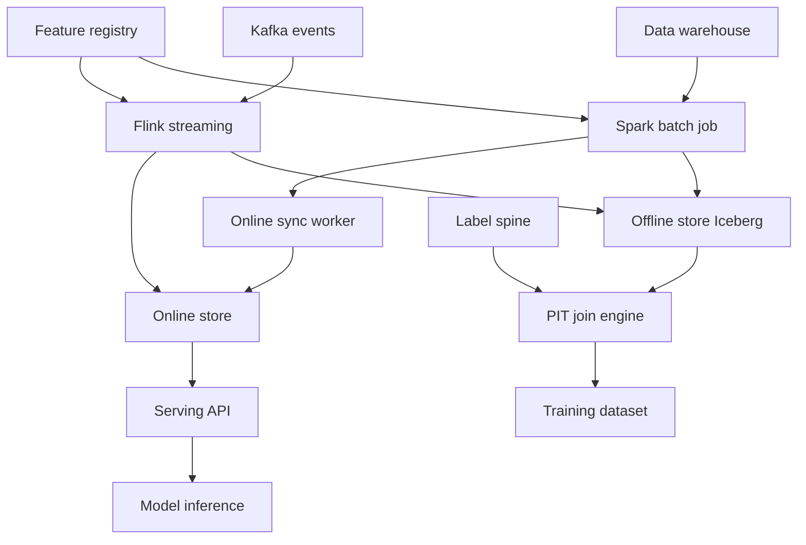
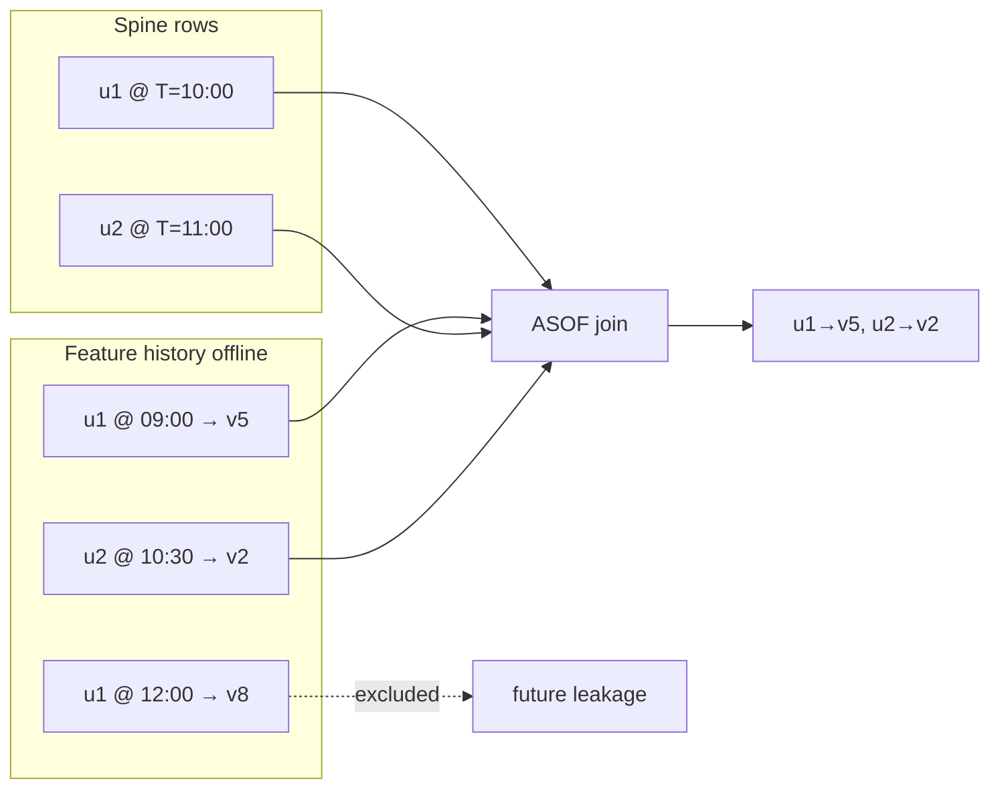

# System Design: Feature Store

> **Focus areas:** Offline/online parity · Point-in-time correct joins · Feature registry · Serving latency · Backfills · Training datasets · Streaming features  
> **Style:** End-to-end ML feature platform with progressive scale (10× → 100× → 1,000×)  
> **API orientation:** Registry + materialization + online serving APIs; not a full model training platform (trainers are consumers)

---

## Table of Contents

1. [Clarify Requirements (Interview Q&A)](#1-clarify-requirements-interview-qa)
2. [Back-of-the-Envelope Estimation](#2-back-of-the-envelope-estimation)
3. [High-Level Design](#3-high-level-design)
4. [Architecture Diagram](#4-architecture-diagram)
5. [Design Deep Dive](#5-design-deep-dive)
6. [Wrap-Up](#6-wrap-up)
7. [Deeper / Related Interview Questions](#7-deeper--related-interview-questions)

---

## 1. Clarify Requirements (Interview Q&A)

The goal of this phase is to **bound the problem**: what we build, what we defer, and at what scale we must succeed.

### 1.0 What this is / is not

| This is | This is not |
|---------|-------------|
| A **feature store**: define features once, materialize offline + online, serve low-latency vectors for inference | A general **data lake** or ad-hoc Spark notebook workflow |
| **Point-in-time correct** training datasets (no label leakage) | A real-time OLTP database for product CRUD |
| **Feature registry** with schema, ownership, lineage, SLAs | Unversioned Redis keys owned by each model team |
| Offline store (historical) + online store (latest) with **parity checks** | Two unrelated pipelines that diverge silently |
| Batch + **streaming** feature pipelines with backfill | Only batch nightly SQL with no freshness path |

### 1.1 Functional Requirements

| # | Question to ask | Expected / typical interviewer answer | Design implication |
|---|-----------------|----------------------------------------|--------------------|
| F1 | Who are the users? | ML engineers, data engineers, data scientists; platform team operates infra | Self-serve registry + SDK; guardrails on schema changes |
| F2 | What is a feature? | Named, versioned signal keyed by **entity** (user_id, item_id) with value + event time | Entity-centric model; `(entity_key, feature_name) → value, event_timestamp` |
| F3 | What is a feature view? | Logical group of features from one data source with shared transformation | Feature view = materialization unit; maps to one pipeline job |
| F4 | Offline vs online? | Offline: historical for training; online: latest for inference | Dual materialization from same transformation definition |
| F5 | Point-in-time correctness? | Training rows must use only data **known at label time** | AS-OF joins; event-time semantics; no future leakage |
| F6 | Entity keys? | user_id, item_id, session_id; composite keys possible | Primary key design; consistent hashing for online store |
| F7 | Feature types? | Numeric, categorical, embeddings, aggregates (7d click count) | Typed schema in registry; validation on write |
| F8 | Batch features? | Daily/hourly aggregates from warehouse | Spark/Flink batch jobs → offline store + sync tail to online |
| F9 | Streaming features? | Counts, rates updated on events (Kafka) | Stream processor maintains state; upsert online; compact to offline |
| F10 | Serving API? | `GetOnlineFeatures(entity_keys[], feature_view)` for model inference | Batch read from Redis/Dynamo/Cassandra; p99 latency SLO |
| F11 | Training dataset API? | `get_historical_features(entity_df, feature_views, timestamp_col)` | Point-in-time join engine over offline store |
| F12 | Backfills? | Recompute feature history after bug fix or definition change | Versioned feature views; partition overwrite jobs; lineage |
| F13 | Feature registry? | Discover, document, deprecate; ownership and tags | Central metadata DB; breaking change policies |
| F14 | Parity monitoring? | Online value should match offline tail for same entity/time | Scheduled reconciliation job; alert on drift |
| F15 | Multi-tenancy? | Teams/projects isolated; shared infra | Namespace per project; quotas on storage and QPS |

**MVP functional scope (lock this with interviewer):**

1. **Feature registry**: register feature views, schemas, entities, owners, TTL.
2. **Offline store**: columnar historical tables (Parquet/Iceberg) keyed by `(entity, event_timestamp)`.
3. **Online store**: low-latency KV for latest feature values per entity.
4. **Batch materialization** job: SQL/Spark transform warehouse → offline → push latest to online.
5. **Training API**: point-in-time join of spine DataFrame to historical features.
6. **Serving API**: batch get online features for inference (100–1000 entities per call).
7. **Backfill** workflow with new feature version without clobbering old training sets.
8. Basic **parity check** between offline tail and online for sample entities.
9. Streaming ingestion path for **one** aggregate feature class (e.g., 1h click count).

**Out of MVP (explicitly defer):**

- Automatic feature discovery / AutoML
- Real-time embedding generation inside feature store
- Cross-cloud active-active online serving
- Full data catalog integration (Amundsen/Atlas) beyond minimal lineage
- On-the-fly arbitrary SQL features at serving time (too slow)
- Feature monetization marketplace
- Homomorphic encryption / federated feature store

### 1.2 Non-Functional Requirements

| # | Question | Expected answer | Target |
|---|----------|-----------------|--------|
| N1 | Online serving latency? | On model inference path | p50 < 5ms, p99 < 20ms for 50 features × 100 entities/batch |
| N2 | Online availability? | Model serving depends on it | 99.95% |
| N3 | Offline query throughput? | Large training jobs | Scan 1B+ rows/hour with partition pruning |
| N4 | Freshness (streaming)? | Near-real-time features | p99 lag < 1–5 min from event to online |
| N5 | Freshness (batch)? | Daily aggregates OK | Complete by SLA (e.g., 6am UTC) |
| N6 | Durability | No silent loss of historical features | Offline store RPO ≈ 0; online rebuildable from offline/stream |
| N7 | Consistency / parity | Training-serving skew is critical bug | Parity checks; same transform code path |
| N8 | Correctness (PIT joins)? | Wrong labels destroy models | AS-OF join semantics tested; audit on backfills |
| N9 | Cost | Storage + online RAM | TTL per feature; cold tiers; compress embeddings |

### 1.3 Cases (User Flows & Edge Cases)

**Happy paths**

1. DS registers `user_click_count_7d` feature view → nightly Spark job materializes → online Redis updated → model calls `GetOnlineFeatures` at inference.
2. DS builds training set: spine `(user_id, label_ts)` → historical join returns features as-of each label_ts → no leakage.
3. Streaming: click events → Flink tumbling window → increment counter → upsert online store → hourly compact to offline.
4. Bug fix in transform → bump feature version → backfill partitions → old training reproducible via version pin.
5. Parity job samples 10K users → offline tail matches online within epsilon → green dashboard.

**Edge / failure cases**

| Case | Behavior |
|------|----------|
| Missing feature for entity at serve time | Return null + default policy; model fallback; metric `feature_missing` |
| Late-arriving event (streaming) | Allowed lateness window; retractions update aggregate; watermark |
| Backfill overlaps online | Version column; online serves v2 while training pins v1 until cutover |
| Schema change (float → int) | New feature name or version; never in-place breaking change |
| Hot entity (celebrity user) | Same as any key — no special case unless skew in partition |
| Training spine duplicate timestamps | Deterministic tie-break: latest event_time ≤ label_ts |
| Massive GetOnlineFeatures batch (10K keys) | Reject over limit; client batching; parallel shard reads |
| Offline partition missing | Join returns null; fail job if critical feature marked required |
| Clock skew event times | Use event_time not ingest_time for PIT; monitor skew |
| Embedding 768-dim × 1M QPS | Separate embedding store; approximate ok; quantization |
| GDPR entity delete | Tombstone entity; purge offline partitions async |
| Two feature views same name | Registry enforces unique `(project, name, version)` |

### 1.4 Scales (Progressive)

| Metric | Baseline | 10× | 100× | 1,000× |
|--------|----------|-----|------|--------|
| Registered feature views | 200 | 2K | 20K | 200K |
| Entities (users+items) | 100M | 1B | 10B | 100B |
| Feature values (offline rows) | 10B | 100B | 1T | **10T** |
| Online serving QPS (peak) | 50K | 500K | 5M | **50M** |
| Entities per GetOnlineFeatures call | 100 | 100 | 200 | 500 |
| Features per view (avg) | 20 | 30 | 50 | 50 |
| Batch materialization / day | 50 jobs | 200 | 1K | 5K |
| Streaming events / sec | 10K | 100K | 1M | **10M** |
| Training join rows / job | 100M | 1B | 10B | 100B |
| Offline storage (compressed) | 5 PB | 50 PB | 500 PB | **5 EB** (tiered) |
| Online RAM working set | 500 GB | 5 TB | 50 TB | **500 TB** (multi-tier) |

**What each jump forces architecturally:**

- **10×:** Shard online store; separate Redis cluster per domain; Iceberg partition by `(feature_view, date)`; Feast-style registry.
- **100×:** Regional online replicas; stream compaction; dedicated serving proxy with batch coalescing; training join pushdown to columnar engine.
- **1,000×:** Cell architecture by tenant; disk-backed online with local cache; feature view placement service; approximate features tier; global metadata plane.

### 1.5 Etc. (Constraints & Assumptions)

- **Build vs Feast/Tecton?** Design system concepts; interview focuses on architecture not vendor API.
- **Primary online store?** Redis Cluster / DynamoDB / Cassandra — pick one and defend.
- **Offline?** S3 + Iceberg/Delta + Spark/Trino for joins.
- **Transform language?** SQL + PySpark UDFs; same logic compiled for stream and batch where possible.
- **Model training?** Out of scope; consumers read historical API output (Parquet).

**Scope statement to repeat back:**

> Design a **feature store** with registry, offline historical store, online low-latency store, point-in-time correct training joins, batch + streaming materialization, backfills with versioning, and offline/online parity monitoring—from ~50K serving QPS and 10B offline rows to 1000× with sharding and tiering.

---

## 2. Back-of-the-Envelope Estimation

### 2.1 Online serving QPS

```text
Baseline: 50K QPS peak GetOnlineFeatures
Avg batch: 100 entities × 30 features = 3K feature values/read
Logical KV ops: 50K × 100 entity keys = 5M key lookups/s (if naive)
→ Use pipelining / MGET: ~50K–200K Redis ops/s with batching

10×: 500K QPS → 100+ Redis shards, regional clusters
100×: 5M QPS → dedicated serving tier, local in-process cache in model servers
1,000×: 50M QPS → edge cache + 90% cache hit on hot entities; shard heavily
```

### 2.2 Online storage (RAM)

```text
Entities online: 20M active (subset of 100M)
Features per entity: 50 avg
Bytes per feature value: ~16 B (key overhead separate)

Raw: 20M × 50 × 16 B ≈ 16 GB per feature generation slice
With Redis overhead (~2–3×) + multiple views: ~500 GB cluster baseline

100× entities if all hot (worst case): 50 TB → need tiering — not all in RAM
Design: hot cache + cold disk-backed (RocksDB/Dynamo)
```

### 2.3 Offline storage

```text
10B rows × 100 bytes avg (entity, timestamp, feature_json) ≈ 1 TB raw per snapshot gen
Historical retention 2 years daily partitions:
  365 × 2 × 1 TB ≈ 730 TB → ~5 PB with replication + multiple views (baseline order)

100× rows: 100 TB/day ingest → Iceberg compaction; Z-order by entity
1,000×: petabyte scale → mandatory cold tier (S3 Glacier for old versions)
```

### 2.4 Materialization compute

```text
Nightly job: scan 500 GB warehouse partition → aggregate → write 50 GB features
Runtime: ~15–30 min on moderate Spark cluster (baseline)
100×: 200 concurrent jobs → workflow scheduler + queue + isolation
```

### 2.5 Point-in-time join cost

```text
Training spine: 100M rows × join to 10 feature views
AS-OF join on (entity, timestamp):
  Sort-merge if both sorted by entity,time → O(n log n) per partition
  Spark shuffle by entity_id → 100M × 10 = 1B join probes

At 100× (10B spine rows): hours without partition pruning — require:
  - Filter offline store to date range of spine
  - Bucket by entity hash
  - Use specialized engine (Velox, BigQuery ASOF)
```

### 2.6 Streaming ingest

```text
10K events/s × 200 B ≈ 2 MB/s baseline
100×: 1M events/s → 200 MB/s → Flink 128+ subtasks, RocksDB state
1,000×: 10M events/s → regional stream cells, aggregate before online write
```

### 2.7 Bandwidth (online sync after batch)

```text
Daily batch writes 20M updated entities × 50 features × 16 B ≈ 16 GB delta
Push to Redis over 1 hour ≈ 4.5 MB/s — trivial
Full refresh worst case 500 GB — use delta detection via change data capture
```

### 2.8 Hot keys

| Pattern | Mitigation |
|---------|------------|
| Viral item_id | Read replicas; local cache in model pod |
| Global feature view metadata | CDN/cache in serving proxy |
| Single massive backfill write | Rate-limit; off-peak; separate pipeline |

---

## 3. High-Level Design

### 3.1 Core Domain Model

```text
Project / Namespace
  └── Entity (user, item, …) — join key type
  └── DataSource (warehouse table, Kafka topic)
  └── FeatureView
        ├── features[]: { name, dtype, description }
        ├── entity
        ├── source + transformation (SQL / python)
        ├── schedule: batch | stream | batch+stream
        ├── ttl / freshness SLA
        ├── version (immutable definition hash)
        └── materialization targets: offline + online

FeatureRow (offline)
  └── (entity_key, event_timestamp, feature_view_version, feature_values map)

OnlineRecord (online)
  └── key = hash(project, feature_view, entity_key)
  └── value = protobuf { values, event_timestamp, version }

TrainingDatasetRequest
  └── spine_uri (entity_id, label_timestamp, …)
  └── feature_views[] + versions
  └── output: Parquet with PIT-joined columns
```

### 3.2 Offline / online parity

**Definition:** For any `(entity, as_of_time)`, value served online (if materialized) equals offline store's latest row with `event_timestamp ≤ as_of_time` for the same **feature view version**.

| Failure mode | Detection |
|--------------|-----------|
| Different SQL in batch vs stream | Single compiled IR (same code path) |
| Clock / timezone bugs | event_time column enforced |
| Partial online push | Row counts + checksum per partition |
| Stale online | Freshness metric: now - max(event_timestamp) |

**Parity job (nightly sample):**

```text
Sample 10K entities
For each: compare online GetFeatures vs offline ASOF query at now()
Alert if |delta| > ε for numeric or mismatch categorical
```

### 3.3 Point-in-time (PIT) correct joins

**Problem:** Training labels at time `T` must not use features computed from events after `T`.

**Spine:**

```text
| user_id | label_ts          | label |
|---------|-------------------|-------|
| u1      | 2026-03-01 10:00  | 1     |
| u2      | 2026-03-01 11:00  | 0     |
```

**Feature history (offline):**

```text
| user_id | event_ts          | clicks_7d |
|---------|-------------------|-----------|
| u1      | 2026-02-28 00:00  | 3         |
| u1      | 2026-03-01 09:00  | 5         |
| u1      | 2026-03-01 12:00  | 8         |  ← must NOT be used for label at 10:00
```

**AS-OF join:**

```sql
-- Conceptual
SELECT s.*, f.clicks_7d
FROM spine s
ASOF JOIN feature_history f
  ON s.user_id = f.user_id
 AND f.event_ts <= s.label_ts
ORDER BY f.event_ts DESC
LIMIT 1 PER s.row  -- latest feature row not after label
```

**Implementation engines:**

| Engine | Approach |
|--------|----------|
| Spark | `merge_asof` after sort by entity, time |
| DuckDB / ClickHouse | Native ASOF |
| Custom | Entity-partitioned binary search on time |

### 3.4 Feature registry

```text
Responsibilities:
  - CRUD feature views with schema validation
  - Ownership, tags, documentation
  - Lineage: source tables → feature view → models (external)
  - Version immutability: new version on definition change
  - Deprecation workflow
  - Access ACLs per project

Storage: Postgres (metadata) + Git-backed transform defs (optional)
NOT the feature data itself
```

**Schema evolution rules:**

| Change | Policy |
|--------|--------|
| Add feature column | New version or nullable add |
| Rename | New feature name |
| Change dtype | New version; backfill |
| Change aggregation window | New version — breaks comparability |

### 3.5 Materialization pipelines

#### Batch path

```text
Airflow/Temporal trigger
  → Spark reads warehouse snapshot (partitioned by date)
  → Apply registered transform SQL
  → Write Iceberg table: offline_store.feature_view_v3/
  → Emit CDC of latest per entity to Online Sync Worker
  → Redis/Dynamo upsert
```

#### Streaming path

```text
Kafka topic (clicks)
  → Flink: keyed by user_id, tumbling 1h window
  → State: count; on window close emit feature row
  → Upsert online store immediately
  → Sink to offline (hourly files) for PIT history
```

**Lambda vs Kappa:**

| Pattern | When |
|---------|------|
| **Batch + speed layer** | Aggregates needing warehouse dimensions |
| **Kappa (stream only)** | Pure event counts; compact to offline |
| **Unified (ideal)** | Same Flink job for stream; batch = replay Kafka history |

### 3.6 Serving API

```http
POST /v1/online-features
{
  "feature_service": "recommendation_v2",
  "entities": {
    "user_id": ["u1", "u2", ...],
    "item_id": ["i9", "i10", ...]
  }
}

→ {
  "metadata": { "feature_view_versions": {...} },
  "results": [
    { "user_id": "u1", "values": { "clicks_7d": 5, "age_bucket": "25-34" }, "event_timestamps": {...} }
  ]
}
```

**Feature service:** Named bundle of feature views for a model — decouples model from individual view names.

**Serving proxy optimizations:**

- Coalesce concurrent requests from model pods (request collapsing)
- Local LRU cache (entity → features) with TTL 1–60s
- Pipeline MGET to Redis cluster
- Protobuf not JSON on internal wire

### 3.7 Training dataset API

```python
spine = pd.read_parquet("s3://labels/churn_2026Q1.parquet")
# columns: user_id, observation_ts, churned

training_df = feature_store.get_historical_features(
    entity_df=spine,
    features=["user_clicks_7d", "user_tenure_days", "item_category_emb"],
    timestamp_column="observation_ts",
    feature_view_versions={"user_clicks_7d": 3, "user_tenure_days": 1},
)
# Returns spine + joined columns — all PIT correct
```

Output materialized to Parquet for trainer (XGBoost, PyTorch).

### 3.8 Backfills

```text
Trigger: bug fixed in transform v3 → v4
Steps:
  1. Register v4 in registry (immutable)
  2. Backfill job: overwrite Iceberg partitions for date range
  3. Do NOT mutate v3 files — training reproducibility
  4. Online cutover: serve v4 with dual-write period optional
  5. Models pin version in training config
  6. Lineage graph updated
```

**Incremental backfill:** Only affected partitions (feature depends on table X → parse lineage).

### 3.9 Option Analysis & Trade-offs

#### A. Online store

| Store | Pros | Cons | Verdict |
|-------|------|------|---------|
| **Redis Cluster** | μs latency; MGET | RAM cost; ops | Default hot store |
| DynamoDB | Managed; TTL | Cost at scale; p99 spikes | AWS-native |
| Cassandra | Wide rows | Tunable complexity | Large wide feature rows |
| RocksDB embedded | No network | Per-pod inconsistency | L2 cache only |

#### B. Offline store

| Store | Pros | Cons |
|-------|------|------|
| **Iceberg on S3** | Time travel; partition evolution | Compaction ops |
| Delta Lake | Similar | Vendor tie |
| HBase | Fast random read | Ops heavy; less cloud-native |

#### C. Registry vs config-in-git

| Approach | Pros |
|----------|------|
| **Registry DB + API** | Discovery, ACLs, UI |
| Git-only | Review flow | Hard for DS self-serve |

**Hybrid:** Registry mirrors approved Git transforms.

#### D. Precompute vs on-demand serve

| | Precompute (chosen) | On-demand SQL at serve |
|--|---------------------|------------------------|
| Latency | ms | seconds — unacceptable |
| Freshness | Materialization lag | Always fresh |
| Cost | Storage + jobs | Warehouse $$$ |

On-demand only for offline training joins.

### 3.10 Progressive Scale Evolution

**Baseline:** Postgres registry + Spark batch + Redis online + S3 Iceberg.

**10×:** Flink streaming; serving proxy; Feast SDK; partition by `(view, dt)`.

**100×:** Regional Redis; model-side cache; ASOF join in Trino; job isolation queues.

**1,000×:** Feature cells; cold storage tier; embedding-specific store; approximate freshness SLAs for low-priority features.

---

## 4. Architecture Diagram

### 4.1 End-to-end

```text
                    +------------------+
                    | Feature Registry |
                    | (Postgres + UI)  |
                    +--------+---------+
                             |
         +-------------------+-------------------+
         |                                       |
         v                                       v
+--------+--------+                    +---------+---------+
| Batch           |                    | Stream            |
| Materialization |                    | (Flink)           |
| Spark/Airflow   |                    +---------+---------+
+--------+--------+                              |
         |                                       |
         v                                       v
+--------+--------+                    +---------+---------+
| Offline Store   |<--- compact --------| Stream sink       |
| Iceberg / S3    |                     +---------+---------+
+--------+--------+                              |
         |                                       |
         |         +-----------------------------+
         |         |
         v         v
+--------+---------+--------+
| Online Sync / Upsert      |
+--------+---------+--------+
         |
         v
+--------+---------+--------+       +------------------+
| Online Store            |<------| Serving Proxy    |
| Redis / Dynamo          |       | (batch MGET)     |
+-------------------------+       +--------+---------+
                                           ^
                                           |
                                  +--------+---------+
                                  | Model inference  |
                                  | services         |
                                  +------------------+

Training path:
  Spine (labels) --> PIT Join Engine --> reads Offline Store --> Training Parquet
```

### 4.2 Mermaid — materialization flows



### 4.3 Mermaid — point-in-time join



### 4.4 Sequence: inference with online features

```text
Model         Serving Proxy    Online Store    Registry
  |                 |               |              |
  | GetOnlineFeatures              |              |
  |---------------->| resolve view  |              |
  |                 |------------------------------>|
  |                 | MGET keys     |              |
  |                 |-------------->|              |
  |                 |<--------------|              |
  | features + ts   |               |              |
  |<----------------|               |              |
  | predict         |               |              |
```

---

## 5. Design Deep Dive

### 5.1 Reliability

#### 5.1.1 Hard invariants

1. **PIT correctness:** feature row used satisfies `event_timestamp ≤ label_timestamp` per spine row.
2. **Version immutability:** published feature view version definition never mutated in place.
3. **Online key includes version** during dual-run cutovers (or separate key namespaces).
4. **At-least-once materialization** with idempotent partition writes (Iceberg overwrite).
5. **Serving fail policy:** explicit defaults documented per model — not silent zeros without metric.
6. **Registry is SoT** for schema — online/offline reject writes violating dtype.

#### 5.1.2 Data loss & recovery

| Risk | Mitigation |
|------|------------|
| Redis cluster failure | Rebuild from offline latest snapshot + stream tail |
| Bad batch job | Rollback partition; pin previous version |
| Flink state corruption | Replay Kafka from checkpoint offset |
| Wrong backfill | Time travel Iceberg snapshots; keep v3 data |

#### 5.1.3 Idempotency

```text
Offline write: partition (view, version, date) overwrite idempotent
Online upsert: last-write-wins on (entity, view, version) with event_time ordering
Stream: keyed state updates commutative where possible (counts)
```

#### 5.1.4 Retries & backpressure

- Materialization jobs: retry failed partitions only.
- Serving: circuit breaker to Redis; degrade to defaults + alert.
- Stream lag: autoscale Flink; never unbounded heap state.

#### 5.1.5 Rate limits

- Per-project online QPS quota.
- Backfill concurrency slots — don't starve nightly batch.
- Registry API rate limits on CI/CD registration storms.

### 5.2 Scalability

#### 5.2.1 Online serving scale

```text
Shard key: hash(project_id, entity_id) → Redis slot
Serving proxy:
  - batch 100 entities → single pipeline
  - optional 50ms coalescing window for duplicate keys
Model pod local cache:
  - 10K entities LRU → cuts Redis 80% on recommender hot set
```

#### 5.2.2 Offline scale

- Partition: `(feature_view, version, event_date)`
- Z-order / sort by `entity_id` within files for join locality
- Compact small files; target 256MB–1GB objects
- Training join: prune partitions to `[min(label_ts)-max_lookback, max(label_ts)]`

#### 5.2.3 Streaming scale

- Keyed state in RocksDB; incremental checkpoints
- Sink to offline in micro-batches (5 min) not per-event
- Aggregate before online write for high-cardinality raw events

#### 5.2.4 Storage tiers

| Tier | Contents | Media |
|------|----------|-------|
| L0 online | Latest features hot entities | Redis |
| L1 online | Warm entities | Dynamo / disk |
| L2 offline | Full history | Iceberg S3 |
| L3 archive | Deprecated versions | Glacier |

#### 5.2.5 Multi-region

- Online: regional clusters; async replication or rebuild from global offline
- Offline: S3 cross-region replication
- Registry: global metadata with strong consistency for writes
- Training: run in data region where spine lives (data residency)

### 5.3 Maintainability

#### 5.3.1 Service boundaries

```text
/registry-service      # metadata API + UI
/materialization-batch # Spark job submitter + monitor
/materialization-stream# Flink job manager
/offline-store         # Iceberg catalog API (thin)
/online-sync           # CDC consumer warehouse → Redis
/serving-proxy         # GetOnlineFeatures
/pit-join-worker       # historical dataset builder
/parity-monitor        # offline vs online reconciliation
/sdk-python / sdk-java
```

#### 5.3.2 Observability

| Metric | Purpose |
|--------|---------|
| `feature_freshness_lag_seconds{view}` | Staleness alert |
| `serving_p99_ms` | SLO |
| `feature_missing_rate{view, model}` | Quality |
| `parity_mismatch_ratio` | Skew detection |
| `materialization_job_duration` | Pipeline health |
| `pit_join_rows_sec` | Training perf |

#### 5.3.3 Multi-tenant isolation

- Namespace quotas: storage GB, online QPS, max feature views.
- No cross-project joins unless explicitly shared **shared views**.
- Dedicated Redis cluster for noisy large tenant (100×).

#### 5.3.4 Testing

- Unit: ASOF join edge cases (ties, missing, duplicates).
- Property: online value == offline tail for random sample.
- Integration: mini Spark + Redis testcontainers.
- Chaos: kill Redis shard mid-serve → fallback behavior.

#### 5.3.5 Migrations & versioning

```text
Feature view v1 running in prod model
Deploy v2:
  - backfill v2 offline parallel
  - shadow serve v2 to metrics only
  - parity v1 vs v2 correlation
  - model retrain on v2
  - cutover serving bundle
  - deprecate v1 after TTL
```

---

## 6. Wrap-Up

### 6.1 What we designed

A **feature store** with central registry, dual materialization (batch Spark + stream Flink) into **Iceberg offline** and **Redis online**, **point-in-time correct** ASOF joins for training datasets, versioned **backfills**, **serving proxy** with batching/caching, and **parity monitoring** to prevent training-serving skew.

### 6.2 Key decisions worth defending

1. **Separate offline vs online stores** — optimized for different access patterns; sync via materialization not ad hoc.
2. **PIT joins via ASOF on event_time** — prevents label leakage; test extensively.
3. **Immutable feature view versions** — reproducible training + safe backfills.
4. **Registry as metadata SoT** — not scattered YAML in repos.
5. **Precompute for serving** — never warehouse SQL on inference path.
6. **Same transform IR for batch and stream** — parity foundation.
7. **Feature service bundles** — models decouple from raw view list.
8. **Explicit missing-feature policy** — avoid silent model corruption.
9. **Partition offline by view+version+date** — prune training scans.
10. **Online rebuildable from offline** — Redis is cache, not sole source of truth.

### 6.3 Phased rollout

| Phase | Ships |
|-------|-------|
| P0 | Registry + batch materialization + Redis serve + manual PIT SQL |
| P1 | Historical API (ASOF join worker) + feature services |
| P2 | Flink streaming + parity monitor |
| P3 | Versioned backfill UI + lineage |
| P4 | Multi-region cells + model-side cache tier |

### 6.4 How to present in 45 minutes

1. Problem: training-serving skew + leakage (5 min)
2. Domain model: entity, feature view, versions (5 min)
3. Offline/online diagram + materialization (8 min)
4. PIT join deep dive with example (10 min)
5. Serving latency math + sharding (7 min)
6. Backfills, parity, streaming (7 min)
7. Scale + Q&A (3 min)

---

## 7. Deeper / Related Interview Questions

### 7.1 Offline / online parity

**Q: Why do training and serving skew?**  
A: Different code paths, batch vs stream timing, wrong timestamp column (ingest vs event), partial materialization failures, stale online cache, schema mismatch.

**Q: How detect skew in production?**  
A: Sample entities; compare online GetFeatures to offline ASOF at `now()`; monitor distribution drift on features used by model; shadow log both paths in canary.

**Q: Is online a cache or source of truth?**  
A: **Offline historical is SoT** for training; online holds latest materialized snapshot — rebuildable from offline + stream replay.

**Q: Same SQL for batch and stream?**  
A: Ideal: compile one transform DAG. Practical: stream approximates; batch reconciles — document differences; use batch corrections nightly.

### 7.2 Point-in-time joins

**Q: Explain leakage with an example.**  
A: Predict churn at Monday 9am using click count that includes Monday afternoon clicks — inflated accuracy. Fix: ASOF join features with `event_ts ≤ label_ts`.

**Q: ASOF join vs regular join?**  
A: Regular join needs exact timestamp match — rare. ASOF finds latest feature row **not after** label time per entity.

**Q: Multiple feature views with different cadences?**  
A: Join each view independently ASOF to spine; spine row accumulates columns; prune partitions per view lookback window.

**Q: What if no feature row before label_ts?**  
A: Return NULL; model uses default; track missing rate — may indicate cold-start entities.

**Q: Duplicate event timestamps?**  
A: Tie-break: max event_ts ≤ label_ts; if equal ts multiple rows, use ingestion sequence or version id deterministically.

### 7.3 Feature registry

**Q: What lives in registry vs data stores?**  
A: Registry: schemas, owners, sources, schedules, version hashes, lineage edges. Data stores: actual feature values at scale.

**Q: Breaking schema change?**  
A: New feature name or new version; never alter v1 schema in place; backfill v2.

**Q: Who approves new features?**  
A: Owner review + platform lint (PII tags, cardinality checks, cost estimate).

**Q: Feature discovery?**  
A: Tags, search, lineage graph "models using this feature", deprecation warnings.

### 7.4 Serving latency

**Q: Hit p99 20ms for 100 entities × 50 features?**  
A: One pipelined MGET per entity key (or wide row per entity); protobuf; colocate proxy with models; local LRU cache; avoid N sequential Redis round trips.

**Q: Wide rows vs many keys?**  
A: Wide row (all features for entity in one hash) → 1 RTT. Many keys → flexible partial reads but more RTTs. Hybrid: feature service bundles as wide rows.

**Q: Embeddings blow memory?**  
A: Separate embedding store; int8 quantize; disk ANN for item embeddings not in Redis hot path.

**Q: Cold start entity?**  
A: Defaults; optional real-time imputation from related entities; metric `cold_start_serves`.

### 7.5 Backfills

**Q: Bug in 90 days of features — fix how?**  
A: Register v+1; Iceberg overwrite partitions day-by-day; keep v for reproducibility; retrain models; cutover online.

**Q: Backfill without taking online offline?**  
A: Dual-write new version keys; flip feature service pointer atomically; delete old version keys after TTL.

**Q: How long backfill 1B rows?**  
A: Parallel Spark by partition; hours–days; prioritize recent partitions first for near-term training.

### 7.6 Streaming features

**Q: Flink vs Spark Streaming?**  
A: Flink lower latency stateful windows; Spark Structured Streaming simpler if already Spark shop — pick one stream engine.

**Q: Late events?**  
A: Watermarks + allowed lateness; retractions update aggregates; offline compact job fixes long-delay events.

**Q: Exactly-once to online store?**  
A: Idempotent upsert with event time ordering; transactional sink or at-least-once + commutative aggregates.

**Q: Stream-only without batch?**  
A: Kappa: replay Kafka for history; compact to offline — works for pure event-driven features; hard for warehouse-only dimensions.

### 7.7 Training datasets

**Q: get_historical_features vs SQL in notebook?**  
A: API enforces PIT semantics, version pins, partition pruning — notebooks copy-paste SQL and leak.

**Q: Output format?**  
A: Parquet colocated with spine; one row per label with all features as columns; include feature event timestamps for debugging.

**Q: 10B row join?**  
A: Distributed ASOF with entity hash partitioning; filter date range; specialized engines; don't collect to driver.

### 7.8 Storage & indexing

**Q: Iceberg vs Delta vs Hive?**  
A: Iceberg/Delta give time travel, schema evolution, hidden partitioning — critical for backfills and audit.

**Q: Index offline by entity?**  
A: Sort/Z-order files by entity_id within partition; not B-tree on object store.

**Q: TTL features?**  
A: Registry declares TTL; offline expire partitions; online Redis EXPIRE; legal hold overrides.

### 7.9 Comparison to alternatives

**Q: Feature store vs data warehouse views?**  
A: Views OK offline; warehouse too slow for online; no unified versioning/parity/serving.

**Q: Feast / Tecton / Chronon?**  
A: Same concepts — registry, offline/online, PIT; buy vs build = integration cost vs control.

**Q: Redis vs Dynamo for online?**  
A: Redis faster lower latency; Dynamo ops simpler multi-AZ; hybrid L1 Redis L2 Dynamo.

### 7.10 Traps & edge cases

**Q: Use `CURRENT_TIMESTAMP` in batch job?**  
A: **Trap.** Breaks PIT — use data snapshot time or per-row event time from source.

**Q: Join spine to latest partition only?**  
A: **Trap.** Leakage if partition has post-label data — need row-level event_ts ASOF.

**Q: One global Redis for all tenants?**  
A: Noisy neighbor; shard by tenant at 100×.

**Q: Null vs 0 for missing?**  
A: Explicit; model trained with imputation strategy; don't conflate.

**Q: Normalize features in store or model?**  
A: Usually model/training pipeline; if in store, version the normalization params.

**Q: Real-time personalisation features from raw logs at serve?**  
A: Too slow — preaggregate in stream; serve materialized.

**Q: Consistent hashing for feature shards?**  
A: hash(entity_id) → Redis slot; resharding uses slot migration.

**Q: Feature importance → store metadata?**  
A: Lineage links model metrics back; optional registry annotation.

**Q: GDPR delete user?**  
A: Tombstone entity in registry job; purge offline partitions; DEL online keys; audit.

**Q: Cross-region training data residency?**  
A: Spine and offline must stay in region; no US features for EU labels without compliance review.

**Q: Monitor cardinality explosion?**  
A: Reject high-cardinality categoricals at registration; sample distinct count in materialization.

**Q: Time travel debugging?**  
A: Iceberg snapshot id + feature version recreates exact training data.

**Q: How many feature views?**  
A: Prefer cohesive views per source entity — not 10K single-feature views (ops nightmare).

**Q: Push vs pull materialization?**  
A: Batch pull from warehouse schedule; stream push from Kafka; online sync push after batch.

**Q: Serving during backfill?**  
A: Continue serving old version until cutover; never empty partial v2.

**Q: Homogeneous vs heterogeneous entity batch?**  
A: Request specifies entity types; proxy groups MGET per view.

**Q: Atomic multi-entity features (user-item cross)?**  
A: Composite entity key `(user_id, item_id)` feature view; or precomputed lookup table.

**Q: Difference from vector DB?**  
A: Vector DB optimizes ANN search; feature store optimizes keyed get of known entities — embedding features may live in both.

**Q: Batch size limit inference SLA?**  
A: Cap entities per request; model batching separate from feature batching.

**Q: Schema registry for Kafka vs feature registry?**  
A: Kafka schema = event payloads; feature registry = derived ML semantics — link lineage.

**Q: Test PIT joins?**  
A: Synthetic spine where correct answer known; property test random timelines.

**Q: Anti-patterns?**  
A: Latest partition join; different transform code stream/batch; unversioned backfill overwrite; silent default 0; warehouse query at inference; ignore event_time watermarks.

---
