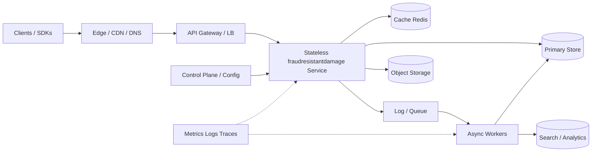
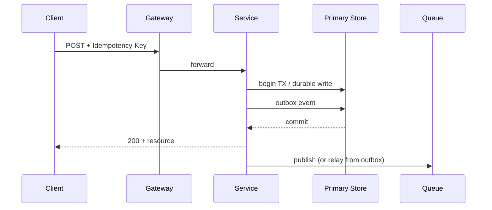

# System Design: Fraud-resistant damage evidence upload

> **Focus areas:** domain workflows · compliance · audit · integrations · correctness
> **Style:** End-to-end design with progressive scale (10× → 100× → 1,000×)
> **Category:** Domain-specific startup prompts
> **Quality bar:** Interview-passable for senior/staff loops — explicit trade-offs, failure modes, and scale jumps

---

## Table of Contents

1. [Clarify Requirements (Interview Q&A)](#1-clarify-requirements-interview-qa)
2. [Back-of-the-Envelope Estimation](#2-back-of-the-envelope-estimation)
3. [High-Level Design](#3-high-level-design)
4. [Architecture Diagram](#4-architecture-diagram)
5. [Design Deep Dive](#5-design-deep-dive)
6. [Wrap-Up](#6-wrap-up)
7. [Deeper / Related Interview Questions](#7-deeper--related-interview-questions)

---

## 1. Clarify Requirements (Interview Q&A)

The goal of this phase is to **bound the problem**: what we build, what we defer, and at what scale we must succeed.

### 1.0 What this is / is not

| Dimension | This doc | Not this |
|-----------|----------|----------|
| Job | Design **Fraud-resistant damage evidence upload** as a production system | A toy single-process demo without failure modes |
| Scope | MVP + progressive scale path | Boiling the ocean of every adjacent product |
| Lens | Correctness, reliability, scalability, operability | Resume-driven buzzword collage |

### 1.1 Functional requirements

| # | Question to ask | Expected / typical answer | Design implication |
|---|-----------------|---------------------------|--------------------|
| F1 | Who are the users / clients? | End users, internal services, or both for Fraud-resistant damage evidence upload | Authn model, SLAs, multi-tenant vs single-tenant |
| F2 | What is the core write? | Create/update of primary entity or event | Durability + idempotency requirements |
| F3 | What is the core read? | Point read, search, stream, or dashboard | Cache vs query engine choice |
| F4 | Sync vs async UX? | User waits for durable ack; heavy work async | Queue + status resource |
| F5 | AuthZ model? | User/tenant/roles; optional public links | Enforce on server; list vs get rules |
| F6 | Retention / deletion? | TTL + user delete + legal hold exceptions | GC across DB/cache/search/object store |
| F7 | Admin / control plane? | Config, kill switches, rebalance, backfill | Separate from data plane; audit |
| F8 | Abuse / limits? | Rate limits + quotas + anomaly detection | Gateway enforcement + per-tenant fairness |
| F9 | Consistency expectations? | Read-your-writes for owner; eventual for projections | Home cell / primary ownership |
| F10 | Offline / mobile? | Maybe; define sync if yes | Conflict policy if offline writes |
| F11 | Analytics needed? | Often approximate / async OK | Do not block OLTP on warehouse |
| F12 | Multi-region? | DR first; active-active only if required | Conflict domains explicit |

**MVP functional scope (lock with interviewer):**

1. Core create/read (and critical update/delete) path for Fraud-resistant damage evidence upload.
2. Authn/authz appropriate to sensitivity of the data.
3. Durable storage for acked writes; idempotent creates.
4. Essential async side effects (notifications, projections) if UX requires.
5. Basic rate limits / quotas; metrics and structured logs.
6. Clear delete/TTL behavior if data can expire or users can purge.
7. One explicit degraded mode under dependency failure.

**Out of MVP (explicitly defer):**

- Nice-to-have ML personalization unless that is the problem
- Cross-region active-active with automatic conflict magic
- Full enterprise admin suite
- Perfect global ordering when causal/local ordering suffices
- Exotic multi-cloud unless asked

### 1.2 Non-functional requirements

| # | Question | Expected answer | Target |
|---|----------|-----------------|--------|
| N1 | Latency | Interactive if user-facing | p50/p99 targets; separate slow paths |
| N2 | Availability | Tier-1 vs tier-2 | 99.9%–99.99%; multi-AZ minimum |
| N3 | Durability / RPO | No loss of acked writes | Quorum/WAL; RPO=0 or seconds |
| N4 | RTO | Minutes for region | Failover runbook tested |
| N5 | Consistency | As above | Document per API |
| N6 | Throughput | Baseline→1000× | Shard + async |
| N7 | Cost | Efficient at hit rate | Tiered storage; avoid over-index |
| N8 | Security | TLS, authz, encryption at rest | Threat model in wrap-up |
| N9 | Privacy | Retention + delete SLO | Cross-store purge |
| N10 | Operability | Dashboards + alerts + tracing | Golden signals day 1 |

### 1.3 Cases (User Flows & Edge Cases)

**Happy paths**
1. Authenticated client performs primary create → durable ack → subsequent read sees result (read-your-writes).
2. Read-heavy path served from cache/CDN with correct TTL/invalidation.
3. Async projection updates search/analytics without blocking user ack.
4. Delete/TTL removes data from primary and secondary indexes within privacy SLO.
5. Admin kill-switch / config change rolls out safely.

**Edge / failure cases**

| Case | Behavior |
|------|----------|
| Duplicate client retry | Idempotency returns original result |
| Hot key | Isolate / split / cache coalescing |
| Dependency timeout | Bounded wait; degrade or fail fast; no infinite queue for interactive |
| Partial worker failure | At-least-once + idempotent handlers; DLQ |
| Clock skew | Prefer monotonic server time / logical tokens for ordering where needed |
| Poison payload | Validate; quarantine; do not block partition forever |
| Overload | 429/503 + shed; protect durables |
| Security abuse | Rate limit + authz deny + audit |
| Regional outage | Failover per stated RPO/RTO |
| Schema change mid-flight | Versioned consumers; compatible evolution |

Domain note: tailor 2–3 cases specifically to **Fraud-resistant damage evidence upload** in the interview (the table above is the baseline set).


### 1.4 Scales (Progressive)

| Metric | Baseline | 10× | 100× | 1,000× |
|--------|----------|-----|------|--------|
| DAU | 1M | 10M | 100M | 1B |
| Peak QPS (read) | 10K | 100K | 1M | 10M |
| Peak QPS (write) | 1K | 10K | 100K | 1M |
| Stored entities | 100M | 1B | 10B | 100B |
| Avg payload | 2–10 KB | same | may grow | may grow |
| Hot-key concentration | top 0.1% → 20% traffic | worse | must isolate | cell + edge |
| Multi-region | single region + DR | active-passive | read replicas global | cell architecture |

**What each jump forces:**
- **10×:** caching, read replicas, async non-critical paths, connection pooling.
- **100×:** shard by tenant/entity key, separate control vs data plane, queue-based backpressure, CDN/edge where applicable.
- **1,000×:** cells / regional single-writer, hot-key isolation, tiered storage, strict SLOs + load shedding, multi-tenant fairness.

### 1.5 Etc. (Constraints & Assumptions)

Ask and record:

- Cloud vs on-prem? Single cloud multi-AZ default.
- Managed services allowed? Usually yes — discuss interfaces, not brand loyalty.
- Compliance? PII/PHI/PCI as applicable to Fraud-resistant damage evidence upload.
- Team size / time? Design for evolution, not big-bang perfection.
- Read-your-writes required? Default yes for owner reads.

**Scope statement to repeat back:**

> Design **Fraud-resistant damage evidence upload**: MVP correctness and durability first, then a clean path through 10× / 100× / 1,000× with explicit trade-offs on consistency, caching, sharding, and failure modes. Defer adjacent products unless requested.

---

## 2. Back-of-the-Envelope Estimation

### 2.1 Traffic

```text
Assume baseline peak read QPS R, write QPS W for "Fraud-resistant damage evidence upload".
Peak factor ≈ 10–15× average daily rate.

Example (tune in interview with interviewer numbers):
  Writes: 1K peak → ~86M writes/day if sustained (usually far spikier)
  Reads:  10K peak → mostly cache/CDN if read-heavy
```

Split **write classes** (do not lump):
1. Synchronous user-facing durable writes
2. Cache / session / ephemeral updates
3. Async pipeline / analytics events
4. Compaction / GC / repair traffic (can dominate if misdesigned)

### 2.2 Storage

```text
entities × avg_size × replication_factor × (1 + index_overhead)
Index overhead often 30–100% depending on secondary indexes.
Replication RF=3 → 3× raw; with EC (e.g. 6+3) ~1.5× for cold blobs.
```

### 2.3 Memory & cache

| Tier | What | Size heuristic | TTL / invalidation |
|------|------|----------------|--------------------|
| L1 process | hot keys / computed views | tens–hundreds MB/node | short + explicit invalidate |
| L2 Redis/Memcached | session, popular entities | 10–20% of hot working set | TTL + version bump |
| L3 CDN/edge | public immutable/mutable-with-purge | workload-specific | purge on update |
| Negative cache | misses / 404s | small | short TTL to avoid stampede |

### 2.4 Bandwidth & fanout

```text
egress ≈ QPS × avg_response_size
fanout amplification: 1 user action → N downstream writes/reads
If fanout N > 100, must batch, async, or hybrid push/pull.
```

### 2.5 Capacity sketch

```text
App nodes ≈ peak_QPS / per_node_QPS × (1 + headroom 0.5)
Per-node QPS depends on handler cost (CPU-bound vs IO-bound).
Stateful stores sized by working set + growth + compaction headroom (often 50% free).
```

Section family `13-domain-specific` emphasizes: domain workflows · compliance · audit · integrations · correctness.


---

## 3. High-Level Design

### 3.1 Recommended architecture (default interview answer)

Client → API Gateway / LB → **Stateless service tier** → primary stores + cache → async log/queue → workers.

Core components for **Fraud-resistant damage evidence upload**:
- **domain API**
- **workflow/state machine**
- **integration adapters**
- **audit/compliance**
- **notification**

### 3.2 API sketch (illustrative)

```text
POST   /v1/resources              # create (Idempotency-Key)
GET    /v1/resources/{id}         # read
PATCH  /v1/resources/{id}         # conditional update (If-Match / version)
DELETE /v1/resources/{id}         # soft delete + async purge
GET    /v1/resources?cursor=...   # stable pagination
POST   /v1/admin/recompute        # control-plane / backfill (authz)
```

Return typed errors: `400` validation, `401/403` authz, `404`, `409` conflict, `429` rate limit, `503` with retry-after.

### 3.3 Data model (logical)

```text
Resource {
  id, tenant_id, ...domain fields...,
  version, created_at, updated_at, deleted_at
}
Event / Outbox {
  id, aggregate_id, type, payload, created_at, published_at
}
IdempotencyRecord {
  key, request_hash, response_code, response_body_ref, expires_at
}
```

Physical choices (pick with trade-offs):
| Need | Prefer | Avoid when |
|------|--------|------------|
| Relational invariants | Postgres / Spanner-class | ultra-high write append-only logs |
| Massive append | Kafka / object storage | point updates with secondary indexes |
| Low-latency KV | Redis / Dynamo-style | multi-row transactions across keys |
| Analytics | Columnar lakehouse | OLTP dual-purpose |

### 3.4 Key design choices & trade-offs

| Option A | Option B | Choose A when | Choose B when | Deal-breaker |
|----------|----------|---------------|---------------|--------------|
| Sync write path | Async + eventually consistent read | User must see durable ack | Throughput / fanout dominates | Lying about durability |
| Strong consistency | Eventual / CRDT | Money, inventory, authz | Presence, counters, feeds | Ignoring conflict types |
| Shard by tenant | Shard by entity | Noisy-neighbor isolation | Even key distribution | Hot tenant without cell limits |
| Cache-aside | Write-through | Read-heavy, tolerable stale | Need simpler consistency | Stampede without locking/singleflight |

**Algorithms / structures likely discussed:** state machines, outbox, temporal workflows, evidence hashing, calendar/interval indexes

### 3.5 Deal-breakers for this problem family
- skip audit for PHI/PII
- no legal hold
- strong consistency everywhere when workflow async suffices

### 3.6 Why not the obvious alternatives?

- **Single SQL database forever:** fine to baseline; fails when write QPS, connection count, or working set exceeds vertical scale — plan shard key early even if you delay sharding.
- **“Just use Kafka for everything”:** great for async decoupling; poor as a query store or request/response bus for interactive UX.
- **Global immediate consistency:** expensive and often unnecessary; prefer single-writer home cell / entity ownership.


### 3.7 Detailed component responsibilities

| Component | Responsibility | State | Scale lever |
|-----------|----------------|-------|-------------|
| Gateway / LB | TLS, auth, rate limit, routing | Stateless | Horizontal |
| Service | Business logic, validation, orchestration | Stateless | Horizontal |
| Primary store | Source of truth | Stateful | Shard / vertical → cells |
| Cache | Hot read acceleration | Ephemeral | Horizontal + hash |
| Queue/Log | Async decoupling, replay | Stateful | Partition |
| Workers | Projections, GC, notifications | Mostly stateless | Consumer lag based |
| Object storage | Blobs / cold | Stateful | Unlimited bytes |
| Observability | Metrics/logs/traces | — | Separate failure domain |

### 3.8 Control plane vs data plane

Keep control-plane mutations (config, topology, ACLs) away from the ultra-hot data path.
Cache config with version numbers; watch/long-poll or push updates; fail closed or open explicitly.


---

## 4. Architecture Diagram



**Read path:** Client → Edge → Gateway → Service → Cache hit return; miss → primary store → populate cache.

**Write path:** validate → idempotency → durable write (DB and/or log) → ack → async projectors update caches/search/analytics.


### 4.1 Sequence (write)



---

## 5. Design Deep Dive

### 5.1 Reliability

**Durability / no silent data loss**
- Persist before ACK for user-visible commits; use fsync / quorum as required by SLO.
- Outbox or dual-write avoidance: write state + event atomically (same TX or log-first).
- Idempotency keys on all creating side effects; replay-safe consumers.

**Retries, timeouts, circuit breaking**
- Bounded retries with exponential backoff + jitter; never retry non-idempotent without key.
- Per-dependency budgets (timeouts); fail fast with degraded mode.
- Circuit breakers / bulkheads isolate noisy dependencies.

**Rate limiting & backpressure**
- Gateway token bucket per tenant/API; load shed non-critical traffic first.
- Queue lag SLOs; stop accepting or spill to cold path when lag exceeds threshold.
- Slow-consumer disconnect policies for streams.

**Failure modes checklist for Fraud-resistant damage evidence upload**
| Failure | Detection | Mitigation |
|---------|-----------|------------|
| Primary DB down | health + error rate | failover / promote replica; degrade writes |
| Cache storm | latency + origin QPS | singleflight, request coalescing, stale-while-revalidate |
| Poison message | consumer retry count | DLQ + quarantine + alert |
| Partial deploy bug | canary SLO burn | automatic rollback |
| Region loss | synthetic probes | DR runbook; RPO/RTO explicit |

**Consistency statement to say out loud:** define read-after-write scope (session/home cell) vs global eventual for secondary views.

### 5.2 Scalability

**Horizontal scale**
- Stateless services: HPA on CPU/RPS/concurrency.
- Stateful: shard by explicit key (tenant_id / entity_id / geo cell); avoid auto-magic opaque sharding without reshard plan.

**Elastic traffic**
- Autoscale with cooldown; pre-warm for known events (launches, games, sales).
- Queue buffering absorbs spikes; do not require sync path to absorb 100×.

**Storage growth**
- Tier hot/warm/cold; TTL/lifecycle; compaction budgets.
- Partition by time for event/log data; by hash for entity data.

**Parallelization**
- Partitioned consumers; map-reduce / DAG for batch; scatter-gather with careful fan-in limits.
- Key algorithms: state machines, outbox, temporal workflows, evidence hashing, calendar/interval indexes

**Multi-tenant fairness**
- Per-tenant quotas, weighted fair queues, noisy-neighbor isolation (separate pools/cells for whales).

### 5.3 Maintainability

**Operability**
- Golden signals + RED/USE; exemplar traces on error paths.
- Config/feature flags for kill-switches; schema migrations expand/contract.
- Runbooks for top failure modes; game-days for failover.

**Evolution**
- Versioned APIs; additive schema changes; dual-publish during migrations.
- Clear ownership boundaries (control plane vs data plane).

**Security & compliance hooks**
- Authn/z on every call; audit critical mutations; encryption in transit/rest; PII minimization / retention jobs.


### 5.4 Problem-specific deep notes for Fraud-resistant damage evidence upload

- Name the **single hardest invariant** (e.g., no double-spend, no lost ack, no oversell, no cross-tenant leak).
- Name the **hottest key** pattern and mitigation.
- Name the **secondary index / projection** lag and UX expectations.
- Name **one number** you will track in the interview (QPS, GB/day, fanout N, p99).

### 5.5 Storage & indexing cheatsheet

| Access pattern | Structure | Notes |
|----------------|-----------|-------|
| Point get by id | KV / PK | Cache friendly |
| Time-ordered feed | (user_id, ts, id) | Cursor pagination |
| Geo near-me | geohash/S2 + filter | Tune cell size |
| Full-text | inverted index | Async index |
| Graph 1-hop | adjacency lists | Shard by node |
| Append log | segmented log | Retention + compact |

---

## 6. Wrap-Up

### Phased delivery

| Phase | Ship | Prove |
|-------|------|-------|
| MVP | Core happy path + durable store + authz + basic metrics | Load test baseline; chaos of dependency timeout |
| Scale 10× | Cache, async offload, replicas | p99 & error budgets under 10× |
| Scale 100× | Sharding / cells, queues, tiering | Reshard drill; backpressure test |
| Scale 1,000× | Multi-region strategy, hot-key isolation, strict multi-tenant fairness | Region failure game day |

### Decisions to restate in the last 2 minutes

1. **Invariants** for Fraud-resistant damage evidence upload (what must never break).
2. **Consistency / durability** choice and why.
3. **Bottleneck** at 100× and the scale-out lever.
4. **Degradation mode** under overload.
5. **Observability** that proves it works in production.

### Explicit non-goals recalled
Keep deferred items deferred unless interviewer expands scope.


---

## 7. Deeper / Related Interview Questions

| # | Question | Strong answer direction |
|---|----------|-------------------------|
| 1 | How do you shard, and how do you reshard without downtime? | Pick a stable high-cardinality key; use consistent hashing or range shards with a directory; dual-write or rewind consumers during migration; verify with shadow reads. |
| 2 | Cache invalidation strategy? | Versioned keys or explicit delete on write; short TTL as safety; singleflight for stampede; never infinite TTL without pubsub invalidation. |
| 3 | How do you guarantee idempotency? | Client Idempotency-Key stored with request hash; same key+body → same result; conflict on body mismatch; TTL the records. |
| 4 | What is your consistency model? | State the primary’s model (linearizable / snapshot / eventual) and which reads are allowed stale; home-cell single-writer for cross-region. |
| 5 | Hot key / thundering herd? | Key splitting, local caching, coalescing, separate isolation pool, probabilistic early expiration. |
| 6 | How do you prevent data loss? | Quorum/fsync policy matching RPO; ack only after durability; replayable log; backups + restore drills. |
| 7 | Backpressure design? | Bounded queues, 429/503 with Retry-After, shed lowest priority, protective admission control at gateway. |
| 8 | Multi-region story? | Active-passive vs active-active; conflict domain; RPO/RTO numbers; avoid multi-writer unless CRDT/merge defined. |
| 9 | Observability must-haves? | Latency histograms, saturation, dependency errors, lag, business SLIs; trace critical path; cardinality-safe labels. |
| 10 | Security threats? | Authz IDOR, injection, abuse/DDoS, secret leakage, poisoned payloads; rate limits + WAF + least privilege. |
| 11 | Why this store vs alternative? | Map access pattern (point vs range vs append vs analytical) to engine; call out transaction and latency needs. |
| 12 | Pagination correctness? | Seek/cursor on stable sort key + id; avoid OFFSET at deep pages; define deletion behavior. |
| 13 | Exactly-once? | Clarify effectively-once via idempotent consumers + transactional outbox/EOS; true exactly-once is end-to-end rare. |
| 14 | Capacity planning method? | Back-of-envelope → load test → headroom; track bytes/op and CPU/op; forecast from growth curves. |
| 15 | Failure injection you’d run? | Kill primary, partition network, slow disk, poison message, clock skew, region DNS fail. |
| 16 | Which algorithms apply to Fraud-resistant damage evidence upload? | Expect discussion of: state machines, outbox, temporal workflows, evidence hashing, calendar/interval indexes. Explain complexity and failure modes, not just names. |
| 17 | Memory vs disk trade-off? | Hot working set in RAM; cold on disk/object store; quantify hit rate needed for latency SLO. |
| 18 | How do you do migrations? | Expand/contract schema; dual-read/dual-write; backfill with checkpoints; feature-flag cutover. |
| 19 | Fairness across tenants? | Quotas, weighted fair queuing, separate noisy neighbors, per-tenant max concurrency. |
| 20 | Cost knobs? | Retention, replication/EC, cache size, index count, overprovision vs spot/preemptible workers. |
| 21 | Load balancer / consistent hashing details? | L4 vs L7; sticky sessions avoided if possible; consistent hash with virtual nodes for cache/data planes. |
| 22 | Indexing strategy? | Primary key access first; secondary indexes cost write amp; covering indexes for hot queries; avoid over-indexing. |
| 23 | GC / compaction / TTL? | Background workers with rate limits; measure write amp; ensure deletes meet privacy SLO including CDN/search. |
| 24 | How would you estimate p99 under contention? | Include lock/queue wait, GC, slow dependency tails; use histogram math not averages. |
| 25 | What breaks at celebrity/hot-shard scale? | Single partition CPU, lock contention, fanout blowups; mitigate with hybrid strategies and isolation. |
| 26 | Client disconnect / retry semantics? | Safe retries + idempotency; distinguish cancel vs detach; document at-least-once delivery to clients. |
| 27 | Data model anti-patterns? | Unbounded arrays in rows, cross-shard transactions as default, storing large blobs in OLTP. |
| 28 | How do you test correctness? | Property tests, Jepsen-style under partitions for consensus pieces, contract tests for APIs, load + fault tests. |
| 29 | When do you introduce a queue? | When work can be async, needs buffering, or fanout; not for request/response latency paths without UX change. |
| 30 | What’s your rollback story? | Canary on SLO burn; irreversible data migrations avoided or forward-fixed; feature flags for logic rollback. |

### 7.1 Quick algorithms / data structures drill

Expect to whiteboard or verbally justify structures relevant to **Fraud-resistant damage evidence upload**: state machines, outbox, temporal workflows, evidence hashing, calendar/interval indexes.

### 7.2 Numbers to memorize for interviews

| Rule of thumb | Value |
|---------------|-------|
| RTT same AZ | ~0.5–2ms |
| RTT cross-region | ~50–150ms |
| Disk sequential vs random | orders of magnitude difference |
| NIC 25–100Gbps | bandwidth ceiling per host |
| Redis simple GET | ~100K–1M ops/s/node class (order-of) |
| Postgres single primary write | often low-K to tens of K QPS before creative scaling |
| Kafka partition | throughput scales with partitions; ordering per partition |

---

*Category: Domain-specific startup prompts · Slug: `fraud-resistant-damage-evidence-upload` · Use this as a living checklist; customize numbers with the interviewer.*

## Appendix — Deep dive notes for Fraud-resistant damage evidence upload

### Hardest invariants
- Define the correctness property that must not break under retries, partial failures, or overload.
- Define multi-tenant isolation boundaries if applicable.
- Define delete/TTL/privacy semantics across primary + cache + search + logs.

### Likely bottlenecks
1. Hot keys / hot partitions for core entity ids
2. Synchronous dependency latency tails (p99)
3. Write amplification from secondary indexes / fanout
4. Compaction / GC / backfill stealing cluster IO
5. Cross-region chatty patterns

### Suggested metrics (RED + business)
| Metric | Why |
|--------|-----|
| Request rate / error / duration | Golden signals |
| Saturation (CPU, pool, queue lag) | Leading indicator |
| Idempotency conflict rate | Client retry health |
| Cache hit ratio | Origin protection |
| Business SLI for Fraud-resistant damage evidence upload | Product truth |

### Migration & rollout
- Expand/contract schema changes
- Dual-write or shadow reads for store migrations
- Feature-flagged cutover; canary on error budget
- Backfill with checkpoints and replayable logs

### What interviewers poke next
- Memory footprint of your cache/index choice
- Exact concurrency control (locks vs OCC vs ledger)
- Cost model at 100×
- Abuse cases unique to Fraud-resistant damage evidence upload

## Appendix A — Interview execution checklist

1. **Repeat scope** in one sentence; list out-of-scope.
2. **Write NFRs as numbers** (QPS, p99, RPO/RTO).
3. **Draw** clients → edge → svc → store → async.
4. **Call the hardest invariant** early.
5. **Pick consistency** deliberately; do not say “strong everywhere.”
6. **Show scale jumps** at 10× / 100× / 1,000× with architecture changes.
7. **Name failure modes** and degraded behavior.
8. **Close** with metrics, rollout, and residual risks.

## Appendix B — Trade-off flashcards

| Topic | Prefer | Avoid |
|-------|--------|-------|
| Sync vs async | Sync for money/authz ack | Sync for fanout/email/indexing |
| SQL vs KV | Multi-row invariants | Ultra-high simple point ops |
| Cache | Read-heavy + tolerable stale | Incorrect money reads |
| Queue | Spike absorb + retry | Hidden request/response bus |
| Multi-region | Home cell single-writer | Multi-writer without merge rules |

## Appendix C — Reliability patterns to name drop correctly

- Idempotency keys + request hash
- Outbox / transactional messaging
- Leases + fencing tokens
- Quorum / consensus (Raft) for coordination—not for every data path
- Bulkheads + circuit breakers + deadlines
- Load shedding + admission control
- Canary + automatic rollback on SLO burn
- Backup restore drills (backup ≠ restore tested)

## Appendix D — Scalability patterns

- Consistent hashing with virtual nodes
- Hierarchical sharding (cell → shard → partition)
- CQRS / projections for read models
- Hot-key splitting and salting
- Tiered storage + compaction budgets
- Consumer parallelization by partition
- Edge caching with purge/surrogate keys

## Appendix E — Sample capacity dialogue

```text
Interviewer: Assume 10M DAU.
You: 10M DAU × 5 key actions/day ≈ 50M events/day ≈ 580 QPS avg.
Peak 15× ⇒ ~9K QPS. With 70% cache hit on reads, origin ~2.7K QPS.
At 100×, origin ~270K QPS ⇒ shard + edge mandatory.
```

Customize the action rate to this problem; do not reuse social-feed numbers for a ledger.


*Enriched for interview drill · `fraud-resistant-damage-evidence-upload`*
