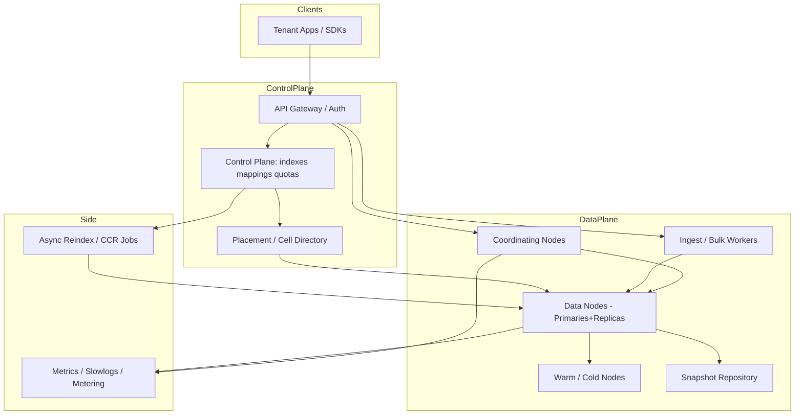

# System Design: Full-Text Search

> **Focus areas:** Document ingest · analysis · inverted index · relevance · filters/facets · multi-tenant SaaS · near-real-time indexing · query DSL  
> **Style:** End-to-end product design with progressive scale (10× → 100× → 1,000×)  
> **Quality bar:** Senior/staff; site/app search (not entire web); explicit tenant isolation and NRT trade-offs

---

## Table of Contents

1. [Clarify Requirements (Interview Q&A)](#1-clarify-requirements-interview-qa)
2. [Back-of-the-Envelope Estimation](#2-back-of-the-envelope-estimation)
3. [High-Level Design](#3-high-level-design)
4. [Architecture Diagram](#4-architecture-diagram)
5. [Design Deep Dive](#5-design-deep-dive)
6. [Wrap-Up](#6-wrap-up)
7. [Deeper / Related Interview Questions](#7-deeper--related-interview-questions)

---

## 1. Clarify Requirements (Interview Q&A)

Goal: design a **full-text search system** for applications/sites/SaaS—think Elasticsearch/OpenSearch/Algolia-class product used by many tenants to index their documents and query with relevance, filters, and facets—not a public web search engine.

### 1.0 What this is / is not

| Dimension | This doc | Not this |
|-----------|----------|----------|
| Job | Full-text search service / site search | Web-scale Google clone |
| Corpus | Per-tenant / per-index documents | Whole public web |
| Crawl | Push ingest API (apps send docs) | Web crawler (separate) |
| Ranking | BM25 + boosts + optional LTR | Link graph / PageRank central |
| Success | Latency, relevance, NRT, tenant isolation | Covering 100B web pages |

### 1.1 Functional Requirements

| # | Question to ask | Expected / typical interviewer answer | Design implication |
|---|-----------------|----------------------------------------|--------------------|
| F1 | Who uses this? | Product apps / multi-tenant SaaS search | Tenant + index isolation |
| F2 | Ingest model? | REST/gRPC index/update/delete APIs | Push-based; idempotent upserts |
| F3 | Document shape? | Semi-structured JSON; text + typed fields | Mapping / schema per index |
| F4 | Query features? | Full-text + filters + sort + pagination | Inverted index + doc-values |
| F5 | Relevance? | BM25 default; field boosts; synonyms | Analyzer + ranking config |
| F6 | Facets / aggregations? | Yes for e-commerce-like | Doc-values / columnar |
| F7 | Language? | Configurable analyzers per field | Analyzer registry |
| F8 | How fresh? | Seconds NRT typical SaaS expectation | Refresh interval + translog |
| F9 | Typo tolerance? | Fuzziness / n-gram / edge-ngram for search-as-you-type | Separate from web typeahead product |
| F10 | Access control? | Docs may be private per user | Security filter / ACL field at query |
| F11 | Highlighting? | Yes snippets with emphases | Postings offsets or plain highlighter |
| F12 | Multi-index search? | Sometimes alias across indices | Alias layer |
| F13 | Geo / nested? | Common asks; MVP optional geo | Plugins / field types |
| F14 | Analytics? | Slow query logs; usage metering | Per-tenant quotas |
| F15 | Exact keyword vs analyzed? | Both (`keyword` + `text` fields) | Mapping discipline |

**MVP functional scope:**

1. Create index with mappings (text, keyword, numeric, date, bool).
2. Bulk upsert/delete documents with versioning.
3. Query DSL: match, term filters, bool, range, sort, from/size or search_after.
4. BM25 relevance; field boosts; highlight.
5. Basic aggregations (terms facets on keyword fields).
6. NRT visibility within configurable refresh (e.g. 1s).
7. Multi-tenant auth; per-index ACL.
8. Quotas: docs, storage, QPS.

**Out of MVP:**

- Cross-cluster replication worldwide
- Learning-to-rank UI studio
- Vector search as primary (hooks OK)
- SQL-complete JDBC
- Automatic ML synonym discovery
- Web crawler built-in

### 1.2 Non-Functional Requirements

| # | Question | Expected answer | Target |
|---|----------|-----------------|--------|
| N1 | Query latency | Interactive UI | p50 < 30–50ms, p99 < 100–200ms typical corpuses |
| N2 | Indexing latency (NRT) | Searchable quickly | Refresh 1s default; tunable |
| N3 | Availability | SaaS grade | 99.9%+; zone-redundant |
| N4 | Durability | Ack'd docs not lost | Translog/WAL + replica |
| N5 | Consistency | Read-after-write within refresh; RY W via realtime GET | Document GET vs search distinguish |
| N6 | Multi-region | Active-passive MVP; active-active hard | CCR later |
| N7 | Security | Tenant isolation hard requirement | Index-level + document-level security |
| N8 | Cost | Density of tenants on shared clusters | Routing, shard sizing, freeze cold |

### 1.3 Cases

**Happy paths**

1. Create index → bulk index → refresh → search → hits + highlights + facets.
2. Update doc → searchable within NRT window; `GET doc` immediate after index ack.
3. Delete doc → disappears from search after refresh; GET 404.
4. Filter + query: `status:published AND match(title, "shoes")`.
5. Paginate deeply with `search_after`, not huge `from`.

**Edge / failure cases**

| Case | Behavior |
|------|----------|
| Mapping conflict (field type change) | Reject; require reindex |
| Huge bulk request | Split; 413; circuit breaker on memory |
| Runaway aggregation | Circuit breakers; shard size limits |
| Noisy neighbor tenant | Quotas; separate hot tier; reject over QPS |
| Split brain / yellow health | Replica missing; still serve primary; alert |
| Refresh disabled for bulk load | Explicit refresh API after load |
| Unicode / RTL text | Analyzer + ICU options |
| ACL bypass attempt | Mandatory filter injected server-side; never trust client |
| Synonym update | Reload search analyzers carefully; index analyzer changes need reindex |

### 1.4 Scales (Progressive)

| Metric | Baseline | 10× | 100× | 1,000× |
|--------|----------|-----|------|--------|
| Tenants | 1K | 10K | 100K | 1M |
| Indexes | 5K | 50K | 500K | 5M |
| Docs total | 1B | 10B | 100B | 1T |
| Docs / large tenant | 50M | 200M | 1B | 5B+ |
| Search QPS peak | 2K | 20K | 200K | 2M |
| Indexing docs/s peak | 5K | 50K | 500K | 5M |
| Avg doc size | 2 KB | 2 KB | 2–5 KB | 2–5 KB |
| Cluster data size | 5 TB | 50 TB | 500 TB | 5 PB |
| Shards (global) | 5K | 50K | 200K+ | million-class → must consolidate |

**What each jump forces:**

- **10×:** Proper shard planning; bulk ingest pipelines; query circuit breakers; tenant quotas.
- **100×:** Tenant placement / cell architecture; hot-warm-cold; searchable snapshots; force-merge discipline; autoscaling.
- **1,000×:** Many tiny indexes problem → index-per-tenant anti-pattern fix (shared indices with routing / rollover); global control plane; regional cells; vector hybrid optional.

### 1.5 Etc.

- **API style:** Elasticsearch-like is fine to dogfood concepts; don't need identical DSL.
- **Primary use cases:** e-commerce catalog, support KB, SaaS app search, logs (mention logs need different tuning).
- **Logs vs docs:** time-series indices vs content indices—don't conflate sizing rules.

**Scope repeat-back:**

> Design a multi-tenant full-text search service: schema'd JSON docs, NRT inverted indexes, BM25 + filters/facets/highlights, durable ingest, strict tenant isolation—from ~1B docs / 2K QPS toward 1000× with cell placement and hot-warm tiering—not a public web crawler/search engine.

---

## 2. Back-of-the-Envelope Estimation

### 2.1 Storage amplification

```text
Raw docs 1B × 2 KB = 2 TB
Inverted index + doc-values + stored fields typically 1.5×–3× raw
⇒ ~3–6 TB primary; × RF=2 ⇒ 6–12 TB cluster
```

At 100×: hundreds of TB → PB with replicas; cold tier essential.

### 2.2 Shard sizing

```text
Target shard size ~10–50 GB (sweet spot depends on heap/version)
5 TB / 30 GB ≈ ~170 primary shards baseline (plus replicas)
Anti-pattern: 5K tenants × 5 shards each = 25K shards on small cluster → cluster state death
```

### 2.3 Query CPU

```text
2K QPS × 20 ms CPU ≈ 40 CPU-seconds/s ⇒ ~40–80 cores busy at peak
Fanout to 5 shards/query ⇒ more; need enough replica parallelism
```

### 2.4 Indexing

```text
5K docs/s × 2 KB = 10 MB/s ingest
Indexing CPU often 5–20× raw write rate due to analysis + merging
Bulk size 5–15 MB/request; parallel bulk workers per tenant limits
```

### 2.5 Translog / WAL

```text
Ack durability: fsync translog every request (heavy) vs every 5s (risk window)
Discuss RPO trade-off explicitly in interview
```

### 2.6 Cluster state / metadata

```text
Per-index metadata ~KB–MB; 500K indexes ⇒ huge cluster state
1,000× forces index consolidation strategies
```

### 2.7 Heap

JVM search nodes: heap often 16–31 GB class; off-heap for some structures in modern engines. Circuit breakers protect parent breaker from OOM on giant aggs.

### 2.8 Hot tenants

One retailer during Black Friday can be 50%+ of QPS. **Placement:** dedicated cluster/cell for whales; noisy-neighbor isolation.

---

## 3. High-Level Design

### 3.1 Control plane vs data plane

```text
Control plane: tenants, keys, index CRUD, mappings, quotas, placement
Data plane: ingest, search, get, aggregations on search nodes
```

### 3.2 Core APIs

| Method | Path | Purpose |
|--------|------|---------|
| PUT | `/indexes/{index}` | Create with mappings/settings |
| DELETE | `/indexes/{index}` | Drop |
| POST | `/indexes/{index}/_docs/{id}` | Upsert |
| POST | `/indexes/{index}/_bulk` | Bulk ops |
| GET | `/indexes/{index}/_docs/{id}` | Realtime GET |
| DELETE | `/indexes/{index}/_docs/{id}` | Delete |
| POST | `/indexes/{index}/_search` | Search DSL |
| POST | `/indexes/{index}/_refresh` | Force refresh |
| POST | `/indexes/_reindex` | Reindex job |

**Search request (conceptual):**

```json
{
  "query": {
    "bool": {
      "must": [{"match": {"title": "running shoes"}}],
      "filter": [{"term": {"status": "published"}}, {"range": {"price": {"lte": 100}}}]
    }
  },
  "sort": [{"_score": "desc"}, {"price": "asc"}],
  "size": 20,
  "search_after": [0.9, 49.99, "doc123"],
  "aggs": {"brands": {"terms": {"field": "brand.keyword", "size": 20}}},
  "highlight": {"fields": {"title": {}, "description": {}}}
}
```

### 3.3 Mapping & analysis

```text
Field types:
  text        → analyzed, inverted index, optional norms
  keyword     → doc-values + inverted for term/agg
  long/double/date/bool → doc-values; optional indexing
  nested/object → careful; nested = hidden docs
  geo_point   → geohash/BKD (optional MVP)
```

**Analyzers:** tokenizer + filters (lowercase, ascii_folding, stemmer, synonym).  
**Index vs search analyzer:** synonyms often search-time to avoid reindex.

### 3.4 Index internals (Lucene mental model)

```text
Index → Shards (primaries)
  Shard → Segments (immutable)
    Segment → postings, stored fields, doc-values, points/BKD, term dict (FST)
```

- **Refresh:** make new in-memory buffer searchable as new segment (NRT)
- **Flush:** persist; **merge:** consolidate segments
- **Translog:** durability between fsyncs

### 3.5 Routing & sharding

```text
shard = hash(routing) % num_primary_shards
default routing = doc _id
```

For multi-tenant **shared index**: `routing = tenant_id` so one tenant's docs co-locate (careful hot tenants).

**Index-per-tenant vs shared:**

| Approach | Pros | Cons | When |
|----------|------|------|------|
| Index per tenant | Natural isolation | Shard explosion | Few large tenants |
| Shared index + routing + tenant filter | Dense | Noisy neighbor; mapping coupling | Many small tenants |
| Alias + rollover | Time series | Ops complexity | Logs/events |

**Choice:** hybrid — small tenants pooled; whales dedicated indexes/clusters.

### 3.6 Query execution

1. Authorize → inject tenant + ACL filters (non-removable).  
2. Parse DSL → Lucene query.  
3. Coordinator fans out to shards (prefer shard-local filter+query).  
4. Each shard: collect top-N + agg partials.  
5. Reduce: merge top-N, merge aggs.  
6. Fetch stored fields / highlight for winners.  
7. Return.

**Filters vs queries:** filters binary, cacheable (`filter` cache); queries score.

### 3.7 Relevance

- Default **BM25** on `text` fields
- `boost` per field/clause
- `function_score` for recency / popularity
- Optional LTR rescorer on top window

### 3.8 Pagination

| Method | Use | Risk |
|--------|-----|------|
| `from` + `size` | Shallow pages | Deep `from` expensive |
| `search_after` | Deep pagination | Need stable sort tiebreaker |
| Scroll/PIT | Exports | Not for user UI traffic |

### 3.9 Option analysis

#### A. Engine

| Option | Pros | Cons | Deal-breaker |
|--------|------|------|--------------|
| **OpenSearch/ES** | Battle-tested IR | Ops/cluster state | Fine for most interviews |
| Typesense/Meilisearch | Simpler DX | Scale limits | Small/medium |
| Custom Lucene | Control | Costly | Only special constraints |
| SQL + trigram | Simple | Weak ranking/scale | Not primary FTS |

#### B. Durability ack

| Mode | RPO | Latency |
|------|-----|---------|
| Translog fsync every write | ~0 | Higher write latency |
| Fsync every 5s | seconds | Faster bulk |
| Async replica only | higher | Dangerous |

**MVP SaaS:** wait for primary translog fsync + replica ack (quorum) for default `wait_for` policy—discuss tunables.

#### C. Read-after-write

| API | Guarantee |
|-----|-----------|
| Index then GET by id | Realtime (translog) |
| Index then SEARCH | After refresh (NRT) |

Product can `refresh=wait_for` on write when UX needs immediate search (costly).

**Deal-breakers:**

- Millions of tiny shards
- Trusting client-supplied tenant filter alone
- Unbounded `from`/`size` and aggs without breakers
- One shared JVM heap without circuit breakers

---

## 4. Architecture Diagram



---

## 5. Design Deep Dive

### 5.1 Reliability

**Data loss prevention**

- Primary + replica(s); ack after replica sync (default quorum)
- Translog persisted; recovery replays translog on restart
- Snapshots to object store periodically; searchable snapshots for cold
- Indexing idempotency: `doc_id` + external version / `if_seq_no`

**Retries**

- Clients retry bulk with exponential backoff on 429
- Idempotent upserts by document id
- Search retries on different replica (idempotent read)

**Backpressure**

- Thread pools + queues per operation type (search, write, merge)
- Reject when full (`429`) — better than OOM
- Real memory circuit breakers for aggs/requests

**Rate limits / quotas**

- Per-tenant QPS, bulk MB/s, max docs, max fields
- Burst tokens; soft vs hard limits

**Failure table**

| Case | Behavior |
|------|----------|
| Node loss | Replica promotes; recover from snapshot if needed |
| Disk full | Flood-stage watermark → read-only index |
| Bad query | Trip breaker; return error; slowlog |
| Mapping explosion | Cap fields; reject new fields if dynamic runaway |

### 5.2 Scalability

**Scale writes:** more primary shards (planned at create); more bulk parallelism; split indexes by time/category.

**Scale reads:** add replicas; add coordinator nodes; filter cache warmth; prefer keyword filters.

**Tiering:**

```text
Hot: SSD, recent/frequent
Warm: cheaper SSD, force-merged
Cold/Frozen: searchable snapshots, slower
```

**Parallelization:** shard-level parallelism inherent; avoid oversharding (diminishing returns + overhead).

**10× / 100× / 1,000×**

| Jump | Change |
|------|--------|
| 10× | Shard sizing discipline; breakers; ILM rollover for growing indexes |
| 100× | Cells / dedicated whale clusters; hot-warm; autoscaling data nodes |
| 1,000× | Pool small tenants into shared routed indexes; regional cells; control-plane sharding; maybe separate logging product |

**The many-tenants problem**

Cluster state and shard count dominate long before raw TB. Solutions: index templates + pooled indices, rollups, delete abandoned tenants, max indexes per cluster with placement service.

### 5.3 Maintainability

**Ops**

- Cluster health (green/yellow/red), watermark, merge pressure, refresh lag
- Slow query logs; per-tenant usage dashboards
- Canary node versions; rolling upgrades

**Observability**

- p50/p99 search/index latency per tenant
- Reject rates; breaker trips; heap; GC
- Mapping field counts

**Migrations / reindex**

- New mapping → `_reindex` to new index → alias swap atomic
- Zero-downtime: write dual or pause writes briefly; alias cutover

**Multi-tenant**

- AuthN API keys scoped to tenant
- AuthZ document security: `visible_to` terms filter injected
- Encryption at rest; TLS; audit logs for admin ops
- No cross-tenant routing mistakes in placement

**DX**

- Schema linting; analyzer explain API; profile API for query plans

---

## 6. Wrap-Up

### Decision summary

| Area | Decision |
|------|----------|
| Engine model | Lucene-style segments + NRT refresh |
| API | Index/doc CRUD + search DSL |
| Isolation | Hybrid pooled vs dedicated by tenant size |
| Relevance | BM25 + boosts; filters cached |
| Durability | Translog + replicas; snapshot backups |
| Scale | Shard plan + cells + hot-warm-cold |
| Safety | Injected ACL filters; circuit breakers |

### Phased rollout

1. **MVP:** Single cluster, index APIs, BM25 search, filters, highlight, basic aggs, RBAC.
2. **SaaS hardening:** Quotas, slowlogs, breakers, snapshots, aliases.
3. **Growth:** ILM tiers, whale isolation, reindex tooling.
4. **Global:** CCR / regional cells; searchable snapshots.
5. **1000×:** Pooled indices for micro-tenants; sharded control plane; optional vectors.

### Closing line

> Full-text search is an inverted-index product with NRT segments, careful mappings, and coordinator fanout—at SaaS scale the hard problems shift from BM25 to **tenant isolation, shard economics, and circuit-breaking**, which we solve with hybrid placement and tiered storage.

---

## 7. Deeper / Related Interview Questions

**Q1. Why are segments immutable?**  
**A:** Simplifies caching and compression; updates = new docs + tombstones; merges reclaim space. Enables lock-free readers.

**Q2. Refresh vs flush vs force merge?**  
**A:** Refresh = searchable NRT; flush = persist to disk; force merge = reduce segment count (heavy, use on warm/read-mostly).

**Q3. Why is deep pagination with `from=100000` bad?**  
**A:** Each shard materializes `from+size` then discards; cost grows with offset. Use `search_after` or point-in-time.

**Q4. Filter cache vs query cache?**  
**A:** Filter bitsets cache well (content-dependent); query scores less cacheable. Put non-scoring clauses in `filter`.

**Q5. How do synonyms work without reindexing?**  
**A:** Apply at **search analyzer** time. Index-time synonyms need reindex when lists change; also cause query expansion recall/precision tradeoffs.

**Q6. Document-level security implementation?**  
**A:** Server injects filter e.g. `terms: { acl: user_roles }` on every query; stored fields never returned without passing filter; test negative cases.

**Q7. How to change a field from text to keyword?**  
**A:** Cannot in place; add multi-field or reindex to new mapping; alias swap.

**Q8. What causes cluster yellow?**  
**A:** Replicas unassigned (node down, allocation rules). Primaries exist so search works; redundancy reduced.

**Q9. How do aggregations scale?**  
**A:** Shard-local partial aggs reduced on coordinator; high-cardinality terms aggs are memory-heavy → breakers + approximate algorithms.

**Q10. Inverted index vs doc-values?**  
**A:** Inverted: term → docs (search). Doc-values: columnar per-field for sort/agg. Different access patterns.

**Q11. How does BM25 differ from TF-IDF?**  
**A:** BM25 saturates TF and normalizes by doc length with tunable `k1`,`b`; usually better default ranking.

**Q12. Bulk indexing best practices?**  
**A:** 5–15 MB bulks; parallelize; raise refresh interval during load; replicas=0 during bootstrap then add; disable replicas carefully with risk acceptance.

**Q13. What is index alias used for?**  
**A:** Zero-downtime reindex cutover; group multiple indices; write alias vs read alias separation.

**Q14. Nested documents vs flattened objects?**  
**A:** Nested preserves co-occurrence of inner fields (separate Lucene docs); objects flatten and can cross-match. Nested costlier.

**Q15. How to isolate noisy neighbors?**  
**A:** Quotas, separate thread pools (limited), dedicated nodes/clusters for whales, quality-of-service admission control.

**Q16. Searchable snapshots tradeoff?**  
**A:** Cost↓ for cold data; latency↑ and repository dependency; good for compliance retention rarely queried.

**Q17. How many shards for a 10 GB index?**  
**A:** Often **1 primary** (or 2–3 if high QPS). Oversharding 10 GB into 20 shards hurts. Size for growth to ~30–50 GB/shard.

**Q18. Exact match on analyzed text field fails — why?**  
**A:** Analysis tokenized/stemmed; use `.keyword` multi-field for term aggregations and exact match.

**Q19. Consistency of search after write across replicas?**  
**A:** Primary indexes then replicas; search may hit replica slightly behind refresh; GET realtime on primary path. Discuss `wait_for` refresh.

**Q20. FST term dictionary benefit?**  
**A:** Compact prefix-shared structure for terms; memory-efficient autocompletion foundations and term lookups.

**Q21. How do you do zero-downtime engine upgrades?**  
**A:** Rolling restart compatible versions; backup snapshots; dual-cluster reindex migration for breaking changes.

**Q22. Vector search vs BM25 in this product?**  
**A:** Add `dense_vector` field + ANN as complementary; hybrid fusion; don't replace lexical for SKUs/part numbers.

**Q23. Metering for billing?**  
**A:** Bill units: documents stored, search requests, compute units; sample size reports; prevent unbounded field explosion.

**Q24. What kills p99 suddenly?**  
**A:** GC pauses, merge storms, huge aggs, cold page cache, asymmetric shard sizes, stop-the-world refresh on giant segments.

**Q25. Capstone: NRT vs durability vs cost?**  
**A:** Default refresh 1s + quorum ack balances UX and safety; bulk loads relax refresh; legal tenants demand stricter fsync—expose policies per index, never one global silent choice.

---

*End of full-text search system design.*
