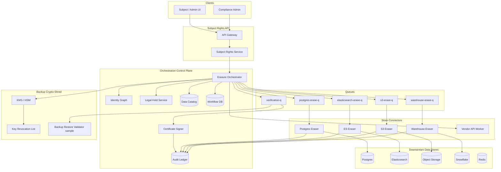

# System Design: GDPR / Right-to-Erasure Deletion Platform

> **Focus areas:** Erase orchestration · Multi-store fan-out · Verification & attestation · Legal holds · Backup crypto-shredding vs rewrite · Compliance SLAs  
> **Style:** Platform control-plane design with progressive scale (10× → 100× → 1,000×)  
> **API orientation:** Subject Rights API (`DELETE /subjects/{id}`, DSAR export, hold management) + internal erase workflow engine

---

## Table of Contents

1. [Clarify Requirements (Interview Q&A)](#1-clarify-requirements-interview-qa)
2. [Back-of-the-Envelope Estimation](#2-back-of-the-envelope-estimation)
3. [High-Level Design](#3-high-level-design)
4. [Architecture Diagram](#4-architecture-diagram)
5. [Design Deep Dive](#5-design-deep-dive)
6. [Wrap-Up](#6-wrap-up)
7. [Deeper / Related Interview Questions](#7-deeper--related-interview-questions)

---

## 1. Clarify Requirements (Interview Q&A)

The goal of this phase is to **bound the problem**: what we build, what we defer, and at what scale we must succeed.

### 1.0 What this is / is not

| This is | This is not |
|---------|-------------|
| A **central erase orchestration platform** that fans out deletion across OLTP DBs, search, caches, object storage, analytics, and backups | A single `DELETE FROM users WHERE id=?` in one Postgres table |
| **Provable erasure** with per-store attestations, verification scans, and audit artifacts for regulators | Best-effort async tombstones with no proof |
| **Legal hold** integration that blocks or scopes erasure without silent failure | Ignoring litigation / subpoena constraints |
| **Backup strategy**: crypto-shredding (DEK destruction) vs selective rewrite vs retention expiry | Promising instant physical wipe of every byte in immutable tape archives |
| SLA-driven workflow: acknowledge request, complete erasure, issue certificate | Real-time synchronous purge of 500 downstream systems in one HTTP call |

### 1.1 Functional Requirements

| # | Question to ask | Expected / typical interviewer answer | Design implication |
|---|-----------------|----------------------------------------|--------------------|
| F1 | What triggers erasure? | User self-service, admin, automated retention policy, regulator order | Unified `ErasureRequest` with typed source + legal basis |
| F2 | What is the subject identifier? | `subject_id` (internal UUID) mapped to email, phone, device IDs via identity graph | Identity resolution service; canonical subject key for orchestration |
| F3 | Which data stores? | Postgres, Redis, Elasticsearch, S3, Kafka topics, Snowflake, ML feature store, CDN logs | **Data catalog** with registered connectors + erase semantics per store |
| F4 | Hard delete vs anonymize? | PII must be removed; aggregates may remain if truly non-identifying | Per-field policy: `DELETE`, `ANONYMIZE`, `RETAIN` (legal/statutory) |
| F5 | Legal holds? | Active litigation freezes erasure for scoped data classes / time ranges | Hold service evaluates before dispatch; partial erasure with documented exceptions |
| F6 | Backups & snapshots? | Must not restore deleted subject after completion; immutable backups are hard | Crypto-shredding per subject envelope keys; backup retention caps; rewrite jobs for small systems |
| F7 | Verification? | Automated re-scan + human-auditable certificate | Post-erasure probes: search index, DB, object metadata, sample backup restore test |
| F8 | DSAR export before delete? | Often required: export then delete in sequence | Workflow states: `export_pending` → `export_complete` → `erase_in_progress` |
| F9 | Idempotency / duplicates? | Same subject requested twice must not corrupt state | Idempotent `ErasureRequest` keyed by `(tenant, subject_id, request_type)` |
| F10 | Partial failure? | One store fails; others succeed; must retry and not lose track | Per-target `ErasureTask` with retry, DLQ, compensating actions |
| F11 | Third-party processors? | Stripe, SendGrid, etc. have their own delete APIs | Outbound processor connectors + webhook attestation |
| F12 | Audit trail? | Immutable log: who requested, what was erased, when, by which job | Append-only compliance ledger; **do not** log erased PII in plaintext |
| F13 | Multi-tenant? | B2B SaaS: tenant isolation on all queries and erase scopes | `tenant_id` on every row; shard workflows by tenant |
| F14 | SLA? | GDPR: **without undue delay**, typically **30 days**; enterprise contracts may require **72h** for primary stores | Tiered SLAs: acknowledge ≤24h, primary stores ≤7d, backups ≤30d (or crypto-shred immediate) |
| F15 | Re-identification risk? | Pseudonymized analytics must not be restorable | Hash salts rotated on erase; join keys destroyed |

**MVP functional scope (lock this with interviewer):**

1. Subject Rights API: submit erasure request, check status, download completion certificate.
2. Identity graph resolves `subject_id` → all linked identifiers and owning services.
3. Data catalog registers ≥6 store types with erase adapters (Postgres, Redis, ES, S3, Kafka compacted topics, warehouse).
4. Orchestrator fans out **ErasureTasks** with idempotent handlers per store.
5. Legal hold service blocks or scopes tasks before dispatch.
6. Backup strategy: **envelope encryption** with per-subject DEK; crypto-shred on erasure (MVP); optional rewrite worker for small backup sets.
7. Verification worker re-queries stores + samples backup restore; generates signed attestation.
8. Immutable audit ledger (no PII payloads).
9. Admin dashboard: queue depth, SLA breaches, per-store failure rates.

**Out of MVP (explicitly defer):**

- Fully automated cross-cloud multi-cloud erase (design hooks only)
- Physical destruction attestation for offsite tape vaults (process + crypto-shred suffices for MVP)
- ML model unlearning (document as manual / retrain workflow)
- Real-time synchronous erase on every read path (async workflow is correct)
- Global active-active erase without home-region workflow ownership

### 1.2 Non-Functional Requirements

| # | Question | Expected answer | Target |
|---|----------|-----------------|--------|
| N1 | Acknowledge request latency? | User sees confirmation quickly | API ACK ≤ **500ms**; workflow durable ≤ **5s** |
| N2 | Primary store erasure latency? | Days acceptable if communicated | p95 complete primary stores ≤ **7 days**; p99 ≤ **30 days** |
| N3 | Backup erasure effective latency? | Crypto-shred can be minutes | DEK destruction ≤ **15 minutes** after primary erase gate |
| N4 | Availability? | Compliance platform must be up | 99.9% API; workflow engine 99.95% |
| N5 | Durability of erase state? | Never lose track of in-flight erasures | Workflow DB: RPO ≈ **0**; multi-AZ sync replicate |
| N6 | Consistency? | Eventual across stores is OK | **Eventual erasure** with verified terminal state |
| N7 | Security? | Least privilege, encryption, tamper-evident audit | mTLS connectors; KMS; HSM-backed signing for certificates |
| N8 | Observability? | Regulator asks "prove it" | Per-request trace; store attestations; metrics on SLA |
| N9 | Cost? | Erase is rare but backup scans are expensive | Batch verification; sample-based backup restore tests at scale |

### 1.3 Cases (Happy Paths & Edge / Failure)

**Happy paths**

1. User submits erasure → ACK → identity graph expands targets → no legal hold → tasks dispatched → all stores ACK → DEKs shredded → verification pass → certificate issued.
2. Admin-initiated erasure for churned tenant user → same workflow with stronger auth.
3. DSAR: export job completes → user confirms → erasure workflow starts.
4. Legal hold on billing records → profile/activity erased → invoices **RETAIN** with documented exception on certificate.
5. Retry: Elasticsearch task fails (429) → exponential backoff → succeeds → workflow completes.

**Edge / failure cases**

| Case | Behavior |
|------|----------|
| Unknown subject_id | `404`; do not create orphan workflow |
| Duplicate erasure request | Return existing workflow id; idempotent |
| Legal hold added mid-flight | Pause pending tasks; complete non-held scopes; mark partial |
| Store connector down | Retry with backoff; SLA clock may continue; escalate after N days |
| Crypto-shred succeeds but backup restore test finds data | **Critical incident**: block certificate; run targeted rewrite; root-cause catalog gap |
| Subject appears in unstructured logs | Log pipeline redaction job + retention expiry; certificate notes log class |
| Cross-region replica lag | Erase primary first; fan-out to replicas via same task or CDC-driven erase |
| Warehouse partition not yet compacted | Issue `ANONYMIZE` mutation + schedule partition rewrite |
| Third-party processor slow | Async webhook; SLA tracked separately on certificate |
| Malicious erase request (account takeover) | Step-up auth + cooling period + notify user out-of-band |
| Erasure during active session | Invalidate sessions/tokens first (sync path); then async data erase |
| GDPR vs CCPA scope differences | Policy engine per jurisdiction; field-level rules |

### 1.4 Scales (Progressive)

| Metric | Baseline | 10× | 100× | 1,000× |
|--------|----------|-----|------|--------|
| Tenants | 500 | 5K | 50K | 500K |
| MAU | 5M | 50M | 500M | 5B |
| Erasure requests / month | 5K | 50K | 500K | 5M |
| Peak erasure requests / day | 500 | 5K | 50K | 500K |
| Registered data stores (connectors) | 40 | 120 | 400 | 2K |
| Avg targets per subject (stores + tables) | 25 | 30 | 40 | 60 |
| Erasure tasks / request (fan-out) | 25 | 30 | 40 | 60 |
| Peak task dispatch QPS | 50 | 500 | 5K | 50K |
| Primary data under management | 50 TB | 500 TB | 5 PB | 50 PB |
| Backup footprint (deduped) | 150 TB | 1.5 PB | 15 PB | 150 PB |
| Identity graph edges | 500M | 5B | 50B | 500B |
| Verification scans / day | 5K | 50K | 500K | 5M |

**What each jump forces architecturally:**

- **10×:** Dedicated task queue per store type; connector worker pools; rate limits per downstream; batch verification.
- **100×:** **Shard orchestrator by tenant**; regional erase cells; crypto-shred via centralized KMS with partition keys; sampled backup verification (1–5%) not full restore.
- **1,000×:** Global subject directory; federated catalog; async certificate issuance with tiered proof; erasure **cells** per region; avoid O(stores × subjects) naive full scans—index erasure obligations in catalog metadata.

### 1.5 Etc. (Constraints & Assumptions)

- **Regulatory framing:** GDPR Art. 17 right to erasure; design supports CCPA/CPRA delete with policy differences.
- **Backups:** Assume **encrypted** backups with per-object or per-subject envelope keys (required for crypto-shred MVP).
- **Immutable backup media:** Physical rewrite impractical at PB scale—**crypto-shredding + retention expiry** is the honest answer.
- **Not building:** Legal review UI (integrate with eDiscovery vendor); full automated model unlearning.
- **Cloud:** Single primary cloud + multi-AZ; multi-region DR for workflow DB.

**Scope statement to repeat back:**

> Design a **GDPR erasure orchestration platform** that resolves a subject across a data catalog, respects legal holds, fans out idempotent erase tasks to OLTP/search/cache/object/warehouse systems, makes backups unusable via **crypto-shredding** (with rewrite for small systems), verifies erasure, and issues an audit certificate—starting at ~5K erasures/month and evolving to 1,000× without losing SLA trackability.

---

## 2. Back-of-the-Envelope Estimation

### 2.1 Erasure request rate

```text
Baseline: 5K requests/month ≈ 170/day ≈ 0.002 QPS average
Peak (10× intraday): ~500/day ≈ 0.006 QPS avg, ~0.05 QPS peak

1,000×: 5M/month ≈ 170K/day
Peak factor 10× → ~1,700/min ≈ 28 QPS erasure *requests*
```

Erasure **requests** are low QPS; **tasks** dominate.

### 2.2 Task fan-out

```text
Baseline peak: 500 requests/day × 25 tasks = 12,500 tasks/day
≈ 0.15 tasks/sec average, ~1.5 tasks/sec peak burst

1,000× peak: 500K requests/day × 60 tasks = 30M tasks/day
≈ 350 tasks/sec average, ~3,500 tasks/sec peak
```

Orchestrator must be queue-backed, not synchronous RPC fan-out.

### 2.3 Connector API load (downstream)

Assume Postgres erase = 10 indexed lookups + 50 row updates per subject avg:

```text
Baseline: 12,500 tasks/day to Postgres-class stores (~40% of tasks)
≈ 5,000 PG tasks/day → negligible QPS

1,000×: 12M PG tasks/day ≈ 140 QPS sustained to PG connectors
Still modest if batched; ES/S3 scans dominate cost not QPS
```

### 2.4 Elasticsearch / search erase

```text
Delete-by-query on subject_id index:
Baseline: ~2K ES tasks/day, ~100K docs/subject avg → 200M doc deletes/day
At 1,000×: 200B doc deletes/day → must use:
  - routed shards by subject hash
  - async delete-by-query with throttling
  - or maintain subject_id in catalog → direct doc id list
```

**Cost driver:** search index scans, not orchestrator CPU.

### 2.5 Object storage (S3)

```text
Avg 50 objects/subject × 200 KB = 10 MB/subject
Baseline: 5K subjects/month × 10 MB ≈ 50 GB/month deleted
1,000×: 5M × 10 MB ≈ 50 TB/month

S3 DeleteObjects: 1K keys/request → 50 objects = 1 request (fine)
Lifecycle + batch delete workers; LIST operations are the hidden cost
```

Use **catalog-indexed object prefixes** (`tenant/subject/`) to avoid bucket LIST.

### 2.6 Backup crypto-shredding

```text
Assume envelope encryption: 1 DEK per subject per backup epoch
Baseline: 5K shreds/month → trivial KMS API
1,000×: 5M shreds/month ≈ 2 shreds/sec avg

KMS DestroyKey / DisableKey: rate limits ~100–1000/sec (cloud dependent)
→ batch DEK destruction; partition by KMS key hierarchy
```

Crypto-shred is **O(1)** per subject vs rewrite **O(bytes)**.

### 2.7 Verification cost

Full backup restore test per subject is impossible at scale.

```text
Baseline: 5K full verifications/day OK
100×: 500K/day → sample 5% + deterministic store re-query
1,000×: 5M/day → 1% sample + continuous compliance scanners
```

| Verification tier | When | Cost |
|-------------------|------|------|
| T0: Store re-query | Every request | Low |
| T1: Index count = 0 | Every request | Medium |
| T2: Backup restore sample | 1–5% random | High |
| T3: Full restore audit | Regulator / annual | Very high |

### 2.8 Workflow DB storage

```text
ErasureRequest row ~2 KB; ErasureTask ~500 B; 60 tasks/request
Per request: ~2 KB + 30 KB ≈ 32 KB

Baseline: 5K/month × 12 months × 32 KB ≈ 2 GB/year
1,000×: 5M/month × 32 KB × 12 ≈ 1.9 TB/year

Retain 7 years compliance → ~13 TB at 1,000× (manageable with tiering)
```

### 2.9 Identity graph

```text
500M edges baseline × 100 B ≈ 50 GB graph store
1,000×: 500B edges ≈ 50 TB → shard by tenant; graph DB or adjacency in Postgres partitioned
```

### 2.10 Bandwidth (warehouse anonymize)

```text
Snowflake UPDATE on 10 GB partition/subject (worst case whale)
Rare; schedule off-peak; most subjects ≈ 10–100 MB
```

---

## 3. High-Level Design

### 3.1 Core domain model

```text
Tenant
  └── Subject (canonical subject_id)
        ├── Identifiers[] (email_hash, phone_hash, device_id, ...)
        ├── ErasureRequest
        │     ├── status: received | validating | held | exporting | erasing | verifying | completed | failed | partial
        │     ├── legal_basis, jurisdiction, requested_by
        │     ├── sla_deadline_at
        │     └── ErasureTask[] (per catalog target)
        │           ├── store_id, resource_type, operation (DELETE|ANONYMIZE|RETAIN)
        │           ├── status, attempts, last_error, attestation_ref
        │           └── completed_at
        ├── LegalHold[] (scope: data_class, time_range, case_id)
        └── CryptoKeyRecord (DEK ids for backup crypto-shred)
```

**ErasureRequest state machine:**

```text
received → validating → [held] → exporting? → erasing → verifying → completed
                              ↘ failed (retryable)
                              ↘ partial (holds/exceptions documented)
```

Terminal `completed` requires verification pass OR documented legal exception.

### 3.2 Data catalog

Central registry of **where PII lives**:

| Catalog field | Purpose |
|---------------|---------|
| `store_id` | Logical system (users-db, search, s3-media, ...) |
| `pii_classes` | email, name, ip, behavioral, ... |
| `locator_template` | How to find subject data (`user_id`, `subject_id`, prefix) |
| `erase_method` | `hard_delete`, `anonymize`, `crypto_shred`, `retention_only` |
| `connector_type` | postgres, redis, elasticsearch, s3, kafka, snowflake, vendor_api |
| `rate_limit` | Protect downstream |
| `verification_query` | Post-erase probe |

Services **register at deploy time** (GitOps + catalog API); CI fails if new PII table not registered.

### 3.3 API surface

| Method | Path | Purpose |
|--------|------|---------|
| POST | `/v1/subjects/{subject_id}/erasure-requests` | Submit erasure (Idempotency-Key) |
| GET | `/v1/erasure-requests/{id}` | Status + per-task breakdown |
| GET | `/v1/erasure-requests/{id}/certificate` | Signed completion PDF/JSON |
| POST | `/v1/subjects/{subject_id}/export-requests` | DSAR export (optional pre-step) |
| GET | `/v1/legal-holds` | Admin list/create holds |
| POST | `/v1/catalog/stores` | Register/update data store (internal) |
| POST | `/v1/webhooks/processor-attestation` | Third-party completion |

**Submit erasure:**

```http
POST /v1/subjects/sub_abc/erasure-requests
Idempotency-Key: idem_2026_08_06_001
Content-Type: application/json

{
  "tenant_id": "ten_acme",
  "jurisdiction": "GDPR",
  "requested_by": "subject_self_service",
  "reason": "account_closure",
  "skip_export": false
}
```

Response `202 Accepted`:

```json
{
  "erasure_request_id": "er_9f3...",
  "status": "validating",
  "sla_deadline_at": "2026-09-05T00:00:00Z",
  "status_url": "/v1/erasure-requests/er_9f3..."
}
```

### 3.4 Orchestration flow

1. **Validate** subject exists; step-up auth if needed.
2. **Identity graph expansion** → all identifiers + catalog targets.
3. **Legal hold evaluation** → mark tasks `RETAIN` or pause workflow.
4. **Session/token revocation** (sync, fast path).
5. **Dispatch ErasureTasks** to per-store queues.
6. **Connectors** execute idempotent erase; write attestation blob.
7. **Backup crypto-shred** after primary stores succeed (or in parallel if DEK-only backups).
8. **Verification worker** runs probes + optional backup sample.
9. **Certificate** signed by compliance service; audit ledger append.

### 3.5 Store connector patterns

| Store | Erase pattern | Idempotency |
|-------|---------------|-------------|
| Postgres | `UPDATE ... SET pii=NULL` or `DELETE` by subject key; cascade | Unique task id in erase_log table |
| Redis | `UNLINK` keys from subject index set | Key set rebuilt on retry |
| Elasticsearch | Delete-by-query on `subject_id` with routing | Task id in ES task API |
| S3 | DeleteObjects on catalog prefix list | Version id tracking; MFA delete protected buckets use batch |
| Kafka | Tombstone compacted keys OR publish erase event | Compact by key |
| Snowflake | `DELETE` or hash-PII update on subject partition | Merge audit |
| Vendor API | Stripe `delete customer` etc. | Store vendor request id |

**Anti-pattern:** one giant distributed transaction across stores. Use **saga** with compensating logs.

### 3.6 Backup strategies: crypto-shred vs rewrite

| Approach | Mechanism | Pros | Cons | When |
|----------|-----------|------|------|------|
| **Crypto-shredding** | Destroy subject DEK; ciphertext becomes unrecoverable | O(1) time/bytes; works on immutable backups | Requires envelope encryption upfront; keys must be tracked | **Default** for PB-scale backups |
| **Selective rewrite** | Restore backup → filter subject → re-snapshot | No upfront crypto design | O(bytes); impractical at scale; RTO long | Small DBs (<100 GB backup) |
| **Retention expiry** | Backup ages out naturally | Zero marginal cost | Subject data persists until TTL | Complement, not sole strategy |
| **Logical deletion markers** | Backup manifest excludes subject | Fast | Restore tooling must honor exclusions | Risky if restore bypasses manifest |

**Recommended hybrid:**

- All backups **encrypted** with KMS.
- PII blobs use **per-subject envelope DEK** stored in `CryptoKeyRecord`.
- On erasure: `DestroyKey(DEK)` + append to Key Revocation List (KRL).
- Restore pipeline **must** check KRL before decrypt (fail-closed).
- Small Postgres: nightly backup + **rewrite worker** for subjects erased in last 24h (optional belt-and-suspenders).

```text
Backup blob encryption stack:

S3 object
  └── encrypted with DEK_subject (unique per subject per backup generation)
        └── wrapped by KMS CMK_tenant
```

### 3.7 Legal holds

```text
LegalHold {
  case_id, tenant_id,
  subject_ids[] | query_scope,
  data_classes[],  // e.g. billing, communications
  effective_from, effective_to,
  status: active | released
}
```

Evaluation order:

1. If hold covers **all** PII classes → workflow → `held` (no erase until release).
2. If hold covers **subset** → dispatch tasks with `RETAIN` on held classes; erase rest → `partial` until hold released.
3. Certificate lists **exceptions** with legal basis citation—not silent omission.

### 3.8 Verification & attestation

**Per-store attestation:**

```json
{
  "task_id": "task_...",
  "store_id": "users-postgres-primary",
  "operation": "DELETE",
  "rows_affected": 42,
  "verification_query_hash": "sha256:...",
  "verification_result": "zero_rows",
  "connector_version": "pg-erase-v3.2",
  "completed_at": "2026-08-10T14:22:01Z",
  "signature": "..."
}
```

**Certificate aggregates** attestations + hold exceptions + backup crypto-shred ids.

### 3.9 Trade-off tables

#### Sync vs async erasure

| | Sync (inline DELETE API) | Async orchestration |
|--|--------------------------|---------------------|
| UX | Immediate | Delayed confirmation |
| Scale | Poor (500 stores) | Good |
| Correctness | Often incomplete (misses search/cache) | Catalog-driven completeness |
| Interview pick | **Async orchestration** | |

#### Crypto-shred vs backup rewrite

| | Crypto-shred | Rewrite |
|--|--------------|---------|
| Time | Minutes | Hours–days |
| Cost | KMS API | Storage IO + compute |
| Proof | Key destruction audit | New backup hash |
| Prereq | Envelope encryption | Mutable backup store |

#### Anonymize vs hard delete

| | Anonymize | Hard delete |
|--|-----------|-------------|
| FK integrity | Preserves referential stats | May break if not CASCADE |
| Re-identification | Risk if salt weak | Lower |
| Analytics | Keeps aggregate rows | Removes row entirely |

### 3.10 Deal-breakers (call out in interview)

- No data catalog → guaranteed incomplete erasure.
- Logging erased PII into audit logs → compliance violation.
- Promising instant wipe of immutable tape without crypto keys → dishonest.
- No legal hold path → litigation risk.
- Certificate issued before verification → audit failure.

---

## 4. Architecture Diagram



---

## 5. Design Deep Dive

### 5.1 Reliability

#### 5.1.1 Data loss prevention (wrong kind)

Erasure must **not lose workflow state**:

- Workflow DB: sync replicate, PITR, `fsync` on state transitions.
- Task dispatch: **outbox pattern** from workflow TX → queue (no lost tasks on crash).

Erasure must **not accidentally delete wrong subject**:

- Every connector query requires `tenant_id + subject_id` composite key.
- Dry-run mode in staging; mutation queries built from catalog templates only (no freeform SQL from API).

#### 5.1.2 Retries & idempotency

| Layer | Idempotency key |
|-------|-----------------|
| API | `Idempotency-Key` header → same `erasure_request_id` |
| Task | `(erasure_request_id, store_id, resource_locator)` unique |
| Connector | Local `erase_log(task_id)` prevents double-delete side effects |

Retry policy:

- Transient (429, 503): exponential backoff, max 7 days.
- Permanent (404 not found in store): mark **success** with `zero_rows` (already gone).
- Logic error: DLQ + human triage; SLA escalation.

#### 5.1.3 Saga compensation

True rollback of delete is impossible. Compensation = **audit + incident**, not undelete.

Partial failure handling:

- State `partial` with open tasks listed.
- Automatic resume when store recovers.
- Never issue certificate until `completed` or explicit `partial` with legal approval.

#### 5.1.4 Rate limits & backpressure

Protect downstream stores:

```text
Per-store token bucket from catalog rate_limit
Global orchestrator concurrency cap per tenant (fairness)
Elasticsearch: delete-by-query slices + throttle
Postgres: batch deletes 1K rows/txn with sleep
```

Backpressure signals:

- Queue age > SLA/2 → scale workers.
- Store error rate > 5% → circuit break + pause dispatch.

#### 5.1.5 Session revocation (fast path)

Before async erase completes, **invalidate credentials**:

- Auth service: revoke refresh tokens, session ids (sync, <1s).
- CDN edge: purge cached personalized content keys.
- Prevents "active ghost user" during 7-day erase window.

### 5.2 Scalability

#### 5.2.1 Scale-up path

- 10×: Horizontal connector workers; separate queues per store type.
- 100×: Shard workflow DB by `tenant_id`; regional orchestrator cells.
- 1,000×: Federated catalog; cross-cell subject directory; sampled verification; DEK hierarchy sharding (`tenant/subject_mod_256`).

#### 5.2.2 Sharding strategy

| Component | Shard key |
|-----------|-----------|
| Workflow DB | `tenant_id` |
| Task queues | `hash(tenant_id, store_id)` |
| Identity graph | `tenant_id` |
| Audit ledger | append-only; partition by month |

#### 5.2.3 Parallelization

- Independent store tasks run fully parallel.
- Within Postgres: parallel table workers if catalog lists multiple tables.
- Verification probes parallel per store after all tasks `success`.

#### 5.2.4 Hot tenants

Whale tenant with 1M subjects bulk-delete (tenant offboarding):

- Dedicated **bulk erase** workflow with lower priority per-subject SLA.
- Batch tasks: 1K subjects per S3 prefix delete job.
- Separate queue so one tenant doesn't block consumer erasures.

#### 5.2.5 Storage tiers for audit

- Hot: 90-day workflow + attestation in Postgres.
- Warm: 7-year audit in object storage (immutable WORM bucket).
- Cold: Glacier for annual compliance packs.

### 5.3 Maintainability

#### 5.3.1 Observability

| Metric | Alert |
|--------|-------|
| `erasure_sla_breach_total` | >0 per day |
| `task_age_p99_seconds` by store | > SLA/2 |
| `verification_failure_total` | any → page |
| `crypto_shred_latency_seconds` | p99 > 15m |
| `certificate_issued_without_verification` | **must be 0** |

Tracing: `erasure_request_id` propagated through all connectors.

#### 5.3.2 Ops runbooks

- **Store connector upgrade:** blue/green workers; version in attestation.
- **Catalog entry wrong:** pause tasks for store_id; replay failed tasks after fix.
- **KMS key compromise:** rotate CMK; re-wrap DEKs; erasure KRL unchanged.

#### 5.3.3 Migrations

- New store registration → default erase_method; shadow verification in dry-run.
- Catalog schema versioning; orchestrator supports v1 and v2 locators during rollout.

#### 5.3.4 Multi-tenant isolation

- RBAC: tenant admin cannot erase other tenant subjects.
- Queue fairness: weighted fair scheduling across tenants.
- Crypto: per-tenant CMK; DEK destruction scoped.

#### 5.3.5 Testing

- Synthetic subject in staging with copies in all store types; daily erase drill.
- Chaos: kill connector mid-delete; verify idempotent resume.
- Restore test from backup after crypto-shred → must fail decrypt.

---

## 6. Wrap-Up

### Decision summary

| Area | Decision |
|------|----------|
| Architecture | Async saga orchestrator + per-store connectors |
| Completeness | Mandatory data catalog registration |
| Backups | Envelope encryption + crypto-shredding (primary); rewrite for small DBs |
| Legal | Hold service with scoped partial erasure |
| Proof | Per-store attestation + verification + signed certificate |
| SLA | ACK fast; primary stores ≤7d; backups via crypto-shred ≤15m effective |
| Scale | Shard by tenant; sample backup verification at 100×+ |

### Phased rollout

1. **Phase 0 (MVP):** Catalog + Postgres/Redis/S3 connectors; workflow DB; manual certificate.
2. **Phase 1:** ES + warehouse; legal holds; crypto-shred integration; automated verification T0/T1.
3. **Phase 2:** Vendor APIs; DSAR export; signed certificates; SLA dashboards.
4. **Phase 3:** Multi-region cells; sampled backup restore T2; bulk tenant offboarding; federated catalog.

### SLA table (repeat to interviewer)

| Stage | Target |
|-------|--------|
| API acknowledge | ≤ 24h (automated instant) |
| Session revocation | ≤ 1 minute |
| Primary online stores | ≤ 7 days (p95) |
| Search / warehouse | ≤ 30 days (p99) |
| Backup unusability (crypto-shred) | ≤ 15 minutes after primary gate |
| Certificate issuance | ≤ 24h after verification pass |

---

## 7. Deeper / Related Interview Questions

1. **Why not one SQL CASCADE DELETE?**  
   PII is denormalized across search, caches, logs, warehouses, vendors, and backups—no single FK graph.

2. **Is crypto-shredding equivalent to deletion under GDPR?**  
   Regulators generally accept if data is **not reasonably recoverable** (key destruction + access controls). Document risk assessment; some jurisdictions prefer physical deletion for extreme cases.

3. **What if you didn't encrypt backups upfront?**  
   Honest answer: retention expiry + selective rewrite for small systems + accept residual risk until backup ages out; migrate to envelope encryption.

4. **How do you erase data in append-only logs?**  
   Structured logs: redaction pipeline + block compactor; unstructured: retention TTL + certificate notes irrecoverability after TTL.

5. **Delete vs anonymize for analytics?**  
   Anonymize when aggregates need row presence; destroy join keys and rotate salts; k-anonymity review for quasi-identifiers.

6. **Legal hold vs erasure request—who wins?**  
   Hold wins for scoped data; erasure proceeds for non-held classes; certificate documents exception.

7. **How prove Elasticsearch is clean?**  
   Count query on `subject_id`; optional scroll sample; compare to attestation hash.

8. **Idempotency if erase runs twice?**  
   Task-level dedupe; second run returns `zero_rows` success.

9. **Race: new data written after erase starts?**  
   Block account first; revoke tokens; optional `subject_erasure_pending` flag checked on writes; short sync denylist window.

10. **Cross-region replicas?**  
    Erase in primary region; replicate erase events OR run paired tasks per region catalog entry.

11. **Kafka compacted topic erase?**  
    Publish tombstone `{key: subject_id, value: null}`; compaction removes; verify lag.

12. **ML feature store?**  
    Delete feature rows by subject key; model retrain not automatic—document as separate process.

13. **Third-party says delete takes 30 days?**  
    Track vendor SLA separately; workflow stays `partial` until webhook; certificate reflects vendor attestation.

14. **Cost of verification at 5M erasures/month?**  
    Tiered verification; sample backup restores; continuous scanner vs per-request full restore.

15. **Saga rollback?**  
    Cannot undelete; compensation is incident response, not reverse DELETE.

16. **GDPR 30-day SLA—what counts?**  
    Clock starts at request receipt; extensions for complexity must be communicated; holds pause scope not entire clock depending on counsel.

17. **Certificate signing key compromise?**  
    Rotate HSM key; re-issue with key version; old certificates remain valid if timestamp before compromise window.

18. **Multi-tenant KMS limits?**  
    Hierarchy: CMK per tenant → DEK per subject; batch destroy; avoid 1 CMK per subject.

19. **Erase during DB migration dual-write?**  
    Catalog lists both old and new stores; tasks for both until cutover complete.

20. **Consistent hashing relevance?**  
    Shard workflow queues and identity graph by tenant hash; connector routing to DB shards uses same subject hash for colocation.

21. **Hot key on identity graph?**  
    Celebrity subject with 10M identifiers—cap expansion batch; graph partition by subject id.

22. **Audit log immutability?**  
    WORM storage + hash chain; no PII in payload—only ids and counts.

23. **DSAR export then delete ordering?**  
    Export workflow must complete (or user waives) before erasure tasks dispatch to destructive stores.

24. **Partial erase certificate?**  
    Allowed with explicit held fields and legal citation; never claim full erasure.

25. **Backup restore test finds data after crypto-shred?**  
    P0 incident: KRL not enforced in restore path OR wrong DEK model; halt restores; fix pipeline.

26. **Differential privacy after erase?**  
    Out of scope unless aggregates could re-identify—legal review flag.

27. **Rate limit Elasticsearch delete-by-query?**  
    Slices=auto, requests_per_second throttle, off-peak scheduling.

28. **Orchestrator vs Temporal/Cadence?**  
    Use durable workflow engine (Temporal) for long-running sagas—don't reinvent state machine.

29. **Zero-downtime catalog update?**  
    Versioned locators; workers support N and N+1; integration tests per connector.

30. **Compare to event-driven "SubjectDeleted" bus?**  
    Bus alone misses stores not subscribed; catalog orchestrator is authoritative fan-out; bus can notify non-critical consumers.

---

## Appendix A — Example Workflow Schema

```sql
CREATE TABLE erasure_requests (
  id              UUID PRIMARY KEY,
  tenant_id       UUID NOT NULL,
  subject_id      UUID NOT NULL,
  status          TEXT NOT NULL,
  jurisdiction    TEXT NOT NULL,
  requested_by    TEXT NOT NULL,
  sla_deadline_at TIMESTAMPTZ NOT NULL,
  idempotency_key TEXT,
  created_at      TIMESTAMPTZ NOT NULL DEFAULT now(),
  updated_at      TIMESTAMPTZ NOT NULL DEFAULT now(),
  UNIQUE (tenant_id, idempotency_key)
);

CREATE TABLE erasure_tasks (
  id                  UUID PRIMARY KEY,
  erasure_request_id  UUID NOT NULL REFERENCES erasure_requests(id),
  store_id            TEXT NOT NULL,
  operation           TEXT NOT NULL, -- DELETE|ANONYMIZE|RETAIN
  status              TEXT NOT NULL,
  attempts            INT NOT NULL DEFAULT 0,
  attestation_json    JSONB,
  last_error          TEXT,
  completed_at        TIMESTAMPTZ,
  UNIQUE (erasure_request_id, store_id, resource_locator)
);

CREATE TABLE crypto_key_records (
  subject_id    UUID NOT NULL,
  tenant_id     UUID NOT NULL,
  dek_id        TEXT NOT NULL,
  backup_epoch  TEXT NOT NULL,
  status        TEXT NOT NULL, -- active|destroyed
  destroyed_at  TIMESTAMPTZ,
  PRIMARY KEY (tenant_id, subject_id, dek_id)
);
```

## Appendix B — Scale Checklist

| Scale | Must add |
|-------|----------|
| 1× | Catalog, 3–6 connectors, workflow DB, crypto-shred, T0 verification |
| 10× | Per-store queues, rate limits, connector pools, SLA metrics |
| 100× | Tenant sharding, regional cells, sampled T2 backup verify, DEK hierarchy |
| 1,000× | Federated catalog, bulk offboarding queues, continuous compliance scanner, audit cold tier |

## Appendix C — Glossary

| Term | Meaning |
|------|---------|
| DEK | Data Encryption Key (per-subject envelope) |
| Crypto-shredding | Destroying keys so ciphertext is unrecoverable |
| KRL | Key Revocation List checked at restore time |
| DSAR | Data Subject Access Request (export) |
| Attestation | Signed connector proof of erase action |
| Saga | Multi-step workflow with per-step compensation semantics |

---

*End of GDPR Erasure system design doc. Use section 1 as interview opening script; sections 3–5 as the whiteboard core; section 7 for grilling practice.*
